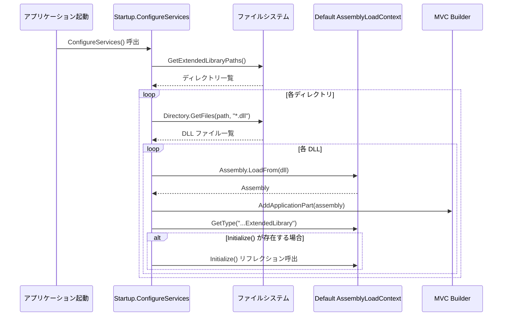
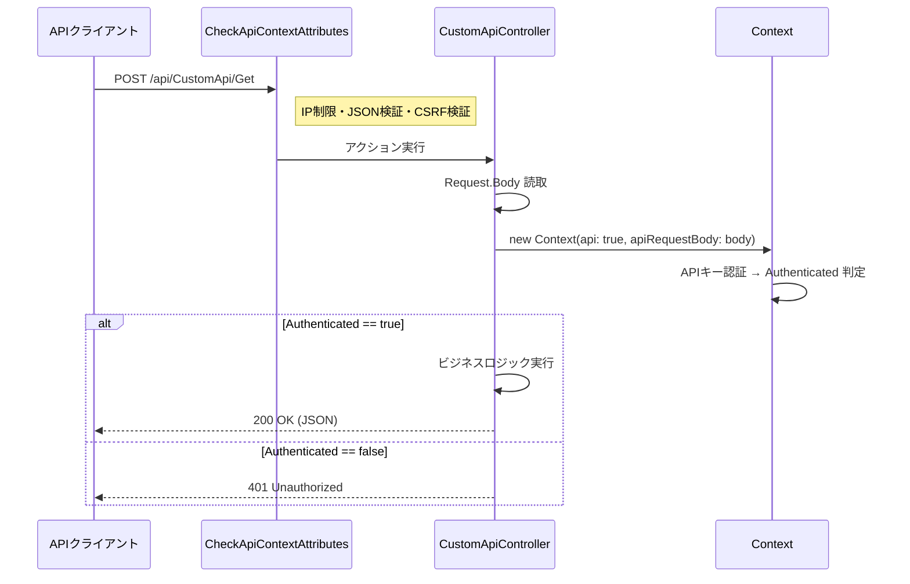
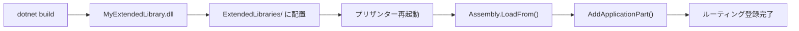
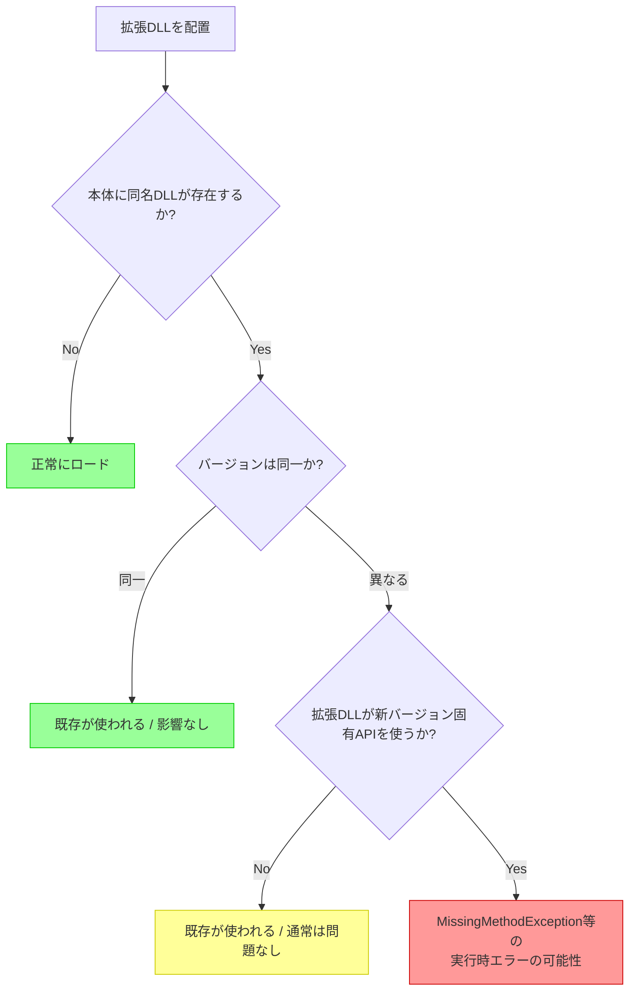

# 拡張ライブラリ（ExtendedLibrary）の仕様と使い方

プリザンターの拡張ライブラリ（ExtendedLibrary）機能の仕組み、Controller / ApiController からの利用経路、および DLL 読み込み時の影響を調査した。

<!-- START doctoc generated TOC please keep comment here to allow auto update -->
<!-- DON'T EDIT THIS SECTION, INSTEAD RE-RUN doctoc TO UPDATE -->

- [調査情報](#調査情報)
- [調査目的](#調査目的)
- [ExtendedLibraries（DLL プラグイン）の仕様](#extendedlibrariesdll-プラグインの仕様)
    - [DLL の配置パス](#dll-の配置パス)
    - [DLL のロードと初期化](#dll-のロードと初期化)
    - [ロード処理の特徴](#ロード処理の特徴)
    - [DLL の実装規約（インターフェース契約）](#dll-の実装規約インターフェース契約)
- [拡張ライブラリで Controller / ApiController を作成する方法](#拡張ライブラリで-controller--apicontroller-を作成する方法)
    - [前提知識](#前提知識)
    - [プロジェクト構成](#プロジェクト構成)
    - [パターン 1: Controller（MVC — 画面を返す）](#パターン-1-controllermvc--画面を返す)
    - [パターン 2: ApiController（JSON API）](#パターン-2-apicontrollerjson-api)
    - [Controller と ApiController の違いまとめ](#controller-と-apicontroller-の違いまとめ)
    - [ビルドとデプロイ](#ビルドとデプロイ)
- [同一 DLL・バージョン違い DLL の読み込み影響](#同一-dllバージョン違い-dll-の読み込み影響)
    - [Assembly.LoadFrom の動作原理](#assemblyloadfrom-の動作原理)
    - [影響分析](#影響分析)
    - [リスクまとめ](#リスクまとめ)
    - [推奨事項](#推奨事項)
- [結論](#結論)
- [関連ソースコード](#関連ソースコード)

<!-- END doctoc generated TOC please keep comment here to allow auto update -->

## 調査情報

| 調査日        | リポジトリ | ブランチ | タグ/バージョン | コミット    | 備考     |
| ------------- | ---------- | -------- | --------------- | ----------- | -------- |
| 2026年2月12日 | Pleasanter | main     |                 | `34f162a43` | 初回調査 |

## 調査目的

- ExtendedLibrary（DLL プラグイン）の仕組みを理解する
- Controller と ApiController の 2 つの呼び出し経路を明確にする
- 拡張ライブラリと本体で同一 DLL を読み込んだ場合の挙動を把握する
- バージョン違いの DLL を読み込んだ場合の影響を明らかにする

---

## ExtendedLibraries（DLL プラグイン）の仕様

### DLL の配置パス

DLL の配置先は **エントリアセンブリの実行ディレクトリ直下** の `ExtendedLibraries/` フォルダである。

```text
{アプリケーション実行ディレクトリ}/
└── ExtendedLibraries/          ← ベースパス
    ├── MyExtension.dll         ← 直接配置
    └── SubFolder/              ← サブディレクトリも走査対象
        └── AnotherExtension.dll
```

パスの解決ロジック（`Startup.cs` L293-L301）:

```csharp
private IEnumerable<string> GetExtendedLibraryPaths()
{
    var list = new List<string>();
    var basePath = Path.Combine(
        Path.GetDirectoryName(Assembly.GetEntryAssembly().Location),
        "ExtendedLibraries");
    if (Directory.Exists(basePath))
    {
        list.Add(basePath);
        list.AddRange(Directory.GetDirectories(basePath));
    }
    return list;
}
```

### DLL のロードと初期化

`Startup.ConfigureServices()` 内で以下の処理が実行される（`Startup.cs` L155-L165）:

```csharp
foreach (var path in GetExtendedLibraryPaths())
{
    if (Directory.Exists(path))
    {
        foreach (var assembly in Directory.GetFiles(path, "*.dll")
            .Select(dll => Assembly.LoadFrom(dll)).ToArray())
        {
            mvcBuilder.AddApplicationPart(assembly);
            assembly.GetType(
                "Implem.Pleasanter.NetCore.ExtendedLibrary.ExtendedLibrary")?
                .GetMethod("Initialize")?
                .Invoke(null, null);
        }
    }
}
```



### ロード処理の特徴

| 項目               | 詳細                                                                                     |
| ------------------ | ---------------------------------------------------------------------------------------- |
| ロード方式         | `Assembly.LoadFrom(dll)` — デフォルトの `AssemblyLoadContext` を使用                     |
| MVC 統合           | `AddApplicationPart(assembly)` で DLL 内の Controller が自動的にルーティングに追加される |
| 初期化呼出         | `Implem.Pleasanter.NetCore.ExtendedLibrary.ExtendedLibrary.Initialize()` を探して実行    |
| エラーハンドリング | **なし** — `try-catch` が存在せず、ロード失敗時はアプリケーション起動が中断する          |
| カスタム ALC       | **なし** — カスタム `AssemblyLoadContext` は使用されていない                             |

### DLL の実装規約（インターフェース契約）

拡張ライブラリ DLL に対する**インターフェースの強制はない**。以下の規約ベースの設計となっている。

```csharp
// 名前空間とクラス名（任意 — 存在すれば Initialize() が呼ばれる）
namespace Implem.Pleasanter.NetCore.ExtendedLibrary
{
    public class ExtendedLibrary
    {
        public static void Initialize()
        {
            // 起動時の初期化処理
        }
    }
}
```

| 要素                     | 必須 | 説明                                                              |
| ------------------------ | :--: | ----------------------------------------------------------------- |
| `ExtendedLibrary` クラス | 任意 | 存在しなくてもロードは成功する                                    |
| `Initialize()` メソッド  | 任意 | `ExtendedLibrary` クラスが存在する場合のみ呼出される              |
| ASP.NET Core Controller  | 任意 | DLL 内に `ControllerBase` 継承クラスがあれば MVC に自動登録される |

---

## 拡張ライブラリで Controller / ApiController を作成する方法

### 前提知識

`AddApplicationPart(assembly)` により、拡張 DLL 内に定義された ASP.NET Core の Controller クラスが**自動的に MVC ルーティングに登録**される。
プリザンター本体には 3 つのコントローラーパターンが存在するが、拡張ライブラリで使うのは主に以下の 2 パターンである。

| パターン      | 基底クラス       | 用途                      | 認証                          |
| ------------- | ---------------- | ------------------------- | ----------------------------- |
| Controller    | `Controller`     | 画面（HTML）を返す MVC 用 | `[Authorize]`（Cookie 認証）  |
| ApiController | `ControllerBase` | JSON を返す API 用        | `[AllowAnonymous]` + 独自認証 |

### プロジェクト構成

拡張ライブラリはクラスライブラリプロジェクトとして作成し、
本体と同じターゲットフレームワークでビルドする。

```text
MyExtendedLibrary/
├── MyExtendedLibrary.csproj
├── ExtendedLibrary.cs            ← 初期化クラス（任意）
├── Controllers/
│   └── CustomPageController.cs   ← MVC Controller
└── Api/
    └── CustomApiController.cs    ← ApiController
```

#### csproj の定義

```xml
<Project Sdk="Microsoft.NET.Sdk">
  <PropertyGroup>
    <!-- 本体と同じターゲットフレームワークを指定 -->
    <TargetFramework>net10.0</TargetFramework>
    <Nullable>disable</Nullable>
  </PropertyGroup>

  <ItemGroup>
    <!-- ASP.NET Core MVC の型を参照するために必要 -->
    <FrameworkReference Include="Microsoft.AspNetCore.App" />
  </ItemGroup>

  <ItemGroup>
    <!--
      本体の Context クラス等を使う場合はプロジェクト参照を追加。
      ビルド時に本体の DLL を出力先にコピーしないよう設定する。
    -->
    <ProjectReference
      Include="..\Implem.Pleasanter\Implem.Pleasanter.csproj"
      Private="false"
      ExcludeAssets="runtime" />
  </ItemGroup>
</Project>
```

> **重要**: `Private="false"` と `ExcludeAssets="runtime"` を指定することで、
> 本体が既にロード済みの DLL を拡張ライブラリの出力に含めない。
> これにより DLL 競合を防止できる。

#### Initialize クラス（任意）

```csharp
namespace Implem.Pleasanter.NetCore.ExtendedLibrary
{
    public class ExtendedLibrary
    {
        public static void Initialize()
        {
            // 起動時に1回だけ呼ばれる
            // ロギング、設定読み込みなどの初期化処理を記述
        }
    }
}
```

### パターン 1: Controller（MVC — 画面を返す）

画面を返す MVC Controller を拡張ライブラリに追加する例。
`[Authorize]` 属性により、Cookie 認証済みのユーザーのみアクセスできる。

```csharp
using Microsoft.AspNetCore.Authorization;
using Microsoft.AspNetCore.Mvc;
using Implem.Pleasanter.Libraries.Requests;
using Implem.Pleasanter.Libraries.Responses;

namespace MyExtendedLibrary.Controllers
{
    [Authorize]
    public class CustomPageController : Controller
    {
        // GET /CustomPage/Index
        [HttpGet]
        public ActionResult Index()
        {
            // Context を生成（MVC用 — 引数なしで
            // セッション・ユーザー情報を自動取得）
            var context = new Context();
            if (!context.HasPermission)
            {
                return Redirect("/errors/403");
            }
            // 独自のビジネスロジック
            var data = GetCustomData(context);
            return Content(
                BuildHtmlResponse(context, data),
                "text/html");
        }

        // POST /CustomPage/Execute
        [HttpPost]
        public ActionResult Execute()
        {
            var context = new Context();
            if (!context.HasPermission)
            {
                return Redirect("/errors/403");
            }
            // POST処理
            var result = ExecuteCustomLogic(context);
            return Json(new { success = true, data = result });
        }

        private object GetCustomData(Context context)
        {
            // context.UserId, context.TenantId 等を使って
            // 必要なデータを取得
            return new { Message = "Hello from ExtendedLibrary" };
        }

        private string BuildHtmlResponse(
            Context context, object data)
        {
            return $@"
<!DOCTYPE html>
<html>
<head><title>Custom Page</title></head>
<body>
  <h1>拡張ページ</h1>
  <p>ユーザー: {context.UserName}</p>
</body>
</html>";
        }

        private object ExecuteCustomLogic(Context context)
        {
            return new { Status = "OK" };
        }
    }
}
```

#### ルーティング

MVC Controller は **Conventional Routing** で自動登録される。
プリザンター本体の `Startup.Configure()` で定義されたルートテンプレートに従い、
`/{Controller}/{Action}` の形式でアクセス可能になる。

| URL                        | アクション                       |
| -------------------------- | -------------------------------- |
| `GET /CustomPage/Index`    | `CustomPageController.Index()`   |
| `POST /CustomPage/Execute` | `CustomPageController.Execute()` |

#### Context の生成

MVC Controller では `new Context()` を引数なしで呼び出す。
これにより以下の情報が自動的にセットされる:

| プロパティ              | 説明                                  |
| ----------------------- | ------------------------------------- |
| `context.UserId`        | ログインユーザーの ID                 |
| `context.TenantId`      | テナント ID                           |
| `context.UserName`      | ユーザー名                            |
| `context.SiteId`        | 現在のサイト ID（リクエストから推定） |
| `context.HasPermission` | アクセス権限                          |

### パターン 2: ApiController（JSON API）

JSON を返す API Controller を拡張ライブラリに追加する例。
`[CheckApiContextAttributes]` フィルターで IP 制限・JSON 検証・CSRF トークン検証が行われ、
認証は `context.Authenticated`（API キー認証）で独自にチェックする。

```csharp
using System.IO;
using Microsoft.AspNetCore.Authorization;
using Microsoft.AspNetCore.Mvc;
using Implem.Pleasanter.Libraries.Requests;
using Implem.Pleasanter.Libraries.Responses;
using Implem.Pleasanter.Models;
using Implem.PleasanterFilters;

namespace MyExtendedLibrary.Api
{
    [CheckApiContextAttributes]
    [AllowAnonymous]
    [ApiController]
    [Route("api/[controller]")]
    public class CustomApiController : ControllerBase
    {
        // POST /api/CustomApi/Get
        [HttpPost("Get")]
        public ContentResult Get()
        {
            var body = default(string);
            using (var reader = new StreamReader(Request.Body))
                body = reader.ReadToEnd();
            var context = new Context(
                sessionStatus:
                    User?.Identity?.IsAuthenticated == true,
                sessionData:
                    User?.Identity?.IsAuthenticated == true,
                apiRequestBody: body,
                contentType: Request.ContentType,
                api: true);
            var log = new SysLogModel(context: context);
            var result = context.Authenticated
                ? GetData(context)
                : ApiResults.Unauthorized(context: context);
            log.Finish(
                context: context,
                responseSize: result.Content.Length);
            return result.ToHttpResponse(request: Request);
        }

        // POST /api/CustomApi/Execute
        [HttpPost("Execute")]
        public ContentResult Execute()
        {
            var body = default(string);
            using (var reader = new StreamReader(Request.Body))
                body = reader.ReadToEnd();
            var context = new Context(
                sessionStatus:
                    User?.Identity?.IsAuthenticated == true,
                sessionData:
                    User?.Identity?.IsAuthenticated == true,
                apiRequestBody: body,
                contentType: Request.ContentType,
                api: true);
            var log = new SysLogModel(context: context);
            var result = context.Authenticated
                ? ExecuteLogic(context)
                : ApiResults.Unauthorized(context: context);
            log.Finish(
                context: context,
                responseSize: result.Content.Length);
            return result.ToHttpResponse(request: Request);
        }

        private ContentResultInheritance GetData(
            Context context)
        {
            // 独自のデータ取得ロジック
            return ApiResults.Success(
                id: 0,
                message: Displays.ReadOnlyBecausePreviousVer(
                    context: context));
        }

        private ContentResultInheritance ExecuteLogic(
            Context context)
        {
            // 独自のビジネスロジック
            return ApiResults.Success(
                id: 0,
                message: Displays.Updated(
                    context: context));
        }
    }
}
```

#### ルーティング

ApiController は **Attribute Routing** で登録される。
`[Route("api/[controller]")]` と `[HttpPost("...")]` の組み合わせでルートが決定する。

| URL                           | アクション                      |
| ----------------------------- | ------------------------------- |
| `POST /api/CustomApi/Get`     | `CustomApiController.Get()`     |
| `POST /api/CustomApi/Execute` | `CustomApiController.Execute()` |

#### Context の生成

ApiController では認証情報を明示的に渡す必要がある:

```csharp
var context = new Context(
    sessionStatus: User?.Identity?.IsAuthenticated == true,
    sessionData:   User?.Identity?.IsAuthenticated == true,
    apiRequestBody: body,
    contentType:    Request.ContentType,
    api:            true);
```

| パラメータ       | 説明                                |
| ---------------- | ----------------------------------- |
| `sessionStatus`  | Cookie ログイン済みなら `true`      |
| `sessionData`    | Cookie ログイン済みなら `true`      |
| `apiRequestBody` | リクエストボディの JSON 文字列      |
| `contentType`    | `Request.ContentType`               |
| `api`            | `true` を指定（API キー認証モード） |

#### 認証フロー



### Controller と ApiController の違いまとめ

| 項目             | Controller（MVC）                  | ApiController                                      |
| ---------------- | ---------------------------------- | -------------------------------------------------- |
| 基底クラス       | `Controller`                       | `ControllerBase`                                   |
| 認証属性         | `[Authorize]`                      | `[AllowAnonymous]` + `[CheckApiContextAttributes]` |
| ルーティング     | Conventional（`/{ctrl}/{action}`） | Attribute（`[Route("api/[controller]")]`）         |
| Context 生成     | `new Context()`                    | `new Context(api: true, ...)`                      |
| 認証方式         | Cookie 認証（ASP.NET Core）        | API キー認証（`context.Authenticated`）            |
| レスポンス形式   | HTML / ActionResult                | JSON / ContentResult                               |
| ログ記録         | 不要（ミドルウェアで処理）         | `SysLogModel` を自前で記録                         |
| リクエストボディ | モデルバインディング               | `StreamReader` で手動読取                          |

### ビルドとデプロイ



1. `dotnet build` で DLL をビルド
2. 出力された `MyExtendedLibrary.dll` を
   `{プリザンター実行ディレクトリ}/ExtendedLibraries/` に配置
3. プリザンターを再起動
4. `Startup.ConfigureServices()` で自動的にロード・登録される

> **注意**: 本体のプロジェクト参照で
> `Private="false"` を指定していれば、
> 拡張ライブラリの出力フォルダに本体の
> DLL はコピーされない。
> 出力フォルダから `MyExtendedLibrary.dll`
> **のみ**を `ExtendedLibraries/` に配置すること。
>
> **認証基盤の詳細**:
> プリザンターの認証基盤（Cookie 認証・API キー認証・権限チェック・フィルタ）の
> 内部実装については
> [認証基盤の詳細](../01-認証・権限/003-認証基盤.md) を参照すること。

---

## 同一 DLL・バージョン違い DLL の読み込み影響

### Assembly.LoadFrom の動作原理

プリザンターは `Assembly.LoadFrom(dll)` を使用し、**デフォルトの `AssemblyLoadContext`** に DLL をロードする。カスタム `AssemblyLoadContext` は使用されていない。

#### .NET の Assembly.LoadFrom の仕様

| シナリオ                           | 動作                                                                                              |
| ---------------------------------- | ------------------------------------------------------------------------------------------------- |
| 同一アセンブリ（同一バージョン）   | 既にロード済みの場合、**既存のアセンブリが返される**（再ロードされない）                          |
| 同一アセンブリ名・異なるバージョン | **バインディング競合**が発生する可能性がある。先にロードされたバージョンが優先される              |
| 本体が依存する DLL と同一名の DLL  | 本体の依存ライブラリが先にロード済みのため、拡張側の DLL は**無視される**か、型の不一致が発生する |
| 本体が依存しない新規 DLL           | 正常にロードされ、使用可能                                                                        |

### 影響分析

#### ケース 1: 本体と同一の DLL を配置

```text
本体: Newtonsoft.Json.dll v13.0.1（起動時にロード済み）
拡張: ExtendedLibraries/Newtonsoft.Json.dll v13.0.1（同一バージョン）
```

**結果**: `Assembly.LoadFrom` は同一 AssemblyName を検出し、**既にロード済みのアセンブリを返す**。実質的に拡張側の DLL は無視される。機能上の影響はない。

#### ケース 2: 本体より新しいバージョンの DLL を配置

```text
本体: Newtonsoft.Json.dll v13.0.1（起動時にロード済み）
拡張: ExtendedLibraries/Newtonsoft.Json.dll v14.0.1（新しいバージョン）
```

**結果**: デフォルト `AssemblyLoadContext` の動作により、**先にロード済みの v13.0.1 が使用され続ける**。
拡張ライブラリが v14.0.1 固有の API を使用している場合、
実行時に `MissingMethodException` や `TypeLoadException` が発生する可能性がある。

#### ケース 3: 本体より古いバージョンの DLL を配置

```text
本体: Newtonsoft.Json.dll v13.0.1（起動時にロード済み）
拡張: ExtendedLibraries/Newtonsoft.Json.dll v12.0.0（古いバージョン）
```

**結果**: ケース 2 と同様に、**先にロード済みの v13.0.1 が使用される**。通常は上位互換性により問題は発生しないが、破壊的変更がある場合は影響を受ける。

#### ケース 4: ロード自体が失敗する場合

```text
拡張: ExtendedLibraries/BrokenAssembly.dll（不正な DLL）
```

**結果**: `Assembly.LoadFrom` で例外が発生し、**try-catch がないためアプリケーションの起動が中断される**。

### リスクまとめ



| リスクレベル | シナリオ                             | 影響                       |
| ------------ | ------------------------------------ | -------------------------- |
| 🔴 高        | 不正な DLL を配置                    | 起動失敗（try-catch なし） |
| 🔴 高        | 新バージョン固有 API に依存する DLL  | 実行時例外                 |
| 🟡 中        | 本体と異なるバージョンの共通依存 DLL | 暗黙の型不一致の可能性     |
| 🟢 低        | 本体と同一バージョンの DLL           | 影響なし（既存が使われる） |
| 🟢 低        | 本体が依存しない新規 DLL             | 正常動作                   |

### 推奨事項

1. **拡張ライブラリには独自の DLL のみを含める** — 本体が既に依存しているライブラリは含めない
2. **本体と同じフレームワークバージョンでビルドする** — ターゲットフレームワークを合わせることで型の不一致を防ぐ
3. **配置前にテスト環境で検証する** — エラーハンドリングがないため、本番環境での障害リスクがある
4. **サブディレクトリ分離を活用する** — 拡張ごとにサブディレクトリに分離して管理する（ただしアセンブリ分離にはならない）

---

## 結論

| 項目                     | 結果                                                                                                  |
| ------------------------ | ----------------------------------------------------------------------------------------------------- |
| ExtendedLibraries の性質 | `AddApplicationPart` で外部 DLL 内の Controller を MVC パイプラインに動的追加する仕組み               |
| Controller の作成方法    | `Controller` を継承。グローバルフィルタで Cookie 認証が自動適用される                                 |
| ApiController の作成方法 | `ControllerBase` を継承し `[ApiController]` + `[Route]` + `[CheckApiContextAttributes]`。API キー認証 |
| 認証基盤                 | 詳細は [認証基盤の詳細](../01-認証・権限/003-認証基盤.md) を参照                                      |
| DLL 衝突リスク           | デフォルト ALC でロードされ、同名 DLL は先行分が優先。カスタム ALC なし、try-catch なし               |
| デプロイ上の注意         | 拡張 DLL のみを配置し本体依存ライブラリは含めない。不正 DLL は起動失敗を招くため事前検証必須          |

---

## 関連ソースコード

| ファイル                       | 内容                 |
| ------------------------------ | -------------------- |
| `Implem.Pleasanter/Startup.cs` | DLL ロード・MVC 登録 |
