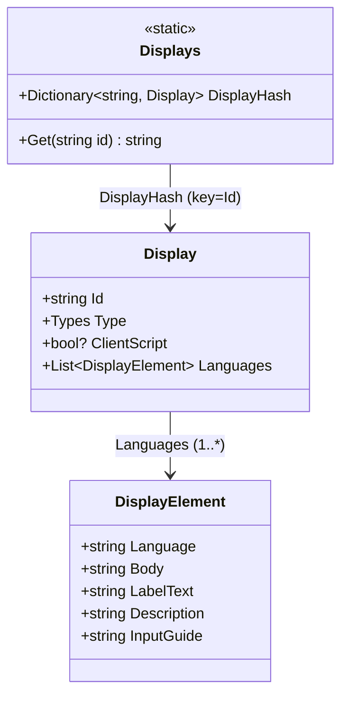
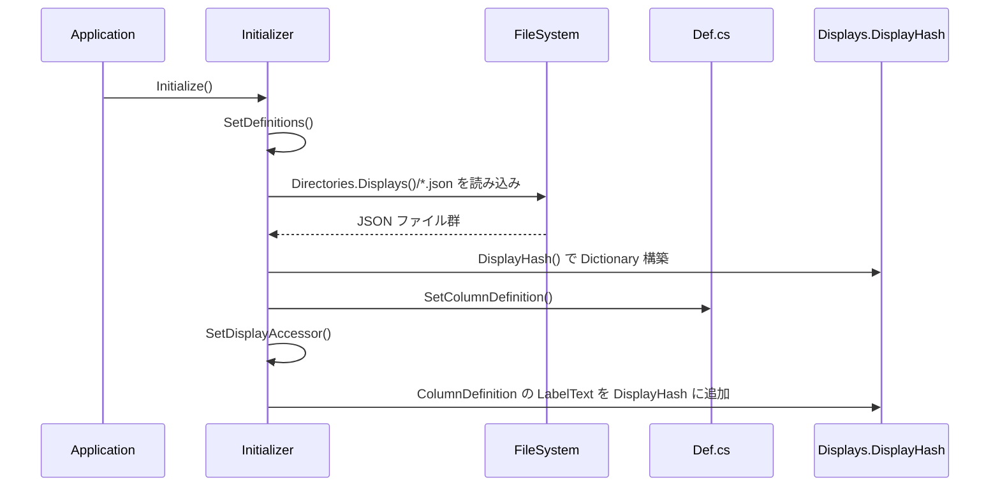
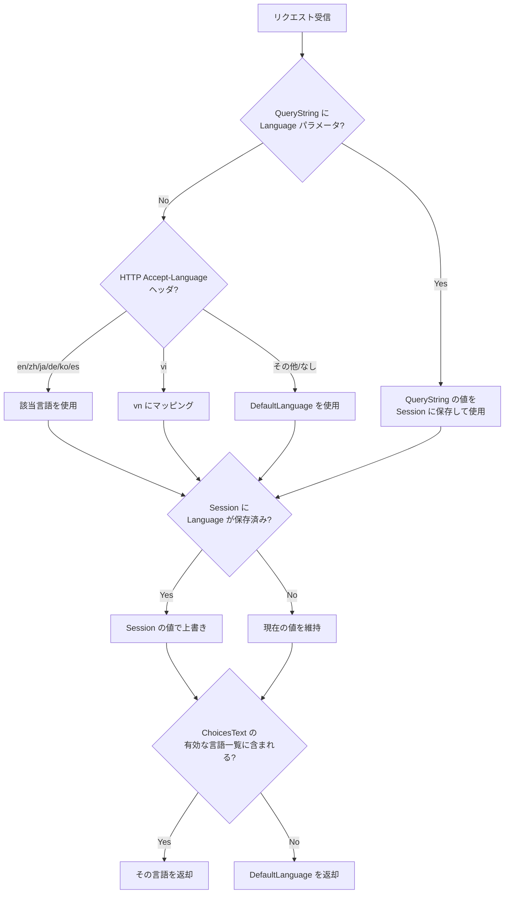
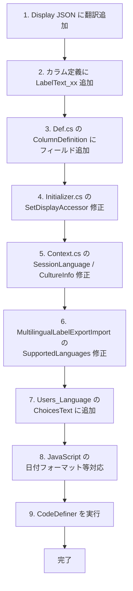
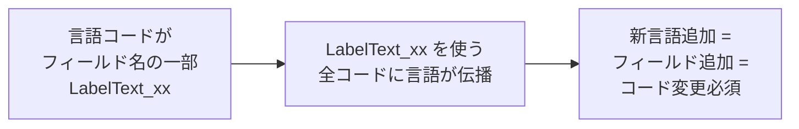
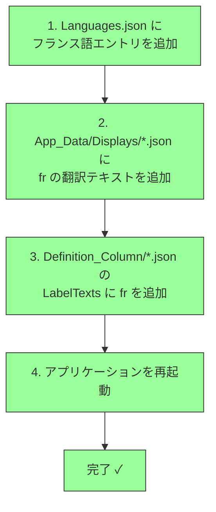
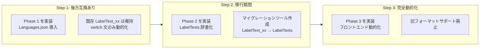
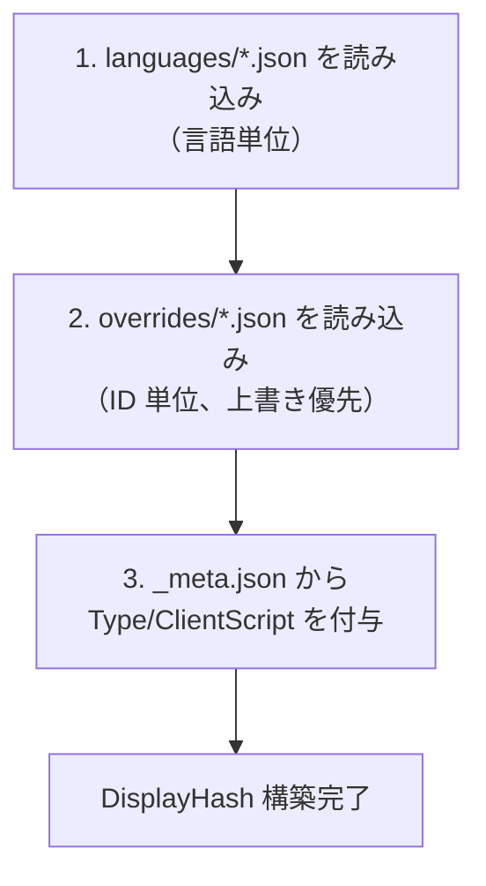

# 多言語対応（i18n）の実装

プリザンターにおける多言語対応（国際化 / i18n）の仕組みを調査し、DisplayAccessor・言語定義ファイル・言語切り替えロジック・CodeDefiner による自動生成の全体像を整理する。

<!-- START doctoc generated TOC please keep comment here to allow auto update -->
<!-- DON'T EDIT THIS SECTION, INSTEAD RE-RUN doctoc TO UPDATE -->

- [調査情報](#調査情報)
- [調査目的](#調査目的)
- [対応言語一覧](#対応言語一覧)
- [1. DisplayAccessor の仕組み](#1-displayaccessor-の仕組み)
    - [1.1 データモデル（3 クラス構成）](#11-データモデル3-クラス構成)
    - [1.2 クラス関連図](#12-クラス関連図)
- [2. 言語定義ファイル](#2-言語定義ファイル)
    - [2.1 Display JSON ファイル](#21-display-json-ファイル)
    - [2.2 カラム定義ファイル（Definition_Column）](#22-カラム定義ファイルdefinition_column)
- [3. DisplayHash の初期化フロー](#3-displayhash-の初期化フロー)
    - [3.1 初期化の全体フロー](#31-初期化の全体フロー)
    - [3.2 DisplayHash() メソッド](#32-displayhash-メソッド)
    - [3.3 SetDisplayAccessor() メソッド](#33-setdisplayaccessor-メソッド)
- [4. 言語切り替えの仕組み](#4-言語切り替えの仕組み)
    - [4.1 サーバーパラメータによるデフォルト言語設定](#41-サーバーパラメータによるデフォルト言語設定)
    - [4.2 SetLanguage() メソッド](#42-setlanguage-メソッド)
    - [4.3 Context.Language の決定ロジック](#43-contextlanguage-の決定ロジック)
    - [4.4 CultureInfo のマッピング](#44-cultureinfo-のマッピング)
- [5. 表示文字列の取得ロジック](#5-表示文字列の取得ロジック)
    - [5.1 サーバーサイド（Displays.Get）](#51-サーバーサイドdisplaysget)
    - [5.2 多言語ラベル（DisplayElement 拡張）](#52-多言語ラベルdisplayelement-拡張)
    - [5.3 クライアントサイド（JavaScript）](#53-クライアントサイドjavascript)
- [6. CodeDefiner によるコード自動生成](#6-codedefiner-によるコード自動生成)
    - [6.1 Display コード生成](#61-display-コード生成)
    - [6.2 自動生成される主なコード](#62-自動生成される主なコード)
- [7. 多言語ラベルのエクスポート/インポート](#7-多言語ラベルのエクスポートインポート)
    - [CSV フォーマット](#csv-フォーマット)
- [8. 新しい言語を追加する手順](#8-新しい言語を追加する手順)
    - [変更箇所一覧](#変更箇所一覧)
    - [追加手順のフロー](#追加手順のフロー)
- [9. ハードコーディング箇所の分析](#9-ハードコーディング箇所の分析)
    - [9.1 ハードコーディング箇所の全体マップ](#91-ハードコーディング箇所の全体マップ)
    - [9.2 ハードコーディング箇所の詳細](#92-ハードコーディング箇所の詳細)
    - [9.3 根本原因の構造](#93-根本原因の構造)
- [10. 改修提案：JSON ベースの動的言語管理](#10-改修提案json-ベースの動的言語管理)
    - [10.1 改修の方針](#101-改修の方針)
    - [10.2 言語設定ファイルの新設](#102-言語設定ファイルの新設)
    - [10.3 改修対象と変更内容](#103-改修対象と変更内容)
    - [10.4 ユーザが新言語を追加する手順（改修後）](#104-ユーザが新言語を追加する手順改修後)
    - [10.5 改修の影響範囲と工数見積もり](#105-改修の影響範囲と工数見積もり)
    - [10.6 段階的導入の推奨](#106-段階的導入の推奨)
- [11. Display JSON の構成方式の比較：ID 単位 vs 言語単位](#11-display-json-の構成方式の比較id-単位-vs-言語単位)
    - [11.1 現行方式の定量データ](#111-現行方式の定量データ)
    - [11.2 現行方式（ID 単位 = 1 ID 1 ファイル）](#112-現行方式id-単位--1-id-1-ファイル)
    - [11.3 提案方式（言語単位 = 1 言語 1 ファイル）](#113-提案方式言語単位--1-言語-1-ファイル)
    - [11.4 比較表](#114-比較表)
    - [11.5 各方式が有利なユースケース](#115-各方式が有利なユースケース)
    - [11.6 ハイブリッド方式の検討](#116-ハイブリッド方式の検討)
    - [11.7 改修時の読み込みロジック変更](#117-改修時の読み込みロジック変更)
    - [11.8 推奨と判断基準](#118-推奨と判断基準)
- [結論](#結論)
- [関連ソースコード](#関連ソースコード)

<!-- END doctoc generated TOC please keep comment here to allow auto update -->

## 調査情報

| 調査日        | リポジトリ | ブランチ | タグ/バージョン | コミット    | 備考     |
| ------------- | ---------- | -------- | --------------- | ----------- | -------- |
| 2026年2月12日 | Pleasanter | main     |                 | `34f162a43` | 初回調査 |

## 調査目的

- プリザンターが多言語をどのように管理・切り替えしているかの全体像を把握する
- 新しい言語を追加するために必要な変更箇所を特定する
- CodeDefiner による Display コード自動生成の仕組みを理解する

---

## 対応言語一覧

プリザンターが現在対応している言語は以下の 7 言語である。

| コード | 言語       | CultureInfo | 備考                                         |
| ------ | ---------- | ----------- | -------------------------------------------- |
| (なし) | 英語       | `en-US`     | デフォルト（`Language` が空の要素）          |
| `zh`   | 中国語     | `zh-CN`     |                                              |
| `ja`   | 日本語     | `ja-JP`     |                                              |
| `de`   | ドイツ語   | `de-DE`     |                                              |
| `ko`   | 韓国語     | `ko-KR`     |                                              |
| `es`   | スペイン語 | `es-ES`     |                                              |
| `vn`   | ベトナム語 | `vi-VN`     | HTTP の `Accept-Language` では `vi` にマップ |

> `MultilingualLabelExportImport.cs` の `SupportedLanguages` リストでも同一の 7 言語が定義されている。

---

## 1. DisplayAccessor の仕組み

### 1.1 データモデル（3 クラス構成）

`Implem.DisplayAccessor` プロジェクトには、表示文字列を管理するための 3 つのクラスが定義されている。

#### Display クラス

```csharp
// Implem.DisplayAccessor/Display.cs
public class Display
{
    public string Id;
    public Displays.Types Type;
    public bool? ClientScript;
    public List<DisplayElement> Languages;
}
```

| フィールド     | 説明                                                     |
| -------------- | -------------------------------------------------------- |
| `Id`           | 表示文字列の一意識別子（例: `"Add"`, `"Login"`）         |
| `Type`         | メッセージ種別（`Normal`, `Error`, `Warning` 等の enum） |
| `ClientScript` | クライアントスクリプトで使用するかどうかのフラグ         |
| `Languages`    | 各言語の翻訳テキストを格納する `DisplayElement` のリスト |

#### DisplayElement クラス

```csharp
// Implem.DisplayAccessor/DisplayElement.cs
public class DisplayElement
{
    public string Language;
    public string Body;
    public string LabelText;
    public string Description;
    public string InputGuide;
}
```

| フィールド    | 説明                                                        |
| ------------- | ----------------------------------------------------------- |
| `Language`    | 言語コード（`"ja"`, `"zh"` 等）。英語の場合は `null`/空文字 |
| `Body`        | 表示テキスト本文                                            |
| `LabelText`   | 多言語ラベルテキスト（カラムの多言語対応で使用）            |
| `Description` | 説明文（カラムの多言語対応で使用）                          |
| `InputGuide`  | 入力ガイド（カラムの多言語対応で使用）                      |

#### Displays 静的クラス

```csharp
// Implem.DisplayAccessor/Displays.cs
public static class Displays
{
    public enum Types : int
    {
        Normal = 110,
        Date = 120,
        DateFormat = 130,
        Success = 210,
        Information = 220,
        Warning = 230,
        Error = 240,
        Confirmation = 310,
        Validation = 410
    }

    public static Dictionary<string, Display> DisplayHash;

    public static string Get(string id)
    {
        return DisplayHash[id].Languages.FirstOrDefault().Body;
    }
}
```

`DisplayHash` は `Dictionary<string, Display>` 型で、すべての表示文字列を ID をキーにして保持する。`Get()` メソッドは最初の言語（英語）のテキストを返す簡易メソッド。

### 1.2 クラス関連図



---

## 2. 言語定義ファイル

### 2.1 Display JSON ファイル

**場所**: `Implem.Pleasanter/App_Data/Displays/`

1 つの表示文字列につき 1 つの JSON ファイルが存在する（約 900 ファイル以上）。

#### ファイル構造の例（Add.json）

```json
{
    "Id": "Add",
    "Type": 110,
    "Languages": [
        {
            "Body": "Add"
        },
        {
            "Language": "zh",
            "Body": "添加"
        },
        {
            "Language": "ja",
            "Body": "追加"
        },
        {
            "Language": "de",
            "Body": "Hinzufügen"
        },
        {
            "Language": "ko",
            "Body": "추가"
        },
        {
            "Language": "es",
            "Body": "Añadir"
        },
        {
            "Language": "vn",
            "Body": "Thêm mới"
        }
    ]
}
```

#### JSON 構造のルール

| 項目                         | 説明                                                      |
| ---------------------------- | --------------------------------------------------------- |
| `Id`                         | ファイル名（拡張子なし）と一致する識別子                  |
| `Type`                       | `Displays.Types` enum の整数値                            |
| `Languages` 配列の最初の要素 | **英語**（`Language` フィールドなし = デフォルト言語）    |
| `Languages` 配列の後続要素   | 各言語の翻訳（`Language` フィールドに言語コードを指定）   |
| `ClientScript`（オプション） | `true` の場合、クライアント側の JavaScript に埋め込まれる |

### 2.2 カラム定義ファイル（Definition_Column）

**場所**: `Implem.Pleasanter/App_Data/Definitions/Definition_Column/`

カラム定義ファイル（CSV / XLS 形式）には、各カラムのラベルテキストが言語別カラムとして定義されている。

`Def.cs` の `ColumnDefinition` クラスに以下のフィールドが存在する:

```csharp
public string LabelText;      // 日本語ラベル（デフォルト）
public string LabelText_en;   // 英語ラベル
public string LabelText_zh;   // 中国語ラベル
public string LabelText_de;   // ドイツ語ラベル
public string LabelText_ko;   // 韓国語ラベル
public string LabelText_es;   // スペイン語ラベル
public string LabelText_vn;   // ベトナム語ラベル
```

> **注意**: `LabelText`（接尾辞なし）が日本語、`LabelText_en` が英語という命名になっている点に留意。

---

## 3. DisplayHash の初期化フロー

### 3.1 初期化の全体フロー



### 3.2 DisplayHash() メソッド

`Initializer.cs` の `DisplayHash()` メソッドが `App_Data/Displays/` 配下の全 JSON ファイルを読み込み、`Dictionary<string, Display>` を構築する。

```csharp
// Implem.DefinitionAccessor/Initializer.cs
private static Dictionary<string, Display> DisplayHash()
{
    var hash = new Dictionary<string, Display>();
    new DirectoryInfo(Directories.Displays()).GetFiles("*.json").ForEach(file =>
    {
        var data = Files.Read(file.FullName).Deserialize<Display>();
        hash.Add(data.Id, data);
    });
    return hash;
}
```

### 3.3 SetDisplayAccessor() メソッド

カラム定義（`ColumnDefinition`）のラベルテキストを `DisplayHash` に追加登録する。これにより、カラム名もシステム UI の表示文字列として言語切り替え対象になる。

```csharp
// Implem.DefinitionAccessor/Initializer.cs（抜粋・整形）
private static void SetDisplayAccessor()
{
    Def.ColumnDefinitionCollection
        .Where(o => !o.Base)
        .Select(o => new
        {
            o.Id,
            En = o.LabelText_en,
            Zh = o.LabelText_zh,
            Ja = o.LabelText,        // 日本語は LabelText（接尾辞なし）
            De = o.LabelText_de,
            Ko = o.LabelText_ko,
            Es = o.LabelText_es,
            Vn = o.LabelText_vn
        })
        // ... テーブル名も追加 ...
        .Where(o => !Displays.DisplayHash.ContainsKey(o.Id))
        .ForEach(o => Displays.DisplayHash.UpdateOrAdd(
            o.Id, new Display
            {
                Id = o.Id,
                Languages = new List<DisplayElement>
                {
                    new DisplayElement { Body = o.En },
                    new DisplayElement { Language = "zh", Body = o.Zh },
                    new DisplayElement { Language = "ja", Body = o.Ja },
                    new DisplayElement { Language = "de", Body = o.De },
                    new DisplayElement { Language = "ko", Body = o.Ko },
                    new DisplayElement { Language = "es", Body = o.Es },
                    new DisplayElement { Language = "vn", Body = o.Vn }
                }
            }));
}
```

---

## 4. 言語切り替えの仕組み

### 4.1 サーバーパラメータによるデフォルト言語設定

**ファイル**: `Implem.Pleasanter/App_Data/Parameters/Service.json`

```json
{
    "DefaultLanguage": "en"
}
```

`Parameters.Service.DefaultLanguage` として読み込まれ、Context の初期値として使用される。

**対応クラス**: `Implem.ParameterAccessor/Parts/Service.cs`

```csharp
public class Service
{
    public string DefaultLanguage;
    // ...
}
```

### 4.2 SetLanguage() メソッド

`Initializer.cs` の `SetLanguage()` で、`Users_Language` カラムのデフォルト値を設定する。

```csharp
// Implem.DefinitionAccessor/Initializer.cs
private static void SetLanguage()
{
    var language = Def.ColumnTable.Users_Language.ChoicesText
        .SplitReturn()
        .Select(o => o.Split_1st())
        .FirstOrDefault(o => o == Parameters.Service.DefaultLanguage) ?? "en";
    Def.ColumnDefinitionCollection
        .FirstOrDefault(o => o.Id == "Users_Language").Default = language;
}
```

### 4.3 Context.Language の決定ロジック

`Context.cs` の `SessionLanguage()` メソッドが、リクエストごとの言語を決定する。

```csharp
// Implem.Pleasanter/Libraries/Requests/Context.cs
public string Language { get; set; } = Parameters.Service.DefaultLanguage;
```

#### 言語選択の優先順位



#### Accept-Language のマッピング（Context.cs）

```csharp
var lang = HttpAcceptLanguage()?.Split_1st('-');
switch (lang)
{
    case "en":
    case "zh":
    case "ja":
    case "de":
    case "ko":
    case "es":
        language = lang;
        break;
    case "vi":
        language = "vn";  // vi → vn にマッピング
        break;
    default:
        language = Parameters.Service?.DefaultLanguage;
        break;
}
```

### 4.4 CultureInfo のマッピング

通貨・数値フォーマットには `CultureInfo` を使用する。

```csharp
// Implem.Pleasanter/Libraries/Requests/Context.cs
public CultureInfo CultureInfoCurrency(string language)
{
    switch (language)
    {
        case "en": return new CultureInfo("en-US");
        case "zh": return new CultureInfo("zh-CN");
        case "ja": return new CultureInfo("ja-JP");
        case "de": return new CultureInfo("de-DE");
        case "ko": return new CultureInfo("ko-KR");
        case "es": return new CultureInfo("es-ES");
        case "vn": return new CultureInfo("vi-VN");
        default:   return new CultureInfo(language);
    }
}
```

---

## 5. 表示文字列の取得ロジック

### 5.1 サーバーサイド（Displays.Get）

`Implem.Pleasanter/Libraries/Responses/Displays.cs` に定義された `Get()` メソッドが、言語に応じた表示文字列を返す。

```csharp
// Implem.Pleasanter/Libraries/Responses/Displays.cs
public static Dictionary<string, string> DisplayHash = GetDisplayHash();

private static Dictionary<string, string> GetDisplayHash()
{
    var data = new Dictionary<string, string>();
    DisplayAccessor.Displays.DisplayHash.ForEach(display =>
        display.Value.Languages.ForEach(element =>
            data.Add(
                display.Key + (!element.Language.IsNullOrEmpty()
                    ? "_" + element.Language
                    : string.Empty),
                element.Body)));
    // 拡張カラムの LabelText も追加
    return data;
}
```

この `DisplayHash` は **フラット化された辞書** であり、以下のようなキーで管理される:

| キー例   | 値の例       | 説明                   |
| -------- | ------------ | ---------------------- |
| `Add`    | `Add`        | 英語（言語接尾辞なし） |
| `Add_ja` | `追加`       | 日本語                 |
| `Add_zh` | `添加`       | 中国語                 |
| `Add_de` | `Hinzufügen` | ドイツ語               |

#### 検索ロジック

```csharp
public static string Get(string id, string language, params string[] data)
{
    var kay = id + "_" + language;   // 例: "Add_ja"
    if (DisplayHash.ContainsKey(kay))
    {
        screen = DisplayHash[kay];   // 言語付きキーで見つかればそれを返す
    }
    else if (DisplayHash.ContainsKey(id))
    {
        screen = DisplayHash[id];    // フォールバック: 英語
    }
    return data?.Any() == true ? screen.Params(data) : screen;
}
```

### 5.2 多言語ラベル（DisplayElement 拡張）

`DisplayElement` の `LabelText`, `Description`, `InputGuide` は、サイト設定でカラムの多言語ラベルを定義する際に使用される。

```csharp
// Implem.Pleasanter/Libraries/Settings/ColumnUtilities.cs
public static string GetMultilingualLabelText(string target, Context context)
{
    return !target.IsNullOrEmpty()
        ? Jsons.Deserialize<List<DisplayElement>>(target)
            ?.Where(o => o.Language == context.Language)
            ?.FirstOrDefault()?.LabelText ?? string.Empty
        : string.Empty;
}
```

### 5.3 クライアントサイド（JavaScript）

フロントエンドでは、hidden フィールド `#Language` から現在の言語を取得し、日付フォーマット等を切り替えている。

```javascript
// wwwroot/components/components_*.js（抜粋・整形）
var v = document.getElementById('Language').value;
switch (v) {
    case 'zh':
    case 'ja':
    case 'es':
    case 'vn':
        // Y/m/d 形式
        break;
    case 'ko':
        // Y.m.d. 形式
        break;
    case 'de':
        // Y.m.d 形式
        break;
}
```

---

## 6. CodeDefiner によるコード自動生成

### 6.1 Display コード生成

`Implem.CodeDefiner/Functions/AspNetMvc/CSharp/Parts/Display.cs` が、`DisplayHash` の全エントリをイテレーションし、コードテンプレートのプレースホルダーを置換してコードを生成する。

```csharp
// Implem.CodeDefiner/Functions/AspNetMvc/CSharp/Parts/Display.cs
internal static void SetCodeCollection(
    CodeDefinition codeDefinition,
    List<string> codeCollection,
    DataContainer dataContainer)
{
    DisplayAccessor.Displays.DisplayHash
        .Select(o => o.Value)
        .ForEach(display => display.Languages
            .Where(element => !CheckExclude(codeDefinition, display, element))
            .ForEach(element =>
                Creators.SetCodeCollection(
                    ref code, codeCollection, codeDefinition, dataContainer,
                    () => ReplaceCode(ref code, display, element))));
}
```

#### プレースホルダー置換

| プレースホルダー          | 置換内容                                    |
| ------------------------- | ------------------------------------------- |
| `#DisplayId#`             | `Id` + `"_" + Language`（英語は接尾辞なし） |
| `#DisplayContent#`        | `Body`（表示テキスト）                      |
| `#DisplayCssClass#`       | Type から CSS クラスを決定                  |
| `#DisplayContentEncoded#` | HTML エンコードされた `Body`                |

#### フィルタリング条件（CheckExclude）

```csharp
private static bool CheckExclude(CodeDefinition codeDefinition,
    Display display, DisplayElement element)
{
    // DisplayLanguages フラグが false なら英語以外を除外
    if (!codeDefinition.DisplayLanguages && !element.Language.IsNullOrEmpty())
        return true;
    // DisplayType フィルタ
    if (!codeDefinition.DisplayType.IsNullOrEmpty()
        && !codeDefinition.DisplayType.Split(',').Contains(display.Type.ToString()))
        return true;
    // ClientScript フラグ
    if (codeDefinition.ClientScript && display.ClientScript != true)
        return true;
    return false;
}
```

### 6.2 自動生成される主なコード

CodeDefiner は `Creators.cs` の `RepeatType: "Display"` で以下のようなコードを自動生成する:

- `Implem.Pleasanter/Libraries/Responses/Displays.cs` 内の各メッセージ取得メソッド
- JavaScript の表示文字列定義

---

## 7. 多言語ラベルのエクスポート/インポート

`MultilingualLabelExportImport.cs` は、サイト設定のカラムラベルを CSV 形式でエクスポート/インポートする機能を提供する。

### CSV フォーマット

```csv
ColumnName,Attributes,ja,en,zh,de,ko,es,vn
Status,LabelText,状況,Status,状态,Status,상태,Estado,Trạng thái
Status,Description,現在の状況,Current status,...
```

| カラム          | 説明                                                 |
| --------------- | ---------------------------------------------------- |
| `ColumnName`    | 対象カラム名                                         |
| `Attributes`    | 属性種別（`LabelText`, `Description`, `InputGuide`） |
| `ja`, `en`, ... | 各言語の翻訳テキスト                                 |

---

## 8. 新しい言語を追加する手順

調査結果から、新しい言語（例: フランス語 `fr`）を追加するには、以下の箇所を変更する必要がある。

### 変更箇所一覧

| #   | 変更対象                                 | ファイル/場所                                                           | 変更内容                                                   |
| --- | ---------------------------------------- | ----------------------------------------------------------------------- | ---------------------------------------------------------- |
| 1   | Display JSON ファイル（約 900 ファイル） | `App_Data/Displays/*.json`                                              | `Languages` 配列に新言語の要素を追加                       |
| 2   | カラム定義ファイル                       | `App_Data/Definitions/Definition_Column/`                               | `LabelText_fr` カラムを追加                                |
| 3   | ColumnDefinition クラス                  | `Implem.DefinitionAccessor/Def.cs`                                      | `LabelText_fr` フィールドを追加                            |
| 4   | SetDisplayAccessor メソッド              | `Implem.DefinitionAccessor/Initializer.cs`                              | `Fr = o.LabelText_fr` マッピングと `DisplayElement` を追加 |
| 5   | SessionLanguage メソッド                 | `Implem.Pleasanter/Libraries/Requests/Context.cs`                       | `switch` に `case "fr"` を追加                             |
| 6   | CultureInfoCurrency メソッド             | `Implem.Pleasanter/Libraries/Requests/Context.cs`                       | `case "fr": return new CultureInfo("fr-FR")` を追加        |
| 7   | SupportedLanguages リスト                | `Implem.Pleasanter/Libraries/Settings/MultilingualLabelExportImport.cs` | `"fr"` を追加                                              |
| 8   | Users_Language の ChoicesText            | カラム定義またはパラメータ                                              | 選択肢に `fr` を追加                                       |
| 9   | Service.json                             | `App_Data/Parameters/Service.json`                                      | **任意**: `DefaultLanguage` を変更可能にする               |
| 10  | SetLanguage バリデーション               | `Implem.DefinitionAccessor/Initializer.cs`                              | ChoicesText に含まれていれば自動的に有効                   |
| 11  | JavaScript フロントエンド                | `wwwroot/` 配下のコンポーネント                                         | 日付フォーマット等の `switch` に `case "fr"` を追加        |
| 12  | CodeDefiner 実行                         | `Implem.CodeDefiner`                                                    | 変更後に CodeDefiner を実行してコードを再生成              |

### 追加手順のフロー



> **注意**: `Def.cs` は CodeDefiner による自動生成コードであるため、直接編集すると再生成時に上書きされる可能性がある。カラム定義ファイルの修正と CodeDefiner の実行で `Def.cs` の変更は自動反映される。

---

## 9. ハードコーディング箇所の分析

現在の多言語対応は、言語コード（`en`, `zh`, `ja`, `de`, `ko`, `es`, `vn`）が
ソースコード・定義ファイルの **多数の箇所にハードコーディング** されており、
新言語の追加にはコード変更 + CodeDefiner 再実行が必要である。

### 9.1 ハードコーディング箇所の全体マップ

```mermaid
flowchart TB
    subgraph 定義層["定義層（JSON / テンプレート）"]
        A["__ColumnSettings.json<br>LabelText_en/zh/de/ko/es/vn"]
        B["Users_Language.json<br>ChoicesText: 7言語固定"]
        C["Displays_Body.txt<br>&#34;_ja&#34; ハードコーディング"]
        D["Display JSON (約900ファイル)<br>Languages 配列に7言語"]
    end

    subgraph 自動生成層["自動生成層（CodeDefiner）"]
        E["Def.cs<br>LabelText_xx フィールド"]
        F["Libraries/Responses/Displays.cs<br>GetDisplayHash()"]
    end

    subgraph アプリケーション層["アプリケーション層（手動コード）"]
        G["Initializer.cs - SetDisplayAccessor()<br>7言語の匿名型マッピング"]
        H["Context.cs - SessionLanguage()<br>switch 文: 6言語 + vi→vn"]
        I["Context.cs - CultureInfoCurrency()<br>switch 文: 7言語→CultureInfo"]
        J["MultilingualLabelExportImport.cs<br>SupportedLanguages: 7言語リスト"]
    end

    subgraph フロントエンド層["フロントエンド層（JavaScript）"]
        K["validator.js<br>通貨フォーマット switch 文"]
        L["jqueryui.js<br>datetimepicker ロケール"]
    end

    A -->|CodeDefiner| E
    C -->|CodeDefiner| F
    A -.->|手動同期が必要| G
    B -.->|参照| H

    style A fill:#f96,stroke:#333
    style B fill:#f96,stroke:#333
    style C fill:#f96,stroke:#333
    style G fill:#f96,stroke:#333
    style H fill:#f96,stroke:#333
    style I fill:#f96,stroke:#333
    style J fill:#f96,stroke:#333
    style K fill:#f96,stroke:#333
    style L fill:#f96,stroke:#333
```



### 9.2 ハードコーディング箇所の詳細

| #   | レイヤ       | ファイル                                                       | 箇所                      | ハードコーディング内容                                                                                                  |
| --- | ------------ | -------------------------------------------------------------- | ------------------------- | ----------------------------------------------------------------------------------------------------------------------- |
| 1   | 定義         | `App_Data/Definitions/Definition_Column/__ColumnSettings.json` | スキーマ定義              | `LabelText_en`, `LabelText_zh`, `LabelText_de`, `LabelText_ko`, `LabelText_es`, `LabelText_vn` をフィールド名として定義 |
| 2   | 定義         | `App_Data/Definitions/Definition_Column/Users_Language.json`   | `ChoicesText`             | `"en,English\nzh,Chinese\n..."` の 7 言語リスト                                                                         |
| 3   | 定義         | 全 `Definition_Column/*.json`（数百ファイル）                  | `LabelText_xx` プロパティ | 各カラム定義で `LabelText_en` 〜 `LabelText_vn` の 6 フィールド                                                         |
| 4   | テンプレート | `App_Data/Definitions/Definition_Code/Displays_Body.txt`       | L32                       | `columnDefinition.Id + "_ja"` — 日本語サフィックスが固定                                                                |
| 5   | 自動生成     | `Implem.DefinitionAccessor/Def.cs`                             | ColumnDefinition クラス   | `LabelText_en` 〜 `LabelText_vn` フィールド（#1 から自動生成）                                                          |
| 6   | アプリ       | `Implem.DefinitionAccessor/Initializer.cs`                     | `SetDisplayAccessor()`    | `En = o.LabelText_en, Zh = o.LabelText_zh, ...` の 7 言語マッピング                                                     |
| 7   | アプリ       | `Libraries/Requests/Context.cs`                                | `SessionLanguage()`       | `switch` 文で `en/zh/ja/de/ko/es` + `vi→vn` マッピング                                                                  |
| 8   | アプリ       | `Libraries/Requests/Context.cs`                                | `CultureInfoCurrency()`   | `switch` 文で 7 言語→`CultureInfo` マッピング                                                                           |
| 9   | アプリ       | `Libraries/Settings/MultilingualLabelExportImport.cs`          | `SupportedLanguages`      | `new List<string> { "ja", "en", "zh", "de", "ko", "es", "vn" }`                                                         |
| 10  | JS           | `wwwroot/src/scripts/generals/validator.js`                    | 通貨バリデーション        | `switch` 文で 7 言語の通貨記号・フォーマットを定義                                                                      |
| 11  | JS           | `wwwroot/src/scripts/generals/jqueryui.js`                     | datetimepicker            | `case 'ja'` のみ日本語ロケール設定                                                                                      |

### 9.3 根本原因の構造



**核心的な問題**: `LabelText_en`, `LabelText_zh` のように
**言語コードがフィールド名に埋め込まれている**。
この設計により、言語の追加がスキーマ変更（カラム追加）となり、
`Def.cs` の自動生成・`Initializer.cs` の手動修正・CodeDefiner の再実行が連鎖的に必要になる。

一方、`Display JSON` は `Languages` 配列で言語を動的に扱えており、この部分は既にデータ駆動になっている。

---

## 10. 改修提案：JSON ベースの動的言語管理

### 10.1 改修の方針

ユーザが **JSON ファイルを追加・編集するだけで新言語を追加** できるようにするため、ハードコーディングされた言語コードをすべてデータ駆動に置き換える。

#### 設計原則

| 原則                     | 説明                                                                       |
| ------------------------ | -------------------------------------------------------------------------- |
| 言語定義の一元管理       | 対応言語リストを 1 つの JSON で管理し、全コードがそれを参照する            |
| フィールド名から言語分離 | `LabelText_xx` 固定フィールドを廃止し、`Dictionary<string, string>` に変更 |
| フォールバックの標準化   | 英語 → DefaultLanguage の順でフォールバックする仕組みを統一                |
| 既存 Display JSON 互換   | `App_Data/Displays/*.json` の `Languages` 配列はそのまま活用               |

### 10.2 言語設定ファイルの新設

`App_Data/Parameters/Languages.json` を新設し、対応言語の定義を一元管理する。

```json
{
    "Languages": [
        {
            "Code": "en",
            "Name": "English",
            "CultureInfo": "en-US",
            "AcceptLanguageMapping": ["en"],
            "CurrencySymbol": "$",
            "CurrencyPattern": "prefix",
            "DateFormat": "M/d/Y",
            "DatePickerLocale": null,
            "Default": true
        },
        {
            "Code": "ja",
            "Name": "Japanese",
            "CultureInfo": "ja-JP",
            "AcceptLanguageMapping": ["ja"],
            "CurrencySymbol": "¥",
            "CurrencyPattern": "prefix",
            "DateFormat": "Y/m/d",
            "DatePickerLocale": "ja"
        },
        {
            "Code": "zh",
            "Name": "Chinese",
            "CultureInfo": "zh-CN",
            "AcceptLanguageMapping": ["zh"],
            "CurrencySymbol": "¥",
            "CurrencyPattern": "prefix",
            "DateFormat": "Y/m/d"
        },
        {
            "Code": "de",
            "Name": "German",
            "CultureInfo": "de-DE",
            "AcceptLanguageMapping": ["de"],
            "CurrencySymbol": "€",
            "CurrencyPattern": "suffix",
            "DateFormat": "d.m.Y"
        },
        {
            "Code": "ko",
            "Name": "Korean",
            "CultureInfo": "ko-KR",
            "AcceptLanguageMapping": ["ko"],
            "CurrencySymbol": "₩",
            "CurrencyPattern": "prefix",
            "DateFormat": "Y.m.d."
        },
        {
            "Code": "es",
            "Name": "Spanish",
            "CultureInfo": "es-ES",
            "AcceptLanguageMapping": ["es"],
            "CurrencySymbol": "€",
            "CurrencyPattern": "suffix",
            "DateFormat": "d/m/Y"
        },
        {
            "Code": "vn",
            "Name": "Vietnamese",
            "CultureInfo": "vi-VN",
            "AcceptLanguageMapping": ["vi", "vn"],
            "CurrencySymbol": "₫",
            "CurrencyPattern": "suffix",
            "DateFormat": "d/m/Y"
        }
    ]
}
```

> **ユーザは新言語を追加する際、このファイルにエントリを追加するだけ**（+ `App_Data/Displays/*.json` に翻訳テキストを追加）。

### 10.3 改修対象と変更内容

#### Phase 1: 言語設定の一元化（サーバーサイド）

| #   | 変更対象                                      | 現状                                       | 改修内容                                                                          |
| --- | --------------------------------------------- | ------------------------------------------ | --------------------------------------------------------------------------------- |
| 1-1 | `ParameterAccessor/Parts/Languages.cs` (新規) | 存在しない                                 | `Languages.json` を読み込むモデルクラスを新設                                     |
| 1-2 | `ParameterAccessor/Parameters.cs`             | 言語パラメータなし                         | `public static LanguagesSettings Languages` プロパティを追加                      |
| 1-3 | `Context.cs` - `SessionLanguage()`            | `switch` 文で 6 言語 + `vi→vn` を固定      | `Languages.json` の `AcceptLanguageMapping` から動的にマッピング辞書を構築        |
| 1-4 | `Context.cs` - `CultureInfoCurrency()`        | `switch` 文で 7 言語→`CultureInfo` を固定  | `Languages.json` の `CultureInfo` フィールドから動的に `new CultureInfo()` を生成 |
| 1-5 | `MultilingualLabelExportImport.cs`            | `SupportedLanguages` が固定リスト          | `Parameters.Languages` からリストを動的生成                                       |
| 1-6 | `Initializer.cs` - `SetLanguage()`            | フォールバック `"en"` がハードコーディング | `Parameters.Languages` のデフォルト言語を使用                                     |

##### Context.cs の SessionLanguage() 改修イメージ

```csharp
// Before: switch 文のハードコーディング
switch (lang)
{
    case "en":
    case "zh":
    // ... 各言語を列挙
}

// After: Languages.json から動的マッピング
private static Dictionary<string, string> _acceptLanguageMap;

private static Dictionary<string, string> AcceptLanguageMap
    => _acceptLanguageMap ??= Parameters.Languages.Languages
        .SelectMany(l => l.AcceptLanguageMapping
            .Select(m => new { Key = m, Value = l.Code }))
        .ToDictionary(x => x.Key, x => x.Value);

private string SessionLanguage()
{
    // ...
    var lang = HttpAcceptLanguage()?.Split_1st('-');
    language = AcceptLanguageMap.TryGetValue(lang, out var mapped)
        ? mapped
        : Parameters.Service?.DefaultLanguage;
    // ...
}
```

##### CultureInfoCurrency() 改修イメージ

```csharp
// Before: switch 文のハードコーディング
switch (language)
{
    case "en": return new CultureInfo("en-US");
    case "ja": return new CultureInfo("ja-JP");
    // ...
}

// After: Languages.json から動的解決
private static Dictionary<string, string> _cultureInfoMap;

public CultureInfo CultureInfoCurrency(string language)
{
    _cultureInfoMap ??= Parameters.Languages.Languages
        .ToDictionary(l => l.Code, l => l.CultureInfo);
    return _cultureInfoMap.TryGetValue(language, out var culture)
        ? new CultureInfo(culture)
        : new CultureInfo(language);
}
```

#### Phase 2: カラム定義の動的化

| #   | 変更対象                                  | 現状                                                | 改修内容                                                      |
| --- | ----------------------------------------- | --------------------------------------------------- | ------------------------------------------------------------- |
| 2-1 | `__ColumnSettings.json`                   | `LabelText_en` 〜 `LabelText_vn` を個別定義         | `LabelTexts` を `Dictionary<string, string>` 型に変更         |
| 2-2 | `Def.cs` の `ColumnDefinition`            | `LabelText_en` 〜 `LabelText_vn` フィールド（自動） | `Dictionary<string, string> LabelTexts` に統合                |
| 2-3 | `Initializer.cs` - `SetDisplayAccessor()` | 7 言語の匿名型を手動構築                            | `LabelTexts` 辞書を動的にイテレーション                       |
| 2-4 | 全 `Definition_Column/*.json`             | `LabelText_en` 〜 `LabelText_vn` プロパティ         | `LabelTexts: { "en": "...", "ja": "..." }` にマイグレーション |
| 2-5 | `Displays_Body.txt`                       | `"_ja"` のハードコーディング                        | `Parameters.Languages` の定義に基づいて動的にエントリを追加   |
| 2-6 | CodeDefiner のテンプレート群              | 固定フィールド前提のプレースホルダー                | Dictionary ベースの生成ロジックに変更                         |

##### SetDisplayAccessor() 改修イメージ

```csharp
// Before: 7言語の匿名型を手動構築
.Select(o => new
{
    o.Id,
    En = o.LabelText_en,
    Zh = o.LabelText_zh,
    Ja = o.LabelText,
    // ...
})

// After: LabelTexts 辞書から動的にイテレーション
.Where(o => !Displays.DisplayHash.ContainsKey(o.Id))
.ForEach(o =>
{
    var languages = new List<DisplayElement>();
    // 英語（デフォルト）
    if (o.LabelTexts.TryGetValue("en", out var en))
        languages.Add(new DisplayElement { Body = en });
    // その他の言語を動的に追加
    foreach (var lang in o.LabelTexts.Where(l => l.Key != "en"))
        languages.Add(new DisplayElement
        {
            Language = lang.Key,
            Body = lang.Value
        });
    Displays.DisplayHash.UpdateOrAdd(o.Id,
        new Display { Id = o.Id, Languages = languages });
});
```

##### カラム定義 JSON のマイグレーション例

```json
// Before: Users_Language.json
{
    "Id": "Users_Language",
    "LabelText": "言語",
    "LabelText_en": "Language",
    "LabelText_zh": "语言",
    "LabelText_de": "Sprache",
    "LabelText_ko": "언어",
    "LabelText_es": "Idioma",
    "LabelText_vn": "Ngôn ngữ"
}

// After: Users_Language.json
{
    "Id": "Users_Language",
    "LabelTexts": {
        "ja": "言語",
        "en": "Language",
        "zh": "语言",
        "de": "Sprache",
        "ko": "언어",
        "es": "Idioma",
        "vn": "Ngôn ngữ"
    }
}
```

#### Phase 3: フロントエンドの動的化

| #   | 変更対象         | 現状                             | 改修内容                                                        |
| --- | ---------------- | -------------------------------- | --------------------------------------------------------------- |
| 3-1 | `validator.js`   | 通貨フォーマットが `switch` 固定 | サーバーから言語設定を JSON で配信し、動的にフォーマットを適用  |
| 3-2 | `jqueryui.js`    | `case 'ja'` のみ datetimepicker  | `Languages.json` の `DatePickerLocale` から動的にロケールを設定 |
| 3-3 | クライアント配信 | 言語設定は hidden フィールドのみ | `Languages.json` の通貨・日付設定をページに JSON として埋め込み |

##### validator.js 改修イメージ

```javascript
// Before: switch 文で言語別通貨フォーマットを固定
switch (lang) {
    case 'zh':
    case 'ja':
        format = { currencyRegex: /[¥\\￥]/, ... };
        break;
    // ...
}

// After: サーバーから配信された言語設定を使用
// <script id="LanguageSettings" type="application/json">が埋め込まれている前提
const langSettings = JSON.parse(
    document.getElementById('LanguageSettings').textContent
);
const currentLang = langSettings.find(l => l.Code === lang);
if (currentLang) {
    format = buildCurrencyFormat(
        currentLang.CurrencySymbol,
        currentLang.CurrencyPattern
    );
}
```

### 10.4 ユーザが新言語を追加する手順（改修後）

改修後、ユーザが新言語（例: フランス語 `fr`）を追加する手順は以下のようになる。



| 手順 | 作業内容                                          | コード変更 |
| ---- | ------------------------------------------------- | :--------: |
| 1    | `Languages.json` に新言語のメタデータを追加       |    不要    |
| 2    | `App_Data/Displays/*.json` に翻訳テキストを追加   |    不要    |
| 3    | `Definition_Column/*.json` の `LabelTexts` に追加 |    不要    |
| 4    | アプリケーション再起動（または CodeDefiner 実行） |    不要    |

> **コード変更なしで新言語を追加可能** になる。

### 10.5 改修の影響範囲と工数見積もり

| Phase                           |  影響ファイル数  | 難易度 | 備考                                                                |
| ------------------------------- | :--------------: | :----: | ------------------------------------------------------------------- |
| Phase 1: 言語設定の一元化       |  約 5 ファイル   |   中   | 新規クラスの追加 + 既存 switch 文の Dictionary 化                   |
| Phase 2: カラム定義の動的化     | 約 1000 ファイル |   高   | 全 `Definition_Column/*.json` のマイグレーション + CodeDefiner 改修 |
| Phase 3: フロントエンドの動的化 |  約 3 ファイル   |   中   | JS の switch 文を動的フォーマットに置換                             |

### 10.6 段階的導入の推奨

Phase 2（カラム定義の動的化）は影響範囲が非常に大きいため、以下の段階的導入を推奨する。



#### Step 1 のみでも得られる効果

Phase 1 だけ実装した場合でも、以下の改善が得られる:

- `Context.cs` の `SessionLanguage()` / `CultureInfoCurrency()` のハードコーディングが解消
- `MultilingualLabelExportImport.cs` の `SupportedLanguages` のハードコーディングが解消
- `Accept-Language` → 内部言語コードのマッピングが動的に（`vi→vn` 等の個別対応が不要に）
- **ただし、カラム定義の `LabelText_xx` フィールドは各言語の固定フィールドのまま** なので、Display JSON への翻訳追加と `Languages.json` の設定追加で、表示文字列レベルの新言語対応は可能になるが、カラムラベルの多言語対応には引き続きコード変更が必要

---

## 11. Display JSON の構成方式の比較：ID 単位 vs 言語単位

### 11.1 現行方式の定量データ

現行構成の規模感は以下の通りである。

| 指標                         | 値                     |
| ---------------------------- | ---------------------- |
| JSON ファイル数              | 1,244 ファイル         |
| 合計サイズ                   | 約 901 KB              |
| 平均ファイルサイズ           | 742 bytes              |
| 最小ファイルサイズ           | 114 bytes（`Or.json`） |
| 最大ファイルサイズ           | 3,397 bytes            |
| 全 7 言語の翻訳がある ID 数  | 1,178                  |
| 英語のみ（未翻訳）の ID 数   | 66                     |
| `ClientScript=true` の ID 数 | 207                    |

### 11.2 現行方式（ID 単位 = 1 ID 1 ファイル）

```text
App_Data/Displays/
├── Add.json          ← 1 ID の全言語翻訳を格納
├── Cancel.json
├── Delete.json
├── Login.json
├── ... (1,244 ファイル)
```

```json
// Add.json
{
    "Id": "Add",
    "Type": 110,
    "Languages": [{ "Body": "Add" }, { "Language": "ja", "Body": "追加" }, { "Language": "zh", "Body": "添加" }]
}
```

### 11.3 提案方式（言語単位 = 1 言語 1 ファイル）

```text
App_Data/Displays/
├── _meta.json        ← Id→Type/ClientScript のメタデータ
├── en.json           ← 英語の全翻訳
├── ja.json           ← 日本語の全翻訳
├── zh.json
├── de.json
├── ko.json
├── es.json
└── vn.json
```

```json
// _meta.json - メタデータ（Type, ClientScript）を一元管理
{
    "Add": { "Type": 110 },
    "Cancel": { "Type": 110 },
    "Login": { "Type": 110, "ClientScript": true },
    "InvalidRequest": { "Type": 240, "ClientScript": true }
}
```

```json
// en.json
{
    "Add": "Add",
    "Cancel": "Cancel",
    "Login": "Login",
    "InvalidRequest": "Invalid request."
}
```

```json
// ja.json
{
    "Add": "追加",
    "Cancel": "キャンセル",
    "Login": "ログイン",
    "InvalidRequest": "不正なリクエストです。"
}
```

### 11.4 比較表

#### ファイル管理の観点

| 観点                 | ID 単位（現行）                    | 言語単位（提案）                   |
| -------------------- | ---------------------------------- | ---------------------------------- |
| ファイル数           | **1,244 ファイル**                 | **8 ファイル**（7 言語 + メタ）    |
| ファイルサイズ       | 平均 742 bytes × 1,244             | 各言語ファイル約 30〜50 KB         |
| Git 差分の粒度       | 変更は対象 ID のファイルのみ       | 変更は対象言語のファイル全体に影響 |
| Git コンフリクト耐性 | **高い**（異なる ID は別ファイル） | **低い**（同じ言語ファイルに集中） |
| ファイルシステム負荷 | 1,244 回のファイルオープン         | **8 回**のファイルオープン         |

#### 翻訳作業の観点

| 観点               | ID 単位（現行）                    | 言語単位（提案）                             |
| ------------------ | ---------------------------------- | -------------------------------------------- |
| 翻訳者の作業効率   | 1,244 ファイルを個別に開いて編集   | **1 ファイルで全翻訳を一覧・編集可能**       |
| 翻訳の抜け漏れ検出 | 全ファイルを走査して未翻訳を検出   | **2 ファイル（en と対象言語）の diff**       |
| 翻訳ツール連携     | 分散しているため連携しにくい       | **1 ファイルで JSON 翻訳ツールと親和性高い** |
| 新 ID の追加       | **新ファイルを 1 つ作成するだけ**  | 全言語ファイル + メタファイルを更新          |
| 新言語の追加       | 全 1,244 ファイルに要素を追加      | **新しい言語ファイルを 1 つ追加**            |
| 翻訳の部分的欠落   | Languages 配列が短いことで判別可能 | キーの欠落で判別可能                         |

#### 開発・運用の観点

| 観点                   | ID 単位（現行）                            | 言語単位（提案）                           |
| ---------------------- | ------------------------------------------ | ------------------------------------------ |
| 読み込みパフォーマンス | 1,244 回の I/O + JSON パース               | **8 回の I/O + JSON パース**               |
| メモリ効率             | 同等（最終的に同じ DisplayHash に展開）    | 同等                                       |
| ID の追加・削除        | **ファイルの追加・削除で完結、影響が限定** | 全言語ファイル + メタに横断的に変更        |
| CodeDefiner 互換性     | 現行のまま動作                             | `DisplayHash()` の読み込みロジック改修必要 |
| Display データモデル   | 現行 `Display` クラスがそのまま使える      | `Display` オブジェクトへの変換処理が必要   |
| 表示文字列 ID の検索   | **ファイル名で即座に特定可能**             | 言語ファイル内をテキスト検索               |

#### テスト・品質の観点

| 観点             | ID 単位（現行）              | 言語単位（提案）                         |
| ---------------- | ---------------------------- | ---------------------------------------- |
| 整合性チェック   | 各ファイル内で自己完結       | 全言語ファイル間でキーの一致を検証が必要 |
| テスト影響範囲   | 変更が 1 ID に閉じる         | 言語ファイル全体に影響                   |
| レビューしやすさ | **変更が 1 ファイルに限定**  | diff が大きなファイル内に分散            |
| バリデーション   | ファイル単位で型チェック可能 | ファイル全体をパースする必要あり         |

### 11.5 各方式が有利なユースケース

#### ID 単位（現行）が有利なケース

| ケース                               | 理由                                         |
| ------------------------------------ | -------------------------------------------- |
| 表示文字列の新規追加・削除が多い     | ファイルの追加・削除で完結し、他に影響しない |
| 複数開発者が並行して異なる ID を修正 | Git コンフリクトが発生しない                 |
| 特定の ID の翻訳内容を確認したい     | ファイル名で即座に特定できる                 |
| CodeDefiner との連携を維持したい     | 現行の読み込みロジックがそのまま使える       |
| CI/CD でファイル単位の変更検知をする | 変更されたファイル名から影響 ID を特定できる |

#### 言語単位（提案）が有利なケース

| ケース                             | 理由                                           |
| ---------------------------------- | ---------------------------------------------- |
| 新言語の追加が頻繁に発生する       | 1 ファイル追加で完結する                       |
| 翻訳者が特定言語を一括で作業する   | 1 ファイルで全文字列を俯瞰できる               |
| 翻訳ツール（Crowdin 等）と連携する | 言語ファイルそのまま連携可能                   |
| 起動パフォーマンスを改善したい     | ファイル I/O が 1,244 回→8 回に大幅削減        |
| 翻訳の網羅性を検証したい           | en.json のキーと対象言語のキーを diff するだけ |

### 11.6 ハイブリッド方式の検討

双方のメリットを取り込むハイブリッド方式も考えられる。

```text
App_Data/Displays/
├── _meta.json                  ← Type, ClientScript のメタデータ
├── languages/
│   ├── en.json                 ← 英語（ベース言語、全 ID を含む）
│   ├── ja.json                 ← 日本語
│   └── ...
└── overrides/                  ← 個別オーバーライド（オプション）
    ├── CustomMessage1.json     ← カスタム表示文字列
    └── CustomMessage2.json
```

#### 読み込みロジック（優先順位）



| 特徴         | 説明                                                                            |
| ------------ | ------------------------------------------------------------------------------- |
| ベース翻訳   | `languages/*.json` で言語単位に管理                                             |
| カスタム翻訳 | `overrides/*.json` で ID 単位にオーバーライド可能                               |
| 新言語追加   | `languages/` に新ファイルを追加するだけ                                         |
| 既存互換性   | `overrides/` でカスタムメッセージを個別追加可能                                 |
| ユーザ拡張性 | Pleasanter 本体は `languages/` を提供し、ユーザは `overrides/` で独自翻訳を追加 |

### 11.7 改修時の読み込みロジック変更

言語単位方式に変更する場合、`Initializer.cs` の
`DisplayHash()` メソッドを以下のように改修する必要がある。

```csharp
// Before: ID 単位で 1,244 ファイルを読み込み
private static Dictionary<string, Display> DisplayHash()
{
    var hash = new Dictionary<string, Display>();
    new DirectoryInfo(Directories.Displays())
        .GetFiles("*.json")
        .ForEach(file =>
        {
            var data = Files.Read(file.FullName)
                .Deserialize<Display>();
            hash.Add(data.Id, data);
        });
    return hash;
}

// After: 言語ファイル + メタデータから DisplayHash を構築
private static Dictionary<string, Display> DisplayHash()
{
    var hash = new Dictionary<string, Display>();
    var metaPath = Path.Combine(
        Directories.Displays(), "_meta.json");
    var meta = Files.Read(metaPath)
        .Deserialize<Dictionary<string, DisplayMeta>>();
    var langDir = Path.Combine(
        Directories.Displays(), "languages");
    foreach (var file in new DirectoryInfo(langDir)
        .GetFiles("*.json"))
    {
        var langCode = Path.GetFileNameWithoutExtension(
            file.Name); // "en", "ja", etc.
        var translations = Files.Read(file.FullName)
            .Deserialize<Dictionary<string, string>>();
        foreach (var kv in translations)
        {
            if (!hash.ContainsKey(kv.Key))
            {
                hash[kv.Key] = new Display
                {
                    Id = kv.Key,
                    Type = meta.TryGetValue(
                        kv.Key, out var m)
                        ? m.Type
                        : Displays.Types.Normal,
                    ClientScript = m?.ClientScript,
                    Languages = new List<DisplayElement>()
                };
            }
            var isDefault = langCode == "en";
            hash[kv.Key].Languages.Add(
                new DisplayElement
                {
                    Language = isDefault
                        ? null : langCode,
                    Body = kv.Value
                });
        }
    }
    return hash;
}
```

### 11.8 推奨と判断基準

| 判断基準                       | 推奨方式                     |
| ------------------------------ | ---------------------------- |
| 言語追加が主目的               | **言語単位 or ハイブリッド** |
| 翻訳者との協業が多い           | **言語単位**                 |
| ID の追加・削除が頻繁          | **ID 単位（現行維持）**      |
| CodeDefiner 改修コストを最小化 | **ID 単位（現行維持）**      |
| 起動パフォーマンスが重要       | **言語単位**                 |
| 既存運用との互換性を重視       | **ハイブリッド**             |

**セクション 10 の改修提案と組み合わせる場合**: `Languages.json`（言語メタデータ）と
言語単位の Display ファイルを採用し、`overrides/` でカスタム翻訳を許容する
ハイブリッド方式が最もバランスが良い。
これにより、新言語追加は `Languages.json` + `languages/{code}.json` の
2 ファイル追加のみで完結する。

---

## 結論

| 項目                         | 内容                                                                                                           |
| ---------------------------- | -------------------------------------------------------------------------------------------------------------- |
| 多言語管理方式               | JSON ファイルベース（1 表示文字列 = 1 JSON ファイル）+ カラム定義ファイルのラベルカラム                        |
| 対応言語数                   | 7 言語（英語・中国語・日本語・ドイツ語・韓国語・スペイン語・ベトナム語）                                       |
| 言語選択の優先順位           | QueryString > Session > Accept-Language > DefaultLanguage                                                      |
| デフォルト言語の設定         | `Service.json` の `DefaultLanguage` パラメータ                                                                 |
| フォールバック               | 指定言語が見つからない場合は英語（Languages 配列の最初の要素）                                                 |
| CodeDefiner の役割           | Display JSON + カラム定義からコードを自動生成（`Displays.cs` 等）                                              |
| 新言語追加の影響範囲         | 約 1,244 の JSON ファイル + カラム定義 + Context.cs + Initializer.cs + JS など広範囲                           |
| 多言語ラベル（サイト設定）   | `DisplayElement` の `LabelText` / `Description` / `InputGuide` を JSON で保持し、CSV でエクスポート/インポート |
| ハードコーディングの根本原因 | `LabelText_xx` のように言語コードがフィールド名に埋め込まれている設計                                          |
| 改修の推奨アプローチ         | `Languages.json` で言語設定を一元管理し、3 Phase で段階的に動的化（Phase 1 のみでも部分的な効果あり）          |
| Display JSON 構成の推奨      | ハイブリッド方式（言語単位ベース + ID 単位オーバーライド）が最もバランスが良い                                 |

---

## 関連ソースコード

| ファイル                                                                | 説明                                     |
| ----------------------------------------------------------------------- | ---------------------------------------- |
| `Implem.DisplayAccessor/Display.cs`                                     | Display データモデル                     |
| `Implem.DisplayAccessor/DisplayElement.cs`                              | DisplayElement データモデル              |
| `Implem.DisplayAccessor/Displays.cs`                                    | DisplayHash 管理                         |
| `Implem.DefinitionAccessor/Initializer.cs`                              | DisplayHash 初期化・言語設定             |
| `Implem.DefinitionAccessor/Def.cs`                                      | ColumnDefinition（LabelText_xx）         |
| `Implem.Pleasanter/Libraries/Responses/Displays.cs`                     | フラット化 DisplayHash・Get メソッド     |
| `Implem.Pleasanter/Libraries/Requests/Context.cs`                       | Language 決定・CultureInfo マッピング    |
| `Implem.Pleasanter/Libraries/Settings/ColumnUtilities.cs`               | 多言語ラベル取得                         |
| `Implem.Pleasanter/Libraries/Settings/MultilingualLabelExportImport.cs` | 多言語ラベル CSV エクスポート/インポート |
| `Implem.ParameterAccessor/Parts/Service.cs`                             | DefaultLanguage パラメータ定義           |
| `Implem.Pleasanter/App_Data/Parameters/Service.json`                    | デフォルト言語設定値                     |
| `Implem.Pleasanter/App_Data/Displays/*.json`                            | 表示文字列定義（約 900 ファイル）        |
| `Implem.CodeDefiner/Functions/AspNetMvc/CSharp/Parts/Display.cs`        | 自動生成ロジック                         |
| `Implem.CodeDefiner/Functions/AspNetMvc/CSharp/Creators.cs`             | コード生成の呼び出し元                   |
