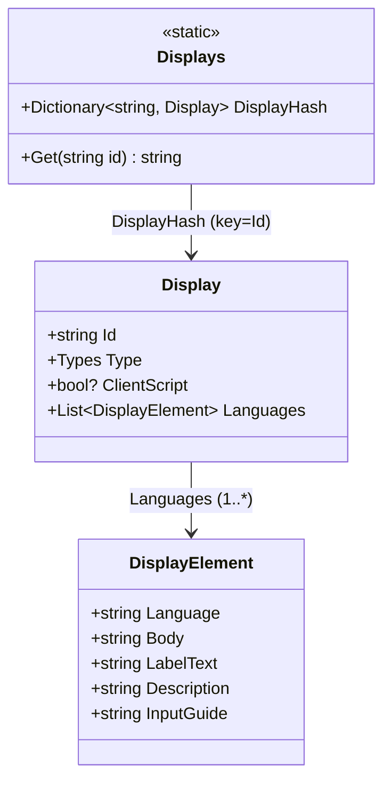
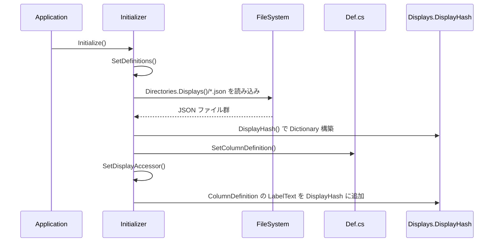
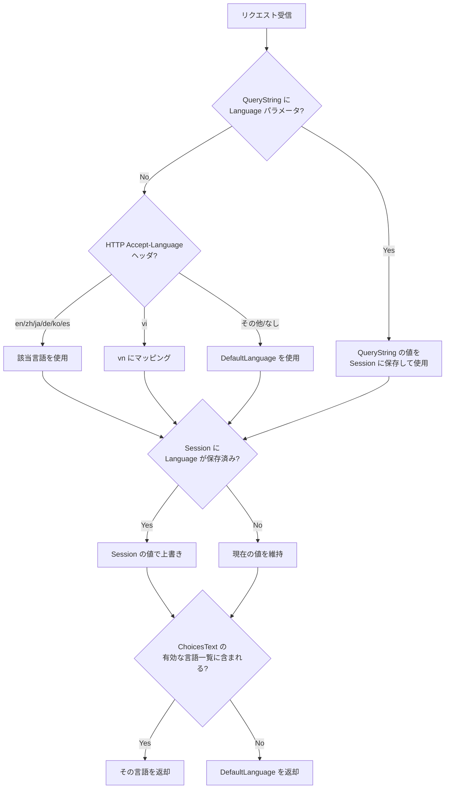
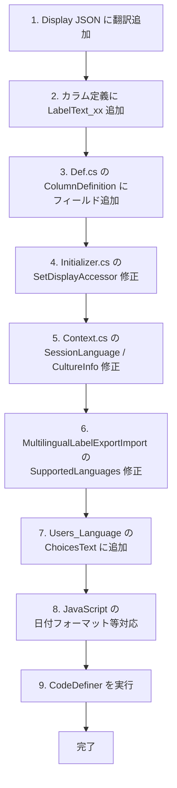

# 多言語対応（i18n）の実装

プリザンターにおける多言語対応（国際化 / i18n）の仕組みを調査し、DisplayAccessor・言語定義ファイル・言語切り替えロジック・CodeDefiner による自動生成の全体像を整理する。

<!-- START doctoc generated TOC please keep comment here to allow auto update -->
<!-- DON'T EDIT THIS SECTION, INSTEAD RE-RUN doctoc TO UPDATE -->

- [調査情報](#調査情報)
- [調査目的](#調査目的)
- [対応言語一覧](#対応言語一覧)
- [1. DisplayAccessor の仕組み](#1-displayaccessor-の仕組み)
    - [1.1 データモデル（3 クラス構成）](#11-データモデル3-クラス構成)
    - [1.2 クラス関連図](#12-クラス関連図)
- [2. 言語定義ファイル](#2-言語定義ファイル)
    - [2.1 Display JSON ファイル](#21-display-json-ファイル)
    - [2.2 カラム定義ファイル（Definition_Column）](#22-カラム定義ファイルdefinition_column)
- [3. DisplayHash の初期化フロー](#3-displayhash-の初期化フロー)
    - [3.1 初期化の全体フロー](#31-初期化の全体フロー)
    - [3.2 DisplayHash() メソッド](#32-displayhash-メソッド)
    - [3.3 SetDisplayAccessor() メソッド](#33-setdisplayaccessor-メソッド)
- [4. 言語切り替えの仕組み](#4-言語切り替えの仕組み)
    - [4.1 サーバーパラメータによるデフォルト言語設定](#41-サーバーパラメータによるデフォルト言語設定)
    - [4.2 SetLanguage() メソッド](#42-setlanguage-メソッド)
    - [4.3 Context.Language の決定ロジック](#43-contextlanguage-の決定ロジック)
    - [4.4 CultureInfo のマッピング](#44-cultureinfo-のマッピング)
- [5. 表示文字列の取得ロジック](#5-表示文字列の取得ロジック)
    - [5.1 サーバーサイド（Displays.Get）](#51-サーバーサイドdisplaysget)
    - [5.2 多言語ラベル（DisplayElement 拡張）](#52-多言語ラベルdisplayelement-拡張)
    - [5.3 クライアントサイド（JavaScript）](#53-クライアントサイドjavascript)
- [6. CodeDefiner によるコード自動生成](#6-codedefiner-によるコード自動生成)
    - [6.1 Display コード生成](#61-display-コード生成)
    - [6.2 自動生成される主なコード](#62-自動生成される主なコード)
- [7. 多言語ラベルのエクスポート/インポート](#7-多言語ラベルのエクスポートインポート)
    - [CSV フォーマット](#csv-フォーマット)
- [8. 新しい言語を追加する手順](#8-新しい言語を追加する手順)
    - [変更箇所一覧](#変更箇所一覧)
    - [追加手順のフロー](#追加手順のフロー)
- [結論](#結論)
- [関連ソースコード](#関連ソースコード)

<!-- END doctoc generated TOC please keep comment here to allow auto update -->

## 調査情報

| 調査日        | リポジトリ | ブランチ | タグ/バージョン | コミット    | 備考     |
| ------------- | ---------- | -------- | --------------- | ----------- | -------- |
| 2026年2月12日 | Pleasanter | main     |                 | `34f162a43` | 初回調査 |

## 調査目的

- プリザンターが多言語をどのように管理・切り替えしているかの全体像を把握する
- 新しい言語を追加するために必要な変更箇所を特定する
- CodeDefiner による Display コード自動生成の仕組みを理解する

---

## 対応言語一覧

プリザンターが現在対応している言語は以下の 7 言語である。

| コード | 言語       | CultureInfo | 備考                                         |
| ------ | ---------- | ----------- | -------------------------------------------- |
| (なし) | 英語       | `en-US`     | デフォルト（`Language` が空の要素）          |
| `zh`   | 中国語     | `zh-CN`     |                                              |
| `ja`   | 日本語     | `ja-JP`     |                                              |
| `de`   | ドイツ語   | `de-DE`     |                                              |
| `ko`   | 韓国語     | `ko-KR`     |                                              |
| `es`   | スペイン語 | `es-ES`     |                                              |
| `vn`   | ベトナム語 | `vi-VN`     | HTTP の `Accept-Language` では `vi` にマップ |

> `MultilingualLabelExportImport.cs` の `SupportedLanguages` リストでも同一の 7 言語が定義されている。

---

## 1. DisplayAccessor の仕組み

### 1.1 データモデル（3 クラス構成）

`Implem.DisplayAccessor` プロジェクトには、表示文字列を管理するための 3 つのクラスが定義されている。

#### Display クラス

```csharp
// Implem.DisplayAccessor/Display.cs
public class Display
{
    public string Id;
    public Displays.Types Type;
    public bool? ClientScript;
    public List<DisplayElement> Languages;
}
```

| フィールド     | 説明                                                     |
| -------------- | -------------------------------------------------------- |
| `Id`           | 表示文字列の一意識別子（例: `"Add"`, `"Login"`）         |
| `Type`         | メッセージ種別（`Normal`, `Error`, `Warning` 等の enum） |
| `ClientScript` | クライアントスクリプトで使用するかどうかのフラグ         |
| `Languages`    | 各言語の翻訳テキストを格納する `DisplayElement` のリスト |

#### DisplayElement クラス

```csharp
// Implem.DisplayAccessor/DisplayElement.cs
public class DisplayElement
{
    public string Language;
    public string Body;
    public string LabelText;
    public string Description;
    public string InputGuide;
}
```

| フィールド    | 説明                                                        |
| ------------- | ----------------------------------------------------------- |
| `Language`    | 言語コード（`"ja"`, `"zh"` 等）。英語の場合は `null`/空文字 |
| `Body`        | 表示テキスト本文                                            |
| `LabelText`   | 多言語ラベルテキスト（カラムの多言語対応で使用）            |
| `Description` | 説明文（カラムの多言語対応で使用）                          |
| `InputGuide`  | 入力ガイド（カラムの多言語対応で使用）                      |

#### Displays 静的クラス

```csharp
// Implem.DisplayAccessor/Displays.cs
public static class Displays
{
    public enum Types : int
    {
        Normal = 110,
        Date = 120,
        DateFormat = 130,
        Success = 210,
        Information = 220,
        Warning = 230,
        Error = 240,
        Confirmation = 310,
        Validation = 410
    }

    public static Dictionary<string, Display> DisplayHash;

    public static string Get(string id)
    {
        return DisplayHash[id].Languages.FirstOrDefault().Body;
    }
}
```

`DisplayHash` は `Dictionary<string, Display>` 型で、すべての表示文字列を ID をキーにして保持する。`Get()` メソッドは最初の言語（英語）のテキストを返す簡易メソッド。

### 1.2 クラス関連図



---

## 2. 言語定義ファイル

### 2.1 Display JSON ファイル

**場所**: `Implem.Pleasanter/App_Data/Displays/`

1 つの表示文字列につき 1 つの JSON ファイルが存在する（約 900 ファイル以上）。

#### ファイル構造の例（Add.json）

```json
{
    "Id": "Add",
    "Type": 110,
    "Languages": [
        {
            "Body": "Add"
        },
        {
            "Language": "zh",
            "Body": "添加"
        },
        {
            "Language": "ja",
            "Body": "追加"
        },
        {
            "Language": "de",
            "Body": "Hinzufügen"
        },
        {
            "Language": "ko",
            "Body": "추가"
        },
        {
            "Language": "es",
            "Body": "Añadir"
        },
        {
            "Language": "vn",
            "Body": "Thêm mới"
        }
    ]
}
```

#### JSON 構造のルール

| 項目                         | 説明                                                      |
| ---------------------------- | --------------------------------------------------------- |
| `Id`                         | ファイル名（拡張子なし）と一致する識別子                  |
| `Type`                       | `Displays.Types` enum の整数値                            |
| `Languages` 配列の最初の要素 | **英語**（`Language` フィールドなし = デフォルト言語）    |
| `Languages` 配列の後続要素   | 各言語の翻訳（`Language` フィールドに言語コードを指定）   |
| `ClientScript`（オプション） | `true` の場合、クライアント側の JavaScript に埋め込まれる |

### 2.2 カラム定義ファイル（Definition_Column）

**場所**: `Implem.Pleasanter/App_Data/Definitions/Definition_Column/`

カラム定義ファイル（CSV / XLS 形式）には、各カラムのラベルテキストが言語別カラムとして定義されている。

`Def.cs` の `ColumnDefinition` クラスに以下のフィールドが存在する:

```csharp
public string LabelText;      // 日本語ラベル（デフォルト）
public string LabelText_en;   // 英語ラベル
public string LabelText_zh;   // 中国語ラベル
public string LabelText_de;   // ドイツ語ラベル
public string LabelText_ko;   // 韓国語ラベル
public string LabelText_es;   // スペイン語ラベル
public string LabelText_vn;   // ベトナム語ラベル
```

> **注意**: `LabelText`（接尾辞なし）が日本語、`LabelText_en` が英語という命名になっている点に留意。

---

## 3. DisplayHash の初期化フロー

### 3.1 初期化の全体フロー



### 3.2 DisplayHash() メソッド

`Initializer.cs` の `DisplayHash()` メソッドが `App_Data/Displays/` 配下の全 JSON ファイルを読み込み、`Dictionary<string, Display>` を構築する。

```csharp
// Implem.DefinitionAccessor/Initializer.cs
private static Dictionary<string, Display> DisplayHash()
{
    var hash = new Dictionary<string, Display>();
    new DirectoryInfo(Directories.Displays()).GetFiles("*.json").ForEach(file =>
    {
        var data = Files.Read(file.FullName).Deserialize<Display>();
        hash.Add(data.Id, data);
    });
    return hash;
}
```

### 3.3 SetDisplayAccessor() メソッド

カラム定義（`ColumnDefinition`）のラベルテキストを `DisplayHash` に追加登録する。これにより、カラム名もシステム UI の表示文字列として言語切り替え対象になる。

```csharp
// Implem.DefinitionAccessor/Initializer.cs（抜粋・整形）
private static void SetDisplayAccessor()
{
    Def.ColumnDefinitionCollection
        .Where(o => !o.Base)
        .Select(o => new
        {
            o.Id,
            En = o.LabelText_en,
            Zh = o.LabelText_zh,
            Ja = o.LabelText,        // 日本語は LabelText（接尾辞なし）
            De = o.LabelText_de,
            Ko = o.LabelText_ko,
            Es = o.LabelText_es,
            Vn = o.LabelText_vn
        })
        // ... テーブル名も追加 ...
        .Where(o => !Displays.DisplayHash.ContainsKey(o.Id))
        .ForEach(o => Displays.DisplayHash.UpdateOrAdd(
            o.Id, new Display
            {
                Id = o.Id,
                Languages = new List<DisplayElement>
                {
                    new DisplayElement { Body = o.En },
                    new DisplayElement { Language = "zh", Body = o.Zh },
                    new DisplayElement { Language = "ja", Body = o.Ja },
                    new DisplayElement { Language = "de", Body = o.De },
                    new DisplayElement { Language = "ko", Body = o.Ko },
                    new DisplayElement { Language = "es", Body = o.Es },
                    new DisplayElement { Language = "vn", Body = o.Vn }
                }
            }));
}
```

---

## 4. 言語切り替えの仕組み

### 4.1 サーバーパラメータによるデフォルト言語設定

**ファイル**: `Implem.Pleasanter/App_Data/Parameters/Service.json`

```json
{
    "DefaultLanguage": "en"
}
```

`Parameters.Service.DefaultLanguage` として読み込まれ、Context の初期値として使用される。

**対応クラス**: `Implem.ParameterAccessor/Parts/Service.cs`

```csharp
public class Service
{
    public string DefaultLanguage;
    // ...
}
```

### 4.2 SetLanguage() メソッド

`Initializer.cs` の `SetLanguage()` で、`Users_Language` カラムのデフォルト値を設定する。

```csharp
// Implem.DefinitionAccessor/Initializer.cs
private static void SetLanguage()
{
    var language = Def.ColumnTable.Users_Language.ChoicesText
        .SplitReturn()
        .Select(o => o.Split_1st())
        .FirstOrDefault(o => o == Parameters.Service.DefaultLanguage) ?? "en";
    Def.ColumnDefinitionCollection
        .FirstOrDefault(o => o.Id == "Users_Language").Default = language;
}
```

### 4.3 Context.Language の決定ロジック

`Context.cs` の `SessionLanguage()` メソッドが、リクエストごとの言語を決定する。

```csharp
// Implem.Pleasanter/Libraries/Requests/Context.cs
public string Language { get; set; } = Parameters.Service.DefaultLanguage;
```

#### 言語選択の優先順位



#### Accept-Language のマッピング（Context.cs）

```csharp
var lang = HttpAcceptLanguage()?.Split_1st('-');
switch (lang)
{
    case "en":
    case "zh":
    case "ja":
    case "de":
    case "ko":
    case "es":
        language = lang;
        break;
    case "vi":
        language = "vn";  // vi → vn にマッピング
        break;
    default:
        language = Parameters.Service?.DefaultLanguage;
        break;
}
```

### 4.4 CultureInfo のマッピング

通貨・数値フォーマットには `CultureInfo` を使用する。

```csharp
// Implem.Pleasanter/Libraries/Requests/Context.cs
public CultureInfo CultureInfoCurrency(string language)
{
    switch (language)
    {
        case "en": return new CultureInfo("en-US");
        case "zh": return new CultureInfo("zh-CN");
        case "ja": return new CultureInfo("ja-JP");
        case "de": return new CultureInfo("de-DE");
        case "ko": return new CultureInfo("ko-KR");
        case "es": return new CultureInfo("es-ES");
        case "vn": return new CultureInfo("vi-VN");
        default:   return new CultureInfo(language);
    }
}
```

---

## 5. 表示文字列の取得ロジック

### 5.1 サーバーサイド（Displays.Get）

`Implem.Pleasanter/Libraries/Responses/Displays.cs` に定義された `Get()` メソッドが、言語に応じた表示文字列を返す。

```csharp
// Implem.Pleasanter/Libraries/Responses/Displays.cs
public static Dictionary<string, string> DisplayHash = GetDisplayHash();

private static Dictionary<string, string> GetDisplayHash()
{
    var data = new Dictionary<string, string>();
    DisplayAccessor.Displays.DisplayHash.ForEach(display =>
        display.Value.Languages.ForEach(element =>
            data.Add(
                display.Key + (!element.Language.IsNullOrEmpty()
                    ? "_" + element.Language
                    : string.Empty),
                element.Body)));
    // 拡張カラムの LabelText も追加
    return data;
}
```

この `DisplayHash` は **フラット化された辞書** であり、以下のようなキーで管理される:

| キー例   | 値の例       | 説明                   |
| -------- | ------------ | ---------------------- |
| `Add`    | `Add`        | 英語（言語接尾辞なし） |
| `Add_ja` | `追加`       | 日本語                 |
| `Add_zh` | `添加`       | 中国語                 |
| `Add_de` | `Hinzufügen` | ドイツ語               |

#### 検索ロジック

```csharp
public static string Get(string id, string language, params string[] data)
{
    var kay = id + "_" + language;   // 例: "Add_ja"
    if (DisplayHash.ContainsKey(kay))
    {
        screen = DisplayHash[kay];   // 言語付きキーで見つかればそれを返す
    }
    else if (DisplayHash.ContainsKey(id))
    {
        screen = DisplayHash[id];    // フォールバック: 英語
    }
    return data?.Any() == true ? screen.Params(data) : screen;
}
```

### 5.2 多言語ラベル（DisplayElement 拡張）

`DisplayElement` の `LabelText`, `Description`, `InputGuide` は、サイト設定でカラムの多言語ラベルを定義する際に使用される。

```csharp
// Implem.Pleasanter/Libraries/Settings/ColumnUtilities.cs
public static string GetMultilingualLabelText(string target, Context context)
{
    return !target.IsNullOrEmpty()
        ? Jsons.Deserialize<List<DisplayElement>>(target)
            ?.Where(o => o.Language == context.Language)
            ?.FirstOrDefault()?.LabelText ?? string.Empty
        : string.Empty;
}
```

### 5.3 クライアントサイド（JavaScript）

フロントエンドでは、hidden フィールド `#Language` から現在の言語を取得し、日付フォーマット等を切り替えている。

```javascript
// wwwroot/components/components_*.js（抜粋・整形）
var v = document.getElementById('Language').value;
switch (v) {
    case 'zh':
    case 'ja':
    case 'es':
    case 'vn':
        // Y/m/d 形式
        break;
    case 'ko':
        // Y.m.d. 形式
        break;
    case 'de':
        // Y.m.d 形式
        break;
}
```

---

## 6. CodeDefiner によるコード自動生成

### 6.1 Display コード生成

`Implem.CodeDefiner/Functions/AspNetMvc/CSharp/Parts/Display.cs` が、`DisplayHash` の全エントリをイテレーションし、コードテンプレートのプレースホルダーを置換してコードを生成する。

```csharp
// Implem.CodeDefiner/Functions/AspNetMvc/CSharp/Parts/Display.cs
internal static void SetCodeCollection(
    CodeDefinition codeDefinition,
    List<string> codeCollection,
    DataContainer dataContainer)
{
    DisplayAccessor.Displays.DisplayHash
        .Select(o => o.Value)
        .ForEach(display => display.Languages
            .Where(element => !CheckExclude(codeDefinition, display, element))
            .ForEach(element =>
                Creators.SetCodeCollection(
                    ref code, codeCollection, codeDefinition, dataContainer,
                    () => ReplaceCode(ref code, display, element))));
}
```

#### プレースホルダー置換

| プレースホルダー          | 置換内容                                    |
| ------------------------- | ------------------------------------------- |
| `#DisplayId#`             | `Id` + `"_" + Language`（英語は接尾辞なし） |
| `#DisplayContent#`        | `Body`（表示テキスト）                      |
| `#DisplayCssClass#`       | Type から CSS クラスを決定                  |
| `#DisplayContentEncoded#` | HTML エンコードされた `Body`                |

#### フィルタリング条件（CheckExclude）

```csharp
private static bool CheckExclude(CodeDefinition codeDefinition,
    Display display, DisplayElement element)
{
    // DisplayLanguages フラグが false なら英語以外を除外
    if (!codeDefinition.DisplayLanguages && !element.Language.IsNullOrEmpty())
        return true;
    // DisplayType フィルタ
    if (!codeDefinition.DisplayType.IsNullOrEmpty()
        && !codeDefinition.DisplayType.Split(',').Contains(display.Type.ToString()))
        return true;
    // ClientScript フラグ
    if (codeDefinition.ClientScript && display.ClientScript != true)
        return true;
    return false;
}
```

### 6.2 自動生成される主なコード

CodeDefiner は `Creators.cs` の `RepeatType: "Display"` で以下のようなコードを自動生成する:

- `Implem.Pleasanter/Libraries/Responses/Displays.cs` 内の各メッセージ取得メソッド
- JavaScript の表示文字列定義

---

## 7. 多言語ラベルのエクスポート/インポート

`MultilingualLabelExportImport.cs` は、サイト設定のカラムラベルを CSV 形式でエクスポート/インポートする機能を提供する。

### CSV フォーマット

```csv
ColumnName,Attributes,ja,en,zh,de,ko,es,vn
Status,LabelText,状況,Status,状态,Status,상태,Estado,Trạng thái
Status,Description,現在の状況,Current status,...
```

| カラム          | 説明                                                 |
| --------------- | ---------------------------------------------------- |
| `ColumnName`    | 対象カラム名                                         |
| `Attributes`    | 属性種別（`LabelText`, `Description`, `InputGuide`） |
| `ja`, `en`, ... | 各言語の翻訳テキスト                                 |

---

## 8. 新しい言語を追加する手順

調査結果から、新しい言語（例: フランス語 `fr`）を追加するには、以下の箇所を変更する必要がある。

### 変更箇所一覧

| #   | 変更対象                                 | ファイル/場所                                                           | 変更内容                                                   |
| --- | ---------------------------------------- | ----------------------------------------------------------------------- | ---------------------------------------------------------- |
| 1   | Display JSON ファイル（約 900 ファイル） | `App_Data/Displays/*.json`                                              | `Languages` 配列に新言語の要素を追加                       |
| 2   | カラム定義ファイル                       | `App_Data/Definitions/Definition_Column/`                               | `LabelText_fr` カラムを追加                                |
| 3   | ColumnDefinition クラス                  | `Implem.DefinitionAccessor/Def.cs`                                      | `LabelText_fr` フィールドを追加                            |
| 4   | SetDisplayAccessor メソッド              | `Implem.DefinitionAccessor/Initializer.cs`                              | `Fr = o.LabelText_fr` マッピングと `DisplayElement` を追加 |
| 5   | SessionLanguage メソッド                 | `Implem.Pleasanter/Libraries/Requests/Context.cs`                       | `switch` に `case "fr"` を追加                             |
| 6   | CultureInfoCurrency メソッド             | `Implem.Pleasanter/Libraries/Requests/Context.cs`                       | `case "fr": return new CultureInfo("fr-FR")` を追加        |
| 7   | SupportedLanguages リスト                | `Implem.Pleasanter/Libraries/Settings/MultilingualLabelExportImport.cs` | `"fr"` を追加                                              |
| 8   | Users_Language の ChoicesText            | カラム定義またはパラメータ                                              | 選択肢に `fr` を追加                                       |
| 9   | Service.json                             | `App_Data/Parameters/Service.json`                                      | **任意**: `DefaultLanguage` を変更可能にする               |
| 10  | SetLanguage バリデーション               | `Implem.DefinitionAccessor/Initializer.cs`                              | ChoicesText に含まれていれば自動的に有効                   |
| 11  | JavaScript フロントエンド                | `wwwroot/` 配下のコンポーネント                                         | 日付フォーマット等の `switch` に `case "fr"` を追加        |
| 12  | CodeDefiner 実行                         | `Implem.CodeDefiner`                                                    | 変更後に CodeDefiner を実行してコードを再生成              |

### 追加手順のフロー



> **注意**: `Def.cs` は CodeDefiner による自動生成コードであるため、直接編集すると再生成時に上書きされる可能性がある。カラム定義ファイルの修正と CodeDefiner の実行で `Def.cs` の変更は自動反映される。

---

## 結論

| 項目                       | 内容                                                                                                           |
| -------------------------- | -------------------------------------------------------------------------------------------------------------- |
| 多言語管理方式             | JSON ファイルベース（1 表示文字列 = 1 JSON ファイル）+ カラム定義ファイルのラベルカラム                        |
| 対応言語数                 | 7 言語（英語・中国語・日本語・ドイツ語・韓国語・スペイン語・ベトナム語）                                       |
| 言語選択の優先順位         | QueryString > Session > Accept-Language > DefaultLanguage                                                      |
| デフォルト言語の設定       | `Service.json` の `DefaultLanguage` パラメータ                                                                 |
| フォールバック             | 指定言語が見つからない場合は英語（Languages 配列の最初の要素）                                                 |
| CodeDefiner の役割         | Display JSON + カラム定義からコードを自動生成（`Displays.cs` 等）                                              |
| 新言語追加の影響範囲       | 約 900 の JSON ファイル + カラム定義 + Context.cs + Initializer.cs + JS など広範囲                             |
| 多言語ラベル（サイト設定） | `DisplayElement` の `LabelText` / `Description` / `InputGuide` を JSON で保持し、CSV でエクスポート/インポート |

---

## 関連ソースコード

| ファイル                                                                | 説明                                     |
| ----------------------------------------------------------------------- | ---------------------------------------- |
| `Implem.DisplayAccessor/Display.cs`                                     | Display データモデル                     |
| `Implem.DisplayAccessor/DisplayElement.cs`                              | DisplayElement データモデル              |
| `Implem.DisplayAccessor/Displays.cs`                                    | DisplayHash 管理                         |
| `Implem.DefinitionAccessor/Initializer.cs`                              | DisplayHash 初期化・言語設定             |
| `Implem.DefinitionAccessor/Def.cs`                                      | ColumnDefinition（LabelText_xx）         |
| `Implem.Pleasanter/Libraries/Responses/Displays.cs`                     | フラット化 DisplayHash・Get メソッド     |
| `Implem.Pleasanter/Libraries/Requests/Context.cs`                       | Language 決定・CultureInfo マッピング    |
| `Implem.Pleasanter/Libraries/Settings/ColumnUtilities.cs`               | 多言語ラベル取得                         |
| `Implem.Pleasanter/Libraries/Settings/MultilingualLabelExportImport.cs` | 多言語ラベル CSV エクスポート/インポート |
| `Implem.ParameterAccessor/Parts/Service.cs`                             | DefaultLanguage パラメータ定義           |
| `Implem.Pleasanter/App_Data/Parameters/Service.json`                    | デフォルト言語設定値                     |
| `Implem.Pleasanter/App_Data/Displays/*.json`                            | 表示文字列定義（約 900 ファイル）        |
| `Implem.CodeDefiner/Functions/AspNetMvc/CSharp/Parts/Display.cs`        | 自動生成ロジック                         |
| `Implem.CodeDefiner/Functions/AspNetMvc/CSharp/Creators.cs`             | コード生成の呼び出し元                   |
