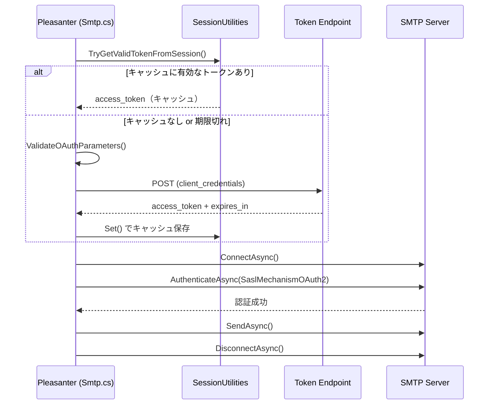

# SMTP OAuth 2.0 対応

プリザンターのメール送信（SMTP）で追加された OAuth 2.0 認証の仕組みと、Microsoft 365 / Google Workspace での具体的な設定例をまとめる。

<!-- START doctoc generated TOC please keep comment here to allow auto update -->
<!-- DON'T EDIT THIS SECTION, INSTEAD RE-RUN doctoc TO UPDATE -->

- [調査情報](#調査情報)
- [調査目的](#調査目的)
- [概要](#概要)
    - [対応ライブラリ](#対応ライブラリ)
- [パラメータ定義](#パラメータ定義)
    - [Mail.json のパラメータ一覧](#mailjson-のパラメータ一覧)
    - [環境変数によるオーバーライド](#環境変数によるオーバーライド)
- [内部実装](#内部実装)
    - [認証フロー](#認証フロー)
    - [処理の流れ（コード解説）](#処理の流れコード解説)
- [プロバイダ別設定例](#プロバイダ別設定例)
    - [Microsoft 365（Exchange Online）](#microsoft-365exchange-online)
    - [Google Workspace（Gmail）](#google-workspacegmail)
- [デフォルト設定（Mail.json）](#デフォルト設定mailjson)
- [結論](#結論)
- [注意事項](#注意事項)
- [関連ソースコード](#関連ソースコード)
- [関連リンク](#関連リンク)

<!-- END doctoc generated TOC please keep comment here to allow auto update -->

## 調査情報

| 調査日     | リポジトリ | ブランチ | タグ/バージョン    | コミット   | 備考 |
| ---------- | ---------- | -------- | ------------------ | ---------- | ---- |
| 2026-02-12 | Pleasanter | main     | Pleasanter_1.5.1.0 | `34f162a4` |      |

## 調査目的

プリザンターの SMTP メール送信において OAuth 2.0（XOAUTH2）認証が追加された。
Microsoft 365 や Google Workspace では基本認証（ユーザ名+パスワード）が廃止・非推奨となっており、
OAuth 2.0 への移行が必須となっている。本調査では、内部実装の詳細と具体的なプロバイダ別設定例をまとめる。

---

## 概要

`Parameters.Mail.UseOAuth` を `true` に設定すると、SMTP 認証時に MailKit の
`SaslMechanismOAuth2`（XOAUTH2）を使用する。
OAuth 2.0 の Client Credentials Grant でアクセストークンを取得し、
SMTP セッションで XOAUTH2 として認証を行う。

### 対応ライブラリ

| ライブラリ | バージョン | 用途                    |
| ---------- | ---------- | ----------------------- |
| MailKit    | 4.14.1     | SMTP 送信、XOAUTH2 認証 |
| MimeKit    | 4.14.0     | メールメッセージ構築    |

---

## パラメータ定義

### Mail.json のパラメータ一覧

OAuth 関連パラメータはすべて `App_Data/Parameters/Mail.json` で設定する。

| パラメータ                    | 型     | デフォルト | 説明                                                           |
| ----------------------------- | ------ | ---------- | -------------------------------------------------------------- |
| `UseOAuth`                    | bool   | `false`    | OAuth 2.0 認証を有効化                                         |
| `OAuthClientId`               | string | `null`     | OAuth クライアント ID                                          |
| `OAuthClientSecret`           | string | `null`     | OAuth クライアントシークレット                                 |
| `OAuthScope`                  | string | `null`     | トークン取得時のスコープ                                       |
| `OAuthGrantType`              | string | `null`     | グラントタイプ（通常 `client_credentials`）                    |
| `OAuthTokenEndpoint`          | string | `null`     | トークンエンドポイント URL                                     |
| `OAuthDefaultExpiresIn`       | int    | `3600`     | レスポンスに `expires_in` がない場合のデフォルト有効期間（秒） |
| `OAuthTokenRefreshBufferTime` | int    | `300`      | トークン期限切れ前にリフレッシュするバッファ時間（秒）         |

> **ソース**: [Implem.ParameterAccessor/Parts/Mail.cs](https://github.com/Implem/Implem.Pleasanter/blob/main/Implem.ParameterAccessor/Parts/Mail.cs)

### 環境変数によるオーバーライド

`OAuthClientId` と `OAuthClientSecret` は環境変数でオーバーライド可能。JSON に直接シークレットを書かずに済む。

```text
{EnvironmentName}_Mail_OAuthClientId
{ServiceName}_Mail_OAuthClientId
{EnvironmentName}_Mail_OAuthClientSecret
{ServiceName}_Mail_OAuthClientSecret
```

> **ソース**: [Implem.DefinitionAccessor/Initializer.cs L187-L194](https://github.com/Implem/Implem.Pleasanter/blob/main/Implem.DefinitionAccessor/Initializer.cs#L187-L194)

---

## 内部実装

### 認証フロー



### 処理の流れ（コード解説）

#### 1. SMTP 接続と認証の分岐

```csharp
// Smtp.cs L127-L143
using (var smtpClient = new SmtpClient())
{
    await smtpClient.ConnectAsync(Host, Port, options);

    if (Parameters.Mail.UseOAuth)
    {
        var accessToken = await GetAccessTokenAsync();
        await smtpClient.AuthenticateAsync(
            new SaslMechanismOAuth2(Parameters.Mail.SmtpUserName, accessToken));
    }
    else if (!Parameters.Mail.SmtpUserName.IsNullOrEmpty()
        && !Parameters.Mail.SmtpPassword.IsNullOrEmpty())
    {
        await smtpClient.AuthenticateAsync(
            Parameters.Mail.SmtpUserName, Parameters.Mail.SmtpPassword);
    }

    await smtpClient.SendAsync(message);
    await smtpClient.DisconnectAsync(true);
}
```

`UseOAuth = true` の場合、`SmtpUserName` + `SmtpPassword` による基本認証は行わず、XOAUTH2 で認証する。

#### 2. トークンキャッシュ

`SessionUtilities` を使い、DB セッションテーブルにトークンをキャッシュする。キーは `OAuthToken:{ClientId}`、セッション GUID は固定値 `SmtpOAuthToken`。

```csharp
// Smtp.cs L193-L216
private async Task<string> GetAccessTokenAsync()
{
    var sessionKey = $"{OAuthTokenKeyPrefix}:{Parameters.Mail.OAuthClientId}";
    return TryGetValidTokenFromSession(sessionKey)
        ?? await FetchAccessTokenAsync(sessionKey);
}
```

- 有効期限は `ExpiresAtUtc` で管理
- 期限切れの `OAuthTokenRefreshBufferTime`（デフォルト 300 秒）前にリフレッシュ
- JSON シリアライズして `SessionUtilities.Set()` で保存

#### 3. トークン取得

Client Credentials Grant（`grant_type=client_credentials`）で POST リクエストを送信する。

```csharp
// Smtp.cs L224-L235
using var content = new FormUrlEncodedContent(new[]
{
    new KeyValuePair<string, string>("client_id", Parameters.Mail.OAuthClientId),
    new KeyValuePair<string, string>("client_secret", Parameters.Mail.OAuthClientSecret),
    new KeyValuePair<string, string>("scope", Parameters.Mail.OAuthScope),
    new KeyValuePair<string, string>("grant_type", Parameters.Mail.OAuthGrantType)
});
var response = await HttpClient.PostAsync(Parameters.Mail.OAuthTokenEndpoint, content);
```

#### 4. バリデーション

トークン取得前に全 OAuth パラメータの存在チェックと URL 形式チェックを実施する。不足パラメータがある場合は `InvalidOperationException` をスローする。

```csharp
// Smtp.cs L291-L327
private void ValidateOAuthParameters()
{
    List<string> missingParams = [];
    // OAuthClientId, OAuthClientSecret, OAuthScope,
    // OAuthGrantType, OAuthTokenEndpoint の存在チェック
    // OAuthTokenEndpoint の URL 形式チェック
    if (missingParams.Count > 0)
    {
        throw new InvalidOperationException(
            $"OAuth parameters are not configured: {string.Join(", ", missingParams)}");
    }
}
```

---

## プロバイダ別設定例

### Microsoft 365（Exchange Online）

#### 前提条件

1. Azure AD（Entra ID）でアプリ登録を行う
2. 「API のアクセス許可」で **Microsoft Graph > `Mail.Send`**（アプリケーション権限）を追加
3. 管理者の同意を付与する
4. クライアントシークレットを発行する

> **注意**: `SmtpUserName` には実際にメール送信するメールボックスのアドレスを指定する。アプリケーション権限ではそのメールボックスに対する `Mail.Send` が許可されている必要がある。

#### Azure AD（Entra ID）設定手順

1. [Azure Portal](https://portal.azure.com) > Microsoft Entra ID > アプリの登録 > 新規登録
2. アプリ名を入力（例: `Pleasanter-SMTP`）、サポートされるアカウントの種類を選択
3. 「API のアクセス許可」>「アクセス許可の追加」> Microsoft Graph > アプリケーションの許可
4. `Mail.Send` を選択して追加
5. 「{テナント名} に管理者の同意を与えます」をクリック
6. 「証明書とシークレット」>「新しいクライアント シークレット」で値を控える
7. 概要ページで以下の情報を控える:

| 項目                                   | 用途                               |
| -------------------------------------- | ---------------------------------- |
| **アプリケーション (クライアント) ID** | `OAuthClientId` に設定             |
| **ディレクトリ (テナント) ID**         | `OAuthTokenEndpoint` の URL に使用 |
| **クライアントシークレットの値**       | `OAuthClientSecret` に設定         |

#### Mail.json 設定例

```json
{
    "SmtpHost": "smtp.office365.com",
    "SmtpPort": 587,
    "SmtpUserName": "noreply@example.com",
    "SmtpEnableSsl": true,
    "SecureSocketOptions": "StartTls",
    "UseOAuth": true,
    "OAuthClientId": "xxxxxxxx-xxxx-xxxx-xxxx-xxxxxxxxxxxx",
    "OAuthClientSecret": "your-client-secret",
    "OAuthScope": "https://outlook.office365.com/.default",
    "OAuthGrantType": "client_credentials",
    "OAuthTokenEndpoint": "https://login.microsoftonline.com/{tenant-id}/oauth2/v2.0/token",
    "OAuthDefaultExpiresIn": 3600,
    "OAuthTokenRefreshBufferTime": 300,
    "FixedFrom": "\"Pleasanter\" <noreply@example.com>"
}
```

#### 注意事項

- `OAuthScope` は `https://outlook.office365.com/.default` を使用（`https://graph.microsoft.com/.default` ではない）
- `OAuthTokenEndpoint` の `{tenant-id}` は実際のテナント ID（GUID）に置換する
- SMTP AUTH は Exchange Online 側で有効化が必要（Exchange 管理センター > メールボックス > SMTP 認証の管理）
- アプリケーション権限で `Mail.Send` を使う場合、送信元メールボックスの制限には[アプリケーションアクセスポリシー](https://learn.microsoft.com/ja-jp/graph/auth-limit-mailbox-access)を使用する
- クライアントシークレットは定期的にローテーションすること

#### トラブルシューティング

| エラー                                     | 確認事項                                                                                              |
| ------------------------------------------ | ----------------------------------------------------------------------------------------------------- |
| `OAuth parameters are not configured`      | `OAuthClientId`、`OAuthClientSecret`、`OAuthTokenEndpoint` 等の必須パラメータがすべて設定されているか |
| `OAuth token acquisition failed`           | クライアント ID/シークレットの正当性、テナント ID が正しいか確認                                      |
| `access_token not found in OAuth response` | トークンエンドポイント URL が正しいか、クライアント資格情報が有効か確認                               |
| `Authentication failed`                    | `SmtpUserName` のメールアドレス、SMTP AUTH の有効化、`Mail.Send` 権限の付与状況を確認                 |

---

### Google Workspace（Gmail）

#### 前提条件

1. Google Workspace アカウント（Gmail for Business）
2. Google Cloud Console へのアクセス権限
3. 送信に使用するメールアドレス

> **注意**: 個人向け Gmail アカウント（@gmail.com）では Client Credentials Grant を直接使用できない。Google Workspace アカウントでドメイン全体の委任を設定する必要がある。

#### Google Cloud 設定手順

##### 1. プロジェクトの作成

1. [Google Cloud Console](https://console.cloud.google.com/) にサインイン
2. プロジェクトセレクター > **新しいプロジェクト** を選択
3. プロジェクト名（例: `Pleasanter SMTP Client`）と組織を入力して作成

##### 2. Gmail API の有効化

1. **API とサービス** > **ライブラリ** を選択
2. 「Gmail API」を検索して **有効にする**

##### 3. OAuth 同意画面の設定

1. **API とサービス** > **OAuth 同意画面** を選択
2. ユーザータイプ: **内部**（Google Workspace の場合）
3. アプリ名・サポートメール・デベロッパー連絡先を入力して保存

##### 4. サービスアカウントの作成

1. **API とサービス** > **認証情報** > **認証情報を作成** > **サービスアカウント**
2. サービスアカウント名（例: `pleasanter-smtp`）を入力して作成
3. 作成後、以下の情報を控える:

| 項目                | 説明                                          |
| ------------------- | --------------------------------------------- |
| **クライアント ID** | ドメイン全体の委任で使用                      |
| **メールアドレス**  | `xxx@project-id.iam.gserviceaccount.com` 形式 |

1. **キー** タブ > **鍵を追加** > **新しい鍵を作成**（JSON）でキーファイルをダウンロード

> **重要**: ダウンロードした JSON ファイルには `client_id` と `private_key` が含まれる。安全な場所に保管すること。

##### 5. ドメイン全体の委任の設定

1. [Google Workspace 管理コンソール](https://admin.google.com/) にサインイン
2. **セキュリティ** > **アクセスとデータ管理** > **API の制御** > **ドメイン全体の委任**
3. **新しく追加** をクリック
4. サービスアカウントの **クライアント ID** と OAuth スコープ `https://mail.google.com/` を入力して承認

##### 6. OAuth クライアント ID の作成

1. [Google Cloud Console](https://console.cloud.google.com/) > **API とサービス** > **認証情報**
2. **認証情報を作成** > **OAuth クライアント ID**
3. アプリケーションの種類: **ウェブアプリケーション**
4. 名前（例: `Pleasanter SMTP OAuth`）を入力して作成
5. 作成後、以下の情報を控える:

| 項目                         | 用途                       |
| ---------------------------- | -------------------------- |
| **クライアント ID**          | `OAuthClientId` に設定     |
| **クライアントシークレット** | `OAuthClientSecret` に設定 |

> **重要**: クライアントシークレットは作成時にしか表示されない場合がある。必ずコピーして保存すること。

#### Mail.json 設定例

```json
{
    "SmtpHost": "smtp.gmail.com",
    "SmtpPort": 587,
    "SmtpUserName": "sender@your-domain.com",
    "SmtpPassword": "",
    "SmtpEnableSsl": true,
    "SecureSocketOptions": "StartTls",
    "UseOAuth": true,
    "OAuthClientId": "xxxxxxxxxxxx.apps.googleusercontent.com",
    "OAuthClientSecret": "your-client-secret-value",
    "OAuthScope": "https://mail.google.com/",
    "OAuthGrantType": "client_credentials",
    "OAuthTokenEndpoint": "https://oauth2.googleapis.com/token",
    "OAuthDefaultExpiresIn": 3600,
    "OAuthTokenRefreshBufferTime": 300,
    "FixedFrom": "\"Pleasanter\" <sender@your-domain.com>"
}
```

#### 注意事項

- 個人向け Gmail（@gmail.com）では使用不可。Google Workspace アカウントが必須
- サービスアカウントのドメイン全体の委任が正しく設定されていないと認証エラーになる
- OAuth スコープは `https://mail.google.com/` を指定する
- クライアントシークレットは定期的にローテーションすること
- Google Workspace 管理コンソールの監査ログで不審なアクティビティを監視すること

#### トラブルシューティング

| エラー                                                | 確認事項                                                                                              |
| ----------------------------------------------------- | ----------------------------------------------------------------------------------------------------- |
| `OAuth parameters are not configured`                 | `OAuthClientId`、`OAuthClientSecret`、`OAuthTokenEndpoint` 等の必須パラメータがすべて設定されているか |
| `OAuth token acquisition failed`                      | クライアント ID/シークレットの正当性、OAuth スコープ、サービスアカウント権限を確認                    |
| `access_token not found in OAuth response`            | トークンエンドポイント URL が正しいか、クライアント資格情報が有効か確認                               |
| `The server's SSL certificate could not be validated` | 開発環境では `ServerCertificateValidationCallback` を `true` に設定（本番環境では非推奨）             |
| `Authentication failed`                               | `SmtpUserName` のメールアドレス、ドメイン全体の委任設定、サービスアカウント権限を確認                 |

#### 代替方法: SMTP リレーサービス

OAuth の設定が不要な代替方法として、Google Workspace の SMTP リレーサービスを使い IP ベースの認証で送信する方法もある。

```json
{
    "SmtpHost": "smtp-relay.gmail.com",
    "SmtpPort": 587,
    "SmtpEnableSsl": true,
    "SecureSocketOptions": "StartTls",
    "UseOAuth": false,
    "FixedFrom": "\"Pleasanter\" <noreply@example.com>"
}
```

Google Workspace 管理コンソールで SMTP リレーサービスを設定し、プリザンターサーバの IP を許可リストに追加する。

---

## デフォルト設定（Mail.json）

```json
{
    "SmtpHost": null,
    "SmtpPort": 25,
    "SmtpUserName": null,
    "SmtpPassword": null,
    "SmtpEnableSsl": false,
    "ServerCertificateValidationCallback": false,
    "SecureSocketOptions": null,
    "UseOAuth": false,
    "OAuthClientId": null,
    "OAuthClientSecret": null,
    "OAuthScope": null,
    "OAuthGrantType": null,
    "OAuthTokenEndpoint": null,
    "OAuthDefaultExpiresIn": 3600,
    "OAuthTokenRefreshBufferTime": 300,
    "FixedFrom": null,
    "AllowedFrom": null,
    "SupportFrom": "\"Pleasanter.org\" <support@pleasanter.org>",
    "InternalDomains": "",
    "Encoding": null,
    "ContentEncoding": null
}
```

---

## 結論

| 項目               | 内容                                                                                                               |
| ------------------ | ------------------------------------------------------------------------------------------------------------------ |
| 認証方式           | MailKit `SaslMechanismOAuth2`（XOAUTH2）                                                                           |
| グラントタイプ     | `client_credentials`（固定実装）                                                                                   |
| トークンキャッシュ | `SessionUtilities` で DB セッションテーブルに保存。期限管理あり                                                    |
| 環境変数対応       | `OAuthClientId` と `OAuthClientSecret` は環境変数でオーバーライド可能                                              |
| M365 対応          | Client Credentials Grant で対応可能。Azure AD アプリ登録 + `Mail.Send` 権限が必要                                  |
| GWS 対応           | サービスアカウント + ドメイン全体の委任 + OAuth クライアント ID で対応可能。代替として SMTP リレーサービスも利用可 |
| 制約               | `grant_type` フィールドは設定可能だが、POST ボディは `client_credentials` 固定形式のため JWT Bearer 等は不可       |

---

## 注意事項

- `OAuthClientSecret` は機密情報のため、`Mail.json` に直接記載せず環境変数の利用を推奨する
- トークンキャッシュは DB セッションに保存されるため、マルチインスタンス構成でも共有される
- Microsoft 365 では SMTP AUTH の有効化が別途必要（Exchange 管理センターでメールボックスごとに設定）
- Google Workspace で OAuth SMTP を使用する場合は、サービスアカウントのドメイン全体の委任と OAuth クライアント ID の設定が必要

---

## 関連ソースコード

| ファイル                                                | 説明                               |
| ------------------------------------------------------- | ---------------------------------- |
| `Implem.Pleasanter/Libraries/DataSources/Smtp.cs`       | SMTP 送信・OAuth 認証の実装        |
| `Implem.ParameterAccessor/Parts/Mail.cs`                | Mail パラメータの定義              |
| `Implem.Pleasanter/App_Data/Parameters/Mail.json`       | Mail パラメータのデフォルト値      |
| `Implem.DefinitionAccessor/Initializer.cs`              | 環境変数オーバーライド処理         |
| `Implem.Pleasanter/Models/Sessions/SessionUtilities.cs` | トークンキャッシュのセッション管理 |

## 関連リンク

- [MailKit SaslMechanismOAuth2](https://github.com/jstedfast/MailKit/blob/master/MailKit/Security/SaslMechanismOAuth2.cs)
- [Microsoft Entra ID - アプリ登録](https://learn.microsoft.com/ja-jp/entra/identity-platform/quickstart-register-app)
- [Exchange Online の SMTP AUTH](https://learn.microsoft.com/ja-jp/exchange/clients-and-mobile-in-exchange-online/authenticated-client-smtp-submission)
- [Google Workspace SMTP リレーサービス](https://support.google.com/a/answer/2956491)
- [Gmail API Documentation](https://developers.google.com/gmail/api)
- [OAuth 2.0 for Service Accounts](https://developers.google.com/identity/protocols/oauth2/service-account)
- [Google Cloud Console](https://console.cloud.google.com/)
- [Google Workspace 管理コンソール](https://admin.google.com/)
