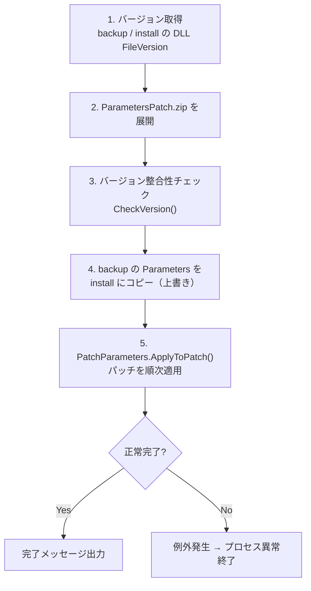
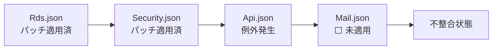
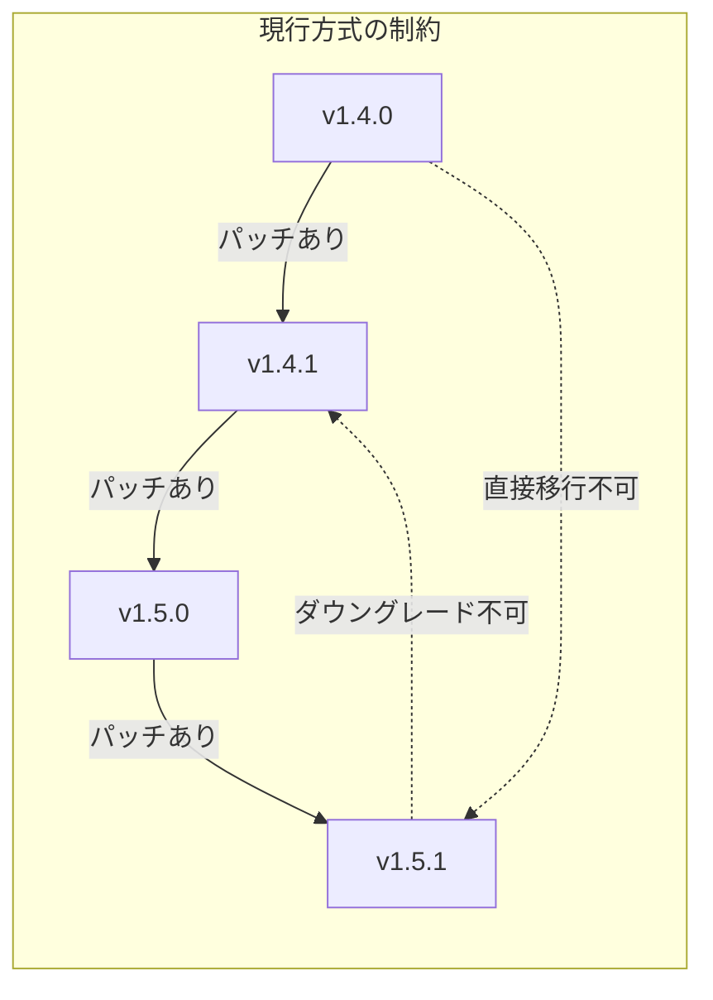
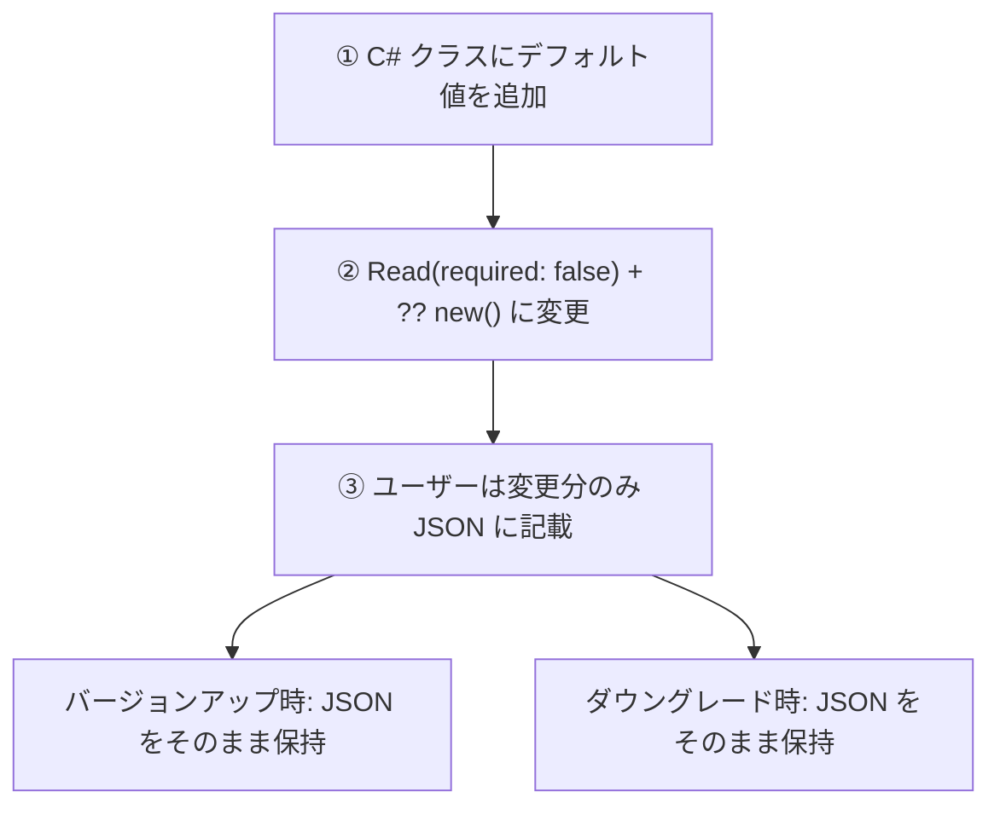
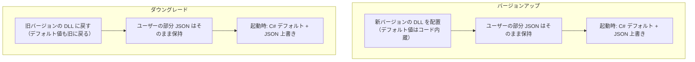
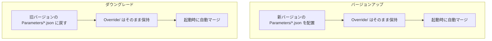
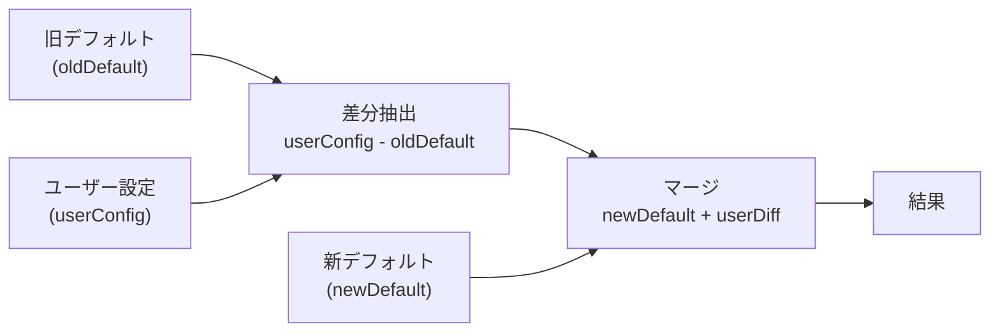
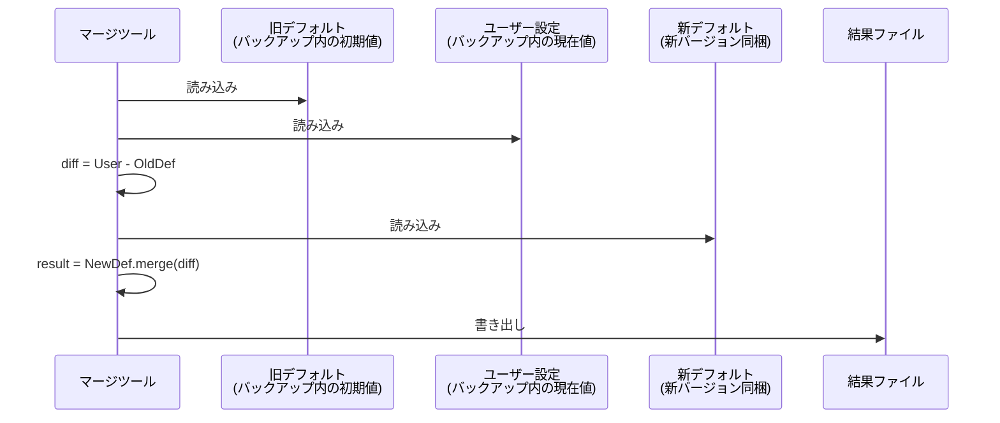
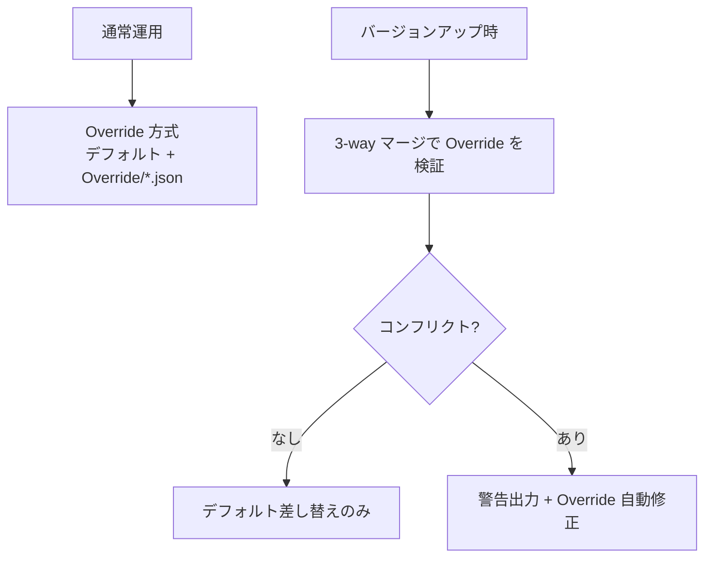

# CodeDefiner パラメータマージ（merge）の問題点と代替案

CodeDefiner の `merge` コマンドによるパラメータパッチ適用機構の問題点を調査し、代替アプローチを検討する。

<!-- START doctoc generated TOC please keep comment here to allow auto update -->
<!-- DON'T EDIT THIS SECTION, INSTEAD RE-RUN doctoc TO UPDATE -->

- [調査情報](#調査情報)
- [調査目的](#調査目的)
- [merge コマンドの処理フロー](#merge-コマンドの処理フロー)
- [パッチ適用の中核ロジック](#パッチ適用の中核ロジック)
    - [使用ライブラリ](#使用ライブラリ)
    - [jsondiffpatch デルタ形式と RFC 6902 の比較](#jsondiffpatch-デルタ形式と-rfc-6902-の比較)
- [問題点一覧](#問題点一覧)
    - [問題1: パッチ適用時の例外ハンドリングが皆無](#問題1-パッチ適用時の例外ハンドリングが皆無)
    - [問題2: 部分適用によるデータ不整合（トランザクション機構なし）](#問題2-部分適用によるデータ不整合トランザクション機構なし)
    - [問題3: ファイル名のみでのマッチング（パス無視）](#問題3-ファイル名のみでのマッチングパス無視)
    - [問題4: バージョン文字列の辞書順ソートへの依存](#問題4-バージョン文字列の辞書順ソートへの依存)
    - [問題5: バージョンペア依存（パッチが存在するバージョン間のみ対応）](#問題5-バージョンペア依存パッチが存在するバージョン間のみ対応)
    - [問題6: ダウングレード非対応](#問題6-ダウングレード非対応)
    - [問題7: 配列を含むパラメータでの破損リスク](#問題7-配列を含むパラメータでの破損リスク)
    - [問題8: デシリアライズの例外握り潰し（パッチ適用後の影響）](#問題8-デシリアライズの例外握り潰しパッチ適用後の影響)
- [問題点のまとめ](#問題点のまとめ)
- [現行方式の構造的限界](#現行方式の構造的限界)
- [代替アプローチ](#代替アプローチ)
    - [案A: C# デフォルト値 + 部分 JSON 方式](#案a-c-デフォルト値--部分-json-方式)
    - [案B: パラメータのレイヤー分離（Override 方式）](#案b-パラメータのレイヤー分離override-方式)
    - [案C: デフォルト同梱 + 差分検出ツール](#案c-デフォルト同梱--差分検出ツール)
    - [案D: 3-way マージ（デフォルト差分方式）](#案d-3-way-マージデフォルト差分方式)
    - [案E: Override 方式 + 3-way マージ（ハイブリッド）](#案e-override-方式--3-way-マージハイブリッド)
    - [代替案の比較](#代替案の比較)
- [結論](#結論)
- [関連ソースコード](#関連ソースコード)

<!-- END doctoc generated TOC please keep comment here to allow auto update -->

## 調査情報

| 調査日        | リポジトリ | ブランチ           | タグ/バージョン | コミット    | 備考     |
| ------------- | ---------- | ------------------ | --------------- | ----------- | -------- |
| 2026年2月23日 | Pleasanter | Pleasanter_1.5.1.0 | v1.5.1.0        | `34f162a43` | 初回調査 |

## 調査目的

プリザンターのバージョンアップ時に `CodeDefiner merge` コマンドでパラメータファイルのパッチ適用を行うが、パッチファイル適用時に例外が発生するケースがあり動作が安定しない。原因を特定し、代替アプローチを検討する。

---

## merge コマンドの処理フロー

CLI コマンド `dotnet Implem.CodeDefiner.dll merge /b:{backupPath} [/i:{installPath}]` で起動される。



**ファイル**: `Implem.CodeDefiner/Starter.cs`（行番号: 236-301）

```csharp
private static void MergeParameters(
    string installPath = "",
    string backUpPath = "",
    string patchSourceZip = "")
{
    // 1. バックアップパスの必須チェック
    if (backUpPath.IsNullOrEmpty()) throw new ArgumentNullException("/b");

    // 2. インストールパス未指定時はデフォルト値を使用
    if (installPath.IsNullOrEmpty())
    {
        installPath = GetDefaultInstallDir();
        patchSourceZip = GetDefaultPatchDir();
    }

    // 3. バージョン取得（DLL の FileVersion から）
    var newVersion = ReplaceVersion(
        FileVersionInfo.GetVersionInfo(...).FileVersion);
    var currentVersion = ReplaceVersion(
        FileVersionInfo.GetVersionInfo(...).FileVersion);

    // 4. ZIP展開 → バージョンチェック → バックアップコピー → パッチ適用
    ZipFile.ExtractToDirectory(patchSourceZip, installPath, true);
    CheckVersion(newVersion, currentVersion, patchSourcePath);
    CopyDirectory(backUpParameterDir, parametersDir, true);
    Functions.Patch.PatchParameters.ApplyToPatch(
        patchSourcePath, parametersDir, newVersion, currentVersion);
}
```

---

## パッチ適用の中核ロジック

**ファイル**: `Implem.CodeDefiner/Functions/Patch/PatchParameters.cs`

```csharp
public static void ApplyToPatch(
    string patchSourcePath, string parameterDir,
    string newVersion, string currentVersion)
{
    var patchDir = new DirectoryInfo(patchSourcePath);
    DirectoryInfo[] dirs = patchDir.GetDirectories();
    var targetDir = dirs
        .OrderBy(o => o.Name)               // ディレクトリ名で辞書順ソート
        .SkipWhile(o => o.Name != currentVersion);  // currentVersion まで読み飛ばし
    var jdp = new JsonDiffPatch();
    foreach (var dir in targetDir)
    {
        if (currentVersion == dir.Name) continue;
        foreach (var file in Directory.GetFiles(parameterDir, "*.*", SearchOption.AllDirectories))
        {
            var fileName = Path.GetFileName(file);
            string fileContent = null;
            foreach (var patch in Directory.GetFiles(dir.FullName, "*.*", SearchOption.AllDirectories))
            {
                var patchName = Path.GetFileName(patch);
                if (fileName == patchName)  // ファイル名のみで一致判定
                {
                    if (fileContent == null) fileContent = File.ReadAllText(file);
                    var patchContent = File.ReadAllText(patch);
                    var fileContentToken = JToken.Parse(fileContent);      // 例外リスクあり
                    var patchContentToken = JToken.Parse(patchContent);    // 例外リスクあり
                    fileContent = SerializeWithIndent(
                        jdp.Patch(fileContentToken, patchContentToken));   // 例外リスクあり
                }
            }
            if (fileContent != null) File.WriteAllText(file, fileContent);
        }
        if (newVersion == dir.Name) break;
    }
}
```

### 使用ライブラリ

| 項目               | 値                                                           |
| ------------------ | ------------------------------------------------------------ |
| NuGet パッケージ名 | `JsonDiffPatch.Net`                                          |
| バージョン         | 2.5.0                                                        |
| パッチ形式         | **jsondiffpatch デルタ形式**（RFC 6902 JSON Patch ではない） |

### jsondiffpatch デルタ形式と RFC 6902 の比較

| 比較項目     | jsondiffpatch デルタ形式           | RFC 6902 (JSON Patch)                   |
| ------------ | ---------------------------------- | --------------------------------------- |
| 操作表現     | オブジェクトツリー（変更のみ記録） | `op`/`path`/`value` の配列              |
| 配列操作     | `_t: "a"` + インデックスキー       | `add`/`remove`/`replace` + JSON Pointer |
| テキスト差分 | DMP アルゴリズム内蔵               | 非対応                                  |
| 仕様準拠     | 独自仕様                           | IETF 標準 (RFC 6902)                    |
| ツール互換性 | 限定的                             | 広く普及                                |

**jsondiffpatch デルタ形式の例**:

```json
{
    "PropertyA": ["oldValue", "newValue"],
    "PropertyB": {
        "NestedProp": ["old", "new"]
    },
    "DeletedProp": ["value", 0, 0]
}
```

**RFC 6902 の例**:

```json
[
    { "op": "replace", "path": "/PropertyA", "value": "newValue" },
    { "op": "replace", "path": "/PropertyB/NestedProp", "value": "new" },
    { "op": "remove", "path": "/DeletedProp" }
]
```

---

## 問題点一覧

### 問題1: パッチ適用時の例外ハンドリングが皆無

`ApplyToPatch` メソッド内で `JToken.Parse()` と `jdp.Patch()` に try-catch がない。

```csharp
var fileContentToken = JToken.Parse(fileContent);       // 不正JSONで JsonReaderException
var patchContentToken = JToken.Parse(patchContent);     // 同上
fileContent = SerializeWithIndent(
    jdp.Patch(fileContentToken, patchContentToken));    // パッチ適用失敗で例外
```

ユーザーがパラメータ JSON を手動編集してコメント付きやトレーリングカンマを入れていた場合、`JToken.Parse()` で即座に `JsonReaderException` が発生する。

### 問題2: 部分適用によるデータ不整合（トランザクション機構なし）

複数のパラメータファイル（約40ファイル）にパッチを順次適用するループ内で例外が発生すると、**一部のファイルだけが更新され残りは旧バージョンのまま**という不整合状態になる。ロールバック機構がない。



### 問題3: ファイル名のみでのマッチング（パス無視）

```csharp
if (fileName == patchName)  // ファイル名 (e.g. "Rds.json") のみで比較
```

パラメータディレクトリ内にサブディレクトリ（例: `ExtendedFields/`）がある場合、同名ファイルが存在すると意図しないファイルにパッチが適用されるリスクがある。

### 問題4: バージョン文字列の辞書順ソートへの依存

```csharp
var targetDir = dirs.OrderBy(o => o.Name).SkipWhile(o => o.Name != currentVersion);
```

`ReplaceVersion()` で `01.05.01.00` のように2桁ゼロ埋めに変換されるため現状は動作するが、バージョン番号体系が変更された場合（例: 3桁以上のセグメント）にソート順が壊れる。

### 問題5: バージョンペア依存（パッチが存在するバージョン間のみ対応）

`CheckVersion()` で新旧両バージョンに対応するパッチディレクトリの存在を必須としている。

**ファイル**: `Implem.CodeDefiner/Starter.cs`（行番号: 325-343）

```csharp
private static void CheckVersion(string newVersion, string currentVersion, string patchSourcePath)
{
    var newVersionObj = new System.Version(newVersion);
    var currentVersionObj = new System.Version(currentVersion);
    var patchDir = new DirectoryInfo(patchSourcePath);
    DirectoryInfo[] dirs = patchDir.GetDirectories();
    if (newVersionObj < currentVersionObj)  // ダウングレード明示拒否
    {
        throw new InvalidVersionException("Invalid Version" + ...);
    }
    if (!dirs.Any(o => o.Name == currentVersion))  // 旧バージョンのパッチ必須
    {
        throw new InvalidVersionException("Invalid Version:" + currentVersionObj);
    }
    if (!dirs.Any(o => o.Name == newVersion))  // 新バージョンのパッチ必須
    {
        throw new InvalidVersionException("Invalid Version:" + newVersionObj);
    }
}
```

この制約により、`ParametersPatch.zip` にパッチディレクトリが用意されていないバージョン間では `merge` コマンド自体が使用できない。公式リリースに含まれないバージョン（開発版・ホットフィックス等）との間での適用は不可能。

### 問題6: ダウングレード非対応

`CheckVersion()` で `newVersionObj < currentVersionObj` の場合に `InvalidVersionException` をスローしており、**ダウングレードが明示的に禁止**されている。不具合発生時にバージョンを戻す運用ができない。

また、`ApplyToPatch` のループ構造も `currentVersion` → `newVersion` への一方向のみを前提としている。

```csharp
var targetDir = dirs
    .OrderBy(o => o.Name)                        // 昇順ソート
    .SkipWhile(o => o.Name != currentVersion);   // current以降のみ処理
```

### 問題7: 配列を含むパラメータでの破損リスク

jsondiffpatch デルタ形式では配列操作を `_t: "a"` とインデックスキーで表現する。ユーザーが配列要素を追加・削除してカスタマイズしている場合、インデックスがずれてパッチ適用に失敗、またはデータが破損する可能性がある。

### 問題8: デシリアライズの例外握り潰し（パッチ適用後の影響）

**ファイル**: `Implem.Libraries/Utilities/Jsons.cs`

```csharp
public static T Deserialize<T>(this string str)
{
    try { return JsonConvert.DeserializeObject<T>(str); }
    catch { return default(T); }  // 例外を握りつぶし、エラー詳細が消失
}
```

パッチ適用後にパラメータが不正 JSON になっていても、アプリ起動時にサイレントに `null` が返り、障害原因の特定が困難になる。

---

## 問題点のまとめ

| #   | 問題                                       | 影響度 | 箇所                             |
| --- | ------------------------------------------ | ------ | -------------------------------- |
| 1   | パッチ適用時の例外ハンドリング不足         | 高     | `PatchParameters.ApplyToPatch()` |
| 2   | 部分適用による不整合（ロールバックなし）   | 高     | `ApplyToPatch` ループ            |
| 3   | ファイル名のみマッチング（パス無視）       | 中     | `fileName == patchName`          |
| 4   | バージョン辞書順ソートの脆弱性             | 低     | `OrderBy(o => o.Name)`           |
| 5   | バージョンペア依存（パッチ未提供版は不可） | 高     | `CheckVersion()`                 |
| 6   | ダウングレード非対応                       | 高     | `CheckVersion()`                 |
| 7   | 配列含みパラメータの破損リスク             | 中     | jsondiffpatch デルタ形式の制約   |
| 8   | デシリアライズの例外握り潰し               | 中     | `Jsons.Deserialize<T>()`         |

---

## 現行方式の構造的限界

現行の `merge` コマンドは以下の前提に依存しており、構造的にバージョン非依存・双方向対応が不可能である。



| 制約               | 説明                                                                 |
| ------------------ | -------------------------------------------------------------------- |
| バージョンペア依存 | パッチディレクトリが用意されたバージョン間でしか動作しない           |
| 順次適用必須       | v1.4.0 → v1.5.1 は中間バージョンのパッチを全て経由する必要がある     |
| 一方向のみ         | `CheckVersion()` がダウングレードを明示的に拒否する                  |
| パッチ生成コスト   | リリース毎にバージョン固有のパッチファイルを生成・配布する必要がある |

これらの制約を解消するには、**バージョン毎のパッチを廃止**し、任意のバージョン間で直接マージ可能な方式に移行する必要がある。

---

## 代替アプローチ

以下の代替案はすべて「バージョン毎のパッチ不要」および「アップグレード・ダウングレード双方向対応」を前提として評価する。

### 案A: C# デフォルト値 + 部分 JSON 方式

C# クラス側にデフォルト値を整備し、ユーザーは変更したいプロパティのみを JSON に記載する運用に切り替える。
JSON ファイルが存在しない場合は C# のデフォルト値だけで動作する。
Override ディレクトリも別ファイルも不要で、
現行の `Parameters/*.json` の中身を「変更分のみ」に縮小するだけで実現できる。

#### 原理

Newtonsoft.Json の `DeserializeObject<T>()` は以下の順序で動作する。

1. `new T()` でインスタンスを生成（**C# フィールド初期化子のデフォルト値が適用**）
2. JSON に存在するプロパティだけを上書き
3. **JSON に書かれていないプロパティは C# のデフォルト値がそのまま残る**

つまり C# クラス側に正しいデフォルト値があれば、ユーザーは「変更したいところだけ」を JSON に書けばよい。

#### 既存のフォールバック機構

プリザンター本体には既にこのパターンの先例がある。`Read<T>(required: false)` を使うと、JSON ファイルが存在しなくても例外が発生しない。

**ファイル**: `Implem.DefinitionAccessor/Initializer.cs`

```csharp
// 既存の required: false パターン
Parameters.Env = Read<Env>(required: false);                                 // JSON なくても動作
Parameters.Quartz = Read<Quartz>(required: false);                           // 同上
Parameters.PleasanterExtensions = Read<PleasanterExtensions>(required: false) ?? new();  // null→new()

// 現行: 大半は required: true（デフォルト）→ JSON がないと例外
Parameters.Api = Read<Api>();          // required: true
Parameters.Rds = Read<Rds>();          // required: true
Parameters.Security = Read<Security>(); // required: true
```

この `required: false` + `?? new()` のパターンを全パラメータに拡張すれば、JSON ファイル自体がなくても動作する状態にできる。

#### 必要な改修



**① C# クラスへのデフォルト値追加（例）**:

```csharp
// 現行: デフォルト値なし
public class Api
{
    public decimal Version;
    public bool Enabled;
    public int PageSize;
    public int LimitPerSite;
    public bool Compatibility_1_3_12;
}

// 改修後: JSON の値を C# デフォルト値として転記
public class Api
{
    public decimal Version = 1.1m;
    public bool Enabled = true;
    public int PageSize = 200;
    public int LimitPerSite = 0;
    public bool Compatibility_1_3_12 = false;
}
```

**② `Read<T>()` の変更（イメージ）**:

```csharp
private static T Read<T>(bool required = true) where T : new()
{
    var name = typeof(T).Name;
    var json = Files.Read(JsonFilePath(name));
    if (json.IsNullOrEmpty())
    {
        if (required)
            throw new ParametersNotFoundException(name + ".json");
        return new T();  // C# デフォルト値のみで動作
    }
    var data = json.Deserialize<T>();
    if (data == null)
        throw new ParametersIllegalSyntaxException(name + ".json");
    return data;
}

// 全パラメータを required: false に変更
Parameters.Api = Read<Api>(required: false) ?? new();
Parameters.Rds = Read<Rds>(required: false) ?? new();
```

#### デフォルト値整備の現状

プリザンター本体では C# クラスへのデフォルト値追加が既に部分的に進められている。

| 状態        | クラス                                                                       | 備考                                                                                             |
| ----------- | ---------------------------------------------------------------------------- | ------------------------------------------------------------------------------------------------ |
| 整備済      | `Script`                                                                     | 最も網羅的。`ServerScript = true`, `ServerScriptTimeOut = 10000` 等、`[DefaultValue]` 属性も併用 |
| 整備済      | `General`（3プロパティのみ）                                                 | `ChoiceSplitRegexPattern` 等の正規表現プロパティ                                                 |
| 整備済      | `Mail`（OAuth関連）                                                          | `UseOAuth = false`, `OAuthDefaultExpiresIn = 3600` 等                                            |
| 整備済      | `SysLog`                                                                     | `EnableLoggingToDatabase = true`, `OutputErrorDetails = true`                                    |
| 整備済      | `PleasanterExtensions`                                                       | `SiteVisualizer = new()` 、ネストクラスにもデフォルト値あり                                      |
| 整備済      | `Quartz` のサブクラス                                                        | `QuartzClustering` がコンストラクタで初期値設定済                                                |
| 整備済      | `Rds`（`Dbms` のみ）                                                         | `[OnDeserialized]` で `Dbms` 未指定時に `"SQLServer"` にフォールバック                           |
| 注意 未整備 | `Api`, `Authentication`, `Security`, `Service`, `Rds`（その他） 等約70クラス | デフォルト値なし。JSON の値が実質的なデフォルト                                                  |

#### バージョンアップ・ダウングレード時の運用



| 項目               | 内容                                                                                                          |
| ------------------ | ------------------------------------------------------------------------------------------------------------- |
| バージョン毎パッチ | **不要**                                                                                                      |
| ダウングレード     | **対応可**                                                                                                    |
| メリット           | 最もシンプル、Override ディレクトリも別ファイルも不要、既存のデシリアライズ機構をそのまま活用、移行ツール不要 |
| デメリット         | 約70クラスのデフォルト値転記が必要、既存ユーザーの JSON を「変更分のみ」に縮小する運用切替が必要              |
| デフォルト値整備   | 約10クラスは整備済、約70クラスが未整備（JSON の値をフィールド初期化子に転記する作業）                         |
| 工数               | 小〜中（デフォルト値の転記が主な作業、ロジック変更は最小限）                                                  |

#### 具体例: ユーザーが書く JSON

```json
// 現行: Api.json（全プロパティ記載必須）
{
    "Version": 1.1,
    "Enabled": true,
    "PageSize": 200,
    "LimitPerSite": 0,
    "Compatibility_1_3_12": false
}

// 改善後: Api.json（変更分のみ）
{
    "PageSize": 500
}
// → Version=1.1, Enabled=true, LimitPerSite=0 等は C# デフォルト値が使われる
// → JSON ファイル自体を削除しても全プロパティがデフォルト値で動作
```

#### 注意すべきエッジケース

| ケース                                       | 影響 | 対応方針                                                    |
| -------------------------------------------- | ---- | ----------------------------------------------------------- |
| 新バージョンでプロパティ追加                 | なし | C# デフォルト値が自動適用される                             |
| 新バージョンでプロパティ削除                 | なし | JSON に残っていてもデシリアライズ時に無視される             |
| 新バージョンでデフォルト値変更               | なし | DLL 差し替えで自動反映（JSON に未記載なら）                 |
| 新バージョンでプロパティの型変更             | 中   | JSON 値が新型に合わない場合、デシリアライズエラーの可能性   |
| 複合型プロパティ（List, ネストオブジェクト） | 低   | ネストオブジェクトも `= new()` で初期化すれば部分上書き可能 |

### 案B: パラメータのレイヤー分離（Override 方式）

デフォルトパラメータとユーザーカスタマイズを別ファイルに分離し、起動時にディープマージする。バージョンアップ時はデフォルトファイルを丸ごと差し替えるだけでよい。

#### ディレクトリ構成

```text
App_Data/Parameters/
├── Rds.json                  ← デフォルト（リリースに同梱、上書き可）
├── Security.json
├── Api.json
├── ...
└── Override/                 ← ユーザーカスタマイズ（バージョンアップで保持）
    ├── Rds.json              ← 変更したプロパティのみ記載
    └── Security.json
```

#### マージロジック（イメージ）

```csharp
public static T ReadWithOverride<T>(string name) where T : class, new()
{
    // 1. デフォルトパラメータを読み込み
    var defaultJson = File.ReadAllText(Path.Combine(parametersDir, $"{name}.json"));
    var defaultObj = JObject.Parse(defaultJson);

    // 2. Override ファイルがあれば深層マージ
    var overridePath = Path.Combine(parametersDir, "Override", $"{name}.json");
    if (File.Exists(overridePath))
    {
        var overrideJson = File.ReadAllText(overridePath);
        var overrideObj = JObject.Parse(overrideJson);
        defaultObj.Merge(overrideObj, new JsonMergeSettings
        {
            MergeArrayHandling = MergeArrayHandling.Replace  // 配列は上書き
        });
    }

    // 3. デシリアライズして返却
    return defaultObj.ToObject<T>();
}
```

#### バージョンアップ・ダウングレード時の運用



| 項目               | 内容                                                                                           |
| ------------------ | ---------------------------------------------------------------------------------------------- |
| バージョン毎パッチ | **不要**                                                                                       |
| ダウングレード     | **対応可**                                                                                     |
| メリット           | 仕組みが単純、パッチファイル生成・管理が不要、ユーザー変更が明示的に分離される                 |
| デメリット         | `Initializer` の改修が必要、新バージョンでプロパティが削除された場合に Override 側に残骸が残る |
| 既存環境の移行     | 初回のみ現行パラメータとデフォルトの差分を Override に抽出する移行ツールが必要                 |
| 工数               | 中                                                                                             |

#### 注意すべきエッジケース

| ケース                             | 対応方針                                                               |
| ---------------------------------- | ---------------------------------------------------------------------- |
| 新バージョンで追加されたプロパティ | デフォルト値がそのまま使われる（Override に記載不要）                  |
| 新バージョンで削除されたプロパティ | Override に残っていても無視される（デシリアライズ時に該当なし）        |
| 新バージョンでプロパティの型が変更 | Override 側の値でデシリアライズエラーの可能性あり → バリデーション必要 |
| 配列プロパティのカスタマイズ       | Override 側の配列でデフォルトを丸ごと置換（部分マージは行わない）      |

### 案C: デフォルト同梱 + 差分検出ツール

リリースにデフォルトパラメータの「マスター」を同梱し、任意のタイミングでユーザー設定との差分を検出・レポートするツールを提供する。マージ自体はユーザーが判断する。

#### ディレクトリ構成

```text
App_Data/Parameters/
├── Defaults/                 ← デフォルトマスター（リリース同梱、読み取り専用）
│   ├── Rds.json
│   └── Security.json
├── Rds.json                  ← ユーザー設定（実際に使用される）
└── Security.json
```

#### 差分レポート出力例

```text
[INFO] Rds.json:
  SqlCommandTimeOut: default=0, current=30 (ユーザー変更)
  DeadlockRetryCount: default=4, current=4 (変更なし)
  NewProperty: default="value" (新規追加 - 反映推奨)

[WARN] Security.json:
  DeprecatedProp: ユーザー設定に存在するが新バージョンで廃止
```

| 項目               | 内容                                                                       |
| ------------------ | -------------------------------------------------------------------------- |
| バージョン毎パッチ | **不要**                                                                   |
| ダウングレード     | **対応可**                                                                 |
| メリット           | ユーザーが変更内容を把握・判断できる、自動マージによる意図しない変更がない |
| デメリット         | 最終的な反映は手動、パラメータ数が多いと煩雑                               |
| 工数               | 小〜中                                                                     |

### 案D: 3-way マージ（デフォルト差分方式）

旧デフォルト・新デフォルト・ユーザー設定の3者を比較し、ユーザーのカスタマイズを自動検出して新デフォルトに反映する。

#### 原理



```text
userDiff = userConfig - oldDefault    （ユーザーが変更した部分を抽出）
result   = newDefault + userDiff      （新デフォルトにユーザー変更を適用）
```

#### 処理フロー



#### ダウングレードへの対応

3-way マージは方向に依存しない。

- **アップグレード**: `oldDefault=v1.4デフォルト`, `userConfig=v1.4ユーザー設定`, `newDefault=v1.5デフォルト`
- **ダウングレード**: `oldDefault=v1.5デフォルト`, `userConfig=v1.5ユーザー設定`, `newDefault=v1.4デフォルト`

| 項目               | 内容                                                                                                           |
| ------------------ | -------------------------------------------------------------------------------------------------------------- |
| バージョン毎パッチ | **不要**                                                                                                       |
| ダウングレード     | **対応可**（方向非依存）                                                                                       |
| メリット           | ユーザーカスタマイズを自動検出、任意のバージョン間で直接移行可能                                               |
| デメリット         | 旧バージョンのデフォルト値が必要（リリースに初期パラメータを同梱する必要あり）、コンフリクト解消ロジックが複雑 |
| コンフリクト       | ユーザーと新バージョンが同じプロパティを変更した場合の優先ルールが必要                                         |
| 工数               | 大                                                                                                             |

#### コンフリクト解消ルール（案）

| パターン                       | 旧デフォルト→ユーザー | 旧デフォルト→新デフォルト | 結果                                     |
| ------------------------------ | :-------------------: | :-----------------------: | ---------------------------------------- |
| ユーザーのみ変更               |       変更あり        |         変更なし          | **ユーザーの値**を採用                   |
| 新バージョンのみ変更           |       変更なし        |         変更あり          | **新バージョンの値**を採用               |
| 双方変更（値が同じ）           |       変更あり        |     変更あり（同値）      | どちらでもよい                           |
| 双方変更（値が異なる）         |       変更あり        |     変更あり（異値）      | **ユーザーの値**を優先（警告出力）       |
| プロパティ追加（新バージョン） |           -           |           追加            | **新バージョンの値**を採用               |
| プロパティ削除（新バージョン） |           -           |           削除            | **削除**（ユーザーの値は破棄、警告出力） |

### 案E: Override 方式 + 3-way マージ（ハイブリッド）

案B と案D を組み合わせる。通常運用は Override 方式で、バージョンアップ時に 3-way マージで Override ファイルの互換性を自動検証・修正する。



| 項目               | 内容                                                       |
| ------------------ | ---------------------------------------------------------- |
| バージョン毎パッチ | **不要**                                                   |
| ダウングレード     | **対応可**                                                 |
| メリット           | 通常運用はシンプル、バージョン変更時のみ高度なマージを実行 |
| デメリット         | 実装が最も複雑                                             |
| 工数               | 大                                                         |

### 代替案の比較

| 案                            | パッチ不要 | ダウングレード | 安定性 | ユーザー変更保持 | 実装コスト | 本体改修 |
| ----------------------------- | :--------: | :------------: | :----: | :--------------: | :--------: | :------: |
| **A: C# デフォルト+部分JSON** |   **◎**    |     **◎**      | **◎**  |      **◎**       | **小〜中** | **必要** |
| B: Override 方式              |     ◎      |       ◎        |   ◎    |        ◎         |     中     |   必要   |
| C: 差分検出ツール             |     ◎      |       ◎        |   ◎    |    ○（手動）     |   小〜中   |   不要   |
| D: 3-way マージ               |     ◎      |       ◎        |   ○    |        ◎         |     大     |   必要   |
| E: ハイブリッド               |     ◎      |       ◎        |   ◎    |        ◎         |     大     |   必要   |
| （現行方式）                  |     ✗      |       ✗        |   △    |        △         |     -      |    -     |

---

## 結論

| 項目             | 内容                                                                                                                                                                                         |
| ---------------- | -------------------------------------------------------------------------------------------------------------------------------------------------------------------------------------------- |
| 根本原因         | バージョン毎のパッチファイルに依存する設計により、パッチ未提供バージョン間での移行・ダウングレードが不可能                                                                                   |
| 構造的課題       | jsondiffpatch デルタ形式の配列操作の脆弱性、例外ハンドリング・ロールバック機構の欠如                                                                                                         |
| 推奨案           | **案A（C# デフォルト値 + 部分 JSON 方式）** が最もシンプルかつ実現性が高い。既存のデシリアライズ機構と `required: false` パターンを活用し、C# クラスにデフォルト値を整備するだけで実現できる |
| デフォルト値整備 | 約10クラスは整備済。残り約70クラスは JSON の値をフィールド初期化子に転記する作業が必要                                                                                                       |
| 補助的施策       | 案C（差分検出ツール）を併用し、バージョン変更時にデフォルト値の変化をレポートする仕組みがあるとより安全                                                                                      |
| 既存環境の移行   | 既存の全プロパティ記載 JSON はそのまま動作する（破壊的変更なし）。部分 JSON への縮小は任意のタイミングで実施可能                                                                             |

## 関連ソースコード

| ファイル                                                | 説明                                               |
| ------------------------------------------------------- | -------------------------------------------------- |
| `Implem.CodeDefiner/Starter.cs`                         | CLI エントリポイント、`MergeParameters()` メソッド |
| `Implem.CodeDefiner/Functions/Patch/PatchParameters.cs` | パッチ適用の中核ロジック                           |
| `Implem.CodeDefiner/Settings/DefaultParameters.cs`      | デフォルトのインストールパス・パッチZIPパス        |
| `Implem.CodeDefiner/Implem.CodeDefiner.csproj`          | `JsonDiffPatch.Net` v2.5.0 の参照定義              |
| `Implem.Libraries/Utilities/Jsons.cs`                   | JSON デシリアライズ（例外握り潰し）                |
| `Implem.DefinitionAccessor/Initializer.cs`              | パラメータ初期化・読み込み処理                     |
| `Implem.ParameterAccessor/Parts/*.cs`                   | パラメータクラス定義（デフォルト値整備対象）       |
