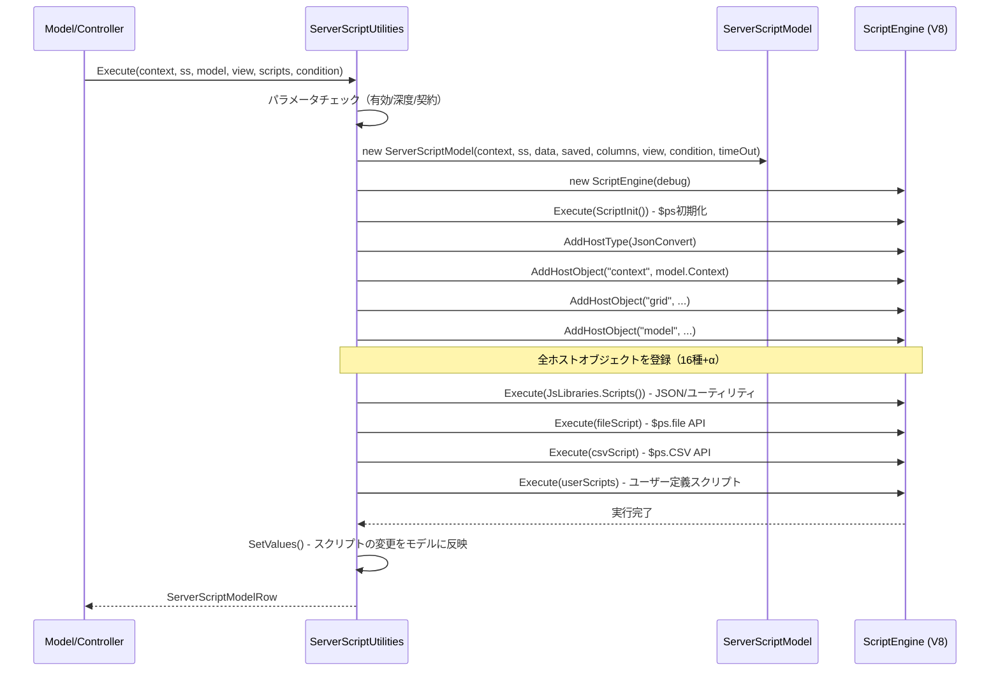
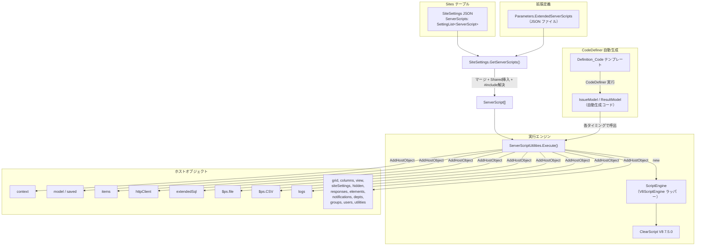

# ServerScript 実装

プリザンターのサーバースクリプト（ServerScript）機能の内部実装を調査する。ClearScript（V8エンジン）の統合方法、スクリプトの保存・実行フロー、スクリプトに公開されるホストオブジェクト群を明らかにする。

<!-- START doctoc generated TOC please keep comment here to allow auto update -->
<!-- DON'T EDIT THIS SECTION, INSTEAD RE-RUN doctoc TO UPDATE -->

- [調査情報](#調査情報)
- [調査目的](#調査目的)
- [ClearScript パッケージ参照](#clearscript-パッケージ参照)
    - [NuGet パッケージ](#nuget-パッケージ)
    - [using ステートメント](#using-ステートメント)
- [スクリプトエンジンラッパー（ScriptEngine クラス）](#スクリプトエンジンラッパーscriptengine-クラス)
    - [初期化のポイント](#初期化のポイント)
    - [デバッグモードの有効化](#デバッグモードの有効化)
- [スクリプトの保存と SiteSettings との関連](#スクリプトの保存と-sitesettings-との関連)
    - [データモデル（ServerScript クラス）](#データモデルserverscript-クラス)
    - [SiteSettings での保持](#sitesettings-での保持)
    - [スクリプト取得ロジック（GetServerScripts）](#スクリプト取得ロジックgetserverscripts)
- [スクリプト実行フロー](#スクリプト実行フロー)
    - [メインの Execute メソッド](#メインの-execute-メソッド)
    - [実行前のガードチェック](#実行前のガードチェック)
    - [タイムアウト制御](#タイムアウト制御)
    - [スクリプト本文の加工（ProcessedBody）](#スクリプト本文の加工processedbody)
    - [実行タイミング別の呼び出し元](#実行タイミング別の呼び出し元)
    - [実行条件一覧（ServerScriptConditions）](#実行条件一覧serverscriptconditions)
- [ホストオブジェクト一覧](#ホストオブジェクト一覧)
    - [V8 エンジンに登録されるオブジェクト](#v8-エンジンに登録されるオブジェクト)
    - [JavaScript 側で追加初期化されるオブジェクト](#javascript-側で追加初期化されるオブジェクト)
- [ホストオブジェクトの詳細](#ホストオブジェクトの詳細)
    - [context（ServerScriptModelContext）](#contextserverscriptmodelcontext)
    - [items（ServerScriptModelApiItems）](#itemsserverscriptmodelapiitems)
    - [httpClient（ServerScriptModelHttpClient）](#httpclientserverscriptmodelhttpclient)
    - [columns（ServerScriptModelColumn）](#columnsserverscriptmodelcolumn)
    - [extendedSql（ServerScriptModelExtendedSql）](#extendedsqlserverscriptmodelextendedsql)
    - [logs（ServerScriptModelLogs）](#logsserverscriptmodellogs)
- [model / saved オブジェクトの値マッピング](#model--saved-オブジェクトの値マッピング)
    - [共通フィールド](#共通フィールド)
    - [Issues 固有フィールド](#issues-固有フィールド)
    - [Results 固有フィールド](#results-固有フィールド)
- [CodeDefiner 自動生成](#codedefiner-自動生成)
    - [自動生成されるコード](#自動生成されるコード)
    - [自動生成テンプレート一覧](#自動生成テンプレート一覧)
- [BackgroundServerScript](#backgroundserverscript)
- [FormulaServerScript](#formulaserverscript)
- [アーキテクチャ全体図](#アーキテクチャ全体図)
- [結論](#結論)
- [関連ソースコード](#関連ソースコード)

<!-- END doctoc generated TOC please keep comment here to allow auto update -->

## 調査情報

| 調査日        | リポジトリ | ブランチ | タグ/バージョン    | コミット    | 備考     |
| ------------- | ---------- | -------- | ------------------ | ----------- | -------- |
| 2026年2月23日 | Pleasanter | main     | Pleasanter_1.5.1.0 | `34f162a43` | 初回調査 |

## 調査目的

- ServerScript 機能がどのようにスクリプトエンジンを統合しているかを把握する
- スクリプトの保存形式・実行タイミング・公開 API の全体像を明確にする
- CodeDefiner によるコード自動生成の有無を確認する

---

## ClearScript パッケージ参照

### NuGet パッケージ

**ファイル**: `Implem.Pleasanter/Implem.Pleasanter/Implem.Pleasanter.csproj`（行番号: 58）

```xml
<PackageReference Include="Microsoft.ClearScript.Complete" Version="7.5.0" />
```

`Microsoft.ClearScript.Complete` は V8 エンジンのネイティブバイナリ
（win-x86, win-x64, win-arm64, linux-x64, osx-x64 等）を含むパッケージで、
これ一つで V8 統合に必要な全コンポーネントが揃う。

### using ステートメント

ClearScript の名前空間を参照しているファイルは以下のとおり。

| ファイル                                                  | 参照名前空間                                        |
| --------------------------------------------------------- | --------------------------------------------------- |
| `Libraries/ServerScripts/ScriptEngine.cs`                 | `Microsoft.ClearScript`, `Microsoft.ClearScript.V8` |
| `Libraries/ServerScripts/FormulaServerScriptUtilities.cs` | `Microsoft.ClearScript`                             |
| `Libraries/ServerScripts/ServerScriptFile.cs`             | `Microsoft.ClearScript`, `Microsoft.ClearScript.V8` |
| `Libraries/ServerScripts/ServerScriptCsv.cs`              | `Microsoft.ClearScript.V8`, `Microsoft.ClearScript` |

他のファイル（`ServerScriptUtilities.cs` 等）は ClearScript を直接参照せず、ラッパーの `ScriptEngine` クラスを介して使用する。

---

## スクリプトエンジンラッパー（ScriptEngine クラス）

**ファイル**: `Implem.Pleasanter/Implem.Pleasanter/Libraries/ServerScripts/ScriptEngine.cs`（全 63 行）

```csharp
using Microsoft.ClearScript;
using Microsoft.ClearScript.V8;
using System;
namespace Implem.Pleasanter.Libraries.ServerScripts
{
    public class ScriptEngine : IDisposable
    {
        private V8ScriptEngine v8ScriptEngine;

        public Func<bool> ContinuationCallback
        {
            set
            {
                v8ScriptEngine.ContinuationCallback = value == null
                    ? null
                    : new Microsoft.ClearScript.ContinuationCallback(value);
            }
        }

        public ScriptEngine(bool debug)
        {
            var flags = V8ScriptEngineFlags.EnableDateTimeConversion;
            if (debug)
            {
                flags |= V8ScriptEngineFlags.EnableDebugging
                | V8ScriptEngineFlags.EnableRemoteDebugging;
            }
            v8ScriptEngine = new V8ScriptEngine(flags);
        }

        public void AddHostType(Type type) => v8ScriptEngine?.AddHostType(type);

        public void AddHostObject(string itemName, object target) =>
            v8ScriptEngine?.AddHostObject(itemName, target);

        public void Dispose() => v8ScriptEngine?.Dispose();

        public void Execute(string code, bool debug)
        {
            v8ScriptEngine?.Execute(
                new DocumentInfo()
                {
                    Flags = debug ? DocumentFlags.AwaitDebuggerAndPause : DocumentFlags.None
                },
                code);
        }

        public object Evaluate(string code) => v8ScriptEngine?.Evaluate(code);
    }
}
```

### 初期化のポイント

| 設定                                           | 説明                                                                   |
| ---------------------------------------------- | ---------------------------------------------------------------------- |
| `V8ScriptEngineFlags.EnableDateTimeConversion` | C# の `DateTime` と JavaScript の `Date` を自動変換する（常時有効）    |
| `V8ScriptEngineFlags.EnableDebugging`          | デバッグモード時のみ有効。V8 Inspector プロトコルに対応                |
| `V8ScriptEngineFlags.EnableRemoteDebugging`    | デバッグモード時のみ有効。Chrome DevTools からのリモート接続を許可     |
| `ContinuationCallback`                         | スクリプト実行中に定期的に呼ばれるコールバック。タイムアウト制御に使用 |

### デバッグモードの有効化

スクリプト本文の先頭が `//debug//` で始まる場合にデバッグモードが有効になる。

**ファイル**: `Implem.Pleasanter/Implem.Pleasanter/Libraries/Settings/ServerScript.cs`（行番号: 183-186）

```csharp
public void SetDebug()
{
    Debug = Body?.StartsWith("//debug//") == true;
}
```

---

## スクリプトの保存と SiteSettings との関連

### データモデル（ServerScript クラス）

**ファイル**: `Implem.Pleasanter/Implem.Pleasanter/Libraries/Settings/ServerScript.cs`

スクリプトは `ServerScript` クラスとして定義され、SiteSettings の JSON の一部として Sites テーブルの `SiteSettings` カラムに保存される。

| プロパティ                | 型       | 説明                                           |
| ------------------------- | -------- | ---------------------------------------------- |
| `Id`                      | `int`    | スクリプト識別子                               |
| `Title`                   | `string` | スクリプトのタイトル                           |
| `Name`                    | `string` | スクリプト名（`#include` 用）                  |
| `Body`                    | `string` | JavaScript ソースコード本文                    |
| `WhenloadingSiteSettings` | `bool?`  | サイト設定読み込み時に実行                     |
| `WhenViewProcessing`      | `bool?`  | ビュー処理時に実行                             |
| `WhenloadingRecord`       | `bool?`  | レコード読み込み時に実行                       |
| `BeforeFormula`           | `bool?`  | 計算式実行前に実行                             |
| `AfterFormula`            | `bool?`  | 計算式実行後に実行                             |
| `BeforeCreate`            | `bool?`  | レコード作成前に実行                           |
| `AfterCreate`             | `bool?`  | レコード作成後に実行                           |
| `BeforeUpdate`            | `bool?`  | レコード更新前に実行                           |
| `AfterUpdate`             | `bool?`  | レコード更新後に実行                           |
| `BeforeDelete`            | `bool?`  | レコード削除前に実行                           |
| `BeforeBulkDelete`        | `bool?`  | 一括削除前に実行                               |
| `AfterDelete`             | `bool?`  | レコード削除後に実行                           |
| `AfterBulkDelete`         | `bool?`  | 一括削除後に実行                               |
| `BeforeOpeningPage`       | `bool?`  | ページ表示前に実行                             |
| `BeforeOpeningRow`        | `bool?`  | 行表示前に実行                                 |
| `Shared`                  | `bool?`  | 共有スクリプト（他スクリプトの先頭に自動挿入） |
| `Functionalize`           | `bool?`  | 即時実行関数 `(()=>{...})()` でラップ          |
| `TryCatch`                | `bool?`  | `try-catch` でラップしてエラーを自動ログ出力   |
| `Disabled`                | `bool?`  | 無効化フラグ                                   |
| `TimeOut`                 | `int?`   | 個別タイムアウト（ミリ秒）                     |
| `Background`              | `bool?`  | バックグラウンド実行フラグ                     |

### SiteSettings での保持

**ファイル**: `Implem.Pleasanter/Implem.Pleasanter/Libraries/Settings/SiteSettings.cs`（行番号: 214-216）

```csharp
public SettingList<ServerScript> ServerScripts;
public bool? ServerScriptsAllDisabled;
public bool? ServerScriptsGetErrorDetails;
```

`SettingList<ServerScript>` は `ISettingListItem` を実装したオブジェクトのリストで、JSON シリアライズされて Sites テーブルの `SiteSettings` カラムに格納される。

### スクリプト取得ロジック（GetServerScripts）

**ファイル**: `Implem.Pleasanter/Implem.Pleasanter/Libraries/Settings/SiteSettings.cs`（行番号: 5989-6062）

```csharp
public List<ServerScript> GetServerScripts(Context context)
{
    if (ServerScriptsAndExtended != null)
    {
        return ServerScriptsAndExtended;
    }
    else
    {
        ServerScriptsAndExtended = Parameters.ExtendedServerScripts
            .ExtensionWhere<...>(context: context, siteId: SiteId)
            .Select(extendedServerScript => new ServerScript() { ... })
            .Concat(ServerScripts.Where(script => script.Disabled != true))
            .ToList();
        // Shared スクリプトの挿入処理
        // #include による他スクリプト参照の解決
        return ServerScriptsAndExtended;
    }
}
```

スクリプトの読み込み順序:

1. **拡張サーバースクリプト**（`Parameters.ExtendedServerScripts`）: サーバー全体の JSON 定義から読み込み
2. **サイト個別スクリプト**（`ServerScripts`）: `Disabled != true` のもののみ
3. **Shared スクリプト**: `Shared == true` のスクリプト本文が、他の全スクリプトの先頭に自動挿入
4. **#include 解決**: スクリプト本文中の `#include` を名前で参照解決

---

## スクリプト実行フロー

### メインの Execute メソッド

**ファイル**: `Implem.Pleasanter/Implem.Pleasanter/Libraries/ServerScripts/ServerScriptUtilities.cs`（行番号: 1082-1192）



### 実行前のガードチェック

```csharp
if (ss?.ServerScriptsAllDisabled == true) return null;
if (!(Parameters.Script.ServerScript != false
    && context.ContractSettings.ServerScript != false
    && context.ServerScriptDisabled == false)) return null;
if (!(context?.ServerScriptDepth < 10)) return null;  // 再帰呼出し深度制限
```

### タイムアウト制御

**ファイル**: `Implem.Pleasanter/Implem.Pleasanter/Libraries/ServerScripts/ServerScriptUtilities.cs`（行番号: 1210-1224）

- スクリプトごとに `TimeOut` を設定可能
- 複数スクリプトの場合は最大値を採用
- `TimeOut == 0` は無制限を意味する（`Parameters.Script.ServerScriptTimeOutChangeable` が `true` の場合）
- `ContinuationCallback` で `DateTime.Now > TimeOut` をチェックし、超過時にスクリプト実行を中断
- デバッグモード時はタイムアウト無効

### スクリプト本文の加工（ProcessedBody）

**ファイル**: `Implem.Pleasanter/Implem.Pleasanter/Libraries/ServerScripts/ServerScriptUtilities.cs`（行番号: 1193-1209）

```csharp
private static string ProcessedBody(SiteSettings ss, ServerScript script)
{
    var body = script.Body;
    if (script.Functionalize == true)
    {
        body = $"(()=>{{\n{script.Body}\n}})();";
    }
    if (script.TryCatch == true)
    {
        // スクリプトID_Title_Name を説明文として try-catch でラップ
        body = $"try{{\n{body}\n}}catch(e){{\nlogs.LogException(...);\n}}";
    }
    return body;
}
```

### 実行タイミング別の呼び出し元

各タイミングでの呼び出しは `Execute` メソッドの `where` パラメータで条件フィルタされる。

```csharp
public static ServerScriptModelRow Execute(
    Context context, SiteSettings ss, ...,
    Func<ServerScript, bool> where,
    ServerScriptConditions condition)
{
    var scripts = ss?.GetServerScripts(context: context)
        ?.Where(where).ToArray();
    // ...
}
```

### 実行条件一覧（ServerScriptConditions）

**ファイル**: `Implem.Pleasanter/Implem.Pleasanter/Libraries/ServerScripts/ServerScriptModel.cs`（行番号: 42-58）

```csharp
public enum ServerScriptConditions
{
    None,
    WhenViewProcessing,
    WhenloadingSiteSettings,
    BeforeOpeningPage,
    BeforeOpeningRow,
    WhenloadingRecord,
    BeforeFormula,
    AfterFormula,
    AfterUpdate,
    BeforeUpdate,
    AfterCreate,
    BeforeCreate,
    AfterDelete,
    AfterBulkDelete,
    BeforeDelete,
    BeforeBulkDelete,
    BackgroundServerScript
}
```

---

## ホストオブジェクト一覧

### V8 エンジンに登録されるオブジェクト

**ファイル**: `Implem.Pleasanter/Implem.Pleasanter/Libraries/ServerScripts/ServerScriptUtilities.cs`（行番号: 1126-1172）

以下のホストオブジェクト/ホストタイプが JavaScript のグローバルスコープに公開される。

| JavaScript 変数名         | C# クラス                       | 説明                                                                          |
| ------------------------- | ------------------------------- | ----------------------------------------------------------------------------- |
| `JsonConvert`（HostType） | `Newtonsoft.Json.JsonConvert`   | JSON シリアライズ/デシリアライズ（.NET 側）                                   |
| `context`                 | `ServerScriptModelContext`      | 実行コンテキスト情報（ユーザー、サイト、リクエスト等）                        |
| `grid`                    | `ServerScriptModelGrid`         | 一覧グリッド情報（TotalCount、SelectedIds）                                   |
| `model`                   | `ExpandoObject`                 | 現在のレコードのフィールド値（読み書き可能）                                  |
| `saved`                   | `ExpandoObject`                 | 更新前のレコードフィールド値（読み取り専用）                                  |
| `depts`                   | `ServerScriptModelDepts`        | 組織情報の取得                                                                |
| `groups`                  | `ServerScriptModelGroups`       | グループ情報の取得                                                            |
| `users`                   | `ServerScriptModelUsers`        | ユーザー情報の取得                                                            |
| `columns`                 | `ExpandoObject`                 | カラムのメタ情報操作（ラベル変更、非表示、必須等）                            |
| `siteSettings`            | `ServerScriptModelSiteSettings` | サイト設定操作（SiteId 検索、デフォルトビュー変更等）                         |
| `view`                    | `ServerScriptModelView`         | ビューのフィルタ・ソート操作                                                  |
| `items`                   | `ServerScriptModelApiItems`     | レコードの CRUD 操作（内部 API 呼び出し）                                     |
| `hidden`                  | `ServerScriptModelHidden`       | 画面に隠しフィールドを追加                                                    |
| `responses`               | `ServerScriptModelResponses`    | 画面リロード指示                                                              |
| `elements`                | `ServerScriptElements`          | UI 要素の表示/非表示/無効化制御                                               |
| `extendedSql`             | `ServerScriptModelExtendedSql`  | 拡張 SQL の実行                                                               |
| `notifications`           | `ServerScriptModelNotification` | 通知の作成・送信                                                              |
| `httpClient`（条件付き）  | `ServerScriptModelHttpClient`   | HTTP リクエスト送信（`DisableServerScriptHttpClient` が `false` の場合のみ）  |
| `utilities`               | `ServerScriptModelUtilities`    | ユーティリティ関数（Today, InRange, Base64 変換等）                           |
| `logs`                    | `ServerScriptModelLogs`         | ログ出力（Info, Warning, Error, Exception）                                   |
| `_file_cs`（条件付き）    | `ServerScriptFile`              | ファイル操作のバックエンド（`DisableServerScriptFile` が `false` の場合のみ） |
| `_csv_cs`                 | `ServerScriptCsv`               | CSV 操作のバックエンド                                                        |

### JavaScript 側で追加初期化されるオブジェクト

#### `$ps` グローバルオブジェクト（ScriptInit）

**ファイル**: `Implem.Pleasanter/Implem.Pleasanter/Libraries/ServerScripts/ServerScriptJsLibraries.cs`

```javascript
let $ps = {};
$ps._utils = {
    _f0: (f) => {
        var err = null;
        var ret = f((type, data) => {
            err = data;
        });
        if (err) throw new Error(err);
        return ret;
    },
};
$ps.utilities = {};
```

#### `$ps.JSON` / `$p.JSON`（Scripts）

`JsonConvert` を統合した JSON 操作。JavaScript の `JSON.stringify`/`JSON.parse` を拡張し、C# オブジェクトも正しくシリアライズできるようにしている。

```javascript
$ps.JSON.stringify = (v, r, s) => js(v, r, s) || clr(v);
$ps.JSON.parse = (v, r) => js(v, r) || clr(v);
```

#### `$ps.file`（ファイル操作 API）

**ファイル**: `Implem.Pleasanter/Implem.Pleasanter/Libraries/ServerScripts/ServerScriptFile.cs`（行番号: 397-460）

| メソッド                                             | 説明                     |
| ---------------------------------------------------- | ------------------------ |
| `$ps.file.readAllText(section, path, encode)`        | テキストファイル読み込み |
| `$ps.file.writeAllText(section, path, data, encode)` | テキストファイル書き込み |
| `$ps.file.getFileList(section, path)`                | ファイル一覧取得         |
| `$ps.file.getDirectoryList(section, path)`           | ディレクトリ一覧取得     |
| `$ps.file.removeFile(section, path)`                 | ファイル削除             |
| `$ps.file.moveFile(section, old, new)`               | ファイル移動             |
| `$ps.file.copyFile(section, src, dest)`              | ファイルコピー           |
| `$ps.file.createDirectory(section, path)`            | ディレクトリ作成         |
| `$ps.file.removeDirectory(section, path)`            | ディレクトリ削除         |
| `$ps.file.moveDirectory(section, old, new)`          | ディレクトリ移動         |
| `$ps.file.createSection(section)`                    | セクション作成           |
| `$ps.file.removeSection(section)`                    | セクション削除           |
| `$ps.file.import(section, path, siteId, param)`      | CSV インポート           |
| `$ps.file.export(section, path, siteId, param)`      | CSV エクスポート         |

ファイルパスは `Parameters.Script.ServerScriptFilePath` をルートとし、セクション名とパスの正規表現バリデーション（`[0-9a-zA-Z_.\-]` のみ許可）でディレクトリトラバーサルを防止している。

#### `$ps.CSV`（CSV 操作 API）

| メソッド                | 説明                      |
| ----------------------- | ------------------------- |
| `$ps.CSV.str2csv(text)` | テキストを CSV 配列に変換 |
| `$ps.CSV.csv2str(csv)`  | CSV 配列をテキストに変換  |

---

## ホストオブジェクトの詳細

### context（ServerScriptModelContext）

**ファイル**: `Implem.Pleasanter/Implem.Pleasanter/Libraries/ServerScripts/ServerScriptModelContext.cs`

| プロパティ           | 型                                     | 説明                                       |
| -------------------- | -------------------------------------- | ------------------------------------------ |
| `LogBuilder`         | `StringBuilder`                        | ログ出力用バッファ                         |
| `UserData`           | `ExpandoObject`                        | ユーザーデータ（セッション間共有）         |
| `ResponseCollection` | `ResponseCollection`                   | レスポンスコレクション                     |
| `Messages`           | `List<Message>`                        | メッセージリスト                           |
| `ErrorData`          | `ErrorData`                            | エラーデータ（設定するとエラー応答になる） |
| `RedirectData`       | `RedirectData`                         | リダイレクト先情報                         |
| `ServerScript`       | `ServerScriptModelContextServerScript` | スクリプト実行情報（テスト中フラグ、深度） |
| `QueryStrings`       | `QueryStrings`                         | クエリ文字列                               |
| `Forms`              | `Forms`                                | フォームデータ                             |
| `HttpMethod`         | `string`                               | HTTP メソッド                              |
| `Ajax`               | `bool`                                 | Ajax リクエストかどうか                    |
| `Mobile`             | `bool`                                 | モバイルかどうか                           |
| `TenantId`           | `int`                                  | テナント ID                                |
| `SiteId`             | `long`                                 | サイト ID                                  |
| `Id`                 | `long`                                 | レコード ID                                |
| `Groups`             | `IList<int>`                           | ユーザーが所属するグループ ID リスト       |
| `DeptId`             | `int`                                  | 組織 ID                                    |
| `UserId`             | `int`                                  | ユーザー ID                                |
| `LoginId`            | `string`                               | ログイン ID                                |
| `Language`           | `string`                               | 言語コード                                 |
| `HasPrivilege`       | `bool`                                 | 特権ユーザーかどうか                       |
| `ControlId`          | `string`                               | トリガーとなったコントロール ID            |
| `Condition`          | `string`                               | 実行条件名                                 |
| `ReferenceType`      | `string`                               | テーブル種別（Issues / Results）           |

### items（ServerScriptModelApiItems）

**ファイル**: `Implem.Pleasanter/Implem.Pleasanter/Libraries/ServerScripts/ServerScriptModelApiItems.cs`

| メソッド                                        | 説明                                   |
| ----------------------------------------------- | -------------------------------------- |
| `Get(id, view)`                                 | レコード取得                           |
| `GetSite(id)`                                   | サイト情報取得（ID指定）               |
| `GetSiteByTitle(title)`                         | サイト情報取得（タイトル指定）         |
| `GetSiteByName(siteName)`                       | サイト情報取得（サイト名指定）         |
| `GetSiteByGroupName(siteGroupName)`             | サイト情報取得（サイトグループ名指定） |
| `GetClosestSite(siteName, id)`                  | 最近傍サイト取得                       |
| `New()` / `NewIssue()` / `NewResult()`          | 新規モデル作成                         |
| `NewSite(referenceType)`                        | 新規サイト作成                         |
| `Create(id, model)`                             | レコード作成                           |
| `Update(id, model)`                             | レコード更新                           |
| `Upsert(id, model)`                             | レコード Upsert                        |
| `Delete(id)`                                    | レコード削除                           |
| `BulkDelete(id, json)`                          | 一括削除                               |
| `Aggregate(id, view, columnName, function)`     | 集計                                   |
| `Count(id, view)`                               | 件数カウント                           |
| `AggregateDate(id, view, columnName, function)` | 日付集計                               |

### httpClient（ServerScriptModelHttpClient）

**ファイル**: `Implem.Pleasanter/Implem.Pleasanter/Libraries/ServerScripts/ServerScriptModelHttpClient.cs`

| プロパティ/メソッド | 型                                 | 説明                                             |
| ------------------- | ---------------------------------- | ------------------------------------------------ |
| `RequestUri`        | `string`                           | リクエスト先 URL                                 |
| `Content`           | `string`                           | リクエストボディ                                 |
| `Encoding`          | `string`                           | エンコーディング（デフォルト: `utf-8`）          |
| `MediaType`         | `string`                           | メディアタイプ（デフォルト: `application/json`） |
| `RequestHeaders`    | `Dictionary<string,string>`        | リクエストヘッダー                               |
| `ResponseHeaders`   | `Dictionary<string,IList<string>>` | レスポンスヘッダー                               |
| `TimeOut`           | `int`                              | タイムアウト（ミリ秒）                           |
| `StatusCode`        | `int`                              | レスポンスステータスコード                       |
| `IsSuccess`         | `bool`                             | 成功判定                                         |
| `IsTimeOut`         | `bool`                             | タイムアウト判定                                 |
| `Get()`             | `string`                           | GET リクエスト                                   |
| `Post()`            | `string`                           | POST リクエスト                                  |
| `Put()`             | `string`                           | PUT リクエスト                                   |
| `Patch()`           | `string`                           | PATCH リクエスト                                 |
| `Delete()`          | `string`                           | DELETE リクエスト                                |

### columns（ServerScriptModelColumn）

**ファイル**: `Implem.Pleasanter/Implem.Pleasanter/Libraries/ServerScripts/ServerScriptModel.cs`（行番号: 197-312）

スクリプト内で `columns.ColumnName` の形式でアクセスし、カラムの表示制御を行う。

| プロパティ                           | 型       | 説明                        |
| ------------------------------------ | -------- | --------------------------- |
| `LabelText`                          | `string` | ラベルテキスト変更          |
| `LabelRaw`                           | `string` | ラベル HTML 直接設定        |
| `RawText`                            | `string` | 値の HTML 直接設定          |
| `ReadOnly`                           | `bool`   | 読み取り専用化              |
| `Hide`                               | `bool`   | 非表示化                    |
| `ValidateRequired`                   | `bool`   | 必須バリデーション          |
| `ExtendedFieldCss`                   | `string` | フィールド CSS 追加         |
| `ExtendedControlCss`                 | `string` | コントロール CSS 追加       |
| `ExtendedCellCss`                    | `string` | セル CSS 追加               |
| `ExtendedHtmlBeforeField`            | `string` | フィールド前 HTML           |
| `ExtendedHtmlBeforeLabel`            | `string` | ラベル前 HTML               |
| `ExtendedHtmlBetweenLabelAndControl` | `string` | ラベルとコントロール間 HTML |
| `ExtendedHtmlAfterControl`           | `string` | コントロール後 HTML         |
| `ExtendedHtmlAfterField`             | `string` | フィールド後 HTML           |
| `AddChoiceHash(key, value)`          | メソッド | 選択肢の動的追加            |
| `ClearChoiceHash()`                  | メソッド | 選択肢のクリア              |

### extendedSql（ServerScriptModelExtendedSql）

**ファイル**: `Implem.Pleasanter/Implem.Pleasanter/Libraries/ServerScripts/ServerScriptModelExtendedSql.cs`

| メソッド                        | 説明                                 |
| ------------------------------- | ------------------------------------ |
| `ExecuteDataSet(name, params)`  | 拡張 SQL を実行し DataSet 形式で返却 |
| `ExecuteTable(name, params)`    | 拡張 SQL を実行しテーブル形式で返却  |
| `ExecuteRow(name, params)`      | 拡張 SQL を実行し 1 行返却           |
| `ExecuteScalar(name, params)`   | 拡張 SQL を実行しスカラー値返却      |
| `ExecuteNonQuery(name, params)` | 拡張 SQL を実行（戻り値なし）        |

### logs（ServerScriptModelLogs）

**ファイル**: `Implem.Pleasanter/Implem.Pleasanter/Libraries/ServerScripts/ServerScriptModelLogs.cs`

| メソッド                                            | 説明               |
| --------------------------------------------------- | ------------------ |
| `LogInfo(message, method, console, sysLogs)`        | 情報ログ           |
| `LogWarning(message, method, console, sysLogs)`     | 警告ログ           |
| `LogUserError(message, method, console, sysLogs)`   | ユーザーエラーログ |
| `LogSystemError(message, method, console, sysLogs)` | システムエラーログ |
| `LogException(message, method, console, sysLogs)`   | 例外ログ           |
| `Log(type, message, method, console, sysLogs)`      | タイプ指定ログ     |

---

## model / saved オブジェクトの値マッピング

**ファイル**: `Implem.Pleasanter/Implem.Pleasanter/Libraries/ServerScripts/ServerScriptUtilities.cs`（行番号: 106-334）

`model` と `saved` は `ExpandoObject`（動的オブジェクト）で、レコードのフィールド値をプロパティとして動的に追加する。

### 共通フィールド

| フィールド名                      | 型               | 説明                       |
| --------------------------------- | ---------------- | -------------------------- |
| `ReadOnly`                        | `bool`           | レコードの読み取り専用状態 |
| `SiteId`                          | `long`           | サイト ID                  |
| `Title`                           | `string`         | タイトル                   |
| `Body`                            | `string`         | 本文                       |
| `Ver`                             | `int`            | バージョン                 |
| `Creator`                         | `int`            | 作成者 ID                  |
| `Updator`                         | `int`            | 更新者 ID                  |
| `CreatedTime`                     | `DateTime`       | 作成日時                   |
| `UpdatedTime`                     | `DateTime`       | 更新日時                   |
| `Comments`                        | `string`（JSON） | コメント                   |
| `ClassA`〜`ClassZ`...             | `string`         | 分類項目（拡張カラム）     |
| `NumA`〜`NumZ`...                 | `decimal?`       | 数値項目（拡張カラム）     |
| `DateA`〜`DateZ`...               | `DateTime`       | 日付項目（拡張カラム）     |
| `DescriptionA`〜`DescriptionZ`... | `string`         | 説明項目（拡張カラム）     |
| `CheckA`〜`CheckZ`...             | `bool`           | チェック項目（拡張カラム） |
| `AttachmentsA`〜`AttachmentsZ`... | `string`（JSON） | 添付ファイル（拡張カラム） |

### Issues 固有フィールド

| フィールド名         | 型         |
| -------------------- | ---------- |
| `IssueId`            | `long`     |
| `StartTime`          | `DateTime` |
| `CompletionTime`     | `DateTime` |
| `WorkValue`          | `decimal`  |
| `ProgressRate`       | `decimal`  |
| `RemainingWorkValue` | `decimal`  |
| `Status`             | `int`      |
| `Manager`            | `int`      |
| `Owner`              | `int`      |
| `Locked`             | `bool`     |

### Results 固有フィールド

| フィールド名 | 型     |
| ------------ | ------ |
| `ResultId`   | `long` |
| `Status`     | `int`  |
| `Manager`    | `int`  |
| `Owner`      | `int`  |
| `Locked`     | `bool` |

`model` のプロパティに値を代入すると、`PropertyChanged` イベントが発火し、変更されたフィールド名が `ChangeItemNames` に記録される。実行後、変更されたフィールドのみがモデルに反映される。

---

## CodeDefiner 自動生成

### 自動生成されるコード

`Implem.CodeDefiner/` ディレクトリ内に ServerScript を直接参照するコードは存在しない。
ただし、`App_Data/Definitions/Definition_Code/` 配下に
**ServerScript 呼び出しのテンプレート** が存在し、
CodeDefiner がモデルクラスのコードを自動生成する際に使用される。

### 自動生成テンプレート一覧

| テンプレートファイル                       | 対象モデル      | 生成内容                                   |
| ------------------------------------------ | --------------- | ------------------------------------------ |
| `Model_OnCreating_ServerScript`            | Issues, Results | `SetByBeforeCreateServerScript()` 呼び出し |
| `Model_OnCreated_ServerScript`             | Issues, Results | `SetByAfterCreateServerScript()` 呼び出し  |
| `Model_OnUpdating_ServerScript`            | Issues, Results | `SetByBeforeUpdateServerScript()` 呼び出し |
| `Model_OnUpdated_ServerScript`             | Issues, Results | `SetByAfterUpdateServerScript()` 呼び出し  |
| `Model_OnDeleted_ServerScript`             | Issues, Results | 削除後スクリプト呼び出し                   |
| `Model_SetByWhenloadingRecordServerScript` | Issues, Results | レコード読み込み時スクリプト呼び出し       |
| `Model_CreateByServerScriptCases`          | Issues, Results | スクリプトからの Create ディスパッチ       |
| `Model_DeleteByServerScriptCases`          | Issues, Results | スクリプトからの Delete ディスパッチ       |
| `Model_Utilities_GetServerScriptModelRow`  | Issues, Results | ServerScriptModelRow 取得                  |
| `Model_ImportByServerScript`               | Issues, Results | スクリプトからのインポート処理             |
| `Model_ExportByServerScript`               | Issues, Results | スクリプトからのエクスポート処理           |

**例** — `Model_OnCreating_ServerScript_Body.txt`:

```csharp
SetByBeforeCreateServerScript(
    context: context,
    ss: ss);
if (context.ErrorData.Type != Error.Types.None)
{
    return context.ErrorData;
}
```

これにより、`IssueModel.cs` や `ResultModel.cs` の Create/Update/Delete メソッド内に ServerScript 呼び出しコードが自動挿入される。

---

## BackgroundServerScript

**ファイル**: `Implem.Pleasanter/Implem.Pleasanter/Libraries/Settings/BackgroundServerScript.cs`

`BackgroundServerScript` は `ServerScript` を継承したクラスで、バックグラウンドでスケジュール実行されるスクリプトを定義する。

| 追加プロパティ          | 型       | 説明               |
| ----------------------- | -------- | ------------------ |
| `UserId`                | `int`    | 実行ユーザー ID    |
| `ServerScriptSchedule1` | `string` | スケジュール定義 1 |
| `ServerScriptSchedule2` | `string` | スケジュール定義 2 |

テナント設定（`TenantSettings.BackgroundServerScripts`）に格納され、`BackgroundServerScriptUtilities` クラスによってスケジューリングされる。

---

## FormulaServerScript

**ファイル**: `Implem.Pleasanter/Implem.Pleasanter/Libraries/ServerScripts/FormulaServerScriptUtilities.cs`

計算式で JavaScript を使用する場合の実行エンジン。通常の ServerScript とは独立した軽量なエンジンで以下の違いがある:

- ホストオブジェクトは `model`（ExpandoObject）と `context` のみ
- Excel 互換の関数群（`DATE`, `LEFT`, `IF`, `ROUND` 等）を JavaScript 関数として事前定義
- `FormulaServerScriptUtilities` 自体がホストタイプとして公開され、日付計算等の .NET メソッドを JavaScript から呼び出す

---

## アーキテクチャ全体図



---

## 結論

| 項目                   | 内容                                                                                                                         |
| ---------------------- | ---------------------------------------------------------------------------------------------------------------------------- |
| スクリプトエンジン     | Microsoft.ClearScript.Complete v7.5.0（V8 エンジン）                                                                         |
| エンジン初期化方法     | `ScriptEngine` ラッパークラスで `V8ScriptEngine` をラップ。DateTime 自動変換を常時有効化                                     |
| スクリプト保存場所     | Sites テーブルの `SiteSettings` JSON 内の `ServerScripts` フィールド（`SettingList<ServerScript>`）                          |
| 拡張スクリプト         | `Parameters.ExtendedServerScripts` からも読み込まれ、サイト個別スクリプトとマージ                                            |
| 実行タイミング         | 18 種類の条件（Create/Update/Delete の前後、ページ表示前、ビュー処理時等）                                                   |
| 公開ホストオブジェクト | 19 種類（context, model, saved, items, httpClient, extendedSql, $ps.file, $ps.CSV 等）                                       |
| タイムアウト制御       | `ContinuationCallback` による定期チェック。スクリプト個別設定可能                                                            |
| 再帰呼出し制限         | `ServerScriptDepth < 10` で最大 10 階層まで                                                                                  |
| デバッグ               | スクリプト先頭に `//debug//` を記述すると V8 Inspector でリモートデバッグ可能                                                |
| CodeDefiner 自動生成   | ServerScript 本体のコードは自動生成されないが、モデルクラスからの **呼び出しコード** は CodeDefiner のテンプレートで自動生成 |
| FormulaServerScript    | 計算式用の軽量版エンジン。Excel 互換関数を事前定義                                                                           |
| BackgroundServerScript | `ServerScript` の派生クラス。テナント設定でスケジュール実行                                                                  |

---

## 関連ソースコード

| ファイル                                                                                                      | 説明                                     |
| ------------------------------------------------------------------------------------------------------------- | ---------------------------------------- |
| `Implem.Pleasanter/Implem.Pleasanter/Implem.Pleasanter.csproj`                                                | ClearScript パッケージ参照               |
| `Implem.Pleasanter/Implem.Pleasanter/Libraries/ServerScripts/ScriptEngine.cs`                                 | V8ScriptEngine ラッパー                  |
| `Implem.Pleasanter/Implem.Pleasanter/Libraries/ServerScripts/ServerScriptUtilities.cs`                        | メイン実行ロジック                       |
| `Implem.Pleasanter/Implem.Pleasanter/Libraries/ServerScripts/ServerScriptModel.cs`                            | スクリプトモデル・ホストオブジェクト集約 |
| `Implem.Pleasanter/Implem.Pleasanter/Libraries/Settings/ServerScript.cs`                                      | スクリプトデータモデル                   |
| `Implem.Pleasanter/Implem.Pleasanter/Libraries/Settings/SiteSettings.cs`                                      | SiteSettings 内のスクリプト管理          |
| `Implem.Pleasanter/Implem.Pleasanter/Libraries/ServerScripts/ServerScriptJsLibraries.cs`                      | JavaScript 初期化スクリプト              |
| `Implem.Pleasanter/Implem.Pleasanter/Libraries/ServerScripts/ServerScriptModelContext.cs`                     | context ホストオブジェクト               |
| `Implem.Pleasanter/Implem.Pleasanter/Libraries/ServerScripts/ServerScriptModelApiItems.cs`                    | items ホストオブジェクト                 |
| `Implem.Pleasanter/Implem.Pleasanter/Libraries/ServerScripts/ServerScriptModelHttpClient.cs`                  | httpClient ホストオブジェクト            |
| `Implem.Pleasanter/Implem.Pleasanter/Libraries/ServerScripts/ServerScriptModelExtendedSql.cs`                 | extendedSql ホストオブジェクト           |
| `Implem.Pleasanter/Implem.Pleasanter/Libraries/ServerScripts/ServerScriptFile.cs`                             | $ps.file ホストオブジェクト              |
| `Implem.Pleasanter/Implem.Pleasanter/Libraries/ServerScripts/ServerScriptCsv.cs`                              | $ps.CSV ホストオブジェクト               |
| `Implem.Pleasanter/Implem.Pleasanter/Libraries/ServerScripts/ServerScriptModelLogs.cs`                        | logs ホストオブジェクト                  |
| `Implem.Pleasanter/Implem.Pleasanter/Libraries/ServerScripts/FormulaServerScriptUtilities.cs`                 | 計算式用スクリプトエンジン               |
| `Implem.Pleasanter/Implem.Pleasanter/Libraries/Settings/BackgroundServerScript.cs`                            | バックグラウンドスクリプト               |
| `Implem.Pleasanter/Implem.Pleasanter/Libraries/Settings/BackgroundServerScriptUtilities.cs`                   | バックグラウンドスクリプトスケジューラ   |
| `Implem.Pleasanter/Implem.Pleasanter/App_Data/Definitions/Definition_Code/Model_OnCreating_ServerScript*.txt` | CodeDefiner テンプレート群               |
