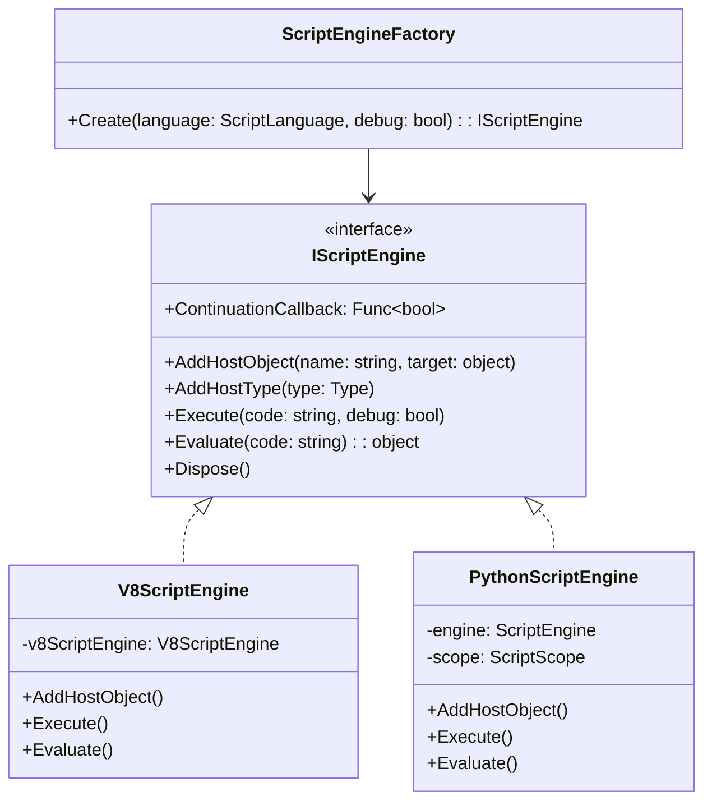
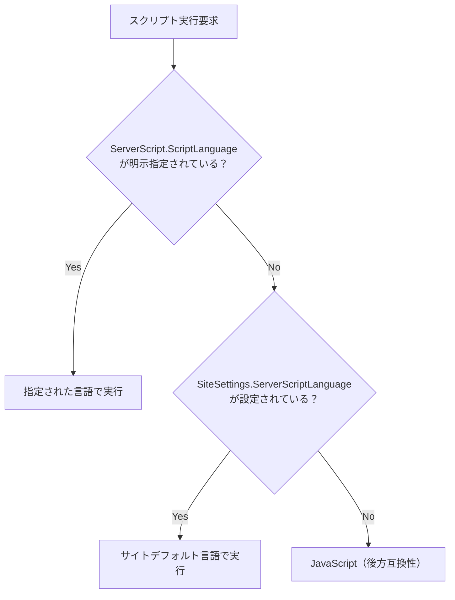
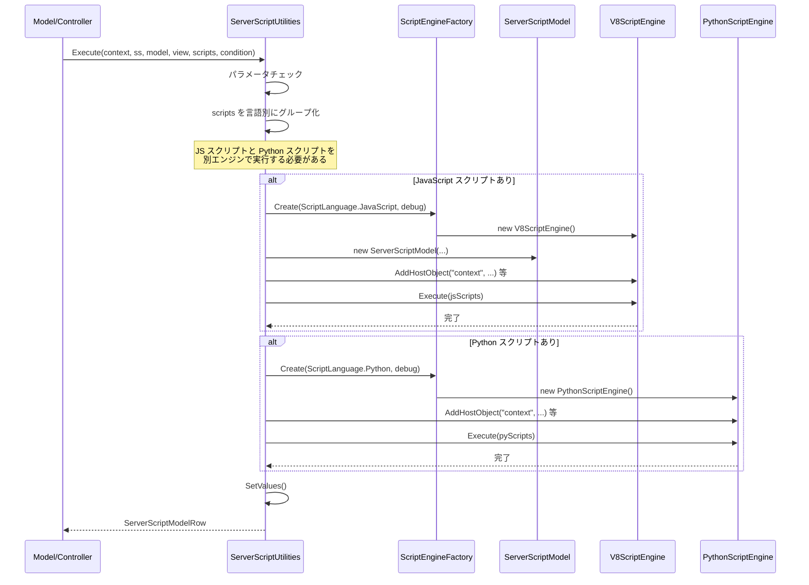

# ServerScript Python 対応の実現可能性調査

サーバースクリプト（ServerScript）に Python サポートを追加するためのライブラリ選定、実現可能性、実装方法、および SiteId 単位での JS/Python 切替方式を調査する。

<!-- START doctoc generated TOC please keep comment here to allow auto update -->
<!-- DON'T EDIT THIS SECTION, INSTEAD RE-RUN doctoc TO UPDATE -->

- [調査情報](#調査情報)
- [調査目的](#調査目的)
- [前提：現行 ServerScript アーキテクチャの概要](#前提現行-serverscript-アーキテクチャの概要)
    - [現行構成](#現行構成)
    - [ClearScript（V8）が採用されている安全性上の理由](#clearscriptv8が採用されている安全性上の理由)
    - [設計原則：値操作のみ許可（V8 同等の分離レベル）](#設計原則値操作のみ許可v8-同等の分離レベル)
    - [ClearScript 直接参照ファイル（Python 対応時に改修が必要）](#clearscript-直接参照ファイルpython-対応時に改修が必要)
- [Python スクリプトエンジン候補ライブラリ](#python-スクリプトエンジン候補ライブラリ)
    - [候補一覧](#候補一覧)
    - [各ライブラリの詳細評価](#各ライブラリの詳細評価)
    - [比較表](#比較表)
    - [推奨：IronPython 3](#推奨ironpython-3)
- [実装方針](#実装方針)
    - [アーキテクチャ設計](#アーキテクチャ設計)
    - [スクリプト言語の定義](#スクリプト言語の定義)
    - [変更が必要なファイル一覧](#変更が必要なファイル一覧)
- [SiteId 単位の JS/Python 切替設計](#siteid-単位の-jspython-切替設計)
    - [方式：スクリプト個別 + サイトデフォルト](#方式スクリプト個別--サイトデフォルト)
    - [データモデル変更](#データモデル変更)
    - [JSON 構造の変更（後方互換性）](#json-構造の変更後方互換性)
- [IronPython エンジン実装の詳細設計](#ironpython-エンジン実装の詳細設計)
    - [PythonScriptEngine クラス](#pythonscriptengine-クラス)
    - [ホストオブジェクトのマッピング](#ホストオブジェクトのマッピング)
    - [ExpandoObject の Python 側での操作](#expandoobject-の-python-側での操作)
    - [タイムアウト制御](#タイムアウト制御)
    - [サンドボックス（値操作のみへの制限）](#サンドボックス値操作のみへの制限)
- [ServerScriptFile / ServerScriptCsv の言語非依存化](#serverscriptfile--serverscriptcsv-の言語非依存化)
    - [課題](#課題)
    - [解決策](#解決策)
- [UI 変更の設計](#ui-変更の設計)
    - [ServerScript ダイアログへの言語選択追加](#serverscript-ダイアログへの言語選択追加)
    - [コードエディタの言語切替](#コードエディタの言語切替)
    - [サイト設定タブへのデフォルト言語設定追加](#サイト設定タブへのデフォルト言語設定追加)
- [実行フロー（変更後）](#実行フロー変更後)
    - [重要な設計判断：同一タイミングでの複数言語](#重要な設計判断同一タイミングでの複数言語)
- [実現可能性の評価](#実現可能性の評価)
    - [技術的リスク](#技術的リスク)
    - [工数見積り（概算）](#工数見積り概算)
- [段階的導入の提案](#段階的導入の提案)
    - [Phase 1: 基盤整備（IScriptEngine 抽象化）](#phase-1-基盤整備iscriptengine-抽象化)
    - [Phase 2: Python エンジン統合](#phase-2-python-エンジン統合)
    - [Phase 3: UI 対応 + File/CSV 非依存化](#phase-3-ui-対応--filecsv-非依存化)
    - [Phase 4: 拡張対応（将来）](#phase-4-拡張対応将来)
- [結論](#結論)
- [関連ドキュメント](#関連ドキュメント)
- [関連ソースコード](#関連ソースコード)

<!-- END doctoc generated TOC please keep comment here to allow auto update -->

## 調査情報

| 調査日        | リポジトリ | ブランチ | タグ/バージョン    | コミット    | 備考     |
| ------------- | ---------- | -------- | ------------------ | ----------- | -------- |
| 2026年2月23日 | Pleasanter | main     | Pleasanter_1.5.1.0 | `34f162a43` | 初回調査 |

## 調査目的

- 現行の ClearScript（V8/JavaScript）ベースの ServerScript に Python 実行エンジンを追加する方法を調査する
- .NET 上で Python スクリプトを実行するためのライブラリを比較・選定する
- SiteId 単位で JavaScript / Python を切り替える仕組みの設計方針を明らかにする
- 実現可能性・技術的リスクを評価する

---

## 前提：現行 ServerScript アーキテクチャの概要

詳細は [006-ServerScript実装.md](006-ServerScript実装.md) を参照。ここでは Python 対応に関連する要点のみ整理する。

### 現行構成

| 項目                     | 内容                                                                                               |
| ------------------------ | -------------------------------------------------------------------------------------------------- |
| スクリプトエンジン       | Microsoft.ClearScript.Complete v7.5.0（V8 エンジン）                                               |
| ターゲットフレームワーク | .NET 10.0                                                                                          |
| エンジンラッパー         | `ScriptEngine` クラス（`V8ScriptEngine` を薄くラップ、63行）                                       |
| ホストオブジェクト       | 19種（`context`, `model`, `saved`, `items`, `httpClient` 等）を `AddHostObject` で登録             |
| スクリプト保存           | `SiteSettings` JSON 内の `ServerScripts: SettingList<ServerScript>`                                |
| JS固有の依存箇所         | `ServerScriptFile.cs`, `ServerScriptCsv.cs` で `ScriptObject`、`V8ScriptEngine.Current` を直接使用 |

### ClearScript（V8）が採用されている安全性上の理由

プリザンターが ClearScript（V8 エンジン）を採用している理由の一つは、
**V8 が OS レベルの操作手段を一切持たない**点にある。

V8 は元々ブラウザ用の JavaScript エンジンであり、
以下のような OS 操作の API がエンジン内に存在しない。

| 操作                 | V8 (ClearScript)       | IronPython (DLR/.NET)                      |
| -------------------- | ---------------------- | ------------------------------------------ |
| プロセス起動         | **不可能**（API なし） | `import clr` → `Process.Start()` で可能    |
| OS シャットダウン    | **不可能**（API なし） | `os.system('shutdown')` で可能             |
| ファイルシステム操作 | **不可能**（API なし） | `System.IO.File` / `open()` で可能         |
| ネットワーク接続     | **不可能**（API なし） | `socket` / `System.Net` で可能             |
| 環境変数アクセス     | **不可能**（API なし） | `os.environ` / `System.Environment` で可能 |
| 他プロセスへの操作   | **不可能**（API なし） | `Process.GetProcesses()` 等で可能          |

> **重要**: ClearScript では `AddHostObject` で明示的に渡したオブジェクトのみが
> スクリプトからアクセス可能であり、それ以外の .NET API や OS 機能には
> **原理的にアクセスできない**。
> これにより、サンドボックスが「設計上無料で」手に入る。

これに対し IronPython は .NET の DLR 上で動作するため、
`import clr` から .NET の全名前空間にアクセスできてしまう。
Python 対応を追加する場合は、この**セキュリティモデルの根本的な差異**を
アプリケーションレベルで補完する必要がある。
詳細なサンドボックス実装については
[008-IronPythonサンドボックス.md](008-IronPythonサンドボックス.md) を参照。

### 設計原則：値操作のみ許可（V8 同等の分離レベル）

ClearScript（V8）が「原理的に OS 操作不可能」であることを踏まえ、
Python エンジンでも **V8 と同等の分離レベル** を設計上の必須要件とする。

具体的には、Python スクリプトで許可する操作は
**提供されたホストオブジェクト経由の値操作のみ**に限定する。

#### 許可する操作（ホワイトリスト）

| カテゴリ             | 操作例                                             | 備考                       |
| -------------------- | -------------------------------------------------- | -------------------------- |
| モデル値の読み書き   | `model.ClassA = 'test'`、`v = model.NumA`          | ExpandoObject プロパティ   |
| コンテキスト参照     | `context.UserId`、`context.DeptId`                 | 読み取り専用が多い         |
| 保存前の値参照       | `saved.ClassA`                                     | 変更前値との比較           |
| ホストAPI呼び出し    | `items.Get(123)`、`items.Create(siteId, body)`     | C# 側で制御されたメソッド  |
| エラー・応答制御     | `context.ErrorData.Type = 1`                       | バリデーション用           |
| 列情報参照           | `columns.ClassA.ReadOnly = True`                   | UI 制御                    |
| Python 基本構文      | 条件分岐・ループ・リスト内包表記・文字列操作・算術 | 言語組み込みの純粋演算     |
| 安全な組み込み関数   | `len`, `str`, `int`, `float`, `bool`, `list` 等    | 副作用のない変換・集計関数 |
| 安全な標準モジュール | `math`, `json`, `datetime`, `re`                   | 純粋演算のみ。I/O なし     |

#### 禁止する操作（ブロックリスト）

| カテゴリ               | 操作例                                       | 理由                             |
| ---------------------- | -------------------------------------------- | -------------------------------- |
| `.NET interop`         | `import clr`                                 | 全 .NET API へのアクセスを遮断   |
| OS 操作                | `import os`、`import subprocess`             | プロセス・シェル実行の防止       |
| ファイル I/O           | `open()`, `import io`                        | サーバーファイルへの直接アクセス |
| ネットワーク           | `import socket`, `import urllib`             | 制御外の通信を防止               |
| コード動的生成         | `exec()`, `eval()`, `compile()`              | サンドボックス迂回の防止         |
| モジュール動的読込     | `__import__()`, `importlib`                  | ホワイトリスト外のインポート防止 |
| リフレクション         | `__subclasses__()`, `__bases__`              | 型階層経由のエスケープ防止       |
| ctypes（FFI）          | `import ctypes`                              | ネイティブコード実行の防止       |
| pickle / marshal       | `import pickle`                              | 任意コード実行の防止             |
| スレッド・プロセス生成 | `import threading`, `import multiprocessing` | リソース制御外の並行処理防止     |

#### V8 との対照：分離モデルの違い

```text
V8 (ClearScript):
  ┌──────────────────────────┐
  │  ホストオブジェクト のみ  │ ← AddHostObject で注入した物だけ見える
  │  OS API = 存在しない      │ ← エンジンに API が無い（原理的保証）
  └──────────────────────────┘

IronPython (目標):
  ┌──────────────────────────┐
  │  ホストオブジェクト のみ  │ ← SetVariable で注入した物だけ見える
  │  OS API = 封鎖済み        │ ← builtins/import/clr を制限（実装的保証）
  └──────────────────────────┘
  ※ 「原理的保証」ではなく「実装的保証」であるため、
     ホワイトリスト方式の徹底 + 継続的な脆弱性検証が必須
```

> **設計方針**: Python スクリプトの目的は
> 「JavaScript と同じこと（ホストオブジェクト経由の値操作）を
> Python 構文で書けるようにする」ことであり、
> Python の汎用プログラミング機能（ファイル操作・ネットワーク・OS制御等）を
> 提供することでは**ない**。
> この原則に基づき、IronPython の機能を最小限にロックダウンした状態で提供する。

### ClearScript 直接参照ファイル（Python 対応時に改修が必要）

| ファイル                          | ClearScript 依存内容                                         |
| --------------------------------- | ------------------------------------------------------------ |
| `ScriptEngine.cs`                 | `V8ScriptEngine`, `V8ScriptEngineFlags`, `DocumentInfo` 等   |
| `FormulaServerScriptUtilities.cs` | `ScriptEngineException` のキャッチ                           |
| `ServerScriptFile.cs`             | `ScriptObject` を引数に使用（JS コールバック）               |
| `ServerScriptCsv.cs`              | `ScriptObject`, `V8ScriptEngine.Current.Script.Array.from()` |
| `ServerScriptJsLibraries.cs`      | JS 固有の初期化コード（`$ps`, `$p` オブジェクト構築）        |

---

## Python スクリプトエンジン候補ライブラリ

### 候補一覧

| #   | ライブラリ         | 方式                   | NuGet パッケージ     | ライセンス | .NET 10 対応 |
| --- | ------------------ | ---------------------- | -------------------- | ---------- | ------------ |
| 1   | **IronPython 3**   | .NET 実装 Python       | `IronPython` (3.4.x) | Apache 2.0 | Yes          |
| 2   | **Python.NET**     | CPython 埋め込み       | `pythonnet` (3.0.x)  | MIT        | Yes          |
| 3   | **Jint + Esprima** | (参考) JS エンジン代替 | `Jint`               | BSD-2      | Yes          |

### 各ライブラリの詳細評価

#### 1. IronPython 3（推奨）

| 項目                  | 内容                                                                                                                                         |
| --------------------- | -------------------------------------------------------------------------------------------------------------------------------------------- |
| **概要**              | Python 言語の .NET 純粋実装。CPython を使わず、DLR (Dynamic Language Runtime) 上で動作                                                       |
| **NuGet**             | `IronPython` (3.4.x)                                                                                                                         |
| **Python バージョン** | Python 3.4 互換（一部 3.6+ 構文もサポート）                                                                                                  |
| **依存関係**          | NuGet パッケージのみ。ネイティブランタイム不要                                                                                               |
| **ホスト連携**        | .NET オブジェクトを直接 Python スコープに注入可能（`scope.SetVariable()`）                                                                   |
| **サンドボックス**    | **要注意**: DLR/.NET 上で動作するため `import clr` 経由で OS 操作が可能。builtins/import/clr の4層ロックダウンで「値操作のみ」に制限する設計 |
| **パフォーマンス**    | DLR の JIT コンパイルにより初回実行はやや遅いが、2回目以降は高速                                                                             |
| **スレッドセーフ**    | エンジンインスタンスごとにスコープを分離すれば安全                                                                                           |
| **制約**              | NumPy・Pandas 等の C拡張モジュールは使用不可。純粋 Python ライブラリのみ利用可能                                                             |
| **Docker 対応**       | ネイティブ依存なし。追加インストール不要                                                                                                     |

```csharp
// IronPython 使用例
using IronPython.Hosting;
using Microsoft.Scripting.Hosting;

var engine = Python.CreateEngine();
var scope = engine.CreateScope();
scope.SetVariable("context", model.Context);
scope.SetVariable("model", model.Model);
engine.Execute(script.Body, scope);
```

#### 2. Python.NET (pythonnet)

| 項目                  | 内容                                                                       |
| --------------------- | -------------------------------------------------------------------------- |
| **概要**              | CPython インタプリタを .NET プロセス内に埋め込む。完全な CPython 互換      |
| **NuGet**             | `pythonnet` (3.0.x)                                                        |
| **Python バージョン** | CPython 3.8〜3.12（システムにインストール済みの CPython を使用）           |
| **依存関係**          | **CPython のシステムインストールが必須**                                   |
| **ホスト連携**        | `PythonEngine.Initialize()` → `PyModule` にオブジェクト注入                |
| **サンドボックス**    | CPython の全機能にアクセス可能（`os`, `subprocess` 等）。制限が難しい      |
| **パフォーマンス**    | CPython ネイティブ速度。NumPy 等の C拡張も利用可能                         |
| **スレッドセーフ**    | GIL による制限あり。マルチスレッド環境では注意が必要                       |
| **制約**              | CPython インストール必須、GIL、バージョン固定リスク、Docker イメージ肥大化 |
| **Docker 対応**       | Python ランタイムのインストールが必要。イメージサイズ増                    |

```csharp
// Python.NET 使用例
using Python.Runtime;
PythonEngine.Initialize();
using (Py.GIL())
{
    using var scope = Py.CreateScope();
    scope.Set("context", model.Context.ToPython());
    scope.Exec(script.Body);
}
```

### 比較表

| 評価項目                     | IronPython 3          | Python.NET         |
| ---------------------------- | --------------------- | ------------------ |
| デプロイ容易性               | **◎ NuGet のみ**      | △ CPython 必須     |
| Docker 対応                  | **◎ 追加不要**        | △ Python 追加必要  |
| .NET オブジェクト連携        | **◎ ネイティブ**      | ○ 変換必要         |
| Python 言語互換性            | △ Python 3.4 相当     | **◎ 完全互換**     |
| C拡張モジュール（NumPy等）   | × 不可                | **◎ 利用可能**     |
| サンドボックス性             | △ 4層ロックダウン必須 | × 制限困難         |
| スレッドセーフ               | **◎ スコープ分離**    | △ GIL 制約         |
| ライセンス                   | Apache 2.0            | MIT                |
| ClearScript との共存         | **◎ 問題なし**        | △ 初期化競合リスク |
| 既存アーキテクチャとの親和性 | **◎ 高い**            | △ 低い             |

### 推奨：IronPython 3

以下の理由から **IronPython 3** を推奨する。

1. **デプロイの容易性**: NuGet パッケージの追加のみで完結し、CPython のインストールが不要
2. **Docker 対応**: 既存の Dockerfile に変更不要（ネイティブ依存なし）
3. **.NET オブジェクトとの親和性**: DLR ベースのため、ClearScript と同様に `SetVariable()` で C# オブジェクトを直接注入可能
4. **サンドボックス**: V8 と異なり OS アクセスが原理的に可能。builtins/import/clr の4層ロックダウンで「値操作のみ」に制限（[詳細](008-IronPythonサンドボックス.md)）
5. **スレッドセーフ**: GIL の制約がなく、リクエストごとに独立したスコープを生成可能
6. **既存アーキテクチャとの整合**: `ScriptEngine` ラッパーパターンと同じ設計で実装可能

**制約事項**: NumPy, Pandas 等の C拡張モジュールは利用不可。
設計原則「値操作のみ許可」により、インポート可能なモジュールは
`math`, `json`, `datetime`, `re` 等の純粋演算モジュールに限定される。
ServerScript の用途（レコード操作、API呼出、条件分岐等）ではこの範囲で十分と判断。

---

## 実装方針

### アーキテクチャ設計

現行の `ScriptEngine` クラス（V8 ラッパー）と同等の `PythonScriptEngine` を新設し、共通インターフェースで抽象化する。



### スクリプト言語の定義

```csharp
public enum ScriptLanguage
{
    JavaScript = 0,  // デフォルト（後方互換性）
    Python = 1
}
```

### 変更が必要なファイル一覧

#### レイヤー 1: エンジン抽象化（コア変更）

| ファイル                          | 変更内容                                                                                |
| --------------------------------- | --------------------------------------------------------------------------------------- |
| `ScriptEngine.cs`                 | `IScriptEngine` インターフェースを抽出。既存クラスは `V8ScriptEngineWrapper` にリネーム |
| **新規** `IScriptEngine.cs`       | 共通インターフェース定義                                                                |
| **新規** `PythonScriptEngine.cs`  | IronPython ベースのエンジン実装                                                         |
| **新規** `ScriptEngineFactory.cs` | 言語に応じたエンジンインスタンス生成                                                    |

#### レイヤー 2: データモデル変更

| ファイル          | 変更内容                                                           |
| ----------------- | ------------------------------------------------------------------ |
| `ServerScript.cs` | `ScriptLanguage` プロパティを追加                                  |
| `SiteSettings.cs` | `ServerScriptLanguage` プロパティを追加（SiteId 単位のデフォルト） |

#### レイヤー 3: 実行ロジック変更

| ファイル                              | 変更内容                                                            |
| ------------------------------------- | ------------------------------------------------------------------- |
| `ServerScriptUtilities.cs`            | `Execute` メソッドでエンジン生成を `ScriptEngineFactory` 経由に変更 |
| `FormulaServerScriptUtilities.cs`     | 計算式エンジンも言語対応（将来対応で可）                            |
| `ServerScriptJsLibraries.cs`          | JS 専用であることを明示。Python 版の初期化は別クラスに              |
| **新規** `ServerScriptPyLibraries.cs` | Python 版の初期化スクリプト                                         |

#### レイヤー 4: JS 固有依存の解消

| ファイル              | 変更内容                                                                |
| --------------------- | ----------------------------------------------------------------------- |
| `ServerScriptFile.cs` | `ScriptObject` → 言語非依存のコールバック方式に変更                     |
| `ServerScriptCsv.cs`  | `V8ScriptEngine.Current.Script.Array.from()` → 言語非依存の戻り値に変更 |

#### レイヤー 5: UI 変更

| ファイル             | 変更内容                                                  |
| -------------------- | --------------------------------------------------------- |
| `SiteUtilities.cs`   | ServerScript ダイアログにスクリプト言語選択 UI を追加     |
| `TenantUtilities.cs` | BackgroundServerScript にも言語選択を追加（将来対応で可） |

---

## SiteId 単位の JS/Python 切替設計

### 方式：スクリプト個別 + サイトデフォルト

2つのレベルで言語を制御する。



### データモデル変更

#### ServerScript クラスへの追加

**ファイル**: `Implem.Pleasanter/Libraries/Settings/ServerScript.cs`

```csharp
public class ServerScript : ISettingListItem
{
    // 既存プロパティ...
    public string Body;

    // 追加
    public int? Language;  // 0: JavaScript (default), 1: Python

    // 非シリアライズ補助プロパティ
    [NonSerialized]
    public ScriptLanguage ScriptLanguageValue =>
        (ScriptLanguage)(Language ?? 0);
}
```

`int?` 型を使用する理由:

- `null` の場合はサイトデフォルトにフォールバック（後方互換性）
- 既存の `SiteSettings` JSON への影響が最小（`Language` が `null` / 未定義なら JS として動作）

#### SiteSettings クラスへの追加

**ファイル**: `Implem.Pleasanter/Libraries/Settings/SiteSettings.cs`

```csharp
public class SiteSettings
{
    // 既存プロパティ...
    public SettingList<ServerScript> ServerScripts;
    public bool? ServerScriptsAllDisabled;

    // 追加
    public int? ServerScriptLanguage;  // サイトデフォルトの言語 (0: JS, 1: Python)
}
```

### JSON 構造の変更（後方互換性）

変更前（既存）:

```json
{
    "ServerScripts": [
        {
            "Id": 1,
            "Title": "BeforeCreate",
            "Body": "model.ClassA = 'test';",
            "BeforeCreate": true
        }
    ]
}
```

変更後:

```json
{
    "ServerScriptLanguage": 0,
    "ServerScripts": [
        {
            "Id": 1,
            "Title": "BeforeCreate (JS)",
            "Body": "model.ClassA = 'test';",
            "BeforeCreate": true,
            "Language": 0
        },
        {
            "Id": 2,
            "Title": "BeforeUpdate (Python)",
            "Body": "model.ClassA = 'updated'",
            "BeforeUpdate": true,
            "Language": 1
        }
    ]
}
```

- `Language` が未指定の既存レコードは `null` → JavaScript として扱われるため **後方互換性を維持**

---

## IronPython エンジン実装の詳細設計

### PythonScriptEngine クラス

```csharp
using IronPython.Hosting;
using Microsoft.Scripting.Hosting;
using System;
using System.Collections.Generic;

namespace Implem.Pleasanter.Libraries.ServerScripts
{
    /// <summary>
    /// IronPython ベースのスクリプトエンジン。
    /// 設計原則「値操作のみ許可」に基づき、
    /// V8 同等の分離レベルをアプリケーションレベルで実現する。
    /// </summary>
    public class PythonScriptEngine : IScriptEngine
    {
        private ScriptEngine engine;
        private ScriptScope scope;
        private Func<bool> continuationCallback;

        /// <summary>インポートを許可するモジュールのホワイトリスト</summary>
        private static readonly HashSet<string> AllowedModules = new(
            StringComparer.OrdinalIgnoreCase)
        {
            "math", "json", "datetime", "re", "decimal",
            "string", "collections", "itertools", "functools",
            "copy", "enum", "dataclasses", "typing",
        };

        /// <summary>許可する組み込み関数のホワイトリスト</summary>
        private static readonly HashSet<string> AllowedBuiltins = new()
        {
            // 型変換・生成
            "int", "float", "str", "bool", "bytes", "bytearray",
            "list", "tuple", "dict", "set", "frozenset",
            "complex", "memoryview",
            // 集計・比較
            "len", "max", "min", "sum", "abs", "round",
            "sorted", "reversed", "enumerate", "zip", "map",
            "filter", "range", "any", "all",
            // 型判定・変換
            "type", "isinstance", "issubclass",
            "id", "hash", "repr", "ascii",
            "chr", "ord", "hex", "oct", "bin",
            "format", "print",  // print はログ出力用に許可
            // コンテナ操作
            "iter", "next", "slice",
            "getattr", "setattr", "hasattr", "delattr",
            "vars", "dir",
            // その他安全な関数
            "callable", "staticmethod", "classmethod", "property",
            "super", "object",
            "divmod", "pow",
            "None", "True", "False",
            "NotImplemented", "Ellipsis",
            // 例外クラス（バリデーション用）
            "Exception", "ValueError", "TypeError",
            "KeyError", "IndexError", "AttributeError",
            "RuntimeError", "StopIteration", "TimeoutError",
        };

        public Func<bool> ContinuationCallback
        {
            set { continuationCallback = value; }
        }

        public PythonScriptEngine(bool debug)
        {
            var options = new Dictionary<string, object>();
            if (debug)
            {
                options["Debug"] = true;
            }
            engine = Python.CreateEngine(options);

            // ===== サンドボックス設定 =====
            ApplySandbox();

            scope = engine.CreateScope();
        }

        /// <summary>
        /// V8 同等の分離レベルを実現するためのサンドボックスを適用する。
        /// 4層防御: builtins制限 → import制御 → clr遮断 → SearchPaths空化
        /// </summary>
        private void ApplySandbox()
        {
            var runtime = engine.Runtime;

            // Layer 4: 標準ライブラリの物理パスを遮断
            engine.SetSearchPaths(Array.Empty<string>());

            // Layer 1-3 を Python コードで適用
            var sandboxInit = @"
import builtins as _builtins

# Layer 1: __builtins__ を許可リストのみに制限
_allowed = {" + string.Join(", ",
                AllowedBuiltins
                    .Select(b => $"'{b}'")) + @"}
_safe = {}
for name in _allowed:
    if hasattr(_builtins, name):
        _safe[name] = getattr(_builtins, name)
# 危険な関数を除去: open, exec, eval, compile, __import__, exit, quit
# → _safe に含まれないものは全て使用不可

# Layer 2: カスタム __import__ でホワイトリスト制御
_allowed_modules = {" + string.Join(", ",
                AllowedModules
                    .Select(m => $"'{m}'")) + @"}
_original_import = _builtins.__import__
def _sandboxed_import(name, *args, **kwargs):
    if name.split('.')[0] not in _allowed_modules:
        raise ImportError(
            f""Module '{name}' is not allowed in ServerScript"")
    return _original_import(name, *args, **kwargs)
_safe['__import__'] = _sandboxed_import

# Layer 3: clr モジュールを封鎖（.NET interop 遮断）
import sys
for blocked in ['clr', 'System', 'Microsoft', 'Implem']:
    sys.modules[blocked] = None

# builtins を差し替え
_builtins.__dict__.clear()
_builtins.__dict__.update(_safe)

# 作業変数をクリーンアップ
del _allowed, _safe, _allowed_modules, _original_import
del _builtins, sys
";
            // サンドボックス初期化は制限適用前に実行
            var source = engine.CreateScriptSourceFromString(
                sandboxInit,
                Microsoft.Scripting.SourceCodeKind.Statements);
            var initScope = engine.CreateScope();
            source.Execute(initScope);
        }

        public void AddHostType(Type type)
        {
            scope.SetVariable(type.Name, type);
        }

        public void AddHostObject(string itemName, object target)
        {
            scope.SetVariable(itemName, target);
        }

        public void Execute(string code, bool debug)
        {
            var source = engine.CreateScriptSourceFromString(
                code,
                Microsoft.Scripting.SourceCodeKind.Statements);
            source.Execute(scope);
        }

        public object Evaluate(string code)
        {
            var source = engine.CreateScriptSourceFromString(
                code,
                Microsoft.Scripting.SourceCodeKind.Expression);
            return source.Execute(scope);
        }

        public void Dispose()
        {
            scope = null;
            engine?.Runtime?.Shutdown();
            engine = null;
        }
    }
}
```

> **ポイント**: コンストラクタの段階でサンドボックスを適用し、
> ユーザースクリプトが実行される前に危険な機能を封鎖する。
> ユーザースクリプトからは `model`、`context`、`items` 等の
> ホストオブジェクトと、`math`、`json` 等の安全な標準モジュールのみアクセス可能。

### ホストオブジェクトのマッピング

IronPython は DLR ベースのため、C# の `ExpandoObject` を Python の動的オブジェクトとして直接操作できる。
ClearScript の `AddHostObject` と同等の処理が `scope.SetVariable()` で実現可能。

| ClearScript (JS)                            | IronPython (Python)                        | 互換性 |
| ------------------------------------------- | ------------------------------------------ | ------ |
| `engine.AddHostObject("context", obj)`      | `scope.SetVariable("context", obj)`        | ◎      |
| `engine.AddHostObject("model", expandoObj)` | `scope.SetVariable("model", expandoObj)`   | ◎      |
| `engine.AddHostType(typeof(JsonConvert))`   | `scope.SetVariable("JsonConvert", typeof)` | ○      |
| `engine.Execute(code)`                      | `source.Execute(scope)`                    | ◎      |
| `engine.Evaluate(code)`                     | `source.Execute(scope)` (Expression mode)  | ◎      |

### ExpandoObject の Python 側での操作

ClearScript では `model.ClassA = 'test'` で `ExpandoObject` のプロパティにアクセスする。
IronPython でも `ExpandoObject` は `IDictionary<string, object>` を実装しているため、同様の記法で操作可能。

```python
# Python スクリプト内での操作例
model.ClassA = 'test'           # プロパティ設定
value = model.NumA              # プロパティ取得
context.ErrorData.Type = 1      # ネストオブジェクトも操作可能
items.Get(123)                  # メソッド呼び出し
```

### タイムアウト制御

ClearScript では `ContinuationCallback` で実行中に定期的にタイムアウトチェックを行っている。IronPython では以下の方式で同等の機能を実現する。

| 方式                   | 実装方法                                              | 評価   |
| ---------------------- | ----------------------------------------------------- | ------ |
| **スレッドタイマー**   | 別スレッドから `Thread.Abort()` / `ScriptEngine` 停止 | △ 危険 |
| **Trace コールバック** | `sys.settrace` でステートメントごとにコールバック     | ◎ 推奨 |
| **タスクタイムアウト** | `Task.Run` + `CancellationToken` で外部からキャンセル | ○      |

推奨方式は **`sys.settrace` によるトレースコールバック**:

```csharp
// タイムアウトチェック用の Python コード挿入
var timeoutScript = $@"
import sys
_timeout_check = context._ServerScript._TimeOutCallback
def _trace_callback(frame, event, arg):
    if not _timeout_check():
        raise TimeoutError('ServerScript timeout')
    return _trace_callback
sys.settrace(_trace_callback)
";
engine.Execute(timeoutScript, debug: false);
```

### サンドボックス（値操作のみへの制限）

設計原則「**値操作のみ許可**」を実現するため、
IronPython エンジンをコンストラクタの段階で完全にロックダウンする。
目標は V8 の「AddHostObject で渡したもの以外アクセス不可」と同等の状態を
アプリケーションレベルで再現すること。

#### ロックダウンの全体像

```text
IronPython エンジン起動
  │
  ├─ Layer 4: SearchPaths 空化 → .py ファイルの読み込み遮断
  ├─ Layer 1: __builtins__ → 許可リストの関数のみ残す
  ├─ Layer 2: __import__ → ホワイトリスト(math,json等)のみ許可
  ├─ Layer 3: sys.modules → clr/System/Microsoft を None で封鎖
  │
  ▼
ユーザースクリプト実行
  │
  ├─ model.ClassA = 'test'      （値操作 → 許可）
  ├─ v = math.floor(model.NumA) （安全モジュール → 許可）
  ├─ items.Get(123)             （ホストAPI → 許可）
  ├─ import os                   （ブロックモジュール → ImportError）
  ├─ open('/etc/passwd')         （builtins除去済 → NameError）
  ├─ import clr                  （sys.modules=None → ImportError）
  └─ exec('...')                 （builtins除去済 → NameError）
```

#### ユーザースクリプトから見える世界

ロックダウン後、ユーザースクリプトから見えるのは
以下の 3 カテゴリのみとなる。

| カテゴリ           | 内容                                           | 提供方法                           |
| ------------------ | ---------------------------------------------- | ---------------------------------- |
| ホストオブジェクト | `model`, `context`, `items`, `columns` 等 19種 | `scope.SetVariable()` で注入       |
| 安全な builtins    | `len`, `str`, `int`, `list`, `range` 等        | ホワイトリストで残した組み込み関数 |
| 安全なモジュール   | `math`, `json`, `datetime`, `re` 等            | カスタム `__import__` で許可       |

これは V8 における
「AddHostObject で渡したオブジェクト + JavaScript の言語組み込み機能」
と同等のアクセス範囲となる。

---

## ServerScriptFile / ServerScriptCsv の言語非依存化

### 課題

`ServerScriptFile.cs` と `ServerScriptCsv.cs` は ClearScript 固有の型に依存している。

#### ServerScriptFile の依存

```csharp
// 現行: ScriptObject（ClearScript 固有）をコールバックに使用
public string ReadAllText(
    ScriptObject callback,  // ← ClearScript 固有
    string section, string path, string encode)
```

#### ServerScriptCsv の依存

```csharp
// 現行: V8ScriptEngine.Current で JS 配列を生成
return V8ScriptEngine.Current.Script.Array.from(allAry);  // ← ClearScript 固有
```

### 解決策

#### 方式A: コールバックを Action/Func に変更（推奨）

```csharp
// 変更後: 言語非依存のコールバック
public string ReadAllText(
    Action<string, string> errorCallback,  // 言語非依存
    string section, string path, string encode)
```

JS側・Python側それぞれで言語固有のラッパーを提供:

```javascript
// JavaScript 側ラッパー
$ps.file = {
    readAllText: function (section, path, encode) {
        return _file_cs.ReadAllText(
            function (type, msg) {
                throw new Error(msg);
            },
            section,
            path,
            encode
        );
    },
};
```

```python
# Python 側ラッパー
class FileApi:
    def read_all_text(self, section, path, encode="utf-8"):
        def error_callback(type, msg):
            raise Exception(msg)
        return _file_cs.ReadAllText(error_callback, section, path, encode)
```

#### 方式B: 戻り値を .NET 型に統一

`ServerScriptCsv.Text2Csv` の戻り値を `List<List<string>>` にし、 JS/Python 各ラッパーで言語固有の配列に変換する。

---

## UI 変更の設計

### ServerScript ダイアログへの言語選択追加

**ファイル**: `Implem.Pleasanter/Models/Sites/SiteUtilities.cs`（`ServerScriptDialog` メソッド）

現行のダイアログに `FieldDropDown` を追加:

```csharp
.FieldDropDown(
    controlId: "ServerScriptLanguage",
    fieldCss: "field-normal",
    controlCss: " always-send",
    labelText: Displays.Language(context: context),
    optionCollection: new Dictionary<string, string>
    {
        { "0", "JavaScript" },
        { "1", "Python" }
    },
    selectedValue: script.Language?.ToString() ?? "0")
```

### コードエディタの言語切替

現行のコードエディタは `dataLang: "javascript"` が固定されている。言語選択に応じて動的に切り替える:

```csharp
.FieldCodeEditor(
    context: context,
    controlId: "ServerScriptBody",
    fieldCss: "field-wide",
    controlCss: " always-send",
    dataLang: script.ScriptLanguageValue == ScriptLanguage.Python
        ? "python"
        : "javascript",
    labelText: Displays.Script(context: context),
    text: script.Body)
```

### サイト設定タブへのデフォルト言語設定追加

`ServerScriptsSettingsEditor` にサイト全体のデフォルト言語を設定する UI を追加:

```csharp
.FieldDropDown(
    controlId: "ServerScriptDefaultLanguage",
    fieldCss: "field-normal",
    controlCss: " always-send",
    labelText: Displays.DefaultLanguage(context: context),
    optionCollection: new Dictionary<string, string>
    {
        { "0", "JavaScript" },
        { "1", "Python" }
    },
    selectedValue: ss.ServerScriptLanguage?.ToString() ?? "0")
```

---

## 実行フロー（変更後）



### 重要な設計判断：同一タイミングでの複数言語

同一タイミング（例: `BeforeCreate`）に JS と Python の両方のスクリプトが設定されている場合の動作:

| 方式               | 説明                                                | 推奨   |
| ------------------ | --------------------------------------------------- | ------ |
| **言語別順次実行** | JS スクリプトを先に全て実行し、その後 Python を実行 | ◎ 推奨 |
| 登録順実行         | スクリプトの Id 順に言語を切り替えながら実行        | △      |
| 混在禁止           | 同一タイミングで異なる言語のスクリプトを禁止        | ○      |

推奨は **言語別順次実行**。既存の ClearScript の挙動（複数スクリプトを連結して一度に実行）と整合性を保つため。

---

## 実現可能性の評価

### 技術的リスク

| リスク                           | 影響度 | 発生確率 | 対策                                                                                                                                                   |
| -------------------------------- | ------ | -------- | ------------------------------------------------------------------------------------------------------------------------------------------------------ |
| IronPython と ExpandoObject 連携 | 中     | 低       | DLR ベースのため基本的に互換。事前に POC で検証                                                                                                        |
| タイムアウト制御                 | 中     | 中       | `sys.settrace` 方式で実装可能。無限ループ対策は検証必要                                                                                                |
| **OS操作・サンドボックス漏れ**   | **高** | **中**   | 4層ロックダウン必須（[詳細](008-IronPythonサンドボックス.md)）。「値操作のみ」の原則に基づき builtins/import/clr を封鎖。V8 と異なり原理的保証ではない |
| PropertyChanged イベント         | 中     | 低       | ExpandoObject への代入で自動発火するため、Python でも動作する                                                                                          |
| FormulaServerScript 対応         | 低     | -        | 初期リリースでは JS のみ維持。将来課題とする                                                                                                           |
| CodeDefiner テンプレート         | 低     | 低       | 言語切替は実行時判定のため、テンプレート変更不要                                                                                                       |
| 既存スクリプトの互換性           | 低     | 低       | デフォルト JS のため影響なし                                                                                                                           |

### 工数見積り（概算）

| フェーズ                          | 工数（人日） | 備考                                               |
| --------------------------------- | ------------ | -------------------------------------------------- |
| IScriptEngine 抽象化              | 2            | インターフェース抽出 + 既存リファクタ              |
| PythonScriptEngine 実装           | 5            | IronPython 統合 + タイムアウト + 4層サンドボックス |
| ScriptEngineFactory 実装          | 0.5          | ファクトリパターン                                 |
| ServerScript データモデル変更     | 1            | Language プロパティ追加 + JSON 互換性テスト        |
| ServerScriptUtilities 変更        | 2            | Execute メソッドの言語分岐                         |
| ServerScriptFile/Csv 言語非依存化 | 2            | ClearScript 依存除去                               |
| Python 版初期化スクリプト         | 1            | $ps 相当のヘルパー関数                             |
| UI 変更（言語選択UI）             | 1.5          | ダイアログ + エディタ言語切替                      |
| SiteSettings 変更                 | 0.5          | デフォルト言語設定                                 |
| テスト（単体 + 結合）             | 5            | 既存 JS 回帰 + Python + サンドボックス突破テスト   |
| **合計**                          | **20.5**     |                                                    |

---

## 段階的導入の提案

### Phase 1: 基盤整備（IScriptEngine 抽象化）

- `IScriptEngine` インターフェースの導入
- 既存 `ScriptEngine` → `V8ScriptEngineWrapper` へのリネーム
- `ScriptEngineFactory` の導入
- **既存動作に影響なし**（リファクタリングのみ）

### Phase 2: Python エンジン統合

- `PythonScriptEngine` の実装（IronPython 統合）
- タイムアウト制御・サンドボックスの実装
- `ServerScript.Language` プロパティの追加
- `ServerScriptUtilities.Execute` の言語分岐

### Phase 3: UI 対応 + File/CSV 非依存化

- ServerScript ダイアログの言語選択 UI
- コードエディタの言語切替
- `ServerScriptFile` / `ServerScriptCsv` の ClearScript 依存除去
- `SiteSettings.ServerScriptLanguage`（サイトデフォルト）の追加

### Phase 4: 拡張対応（将来）

- `FormulaServerScriptUtilities` の Python 対応
- `BackgroundServerScript` の Python 対応
- Python 用の追加ヘルパーライブラリ
- テンプレートスクリプト提供（Python 版サンプル集）

---

## 結論

| 項目                    | 結論                                                                                                                              |
| ----------------------- | --------------------------------------------------------------------------------------------------------------------------------- |
| 推奨ライブラリ          | **IronPython 3**（NuGet のみ、ネイティブ依存なし、DLR ベースで .NET 連携容易）                                                    |
| Python.NET を避ける理由 | CPython インストール必須、GIL 制約、サンドボックス困難、Docker イメージ肥大化                                                     |
| 実現可能性              | **高い**。既存の `ScriptEngine` ラッパーパターンに沿って実装可能                                                                  |
| 後方互換性              | `Language` プロパティの既定値 `null` → JS として動作。既存データへの影響なし                                                      |
| SiteId 単位切替         | `SiteSettings.ServerScriptLanguage`（サイトデフォルト）+ `ServerScript.Language`（個別指定）の2段構成                             |
| 主要な技術リスク        | **サンドボックス**: V8 と異なり OS 操作が原理的に可能。「値操作のみ許可」の原則に基づく4層ロックダウン + 継続的な脆弱性検証が必要 |
| ClearScript 固有依存    | `ServerScriptFile.cs` / `ServerScriptCsv.cs` の 2ファイルに限定。解消可能                                                         |
| CodeDefiner への影響    | なし（言語切替は実行時判定のため、自動生成テンプレートの変更不要）                                                                |
| FormulaServerScript     | 初期リリースでは対象外（JS のみ維持）。将来課題                                                                                   |

---

## 関連ドキュメント

- [ServerScript 実装](006-ServerScript実装.md) — 現行アーキテクチャの詳細
- [IronPython サンドボックス](008-IronPythonサンドボックス.md) — OS 操作封じ込めの4層防御実装

## 関連ソースコード

| ファイル                                                                               | 説明                                    |
| -------------------------------------------------------------------------------------- | --------------------------------------- |
| `Implem.Pleasanter/Implem.Pleasanter/Libraries/ServerScripts/ScriptEngine.cs`          | 既存 V8 エンジンラッパー（改修対象）    |
| `Implem.Pleasanter/Implem.Pleasanter/Libraries/ServerScripts/ServerScriptUtilities.cs` | メイン実行ロジック（改修対象）          |
| `Implem.Pleasanter/Implem.Pleasanter/Libraries/ServerScripts/ServerScriptFile.cs`      | ファイル操作（ClearScript 依存あり）    |
| `Implem.Pleasanter/Implem.Pleasanter/Libraries/ServerScripts/ServerScriptCsv.cs`       | CSV 操作（ClearScript 依存あり）        |
| `Implem.Pleasanter/Implem.Pleasanter/Libraries/Settings/ServerScript.cs`               | データモデル（Language 追加対象）       |
| `Implem.Pleasanter/Implem.Pleasanter/Libraries/Settings/SiteSettings.cs`               | サイト設定（デフォルト言語追加対象）    |
| `Implem.Pleasanter/Implem.Pleasanter/Models/Sites/SiteUtilities.cs`                    | UI（ダイアログ改修対象）                |
| `Implem.Pleasanter/Implem.Pleasanter/Implem.Pleasanter.csproj`                         | NuGet パッケージ参照（IronPython 追加） |
