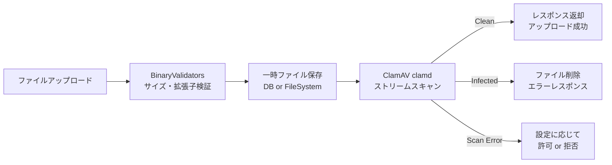

# 添付ファイルのウイルススキャン手法

Pleasanter の添付ファイルアップロード時にウイルススキャンを実施する方法について調査した結果をまとめる。クロスプラットフォーム対応かつ無償で実現可能な手法を中心に、既存アンチウイルスソフトウェアとの連携も含めて検討する。

<!-- START doctoc generated TOC please keep comment here to allow auto update -->
<!-- DON'T EDIT THIS SECTION, INSTEAD RE-RUN doctoc TO UPDATE -->

- [調査情報](#調査情報)
- [調査目的](#調査目的)
- [Pleasanter 添付ファイルアップロードの現状](#pleasanter-添付ファイルアップロードの現状)
    - [既存のバリデーション](#既存のバリデーション)
    - [拡張子除外リスト](#拡張子除外リスト)
    - [アップロードフローにおけるスキャン挿入ポイント](#アップロードフローにおけるスキャン挿入ポイント)
- [ウイルススキャン手法の比較](#ウイルススキャン手法の比較)
    - [手法一覧](#手法一覧)
    - [1. ClamAV（clamd デーモン経由）— 推奨](#1-clamavclamd-デーモン経由-推奨)
    - [2. ClamAV（clamscan コマンド直接実行）](#2-clamavclamscan-コマンド直接実行)
    - [3. Windows Defender — AMSI（Antimalware Scan Interface）](#3-windows-defender--amsiantimalware-scan-interface)
    - [4. Windows Defender（MpCmdRun.exe コマンド実行）](#4-windows-defendermpcmdrunexe-コマンド実行)
    - [5. YARA ルールスキャン](#5-yara-ルールスキャン)
    - [6. VirusTotal API（無償枠）](#6-virustotal-api無償枠)
    - [7. OS 標準 AV 自動判別方式（推奨構成）](#7-os-標準-av-自動判別方式推奨構成)
- [手法別比較表](#手法別比較表)
- [推奨構成](#推奨構成)
    - [第 1 推奨: ClamAV（clamd デーモン）](#第-1-推奨-clamavclamd-デーモン)
    - [第 2 推奨: OS 標準 AV 自動判別（Windows + Linux 混在環境向け）](#第-2-推奨-os-標準-av-自動判別windows--linux-混在環境向け)
    - [補助的な併用: VirusTotal ハッシュチェック](#補助的な併用-virustotal-ハッシュチェック)
- [Pleasanter への統合方針](#pleasanter-への統合方針)
    - [アプローチ A: 本体コード改修（直接統合）](#アプローチ-a-本体コード改修直接統合)
    - [アプローチ B: ExtendedLibraries プラグイン拡張](#アプローチ-b-extendedlibraries-プラグイン拡張)
    - [アプローチ C: リバースプロキシ層でのスキャン](#アプローチ-c-リバースプロキシ層でのスキャン)
    - [アプローチ D: ServerScript でのスキャン呼び出し](#アプローチ-d-serverscript-でのスキャン呼び出し)
    - [アプローチ比較](#アプローチ比較)
- [nClam ライブラリ詳細](#nclam-ライブラリ詳細)
    - [基本情報](#基本情報)
    - [主要 API](#主要-api)
- [結論](#結論)
- [関連ソースコード](#関連ソースコード)
- [関連リンク](#関連リンク)

<!-- END doctoc generated TOC please keep comment here to allow auto update -->

## 調査情報

| 調査日     | リポジトリ | ブランチ        | タグ/バージョン    | コミット    | 備考                               |
| ---------- | ---------- | --------------- | ------------------ | ----------- | ---------------------------------- |
| 2026-02-24 | Pleasanter | (detached HEAD) | Pleasanter_1.5.1.0 | `34f162a43` | 添付ファイル処理の実装を対象に調査 |

## 調査目的

Pleasanter にはファイルアップロード時のウイルススキャン機構が存在しない。
マルウェアが `.docx`・`.pdf`・`.zip` 等の許可された拡張子に偽装されてアップロードされるリスクがあるため、
クロスプラットフォーム（Windows / Linux）かつ無償で実施可能なウイルススキャン手法を調査し、
Pleasanter への統合方針を検討する。

---

## Pleasanter 添付ファイルアップロードの現状

### 既存のバリデーション

現時点で Pleasanter に実装されているファイルバリデーションは以下の通り。**ウイルススキャンは一切実装されていない。**

| バリデーション         | メソッド / ファイル       | 内容                                                         |
| ---------------------- | ------------------------- | ------------------------------------------------------------ |
| 件数制限               | `OverLimitQuantity()`     | カラムごとの `LimitQuantity`（デフォルト 30）                |
| 個別サイズ制限         | `OverLimitSize()`         | DB: `column.LimitSize` MB / Local: `LocalFolderLimitSize` MB |
| 合計サイズ制限         | `OverTotalLimitSize()`    | `column.TotalLimitSize` / `LocalFolderTotalLimitSize`        |
| テナントストレージ制限 | `OverTenantStorageSize()` | `ContractSettings.StorageSize` (GB)                          |
| ファイル名検証         | `IsValidFileName()`       | null 文字、`..`、`/`、`\`、`:` を禁止、255 文字制限          |
| 拡張子ブロックリスト   | `IsAllowedExtension()`    | `Parameters.Form.AttachmentExcludedExtensions` で拒否        |
| 画像フォーマット検証   | `OnUploadingSiteImage()`  | `SixLabors.ImageSharp` で画像フォーマット検証                |
| MD5 ハッシュ検証       | `ValidateFileHash()`      | アップロード後のファイル整合性チェック                       |

### 拡張子除外リスト

`App_Data/Parameters/Form.json` に定義された 42 種類の実行可能ファイル拡張子がデフォルトでブロックされる。ただし `Form.Enabled` がデフォルト `false` のため、**明示的に有効化しないとこの検証は動作しない可能性がある。**

```text
.exe, .dll, .com, .scr, .pif, .msi, .msp, .bat, .cmd, .ps1,
.vbs, .vbe, .js, .jse, .wsf, .wsh, .aspx, .asp, .php, .php3,
.php4, .php5, .phtml, .jsp, .jspx, .cfm, .cfc, .hta, .htaccess,
.htpasswd, .config, .cer, .sh, .bash, .csh, .ksh, .pl, .py, .rb, .jar, .war
```

### アップロードフローにおけるスキャン挿入ポイント

`BinaryUtilities.UploadFile` メソッド（`BinaryUtilities.cs` L795〜）のフローにおいて、ウイルススキャンを挿入すべき箇所は以下の通り。

```text
1. 権限チェック (HasPermission)
2. BinaryValidators.OnUploading — サイズ・件数制限
3. BinaryValidators.OnValidatingFormUpload — 拡張子・ファイル名検証
4. ファイル保存（DB Upsert or ファイルシステム書き込み）
5. ★★ ウイルススキャン挿入ポイント ★★  ← Save 後・Response 返却前
6. ハッシュ検証 (ValidateFileHash)
7. CreateResult + CreateResponseJson でレスポンス返却
```

**DB 保存時**（`TemporaryBinaryStorageProvider == "Rds"`）: `MemoryStream` から `byte[]` を取得してスキャン可能。

**ファイルシステム保存時**: `App_Data/Temp/{uuid}/{fileName}` に書き込み済みのファイルをスキャン可能。

---

## ウイルススキャン手法の比較

### 手法一覧

| #   | 手法                                     | クロスプラットフォーム | 無償 | 統合難易度 | スキャン方式        |
| --- | ---------------------------------------- | :--------------------: | :--: | :--------: | ------------------- |
| 1   | ClamAV（clamd デーモン）                 |           可           |  可  |     低     | デーモン TCP/Unix   |
| 2   | ClamAV（clamscan コマンド）              |           可           |  可  |    最低    | プロセス起動        |
| 3   | Windows Defender（AMSI）                 |          不可          |  可  |     中     | COM/P/Invoke        |
| 4   | Windows Defender（MpCmdRun.exe）         |          不可          |  可  |     低     | プロセス起動        |
| 5   | YARA ルールスキャン                      |           可           |  可  |     中     | ライブラリ/プロセス |
| 6   | VirusTotal API（無償枠）                 |           可           |  可  |     低     | REST API            |
| 7   | OS 標準 AV 連携（AMSI / clamd 自動判別） |           可           |  可  |     中     | 複合                |

---

### 1. ClamAV（clamd デーモン経由）— 推奨

#### 概要

ClamAV はオープンソース（GPL v2）のアンチウイルスエンジン。`clamd` デーモンに TCP/Unix ソケット経由でファイルデータを送信し、マルウェア判定結果を受け取る。

#### 特徴

| 項目            | 内容                                                         |
| --------------- | ------------------------------------------------------------ |
| ライセンス      | GPL v2（無償）                                               |
| 対応 OS         | Windows / Linux / macOS                                      |
| .NET ライブラリ | [nClam](https://github.com/tekmaven/nClam)（MIT ライセンス） |
| NuGet           | `nClam`                                                      |
| スキャン方式    | ストリームスキャン（ファイルをネットワーク送信）             |
| 定義更新        | `freshclam` コマンドで自動更新可能                           |
| パフォーマンス  | デーモン常駐のため高速（プロセス起動コスト不要）             |
| Docker          | `clamav/clamav` 公式イメージあり                             |

#### .NET 統合コード例

```csharp
using nClam;

public class ClamAvScanner
{
    private readonly ClamClient _clam;

    public ClamAvScanner(string host = "localhost", int port = 3310)
    {
        _clam = new ClamClient(host, port);
    }

    /// <summary>
    /// byte[] をストリームスキャンする
    /// </summary>
    public async Task<ScanResult> ScanAsync(byte[] fileData)
    {
        var result = await _clam.SendAndScanFileAsync(fileData);
        return new ScanResult
        {
            IsClean = result.Result == ClamScanResults.Clean,
            VirusName = result.InfectedFiles?.FirstOrDefault()?.VirusName
        };
    }

    /// <summary>
    /// ファイルパスを指定してスキャンする
    /// </summary>
    public async Task<ScanResult> ScanFileAsync(string filePath)
    {
        var fileData = await File.ReadAllBytesAsync(filePath);
        return await ScanAsync(fileData);
    }
}

public class ScanResult
{
    public bool IsClean { get; set; }
    public string VirusName { get; set; }
}
```

#### ClamAV セットアップ

**Linux（Docker 推奨）:**

```bash
docker run -d --name clamav -p 3310:3310 clamav/clamav:latest
```

**Linux（パッケージ）:**

```bash
# Ubuntu/Debian
sudo apt-get install clamav clamav-daemon
sudo freshclam          # ウイルス定義更新
sudo systemctl start clamav-daemon

# RHEL/CentOS
sudo yum install clamav clamav-update clamd
```

**Windows:**

```powershell
# winget でインストール
winget install ClamAV.ClamAV

# または公式サイトからインストーラーをダウンロード
# https://www.clamav.net/downloads

# ウイルス定義更新
freshclam.exe

# デーモン起動
clamd.exe
```

#### clamd.conf 設定例

```ini
# TCP ソケットでリッスン（.NET クライアントから接続）
TCPSocket 3310
TCPAddr 127.0.0.1

# ストリームスキャンの最大サイズ（デフォルト 25MB）
StreamMaxLength 100M

# ログ
LogFile /var/log/clamav/clamd.log
LogTime yes
```

---

### 2. ClamAV（clamscan コマンド直接実行）

#### 概要

`clamd` デーモンを使わず、`clamscan` コマンドを直接プロセスとして起動する方式。セットアップが最も簡単だが、毎回エンジンの初期化が発生するためパフォーマンスが低い。

#### .NET 統合コード例

```csharp
public class ClamScanCommandScanner
{
    private readonly string _clamScanPath;

    public ClamScanCommandScanner(string clamScanPath = "clamscan")
    {
        _clamScanPath = clamScanPath;
    }

    public async Task<ScanResult> ScanFileAsync(string filePath)
    {
        var process = new Process
        {
            StartInfo = new ProcessStartInfo
            {
                FileName = _clamScanPath,
                Arguments = $"--no-summary \"{filePath}\"",
                RedirectStandardOutput = true,
                RedirectStandardError = true,
                UseShellExecute = false,
                CreateNoWindow = true
            }
        };
        process.Start();
        var output = await process.StandardOutput.ReadToEndAsync();
        await process.WaitForExitAsync();

        return new ScanResult
        {
            // clamscan: 終了コード 0 = clean, 1 = infected
            IsClean = process.ExitCode == 0,
            VirusName = process.ExitCode == 1
                ? output.Split("FOUND").FirstOrDefault()?.Trim()
                : null
        };
    }
}
```

#### 注意事項

- 毎回プロセス起動 + エンジン初期化 → **1 ファイルあたり数秒〜十数秒** のオーバーヘッド
- 高頻度のアップロードには不向き
- `clamdscan` コマンド（clamd デーモン経由の CLI）を使えばパフォーマンスは改善可能

---

### 3. Windows Defender — AMSI（Antimalware Scan Interface）

#### 概要

Windows 10 以降に標準搭載されている AMSI を利用して、Windows Defender（または AMSI 対応の他のアンチウイルス）にスキャンを委任する。

#### 特徴

| 項目            | 内容                                       |
| --------------- | ------------------------------------------ |
| 対応 OS         | Windows 10 / Windows Server 2016 以降のみ  |
| コスト          | 無償（OS 標準）                            |
| .NET ライブラリ | P/Invoke で `amsi.dll` を直接呼び出し      |
| パフォーマンス  | 高速（カーネルレベルでインメモリスキャン） |
| 定義更新        | Windows Update で自動更新                  |

#### .NET P/Invoke コード例

```csharp
using System.Runtime.InteropServices;

public class AmsiScanner : IDisposable
{
    private IntPtr _context;
    private IntPtr _session;

    [DllImport("amsi.dll", CharSet = CharSet.Unicode)]
    private static extern int AmsiInitialize(string appName, out IntPtr context);

    [DllImport("amsi.dll")]
    private static extern int AmsiOpenSession(IntPtr context, out IntPtr session);

    [DllImport("amsi.dll")]
    private static extern int AmsiScanBuffer(
        IntPtr context, byte[] buffer, uint length,
        string contentName, IntPtr session, out int result);

    [DllImport("amsi.dll")]
    private static extern void AmsiCloseSession(IntPtr context, IntPtr session);

    [DllImport("amsi.dll")]
    private static extern void AmsiUninitialize(IntPtr context);

    public AmsiScanner()
    {
        AmsiInitialize("PleasanterFileScanner", out _context);
        AmsiOpenSession(_context, out _session);
    }

    public ScanResult Scan(byte[] data, string fileName)
    {
        AmsiScanBuffer(_context, data, (uint)data.Length, fileName, _session, out int result);
        return new ScanResult
        {
            // AMSI_RESULT_DETECTED = 32768
            IsClean = result < 32768,
            VirusName = result >= 32768 ? "AMSI detection" : null
        };
    }

    public void Dispose()
    {
        AmsiCloseSession(_context, _session);
        AmsiUninitialize(_context);
    }
}
```

#### 利点と制約

- **利点**: 追加ソフトウェア不要（Windows に標準搭載）。サードパーティ AV が AMSI 対応であれば、そちらのエンジンも自動的に利用される
- **制約**: Windows 専用。Linux / macOS では利用不可

---

### 4. Windows Defender（MpCmdRun.exe コマンド実行）

#### 概要

Windows Defender の CLI ツール `MpCmdRun.exe` を直接呼び出す方式。AMSI より簡易だが、プロセス起動コストがある。

#### コード例

```csharp
public class WindowsDefenderScanner
{
    private const string MpCmdRunPath =
        @"C:\Program Files\Windows Defender\MpCmdRun.exe";

    public async Task<ScanResult> ScanFileAsync(string filePath)
    {
        var process = new Process
        {
            StartInfo = new ProcessStartInfo
            {
                FileName = MpCmdRunPath,
                Arguments = $"-Scan -ScanType 3 -File \"{filePath}\" -DisableRemediation",
                RedirectStandardOutput = true,
                UseShellExecute = false,
                CreateNoWindow = true
            }
        };
        process.Start();
        await process.WaitForExitAsync();

        return new ScanResult
        {
            // 終了コード 0 = clean, 2 = threat found
            IsClean = process.ExitCode == 0,
            VirusName = process.ExitCode == 2 ? "Windows Defender detection" : null
        };
    }
}
```

---

### 5. YARA ルールスキャン

#### 概要

YARA はマルウェアのパターンマッチングツール。カスタムルールを定義してバイナリパターン・文字列・構造をスキャンする。シグネチャベースの AV を補完する用途に適する。

#### 特徴

| 項目            | 内容                                                   |
| --------------- | ------------------------------------------------------ |
| ライセンス      | BSD 3-Clause（無償）                                   |
| 対応 OS         | Windows / Linux / macOS                                |
| .NET ライブラリ | [dnYara](https://github.com/airbus-cert/dnYara)（BSD） |
| NuGet           | `dnYara` / `dnYara.Interop`                            |
| 用途            | カスタムルールによるパターンマッチ                     |
| 定義更新        | ルールファイルを手動管理                               |

#### 注意事項

- AV エンジンの代替ではなく**補完的なツール**
- ルールの作成・メンテナンスに専門知識が必要
- 大量の公開ルールセットが利用可能（[YARA-Rules](https://github.com/Yara-Rules/rules)、[Awesome YARA](https://github.com/InQuest/awesome-yara)）

---

### 6. VirusTotal API（無償枠）

#### 概要

70 以上のアンチウイルスエンジンでファイルをスキャンできるクラウドサービス。無償の Public API が利用可能。

#### 特徴

| 項目             | 内容                                                   |
| ---------------- | ------------------------------------------------------ |
| 対応 OS          | クロスプラットフォーム（REST API）                     |
| 無償枠制限       | 1 日 500 リクエスト / 1 分 4 リクエスト                |
| スキャンエンジン | 70+ のベンダー（Defender、ClamAV、Kaspersky 等）       |
| レスポンス時間   | ハッシュ検索: 即時 / ファイルアップロード: 数分        |
| プライバシー     | **アップロードしたファイルは VirusTotal に保存される** |

#### .NET 統合コード例

```csharp
public class VirusTotalScanner
{
    private readonly HttpClient _http;
    private readonly string _apiKey;

    public VirusTotalScanner(string apiKey)
    {
        _apiKey = apiKey;
        _http = new HttpClient
        {
            BaseAddress = new Uri("https://www.virustotal.com/api/v3/")
        };
        _http.DefaultRequestHeaders.Add("x-apikey", _apiKey);
    }

    /// <summary>
    /// SHA-256 ハッシュで既知の結果を検索（高速・レート制限節約）
    /// </summary>
    public async Task<ScanResult> CheckHashAsync(byte[] fileData)
    {
        using var sha256 = System.Security.Cryptography.SHA256.Create();
        var hash = BitConverter.ToString(sha256.ComputeHash(fileData))
            .Replace("-", "").ToLowerInvariant();

        var response = await _http.GetAsync($"files/{hash}");
        if (!response.IsSuccessStatusCode)
            return new ScanResult { IsClean = true }; // 未知のファイル

        var json = await response.Content.ReadAsStringAsync();
        // レスポンス解析は省略
        return ParseVirusTotalResponse(json);
    }

    /// <summary>
    /// ファイルをアップロードしてスキャン（レート制限に注意）
    /// </summary>
    public async Task<string> UploadForScanAsync(byte[] fileData, string fileName)
    {
        var content = new MultipartFormDataContent();
        content.Add(new ByteArrayContent(fileData), "file", fileName);
        var response = await _http.PostAsync("files", content);
        // analysis ID を返す（結果は非同期で取得）
        return await response.Content.ReadAsStringAsync();
    }
}
```

#### 注意事項

- **プライバシー上の懸念**: アップロードしたファイルは VirusTotal コミュニティに共有される。機密文書のスキャンには不適切
- **レート制限**: 無償枠では大量アップロードに対応不可
- **推奨用途**: ハッシュベースの事前チェック（既知のマルウェア検出）を先に実行し、未知ファイルのみフルスキャンに回す

---

### 7. OS 標準 AV 自動判別方式（推奨構成）

#### 概要

実行環境の OS を判別し、Windows では AMSI / Windows Defender、Linux では ClamAV を自動的に使い分ける方式。

#### アーキテクチャ

```csharp
public interface IVirusScanner
{
    Task<ScanResult> ScanAsync(byte[] data, string fileName);
    Task<ScanResult> ScanFileAsync(string filePath);
}

public class VirusScannerFactory
{
    public static IVirusScanner Create(IConfiguration config)
    {
        var provider = config.GetValue<string>("VirusScanner:Provider") ?? "auto";

        return provider.ToLower() switch
        {
            "clamav" => new ClamAvScanner(
                config.GetValue<string>("VirusScanner:ClamAV:Host") ?? "localhost",
                config.GetValue<int>("VirusScanner:ClamAV:Port", 3310)),
            "amsi" => new AmsiScanner(),
            "defender" => new WindowsDefenderScanner(),
            "none" => new NullScanner(), // スキャン無効化
            "auto" => RuntimeInformation.IsOSPlatform(OSPlatform.Windows)
                ? new AmsiScanner()
                : new ClamAvScanner(),
            _ => throw new NotSupportedException($"Unknown provider: {provider}")
        };
    }
}
```

#### 設定ファイル例（appsettings.json 想定）

```json
{
    "VirusScanner": {
        "Enabled": true,
        "Provider": "auto",
        "ClamAV": {
            "Host": "localhost",
            "Port": 3310,
            "TimeoutMs": 30000,
            "MaxFileSizeMB": 100
        },
        "RejectOnFailure": true,
        "RejectOnScanError": false
    }
}
```

---

## 手法別比較表

| 評価項目               | ClamAV（clamd） | ClamAV（clamscan） |      AMSI      |  MpCmdRun.exe  |      YARA      |     VirusTotal     |
| ---------------------- | :-------------: | :----------------: | :------------: | :------------: | :------------: | :----------------: |
| クロスプラットフォーム |       可        |         可         |      不可      |      不可      |       可       |         可         |
| 無償                   |       可        |         可         |       可       |       可       |       可       |   可（制限付き）   |
| パフォーマンス         |        ◎        |         △          |       ◎        |       ○        |       ◎        |         △          |
| 検出精度               |        ○        |         ○          |       ◎        |       ◎        |       △        |         ◎◎         |
| セットアップ容易性     |        ○        |         ◎          |       ○        |       ◎        |       △        |         ◎          |
| メンテナンス           |    freshclam    |     freshclam      | Windows Update | Windows Update | 手動ルール管理 |        不要        |
| プライバシー           |       可        |         可         |       可       |       可       |       可       | 不可（共有される） |
| .NET ライブラリ        |      nClam      |    Process 起動    |    P/Invoke    |  Process 起動  |     dnYara     |     HttpClient     |
| オフライン動作         |       可        |         可         |       可       |       可       |       可       |        不可        |

---

## 推奨構成

### 第 1 推奨: ClamAV（clamd デーモン）

クロスプラットフォーム・無償・高パフォーマンスの 3 条件を満たす唯一の実用的な選択肢。



| 環境    | 構成                                                       |
| ------- | ---------------------------------------------------------- |
| 開発    | Docker コンテナ `clamav/clamav:latest` を localhost で起動 |
| 本番    | clamd を別プロセスまたは別コンテナとしてデプロイ           |
| Windows | ClamAV Windows 版 + clamd.exe サービス登録                 |

### 第 2 推奨: OS 標準 AV 自動判別（Windows + Linux 混在環境向け）

Windows 環境では AMSI を使って Windows Defender（または導入済みの他の AV）に委任し、Linux 環境では ClamAV を使用する。

| 利点                                                                  | 制約                                       |
| --------------------------------------------------------------------- | ------------------------------------------ |
| Windows で追加ソフト不要                                              | プラットフォーム固有コードの保守が必要     |
| 企業 AV（ESET、CrowdStrike 等）が AMSI 対応ならそのエンジンも活用可能 | Linux 側は ClamAV の別途セットアップが必要 |
| Windows Defender の高精度な検出を活用                                 | AMSI の P/Invoke は安定性のテストが必要    |

### 補助的な併用: VirusTotal ハッシュチェック

ファイルの SHA-256 ハッシュのみを VirusTotal API に送信し、既知のマルウェアをゼロコスト（ファイル本体は送信しない）で検出する。ローカルスキャンとの併用推奨。

---

## Pleasanter への統合方針

### アプローチ A: 本体コード改修（直接統合）

`BinaryUtilities.UploadFile` メソッド内の **ファイル保存後・レスポンス返却前** にスキャンロジックを挿入する。

**改修対象ファイル**: `Implem.Pleasanter/Models/Binaries/BinaryUtilities.cs`

**改修箇所**:

- **DB 保存パス**（L880–L919）: `UpsertBinary` 実行後、`CreateResult` の前にスキャン呼び出し
- **ファイルシステム保存パス**（L922–L958）: `Save()` 実行後、`CreateResult` の前にスキャン呼び出し

**メリット**: 確実にすべてのアップロード経路をカバー

**デメリット**: プリザンター本体への改修が必要。アップグレード時にマージコンフリクトのリスクあり

### アプローチ B: ExtendedLibraries プラグイン拡張

Pleasanter のプラグインシステム（`Implem.Plugins`）に `IVirusScanPlugin` インターフェースを追加し、`ExtendedLibraries/` ディレクトリに DLL を配置する方式。

**現状の制約**: プラグインシステムは PDF 専用（`PluginTypes.Pdf` のみ）であり、ウイルススキャン用の拡張ポイントは未定義。本体側に `PluginTypes` の拡張とアップロードフローからのプラグイン呼び出しロジックの追加が必要。

### アプローチ C: リバースプロキシ層でのスキャン

Pleasanter の前段にリバースプロキシ（nginx + ModSecurity、またはカスタムミドルウェア）を配置し、マルチパートリクエストのファイル部分を ClamAV でスキャンする。

**メリット**: プリザンター本体の改修が不要

**デメリット**: マルチパートリクエストの解析が必要。チャンクアップロード時の対応が複雑

### アプローチ D: ServerScript でのスキャン呼び出し

`BeforeCreate` / `BeforeUpdate` のサーバースクリプトで外部スキャン API を呼び出す方式。

**現状の制約**: サーバースクリプトから一時ファイルの物理パスやバイナリデータへのアクセスが制限される可能性がある。検証が必要。

### アプローチ比較

| アプローチ            | 本体改修 | 実現確実性 | アップグレード影響 | 推奨度 |
| --------------------- | :------: | :--------: | :----------------: | :----: |
| A: 本体コード直接改修 |   必要   |     ◎      |         高         |   ○    |
| B: プラグイン拡張     |   必要   |     ○      |         中         |   ○    |
| C: リバースプロキシ   |   不要   |     ○      |        なし        |   ◎    |
| D: ServerScript       |   不要   |     △      |        なし        |   △    |

---

## nClam ライブラリ詳細

Pleasanter は .NET アプリケーションであるため、ClamAV 統合には [nClam](https://github.com/tekmaven/nClam) ライブラリが最も適している。

### 基本情報

| 項目         | 内容                        |
| ------------ | --------------------------- |
| NuGet        | `nClam`                     |
| ライセンス   | MIT                         |
| 対応 .NET    | .NET Standard 2.0 / .NET 6+ |
| GitHub Stars | 約 230+                     |
| 最終更新     | アクティブメンテナンス中    |

### 主要 API

```csharp
// ClamClient の初期化
var clam = new ClamClient("localhost", 3310);

// バージョン確認
var version = await clam.GetVersionAsync();

// byte[] をスキャン
var result = await clam.SendAndScanFileAsync(fileBytes);

// Stream をスキャン
var result = await clam.SendAndScanFileAsync(stream);

// 結果判定
switch (result.Result)
{
    case ClamScanResults.Clean:      // 安全
    case ClamScanResults.VirusDetected: // ウイルス検出
    case ClamScanResults.Error:      // スキャンエラー
    case ClamScanResults.Unknown:    // 不明
}
```

---

## 結論

| 項目                   | 結論                                                                                    |
| ---------------------- | --------------------------------------------------------------------------------------- |
| 現状                   | Pleasanter にはウイルススキャン機構が存在しない。拡張子ベースのブロックのみ             |
| 推奨スキャンエンジン   | **ClamAV（clamd デーモン）** — クロスプラットフォーム・無償・高パフォーマンス           |
| .NET ライブラリ        | **nClam**（MIT ライセンス）で clamd に TCP 接続                                         |
| Windows 専用環境       | AMSI（Windows Defender 連携）が追加ソフト不要で最も手軽                                 |
| 統合方式               | リバースプロキシ層でのスキャン（アプローチ C）が本体改修不要で最も低リスク              |
| 統合方式（確実性重視） | 本体コード改修（アプローチ A）が最も確実。`BinaryUtilities.UploadFile` の Save 後に挿入 |
| 補助手段               | VirusTotal ハッシュチェック併用で既知マルウェアの検出率向上                             |
| ClamAV デプロイ        | Docker コンテナ（`clamav/clamav`）が最も簡便                                            |

---

## 関連ソースコード

| ファイル                                                   | 内容                                   |
| ---------------------------------------------------------- | -------------------------------------- |
| `Implem.Pleasanter/Models/Binaries/BinaryUtilities.cs`     | アップロード中核ロジック（L795〜）     |
| `Implem.Pleasanter/Models/Binaries/BinaryValidators.cs`    | バリデーション全般（L636: 拡張子検証） |
| `Implem.Pleasanter/Controllers/BinariesController.cs`      | アップロードコントローラー             |
| `Implem.Pleasanter/App_Data/Parameters/BinaryStorage.json` | ストレージ設定                         |
| `Implem.Pleasanter/App_Data/Parameters/Form.json`          | 拡張子除外リスト                       |
| `Implem.Pleasanter/Libraries/DataTypes/Attachment.cs`      | 添付ファイルメタデータ                 |

## 関連リンク

- [ClamAV 公式](https://www.clamav.net/)
- [nClam — .NET ClamAV クライアント](https://github.com/tekmaven/nClam)
- [ClamAV Docker イメージ](https://hub.docker.com/r/clamav/clamav)
- [AMSI — Microsoft Learn](https://learn.microsoft.com/ja-jp/windows/win32/amsi/antimalware-scan-interface-portal)
- [YARA 公式](https://virustotal.github.io/yara/)
- [dnYara — .NET YARA ラッパー](https://github.com/airbus-cert/dnYara)
- [VirusTotal API v3](https://docs.virustotal.com/reference/overview)
- [YARA-Rules コミュニティルール](https://github.com/Yara-Rules/rules)
