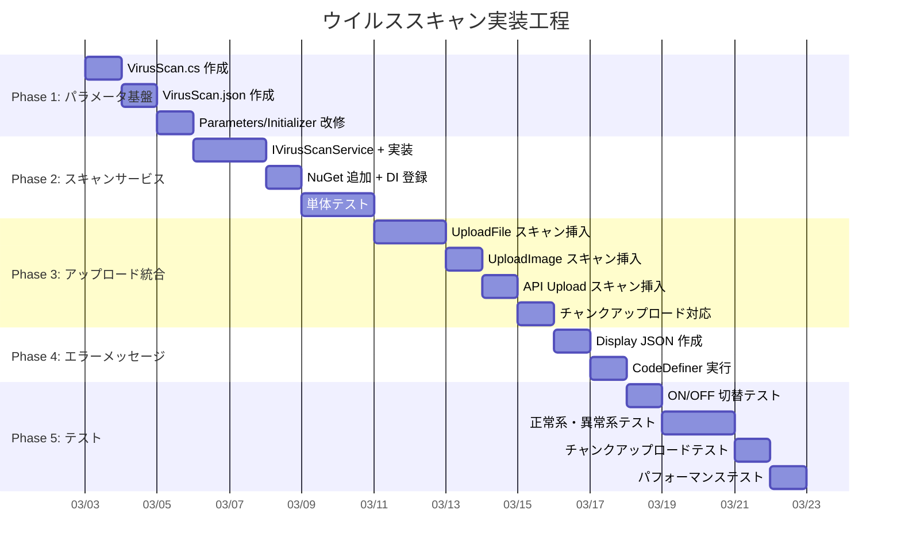

# 添付ファイルウイルススキャン実装行程

Pleasanter 本体にウイルススキャン機能を統合するための具体的な実装行程を整理する。ClamAV（clamd）を主スキャンエンジンとし、`Parameters` による ON/OFF 制御を前提とした改修計画をまとめる。

<!-- START doctoc generated TOC please keep comment here to allow auto update -->
<!-- DON'T EDIT THIS SECTION, INSTEAD RE-RUN doctoc TO UPDATE -->

- [調査情報](#調査情報)
- [調査目的](#調査目的)
- [前提条件](#前提条件)
- [アーキテクチャ概要](#アーキテクチャ概要)
- [改修対象ファイル一覧](#改修対象ファイル一覧)
    - [新規作成ファイル](#新規作成ファイル)
    - [既存改修ファイル](#既存改修ファイル)
    - [CodeDefiner 自動生成で更新されるファイル（間接改修）](#codedefiner-自動生成で更新されるファイル間接改修)
- [実装手順](#実装手順)
    - [Phase 1: パラメータ基盤（ON/OFF 制御）](#phase-1-パラメータ基盤onoff-制御)
    - [Phase 2: スキャンサービス実装](#phase-2-スキャンサービス実装)
    - [Phase 3: アップロードフローへの統合](#phase-3-アップロードフローへの統合)
    - [Phase 4: エラーメッセージ定義（CodeDefiner 対応）](#phase-4-エラーメッセージ定義codedefiner-対応)
    - [Phase 5: ログ出力](#phase-5-ログ出力)
- [チャンクアップロード時の考慮事項](#チャンクアップロード時の考慮事項)
- [ON/OFF 動作仕様](#onoff-動作仕様)
    - [設定パターン](#設定パターン)
    - [無効時の動作保証](#無効時の動作保証)
    - [有効時のエラー制御](#有効時のエラー制御)
- [実装工程サマリー](#実装工程サマリー)
    - [工数見積り](#工数見積り)
- [テスト計画](#テスト計画)
    - [テスト環境](#テスト環境)
    - [テストケース](#テストケース)
    - [EICAR テストファイル](#eicar-テストファイル)
- [実装上の注意事項](#実装上の注意事項)
    - [CodeDefiner 自動生成との共存](#codedefiner-自動生成との共存)
    - [ストリーム管理](#ストリーム管理)
    - [パフォーマンス影響](#パフォーマンス影響)
- [結論](#結論)
- [関連ソースコード](#関連ソースコード)
- [関連ドキュメント](#関連ドキュメント)

<!-- END doctoc generated TOC please keep comment here to allow auto update -->

## 調査情報

| 調査日     | リポジトリ | ブランチ        | タグ/バージョン    | コミット    | 備考                                         |
| ---------- | ---------- | --------------- | ------------------ | ----------- | -------------------------------------------- |
| 2026-02-24 | Pleasanter | (detached HEAD) | Pleasanter_1.5.1.0 | `34f162a43` | アップロード処理フロー・DI・パラメータを調査 |

## 調査目的

[010-添付ファイルウイルススキャン](010-添付ファイルウイルススキャン.md) で整理した手法のうち、
ClamAV（clamd デーモン）を主エンジンとした実装を Pleasanter に統合するにあたり、
**ON/OFF 制御可能な設計**で具体的な改修箇所・手順・工数を明確にする。

---

## 前提条件

| 項目               | 内容                                                         |
| ------------------ | ------------------------------------------------------------ |
| スキャンエンジン   | ClamAV（clamd デーモン経由 TCP 接続）                        |
| .NET ライブラリ    | nClam（NuGet / MIT ライセンス）                              |
| ON/OFF 制御        | `App_Data/Parameters/VirusScan.json` で有効/無効を切替       |
| 対象               | 添付ファイルアップロード・画像アップロード・API アップロード |
| エラーハンドリング | CodeDefiner 自動生成を考慮した Display JSON 追加方式         |

---

## アーキテクチャ概要

```mermaid
graph TD
    subgraph Controller層
        A[BinariesController.Upload]
        B[FormBinariesController.Upload]
        C[Api/BinariesController.Upload]
        D[BinariesController.UploadImage]
        E[FormBinariesController.UploadImage]
    end

    subgraph BinaryUtilities（static）
        F[UploadFile]
        G[UploadImage]
        H[CreateAttachment]
    end

    subgraph ウイルススキャン層（新規）
        I[IVirusScanService]
        J[ClamAvVirusScanService]
        K[NullVirusScanService]
        L["Parameters.VirusScan<br/>(ON/OFF制御)"]
    end

    subgraph 既存バリデーション
        M[BinaryValidators]
    end

    A --> F
    B --> F
    D --> G
    E --> G
    C --> H

    F --> M
    F -->|スキャン呼び出し| I
    G -->|スキャン呼び出し| I
    H -->|スキャン呼び出し| I

    L -->|Enabled=true| J
    L -->|Enabled=false| K
    J -->|TCP 3310| N[clamd デーモン]
```

---

## 改修対象ファイル一覧

### 新規作成ファイル

| #   | ファイル                                       | プロジェクト             | 内容                             |
| --- | ---------------------------------------------- | ------------------------ | -------------------------------- |
| 1   | `Parts/VirusScan.cs`                           | Implem.ParameterAccessor | パラメータクラス                 |
| 2   | `App_Data/Parameters/VirusScan.json`           | Implem.Pleasanter        | デフォルト設定ファイル           |
| 3   | `Libraries/Security/IVirusScanService.cs`      | Implem.Pleasanter        | スキャンサービスインターフェース |
| 4   | `Libraries/Security/ClamAvVirusScanService.cs` | Implem.Pleasanter        | ClamAV 実装                      |
| 5   | `Libraries/Security/NullVirusScanService.cs`   | Implem.Pleasanter        | 無効時のスタブ実装               |
| 6   | `Libraries/Security/VirusScanResult.cs`        | Implem.Pleasanter        | スキャン結果モデル               |
| 7   | `App_Data/Displays/VirusDetected.json`         | Implem.Pleasanter        | エラーメッセージ Display 定義    |
| 8   | `App_Data/Displays/VirusScanError.json`        | Implem.Pleasanter        | スキャンエラー Display 定義      |

### 既存改修ファイル

| #   | ファイル                              | プロジェクト              | 改修内容                       |
| --- | ------------------------------------- | ------------------------- | ------------------------------ |
| 9   | `Parameters.cs`                       | Implem.ParameterAccessor  | `VirusScan` フィールド追加     |
| 10  | `Initializer.cs`                      | Implem.DefinitionAccessor | `SetParameters()` にロード追加 |
| 11  | `Startup.cs`                          | Implem.Pleasanter         | DI 登録                        |
| 12  | `Implem.Pleasanter.csproj`            | Implem.Pleasanter         | nClam NuGet 参照追加           |
| 13  | `Models/Binaries/BinaryUtilities.cs`  | Implem.Pleasanter         | スキャン呼び出し挿入           |
| 14  | `Models/Binaries/BinaryValidators.cs` | Implem.Pleasanter         | スキャンバリデーション追加     |

### CodeDefiner 自動生成で更新されるファイル（間接改修）

| #   | ファイル                          | 更新トリガー                         |
| --- | --------------------------------- | ------------------------------------ |
| 15  | `Libraries/General/Error.cs`      | Display JSON 追加 → CodeDefiner 実行 |
| 16  | `Libraries/Responses/Messages.cs` | 同上                                 |

---

## 実装手順

### Phase 1: パラメータ基盤（ON/OFF 制御）

#### Step 1-1: パラメータクラス作成

**ファイル**: `Implem.ParameterAccessor/Parts/VirusScan.cs`（新規）

```csharp
namespace Implem.ParameterAccessor.Parts
{
    public class VirusScan
    {
        /// <summary>ウイルススキャン機能の有効/無効</summary>
        public bool Enabled;

        /// <summary>スキャンプロバイダー ("ClamAV")</summary>
        public string Provider;

        /// <summary>clamd ホスト名</summary>
        public string ClamAvHost;

        /// <summary>clamd ポート番号</summary>
        public int ClamAvPort;

        /// <summary>スキャンタイムアウト（ミリ秒）</summary>
        public int TimeoutMs;

        /// <summary>スキャン対象の最大ファイルサイズ（MB）。超過時はスキャンをスキップ</summary>
        public int MaxFileSizeMB;

        /// <summary>スキャンエラー時の動作（true: アップロード拒否 / false: アップロード許可）</summary>
        public bool RejectOnScanError;

        /// <summary>画像アップロードもスキャン対象にするか</summary>
        public bool ScanImages;
    }
}
```

#### Step 1-2: デフォルト設定ファイル作成

**ファイル**: `Implem.Pleasanter/App_Data/Parameters/VirusScan.json`（新規）

```json
{
    "Enabled": false,
    "Provider": "ClamAV",
    "ClamAvHost": "localhost",
    "ClamAvPort": 3310,
    "TimeoutMs": 30000,
    "MaxFileSizeMB": 100,
    "RejectOnScanError": false,
    "ScanImages": true
}
```

> **`Enabled: false`** がデフォルト。明示的に有効化しない限りスキャンは実行されない。

#### Step 1-3: パラメータ登録

**ファイル**: `Implem.ParameterAccessor/Parameters.cs`

```csharp
// 既存フィールドの並びに追加（アルファベット順）
public static VirusScan VirusScan;
```

**ファイル**: `Implem.DefinitionAccessor/Initializer.cs` — `SetParameters()` メソッド

```csharp
// 既存の Read<T>() 呼び出しの並びに追加
Parameters.VirusScan = Read<VirusScan>(required: false);
```

> `required: false` を指定し、`VirusScan.json` が存在しない場合は `null`（機能無効）として扱う。

---

### Phase 2: スキャンサービス実装

#### Step 2-1: インターフェース定義

**ファイル**: `Implem.Pleasanter/Libraries/Security/IVirusScanService.cs`（新規）

```csharp
namespace Implem.Pleasanter.Libraries.Security
{
    public interface IVirusScanService
    {
        Task<VirusScanResult> ScanAsync(byte[] data, string fileName);
    }
}
```

#### Step 2-2: スキャン結果モデル

**ファイル**: `Implem.Pleasanter/Libraries/Security/VirusScanResult.cs`（新規）

```csharp
namespace Implem.Pleasanter.Libraries.Security
{
    public class VirusScanResult
    {
        public bool IsClean { get; set; }
        public bool IsError { get; set; }
        public string VirusName { get; set; }
        public string ErrorMessage { get; set; }

        public static VirusScanResult Clean()
            => new VirusScanResult { IsClean = true };

        public static VirusScanResult Infected(string virusName)
            => new VirusScanResult { IsClean = false, VirusName = virusName };

        public static VirusScanResult Error(string message)
            => new VirusScanResult { IsClean = false, IsError = true, ErrorMessage = message };
    }
}
```

#### Step 2-3: ClamAV 実装

**ファイル**: `Implem.Pleasanter/Libraries/Security/ClamAvVirusScanService.cs`（新規）

```csharp
using nClam;
using Implem.ParameterAccessor;

namespace Implem.Pleasanter.Libraries.Security
{
    public class ClamAvVirusScanService : IVirusScanService
    {
        private readonly ClamClient _client;
        private readonly int _maxFileSizeBytes;

        public ClamAvVirusScanService()
        {
            var host = Parameters.VirusScan?.ClamAvHost ?? "localhost";
            var port = Parameters.VirusScan?.ClamAvPort ?? 3310;
            var timeoutMs = Parameters.VirusScan?.TimeoutMs ?? 30000;
            _maxFileSizeBytes = (Parameters.VirusScan?.MaxFileSizeMB ?? 100) * 1024 * 1024;
            _client = new ClamClient(host, port)
            {
                MaxStreamSize = _maxFileSizeBytes
            };
        }

        public async Task<VirusScanResult> ScanAsync(byte[] data, string fileName)
        {
            if (data == null || data.Length == 0)
                return VirusScanResult.Clean();

            if (data.Length > _maxFileSizeBytes)
                return VirusScanResult.Clean(); // サイズ超過はスキップ

            try
            {
                var result = await _client.SendAndScanFileAsync(data);
                return result.Result switch
                {
                    ClamScanResults.Clean => VirusScanResult.Clean(),
                    ClamScanResults.VirusDetected => VirusScanResult.Infected(
                        result.InfectedFiles?.FirstOrDefault()?.VirusName
                            ?? "Unknown"),
                    _ => VirusScanResult.Error(
                        $"ClamAV scan returned: {result.Result}")
                };
            }
            catch (Exception ex)
            {
                return VirusScanResult.Error(
                    $"ClamAV connection error: {ex.Message}");
            }
        }
    }
}
```

#### Step 2-4: Null 実装（無効時）

**ファイル**: `Implem.Pleasanter/Libraries/Security/NullVirusScanService.cs`（新規）

```csharp
namespace Implem.Pleasanter.Libraries.Security
{
    public class NullVirusScanService : IVirusScanService
    {
        public Task<VirusScanResult> ScanAsync(byte[] data, string fileName)
        {
            return Task.FromResult(VirusScanResult.Clean());
        }
    }
}
```

#### Step 2-5: NuGet パッケージ追加

**ファイル**: `Implem.Pleasanter/Implem.Pleasanter.csproj`

```xml
<PackageReference Include="nClam" Version="7.*" />
```

#### Step 2-6: DI 登録

**ファイル**: `Implem.Pleasanter/Startup.cs` — `ConfigureServices` メソッド

```csharp
// ウイルススキャンサービス登録
if (Parameters.VirusScan?.Enabled == true)
{
    services.AddSingleton<IVirusScanService, ClamAvVirusScanService>();
}
else
{
    services.AddSingleton<IVirusScanService, NullVirusScanService>();
}
```

> `Parameters` は `Startup` コンストラクタ内の `Initializer.Initialize()` で
> 既にロード済みのため、`ConfigureServices` 時点でアクセス可能。

---

### Phase 3: アップロードフローへの統合

#### Step 3-1: サービスロケーターによるアクセス

`BinaryUtilities` は static クラスであり DI を直接受けられない。
Pleasanter の既存パターンに合わせて `AspNetCoreHttpContext.Current.RequestServices`
経由でサービスを取得するヘルパーメソッドを追加する。

**ファイル**: `Implem.Pleasanter/Models/Binaries/BinaryUtilities.cs` — ヘルパーメソッド追加

```csharp
using AspNetCoreCurrentRequestContext;
using Implem.Pleasanter.Libraries.Security;
using Microsoft.Extensions.DependencyInjection;

private static IVirusScanService GetVirusScanService()
{
    return AspNetCoreHttpContext.Current?
        .RequestServices?
        .GetService<IVirusScanService>()
            ?? new NullVirusScanService();
}

/// <summary>
/// アップロードされたファイルのウイルススキャンを実行する。
/// スキャン無効時またはサービス未登録時は常に Clean を返す。
/// </summary>
private static async Task<VirusScanResult> ScanFileAsync(
    byte[] data,
    string fileName)
{
    if (Parameters.VirusScan?.Enabled != true)
        return VirusScanResult.Clean();

    var scanner = GetVirusScanService();
    return await scanner.ScanAsync(data, fileName);
}
```

#### Step 3-2: UploadFile メソッドへのスキャン挿入

**ファイル**: `Implem.Pleasanter/Models/Binaries/BinaryUtilities.cs`

**改修箇所**: `UploadFile` メソッド内、**ファイル保存前**（L866 付近、RDS/FS 分岐の直前）にスキャンロジックを挿入する。

```text
既存フロー:
  L811: 権限チェック
  L818: BinaryValidators.OnUploading()
  L855: BinaryValidators.OnValidatingFormUpload()
  L866: ★★ ここにスキャン挿入 ★★
  L867: if (TemporaryBinaryStorageProvider == "Rds") { ... } else { ... }
```

**挿入コード概要**:

```csharp
// L866 付近（RDS/FS 分岐の直前）
if (Parameters.VirusScan?.Enabled == true)
{
    for (var i = 0; i < files.Count; i++)
    {
        using var ms = new MemoryStream();
        files[i].InputStream.CopyTo(ms);
        var fileBytes = ms.ToArray();
        ms.Position = 0;

        var scanResult = ScanFileAsync(fileBytes, files[i].FileName)
            .GetAwaiter().GetResult();

        if (!scanResult.IsClean)
        {
            if (scanResult.IsError && !Parameters.VirusScan.RejectOnScanError)
            {
                // スキャンエラー時にアップロードを許可する設定
                continue;
            }
            // ウイルス検出 or スキャンエラー（拒否設定時）
            return scanResult.IsError
                ? Error.Types.VirusScanError
                    .MessageJson(context: context, scanResult.ErrorMessage)
                : Error.Types.VirusDetected
                    .MessageJson(context: context, scanResult.VirusName);
        }
    }
}
```

> **注意**: `InputStream` は一度読むとシークが必要。
> `MemoryStream` にコピーした後、**元のストリームを再セットする**か、
> コピー済みの `byte[]` を後続の保存処理に渡す方式を検討する必要がある。
> 実装時には `PostedFile` のストリーム管理を確認すること。

#### Step 3-3: UploadImage メソッドへのスキャン挿入

**ファイル**: `Implem.Pleasanter/Models/Binaries/BinaryUtilities.cs`

**改修箇所**: `UploadImage` オーバーロード 3（L500〜、実際の保存処理）の
`var bin = file.Byte()` の直後（L507 付近）。

```csharp
// L507 付近
var bin = file.Byte();

if (Parameters.VirusScan?.Enabled == true && Parameters.VirusScan.ScanImages)
{
    var scanResult = ScanFileAsync(bin, file.FileName)
        .GetAwaiter().GetResult();

    if (!scanResult.IsClean)
    {
        if (scanResult.IsError && !Parameters.VirusScan.RejectOnScanError)
        {
            // スキャンエラー時は画像アップロードを許可
        }
        else
        {
            return scanResult.IsError
                ? Error.Types.VirusScanError
                : Error.Types.VirusDetected;
        }
    }
}
```

#### Step 3-4: API アップロードへのスキャン挿入

**ファイル**: `Implem.Pleasanter/Controllers/Api/BinariesController.cs`

**改修箇所**: `Upload` メソッド内、一時ファイル保存後・`ValidateFileHash` の後、
`ItemModel.UpdateByApi()` / `BinaryUtilities.CreateAttachment()` の前。

一時ファイルが `App_Data/Temp/{guid}/{fileName}` に保存済みのため、
ファイルパスから `byte[]` を読み出してスキャンする。

```csharp
// 一時ファイル保存後
if (Parameters.VirusScan?.Enabled == true)
{
    var fileBytes = System.IO.File.ReadAllBytes(tempFilePath);
    var scanResult = await virusScanService.ScanAsync(fileBytes, fileName);

    if (!scanResult.IsClean)
    {
        // 一時ファイルを削除
        System.IO.File.Delete(tempFilePath);

        return scanResult.IsError
            ? ApiResults.Error(context, new ErrorData(type: Error.Types.VirusScanError))
            : ApiResults.Error(context, new ErrorData(type: Error.Types.VirusDetected));
    }
}
```

---

### Phase 4: エラーメッセージ定義（CodeDefiner 対応）

#### Step 4-1: Display JSON 作成

Pleasanter の `Error.Types` enum と `Messages` クラスは CodeDefiner が
`App_Data/Displays/` の JSON から自動生成する。
新しいエラータイプを追加するには、Display JSON を作成して CodeDefiner を実行する。

**ファイル**: `App_Data/Displays/VirusDetected.json`（新規）

```json
{
    "Id": "VirusDetected",
    "Type": 240,
    "Languages": [
        {
            "Body": "A virus was detected in the uploaded file: \"{0}\". The upload has been rejected."
        },
        {
            "Language": "ja",
            "Body": "アップロードされたファイルからウイルスが検出されました: 「{0}」。アップロードは拒否されました。"
        }
    ]
}
```

**ファイル**: `App_Data/Displays/VirusScanError.json`（新規）

```json
{
    "Id": "VirusScanError",
    "Type": 240,
    "Languages": [
        {
            "Body": "An error occurred during virus scanning: \"{0}\". Please contact the administrator."
        },
        {
            "Language": "ja",
            "Body": "ウイルススキャン中にエラーが発生しました: 「{0}」。管理者に連絡してください。"
        }
    ]
}
```

> **Type: 240** は `Error` カテゴリを示す値。
> CodeDefiner はこの Type を参照して `Error.Types` enum に含めるか判定する。

#### Step 4-2: CodeDefiner 実行

Display JSON を配置した後、CodeDefiner を実行して以下のファイルを自動再生成する。

```bash
dotnet run --project Implem.CodeDefiner -- _codedefiner
```

**自動更新されるファイル**:

| ファイル                          | 更新内容                                                       |
| --------------------------------- | -------------------------------------------------------------- |
| `Libraries/General/Error.cs`      | `Types` enum に `VirusDetected`, `VirusScanError` が追加される |
| `Libraries/Responses/Messages.cs` | `VirusDetected()`, `VirusScanError()` メソッドが追加される     |

---

### Phase 5: ログ出力

#### Step 5-1: スキャン結果のログ記録

ウイルス検出・スキャンエラー時に `SysLog` にログを残す。

**改修箇所**: `BinaryUtilities` 内のスキャン呼び出し箇所

```csharp
if (!scanResult.IsClean)
{
    new SysLogModel(
        context: context,
        method: $"VirusScan.{(scanResult.IsError ? "Error" : "Detected")}",
        message: scanResult.IsError
            ? $"Scan error: {scanResult.ErrorMessage}"
            : $"Virus detected: {scanResult.VirusName}, File: {fileName}",
        sysLogType: SysLogModel.SysLogTypes.Warning);
}
```

---

## チャンクアップロード時の考慮事項

Pleasanter は `Content-Range` ヘッダーによるチャンクアップロードに対応している。
チャンクアップロード時のスキャンタイミングには以下の制約がある。

| 課題                   | 対応方針                                                                        |
| ---------------------- | ------------------------------------------------------------------------------- |
| 途中チャンクのスキャン | 不可。ファイル全体が揃ってからスキャンする必要がある                            |
| 完了判定               | `contentRange.To + 1 == contentRange.Length` で最終チャンクを判定               |
| スキャンタイミング     | 最終チャンク受信後、`ValidateFileHash` と同じタイミングでスキャン               |
| ファイル結合           | FS 保存時はファイルが Append されて完成済み。DB 時は `Bin` カラムに完全格納済み |

**実装方針**: チャンクアップロードの場合は、最終チャンク到着時
（`controlOnly == false` の条件、つまり完全なファイルが揃った時点）にのみスキャンを実行する。

```csharp
// contentRange == null（非チャンク）or 最終チャンク到着時のみスキャン
var isComplete = contentRange == null
    || (contentRange.To + 1 == contentRange.Length);

if (isComplete && Parameters.VirusScan?.Enabled == true)
{
    // スキャン実行
}
```

---

## ON/OFF 動作仕様

### 設定パターン

| VirusScan.json の状態 | `Enabled` | 動作                                                 |
| --------------------- | :-------: | ---------------------------------------------------- |
| ファイルが存在しない  |     -     | スキャン無効（`Read<T>(required: false)` で `null`） |
| `"Enabled": false`    |   false   | スキャン無効（`NullVirusScanService` 使用）          |
| `"Enabled": true`     |   true    | スキャン有効（`ClamAvVirusScanService` 使用）        |

### 無効時の動作保証

スキャン無効時は以下の動作を保証する。

1. `NullVirusScanService` が常に `VirusScanResult.Clean()` を返す
2. `Parameters.VirusScan?.Enabled != true` のガード条件で早期リターン
3. nClam への TCP 接続は一切発生しない
4. パフォーマンスへの影響はゼロ（null チェック 1 回のみ）
5. ClamAV 未インストール環境でもエラーにならない

### 有効時のエラー制御

| 状況               | `RejectOnScanError` | 動作                         |
| ------------------ | :-----------------: | ---------------------------- |
| ウイルス検出       |        任意         | **常にアップロード拒否**     |
| clamd 接続失敗     |       `true`        | アップロード拒否             |
| clamd 接続失敗     |       `false`       | アップロード許可（ログ記録） |
| タイムアウト       |       `true`        | アップロード拒否             |
| タイムアウト       |       `false`       | アップロード許可（ログ記録） |
| ファイルサイズ超過 |        任意         | スキャンスキップ（許可）     |

---

## 実装工程サマリー



### 工数見積り

| Phase    | 内容                 |    見積り    |
| -------- | -------------------- | :----------: |
| Phase 1  | パラメータ基盤       |    1〜2日    |
| Phase 2  | スキャンサービス実装 |    3〜4日    |
| Phase 3  | アップロード統合     |    3〜5日    |
| Phase 4  | エラーメッセージ     |     1日      |
| Phase 5  | テスト               |    3〜5日    |
| **合計** |                      | **11〜17日** |

---

## テスト計画

### テスト環境

| 項目           | 構成                                                      |
| -------------- | --------------------------------------------------------- |
| ClamAV         | Docker: `docker run -d -p 3310:3310 clamav/clamav:latest` |
| テストウイルス | EICAR テストファイル（`eicar.com.txt`）                   |
| Pleasanter     | ローカル開発環境（`dotnet run`）                          |

### テストケース

| #   | カテゴリ       | テスト内容                                               | 期待結果                      |
| --- | -------------- | -------------------------------------------------------- | ----------------------------- |
| 1   | ON/OFF         | `Enabled: false` でファイルアップロード                  | スキャンなしで成功            |
| 2   | ON/OFF         | `VirusScan.json` 未配置でファイルアップロード            | スキャンなしで成功            |
| 3   | 正常系         | `Enabled: true` で正常ファイルアップロード               | スキャン実行 → 成功           |
| 4   | 検出系         | `Enabled: true` で EICAR テストファイルアップロード      | ウイルス検出 → 拒否           |
| 5   | 検出系         | EICAR を `.docx` 拡張子にリネームしてアップロード        | ウイルス検出 → 拒否           |
| 6   | エラー系       | clamd 停止中にアップロード（`RejectOnScanError: true`）  | スキャンエラー → 拒否         |
| 7   | エラー系       | clamd 停止中にアップロード（`RejectOnScanError: false`） | スキャンエラー → 許可         |
| 8   | サイズ系       | `MaxFileSizeMB` 超過のファイルアップロード               | スキャンスキップ → 成功       |
| 9   | 画像系         | `ScanImages: true` で画像アップロード                    | スキャン実行                  |
| 10  | 画像系         | `ScanImages: false` で画像アップロード                   | スキャンなし                  |
| 11  | チャンク       | チャンクアップロード（正常ファイル）                     | 最終チャンクでスキャン → 成功 |
| 12  | チャンク       | チャンクアップロード（EICAR ファイル）                   | 最終チャンクでスキャン → 拒否 |
| 13  | API            | API 経由でファイルアップロード（正常ファイル）           | スキャン → 成功               |
| 14  | API            | API 経由で EICAR アップロード                            | スキャン → 拒否               |
| 15  | フォーム       | FormBinariesController 経由でアップロード                | スキャン → 成功               |
| 16  | パフォーマンス | 10MB ファイルのスキャン時間計測                          | 3 秒以内                      |
| 17  | ログ           | ウイルス検出時に SysLog に記録されること                 | ログ出力確認                  |

### EICAR テストファイル

ウイルス検出テストには [EICAR テストファイル](https://www.eicar.org/download-anti-malware-testfile/) を使用する。
これはアンチウイルスソフトウェアの検出テスト用の標準ファイルであり、実際のマルウェアではない。

```text
X5O!P%@AP[4\PZX54(P^)7CC)7}$EICAR-STANDARD-ANTIVIRUS-TEST-FILE!$H+H*
```

---

## 実装上の注意事項

### CodeDefiner 自動生成との共存

| 注意点                   | 対応方針                                                       |
| ------------------------ | -------------------------------------------------------------- |
| `Error.cs` は自動生成    | 直接編集しない。Display JSON を追加して CodeDefiner を実行する |
| `Messages.cs` は自動生成 | 同上                                                           |
| CodeDefiner 実行順序     | Display JSON 配置 → CodeDefiner 実行 → ビルド確認              |
| バージョンアップ時       | Display JSON が残っていれば CodeDefiner 再実行で自動反映される |

### ストリーム管理

| 注意点                      | 対応方針                                                                                 |
| --------------------------- | ---------------------------------------------------------------------------------------- |
| `InputStream` は一方向      | スキャン前に `MemoryStream` にコピーし、コピーをスキャンに、元ストリームを後続処理に使う |
| DB 保存パスの二重読み取り   | スキャン→保存の順序でバイト配列を共有                                                    |
| FS 保存パスのファイル再読込 | 保存後のスキャンなら `File.ReadAllBytes()` で取得可能                                    |

### パフォーマンス影響

| 項目                 | 影響                                                       |
| -------------------- | ---------------------------------------------------------- |
| 無効時               | null チェック 1 回（ナノ秒オーダー） — 影響なし            |
| 有効時               | clamd へのラウンドトリップ + スキャン時間                  |
| 典型的なスキャン時間 | 小ファイル（< 1MB）: 50〜200ms / 大ファイル（10MB）: 1〜3s |
| 並行アップロード     | clamd は複数接続を並行処理可能                             |
| チャンクアップロード | 最終チャンクのみスキャン → 中間チャンクへの影響なし        |

---

## 結論

| 項目             | 結論                                                                         |
| ---------------- | ---------------------------------------------------------------------------- |
| 改修規模         | 新規ファイル 8 件 + 既存改修 6 件 + CodeDefiner 自動生成 2 件                |
| ON/OFF 制御      | `VirusScan.json` の `Enabled` フィールドで制御。未配置時は自動的に無効       |
| スキャンエンジン | ClamAV（clamd）+ nClam。DI で `IVirusScanService` として抽象化               |
| アップロード経路 | 3 つのコントローラー × 2 種のメソッド（ファイル / 画像）を網羅               |
| エラー追加方式   | CodeDefiner の Display JSON 方式で `Error.Types` / `Messages` を自動生成     |
| 主な課題         | ストリーム管理（一方向読み取り）とチャンクアップロード時のタイミング制御     |
| 工数             | 11〜17 日（テスト含む）                                                      |
| 将来の拡張       | `IVirusScanService` のインターフェースにより AMSI・VirusTotal 等への差替可能 |

---

## 関連ソースコード

| ファイル                                                  | 内容                                            |
| --------------------------------------------------------- | ----------------------------------------------- |
| `Implem.Pleasanter/Models/Binaries/BinaryUtilities.cs`    | アップロード中核ロジック（L795〜 `UploadFile`） |
| `Implem.Pleasanter/Models/Binaries/BinaryValidators.cs`   | バリデーション（L636 拡張子検証）               |
| `Implem.Pleasanter/Controllers/BinariesController.cs`     | 認証ユーザー向けアップロード（L233〜）          |
| `Implem.Pleasanter/Controllers/FormBinariesController.cs` | フォーム向けアップロード（L148〜）              |
| `Implem.Pleasanter/Controllers/Api/BinariesController.cs` | API 向けアップロード（L103〜）                  |
| `Implem.Pleasanter/Startup.cs`                            | DI 登録（L80〜 `ConfigureServices`）            |
| `Implem.DefinitionAccessor/Initializer.cs`                | パラメータロード（L96〜 `SetParameters`）       |
| `Implem.ParameterAccessor/Parameters.cs`                  | 静的パラメータフィールド                        |
| `Implem.ParameterAccessor/Parts/BinaryStorage.cs`         | ストレージ設定パラメータ                        |
| `Implem.Pleasanter/Libraries/General/Error.cs`            | エラータイプ enum（CodeDefiner 自動生成）       |
| `Implem.Pleasanter/Libraries/Responses/Messages.cs`       | メッセージクラス（CodeDefiner 自動生成）        |
| `Implem.Pleasanter/App_Data/Displays/`                    | Display 定義 JSON（1244 件）                    |

## 関連ドキュメント

- [010-添付ファイルウイルススキャン](010-添付ファイルウイルススキャン.md) — 手法比較・アーキテクチャ概要
