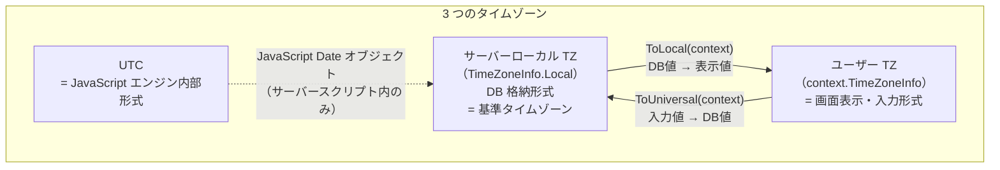
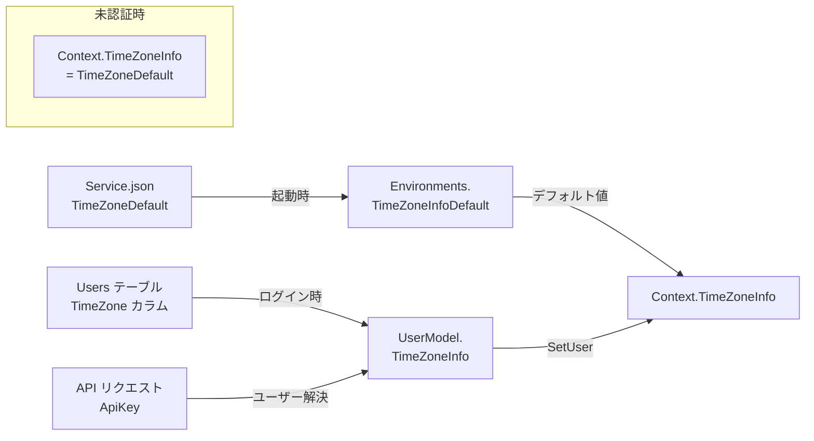
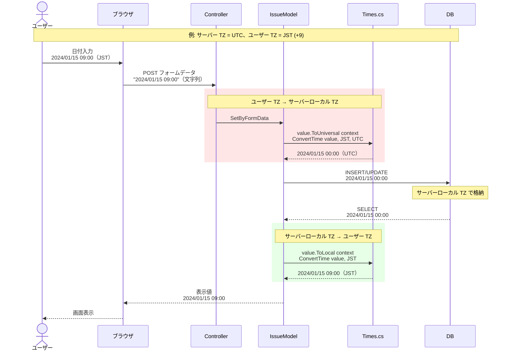
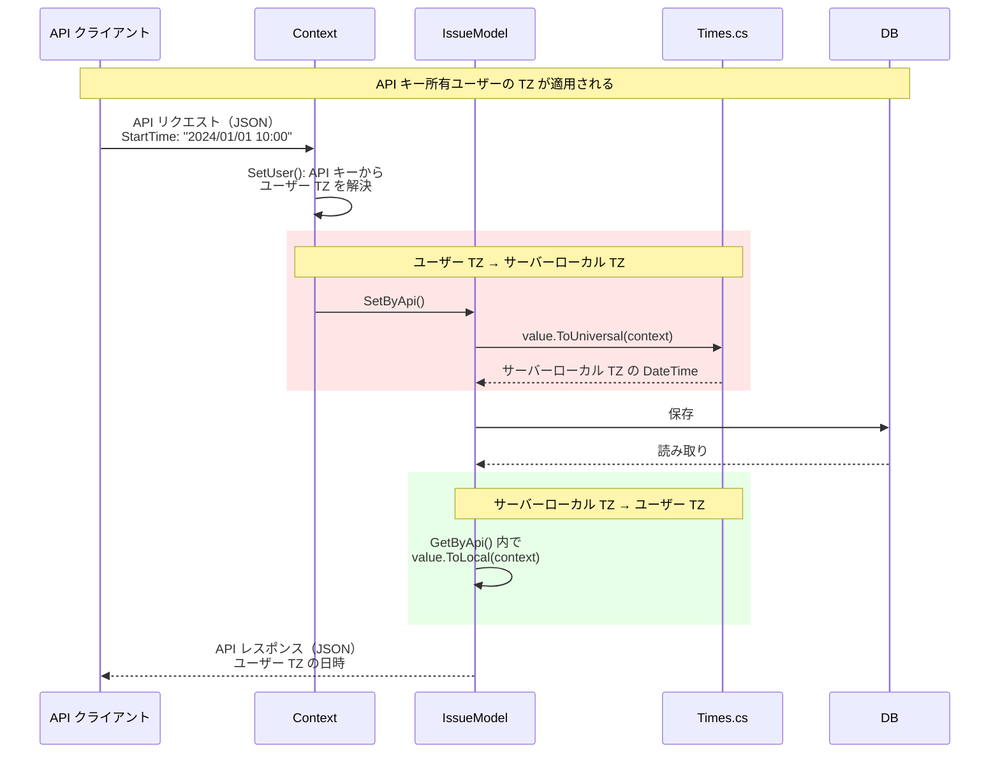
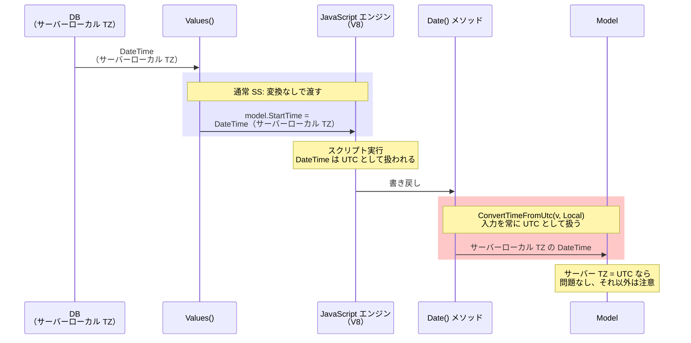
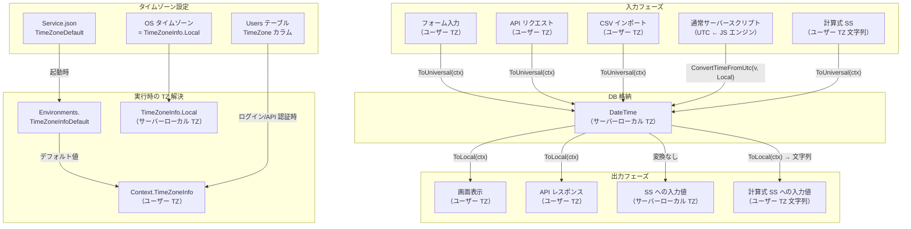

# タイムゾーン全体設計

Pleasanter における日時処理のタイムゾーン変換フロー全体を調査し、システムタイムゾーン・ユーザータイムゾーン・UTC の関係と、各フェーズでの変換タイミングを整理する。

<!-- START doctoc generated TOC please keep comment here to allow auto update -->
<!-- DON'T EDIT THIS SECTION, INSTEAD RE-RUN doctoc TO UPDATE -->

- [調査情報](#調査情報)
- [調査目的](#調査目的)
- [Pleasanter に登場する 3 つのタイムゾーン](#pleasanter-に登場する-3-つのタイムゾーン)
- [タイムゾーン設定の階層](#タイムゾーン設定の階層)
    - [システムデフォルト（Service.json）](#システムデフォルトservicejson)
    - [SAML 認証でのタイムゾーン同期（Authentication.json）](#saml-認証でのタイムゾーン同期authenticationjson)
    - [ユーザーごとのタイムゾーン](#ユーザーごとのタイムゾーン)
    - [Context.TimeZoneInfo の決定](#contexttimezoneinfo-の決定)
- [DB 格納形式](#db-格納形式)
- [変換ヘルパー（Times.cs）](#変換ヘルパーtimescs)
- [Time クラスの二重保持](#time-クラスの二重保持)
- [フェーズ別タイムゾーン変換フロー](#フェーズ別タイムゾーン変換フロー)
    - [フォーム入力 - DB 保存 - 画面表示](#フォーム入力---db-保存---画面表示)
    - [API リクエスト - DB 保存 - API レスポンス](#api-リクエスト---db-保存---api-レスポンス)
    - [CSV インポート](#csv-インポート)
    - [サーバースクリプト（概要）](#サーバースクリプト概要)
- [変換方式の一覧比較](#変換方式の一覧比較)
- [フロントエンドへの TZ 情報伝達](#フロントエンドへの-tz-情報伝達)
- [バックグラウンドタスクのタイムゾーン](#バックグラウンドタスクのタイムゾーン)
- [リマインダーのタイムゾーン](#リマインダーのタイムゾーン)
- [全体の変換フロー図](#全体の変換フロー図)
- [注意事項・設計上の制約](#注意事項設計上の制約)
- [関連ファイル](#関連ファイル)
- [関連ドキュメント](#関連ドキュメント)

<!-- END doctoc generated TOC please keep comment here to allow auto update -->

## 調査情報

| 調査日        | リポジトリ | ブランチ | タグ/バージョン    | コミット    | 備考     |
| ------------- | ---------- | -------- | ------------------ | ----------- | -------- |
| 2026年2月24日 | Pleasanter | （なし） | Pleasanter_1.5.1.0 | `34f162a43` | 初回調査 |

## 調査目的

- Pleasanter に登場する 3 種類のタイムゾーン（システム/ユーザー/UTC）の役割を明確にする
- 各入出力フェーズ（フォーム入力・API・CSV インポート・画面表示）での変換タイミングを整理する
- サーバースクリプトだけが異なる変換方式を使う理由と影響を概観する

---

## Pleasanter に登場する 3 つのタイムゾーン

Pleasanter の日時処理には以下の 3 つのタイムゾーンが関与する。



| 名称                | 実体                   | 決定方法                | 用途                                          |
| ------------------- | ---------------------- | ----------------------- | --------------------------------------------- |
| サーバーローカル TZ | `TimeZoneInfo.Local`   | OS から自動取得         | DB 格納、内部処理の基準                       |
| ユーザー TZ         | `context.TimeZoneInfo` | ユーザー設定/パラメータ | 画面表示、フォーム入力、API 入出力            |
| UTC                 | `DateTimeKind.Utc`     | 固定                    | JavaScript エンジン（V8）の DateTime 内部形式 |

**サーバーローカル TZ は .NET の `TimeZoneInfo.Local` であり、OS のタイムゾーン設定から自動取得される**。
Pleasanter のパラメータファイルで制御する項目ではない。

---

## タイムゾーン設定の階層

### システムデフォルト（Service.json）

`Implem.Pleasanter/App_Data/Parameters/Service.json` で `TimeZoneDefault` を設定する。

```json
{
    "TimeZoneDefault": "Tokyo Standard Time"
}
```

起動時に `Initializer.SetTimeZone()` で `Environments.TimeZoneInfoDefault` に解決される。

```csharp
// Implem.DefinitionAccessor/Initializer.cs (L1099-L1105)
private static void SetTimeZone()
{
    Environments.TimeZoneInfoDefault = TimeZoneInfo.GetSystemTimeZones()
        .FirstOrDefault(o => o.Id == Parameters.Service.TimeZoneDefault)
            ?? TimeZoneInfo.Utc;
    Def.ColumnDefinitionCollection
        .FirstOrDefault(o => o.Id == "Users_TimeZone")
        .Default = Environments.TimeZoneInfoDefault.Id;
}
```

**注意**: `TimeZoneDefault` はサーバーローカル TZ（`TimeZoneInfo.Local`）とは**別物**である。
サーバーローカル TZ は OS のタイムゾーン設定によって自動決定されるが、`TimeZoneDefault` は以下の用途で使われる。

`TimeZoneDefault` の利用箇所：

| 利用箇所            | ソースコード                         | 用途                                                                                                     |
| ------------------- | ------------------------------------ | -------------------------------------------------------------------------------------------------------- |
| ユーザー新規作成    | `UserModel.cs`                       | テナント TZ が未設定の場合、新規ユーザーの `TimeZone` カラムのデフォルト値として使用                     |
| ユーザー一括登録    | `UserUtilities.cs`                   | CSV/API でのユーザー一括登録時、TZ が空欄の場合のフォールバック                                          |
| Context 初期化      | `Context.cs`                         | `Environments.TimeZoneInfoDefault` として Context の TZ デフォルト値に設定。未認証リクエストで使用される |
| バックグラウンド SS | `BackgroundServerScriptUtilities.cs` | スケジュール個別 TZ が未設定の場合、cron スケジュールの TZ フォールバックとして使用                      |
| TimerBackground     | `TimerBackground.cs`                 | タイマー系バックグラウンドジョブのスケジュール TZ フォールバック                                         |
| Users_TimeZone 定義 | `Initializer.SetTimeZone()`          | カラム定義の `Default` 値として設定（ユーザー管理画面のデフォルト選択に影響）                            |

### SAML 認証でのタイムゾーン同期（Authentication.json）

`Authentication.json` の `SamlParameters.Attributes` で SAML レスポンスの属性名をマッピングできる。

```json
{
    "SamlParameters": {
        "Attributes": {
            "TimeZone": "TimeZone"
        }
    }
}
```

この設定により、IdP（Identity Provider）から送信される SAML アサーションの `TimeZone` 属性値が
ユーザーの `TimeZone` カラムに同期される。TZ 変換ロジック自体には影響しないが、
ユーザーの TZ がどのように設定されるかに関わるため記載する。

### ユーザーごとのタイムゾーン

ユーザーモデルにタイムゾーン ID が文字列で保存される。

```csharp
// Implem.Pleasanter/Models/Users/UserModel.cs (L44, L89-95)
public string TimeZone = "UTC";  // DB カラム

public TimeZoneInfo TimeZoneInfo  // 読み取り専用プロパティ
{
    get
    {
        return TimeZoneInfo.GetSystemTimeZones()
            .FirstOrDefault(o => o.Id == TimeZone);
    }
}
```

無効なタイムゾーンが設定されている場合のフォールバック：

```csharp
// UserModel.cs (L5676-5680)
private void InitializeTimeZone()
{
    if (TimeZoneInfo.GetSystemTimeZones().Any(info => info.Id == TimeZone)) return;
    TimeZone = (TimeZoneInfo.GetSystemTimeZones()
        .FirstOrDefault(info =>
            info.Id == "Tokyo Standard Time" || info.Id == "Asia/Tokyo")
        ?? TimeZoneInfo.Local)?.Id;
}
```

フォールバック順序: 設定値 → 東京標準時 → サーバーローカル TZ

### Context.TimeZoneInfo の決定

```csharp
// Implem.Pleasanter/Libraries/Requests/Context.cs (L107)
public TimeZoneInfo TimeZoneInfo { get; set; } = Environments.TimeZoneInfoDefault;
```

ログイン時にユーザーの TZ で上書きされる：

```csharp
// Context.cs (L487)
private void SetUser(UserModel userModel, ...)
{
    TimeZoneInfo = userModel.TimeZoneInfo;  // ユーザー TZ で上書き
}
```



---

## DB 格納形式

Pleasanter はすべての日時を**サーバーローカル TZ**（`TimeZoneInfo.Local`）で DB に格納する。UTC ではない。

| RDBMS      | `CurrentDateTime`   | 意味                |
| ---------- | ------------------- | ------------------- |
| SQL Server | `getdate()`         | サーバーローカル TZ |
| PostgreSQL | `CURRENT_TIMESTAMP` | サーバーローカル TZ |
| MySQL      | `CURRENT_TIMESTAMP` | サーバーローカル TZ |

**設計上の制約**: サーバーの OS タイムゾーンを変更すると、既存データとの整合性が崩れる。

---

## 変換ヘルパー（Times.cs）

`Implem.Pleasanter/Libraries/Server/Times.cs` に定義された 2 つの拡張メソッドが変換の中核。

| メソッド           | 変換方向                          | 用途                              |
| ------------------ | --------------------------------- | --------------------------------- |
| `ToLocal(ctx)`     | サーバーローカル TZ → ユーザー TZ | DB 値 → 表示・API レスポンス      |
| `ToUniversal(ctx)` | ユーザー TZ → サーバーローカル TZ | フォーム入力・API リクエスト → DB |

```csharp
// サーバーローカル TZ → ユーザー TZ
public static DateTime ToLocal(this DateTime value, Context context)
{
    var timeZoneInfo = context.TimeZoneInfo;
    if (timeZoneInfo == null || timeZoneInfo.Id == TimeZoneInfo.Local.Id) return value;
    return TimeZoneInfo.ConvertTime(value, timeZoneInfo);
}

// ユーザー TZ → サーバーローカル TZ
public static DateTime ToUniversal(this DateTime value, Context context)
{
    var timeZoneInfo = context.TimeZoneInfo;
    if (timeZoneInfo == null || timeZoneInfo.Id == TimeZoneInfo.Local.Id) return value;
    return TimeZoneInfo.ConvertTime(value, timeZoneInfo, TimeZoneInfo.Local);
}
```

**注意**: `ToUniversal` という名前だが **UTC への変換ではない**。ユーザー TZ → サーバーローカル TZ への変換を行う。ユーザー TZ とサーバーローカル TZ が同一の場合は変換をスキップする。

---

## Time クラスの二重保持

`Implem.Pleasanter/Libraries/DataTypes/Time.cs` では、1 つの日時に対してサーバーローカル TZ 値と表示用値を二重に保持する。

```csharp
public class Time : IConvertable
{
    public DateTime Value = 0.ToDateTime();         // サーバーローカル TZ（DB 保存値）
    public DateTime DisplayValue = 0.ToDateTime();   // ユーザー TZ（表示用）

    // DB 読み取り時
    public Time(Context context, DataRow dataRow, string name)
    {
        Value = dataRow.DateTime(name);                   // サーバーローカル TZ
        DisplayValue = Value.ToLocal(context: context);   // ユーザー TZ に変換
    }

    // フォーム入力時
    public Time(Context context, DateTime value, bool byForm = false)
    {
        Value = value.InRange()
            ? byForm
                ? value.ToUniversal(context: context)   // ユーザー TZ → サーバーローカル TZ
                : value                                   // プログラム指定はそのまま
            : 0.ToDateTime();
        DisplayValue = value;
    }
}
```

---

## フェーズ別タイムゾーン変換フロー

### フォーム入力 - DB 保存 - 画面表示



### API リクエスト - DB 保存 - API レスポンス



**注意**: API の日時はすべて **API キーに紐づくユーザーの TZ** で解釈・返却される。API クライアント側でタイムゾーンを指定する手段はない。

### CSV インポート

CSV インポートは `SetByFormData` → `Column.RecordingData` を経由する。

```csharp
// Implem.Pleasanter/Libraries/Settings/Column.cs (L841-856)
else if (TypeName == "datetime")
{
    return value?.ToDateTime(format: RecordingFormat)
        .ToUniversal(context: context).ToString()
        ?? string.Empty;
}
```

フォーム入力と同じく `ToUniversal(context)` が使われるため、**インポート実行ユーザーの TZ** で日時が解釈される。

### サーバースクリプト（概要）

サーバースクリプトの日時変換はフォーム入力・API とは**根本的に異なる方式**を使う。



サーバースクリプトの詳細な変換フローと要注意事項は [013-ServerScript タイムゾーン要注意事項](013-ServerScriptタイムゾーン要注意事項.md) を参照。

---

## 変換方式の一覧比較

| 入力経路                 | 変換メソッド                   | TZ 基準     |
| ------------------------ | ------------------------------ | ----------- |
| フォーム入力             | `ToUniversal(context)`         | ユーザー TZ |
| API リクエスト           | `ToUniversal(context)`         | ユーザー TZ |
| CSV インポート           | `ToUniversal(context)`         | ユーザー TZ |
| 計算式サーバースクリプト | `ToUniversal(context)`         | ユーザー TZ |
| 通常サーバースクリプト   | `ConvertTimeFromUtc(v, Local)` | UTC 固定    |

| 出力経路                 | 変換メソッド                  | TZ 基準     |
| ------------------------ | ----------------------------- | ----------- |
| 画面表示                 | `ToLocal(context)`            | ユーザー TZ |
| API レスポンス           | `ToLocal(context)`            | ユーザー TZ |
| 計算式サーバースクリプト | `ToLocal(context)` → 文字列化 | ユーザー TZ |
| 通常サーバースクリプト   | 変換なし（生の DateTime）     | なし        |

通常サーバースクリプトだけが `context.TimeZoneInfo`（ユーザー TZ）を**使用しない**独自の変換方式になっている。

---

## フロントエンドへの TZ 情報伝達

HTML に hidden 要素としてユーザー TZ のオフセットが埋め込まれる。

```csharp
// Implem.Pleasanter/Libraries/HtmlParts/HtmlTemplates.cs (L690-692)
.Hidden(
    controlId: "TimeZoneOffset",
    value: context.TimeZoneInfoOffset())  // 例: "+09:00"

// Context.cs (L1263-1268)
public string TimeZoneInfoOffset()
{
    return TimeZoneInfo != null
        ? (TimeZoneInfo.BaseUtcOffset >= TimeSpan.Zero ? "+" : "-")
          + TimeZoneInfo.BaseUtcOffset.ToString(@"hh\:mm")
        : "00:00";
}
```

フロントエンドの JavaScript で日付ピッカー等の表示補正に使用される。

---

## バックグラウンドタスクのタイムゾーン

バックグラウンドスクリプトのスケジュール評価では、以下の優先順位で TZ が決定される。

```csharp
// Implem.Pleasanter/Libraries/Settings/BackgroundServerScriptUtilities.cs (L168-173)
var timeZone = TimeZoneInfo.FindSystemTimeZoneById(
    !schedule.ScheduleTimeZoneId.IsNullOrEmpty()
        ? schedule.ScheduleTimeZoneId
        : !Parameters.Service.TimeZoneDefault.IsNullOrEmpty()
            ? Parameters.Service.TimeZoneDefault
            : TimeZoneInfo.Utc.Id);
```

| 優先順位 | 設定値                        | 説明                              |
| -------- | ----------------------------- | --------------------------------- |
| 1        | `schedule.ScheduleTimeZoneId` | スケジュール個別設定              |
| 2        | `TimeZoneDefault`             | Service.json のシステムデフォルト |
| 3        | UTC                           | いずれも未設定時のフォールバック  |

---

## リマインダーのタイムゾーン

リマインダーのスケジュール時刻はユーザー TZ で設定され、DB 比較時にサーバーローカル TZ に変換される。

```csharp
// Implem.Pleasanter/Libraries/Settings/Reminder.cs
public Reminder(Context context)
{
    StartDateTime = DateTime.Now.ToLocal(context: context).Date.AddDays(1);
}

// 実行判定時
var convertedScheduledTime = scheduledTime.ToDateTime()
    .ToUniversal(context: context)  // ユーザー TZ → サーバーローカル TZ
    .ToString("yyyy/M/d H:m:s.fff");
```

---

## 全体の変換フロー図



---

## 注意事項・設計上の制約

| 項目                                | 内容                                                                                         |
| ----------------------------------- | -------------------------------------------------------------------------------------------- |
| `ToUniversal` の名前                | UTC への変換ではなく、ユーザー TZ → サーバーローカル TZ への変換である                       |
| DB 格納形式                         | UTC ではなくサーバーローカル TZ。OS の TZ 変更でデータ不整合が発生する                       |
| API の TZ                           | API キー所有ユーザーの TZ が適用される。リクエスト側で TZ を指定する手段はない               |
| サーバースクリプト                  | フォーム・API と異なる変換方式。詳細は [013](013-ServerScriptタイムゾーン要注意事項.md) 参照 |
| `BaseUtcOffset` の使用              | DST（夏時間）を持つ TZ では `$NOW()`/`$TODAY()` が不正確になる可能性がある                   |
| `TimeZoneDefault` と `Local` の違い | `TimeZoneDefault` はユーザーデフォルト、`TimeZoneInfo.Local` は OS の TZ。混同注意           |

---

## 関連ファイル

| ファイル                                                                  | 内容                                     |
| ------------------------------------------------------------------------- | ---------------------------------------- |
| `Implem.ParameterAccessor/Parts/Service.cs`                               | `TimeZoneDefault` パラメータ定義         |
| `Implem.Pleasanter/App_Data/Parameters/Service.json`                      | `TimeZoneDefault` 設定値                 |
| `Implem.DefinitionAccessor/Initializer.cs`                                | `SetTimeZone()` - 起動時 TZ 初期化       |
| `Implem.Libraries/Utilities/Environments.cs`                              | `TimeZoneInfoDefault` グローバル保持     |
| `Implem.Pleasanter/Libraries/Requests/Context.cs`                         | `Context.TimeZoneInfo` - 実行時 TZ       |
| `Implem.Pleasanter/Models/Users/UserModel.cs`                             | ユーザー TZ 保存・フォールバック         |
| `Implem.Pleasanter/Libraries/Server/Times.cs`                             | `ToLocal()`/`ToUniversal()` 変換ヘルパー |
| `Implem.Pleasanter/Libraries/DataTypes/Time.cs`                           | `Value`/`DisplayValue` 二重保持          |
| `Implem.Pleasanter/Libraries/HtmlParts/HtmlTemplates.cs`                  | `TimeZoneOffset` hidden 要素             |
| `Implem.Pleasanter/Libraries/Settings/Reminder.cs`                        | リマインダー TZ 処理                     |
| `Implem.Pleasanter/Libraries/Settings/BackgroundServerScriptUtilities.cs` | バックグラウンドタスク TZ                |

## 関連ドキュメント

- [013-ServerScript タイムゾーン要注意事項](013-ServerScriptタイムゾーン要注意事項.md): サーバースクリプト特有の TZ 変換の詳細と要注意事項
