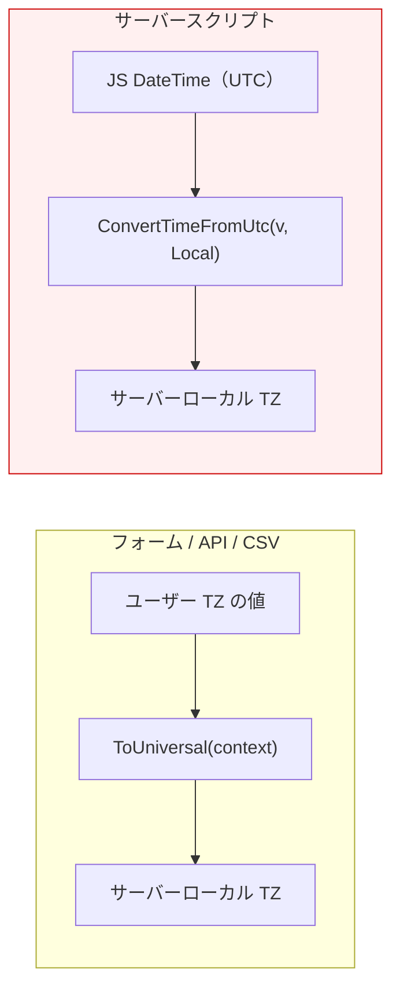
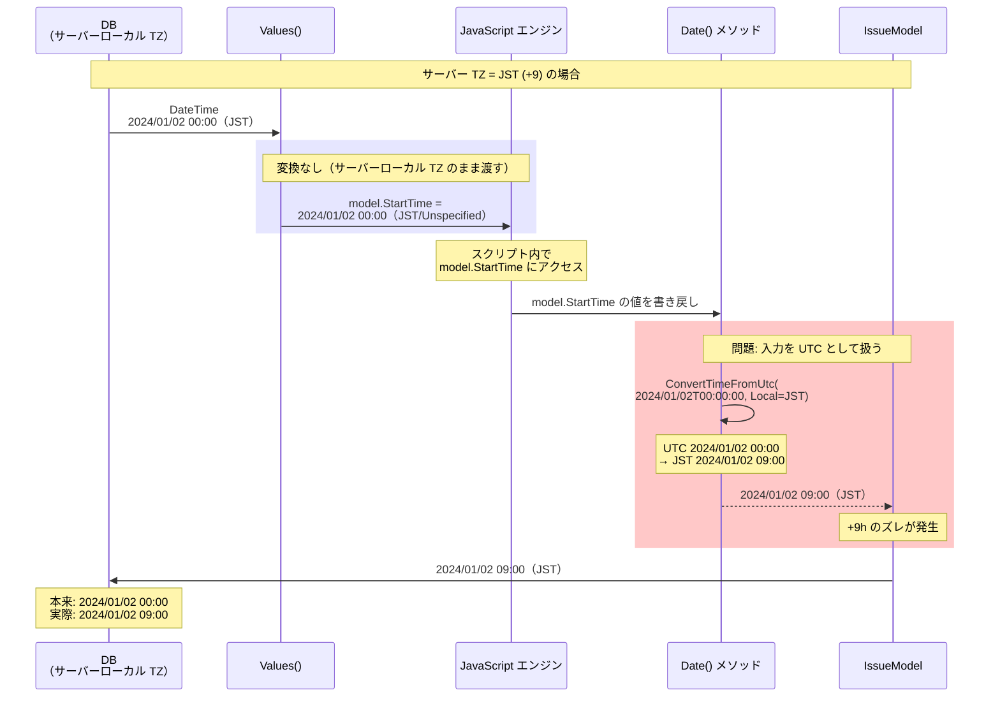
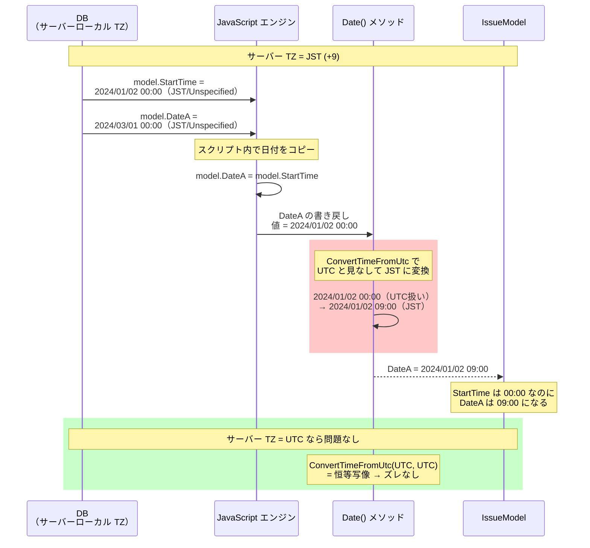
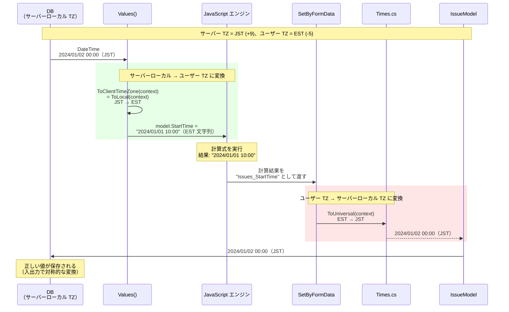
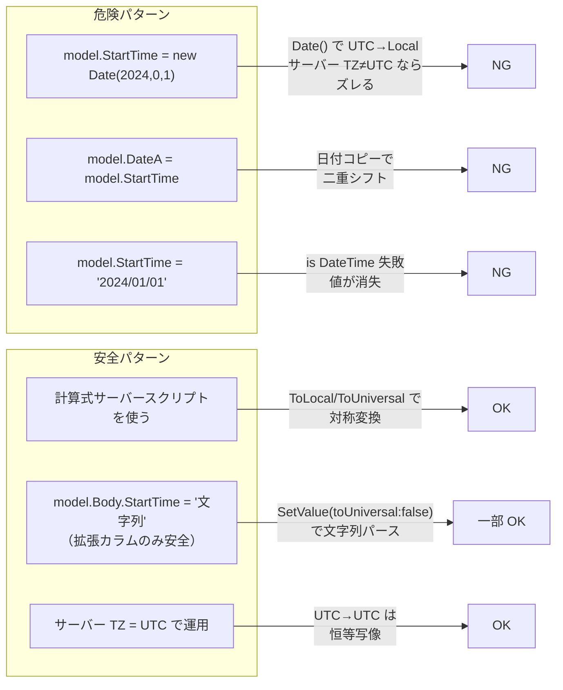
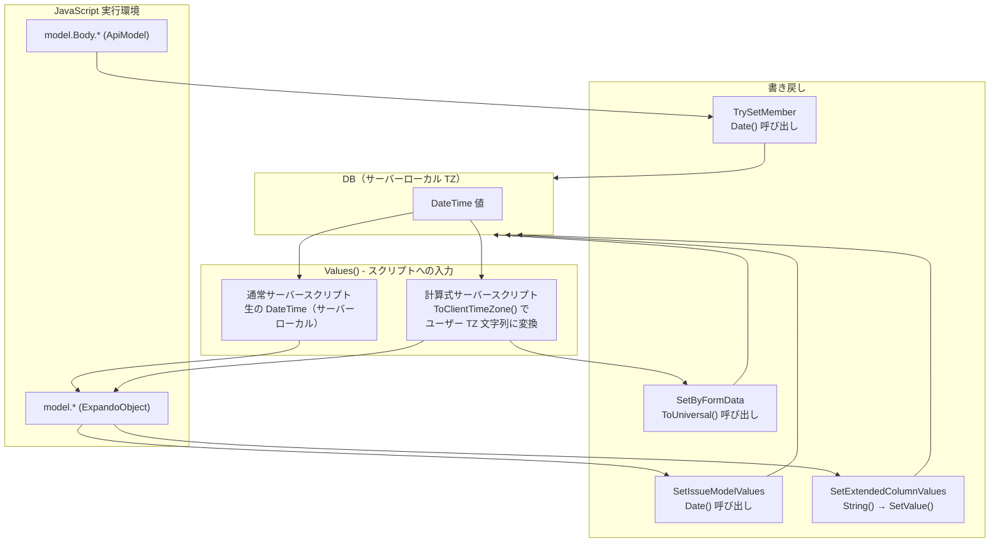
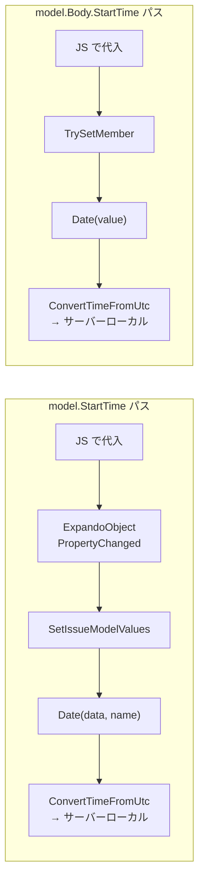
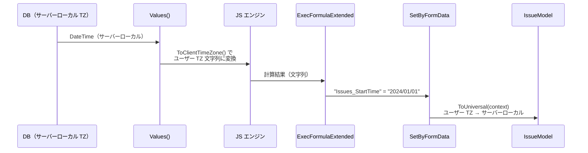

# ServerScript タイムゾーン要注意事項

サーバースクリプトにおけるタイムゾーン変換は、フォーム入力・API 等の通常経路とは根本的に異なる方式を使用しており、サーバー TZ が UTC でない環境では日付のズレが発生する。このドキュメントでは、その内部実装の詳細と要注意事項を整理する。

Pleasanter 全体のタイムゾーン設計については [012-タイムゾーン全体設計](012-タイムゾーン全体設計.md) を参照。

<!-- START doctoc generated TOC please keep comment here to allow auto update -->
<!-- DON'T EDIT THIS SECTION, INSTEAD RE-RUN doctoc TO UPDATE -->

- [調査情報](#調査情報)
- [調査目的](#調査目的)
- [前提](#前提)
- [通常サーバースクリプトと他の入力経路の違い](#通常サーバースクリプトと他の入力経路の違い)
- [サーバースクリプト（通常）の日付フロー](#サーバースクリプト通常の日付フロー)
    - [サーバースクリプトでの日付コピー（要注意）](#サーバースクリプトでの日付コピー要注意)
    - [計算式サーバースクリプトの日付フロー](#計算式サーバースクリプトの日付フロー)
    - [安全パターンと危険パターン](#安全パターンと危険パターン)
- [サーバースクリプトにおける日付値フロー](#サーバースクリプトにおける日付値フロー)
    - [全体図](#全体図)
- [入力フェーズ：Values() メソッド](#入力フェーズvalues-メソッド)
    - [通常サーバースクリプト（isFormulaServerScript = false）](#通常サーバースクリプトisformulaserverscript--false)
    - [計算式サーバースクリプト（isFormulaServerScript = true）](#計算式サーバースクリプトisformulaserverscript--true)
    - [入力フェーズまとめ](#入力フェーズまとめ)
- [出力フェーズ：書き戻しの仕組み](#出力フェーズ書き戻しの仕組み)
    - [Date() メソッド（ServerScriptUtilities 内）](#date-メソッドserverscriptutilities-内)
    - [組み込み日付項目（StartTime 等）の書き戻し](#組み込み日付項目starttime-等の書き戻し)
    - [拡張日付カラム（DateA 等）の書き戻し](#拡張日付カラムdatea-等の書き戻し)
    - [BaseModel.SetValue()](#basemodelsetvalue)
- [API モデルパス（model.Body.\*）](#api-モデルパスmodelbody\)
    - [ServerScriptModelApiModel.TrySetMember](#serverscriptmodelapimodeltrysetmember)
- [書き戻しフロー比較](#書き戻しフロー比較)
    - [組み込み日付項目（StartTime 等）](#組み込み日付項目starttime-等)
    - [拡張日付カラム（DateA 等）](#拡張日付カラムdatea-等)
- [計算式サーバースクリプトの書き戻し](#計算式サーバースクリプトの書き戻し)
    - [実行フロー](#実行フロー)
    - [結果の適用](#結果の適用)
    - [計算式のタイムゾーンフロー](#計算式のタイムゾーンフロー)
- [$NOW() / $TODAY() 関数のタイムゾーン処理](#now--today-関数のタイムゾーン処理)
- [utilities.Today() のタイムゾーン処理](#utilitiestoday-のタイムゾーン処理)
- [要注意事項（エッジケース）](#要注意事項エッジケース)
    - [1. JavaScript `new Date()` と文字列代入の違い](#1-javascript-new-date-と文字列代入の違い)
    - [2. サーバー TZ が UTC でない場合の二重シフト](#2-サーバー-tz-が-utc-でない場合の二重シフト)
    - [3. ExpandoObject と API モデルの変換差異（拡張日付カラム）](#3-expandoobject-と-api-モデルの変換差異拡張日付カラム)
    - [4. CompletionTime の AddDifferenceOfDates 処理](#4-completiontime-の-adddifferenceofdates-処理)
- [フォーム・API・CSV との変換方式の違い](#フォームapicsv-との変換方式の違い)
- [結論](#結論)
- [関連ソースコード](#関連ソースコード)
- [関連ドキュメント](#関連ドキュメント)
- [注意事項](#注意事項)

<!-- END doctoc generated TOC please keep comment here to allow auto update -->

## 調査情報

| 調査日        | リポジトリ | ブランチ | タグ/バージョン    | コミット    | 備考     |
| ------------- | ---------- | -------- | ------------------ | ----------- | -------- |
| 2026年2月24日 | Pleasanter | （なし） | Pleasanter_1.5.1.0 | `34f162a43` | 初回調査 |

## 調査目的

サーバースクリプト内で日付値を読み書きする際、内部でどのようなタイムゾーン変換が行われるかを把握し、以下を明確にする。

- ExpandoObject（`model.*`）パスと API モデル（`model.Body.*`）パスの変換差異
- 組み込み日付項目と拡張日付項目の変換差異
- 計算式サーバースクリプトでの変換フロー
- JavaScript の `new Date()` と文字列代入における挙動の違い
- サーバータイムゾーンが UTC でない場合の要注意事項

---

## 前提

- DB 格納形式: サーバーローカル TZ（`TimeZoneInfo.Local`）
- `ToLocal(context)`: サーバーローカル TZ → ユーザー TZ
- `ToUniversal(context)`: ユーザー TZ → サーバーローカル TZ

詳細は [012-タイムゾーン全体設計](012-タイムゾーン全体設計.md) を参照。

---

## 通常サーバースクリプトと他の入力経路の違い

フォーム入力・API・CSV インポートでは `ToUniversal(context)`（ユーザー TZ 基準）で変換されるが、
**通常サーバースクリプトでは `ConvertTimeFromUtc(v, TimeZoneInfo.Local)`** という独自の変換が使われる。



この違いが以下で詳述する要注意事項の根本原因となっている。

---

## サーバースクリプト（通常）の日付フロー



### サーバースクリプトでの日付コピー（要注意）



### 計算式サーバースクリプトの日付フロー



### 安全パターンと危険パターン



---

## サーバースクリプトにおける日付値フロー

### 全体図



---

## 入力フェーズ：Values() メソッド

**ファイル**: `Implem.Pleasanter/Libraries/ServerScripts/ServerScriptUtilities.cs`（行番号: 105-330）

`Values()` メソッドは `isFormulaServerScript` パラメータによって日付値の渡し方を切り替える。

### 通常サーバースクリプト（isFormulaServerScript = false）

日付値は**生の DateTime オブジェクト**（サーバーローカル TZ）としてそのまま ExpandoObject に格納される。

```csharp
ReadNameValue(
    columnName: nameof(model.CreatedTime),
    value: model.CreatedTime?.Value,  // 生のサーバーローカル DateTime
    mine: mine),
```

拡張日付カラム（DateA 等）も同様：

```csharp
values.AddRange(model
    .DateHash
    .Select(element => ReadNameValue(
        columnName: element.Key,
        value: element.Value,  // 生のサーバーローカル DateTime
        mine: mine)));
```

IssueModel 固有の StartTime、CompletionTime も同様：

```csharp
ReadNameValue(
    columnName: nameof(IssueModel.StartTime),
    value: issueModel.StartTime,  // 生のサーバーローカル DateTime
    mine: mine),
```

### 計算式サーバースクリプト（isFormulaServerScript = true）

日付値は**ユーザータイムゾーンに変換した文字列**として渡される。

```csharp
ReadNameValue(
    columnName: nameof(model.CreatedTime),
    value: model.CreatedTime?.Value.ToClientTimeZone(context: context),
    mine: mine),
```

`ToClientTimeZone` の実装（行番号: 334-339）：

```csharp
private static string ToClientTimeZone(this DateTime self, Context context)
{
    return self.InRange()
        ? self.ToLocal(context).ToString("yyyy/MM/dd HH:mm:ss")
        : string.Empty;
}
```

拡張日付カラムも文字列化される：

```csharp
values.AddRange(model
    .DateHash
    .Select(element => ReadNameValue(
        columnName: element.Key,
        value: isFormulaServerScript
            ? element.Value.ToClientTimeZone(context: context)
            : element.Value,
        mine: mine)));
```

CompletionTime は `AddDifferenceOfDates` による日付フォーマット補正も入る：

```csharp
value: issueModel.CompletionTime.Value
    .AddDifferenceOfDates(format: ..., minus: true)
    .ToClientTimeZone(context: context)
```

### 入力フェーズまとめ

| 項目                    | 通常サーバースクリプト          | 計算式サーバースクリプト                    |
| ----------------------- | ------------------------------- | ------------------------------------------- |
| 値の型                  | DateTime（サーバーローカル TZ） | string（ユーザー TZ）                       |
| CreatedTime/UpdatedTime | 生の DateTime                   | `ToLocal(context)` → 文字列                 |
| DateHash（拡張日付）    | 生の DateTime                   | `ToLocal(context)` → 文字列                 |
| StartTime               | 生の DateTime                   | `ToLocal(context)` → 文字列                 |
| CompletionTime          | 生の DateTime                   | `AddDifferenceOfDates` + `ToLocal` → 文字列 |

---

## 出力フェーズ：書き戻しの仕組み

### Date() メソッド（ServerScriptUtilities 内）

ExpandoObject からの日付読み取りに使用される`Date()` メソッド（行番号: 67-72）：

```csharp
private static DateTime Date(ExpandoObject data, string name)
{
    var value = Value(data, name);
    return value is DateTime dateTime
        ? TimeZoneInfo.ConvertTimeFromUtc(dateTime, TimeZoneInfo.Local)
        : Types.ToDateTime(0);
}
```

**重要**: `ConvertTimeFromUtc` は入力値を**常に UTC として扱う**。

### 組み込み日付項目（StartTime 等）の書き戻し

`SetIssueModelValues`（行番号: 778-868）で `Date()` を使用：

```csharp
SetValue(
    columnName: nameof(IssueModel.StartTime),
    columns: columns,
    setter: value => issueModel.StartTime = value,
    getter: column => Date(data: data, name: column.Name));  // Date() で変換
```

**注意**: `columns` は `FilterCanUpdateColumns` から取得され、スクリプトが**変更した項目のみ**が対象となる。

### 拡張日付カラム（DateA 等）の書き戻し

`SetExtendedColumnValues`（行番号: 653-661）:

```csharp
private static void SetExtendedColumnValues(
    Context context, BaseItemModel model, ExpandoObject data, Column[] columns)
{
    columns?.ForEach(column => model?.SetValue(
        context: context,
        column: column,
        value: String(data: data, columnName: column.ColumnName)));
}
```

`String()` メソッド（行番号: 41-56）は Date 型の場合 `Date()` を呼ぶ：

```csharp
private static string String(ExpandoObject data, string columnName)
{
    switch (Def.ExtendedColumnTypes.Get(columnName ?? string.Empty))
    {
        case "Date":
            value = Date(data: data, name: columnName);
            break;
        default:
            value = Value(data: data, name: columnName);
            break;
    }
    return value?.ToString() ?? string.Empty;
}
```

その後 `BaseModel.SetValue()` に渡される。

### BaseModel.SetValue()

**ファイル**: `Implem.Pleasanter/Models/Shared/_BaseModel.cs`（行番号: 189-234）

```csharp
public void SetValue(
    Context context, Column column, string value, bool toUniversal = false)
{
    case "Date":
        SetDate(
            columnName: column.ColumnName,
            value: toUniversal
                ? value.ToDateTime().ToUniversal(context: context)
                : value.ToDateTime());
        break;
}
```

`SetExtendedColumnValues` からの呼び出しでは `toUniversal` は**デフォルト値 `false`** のまま。つまりタイムゾーン変換は行われない。

---

## API モデルパス（model.Body.\*）

### ServerScriptModelApiModel.TrySetMember

**ファイル**: `Implem.Pleasanter/Libraries/ServerScripts/ServerScriptModelApiModel.cs`（行番号: 270-430）

`TrySetMember` は以下の順序で処理する：

1. まず `Model.SetValue()` を呼ぶ（全項目共通）
2. その後、型固有の switch 文で個別処理

```csharp
public override bool TrySetMember(SetMemberBinder binder, object value)
{
    string name = binder.Name;
    // 1. 全項目共通処理
    Model.SetValue(
        context: Context,
        column: new Column(name),
        value: value.ToStr());  // toUniversal = false（デフォルト）

    // 2. IssueModel 固有処理
    if (Model is IssueModel issueModel)
    {
        case nameof(IssueModel.StartTime):
            issueModel.StartTime = Date(value);  // UTC → サーバーローカル
            return true;
    }
}
```

API モデル内の `Date()` メソッド（行番号: 453-458）：

```csharp
private static DateTime Date(object value)
{
    return value is DateTime dateTime
        ? TimeZoneInfo.ConvertTimeFromUtc(dateTime, TimeZoneInfo.Local)
        : Types.ToDateTime(0);
}
```

---

## 書き戻しフロー比較

### 組み込み日付項目（StartTime 等）



両パスとも `Date()` を使用し、同じ `ConvertTimeFromUtc` 変換が行われる。

### 拡張日付カラム（DateA 等）

| パス                           | 変換フロー                                                                |
| ------------------------------ | ------------------------------------------------------------------------- |
| `model.DateA`（ExpandoObject） | `Date()` → `ConvertTimeFromUtc` → 文字列 → `SetValue(toUniversal: false)` |
| `model.Body.DateA`（ApiModel） | `value.ToStr()` → `SetValue(toUniversal: false)` → `value.ToDateTime()`   |

**差異**: ExpandoObject パスでは `Date()` を経由して `ConvertTimeFromUtc` が適用されるが、API モデルパスでは文字列化 → パースのみでタイムゾーン変換が行われない。

---

## 計算式サーバースクリプトの書き戻し

### 実行フロー

**ファイル**: `Implem.Pleasanter/Libraries/ServerScripts/FormulaServerScriptUtilities.cs`（行番号: 14-98）

```csharp
public static object Execute(
    Context context, SiteSettings ss,
    BaseItemModel itemModel, string formulaScript)
{
    var data = ServerScriptUtilities.Values(
        context: context, ss: ss,
        model: itemModel,
        isFormulaServerScript: true);  // ユーザー TZ 文字列で渡す
    // ...
    object value = engine.Evaluate(functionScripts + formulaScript);
    return value;
}
```

### 結果の適用

計算式結果は `ExecFormulaExtended` → `SetByFormData` の経路で書き戻される。

**ファイル**: `Implem.Pleasanter/Models/Issues/IssueModel.cs`（行番号: 3925-3983, 2881-2960）

```csharp
// ExecFormulaExtended
var value = FormulaServerScriptUtilities.Execute(
    context: context, ss: ss,
    itemModel: this, formulaScript: script);
var formData = new Dictionary<string, string>
{
    { $"Issues_{columnName}", value }
};
SetByFormData(context: context, ss: ss, formData: formData);
```

`SetByFormData` 内では日付値に `ToUniversal(context)` が適用される：

```csharp
// SetByFormData
case "Issues_StartTime":
    StartTime = value.ToDateTime().ToUniversal(context: context);
    break;

// 拡張日付カラム
case "Date":
    SetDate(columnName: column.ColumnName,
        value: value.ToDateTime().ToUniversal(context: context));
    break;
```

### 計算式のタイムゾーンフロー



入力でユーザー TZ に変換し、出力で `ToUniversal` でサーバーローカルに戻すため、**計算式では一貫したタイムゾーン処理が行われる**。

---

## $NOW() / $TODAY() 関数のタイムゾーン処理

**ファイル**: `Implem.Pleasanter/Libraries/ServerScripts/FormulaServerScriptUtilities.cs`（行番号: 542-612）

計算式で利用可能な `$NOW()` / `$TODAY()` は、ユーザータイムゾーンを考慮した文字列を返す。

```javascript
function $NOW()
{
    var d = new Date();
    d.setMinutes(d.getMinutes() + d.getTimezoneOffset()
        + /* context.TimeZoneInfo.BaseUtcOffset.Hours * 60 */);
    return formatted_string;  // "yyyy/MM/dd HH:mm:ss"
}
```

| 関数       | 変換方法                                     | 戻り値             |
| ---------- | -------------------------------------------- | ------------------ |
| `$NOW()`   | UTC + ユーザー TZ オフセット                 | ユーザー TZ 文字列 |
| `$TODAY()` | UTC + ユーザー TZ オフセット（時刻切り捨て） | ユーザー TZ 文字列 |

**注意**: `BaseUtcOffset.Hours` を使用しているため、夏時間（DST）が考慮されない可能性がある。

---

## utilities.Today() のタイムゾーン処理

**ファイル**: `Implem.Pleasanter/Libraries/ServerScripts/ServerScriptModelUtilities.cs`（行番号: 22-24）

通常サーバースクリプトで使用可能な `utilities.Today()` メソッド：

```csharp
public DateTime Today()
{
    return DateTime.Now.ToLocal(context: Context).Date.ToUniversal(context: Context);
}
```

変換フロー：

1. `DateTime.Now` → サーバーローカルの現在時刻
2. `.ToLocal(context)` → ユーザー TZ に変換
3. `.Date` → 日付のみ取得
4. `.ToUniversal(context)` → サーバーローカル TZ に戻す

このメソッドは**ユーザーの「今日」をサーバーローカル TZ 形式の DateTime で返す**。
サーバースクリプトで `model.StartTime = utilities.Today()` のように代入すると、
`Date()` メソッドで `ConvertTimeFromUtc` が適用される点に注意。

---

## 要注意事項（エッジケース）

### 1. JavaScript `new Date()` と文字列代入の違い

| 代入方法                         | ExpandoObject パス                                     | API モデルパス                                         |
| -------------------------------- | ------------------------------------------------------ | ------------------------------------------------------ |
| `model.X = new Date(2024, 0, 1)` | DateTime → `Date()` で UTC→サーバーローカル変換        | DateTime → `Date()` で UTC→サーバーローカル変換        |
| `model.X = "2024/01/01"`         | string → `Date()` で `is DateTime` 失敗 → **日付消失** | string → `Date()` で `is DateTime` 失敗 → **日付消失** |

`Date()` メソッドは `value is DateTime` チェックを行い、文字列の場合は `Types.ToDateTime(0)` を返す。つまり**文字列で日付を代入すると、組み込み日付項目では値が失われる**。

例外として、**拡張日付カラムの API モデルパス**では `Model.SetValue()` が先に呼ばれ、
`value.ToStr()` → `ToDateTime()` で文字列がパースされるため、値は保持される
（ただし `toUniversal: false` なので TZ 変換なし）。

### 2. サーバー TZ が UTC でない場合の二重シフト

`Date()` メソッドの `ConvertTimeFromUtc(dateTime, TimeZoneInfo.Local)` は入力を**常に UTC として扱う**。

スクリプト内で日付プロパティを別の日付プロパティにコピーする場合：

```javascript
// サーバースクリプト内
model.DateA = model.StartTime; // StartTime は ExpandoObject 上でサーバーローカル DateTime
```

| サーバー TZ | 入力値                     | Date() の結果                  | 正しい値            |
| ----------- | -------------------------- | ------------------------------ | ------------------- |
| UTC         | 2024/01/01 00:00:00（UTC） | 2024/01/01 00:00:00（UTC）     | 2024/01/01 00:00:00 |
| JST (+9)    | 2024/01/01 09:00:00（JST） | 2024/01/01 18:00:00（**+9h**） | 2024/01/01 09:00:00 |

サーバー TZ が UTC の場合は変換が恒等写像となり問題ないが、**UTC 以外のサーバー TZ ではオフセット分の二重シフトが発生する**。

### 3. ExpandoObject と API モデルの変換差異（拡張日付カラム）

```javascript
// パス A: ExpandoObject
model.DateA = new Date(2024, 0, 1); // UTC DateTime
// → Date() で ConvertTimeFromUtc → サーバーローカル

// パス B: API モデル
model.Body.DateA = new Date(2024, 0, 1); // UTC DateTime
// → value.ToStr() → SetValue(toUniversal: false) → そのまま格納
```

同じ値を代入しても、パスによって異なるタイムゾーン処理が行われる。

### 4. CompletionTime の AddDifferenceOfDates 処理

**ファイル**: `Implem.Pleasanter/Libraries/Extensions/TimeExtensions.cs`

CompletionTime は表示フォーマットが `Ymd`（日付のみ）の場合、内部的に +1 日のオフセットが加算される。

```csharp
public static DateTime AddDifferenceOfDates(this DateTime self, string format, bool minus = false)
{
    return self.AddDays(DifferenceOfDates(format, minus));
}

public static int DifferenceOfDates(string format, bool minus = false)
{
    switch (format)
    {
        case "Ymd": return minus ? -1 : 1;
        default: return 0;
    }
}
```

計算式サーバースクリプトでは入力時に `minus: true`（-1 日）、
書き戻し時に `SetByFormData` 経由で `CompletionTime` コンストラクタが
`byForm: true` で呼ばれ、+1 日が加算される。
通常サーバースクリプトではこの調整が行われないため、
CompletionTime を直接操作する際は注意が必要。

---

## フォーム・API・CSV との変換方式の違い

サーバースクリプトの変換方式が他の入力経路と異なる点を比較する。
各経路の詳細は [012-タイムゾーン全体設計](012-タイムゾーン全体設計.md) を参照。

| 入力経路                            | 組み込み日付変換                                | 拡張日付変換                                                     |
| ----------------------------------- | ----------------------------------------------- | ---------------------------------------------------------------- |
| フォーム / API / CSV                | `ToUniversal(context)` でユーザー TZ 基準変換   | `ToUniversal(context)` でユーザー TZ 基準変換                    |
| サーバースクリプト（ExpandoObject） | `Date()` → `ConvertTimeFromUtc(v, Local)`       | `Date()` → `ConvertTimeFromUtc` → `SetValue(toUniversal: false)` |
| サーバースクリプト（ApiModel）      | `Date()` → `ConvertTimeFromUtc(v, Local)`       | `SetValue(toUniversal: false)` のみ                              |
| 計算式サーバースクリプト            | `SetByFormData` → `ToUniversal(context)` で変換 | `SetByFormData` → `ToUniversal(context)` で変換                  |

通常サーバースクリプトだけが `context.TimeZoneInfo`（ユーザー TZ）を**使用しない**独自の変換方式になっている。

---

## 結論

| 項目                                           | 内容                                                                        |
| ---------------------------------------------- | --------------------------------------------------------------------------- |
| サーバースクリプトの入力（通常）               | 生の DateTime（サーバーローカル TZ）                                        |
| サーバースクリプトの入力（計算式）             | `ToLocal(context)` でユーザー TZ 文字列に変換                               |
| サーバースクリプトの出力（ExpandoObject）      | `ConvertTimeFromUtc(_, TimeZoneInfo.Local)` で変換（入力を UTC として扱う） |
| サーバースクリプトの出力（ApiModel・組み込み） | `ConvertTimeFromUtc(_, TimeZoneInfo.Local)` で変換                          |
| サーバースクリプトの出力（ApiModel・拡張）     | `SetValue(toUniversal: false)` で変換なし                                   |
| 計算式サーバースクリプトの出力                 | `SetByFormData` → `ToUniversal(context)` でユーザー TZ → サーバーローカル   |
| 文字列での日付代入                             | 組み込み日付項目では **値が消失する**                                       |
| サーバー TZ が UTC 以外の場合                  | 日付コピーで**二重シフトが発生する**                                        |
| ExpandoObject vs ApiModel 拡張日付             | 同じ値でも**異なるタイムゾーン処理**が適用される                            |

---

## 関連ソースコード

| ファイル                                                                    | 内容                                                               |
| --------------------------------------------------------------------------- | ------------------------------------------------------------------ |
| `Implem.Pleasanter/Libraries/ServerScripts/ServerScriptUtilities.cs`        | 日付変換の中核（`Date()`、`Values()`、`SetIssueModelValues()` 等） |
| `Implem.Pleasanter/Libraries/ServerScripts/ServerScriptModelApiModel.cs`    | API モデルパスでの日付設定（`TrySetMember`、`Date()`）             |
| `Implem.Pleasanter/Libraries/ServerScripts/FormulaServerScriptUtilities.cs` | 計算式サーバースクリプトの実行・`$NOW()`/`$TODAY()`                |
| `Implem.Pleasanter/Libraries/ServerScripts/ServerScriptModelUtilities.cs`   | `utilities.Today()`/`MinTime()`/`MaxTime()`                        |
| `Implem.Pleasanter/Libraries/ServerScripts/ServerScriptModel.cs`            | サーバースクリプトモデル、ExpandoObject 構築                       |
| `Implem.Pleasanter/Libraries/ServerScripts/ServerScriptModelContext.cs`     | `context` オブジェクト（`TimeZoneInfo` 公開）                      |
| `Implem.Pleasanter/Models/Shared/_BaseModel.cs`                             | `SetValue()` メソッド（`toUniversal` パラメータ）                  |
| `Implem.Pleasanter/Libraries/Extensions/TimeExtensions.cs`                  | `AddDifferenceOfDates()`                                           |

## 関連ドキュメント

- [012-タイムゾーン全体設計](012-タイムゾーン全体設計.md): Pleasanter 全体のタイムゾーン設計・変換フロー

---

## 注意事項

- サーバーのタイムゾーンが UTC であることを前提とした設計になっている箇所がある。非 UTC サーバーで日付コピー操作を行うと二重シフトが発生する可能性がある
- `$NOW()` / `$TODAY()` 関数は `BaseUtcOffset.Hours` を使用しており、夏時間（DST）を持つタイムゾーンでは不正確になる可能性がある
- サーバースクリプト内で日付を設定する場合は、文字列ではなく JavaScript の `Date` オブジェクトを使用すること
