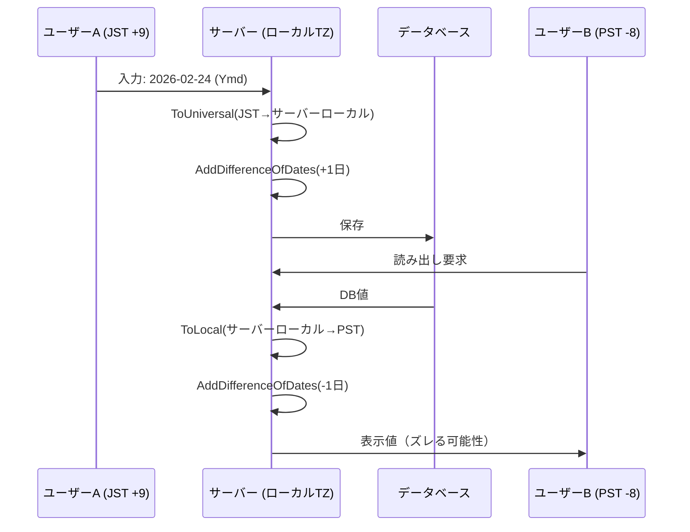
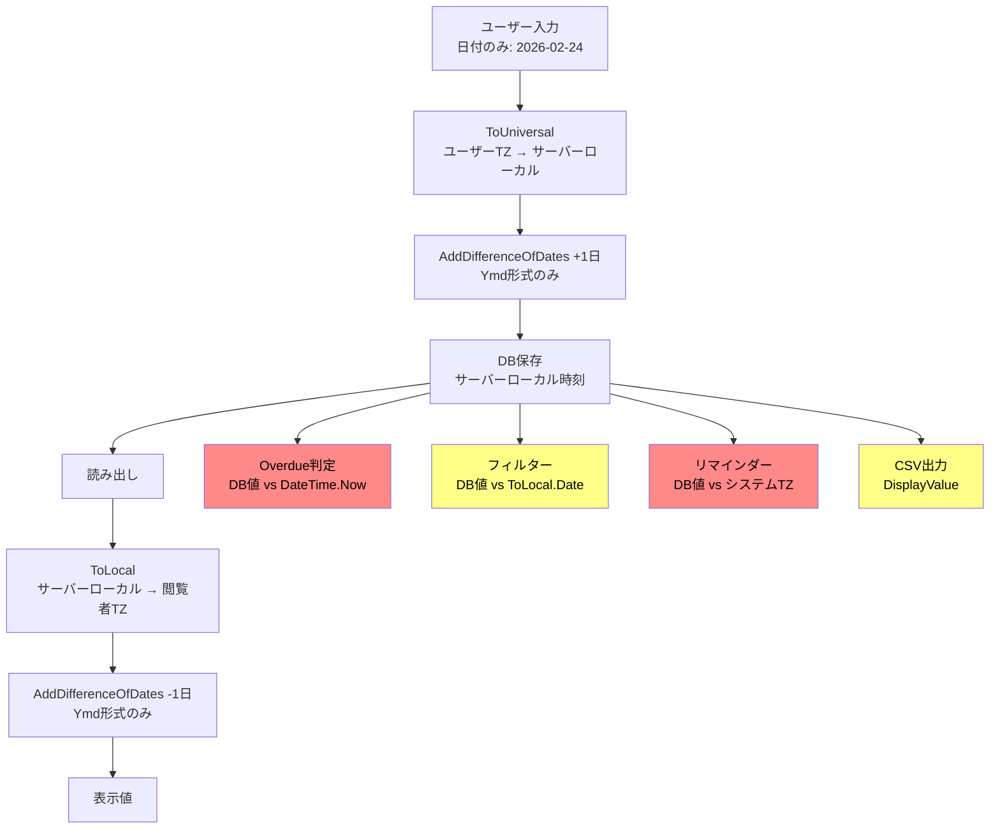

# タイムゾーン混在時の日付フィールド問題

異なるタイムゾーン（TZ）のユーザーが同一 Pleasanter 環境に混在する際に、「日付のみ」フィールドや「終日判定」で発生しうる問題を調査する。

<!-- START doctoc generated TOC please keep comment here to allow auto update -->
<!-- DON'T EDIT THIS SECTION, INSTEAD RE-RUN doctoc TO UPDATE -->

- [調査情報](#調査情報)
- [前提知識: EditorFormat と AddDifferenceOfDates](#前提知識-editorformat-と-adddifferenceofdates)
    - [EditorFormat の種類](#editorformat-の種類)
    - [AddDifferenceOfDates — 日付のみカラムの +1 日ルール](#adddifferenceofdates--日付のみカラムの-1-日ルール)
- [1. CompletionTime（期限日）の保存と変換](#1-completiontime期限日の保存と変換)
    - [保存の仕組み](#保存の仕組み)
    - [読み出しの仕組み](#読み出しの仕組み)
    - [TZ 混在時の問題シナリオ](#tz-混在時の問題シナリオ)
- [2. カレンダー表示での終日判定](#2-カレンダー表示での終日判定)
    - [サーバー側: CalendarElement 生成](#サーバー側-calendarelement-生成)
    - [フロントエンド側: FullCalendar の終日判定](#フロントエンド側-fullcalendar-の終日判定)
    - [TZ 混在時の問題](#tz-混在時の問題)
- [3. ガントチャートの日付境界](#3-ガントチャートの日付境界)
    - [問題点](#問題点)
- [4. 期限切れ判定（Overdue）](#4-期限切れ判定overdue)
    - [CompletionTime.Overdue()](#completiontimeoverdue)
    - [SiteMenu のオーバーデュー件数](#sitemenu-のオーバーデュー件数)
    - [View フィルターの Overdue](#view-フィルターの-overdue)
- [5. 遅延フィルター（Delay）](#5-遅延フィルターdelay)
- [6. NearCompletionTime フィルター](#6-nearcompletiontime-フィルター)
    - [問題シナリオ](#問題シナリオ)
- [7. CompletionTime.Near() 判定](#7-completiontimenear-判定)
- [8. リマインダーの日付判定](#8-リマインダーの日付判定)
    - [問題点](#問題点-1)
    - [リマインダー本文の日付表示](#リマインダー本文の日付表示)
- [9. フィルター・ビューでの日付範囲](#9-フィルタービューでの日付範囲)
    - [DateFilterOptions（「今日」「今月」等）](#datefilteroptions今日今月等)
    - [DefaultTime（日付カラムのデフォルト値）](#defaulttime日付カラムのデフォルト値)
- [10. CSV エクスポート](#10-csv-エクスポート)
    - [Time.ToExport()](#timetoexport)
    - [CompletionTime.ToExport() は未オーバーライド](#completiontimetoexport-は未オーバーライド)
    - [問題シナリオ](#問題シナリオ-1)
- [11. ServerScript の Today()](#11-serverscript-の-today)
- [12. DataChange の日付入力](#12-datachange-の日付入力)
- [13. BurnDown チャート](#13-burndown-チャート)
- [14. クロス集計の TZ 調整](#14-クロス集計の-tz-調整)
- [問題の全体像](#問題の全体像)
- [影響のサマリ](#影響のサマリ)
- [根本原因の分析](#根本原因の分析)
- [備考](#備考)

<!-- END doctoc generated TOC please keep comment here to allow auto update -->

---

## 調査情報

| 項目             | 内容                                                                                                                                         |
| ---------------- | -------------------------------------------------------------------------------------------------------------------------------------------- |
| 対象リポジトリ   | [Implem/Implem.Pleasanter](https://github.com/Implem/Implem.Pleasanter)                                                                      |
| 調査日           | 2026-02-24                                                                                                                                   |
| 前提ドキュメント | [012-タイムゾーン全体設計](012-タイムゾーン全体設計.md)、[013-ServerScriptタイムゾーン要注意事項](013-ServerScriptタイムゾーン要注意事項.md) |

---

## 前提知識: EditorFormat と AddDifferenceOfDates

### EditorFormat の種類

`Column.EditorFormat` は日付カラムの表示・保存形式を決定する。

| EditorFormat | 意味       | ピッカー形式   | 入力に時刻を含むか |
| ------------ | ---------- | -------------- | ------------------ |
| `Ymd`        | 日付のみ   | DatePicker     | 含まない           |
| `Ymdhm`      | 日時（分） | DateTimePicker | 含む               |
| `Ymdhms`     | 日時（秒） | DateTimePicker | 含む               |

**ソース**: `Column.cs` L1032-L1055

```csharp
// Column.cs
public string DateTimeFormat(Context context)
{
    switch (EditorFormat)
    {
        case "Ymdhm":
            return Displays.YmdhmDatePickerFormat(context: context);
        case "Ymdhms":
            return Displays.YmdhmsDatePickerFormat(context: context);
        default:
            return Displays.YmdDatePickerFormat(context: context);
    }
}

public bool DateTimepicker()
{
    switch (EditorFormat)
    {
        case "Ymdhm":
        case "Ymdhms":
            return true;
        default:
            return false;
    }
}
```

### AddDifferenceOfDates — 日付のみカラムの +1 日ルール

`EditorFormat == "Ymd"` の場合、DB に保存される値は「表示日 + 1 日」になる。例えば、期限日 `2026-02-24` は DB 上では `2026-02-25 00:00:00`（サーバーローカル時刻）として保存される。

**ソース**: `TimeExtensions.cs` L6-L21

```csharp
// TimeExtensions.cs
public static DateTime AddDifferenceOfDates(
    this DateTime self, string format, bool minus = false)
{
    return self.AddDays(DifferenceOfDates(format, minus));
}

public static int DifferenceOfDates(string format, bool minus = false)
{
    switch (format)
    {
        case "Ymd": return minus ? -1 : 1;
        default: return 0;
    }
}
```

この +1 日ルールにより、`CompletionTime` が `Ymd` のとき、DB 値は「期限日翌日 00:00:00」を意味する。表示時には `AddDifferenceOfDates(minus: true)` で -1 日して元の日付に戻す。

---

## 1. CompletionTime（期限日）の保存と変換

### 保存の仕組み

**ソース**: `CompletionTime.cs` L47-L74

```csharp
// CompletionTime.cs コンストラクタ（フォーム入力時）
public CompletionTime(
    Context context, SiteSettings ss, DateTime value, Status status,
    bool byForm = false) : base(context, value, byForm)
{
    if (byForm)
    {
        Value = value
            .ToUniversal(context: context)        // ユーザーTZ → サーバーローカル
            .AddDifferenceOfDates(... EditorFormat); // Ymd なら +1日
        DisplayValue = value;
    }
    else
    {
        Value = value
            .AddDifferenceOfDates(... EditorFormat);
        DisplayValue = value.ToLocal(context: context);
    }
}
```

### 読み出しの仕組み

**ソース**: `CompletionTime.cs` L30-L42

```csharp
// CompletionTime.cs コンストラクタ（DataRow読み出し時）
Value = dataRow.DateTime("CompletionTime");
DisplayValue = Value
    .ToLocal(context: context)                     // サーバーローカル → ユーザーTZ
    .AddDifferenceOfDates(... EditorFormat, minus: true); // Ymd なら -1日
```

### TZ 混在時の問題シナリオ

```
ユーザーA（UTC+9 JST）が CompletionTime を "2026-02-24"（Ymd形式）で設定
  → ToUniversal: JST 2026-02-24 00:00 → サーバーローカル 2026-02-23 15:00
  → AddDifferenceOfDates(+1日): 2026-02-24 15:00
  → DB保存値: 2026-02-24 15:00

ユーザーB（UTC-8 PST）が読み出し
  → ToLocal: 2026-02-24 15:00 → PST 2026-02-23 23:00
  → AddDifferenceOfDates(-1日): 2026-02-22 23:00
  → 表示: 2026-02-22  ← 本来の 2026-02-24 から 2日ズレる
```

この計算例はサーバーのローカルタイムゾーンが UTC であると仮定した場合だが、サーバーが JST であれば UTC+9 ユーザーの `ToUniversal` は恒等変換になる。しかしサーバーローカルと異なる TZ のユーザーは常に影響を受ける。



**根本原因**: `AddDifferenceOfDates` は **TZ 変換後** に適用されるが、
スケジュール本来「日付のみ」で TZ に依存しないはずの概念が、
UTC 変換を経由することで特定の時刻を持ってしまう。
`AddDifferenceOfDates` は単純な +/-1 日であり、TZ オフセットの差を吸収しない。

---

## 2. カレンダー表示での終日判定

### サーバー側: CalendarElement 生成

**ソース**: `HtmlCalendar.cs` L784-L796

```csharp
// HtmlCalendar.cs
private static DateTime ConvertIfCompletionTime(
    Context context, Column column, DateTime dateTime)
{
    switch (column?.ColumnName)
    {
        case "CompletionTime":
            return dateTime
                .ToLocal(context: context)
                .AddDifferenceOfDates(column.EditorFormat, minus: true);
        default:
            return dateTime.ToLocal(context: context);
    }
}
```

CalendarElement / FullCalendarElement には **`allDay` プロパティが存在しない**。終日かどうかの判定はフロントエンドの JavaScript に委ねられている。

### フロントエンド側: FullCalendar の終日判定

**ソース**: `calendar.js` L4, L99, L148

```javascript
// calendar.js - endDate 調整
if ($('#CalendarEditorFormat' + calendarSuffix).val() === 'Ymd') {
    endDate.setDate(endDate.getDate() + 1);
    endDate.setHours(0, 0, 0, 0);
}
```

FullCalendar ライブラリは `start` と `end` の時刻部分が `00:00:00` であれば自動的に「終日イベント」として表示する（`nextDayThreshold: "00:00:00"` がデフォルト）。

### TZ 混在時の問題

1. サーバー側で `ToLocal(context)` により日時が変換されるが、JSON を受け取るフロントエンド側では `removeTimeZoneSuffix()` で `Z` サフィックスを単純除去している

    **ソース**: `calendar.js` L406-L413

    ```javascript
    function removeTimeZoneSuffix(datetime_str) {
        if (datetime_str === undefined) {
            return datetime_str;
        } else {
            return datetime_str.replace('Z', '');
        }
    }
    ```

2. サーバー側で既にユーザー TZ に変換済みの日時から `Z` を除去するため、ブラウザのローカルTZ による二重変換は発生しない。しかし、`ToLocal` で変換された値が日付境界をまたぐと、FullCalendar の終日判定が正しく機能しなくなる

3. 例: Ymd 形式の CompletionTime で値が `2026-02-25 00:00 (UTC)` の場合
    - JST ユーザー: `ToLocal` → `02-25 09:00` → `-1日` → `02-24 09:00` — **時刻部分が残る** ため終日ではなく時間付きイベントになる
    - ただし実際にはサーバーローカルが JST なら UTC でなく JST で保存されるため、この問題はサーバーローカル TZ とユーザー TZ が一致しない場合に発生する

---

## 3. ガントチャートの日付境界

**ソース**: `GanttElement.cs` L85-L102

```csharp
// GanttElement.cs
StartTime = startTime.InRange()
    ? startTime.ToLocal(context: context,
        format: Displays.YmdFormat(context: context))
    : createdTime.ToLocal(context: context,
        format: Displays.YmdFormat(context: context));

CompletionTime = completionTime.ToLocal(context: context,
    format: Displays.YmdFormat(context: context));

DisplayCompletionTime = completionTime
    .AddDifferenceOfDates(completionTimeColumn.EditorFormat, minus: true)
    .ToLocal(context: context,
        format: Displays.YmdFormat(context: context));
```

### 問題点

`CompletionTime` プロパティ（ガントバーの描画用）は `ToLocal` 後に
`YmdFormat` で文字列化されるが、`AddDifferenceOfDates` **前** の値が使われている。
一方 `DisplayCompletionTime`（表示ラベル用）は `AddDifferenceOfDates` **後** の値。

TZ の変動で日付がまたぐと、ガントバーの長さ（`CompletionTime`）と表示ラベル（`DisplayCompletionTime`）が 1 日ズレるケースがある。

**ソース**: `GanttUtilities.cs` L40-L55

```csharp
// GanttUtilities.cs - SQL WHERE 条件
public static SqlWhereCollection Where(Context context, SiteSettings ss)
{
    return Rds.IssuesWhere().Add(or: Rds.IssuesWhere()
        .Add(raw: "(({0}) <= @Start and {1} >= @End)".Params(
            Def.Sql.StartTimeColumn,
            CompletionTimeSql(context: context, ss: ss)))
        // ...
    );
}

private static string CompletionTimeSql(Context context, SiteSettings ss)
{
    return Def.Sql.CompletionTimeColumn.Replace(
        "#DifferenceOfDates#",
        TimeExtensions.DifferenceOfDates(
            ss.GetColumn(context: context, columnName: "CompletionTime")?
                .EditorFormat, minus: true).ToString());
}
```

SQL の範囲クエリパラメータ `@Start` / `@End` はフロントエンドから送信されるが、DB 上の `CompletionTime` との比較で TZ 差による日付ズレが反映される可能性がある。

---

## 4. 期限切れ判定（Overdue）

### CompletionTime.Overdue()

**ソース**: `CompletionTime.cs` L120-L123

```csharp
public bool Overdue()
{
    return Status.Incomplete() && Value < DateTime.Now;
}
```

`Value` はサーバーローカル時刻で保存された DB 値。`DateTime.Now` もサーバーローカル時刻。

- **ユーザー TZ は一切考慮しない**
- Ymd 形式の場合、`Value` は「表示日 + 1 日の 0:00」のはず。しかし TZ 変換を経由して保存された場合、0:00 ジャストにならない
- 例: サーバーが JST、ユーザーが PST (-8) で 2/24 を入力
  → `ToUniversal` で `2/24 17:00 (JST)` → `+1日` → `2/25 17:00 (JST)` が DB 値
  → Overdue 判定は `2/25 17:00 < DateTime.Now(JST)` となり、
  JST の 2/25 17:00 以降に初めて Overdue になる
  → JST ユーザーから見れば 2/24 24:00 過ぎに Overdue になるべきだが 17 時間遅延する

### SiteMenu のオーバーデュー件数

**ソース**: `SiteMenu.cs` L173

```csharp
.CompletionTime(_operator: $"< {context.Sqls.CurrentDateTime} "),
```

DB サーバーの `getdate()` / `CURRENT_TIMESTAMP` と比較。こちらもユーザー TZ を考慮しない。

### View フィルターの Overdue

**ソース**: `View.cs` L2058-L2060

```csharp
where
    .Add(tableName: ss.ReferenceType,
        columnBrackets: "\"CompletionTime\"".ToSingleArray(),
        _operator: "<" + context.Sqls.CurrentDateTime);
```

DB サーバー時刻との比較であり、ユーザー TZ を反映しない。

---

## 5. 遅延フィルター（Delay）

**ソース**: `View.cs` L2003-L2011

```csharp
where
    .Add(tableName: ss.ReferenceType,
        columnBrackets: "\"ProgressRate\"".ToSingleArray(),
        _operator: "<",
        raw: Def.Sql.ProgressRateDelay
            .Replace("#TableName#", ss.ReferenceType));
```

`ProgressRateDelay` は SQL 定義で、進捗率の期待値と実際値を比較するもの。この比較は **CompletionTime の TZ 問題を間接的に引き継ぐ**。CompletionTime が TZ 差で実質的に異なる日時を指していれば、期待進捗率も変動する。

---

## 6. NearCompletionTime フィルター

**ソース**: `View.cs` L1985-L1990

```csharp
DateTime.Now.ToLocal(context: context).Date
    .AddDays(ss.NearCompletionTimeBeforeDays.ToInt() * (-1)),
DateTime.Now.ToLocal(context: context).Date
    .AddDays(ss.NearCompletionTimeAfterDays.ToInt() + 1)
    .AddMilliseconds(Parameters.Rds.MinimumTime * -1)
    .ToString("yyyy/M/d H:m:s.fff")
```

`DateTime.Now.ToLocal(context).Date` により **ユーザーの TZ での「今日」を取得**。しかし、この日付範囲は CompletionTime の DB 値（サーバーローカル時刻）と直接比較される。

### 問題シナリオ

- ユーザー TZ の「今日」は正しく算出されるが、その日付範囲がサーバーローカル時刻として DB に格納された CompletionTime と比較される
- CompletionTime 自体がユーザー TZ → サーバーローカル変換済みなので、**登録者と閲覧者の TZ が異なる場合**、比較が意図通りにならない可能性がある
- 上記 SQL 条件で `DateTime.Now.ToLocal(context)` の結果はサーバーローカル時間帯の文字列としてそのまま SQL に埋め込まれるため、TZ 変換の不整合が生じる

---

## 7. CompletionTime.Near() 判定

**ソース**: `CompletionTime.cs` L109-L118

```csharp
public bool Near(Context context, SiteSettings ss)
{
    return
        DateTime.Now.ToLocal(context: context).Date.AddDays(
            ss.NearCompletionTimeBeforeDays.ToInt() * (-1))
                <= DisplayValue &&
        DateTime.Now.ToLocal(context: context).Date.AddDays(
            ss.NearCompletionTimeAfterDays.ToInt() + 1).AddMilliseconds(-1)
                >= DisplayValue;
}
```

`DisplayValue` はユーザー TZ に変換済み（`AddDifferenceOfDates` 適用済み）。`DateTime.Now.ToLocal(context).Date` もユーザー TZ。

この判定は **同一ユーザーの TZ 内で閉じている** ため、比較的安全。ただし、他のユーザーが異なる TZ で登録したレコードの `DisplayValue` と比較する場合でも、読み出し時に閲覧者の TZ で再計算されるため問題は少ない。

---

## 8. リマインダーの日付判定

**ソース**: `Reminder.cs` L565, L600, L632

```csharp
// Reminder.cs - データ取得条件
.Add(tableName: ss.ReferenceType,
    columnBrackets: new string[] { "\"" + orderByColumn.ColumnName + "\"" },
    _operator: "<'{0:yyyy/M/d H:m:s.fff}'".Params(
        DateTime.Now.ToLocal(context: context).Date.AddDays(Range)))

// 日付のみカラムの判定
_operator: ContainsTimeSettings(orderByColumn)
    ? $">='{convertedScheduledTime}'"
    : $">'{convertedScheduledTime}'",

// ContainsTimeSettings
private bool ContainsTimeSettings(Column column)
{
    return column.EditorFormat == "Ymdhm" || column.EditorFormat == "Ymdhms";
}
```

### 問題点

1. リマインダーはバックグラウンドジョブとして実行されるため、`context` がどのユーザーの TZ を持つかが重要。通常はシステムの TZ（サーバーローカル）が使用される
2. 日付のみカラム（Ymd）の場合、`>` 演算子（`>=` ではなく）が使われる。これは `AddDifferenceOfDates` による +1 日を考慮した設計だが、TZ 差で DB 値が 0:00 ジャストでない場合、判定がずれる
3. `DateTime.Now.ToLocal(context).Date.AddDays(Range)` の `context` がシステム TZ の場合、特定ユーザー TZ で登録されたデータとの比較で日付が 1 日ずれうる

### リマインダー本文の日付表示

**ソース**: `Reminder.cs` L470-L481

```csharp
var date = timeGroup.First().DateTime(Column).ToLocal(context: context).Date;
switch (Column)
{
    case "CompletionTime":
        date = date.AddDifferenceOfDates(
            format: ss.GetColumn(context: context, columnName: "CompletionTime")?
                .EditorFormat, minus: true);
        break;
}
```

こちらは `ToLocal(context).Date` で日付部分のみ取得後に `-1 日` しているため、
TZ 変換で時刻がズレても `.Date` で切り捨てられる。
ただし、TZ 差が大きい場合（例: UTC+14 と UTC-12 の差は 26 時間）、
`.Date` の切り捨てだけでは 1 日ズレる可能性がある。

---

## 9. フィルター・ビューでの日付範囲

### DateFilterOptions（「今日」「今月」等）

**ソース**: `DateColumnExtensions.cs` L14-L15

```csharp
var now = DateTime.Now.ToLocal(context: context);
```

フィルターの「今日」「今月」はユーザー TZ の `now` を基準に生成される。フィルター条件自体はユーザー TZ の日付範囲が文字列として SQL に埋め込まれるが、DB 値はサーバーローカル時刻。

### DefaultTime（日付カラムのデフォルト値）

**ソース**: `Column.cs` L1081-L1083

```csharp
public DateTime DefaultTime(Context context)
{
    return DefaultInput.IsNullOrEmpty()
        ? 0.ToDateTime()
        : EditorFormat == "Ymd"
            ? DateTime.Now.ToLocal(context: context).Date
                .AddDays(DefaultInput.ToInt())
                .ToUniversal(context: context)
            : DateTime.Now.AddDays(DefaultInput.ToInt());
}
```

Ymd 形式のデフォルト値は `ToLocal → .Date → AddDays → ToUniversal` の流れで、ユーザー TZ の「今日」を基準にする。この結果は TZ によって異なるサーバーローカル日時になる。

---

## 10. CSV エクスポート

### Time.ToExport()

**ソース**: `Time.cs` L133-L138

```csharp
public string ToExport(Context context, Column column, ExportColumn exportColumn = null)
{
    return DisplayValue.Display(
        context: context,
        format: exportColumn?.Format ?? column?.EditorFormat ?? "Ymd");
}
```

`DisplayValue` は読み出し時に `ToLocal(context)` 済み。CSV 出力時はエクスポート実行者の TZ が反映される。

### CompletionTime.ToExport() は未オーバーライド

`CompletionTime` クラスは `Time.ToExport()` をオーバーライドしていない。`DisplayValue` は `AddDifferenceOfDates(minus: true)` 適用済みのため、日付自体は正しい。

### 問題シナリオ

異なる TZ のユーザーが同じデータを CSV エクスポートすると、日付のみカラムでも TZ の差分が反映された結果になりうる。

```
サーバーTZ: JST (+9)
ユーザーA（JST）が "2026-02-24" を登録
  → DB値: 2026-02-25 00:00 (JST)

ユーザーB（PST -8）がCSVエクスポート
  → ToLocal(PST): 2026-02-24 07:00 (PST)
  → AddDifferenceOfDates(-1): 2026-02-23 07:00 (PST)
  → Ymdフォーマット出力: "2026/02/23"  ← 1日ズレ
```

---

## 11. ServerScript の Today()

**ソース**: `ServerScriptModelUtilities.cs` L22-L25

```csharp
public DateTime Today()
{
    return DateTime.Now.ToLocal(context: Context).Date.ToUniversal(context: Context);
}
```

`ToLocal(context).Date` でユーザー TZ の「今日 00:00」を取得し、
`ToUniversal` でサーバーローカルに変換。
この値はユーザーの TZ に依存するため、
異なる TZ のユーザーが ServerScript を実行すると **異なる `Today()` 値** が返る。

日付のみフィールドとの比較で意図しない結果になりうる。

---

## 12. DataChange の日付入力

**ソース**: `DataChange.cs` L217-L222

```csharp
case "CurrentDate":
    ret = DateTime.Now.ToLocal(context: context).Date;
    break;
case "CurrentTime":
    ret = Type == Types.InputDate
        ? DateTime.Now.ToLocal(context: context).Date
        : DateTime.Now.ToLocal(context: context);
    break;
```

プロセスの DataChange で日付を自動設定する場合、ユーザー TZ の「今日」が基準になる。この値がその後 `ToUniversal` されて DB に保存されるが、ユーザー TZ が異なれば異なる DB 値になる。

---

## 13. BurnDown チャート

**ソース**: `BurnDown.cs` L85

```csharp
var now = DateTime.Now.ToLocal(context: context).Date;
```

BurnDown では `now` をユーザー TZ で算出し、
`MinTime` / `MaxTime`（DB からの CompletionTime そのまま）と比較している。
DB の CompletionTime はサーバーローカル時刻なので、
TZ 差によって「今日の線」がズレる。

---

## 14. クロス集計の TZ 調整

**ソース**: `CrosstabUtilities.cs` L161-L170

```csharp
private static int Diff(Context context, Column column)
{
    var now = DateTime.Now.ToLocal(context: context);
    switch (column.Name)
    {
        case "CompletionTime":
            return Diff(now.AddDifferenceOfDates(
                format: column.EditorFormat, minus: true));
        default:
            return Diff(now);
    }
}

private static int Diff(DateTime from)
{
    return (from - DateTime.Now).TotalHours.ToInt();
}
```

`Diff` はユーザー TZ と `DateTime.Now`（サーバーローカル）の差を
時間単位で算出し、SQL の `DateAddHour` に渡す。
この調整はユーザー TZ を考慮しているが、
CompletionTime の `AddDifferenceOfDates` を含むため、
Ymd カラムで追加の 24 時間ズレが発生しうる。

---

## 問題の全体像



---

## 影響のサマリ

| 機能                          | 影響度 | 問題の内容                                                                           | 該当ソース                          |
| ----------------------------- | ------ | ------------------------------------------------------------------------------------ | ----------------------------------- |
| CompletionTime 保存/表示      | 大     | `ToUniversal` + `AddDifferenceOfDates` の組み合わせで、TZ 差が大きいほど日付がずれる | `CompletionTime.cs` L47-L74         |
| Overdue 判定                  | 大     | ユーザー TZ を無視し、サーバーローカル時刻で比較                                     | `CompletionTime.cs` L120-L123       |
| SiteMenu Overdue カウント     | 大     | DB サーバー時刻との比較のみでユーザー TZ 非考慮                                      | `SiteMenu.cs` L173                  |
| NearCompletionTime フィルター | 中     | `ToLocal` した日付範囲をサーバーローカル TZ の DB 値と比較                           | `View.cs` L1985-L1990               |
| カレンダー終日表示            | 中     | `ToLocal` 後の時刻部分が非ゼロになると FullCalendar が時間指定イベントと判定         | `HtmlCalendar.cs` L784-L796         |
| ガントチャート                | 中     | バーの長さと表示ラベルで異なる変換が適用される                                       | `GanttElement.cs` L85-L102          |
| CSV エクスポート              | 中     | エクスポート実行者の TZ で日付が変動                                                 | `Time.cs` L133-L138                 |
| リマインダー                  | 中     | バックグラウンド実行時のシステム TZ と登録者 TZ の不一致                             | `Reminder.cs` L565, L600            |
| BurnDown チャート             | 小     | 「今日の線」がユーザー TZ とサーバーローカル TZ の差で数時間ずれる                   | `BurnDown.cs` L85                   |
| DataChange 日付自動設定       | 小     | ユーザー TZ による「今日」が DB 保存値に影響                                         | `DataChange.cs` L217-L222           |
| ServerScript Today()          | 小     | ユーザー TZ により異なる Today() 値。他のフィールドとの比較で注意が必要              | `ServerScriptModelUtilities.cs` L24 |
| クロス集計 Diff               | 小     | TZ 差 + AddDifferenceOfDates の二重補正による集計軸のズレ                            | `CrosstabUtilities.cs` L161-L170    |

---

## 根本原因の分析

1. **日付のみ値に時刻情報が付随する設計**: `Ymd` 形式の値も
   `DateTime` 型で管理され、`AddDifferenceOfDates` で +1 日して保存。
   TZ 変換を経由すると、この +1 日のオフセットに加えて
   TZ 差の時刻成分が混入する

2. **ToUniversal/ToLocal が「サーバーローカル TZ とユーザー TZ 間の変換」**:
   UTC を経由しないため、サーバーの TZ 設定に依存する。
   サーバー TZ が UTC 以外の場合、変換結果が直感に反する場合がある

3. **判定ロジックの TZ 非考慮**: `Overdue()` や `SiteMenu` の Overdue カウント、
   リマインダー判定は `DateTime.Now` または DB サーバーの `CURRENT_TIMESTAMP` を
   直接使用しており、ユーザーの TZ を考慮しない

4. **日付フィルターの不整合**: フィルター条件の生成時はユーザー TZ を考慮するが、比較対象の DB 値は別のユーザーの TZ で保存された可能性がある

---

## 備考

- この問題は **単一 TZ 環境**（全ユーザーがサーバーと同じ TZ）では発現しない
- Pleasanter のデフォルト設定ではサーバーローカル TZ が使用され、ユーザーごとの TZ 設定がない場合は `ToLocal` / `ToUniversal` が恒等変換になる
- 多国籍チームや海外拠点からのアクセスがある環境では、上記の問題が実際に発生する可能性がある
