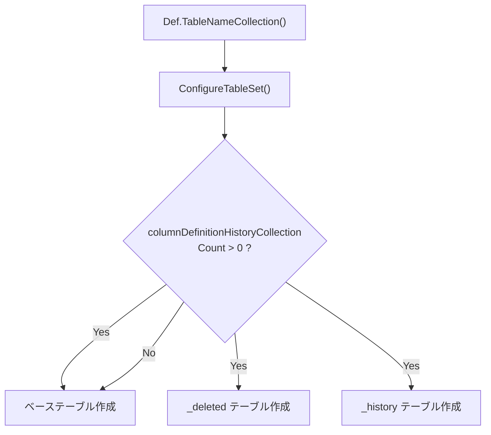

# データベーステーブル定義一覧

プリザンターが使用する全データベーステーブル名と、その分類・派生テーブルの有無を整理した調査結果。

<!-- START doctoc generated TOC please keep comment here to allow auto update -->
<!-- DON'T EDIT THIS SECTION, INSTEAD RE-RUN doctoc TO UPDATE -->

- [調査情報](#調査情報)
- [調査目的](#調査目的)
- [テーブル生成の仕組み](#テーブル生成の仕組み)
    - [CodeDefiner によるテーブル自動生成](#codedefiner-によるテーブル自動生成)
    - [テーブル名の取得元](#テーブル名の取得元)
    - [派生テーブルの生成条件](#派生テーブルの生成条件)
- [テーブル一覧](#テーブル一覧)
    - [プリザンター業務テーブル（3 テーブルセット: ベース / \_history / \_deleted）](#プリザンター業務テーブル3-テーブルセット-ベース--_history--_deleted)
    - [Quartz.NET スケジューラテーブル（ベーステーブルのみ）](#quartznet-スケジューラテーブルベーステーブルのみ)
    - [カラム定義テンプレート（テーブルとしては生成されない）](#カラム定義テンプレートテーブルとしては生成されない)
- [テーブル分類の詳細](#テーブル分類の詳細)
    - [Item テーブル（ItemId > 0）](#item-テーブルitemid--0)
    - [全テーブルの物理テーブル数](#全テーブルの物理テーブル数)
- [全テーブル名一覧（物理テーブル名）](#全テーブル名一覧物理テーブル名)
    - [業務テーブル（84 テーブル）](#業務テーブル84-テーブル)
    - [Quartz テーブル（11 テーブル、クラスタリング有効時のみ）](#quartz-テーブル11-テーブルクラスタリング有効時のみ)
- [3 テーブルセットを持たないテーブル](#3-テーブルセットを持たないテーブル)
- [RDBMS ごとの違い](#rdbms-ごとの違い)
- [関連ソースコード](#関連ソースコード)
- [結論](#結論)

<!-- END doctoc generated TOC please keep comment here to allow auto update -->

## 調査情報

| 調査日        | リポジトリ | ブランチ | タグ/バージョン    | コミット    | 備考     |
| ------------- | ---------- | -------- | ------------------ | ----------- | -------- |
| 2026年2月24日 | Pleasanter | main     | Pleasanter_1.5.1.0 | `34f162a43` | 初回調査 |

## 調査目的

プリザンターが管理する全データベーステーブルの一覧を明確にし、各テーブルの分類（ベース / `_history` / `_deleted`）と派生パターンを把握する。

---

## テーブル生成の仕組み

### CodeDefiner によるテーブル自動生成

プリザンターのテーブルは `Implem.CodeDefiner` の `TablesConfigurator` によって自動生成される。処理フローは以下の通り。



**ファイル**: `Implem.CodeDefiner/Functions/Rds/TablesConfigurator.cs`（行番号: 155-214）

```csharp
private static bool ConfigureTableSet(
    ISqlObjectFactory factory,
    string generalTableName,
    bool checkMigration)
{
    // ...
    var sourceTableName = NormalizeTableName(generalTableName);
    var deletedTableName = sourceTableName + "_deleted";
    var historyTableName = sourceTableName + "_history";
    // ...
    if (columnDefinitionHistoryCollection.Count() == 0)
    {
        return isChanged;
    }
    // _deleted, _history テーブルも作成
}
```

### テーブル名の取得元

テーブル名は `Def.TableNameCollection()` で取得される。
これは `Implem.Pleasanter/App_Data/Definitions/Definition_Column/` 配下の JSON ファイル群から、
`TableName` フィールドを重複排除して収集する。`_Base` / `_BaseItem` で始まる ModelName は除外される。

**ファイル**: `Implem.DefinitionAccessor/Def.cs`（行番号: 86-96）

```csharp
public static IEnumerable<string> TableNameCollection(
    Func<ColumnDefinition, bool> peredicate = null,
    string order = "")
{
    return ColumnDefinitionCollection
        .Where(o => !o.ModelName.StartsWith("_Base"))
        .OrderBy(o => o[Strings.CoalesceEmpty(order, "No")])
        .Select(o => o.TableName)
        .Distinct();
}
```

### 派生テーブルの生成条件

`_history` / `_deleted` テーブルが作成されるかどうかは、カラム定義 JSON の `History` フィールドで決まる。
`History > 0` のカラムが 1 つでも存在するテーブルは、
3 つのバリアント（ベース / `_deleted` / `_history`）が生成される。

---

## テーブル一覧

### プリザンター業務テーブル（3 テーブルセット: ベース / \_history / \_deleted）

以下のテーブルは全て `History > 0` のカラムを持ち、ベーステーブルに加えて `_history` と `_deleted` の派生テーブルが生成される。

| #   | ベーステーブル名  | ModelName        | \_history | \_deleted | 分類                           |
| --- | ----------------- | ---------------- | --------- | --------- | ------------------------------ |
| 1   | AutoNumberings    | AutoNumbering    | あり      | あり      | 採番管理                       |
| 2   | Binaries          | Binary           | あり      | あり      | バイナリデータ                 |
| 3   | Dashboards        | Dashboard        | あり      | あり      | ダッシュボード（Itemテーブル） |
| 4   | Demos             | Demo             | あり      | あり      | デモデータ                     |
| 5   | Depts             | Dept             | あり      | あり      | 部署                           |
| 6   | Extensions        | Extension        | あり      | あり      | 拡張機能                       |
| 7   | GroupChildren     | GroupChild       | あり      | あり      | グループ子要素                 |
| 8   | GroupMembers      | GroupMember      | あり      | あり      | グループメンバー               |
| 9   | Groups            | Group            | あり      | あり      | グループ                       |
| 10  | Issues            | Issue            | あり      | あり      | 課題（Itemテーブル）           |
| 11  | Items             | Item             | あり      | あり      | アイテム（全レコードの親）     |
| 12  | Links             | Link             | あり      | あり      | リンク                         |
| 13  | LoginKeys         | LoginKey         | あり      | あり      | ログインキー                   |
| 14  | MailAddresses     | MailAddress      | あり      | あり      | メールアドレス                 |
| 15  | Orders            | Order            | あり      | あり      | 並び順                         |
| 16  | OutgoingMails     | OutgoingMail     | あり      | あり      | 送信メール                     |
| 17  | Passkeys          | Passkey          | あり      | あり      | パスキー                       |
| 18  | Permissions       | Permission       | あり      | あり      | 権限                           |
| 19  | Registrations     | Registration     | あり      | あり      | ユーザ登録                     |
| 20  | ReminderSchedules | ReminderSchedule | あり      | あり      | リマインダースケジュール       |
| 21  | Results           | Result           | あり      | あり      | 結果（Itemテーブル）           |
| 22  | Sessions          | Session          | あり      | あり      | セッション                     |
| 23  | Sites             | Site             | あり      | あり      | サイト（Itemテーブル）         |
| 24  | Statuses          | Status           | あり      | あり      | ステータス                     |
| 25  | SysLogs           | SysLog           | あり      | あり      | システムログ                   |
| 26  | Tenants           | Tenant           | あり      | あり      | テナント                       |
| 27  | Users             | User             | あり      | あり      | ユーザ                         |
| 28  | Wikis             | Wiki             | あり      | あり      | Wiki（Itemテーブル）           |

### Quartz.NET スケジューラテーブル（ベーステーブルのみ）

以下のテーブルは Quartz.NET のクラスタリング用テーブルで、
`History` カラムが全て `0` のため `_history` / `_deleted` テーブルは生成されない。
また、`ExcludeBaseColumns` が設定されており、
`_Base` / `_BaseItem` の共通カラム（`Ver`, `CreatedTime`, `UpdatedTime` 等）も含まれない。

Quartz クラスタリングが無効（`Parameters.Quartz.Clustering.Enabled = false`）の場合、テーブル自体が作成されない。

| #   | テーブル名               | ModelName                | TablePrefix |
| --- | ------------------------ | ------------------------ | ----------- |
| 1   | QRTZ_BLOB_TRIGGERS       | QuartzBlobTrigger        | QRTZ\_      |
| 2   | QRTZ_CALENDARS           | QuartzCalendar           | QRTZ\_      |
| 3   | QRTZ_CRON_TRIGGERS       | QuartzCronTrigger        | QRTZ\_      |
| 4   | QRTZ_FIRED_TRIGGERS      | QuartzFiredTrigger       | QRTZ\_      |
| 5   | QRTZ_JOB_DETAILS         | QuartzJobDetail          | QRTZ\_      |
| 6   | QRTZ_LOCKS               | QuartzLock               | QRTZ\_      |
| 7   | QRTZ_PAUSED_TRIGGER_GRPS | QuartzPausedTriggerGroup | QRTZ\_      |
| 8   | QRTZ_SCHEDULER_STATE     | QuartzSchedulerState     | QRTZ\_      |
| 9   | QRTZ_SIMPLE_TRIGGERS     | QuartzSimpleTrigger      | QRTZ\_      |
| 10  | QRTZ_SIMPROP_TRIGGERS    | QuartzSimplePropTrigger  | QRTZ\_      |
| 11  | QRTZ_TRIGGERS            | QuartzTrigger            | QRTZ\_      |

### カラム定義テンプレート（テーブルとしては生成されない）

以下は共通カラム定義のテンプレートであり、実テーブルとしては作成されない。他テーブルのカラム定義に共通カラムとして組み込まれる。

| テンプレート名 | ModelName  | 説明                                                                                 |
| -------------- | ---------- | ------------------------------------------------------------------------------------ |
| \_Bases        | \_Base     | 全テーブル共通カラム（Ver, CreatedTime, UpdatedTime, Creator, Updator, Comments 等） |
| \_BaseItems    | \_BaseItem | Item 系テーブル追加共通カラム（SiteId, Title, Body, UpdatedTime 等）                 |

---

## テーブル分類の詳細

### Item テーブル（ItemId > 0）

`Items` テーブルを親として、以下のテーブルが Item 系テーブルとして定義されている。これらは `Items.ReferenceType` で参照先が識別され、`Items.ReferenceId` で紐付けられる。

| テーブル名 | ItemId 値 |
| ---------- | --------- |
| Sites      | 1         |
| Results    | 1         |
| Dashboards | 20        |
| Issues     | 20        |
| Wikis      | 40        |

### 全テーブルの物理テーブル数

| 分類            | ベーステーブル数 | \_history | \_deleted | 小計 |
| --------------- | ---------------- | --------- | --------- | ---- |
| 業務テーブル    | 28               | 28        | 28        | 84   |
| Quartz テーブル | 11               | 0         | 0         | 11   |
| 合計            | 39               | 28        | 28        | 95   |

Quartz クラスタリングが有効な場合、最大 **95 テーブル** が作成される。無効の場合は **84 テーブル**。

---

## 全テーブル名一覧（物理テーブル名）

### 業務テーブル（84 テーブル）

| #   | テーブル名                |
| --- | ------------------------- |
| 1   | AutoNumberings            |
| 2   | AutoNumberings_deleted    |
| 3   | AutoNumberings_history    |
| 4   | Binaries                  |
| 5   | Binaries_deleted          |
| 6   | Binaries_history          |
| 7   | Dashboards                |
| 8   | Dashboards_deleted        |
| 9   | Dashboards_history        |
| 10  | Demos                     |
| 11  | Demos_deleted             |
| 12  | Demos_history             |
| 13  | Depts                     |
| 14  | Depts_deleted             |
| 15  | Depts_history             |
| 16  | Extensions                |
| 17  | Extensions_deleted        |
| 18  | Extensions_history        |
| 19  | GroupChildren             |
| 20  | GroupChildren_deleted     |
| 21  | GroupChildren_history     |
| 22  | GroupMembers              |
| 23  | GroupMembers_deleted      |
| 24  | GroupMembers_history      |
| 25  | Groups                    |
| 26  | Groups_deleted            |
| 27  | Groups_history            |
| 28  | Issues                    |
| 29  | Issues_deleted            |
| 30  | Issues_history            |
| 31  | Items                     |
| 32  | Items_deleted             |
| 33  | Items_history             |
| 34  | Links                     |
| 35  | Links_deleted             |
| 36  | Links_history             |
| 37  | LoginKeys                 |
| 38  | LoginKeys_deleted         |
| 39  | LoginKeys_history         |
| 40  | MailAddresses             |
| 41  | MailAddresses_deleted     |
| 42  | MailAddresses_history     |
| 43  | Orders                    |
| 44  | Orders_deleted            |
| 45  | Orders_history            |
| 46  | OutgoingMails             |
| 47  | OutgoingMails_deleted     |
| 48  | OutgoingMails_history     |
| 49  | Passkeys                  |
| 50  | Passkeys_deleted          |
| 51  | Passkeys_history          |
| 52  | Permissions               |
| 53  | Permissions_deleted       |
| 54  | Permissions_history       |
| 55  | Registrations             |
| 56  | Registrations_deleted     |
| 57  | Registrations_history     |
| 58  | ReminderSchedules         |
| 59  | ReminderSchedules_deleted |
| 60  | ReminderSchedules_history |
| 61  | Results                   |
| 62  | Results_deleted           |
| 63  | Results_history           |
| 64  | Sessions                  |
| 65  | Sessions_deleted          |
| 66  | Sessions_history          |
| 67  | Sites                     |
| 68  | Sites_deleted             |
| 69  | Sites_history             |
| 70  | Statuses                  |
| 71  | Statuses_deleted          |
| 72  | Statuses_history          |
| 73  | SysLogs                   |
| 74  | SysLogs_deleted           |
| 75  | SysLogs_history           |
| 76  | Tenants                   |
| 77  | Tenants_deleted           |
| 78  | Tenants_history           |
| 79  | Users                     |
| 80  | Users_deleted             |
| 81  | Users_history             |
| 82  | Wikis                     |
| 83  | Wikis_deleted             |
| 84  | Wikis_history             |

### Quartz テーブル（11 テーブル、クラスタリング有効時のみ）

| #   | テーブル名               |
| --- | ------------------------ |
| 1   | QRTZ_BLOB_TRIGGERS       |
| 2   | QRTZ_CALENDARS           |
| 3   | QRTZ_CRON_TRIGGERS       |
| 4   | QRTZ_FIRED_TRIGGERS      |
| 5   | QRTZ_JOB_DETAILS         |
| 6   | QRTZ_LOCKS               |
| 7   | QRTZ_PAUSED_TRIGGER_GRPS |
| 8   | QRTZ_SCHEDULER_STATE     |
| 9   | QRTZ_SIMPLE_TRIGGERS     |
| 10  | QRTZ_SIMPROP_TRIGGERS    |
| 11  | QRTZ_TRIGGERS            |

---

## 3 テーブルセットを持たないテーブル

以下のテーブルは `_history` / `_deleted` の派生テーブルを持たない。

| テーブル名               | 理由                                                          |
| ------------------------ | ------------------------------------------------------------- |
| QRTZ_BLOB_TRIGGERS       | Quartz.NET テーブル（History カラムなし、ExcludeBaseColumns） |
| QRTZ_CALENDARS           | 同上                                                          |
| QRTZ_CRON_TRIGGERS       | 同上                                                          |
| QRTZ_FIRED_TRIGGERS      | 同上                                                          |
| QRTZ_JOB_DETAILS         | 同上                                                          |
| QRTZ_LOCKS               | 同上                                                          |
| QRTZ_PAUSED_TRIGGER_GRPS | 同上                                                          |
| QRTZ_SCHEDULER_STATE     | 同上                                                          |
| QRTZ_SIMPLE_TRIGGERS     | 同上                                                          |
| QRTZ_SIMPROP_TRIGGERS    | 同上                                                          |
| QRTZ_TRIGGERS            | 同上                                                          |

Quartz テーブルは外部ライブラリ（Quartz.NET）が管理するスケジューラ用テーブルであり、プリザンター独自の履歴管理（`Ver`, `CreatedTime`, `UpdatedTime` 等の `_Base` カラム）の対象外となっている。

---

## RDBMS ごとの違い

| 項目                 | SQL Server                      | PostgreSQL                      | MySQL                      |
| -------------------- | ------------------------------- | ------------------------------- | -------------------------- |
| テーブル名の大小文字 | そのまま                        | Quartz テーブルのみ小文字化     | そのまま                   |
| テーブル作成 SQL     | `CreateTable.sql`（SQLServer）  | `CreateTable.sql`（PostgreSQL） | `CreateTable.sql`（MySQL） |
| 全文検索インデックス | `CreateFullText.sql` で別途作成 | 同上                            | 同上                       |

PostgreSQL の場合、Quartz テーブル名は `NormalizeTableName()` によって小文字に変換される（例: `qrtz_blob_triggers`）。

---

## 関連ソースコード

| ファイル                                                                | 説明                                                    |
| ----------------------------------------------------------------------- | ------------------------------------------------------- |
| `Implem.CodeDefiner/Functions/Rds/TablesConfigurator.cs`                | テーブル作成の統括（3 テーブルセット生成ロジック）      |
| `Implem.CodeDefiner/Functions/Rds/Parts/Tables.cs`                      | テーブル存在チェック・作成・マイグレーション            |
| `Implem.DefinitionAccessor/Def.cs`                                      | `TableNameCollection()` / `ItemTableNameCollection()`   |
| `Implem.Pleasanter/App_Data/Definitions/Definition_Column/*.json`       | カラム定義（TableName, History, ExcludeBaseColumns 等） |
| `Implem.Pleasanter/App_Data/Definitions/Sqls/SQLServer/CreateTable.sql` | SQL Server 用テーブル作成 SQL テンプレート              |
| `Implem.Pleasanter/App_Data/Parameters/Quartz.json`                     | Quartz クラスタリング設定（TablePrefix: `QRTZ_`）       |

---

## 結論

| 項目                                               | 値                                             |
| -------------------------------------------------- | ---------------------------------------------- |
| ベーステーブル総数                                 | 39（業務 28 + Quartz 11）                      |
| 物理テーブル最大数                                 | 95（Quartz クラスタリング有効時）              |
| 物理テーブル最小数                                 | 84（Quartz クラスタリング無効時）              |
| 3 テーブルセット（ベース / \_history / \_deleted） | 28 テーブル（全業務テーブル）                  |
| ベーステーブルのみ                                 | 11 テーブル（Quartz テーブルのみ）             |
| Item 系テーブル                                    | 5（Sites, Results, Issues, Dashboards, Wikis） |
| テンプレート定義（実テーブルなし）                 | 2（\_Bases, \_BaseItems）                      |

全ての業務テーブル（28 種）は例外なく `_history` / `_deleted` の派生テーブルを持つ。派生テーブルを持たないのは Quartz.NET スケジューラ用の 11 テーブルのみである。
