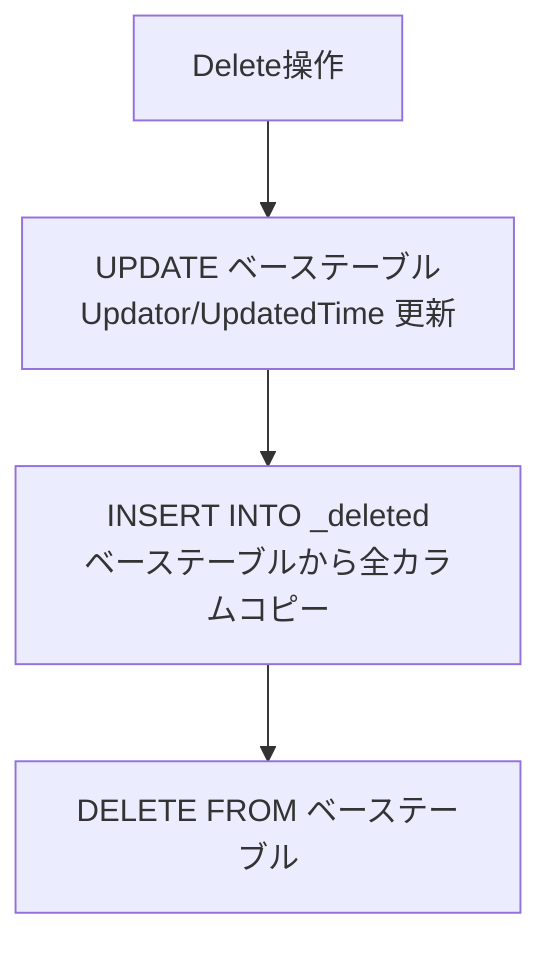
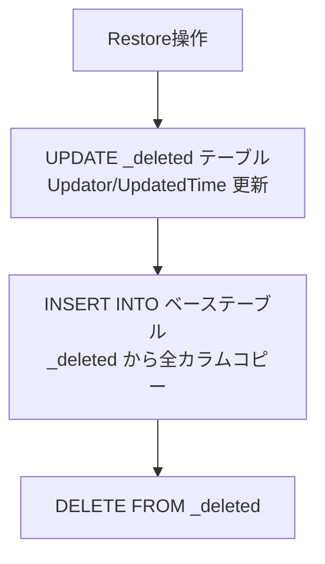
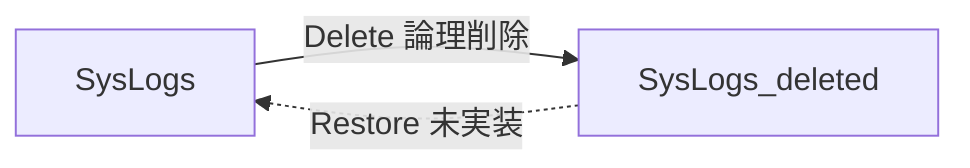
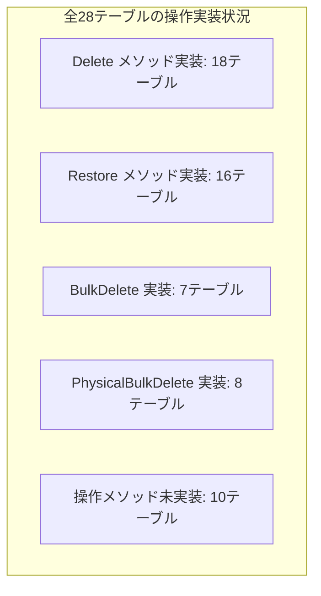

# テーブルバリアント使用パターンの逸脱分析

プリザンターにおけるベース / `_history` / `_deleted` テーブルバリアントの SQLクエリ上での使用状況と、標準パターンからの逸脱を調査した結果。

<!-- START doctoc generated TOC please keep comment here to allow auto update -->
<!-- DON'T EDIT THIS SECTION, INSTEAD RE-RUN doctoc TO UPDATE -->

- [調査情報](#調査情報)
- [調査目的](#調査目的)
- [標準パターンの定義](#標準パターンの定義)
    - [Sqls.TableTypes enum](#sqlstabletypes-enum)
    - [SqlStatement のテーブルブラケット構造](#sqlstatement-のテーブルブラケット構造)
    - [テーブルブラケットの設定方法](#テーブルブラケットの設定方法)
    - [Delete（論理削除）の標準パターン](#delete論理削除の標準パターン)
    - [Restore（復元）の標準パターン](#restore復元の標準パターン)
- [Rds.cs における全テーブルの Delete/Restore 定義](#rdscs-における全テーブルの-deleterestore-定義)
- [Model レベルでの操作実装状況](#model-レベルでの操作実装状況)
    - [操作別の実装マトリクス](#操作別の実装マトリクス)
- [逸脱パターンの分析](#逸脱パターンの分析)
    - [逸脱1: SysLogs の Delete あり、Restore なし](#逸脱1-syslogs-の-delete-ありrestore-なし)
    - [逸脱2: 補助テーブルの独立 Delete/Restore 未実装](#逸脱2-補助テーブルの独立-deleterestore-未実装)
    - [逸脱3: ハードコードされたテーブル名参照](#逸脱3-ハードコードされたテーブル名参照)
    - [逸脱4: ItemUtilities.cs の Items JOIN パターン](#逸脱4-itemutilitiescs-の-items-join-パターン)
    - [逸脱5: CanRead / HasPermission SQL での基底テーブルのみの参照](#逸脱5-canread--haspermission-sql-での基底テーブルのみの参照)
    - [逸脱6: Restore 時の関連テーブル復元の非対称性](#逸脱6-restore-時の関連テーブル復元の非対称性)
- [SQL ファイルにおけるテーブル名参照状況](#sql-ファイルにおけるテーブル名参照状況)
- [Rds ディレクトリの状況](#rds-ディレクトリの状況)
- [テーブルタイプの使用統計](#テーブルタイプの使用統計)
    - [Model レベルでの TableTypes 使用状況](#model-レベルでの-tabletypes-使用状況)
    - [Delete あり / Restore なしのテーブル](#delete-あり--restore-なしのテーブル)
    - [操作メソッドが全く未実装のテーブル](#操作メソッドが全く未実装のテーブル)
- [結論](#結論)
- [関連ソースコード](#関連ソースコード)
- [関連ドキュメント](#関連ドキュメント)

<!-- END doctoc generated TOC please keep comment here to allow auto update -->

## 調査情報

| 調査日        | リポジトリ | ブランチ | タグ/バージョン    | コミット    | 備考     |
| ------------- | ---------- | -------- | ------------------ | ----------- | -------- |
| 2026年2月24日 | Pleasanter | main     | Pleasanter_1.5.1.0 | `34f162a43` | 初回調査 |

## 調査目的

各業務テーブルが持つ3つのバリアント（ベース / `_history` / `_deleted`）について、SQLクエリ生成におけるアクセスパターンの一貫性を検証する。標準パターンからの逸脱（ハードコード、欠落、非対称な処理）を特定し、潜在的な問題を洗い出す。

---

## 標準パターンの定義

### Sqls.TableTypes enum

テーブルバリアントの選択は `Sqls.TableTypes` enum によって制御される。

**ファイル**: `Implem.Libraries/DataSources/SqlServer/Sqls.cs`（行番号: 14-23）

```csharp
public enum TableTypes
{
    Normal,            // ベーステーブル
    History,           // _history テーブル
    HistoryWithoutFlag,// _history テーブル（IsHistory フラグなし）
    NormalAndDeleted,  // ベース + _deleted の UNION
    NormalAndHistory,  // ベース + _history の UNION
    Deleted,           // _deleted テーブル
    All                // ベース + _deleted + _history の UNION
}
```

### SqlStatement のテーブルブラケット構造

各 SQL 文は `SqlStatement` 基底クラスを通じて3つのテーブルブラケットを保持する。

**ファイル**: `Implem.Libraries/DataSources/SqlServer/SqlStatement.cs`（行番号: 13-15）

```csharp
public string TableBracket = string.Empty;        // "\"Items\""
public string HistoryTableBracket = string.Empty;  // "\"Items_history\""
public string DeletedTableBracket = string.Empty;  // "\"Items_deleted\""
```

### テーブルブラケットの設定方法

`Rds.cs` での設定は2つのパターンがある。

1. **動的設定**（汎用メソッド）: テーブル名を引数で受け取り `+ "_history"` / `+ "_deleted"` を付与
2. **静的設定**（個別メソッド）: 各テーブル専用のメソッドでハードコード

**ファイル**: `Implem.Pleasanter/Libraries/DataSources/Rds.cs`（行番号: 780-782）

```csharp
// 動的設定の例
TableBracket = "\"" + tableName + "\"",
HistoryTableBracket = "\"" + tableName + "_history\"",
DeletedTableBracket = "\"" + tableName + "_deleted\"",
```

### Delete（論理削除）の標準パターン

論理削除は `Rds.cs` の `Delete{Table}Statement` メソッドにより、ハードコードされた SQL 文字列で実装されている。



### Restore（復元）の標準パターン

復元は `Rds.cs` の `Restore{Table}Statement` メソッドにより実装される。



---

## Rds.cs における全テーブルの Delete/Restore 定義

全28テーブルに対して、`Delete{Table}Statement` と `Restore{Table}Statement` がペアで定義されている。

| テーブル          | DeleteStatement | RestoreStatement | 備考 |
| ----------------- | :-------------: | :--------------: | ---- |
| AutoNumberings    |       有        |        有        |      |
| Binaries          |       有        |        有        |      |
| Demos             |       有        |        有        |      |
| Depts             |       有        |        有        |      |
| Extensions        |       有        |        有        |      |
| GroupChildren     |       有        |        有        |      |
| GroupMembers      |       有        |        有        |      |
| Groups            |       有        |        有        |      |
| Items             |       有        |        有        |      |
| Links             |       有        |        有        |      |
| LoginKeys         |       有        |        有        |      |
| MailAddresses     |       有        |        有        |      |
| Orders            |       有        |        有        |      |
| OutgoingMails     |       有        |        有        |      |
| Passkeys          |       有        |        有        |      |
| Registrations     |       有        |        有        |      |
| ReminderSchedules |       有        |        有        |      |
| Sessions          |       有        |        有        |      |
| Sites             |       有        |        有        |      |
| Statuses          |       有        |        有        |      |
| SysLogs           |       有        |        有        |      |
| Tenants           |       有        |        有        |      |
| Users             |       有        |        有        |      |
| Permissions       |       有        |        有        |      |
| Dashboards        |       有        |        有        |      |
| Issues            |       有        |        有        |      |
| Results           |       有        |        有        |      |
| Wikis             |       有        |        有        |      |

---

## Model レベルでの操作実装状況

### 操作別の実装マトリクス

各 Model の `*Model.cs` / `*Utilities.cs` での Delete / BulkDelete / PhysicalBulkDelete / Restore メソッドの実装有無。

| モデル            | Delete | BulkDelete | PhysicalBulkDelete | Restore | TableTypes.Deleted | TableTypes.History |
| ----------------- | :----: | :--------: | :----------------: | :-----: | :----------------: | :----------------: |
| AutoNumberings    |   --   |     --     |         --         |   --    |         --         |         --         |
| Binaries          |   有   |     --     |         --         |   有    |         --         |         有         |
| Dashboards        |   有   |     --     |         有         |   有    |         有         |         有         |
| Demos             |   有   |     --     |         --         |   有    |         --         |         有         |
| Depts             |   有   |     有     |         有         |   有    |         有         |         有         |
| Extensions        |   有   |     --     |         --         |   有    |         --         |         有         |
| GroupChildren     |   --   |     --     |         --         |   --    |         --         |         --         |
| GroupMembers      |   --   |     --     |         --         |   --    |         --         |         --         |
| Groups            |   有   |     有     |         有         |   有    |         有         |         有         |
| Issues            |   有   |     有     |         有         |   有    |         有         |         有         |
| Items             |   --   |     有     |         有         |   有    |         有         |         有         |
| Links             |   --   |     --     |         --         |   --    |         --         |         --         |
| LoginKeys         |   --   |     --     |         --         |   --    |         --         |         --         |
| MailAddresses     |   有   |     --     |         --         |   有    |         --         |         有         |
| Orders            |   --   |     --     |         --         |   --    |         --         |         --         |
| OutgoingMails     |   有   |     --     |         --         |   有    |         --         |         有         |
| Passkeys          |   有   |     --     |         --         |   有    |         --         |         有         |
| Permissions       |   --   |     --     |         --         |   --    |         --         |         --         |
| Registrations     |   有   |     有     |         --         |   有    |         --         |         有         |
| ReminderSchedules |   --   |     --     |         --         |   --    |         --         |         --         |
| Results           |   有   |     有     |         有         |   有    |         有         |         有         |
| Sessions          |   --   |     --     |         --         |   --    |         --         |         --         |
| Sites             |   有   |     --     |         有         |   有    |         有         |         有         |
| Statuses          |   --   |     --     |         --         |   --    |         --         |         --         |
| SysLogs           |   有   |     --     |         --         |   --    |         --         |         有         |
| Tenants           |   有   |     --     |         --         |   有    |         --         |         有         |
| Users             |   有   |     有     |         有         |   有    |         有         |         有         |
| Wikis             |   有   |     --     |         --         |   有    |         有         |         有         |

---

## 逸脱パターンの分析

### 逸脱1: SysLogs の Delete あり、Restore なし

`SysLogModel.cs` には `Delete` メソッドが実装されており、
`Rds.DeleteSysLogs()` を呼び出す。
これにより SysLogs レコードは `SysLogs_deleted` に移動される。
しかし、`SysLogModel` にも `SysLogUtilities` にも
`Restore` メソッドが実装されていない。



**影響**: SysLogs は論理削除後、アプリケーションレベルでは復元不可能。
DB の `SysLogs_deleted` テーブルにデータが蓄積され続ける。
意図的な設計（ログは復元不要）と考えられるが、
PhysicalBulkDelete も未実装のため、
`SysLogs_deleted` の容量管理手段がモデルレベルで存在しない。

### 逸脱2: 補助テーブルの独立 Delete/Restore 未実装

以下のテーブルは、親テーブルの操作に伴って間接的に削除・復元されるため、自身の Model に Delete/Restore メソッドが実装されていない。

| テーブル          | 親テーブルの操作例                | 備考                             |
| ----------------- | --------------------------------- | -------------------------------- |
| AutoNumberings    | レコード更新時に自動採番          | 独立した削除需要がない           |
| GroupChildren     | Groups の削除時に一括処理         | Groups.Restore で間接復元される  |
| GroupMembers      | Groups/Users の削除時に一括処理   | 親の Restore に含まれる          |
| Links             | Issues/Results の削除時に一括処理 | 親エンティティに付随             |
| LoginKeys         | Users の削除時に一括処理          | セキュリティ上、復元不要の可能性 |
| Orders            | 内部的な並び順管理                | UI 操作で直接削除されない        |
| Permissions       | Sites/Items の削除時に一括処理    | 親の Restore に含まれる          |
| ReminderSchedules | 内部スケジューリング              | リマインダ再設定で復元可能       |
| Sessions          | セッション管理用                  | 一時データのため復元不要         |
| Statuses          | システム状態管理                  | 直接削除対象でない               |

これは「逸脱」ではなく「設計上の意図」と考えられる。ただし、`Rds.cs` レベルでは全テーブルに `Delete`/`Restore` Statement が生成されている点に注意。

### 逸脱3: ハードコードされたテーブル名参照

標準パターンでは `TableTypes` enum を通じてテーブルバリアントが選択されるが、以下の箇所ではテーブル名が直接ハードコードされている。

#### 3a: ItemsInitializer.cs での直接参照

**ファイル**: `Implem.Pleasanter/Libraries/Initializers/ItemsInitializer.cs`

初期化処理で `_deleted` テーブルをハードコードで直接参照し、孤立レコードの削除・再構築を行う。

```csharp
// 直接参照の例（行番号: 24-25）
"\"Items_deleted\"",
"\"Items_deleted\".\"ReferenceId\"",
```

参照されるハードコードテーブル:

- `Items_deleted`
- `Sites_deleted`
- `Dashboards_deleted`
- `Issues_deleted`
- `Results_deleted`
- `Wikis_deleted`

これらは `Sqls.TableTypes.Deleted` を使用した
`Rds.SelectXxx(tableType: Sqls.TableTypes.Deleted, ...)` 呼び出しと並行して、
JOIN 条件で直接テーブル名を参照している。
初期化処理の特殊性（Items テーブルの欠落を補完する処理）から、
JOIN のためにハードコードが必要になっている。

#### 3b: Indexes.cs（全文検索）での直接参照

**ファイル**: `Implem.Pleasanter/Libraries/Search/Indexes.cs`

全文検索関連で以下のテーブルが直接参照される。

```csharp
// ItemTableName メソッド（行番号: 662-663）
case Sqls.TableTypes.Deleted:
    return "Items_deleted";

// FullTextWhere メソッド（行番号: 950, 959-960）
suffix = "_deleted";
// ...
item = $"...\"Items{suffix}\"...";
binary = $"...\"Binaries{suffix}\"...";
```

`FullTextWhere` は `Sqls.TableTypes.Deleted` のみを考慮しており、
`Sqls.TableTypes.History` の場合の全文検索は
`suffix = ""` のまま処理される（ベーステーブルに対して検索が行われる）。
`_history` テーブルに対する全文検索は明示的にサポートされていない。

#### 3c: モデルの Restore 処理での直接テーブル名参照

各モデルの `Restore` メソッドでは、WHERE 条件で `_Deleted` サフィックス付きのテーブル名をハードコードで使用する。

```csharp
// IssueUtilities.cs（行番号: 5920-5942）
.SiteId(value: ss.SiteId, tableName: "Issues_Deleted")
.IssueId_In(value: selected, tableName: "Issues_Deleted", ...)
```

同様のパターンが以下のモデルで確認される:

- `WikiUtilities.cs`: `Wikis_Deleted`, `Wikis_History`
- `ResultUtilities.cs`: `Results_Deleted`, `Results_History`
- `IssueUtilities.cs`: `Issues_Deleted`, `Issues_History`
- `UserUtilities.cs`: `Users_Deleted`
- `SiteUtilities.cs`: `Sites_Deleted`, `Sites_History`
- `GroupUtilities.cs`: `Groups_Deleted`
- `DeptUtilities.cs`: `Depts_Deleted`

\_History と \_Deleted の大文字小文字表記の違い
（`_Deleted` vs `_deleted`）に注意が必要。
WHERE 条件の `tableName` パラメータは
SQL クエリのテーブルエイリアスとして使用されるため、
FROM 句で指定される小文字の `_deleted` とは異なるコンテキスト。

#### 3d: DeleteByUnusedReferenceId.sql での直接参照

**ファイル**: `Implem.Pleasanter/App_Data/Definitions/Sqls/*/DeleteByUnusedReferenceId.sql`

全3 RDBMS（SQLServer, PostgreSQL, MySQL）の SQL ファイルで `Items_deleted` を直接参照。

```sql
-- PostgreSQL 版
delete from "#TableName#"
where "#ColumnName#" not in (
    select "ReferenceId" from "Items"
    union all
    select "ReferenceId" from "Items_deleted"
)
```

この SQL は、Items テーブルと Items_deleted テーブルの
どちらにも存在しない ReferenceId を持つレコードを物理削除する。
`#TableName#` と `#ColumnName#` はプレースホルダだが、
`Items` と `Items_deleted` はハードコード。

### 逸脱4: ItemUtilities.cs の Items JOIN パターン

**ファイル**: `Implem.Pleasanter/Models/Items/ItemUtilities.cs`（行番号: 50-69）

Items テーブルへの JOIN で、`TableTypes` に応じてテーブル名サフィックスを動的に構築する。

```csharp
switch (tableName)
{
    case "Sites":
    case "Dashboards":
    case "Issues":
    case "Results":
    case "Wikis":
        var tableTypeName = string.Empty;
        switch (tableType)
        {
            case Sqls.TableTypes.History:
                tableTypeName = "_history";
                break;
            case Sqls.TableTypes.Deleted:
                tableTypeName = "_deleted";
                break;
        }
        return join.Add(
            tableName: $"\"Items{tableTypeName}\"",
            joinType: SqlJoin.JoinTypes.Inner,
            joinExpression: $"...");
```

対象テーブルが5つのみ（Sites, Dashboards, Issues, Results, Wikis）に
ハードコードされている。
これらは「Item テーブル」（`Items` テーブルに ReferenceId を持つテーブル）であり、
それ以外のテーブルは Items との JOIN が不要なため。

### 逸脱5: CanRead / HasPermission SQL での基底テーブルのみの参照

**ファイル**: `Implem.Pleasanter/App_Data/Definitions/Sqls/*/CanRead.sql`, `HasPermission.sql`

権限チェック SQL では、`Permissions`, `Depts`, `Groups`,
`GroupMembers`, `Users` テーブルを直接参照するが、
いずれもベーステーブルのみ（`_history` / `_deleted` なし）。

これは正しい動作である。権限チェックは現在有効なデータに対してのみ行われるべきであり、削除済みや履歴データを権限判定に含める必要はない。

### 逸脱6: Restore 時の関連テーブル復元の非対称性

主要モデルの `Restore` メソッドでは、関連テーブルの復元範囲がモデルによって異なる。

| 親モデル   | 自身の Restore | 関連テーブルの Restore                             |
| ---------- | :------------: | -------------------------------------------------- |
| Issues     |       有       | Items, Binaries（Images のみ）                     |
| Results    |       有       | Items, Binaries（Images のみ）                     |
| Wikis      |       有       | Items, Binaries（Images のみ）                     |
| Users      |       有       | GroupMembers, Permissions, Binaries, MailAddresses |
| Sites      |       有       | Items                                              |
| Groups     |       有       | GroupChildren, GroupMembers, Permissions           |
| Depts      |       有       | GroupMembers, Permissions                          |
| Dashboards |       有       | Items, Binaries（Images のみ）                     |

注目点:

- Issues/Results/Wikis/Dashboards の Restore では `Binaries` は
  `BinaryType("Images")` のみ復元される。
  `Attachments` タイプは別途 `RestoreAttachments` メソッドで処理される
  （Issues/Results のみ確認）。
- `Links` テーブルは Restore 対象に含まれていない（Issues/Results の場合）。
- `Permissions` は Sites の Restore には含まれていない。
- `Orders` はどの Restore にも含まれていない。

---

## SQL ファイルにおけるテーブル名参照状況

`Implem.Pleasanter/App_Data/Definitions/Sqls/` 配下の SQL ファイルにおけるハードコードテーブル名の使用状況。

| SQL ファイル                          | 参照テーブル                                           | `_history` / `_deleted` 参照 |
| ------------------------------------- | ------------------------------------------------------ | :--------------------------: |
| DeleteByUnusedReferenceId.sql         | Items, Items_deleted                                   |          `_deleted`          |
| CanRead.sql                           | Permissions, Depts, Groups, GroupMembers, Items, Sites |             なし             |
| CanReadSites.sql                      | Permissions, Depts, Groups, GroupMembers               |             なし             |
| HasPermission.sql                     | Permissions, Depts, Groups, GroupMembers               |             なし             |
| SelectSelectableMembers.sql           | Depts, Users, Groups                                   |             なし             |
| SelectSelectableGroupChildren.sql     | Groups                                                 |             なし             |
| MoveTarget.sql                        | Sites, Permissions                                     |             なし             |
| StartTimeColumn.sql                   | Issues                                                 |             なし             |
| CompletionTimeColumn.sql              | Issues                                                 |             なし             |
| GetGroupChildrenIds.sql               | GroupChildren                                          |             なし             |
| GetGroupParentIds.sql                 | GroupChildren                                          |             なし             |
| LdapUpdateGroupMembersAndChildren.sql | Groups, GroupMembers, GroupChildren                    |             なし             |
| UpsertGroupChild.sql                  | GroupChildren                                          |             なし             |
| UpsertGroupMember.sql                 | GroupMembers                                           |             なし             |
| RefreshAllChildMembers.sql            | GroupMembers, GroupChildren                            |             なし             |

`_deleted` を直接参照している SQL ファイルは `DeleteByUnusedReferenceId.sql` のみ。`_history` を直接参照している SQL ファイルは存在しない。

---

## Rds ディレクトリの状況

`Implem.Pleasanter/Rds/` 配下の各 RDBMS 実装
（`Implem.SqlServer`, `Implem.PostgreSql`, `Implem.MySql`）には、
`_history` / `_deleted` を直接参照するコードは存在しない。
テーブルバリアントの選択は全て上位層
（`Implem.Libraries` の SQL ビルダー、`Implem.Pleasanter` の `Rds.cs`）で処理される。

---

## テーブルタイプの使用統計

### Model レベルでの TableTypes 使用状況



### Delete あり / Restore なしのテーブル

| テーブル | Delete | Restore | 考察                         |
| -------- | :----: | :-----: | ---------------------------- |
| SysLogs  |   有   |   --    | ログデータの特性上、意図的か |

### 操作メソッドが全く未実装のテーブル

| テーブル          | 理由                                                |
| ----------------- | --------------------------------------------------- |
| AutoNumberings    | 自動採番管理テーブル。親レコード操作に付随          |
| GroupChildren     | グループ構造の中間テーブル。Groups に付随           |
| GroupMembers      | グループメンバーの中間テーブル。Groups/Users に付随 |
| Links             | レコード間リンクの中間テーブル。親レコードに付随    |
| LoginKeys         | ログインキー管理。Users に付随                      |
| Orders            | 表示順管理。直接操作対象でない                      |
| Permissions       | 権限設定。Sites/Items に付随                        |
| ReminderSchedules | リマインダスケジュール。内部管理用                  |
| Sessions          | セッション一時データ。自動管理                      |
| Statuses          | システム状態管理。直接操作対象でない                |

---

## 結論

| 観点                       | 結果                                                                                                                       |
| -------------------------- | -------------------------------------------------------------------------------------------------------------------------- |
| `Rds.cs` レベルの一貫性    | 全28テーブルに Delete/Restore Statement がペアで定義されており、インフラ層は一貫している                                   |
| Model レベルの実装バランス | 主要ビジネステーブル（Issues, Results, Wikis, Sites, Dashboards, Users, Groups, Depts）は Delete/Restore を完備している    |
| SysLogs の非対称           | Delete のみ実装、Restore/PhysicalBulkDelete 未実装。`SysLogs_deleted` の容量管理が Model レベルで不可。意図的設計の可能性  |
| 補助テーブルの設計         | 10のテーブルは独立した Delete/Restore を持たないが、親テーブルの操作に含まれるため、設計上の意図と考えられる               |
| ハードコード SQL の存在    | 初期化処理（ItemsInitializer）、全文検索（Indexes）、SQL ファイル（DeleteByUnusedReferenceId）で直接テーブル名が使用される |
| 全文検索と `_history`      | `FullTextWhere` が `_deleted` のみ対応し `_history` 未対応。History テーブルの全文検索は暗黙的にベーステーブル経由となる   |
| Restore 時の関連テーブル   | Issues/Results/Wikis の復元で Links は復元対象外。復元後にリンク情報が失われる可能性がある                                 |
| SQL ファイルの安全性       | `_deleted` 直接参照は `DeleteByUnusedReferenceId.sql` の1箇所のみ。`_history` 直接参照なし                                 |

---

## 関連ソースコード

| ファイル                                                                      | 概要                                       |
| ----------------------------------------------------------------------------- | ------------------------------------------ |
| `Implem.Libraries/DataSources/SqlServer/Sqls.cs`                              | TableTypes enum 定義                       |
| `Implem.Libraries/DataSources/SqlServer/SqlStatement.cs`                      | TableBracket / HistoryTableBracket 定義    |
| `Implem.Libraries/DataSources/SqlServer/SqlSelect.cs`                         | SELECT 文の TableTypes 分岐                |
| `Implem.Libraries/DataSources/SqlServer/SqlPhysicalDelete.cs`                 | PhysicalDelete の TableTypes 分岐          |
| `Implem.Libraries/DataSources/SqlServer/SqlInsert.cs`                         | INSERT の TableTypes 分岐                  |
| `Implem.Libraries/DataSources/SqlServer/SqlRestore.cs`                        | Restore SQL 生成                           |
| `Implem.Pleasanter/Libraries/DataSources/Rds.cs`                              | 各テーブル用 Delete/Restore Statement      |
| `Implem.Pleasanter/Libraries/Initializers/ItemsInitializer.cs`                | 初期化時の \_deleted 直接参照              |
| `Implem.Pleasanter/Libraries/Search/Indexes.cs`                               | 全文検索の \_deleted 直接参照              |
| `Implem.Pleasanter/App_Data/Definitions/Sqls/*/DeleteByUnusedReferenceId.sql` | Items_deleted 直接参照                     |
| `Implem.CodeDefiner/Functions/Rds/TablesConfigurator.cs`                      | \_history / \_deleted テーブル生成ロジック |

---

## 関連ドキュメント

| ドキュメント                                                                | 説明                                             |
| --------------------------------------------------------------------------- | ------------------------------------------------ |
| [データベーステーブル定義一覧](015-データベーステーブル定義一覧.md)         | 全 DB テーブル名の一覧・分類・派生テーブルの有無 |
| [CodeDefiner データベース作成・更新ロジック](001-CodeDefiner-DB作成更新.md) | CodeDefiner の DB 作成・更新と RDBMS 差違        |
