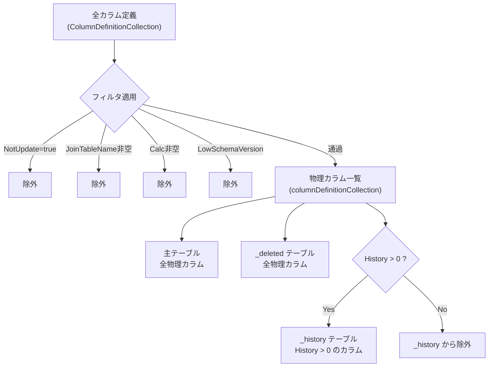

# 派生テーブルカラム差分パターン

派生テーブル（`_history` / `_deleted`）のカラム構成を派生元テーブル（主テーブル）と比較し、差分の有無とそのパターンを整理した調査結果。

<!-- START doctoc generated TOC please keep comment here to allow auto update -->
<!-- DON'T EDIT THIS SECTION, INSTEAD RE-RUN doctoc TO UPDATE -->

- [調査情報](#調査情報)
- [調査目的](#調査目的)
- [結論（要約）](#結論要約)
- [カラム選択ロジック](#カラム選択ロジック)
    - [派生テーブルのカラム決定フロー](#派生テーブルのカラム決定フロー)
    - [カラム選択の概念図](#カラム選択の概念図)
    - [各バリアントのカラム選択ルール](#各バリアントのカラム選択ルール)
- [フィルタで除外されるカラム](#フィルタで除外されるカラム)
    - [除外条件一覧](#除外条件一覧)
    - [テーブル別の除外カラム一覧](#テーブル別の除外カラム一覧)
- [物理カラム数の比較](#物理カラム数の比較)
    - [全テーブル比較結果](#全テーブル比較結果)
- [差分が生じない理由](#差分が生じない理由)
    - [History 値の設定状況](#history-値の設定状況)
    - [`History` 値の設計意図](#history-値の設計意図)
- [基底カラムの展開](#基底カラムの展開)
    - [`_Bases`（全テーブル共通カラム）](#_bases全テーブル共通カラム)
    - [`_BaseItems`（Item 系テーブル追加カラム）](#_baseitemsitem-系テーブル追加カラム)
- [差分が生じうるシナリオ（将来的な注意点）](#差分が生じうるシナリオ将来的な注意点)
- [関連ソースコード](#関連ソースコード)
- [関連ドキュメント](#関連ドキュメント)

<!-- END doctoc generated TOC please keep comment here to allow auto update -->

## 調査情報

| 調査日        | リポジトリ | ブランチ | タグ/バージョン    | コミット    | 備考     |
| ------------- | ---------- | -------- | ------------------ | ----------- | -------- |
| 2026年2月24日 | Pleasanter | main     | Pleasanter_1.5.1.0 | `34f162a43` | 初回調査 |

## 調査目的

プリザンターの各テーブルが持つ 3 バリアント（主テーブル / `_deleted` / `_history`）について、カラム構成の差分パターンを明らかにする。カスタマイズや拡張開発時に、派生テーブルのカラム構成を正しく認識するための基礎資料とする。

---

## 結論（要約）

**現行バージョン（v1.5.1.0）では、全 28 業務テーブルで主テーブル・`_deleted`・`_history` の物理カラム構成は完全に同一である。** ただし、テーブル生成ロジック上は差分が生じうる仕組みが存在するため、今後のバージョンでは注意が必要。

---

## カラム選択ロジック

### 派生テーブルのカラム決定フロー

`TablesConfigurator.ConfigureTableSet()` メソッドで、各テーブルバリアントのカラムが決定される。

**ファイル**: `Implem.CodeDefiner/Functions/Rds/TablesConfigurator.cs`（行番号: 151-214）

```csharp
private static bool ConfigureTableSet(...)
{
    // 1. テーブルに属する全カラム定義を取得（フィルタ適用後）
    var columnDefinitionCollection = Def.ColumnDefinitionCollection
        .Where(o => o.TableName == generalTableName)
        .Where(o => !o.NotUpdate)           // NotUpdate=true を除外
        .Where(o => o.JoinTableName.IsNullOrEmpty())  // JOIN カラムを除外
        .Where(o => o.Calc.IsNullOrEmpty()) // 計算カラムを除外
        .Where(o => !o.LowSchemaVersion())  // 低バージョン用カラムを除外
        .Where(o => ShouldIncludeColumn(generalTableName, o))
        .OrderBy(o => o.No)
        .ToList();

    // 2. History > 0 のカラムのみ抽出（_history テーブル用）
    var columnDefinitionHistoryCollection = columnDefinitionCollection
        .Where(o => o.History > 0)
        .OrderBy(o => o.History);

    // 3. 主テーブル: columnDefinitionCollection（全カラム）
    ConfigureTablePart(..., sourceTableName, Sqls.TableTypes.Normal,
        columnDefinitionCollection, ...);

    // 4. History カラムが 0 件なら _deleted/_history を作成しない
    if (columnDefinitionHistoryCollection.Count() == 0) return;

    // 5. _deleted テーブル: columnDefinitionCollection（全カラム）
    ConfigureTablePart(..., deletedTableName, Sqls.TableTypes.Deleted,
        columnDefinitionCollection, ...);

    // 6. _history テーブル: columnDefinitionHistoryCollection（History>0 のみ）
    ConfigureTablePart(..., historyTableName, Sqls.TableTypes.History,
        columnDefinitionHistoryCollection, ...);
}
```

### カラム選択の概念図



### 各バリアントのカラム選択ルール

| バリアント | カラム選択基準                             | ソート順     |
| ---------- | ------------------------------------------ | ------------ |
| 主テーブル | フィルタ通過後の全カラム                   | `No` 順      |
| `_deleted` | フィルタ通過後の全カラム（同上）           | `No` 順      |
| `_history` | フィルタ通過後 かつ `History > 0` のカラム | `History` 順 |

**重要**: `_deleted` は常に主テーブルと同一のカラム構成。差分が生じうるのは `_history` テーブルのみ。

---

## フィルタで除外されるカラム

### 除外条件一覧

以下の条件に該当するカラムは、主テーブル・`_deleted`・`_history` のいずれからも除外される（物理カラムとして作成されない）。

| 除外条件           | 説明                                 | 該当例                                        |
| ------------------ | ------------------------------------ | --------------------------------------------- |
| `NotUpdate=true`   | 計算・表示専用のカラム               | `Timestamp`, `VerUp`, `Title`（計算カラム）等 |
| `JoinTableName`    | 他テーブルから JOIN で取得するカラム | `Users.DeptCode`（Depts から JOIN）等         |
| `Calc`             | C# で計算されるカラム                | `Depts.Dept`, `Users.TimeZoneInfo` 等         |
| `LowSchemaVersion` | 現バージョンでは使用しないカラム     | SysLogs の旧バージョン用カラム                |

### テーブル別の除外カラム一覧

各テーブルの除外カラムとその理由を以下に示す。

| テーブル          | 除外カラム                                                                                                                                                                                                                                               | 理由                |
| ----------------- | -------------------------------------------------------------------------------------------------------------------------------------------------------------------------------------------------------------------------------------------------------- | ------------------- |
| AutoNumberings    | Timestamp, VerUp                                                                                                                                                                                                                                         | 全テーブル共通      |
| Binaries          | Timestamp, VerUp                                                                                                                                                                                                                                         | 全テーブル共通      |
| Dashboards        | Timestamp, TitleBody, VerUp                                                                                                                                                                                                                              | Item 系共通         |
| Demos             | TimeLag, Timestamp, VerUp                                                                                                                                                                                                                                | NotUpdate           |
| Depts             | Dept, Timestamp, Title, VerUp                                                                                                                                                                                                                            | Calc/NotUpdate      |
| Extensions        | Timestamp, VerUp                                                                                                                                                                                                                                         | 全テーブル共通      |
| GroupChildren     | Timestamp, VerUp                                                                                                                                                                                                                                         | 全テーブル共通      |
| GroupMembers      | Timestamp, VerUp                                                                                                                                                                                                                                         | 全テーブル共通      |
| Groups            | MemberIsAdmin, MemberKey, MemberName, MemberType, Timestamp, Title, VerUp                                                                                                                                                                                | NotUpdate           |
| Issues            | RemainingWorkValue, SiteTitle, Timestamp, TitleBody, VerUp                                                                                                                                                                                               | NotUpdate           |
| Items             | Site, Timestamp, VerUp                                                                                                                                                                                                                                   | NotUpdate           |
| Links             | ReferenceType, SiteId, SiteTitle, Subset, Timestamp, Title, VerUp                                                                                                                                                                                        | NotUpdate/JOIN      |
| LoginKeys         | Timestamp, VerUp                                                                                                                                                                                                                                         | 全テーブル共通      |
| MailAddresses     | Timestamp, Title, VerUp                                                                                                                                                                                                                                  | NotUpdate           |
| Orders            | Timestamp, VerUp                                                                                                                                                                                                                                         | 全テーブル共通      |
| OutgoingMails     | DestinationSearchRange, DestinationSearchText, Timestamp, VerUp                                                                                                                                                                                          | NotUpdate           |
| Passkeys          | Timestamp, VerUp                                                                                                                                                                                                                                         | 全テーブル共通      |
| Permissions       | DeptName, GroupName, Name, Timestamp, VerUp                                                                                                                                                                                                              | NotUpdate/JOIN      |
| Registrations     | PasswordValidate, Timestamp, VerUp                                                                                                                                                                                                                       | NotUpdate           |
| ReminderSchedules | Timestamp, VerUp                                                                                                                                                                                                                                         | 全テーブル共通      |
| Results           | SiteTitle, Timestamp, TitleBody, VerUp                                                                                                                                                                                                                   | Item 系共通         |
| Sessions          | Timestamp, VerUp                                                                                                                                                                                                                                         | 全テーブル共通      |
| Sites             | Ancestors, DisableSiteCreatorPermission, Export, MonitorChangesColumns, SiteMenu, Timestamp, TitleBody, TitleColumns, VerUp                                                                                                                              | NotUpdate           |
| Statuses          | Timestamp, VerUp                                                                                                                                                                                                                                         | 全テーブル共通      |
| SysLogs           | EndTime, StartTime, Timestamp, Title, VerUp                                                                                                                                                                                                              | NotUpdate           |
| Tenants           | Timestamp, VerUp                                                                                                                                                                                                                                         | 全テーブル共通      |
| Users             | AfterResetPassword, AfterResetPasswordValidator, ChangedPassword, ChangedPasswordValidator, DemoMailAddress, Dept, DeptCode, MailAddresses, OldPassword, PasswordDummy, PasswordValidate, RememberMe, SessionGuid, Timestamp, TimeZoneInfo, Title, VerUp | NotUpdate/JOIN/Calc |
| Wikis             | Timestamp, TitleBody, VerUp                                                                                                                                                                                                                              | Item 系共通         |

---

## 物理カラム数の比較

### 全テーブル比較結果

全 28 業務テーブルについて、フィルタ適用後の物理カラム数を比較した。`_Bases` / `_BaseItems` の共通カラム展開後の値。

| テーブル          | 分類    | 主テーブル | `_deleted` | `_history` | 差分 |
| ----------------- | ------- | ---------- | ---------- | ---------- | ---- |
| AutoNumberings    | General | 11         | 11         | 11         | 0    |
| Binaries          | General | 21         | 21         | 21         | 0    |
| Dashboards        | Item    | 11         | 11         | 11         | 0    |
| Demos             | General | 13         | 13         | 13         | 0    |
| Depts             | General | 12         | 12         | 12         | 0    |
| Extensions        | General | 14         | 14         | 14         | 0    |
| GroupChildren     | General | 8          | 8          | 8          | 0    |
| GroupMembers      | General | 11         | 11         | 11         | 0    |
| Groups            | General | 15         | 15         | 15         | 0    |
| Issues            | Item    | 18         | 18         | 18         | 0    |
| Items             | General | 12         | 12         | 12         | 0    |
| Links             | General | 8          | 8          | 8          | 0    |
| LoginKeys         | General | 11         | 11         | 11         | 0    |
| MailAddresses     | General | 10         | 10         | 10         | 0    |
| Orders            | General | 10         | 10         | 10         | 0    |
| OutgoingMails     | General | 19         | 19         | 19         | 0    |
| Passkeys          | General | 11         | 11         | 11         | 0    |
| Permissions       | General | 11         | 11         | 11         | 0    |
| Registrations     | General | 20         | 20         | 20         | 0    |
| ReminderSchedules | General | 9          | 9          | 9          | 0    |
| Results           | Item    | 14         | 14         | 14         | 0    |
| Sessions          | General | 12         | 12         | 12         | 0    |
| Sites             | Item    | 33         | 33         | 33         | 0    |
| Statuses          | General | 9          | 9          | 9          | 0    |
| SysLogs           | General | 46         | 46         | 46         | 0    |
| Tenants           | General | 27         | 27         | 27         | 0    |
| Users             | General | 53         | 53         | 53         | 0    |
| Wikis             | Item    | 11         | 11         | 11         | 0    |

**全テーブルで差分 0。主テーブル・`_deleted`・`_history` は同一のカラム構成。**

---

## 差分が生じない理由

### History 値の設定状況

`_history` テーブルに含まれるかどうかは、カラム定義 JSON の `History` プロパティ（`int` 型、デフォルト `0`）で決まる。

現行バージョンでは以下が成立するため、差分は発生しない。

1. **全業務テーブルの全カラムに `History > 0` が設定されている**
2. フィルタ（`NotUpdate`, `JoinTableName`, `Calc`）で除外されるカラムは、そもそも主テーブルにも存在しない
3. したがって、フィルタ通過後のカラム群は全て `History > 0` を持つ

### `History` 値の設計意図

`History` 値は 2 つの目的で使われている。

| 目的                              | 説明                                                         |
| --------------------------------- | ------------------------------------------------------------ |
| `_history` テーブルへの包含判定   | `History > 0` のカラムのみが `_history` テーブルに含まれる   |
| `_history` テーブル内のカラム順序 | `OrderBy(o => o.History)` でソートされ、カラム定義順が決まる |

現行では全カラムが `History > 0` のため、包含判定としては実質的に無効化されているが、カラム順序の制御には使われている。

---

## 基底カラムの展開

### `_Bases`（全テーブル共通カラム）

以下のカラムが全業務テーブルに展開される。`Initializer.SetColumnDefinitionAdditional()` で基底カラムが各テーブルにコピーされる。

| カラム名    | History 値 | NotUpdate | 物理カラム |
| ----------- | ---------- | --------- | ---------- |
| Ver         | 21         | false     | 作成される |
| Comments    | 100982     | false     | 作成される |
| Creator     | 100983     | false     | 作成される |
| Updator     | 100985     | false     | 作成される |
| CreatedTime | 100989     | false     | 作成される |
| UpdatedTime | 100990     | false     | 作成される |
| VerUp       | 100992     | true      | 除外       |
| Timestamp   | 100993     | true      | 除外       |

### `_BaseItems`（Item 系テーブル追加カラム）

`ItemId > 0` のカラムを持つテーブル（Dashboards, Issues, Results, Sites, Wikis）にのみ展開される。

| カラム名    | History 値 | NotUpdate | 物理カラム                   |
| ----------- | ---------- | --------- | ---------------------------- |
| SiteId      | 2          | false     | 作成される                   |
| Title       | 51         | false     | 作成される                   |
| Body        | 52         | false     | 作成される                   |
| TitleBody   | 53         | true      | 除外（Calc もあり）          |
| UpdatedTime | 100990     | false     | `_Bases` と重複するため 1 つ |

---

## 差分が生じうるシナリオ（将来的な注意点）

現行では差分はないが、以下の変更が行われた場合に差分が生じる可能性がある。

| シナリオ                          | 影響                                                     |
| --------------------------------- | -------------------------------------------------------- |
| 新規カラムに `History = 0` を設定 | そのカラムが `_history` テーブルに含まれなくなる         |
| `History` プロパティの未設定      | C# の `int` デフォルト値 `0` となり `_history` から除外  |
| 拡張カラム（ClassA 等）の追加     | `History` 値は定義ファイルで設定されるため通常は問題ない |
| QRTZ テーブルへの History 追加    | QRTZ テーブルは `ExcludeBaseColumns` のため別経路        |

---

## 関連ソースコード

| ファイル                                                          | 説明                                      |
| ----------------------------------------------------------------- | ----------------------------------------- |
| `Implem.CodeDefiner/Functions/Rds/TablesConfigurator.cs`          | テーブル作成の統括（カラム選択ロジック）  |
| `Implem.DefinitionAccessor/Def.cs`                                | カラム定義コレクションの管理              |
| `Implem.DefinitionAccessor/Initializer.cs`                        | 基底カラムの展開処理                      |
| `Implem.Pleasanter/App_Data/Definitions/Definition_Column/*.json` | カラム定義（History, NotUpdate, Calc 等） |

## 関連ドキュメント

- [データベーステーブル定義一覧](015-データベーステーブル定義一覧.md)
- [テーブルバリアント使用パターンの逸脱分析](016-テーブルバリアント使用パターンの逸脱分析.md)
- [CodeDefiner データベース作成・更新ロジック](001-CodeDefiner-DB作成更新.md)
