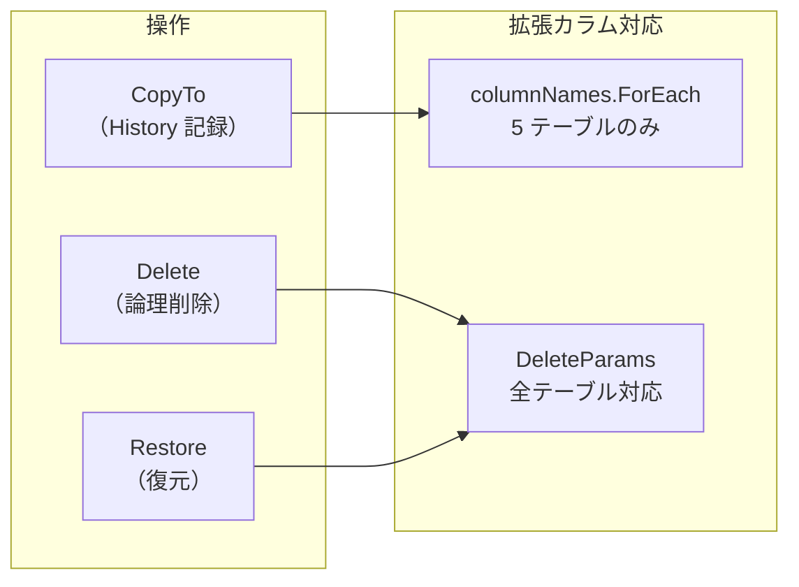
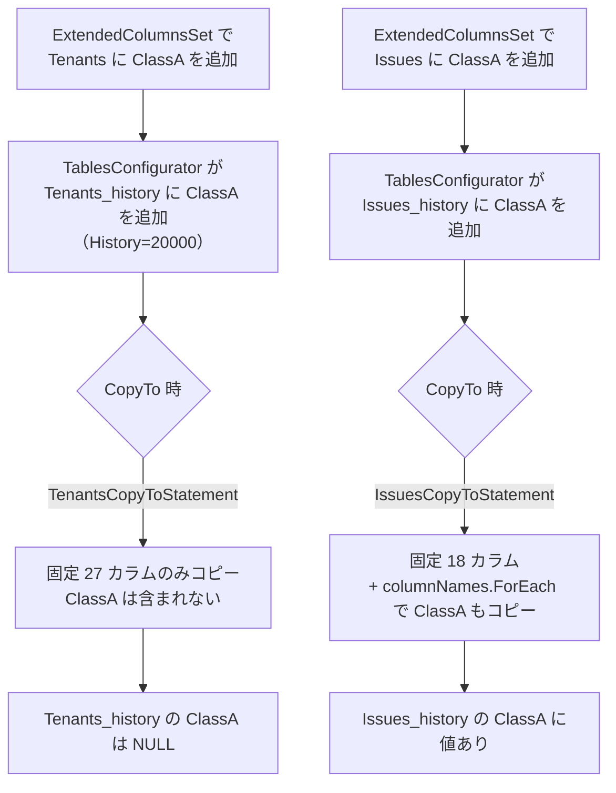

# History テーブルカラム欠損調査

各テーブルの `_history` テーブルに対して、固定カラム（`Ver` 等）や拡張カラムが正しくコピーされるかを検証した調査結果。

<!-- START doctoc generated TOC please keep comment here to allow auto update -->
<!-- DON'T EDIT THIS SECTION, INSTEAD RE-RUN doctoc TO UPDATE -->

- [調査情報](#調査情報)
- [調査目的](#調査目的)
- [結論（要約）](#結論要約)
- [履歴レコード作成の仕組み](#履歴レコード作成の仕組み)
    - [CopyToStatement の役割](#copytostatement-の役割)
    - [3 つの操作と拡張カラム対応](#3-つの操作と拡張カラム対応)
- [固定カラムの検証結果](#固定カラムの検証結果)
    - [全テーブル CopyToStatement カラム比較](#全テーブル-copytostatement-カラム比較)
    - [Tenants CopyToStatement の Ver カラム確認](#tenants-copytostatement-の-ver-カラム確認)
    - [`_Bases` 共通カラムの History 値](#_bases-共通カラムの-history-値)
    - [フィルタ条件の一致確認](#フィルタ条件の一致確認)
- [拡張カラムの検証結果](#拡張カラムの検証結果)
    - [拡張カラム対応テーブル](#拡張カラム対応テーブル)
    - [拡張カラムの Issues CopyToStatement（対応例）](#拡張カラムの-issues-copytostatement対応例)
    - [Tenants CopyToStatement（非対応例）](#tenants-copytostatement非対応例)
    - [デフォルト構成での影響](#デフォルト構成での影響)
- [潜在的欠損: ExtendedColumnsSet でのカスタム拡張カラム](#潜在的欠損-extendedcolumnsset-でのカスタム拡張カラム)
    - [カスタム拡張カラムの仕組み](#カスタム拡張カラムの仕組み)
    - [欠損シナリオ](#欠損シナリオ)
    - [操作別の拡張カラム対応比較](#操作別の拡張カラム対応比較)
    - [Delete/Restore の拡張カラム対応](#deleterestore-の拡張カラム対応)
    - [ColumnUtilities.ExtendedColumns](#columnutilitiesextendedcolumns)
- [コード生成テンプレートの構成](#コード生成テンプレートの構成)
- [まとめ](#まとめ)
    - [検証結果](#検証結果)
    - [操作と拡張カラムの対応マトリクス](#操作と拡張カラムの対応マトリクス)
    - [注意点](#注意点)
- [関連ソースコード](#関連ソースコード)
- [関連ドキュメント](#関連ドキュメント)

<!-- END doctoc generated TOC please keep comment here to allow auto update -->

## 調査情報

| 調査日        | リポジトリ | ブランチ | タグ/バージョン    | コミット    | 備考     |
| ------------- | ---------- | -------- | ------------------ | ----------- | -------- |
| 2026年2月24日 | Pleasanter | main     | Pleasanter_1.5.1.0 | `34f162a43` | 初回調査 |

## 調査目的

各テーブルの `_history` バリアントに対して、レコード更新時の CopyToStatement でカラムが正しくコピーされているか検証する。
特に `Ver` カラムをはじめとする `_Bases` 共通カラムの欠損有無と、
拡張カラム（ClassA-Z 等）のコピー対応状況を調査する。

---

## 結論（要約）

| 区分                         | 結果                                   |
| ---------------------------- | -------------------------------------- |
| 固定カラム（Ver 等）の欠損   | なし（全 28 テーブルで完全一致）       |
| 拡張カラム（デフォルト構成） | なし（5 テーブルとも CopyTo 対応済み） |
| 拡張カラム（カスタム構成）   | 潜在的欠損あり（後述）                 |
| Delete/Restore の拡張カラム  | なし（全テーブルで動的対応済み）       |

- `Ver` は `_Bases` カラムとして `History=21` で定義され、全テーブルの CopyToStatement に含まれている
- 固定カラムについては、全 28 テーブルの Delete / Restore / CopyTo で完全一致
- 拡張カラムの CopyTo（History 記録）対応は 5 テーブルのみ。非対応テーブルに `ExtendedColumnsSet` でカラムを追加した場合、履歴レコードで欠損が発生する

---

## 履歴レコード作成の仕組み

### CopyToStatement の役割

レコード更新時に `verUp` が有効な場合、現在のレコード内容を `_history` テーブルにコピーする。

**ファイル**: `Implem.Pleasanter/Models/Tenants/TenantModel.cs`（行番号: 842-846）

```csharp
if (verUp)
{
    statements.Add(Rds.TenantsCopyToStatement(
        where: where,
        tableType: Sqls.TableTypes.History,
        ColumnNames()));
    Ver++;
}
```

生成される SQL:

```sql
INSERT INTO "Tenants_history" ("TenantId", "Ver", ...)
SELECT "TenantId", "Ver", ... FROM "Tenants" WHERE ...
```

### 3 つの操作と拡張カラム対応



| 操作    | メソッド              | 拡張カラム対応方式                          | 対応範囲       |
| ------- | --------------------- | ------------------------------------------- | -------------- |
| CopyTo  | `XxxCopyToStatement`  | `columnNames.ForEach` による動的追加        | 5 テーブルのみ |
| Delete  | `DeleteXxxStatement`  | `DeleteParams` → `ExtendedColumns()` で展開 | 全テーブル     |
| Restore | `RestoreXxxStatement` | `DeleteParams` → `ExtendedColumns()` で展開 | 全テーブル     |

---

## 固定カラムの検証結果

### 全テーブル CopyToStatement カラム比較

CopyToStatement の固定カラムリストと、カラム定義（`History > 0` かつフィルタ条件通過）を全 28 テーブルで比較した。

| #   | テーブル          | CopyTo カラム数 | 定義カラム数 | 差異 |
| --- | ----------------- | :-------------: | :----------: | :--: |
| 1   | AutoNumberings    |       11        |      11      | なし |
| 2   | Binaries          |       21        |      21      | なし |
| 3   | Dashboards        |       11        |      11      | なし |
| 4   | Demos             |       13        |      13      | なし |
| 5   | Depts             |       12        |      12      | なし |
| 6   | Extensions        |       14        |      14      | なし |
| 7   | GroupChildren     |        8        |      8       | なし |
| 8   | GroupMembers      |       11        |      11      | なし |
| 9   | Groups            |       15        |      15      | なし |
| 10  | Issues            |       18        |      18      | なし |
| 11  | Items             |       12        |      12      | なし |
| 12  | Links             |        8        |      8       | なし |
| 13  | LoginKeys         |       11        |      11      | なし |
| 14  | MailAddresses     |       10        |      10      | なし |
| 15  | Orders            |       10        |      10      | なし |
| 16  | OutgoingMails     |       19        |      19      | なし |
| 17  | Passkeys          |       11        |      11      | なし |
| 18  | Permissions       |       11        |      11      | なし |
| 19  | Registrations     |       20        |      20      | なし |
| 20  | ReminderSchedules |        9        |      9       | なし |
| 21  | Results           |       14        |      14      | なし |
| 22  | Sessions          |       12        |      12      | なし |
| 23  | Sites             |       33        |      33      | なし |
| 24  | Statuses          |        9        |      9       | なし |
| 25  | SysLogs           |       46        |      46      | なし |
| 26  | Tenants           |       27        |      27      | なし |
| 27  | Users             |       53        |      53      | なし |
| 28  | Wikis             |       11        |      11      | なし |

### Tenants CopyToStatement の Ver カラム確認

**ファイル**: `Implem.Pleasanter/Libraries/DataSources/Rds.cs`（行番号: 12572-12606）

```csharp
public static SqlStatement TenantsCopyToStatement(
    SqlWhereCollection where, Sqls.TableTypes tableType, List<String> columnNames)
{
    var column = new TenantsColumnCollection();
    var param = new TenantsParamCollection();
    column.TenantId(function: Sqls.Functions.SingleColumn); param.TenantId();
    column.Ver(function: Sqls.Functions.SingleColumn); param.Ver();  // Ver は含まれている
    column.TenantName(function: Sqls.Functions.SingleColumn); param.TenantName();
    // ... 以下 24 カラム省略
    return InsertTenants(
        tableType: tableType,
        param: param,
        select: SelectTenants(column: column, where: where),
        addUpdatorParam: false);
}
```

`Ver` は `_Bases` カラムとして `History=21` で定義されており、全テーブルの CopyToStatement に含まれている。

### `_Bases` 共通カラムの History 値

| カラム      | History | フィルタ結果                     |
| ----------- | ------: | -------------------------------- |
| Ver         |      21 | 採用（CopyTo に含まれる）        |
| Comments    |  100982 | 採用（CopyTo に含まれる）        |
| Creator     |  100983 | 採用（CopyTo に含まれる）        |
| Updator     |  100985 | 採用（CopyTo に含まれる）        |
| CreatedTime |  100989 | 採用（CopyTo に含まれる）        |
| UpdatedTime |  100990 | 採用（CopyTo に含まれる）        |
| Timestamp   |  100993 | 除外（NotUpdate=1、NotSelect=1） |
| VerUp       |  100992 | 除外（NotUpdate=1、NotSelect=1） |

### フィルタ条件の一致確認

CopyToStatement のカラム選択フィルタ（`Rds_CopyToStatementColums.json`）と、TablesConfigurator の `_history` テーブルスキーマフィルタは同等の除外条件を持つ。

| フィルタ    | CopyTo テンプレート | TablesConfigurator |
| ----------- | :-----------------: | :----------------: |
| NotUpdate   |        除外         |        除外        |
| NotSelect   |        除外         |         --         |
| Calc        |        除外         |        除外        |
| JoinTable   |        除外         |        除外        |
| History > 0 |         --          |        必須        |

`NotSelect=1` のカラム（Timestamp, VerUp）は `NotUpdate=1` も持つため、両方のフィルタで除外される。結果として固定カラムに差異は生じない。

---

## 拡張カラムの検証結果

### 拡張カラム対応テーブル

CopyToStatement で拡張カラムを動的に処理する `columnNames.ForEach` ブロックは、以下の 5 テーブルにのみ存在する。

**ファイル**: `Implem.Pleasanter/App_Data/Definitions/Definition_Code/Rds_CopyToStatementColums_Extended.json`

```json
{ "Include": "Issues,Results,Depts,Groups,Users" }
```

| テーブル   | CopyTo 拡張対応 | 標準拡張（A-Z）定義 | 備考                   |
| ---------- | :-------------: | :-----------------: | ---------------------- |
| Issues     |      対応       |        対応         |                        |
| Results    |      対応       |        対応         |                        |
| Depts      |      対応       |        対応         |                        |
| Groups     |      対応       |        対応         |                        |
| Users      |      対応       |        対応         |                        |
| Tenants    |     非対応      |       非対応        | columnNames 引数未使用 |
| Sites      |     非対応      |       非対応        | columnNames 引数未使用 |
| Dashboards |     非対応      |       非対応        | columnNames 引数なし   |
| Wikis      |     非対応      |       非対応        | columnNames 引数なし   |

### 拡張カラムの Issues CopyToStatement（対応例）

**ファイル**: `Implem.Pleasanter/Libraries/DataSources/Rds.cs`（行番号: 12750-12764）

```csharp
// 固定カラム 18 個の後に続く
columnNames.ForEach(columnName =>
{
    column.Add(
        columnBracket: $"\"{columnName}\"",
        columnName: columnName,
        function: Sqls.Functions.SingleColumn);
    param.Add(
        columnBracket: $"\"{columnName}\"",
        name: columnName);
});
```

### Tenants CopyToStatement（非対応例）

**ファイル**: `Implem.Pleasanter/Libraries/DataSources/Rds.cs`（行番号: 12572-12606）

`TenantsCopyToStatement` はメソッド引数に `List<String> columnNames` を受け取るが、メソッド内で `columnNames` は一切使用されていない。固定カラム 27 個のみが処理される。

### デフォルト構成での影響

**影響なし**。`SetExtendedColumnDefinitions` で標準拡張カラム（A-Z）が定義されるのは CopyTo 対応済みの 5 テーブルのみ。

**ファイル**: `Implem.DefinitionAccessor/Def.cs`（行番号: 6345-6354）

```csharp
var tableNames = new List<string>()
{
    "Depts", "Groups", "Users", "Issues", "Results"
};
```

---

## 潜在的欠損: ExtendedColumnsSet でのカスタム拡張カラム

### カスタム拡張カラムの仕組み

コマーシャルライセンス環境では、`App_Data/Parameters/ExtendedColumns/` 配下の JSON ファイルで任意のテーブルに拡張カラムを追加できる（`ExtendedColumnsSet`）。

**ファイル**: `Implem.DefinitionAccessor/Def.cs`（行番号: 6397-6430）

```csharp
if (Parameters.CommercialLicense())
{
    SetExtendedColumns(definitionRows: definitionRows);
}
```

`ExtendedColumnsSet` の `TableName` フィールドにはバリデーションがなく、任意のテーブル名を指定可能。

### 欠損シナリオ



### 操作別の拡張カラム対応比較

非対応テーブル（Tenants, Sites, Dashboards, Wikis 等）に拡張カラムを追加した場合:

| 操作    | 拡張カラムの処理 | 方式                                                 |
| ------- | :--------------: | ---------------------------------------------------- |
| CopyTo  |   処理されない   | `columnNames.ForEach` ブロックが存在しない           |
| Delete  |    処理される    | `DeleteParams` → `ColumnUtilities.ExtendedColumns()` |
| Restore |    処理される    | `DeleteParams` → `ColumnUtilities.ExtendedColumns()` |

### Delete/Restore の拡張カラム対応

**ファイル**: `Implem.Pleasanter/Libraries/DataSources/Rds.cs`（行番号: 16435）

```csharp
private static string[] DeleteParams(string tableName)
{
    var extended = ColumnUtilities.ExtendedColumns(tableName: tableName);
    return new string[]
    {
        "{0}",
        extended.Any()
            ? "," + extended.Select(cn => $"\"{cn}\"").Join()
            : string.Empty,
        extended.Any()
            ? "," + extended.Select(cn => $"\"{cn}\"").Join()
            : string.Empty
    };
}
```

`ColumnUtilities.ExtendedColumns()` は `ColumnDefinitionCollection` から
`ExtendedColumnType` が設定されたカラムを動的に取得するため、
`ExtendedColumnsSet` で追加されたカラムも含まれる。
Delete/Restore では全テーブルで漏れなく処理される。

### ColumnUtilities.ExtendedColumns

**ファイル**: `Implem.Pleasanter/Libraries/Settings/ColumnUtilities.cs`（行番号: 17-25）

```csharp
public static List<string> ExtendedColumns(string tableName = null)
{
    return Def.ColumnDefinitionCollection
        .Where(cd => !cd.ExtendedColumnType.IsNullOrEmpty())
        .Where(cd => cd.TableName == tableName || tableName == null)
        .Select(cd => cd.ColumnName)
        .OrderBy(cn => cn)
        .ToList();
}
```

---

## コード生成テンプレートの構成

CopyToStatement は CodeDefiner による自動生成コードであり、以下のテンプレートから構成される。

| テンプレート                                  | 用途                                         |
| --------------------------------------------- | -------------------------------------------- |
| `Rds_CopyToStatement_Body.txt`                | メソッド全体の骨格                           |
| `Rds_CopyToStatementColums_Body.txt`          | 固定カラムの `column.XXX(); param.XXX();` 行 |
| `Rds_CopyToStatementColums.json`              | 固定カラムのフィルタ条件                     |
| `Rds_CopyToStatementColums_Extended_Body.txt` | `columnNames.ForEach` ブロック               |
| `Rds_CopyToStatementColums_Extended.json`     | 拡張カラム対応テーブルの Include 指定        |

**フィルタ条件**（`Rds_CopyToStatementColums.json`）:

| フィルタ | 値  | 意味                                 |
| -------- | --- | ------------------------------------ |
| Select   | 1   | NotSelect=1 のカラムを除外           |
| Update   | 1   | NotUpdate=1 のカラムを除外           |
| NotCalc  | 1   | Calc が設定されたカラムを除外        |
| NotJoin  | 1   | JoinTableName が設定されたものを除外 |

---

## まとめ

### 検証結果

| 検証項目                                   | 結果     | 詳細                                             |
| ------------------------------------------ | -------- | ------------------------------------------------ |
| 固定カラム（Ver 含む）の欠損               | なし     | 全 28 テーブルで CopyTo / Delete / Restore 一致  |
| `_Bases` 共通カラムの展開                  | 正常     | Ver(21), Comments, Creator, Updator 等すべて含む |
| デフォルト拡張カラム（A-Z）のコピー        | 正常     | 対象 5 テーブルすべてで CopyTo 対応済み          |
| カスタム拡張（ExtendedColumnsSet）のコピー | 条件付き | Include 対象外テーブルでは CopyTo 未対応         |
| Delete/Restore の拡張カラム                | 正常     | `DeleteParams` で全テーブル動的対応              |

### 操作と拡張カラムの対応マトリクス

| テーブル群                            | CopyTo | Delete | Restore |
| ------------------------------------- | :----: | :----: | :-----: |
| Issues, Results, Depts, Groups, Users |  対応  |  対応  |  対応   |
| Tenants, Sites, Dashboards, Wikis     | 非対応 |  対応  |  対応   |
| その他 19 テーブル                    | 非対応 |  対応  |  対応   |

### 注意点

- デフォルト構成では実害はない。標準拡張カラム（A-Z）は CopyTo 対応済みの 5 テーブルにのみ定義される
- `ExtendedColumnsSet`（コマーシャルライセンス機能）で非対応テーブルに拡張カラムを追加した場合のみ、`_history` レコードで拡張カラムの値が NULL になる問題が発生する
- Delete/Restore（`_deleted` テーブル）側は `DeleteParams` を使用しており、全テーブルで拡張カラムが正しく処理される

---

## 関連ソースコード

| ファイル                                                                                         | 内容                             |
| ------------------------------------------------------------------------------------------------ | -------------------------------- |
| `Implem.Pleasanter/Libraries/DataSources/Rds.cs`                                                 | CopyTo / Delete / Restore 全文   |
| `Implem.Pleasanter/Libraries/Settings/ColumnUtilities.cs`                                        | `ExtendedColumns()` メソッド     |
| `Implem.DefinitionAccessor/Def.cs`                                                               | `SetExtendedColumnDefinitions()` |
| `Implem.CodeDefiner/Functions/Rds/TablesConfigurator.cs`                                         | `_history` テーブルスキーマ構築  |
| `Implem.Pleasanter/App_Data/Definitions/Definition_Code/Rds_CopyToStatementColums_Extended.json` | 拡張カラム対応 Include リスト    |
| `Implem.Pleasanter/App_Data/Definitions/Definition_Column/_Bases_Ver.json`                       | Ver カラム定義（History=21）     |

## 関連ドキュメント

- [データベーステーブル定義一覧](015-データベーステーブル定義一覧.md)
- [テーブルバリアント使用パターンの逸脱分析](016-テーブルバリアント使用パターンの逸脱分析.md)
- [派生テーブルカラム差分パターン](017-派生テーブルカラム差分パターン.md)
