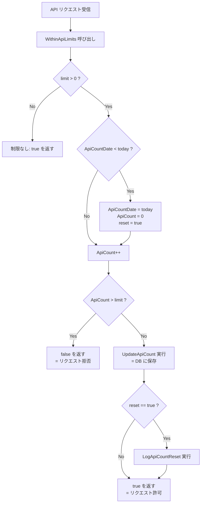
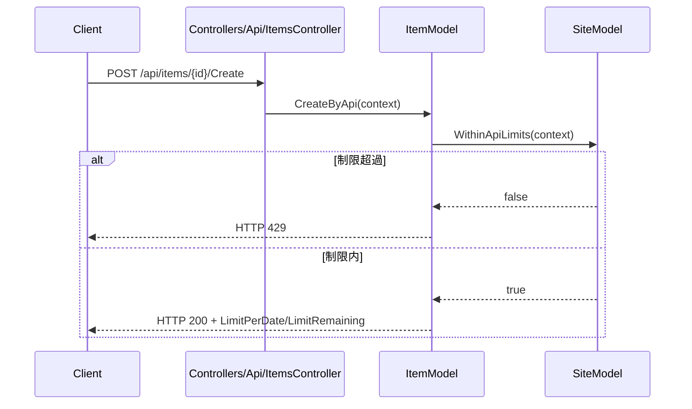

# リクエストレートリミッター実装

プリザンターが内部的に保持する API リクエストレートリミッターの仕組みを調査する。カウンターの格納場所・リセット条件・設定方法・エラーレスポンスの詳細を明らかにする。

<!-- START doctoc generated TOC please keep comment here to allow auto update -->
<!-- DON'T EDIT THIS SECTION, INSTEAD RE-RUN doctoc TO UPDATE -->

- [調査情報](#調査情報)
- [調査目的](#調査目的)
- [概要](#概要)
- [カウンターの格納場所](#カウンターの格納場所)
- [設定パラメータ](#設定パラメータ)
    - [グローバル設定（Parameters/Api.json）](#グローバル設定parametersapijson)
    - [テナント単位のオーバーライド（ContractSettings）](#テナント単位のオーバーライドcontractsettings)
    - [有効上限値の決定ロジック（ApiLimit）](#有効上限値の決定ロジックapilimit)
- [コア実装（WithinApiLimits）](#コア実装withinapilimits)
    - [処理フロー](#処理フロー)
    - [実装コード（SiteModel.cs）](#実装コードsitemodelcs)
    - [カウンター更新（UpdateApiCount）](#カウンター更新updateapicount)
    - [リセットログ（LogApiCountReset）](#リセットログlogapicountreset)
- [エラーレスポンス](#エラーレスポンス)
    - [HTTP ステータスコード](#http-ステータスコード)
    - [レスポンス構造（ApiResponse）](#レスポンス構造apiresponse)
    - [成功時レスポンスへのカウンター埋め込み](#成功時レスポンスへのカウンター埋め込み)
- [適用対象の操作一覧](#適用対象の操作一覧)
- [適用対象外の操作](#適用対象外の操作)
- [並行処理上の注意点](#並行処理上の注意点)
- [結論](#結論)
- [関連ソースコード](#関連ソースコード)

<!-- END doctoc generated TOC please keep comment here to allow auto update -->

## 調査情報

| 調査日        | リポジトリ | ブランチ | タグ/バージョン    | コミット    | 備考     |
| ------------- | ---------- | -------- | ------------------ | ----------- | -------- |
| 2026年2月25日 | Pleasanter | main     | Pleasanter_1.5.1.0 | `34f162a43` | 初回調査 |

## 調査目的

- プリザンターが API リクエストを対象に保持するレートリミッター機能の内部実装を把握する
- カウンターの格納場所・リセット条件・設定方法・エラーレスポンスの詳細を明らかにする
- フォーム投稿への適用可否を検討するための基礎情報を収集する

---

## 概要

プリザンターのレートリミッターは、**サイト単位・日次リセット方式**の API リクエスト制限機能である。制限値に達した API リクエストは HTTP 429 で拒否される。デフォルト設定（`LimitPerSite: 0`）では制限は無効であり、値を正の整数にすることで有効になる。

---

## カウンターの格納場所

カウンター情報は `Sites` テーブルの以下の 2 カラムに保持される。

| カラム名       | 型       | 説明                             |
| -------------- | -------- | -------------------------------- |
| `ApiCount`     | int      | 当日の API リクエスト累計数      |
| `ApiCountDate` | datetime | 最後にカウントをリセットした日付 |

カウンターはサイト（`SiteId`）ごとに独立して管理される。`SiteSettings` にも同名フィールドが保持され、`SetSite` 呼び出し時に `SiteModel` の値がコピーされる。

---

## 設定パラメータ

### グローバル設定（Parameters/Api.json）

**ファイル**: `Implem.Pleasanter/App_Data/Parameters/Api.json`

```json
{
    "Version": 1.1,
    "Enabled": true,
    "PageSize": 200,
    "LimitPerSite": 0,
    "Compatibility_1_3_12": false
}
```

| パラメータ     | デフォルト | 説明                                                      |
| -------------- | ---------- | --------------------------------------------------------- |
| `LimitPerSite` | `0`        | サイトあたりの 1 日あたり上限リクエスト数。`0` は制限なし |

**クラス**: `Implem.ParameterAccessor.Parts.Api`

```csharp
public class Api
{
    public decimal Version;
    public bool Enabled;
    public int PageSize;
    public int LimitPerSite;
    public bool Compatibility_1_3_12;
}
```

### テナント単位のオーバーライド（ContractSettings）

`ContractSettings.ApiLimitPerSite` に値を設定することで、テナントごとに上限値を上書きできる。

**ファイル**: `Implem.Pleasanter/Libraries/Settings/ContractSettings.cs`（行番号: 41）

```csharp
public int? ApiLimitPerSite;
```

### 有効上限値の決定ロジック（ApiLimit）

**ファイル**: `Implem.Pleasanter/Libraries/Settings/ContractSettings.cs`（行番号: 138-142）

```csharp
public int ApiLimit()
{
    return (ApiLimitPerSite != null)
        ? (int)ApiLimitPerSite
        : Parameters.Api.LimitPerSite;
}
```

`ContractSettings.ApiLimitPerSite` が設定されている場合はその値、未設定の場合は `Parameters.Api.LimitPerSite` が使用される。

---

## コア実装（WithinApiLimits）

### 処理フロー



### 実装コード（SiteModel.cs）

**ファイル**: `Implem.Pleasanter/Models/Sites/SiteModel.cs`（行番号: 9527-9559）

```csharp
public bool WithinApiLimits(Context context)
{
    var limit = context.ContractSettings.ApiLimit();
    var reset = false;
    var beforeResetCount = ApiCount;
    if (limit > 0)
    {
        var today = DateTime.Now.ToDateTime().ToLocal(context: context).Date;
        if (ApiCountDate.Date < today)
        {
            ApiCountDate = today;
            ApiCount = 0;
            reset = true;
        }
        ApiCount++;
        if (ApiCount > limit)
        {
            return false;
        }
        UpdateApiCount(context: context);
        if (reset)
        {
            LogApiCountReset(
                context: context,
                beforeResetCount: beforeResetCount,
                apiCount: ApiCount);
        }
        return true;
    }
    return true;
}
```

### カウンター更新（UpdateApiCount）

**ファイル**: `Implem.Pleasanter/Models/Sites/SiteModel.cs`（行番号: 9562-9576）

```csharp
private void UpdateApiCount(Context context)
{
    Repository.ExecuteNonQuery(
        context: context,
        statements: Rds.UpdateSites(
            where: Rds.SitesWhere()
                .TenantId(context.TenantId)
                .SiteId(SiteId),
            param: Rds.SitesParam()
                .ApiCountDate(ApiCountDate)
                .ApiCount(ApiCount),
            addUpdatorParam: false,
            addUpdatedTimeParam: false));
}
```

`ApiCount` と `ApiCountDate` のみを DB に更新する。`UpdatedTime` や `Updator` は変更されない
（`addUpdatorParam: false`、`addUpdatedTimeParam: false`）。

### リセットログ（LogApiCountReset）

日付をまたいでカウンターがリセットされた際に `SysLog` に記録される。

```csharp
private static void LogApiCountReset(Context context, int beforeResetCount, int apiCount)
{
    new SysLogModel(
        context: context,
        method: nameof(LogApiCountReset),
        message: Displays.ApiCountReset(
            context: context,
            new string[]
            {
                beforeResetCount.ToString(),
                apiCount.ToString()
            }));
}
```

---

## エラーレスポンス

### HTTP ステータスコード

制限超過時は HTTP 429 を返す。

**ファイル**: `Implem.Pleasanter/Libraries/Responses/ApiResponses.cs`（行番号: 95, 171-179）

```csharp
case General.Error.Types.OverLimitApi:
    return 429;
```

### レスポンス構造（ApiResponse）

**ファイル**: `Implem.Pleasanter/Libraries/Responses/ApiResponse.cs`

```csharp
public class ApiResponse
{
    public long Id;
    public int StatusCode;
    public int? LimitPerDate;
    public int? LimitRemaining;
    public string Message;
}
```

制限超過時のレスポンス例（`ApiResponses.OverLimitApi`）:

```json
{
    "Id": 12345,
    "StatusCode": 429,
    "Message": "API の 1 日あたりの上限リクエスト数 ({siteId}: {limitPerSite}件) を超えています。"
}
```

### 成功時レスポンスへのカウンター埋め込み

API リクエストが成功した場合、レスポンスに現在のカウンター情報が付与される。

**ファイル**: `Implem.Pleasanter/Models/Issues/IssueUtilities.cs`（行番号: 3624-3625）

```csharp
return ApiResults.Get(
    statusCode: 200,
    limitPerDate: context.ContractSettings.ApiLimit(),
    limitRemaining: context.ContractSettings.ApiLimit() - ss.ApiCount,
    response: new { ... });
```

| フィールド       | 説明                 |
| ---------------- | -------------------- |
| `LimitPerDate`   | 1 日あたりの上限数   |
| `LimitRemaining` | 当日の残リクエスト数 |

---

## 適用対象の操作一覧

`WithinApiLimits` チェックが実装されているメソッドの一覧。

| メソッド                   | 呼び出し元クラス        | 説明                                 |
| -------------------------- | ----------------------- | ------------------------------------ |
| `GetByApi`                 | `ItemModel`             | API による取得                       |
| `CreateByApi`              | `ItemModel`             | API による作成                       |
| `UpdateByApi`              | `ItemModel`             | API による更新                       |
| `UpsertByApi`              | `ItemModel`             | API による Upsert                    |
| `DeleteByApi`              | `ItemModel`             | API による削除                       |
| `BulkDeleteByApi`          | `ItemModel`             | API による一括削除                   |
| `UpdateSiteSettingsByApi`  | `ItemModel`             | API によるサイト設定更新             |
| `ExportByApi`              | `ItemModel`             | API によるエクスポート               |
| `ImportByApi`              | `ItemModel`             | API によるインポート                 |
| `CopySitePackageByApi`     | `ItemModel`             | API によるサイトパッケージ複製       |
| `GetByServerScript`        | `ItemModel`             | サーバースクリプトによる取得         |
| `GetSiteByServerScript`    | `ItemModel`             | サーバースクリプトによるサイト取得   |
| `CreateByServerScript`     | `ItemModel`             | サーバースクリプトによる作成         |
| `UpdateByServerScript`     | `ItemModel`             | サーバースクリプトによる更新         |
| `DeleteByServerScript`     | `ItemModel`             | サーバースクリプトによる削除         |
| `BulkDeleteByServerScript` | `ItemModel`             | サーバースクリプトによる一括削除     |
| `UpsertByServerScript`     | `ItemModel`             | サーバースクリプトによる Upsert      |
| OutgoingMail 送信          | `OutgoingMailUtilities` | メール送信（`SiteModel` を直接使用） |

チェックが行われる経路は 2 種類ある。



---

## 適用対象外の操作

フォームからの CRUD 操作（ブラウザ UI）では `WithinApiLimits` は**呼び出されない**。

| メソッド               | 説明                       | レートリミット |
| ---------------------- | -------------------------- | -------------- |
| `ItemModel.Create`     | フォームによるレコード作成 | 未適用         |
| `ItemModel.Update`     | フォームによるレコード更新 | 未適用         |
| `ItemModel.Delete`     | フォームによるレコード削除 | 未適用         |
| `ItemModel.BulkDelete` | フォームによる一括削除     | 未適用         |

---

## 並行処理上の注意点

`WithinApiLimits` はアプリケーション層での排他制御（ロック）を行っていない。処理の流れは
「メモリ上の `ApiCount` をインクリメント → DB に書き込み」というリードモディファイライトであるため、
高負荷環境では複数リクエストが同時に同一の `ApiCount` 値を読み込み、それぞれがインクリメントして
書き込む競合状態（レースコンディション）が起こりうる。これにより、制限値をわずかに超えるリクエストが
許可される可能性がある。

---

## 結論

| 項目         | 内容                                                                              |
| ------------ | --------------------------------------------------------------------------------- |
| 制限単位     | サイト（`SiteId`）単位                                                            |
| リセット周期 | 日次（ローカルタイムゾーンの日付変更時）                                          |
| デフォルト値 | `LimitPerSite: 0`（制限なし）                                                     |
| 設定場所     | `App_Data/Parameters/Api.json`（グローバル）または `ContractSettings`（テナント） |
| エラー応答   | HTTP 429、レスポンス JSON に `StatusCode: 429` と `Message` を含む                |
| 適用範囲     | API リクエストおよびサーバースクリプト経由の操作のみ                              |
| 非適用範囲   | フォーム（ブラウザ UI）からの操作                                                 |
| 競合状態     | アプリ層のロックなし。高負荷時に若干の超過が起こりうる                            |

---

## 関連ソースコード

| ファイル                                                   | 説明                            |
| ---------------------------------------------------------- | ------------------------------- |
| `Implem.ParameterAccessor/Parts/Api.cs`                    | パラメータクラス定義            |
| `Implem.Pleasanter/App_Data/Parameters/Api.json`           | デフォルトパラメータ            |
| `Implem.Pleasanter/Libraries/Settings/ContractSettings.cs` | テナント設定・`ApiLimit()` 定義 |
| `Implem.Pleasanter/Models/Sites/SiteModel.cs`              | `WithinApiLimits()` 実装        |
| `Implem.Pleasanter/Libraries/Responses/ApiResponses.cs`    | エラーレスポンス生成            |
| `Implem.Pleasanter/Libraries/Responses/ApiResponse.cs`     | レスポンスモデル定義            |
| `Implem.Pleasanter/Models/Items/ItemModel.cs`              | API 操作からの呼び出し元        |
