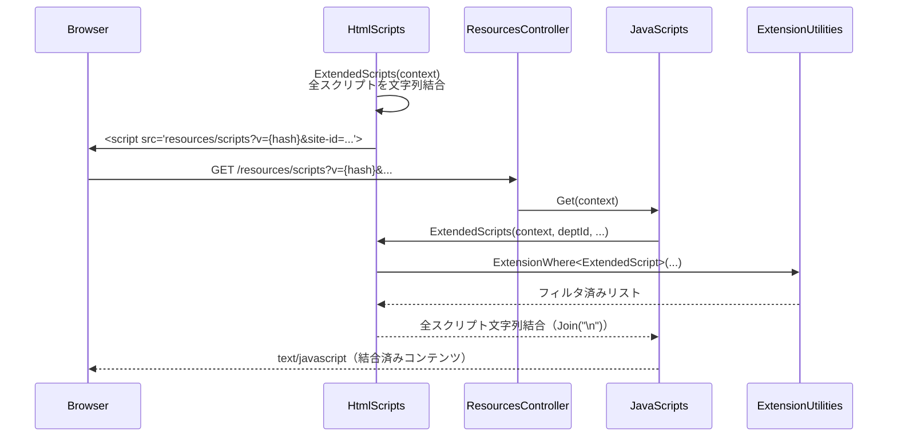
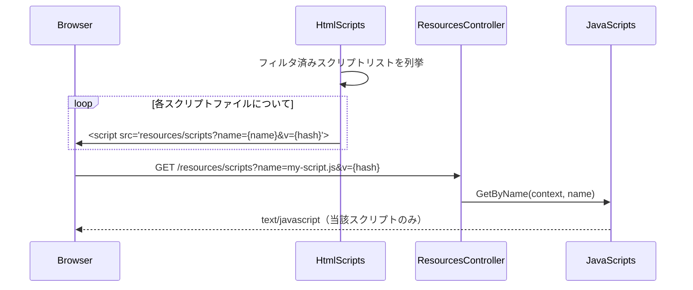

# 拡張機能実装方式比較と改善方針

プリザンターが提供するファイルベースの拡張機能（ExtendedScript・ExtendedStyle・ExtendedHtml・ExtendedSql・ExtendedServerScript・ExtendedPlugin
等）の実装方式を比較し、実装差異を整理する。あわせて、JSON 設定ファイルを持たない拡張スクリプト・拡張スタイルへの条件指定機能追加と、
独立ファイルロード方式への移行案を記述する。

<!-- START doctoc generated TOC please keep comment here to allow auto update -->
<!-- DON'T EDIT THIS SECTION, INSTEAD RE-RUN doctoc TO UPDATE -->

- [調査情報](#調査情報)
- [調査目的](#調査目的)
- [拡張機能の種類と概要](#拡張機能の種類と概要)
- [ファイル構成と読み込み方式](#ファイル構成と読み込み方式)
    - [JSON なし（コンテンツファイルのみ）](#json-なしコンテンツファイルのみ)
    - [JSON あり（JSON + 別ファイル）](#json-ありjson--別ファイル)
- [Initializer による読み込みフロー](#initializer-による読み込みフロー)
    - [ExtendedScripts（.js）](#extendedscriptsjs)
    - [ExtendedStyles（.css）](#extendedstylescss)
    - [ExtendedHtmls（.html）](#extendedhtmlshtml)
    - [ExtendedServerScripts（.json + .json.js）](#extendedserverscriptsjson--jsonjs)
    - [ExtendedSqls（.json + .json.sql）](#extendedsqlsjson--jsonsql)
    - [ExtendedPlugins（.json）](#extendedpluginsjson)
    - [ExtendedNavigationMenus（.json）](#extendednavigationmenusjson)
- [実装差異比較表](#実装差異比較表)
- [フィルタリング機構（ExtensionWhere）](#フィルタリング機構extensionwhere)
    - [フィルタ条件一覧](#フィルタ条件一覧)
    - [MeetConditions の判定ルール](#meetconditions-の判定ルール)
- [スクリプト・スタイルの配信フロー（現行）](#スクリプトスタイルの配信フロー現行)
    - [スクリプト配信の流れ](#スクリプト配信の流れ)
    - [スタイル配信の流れ](#スタイル配信の流れ)
    - [現行の結合配信方式の問題点](#現行の結合配信方式の問題点)
- [ExtendedBase 共通プロパティ](#extendedbase-共通プロパティ)
- [改善方針](#改善方針)
    - [方針 1: JSON なし拡張スクリプト・スタイルへの条件指定対応](#方針-1-json-なし拡張スクリプトスタイルへの条件指定対応)
    - [方針 2: JSON あり拡張機能のファイル独立ロード対応](#方針-2-json-あり拡張機能のファイル独立ロード対応)
    - [方針 3: JSON なし（後方互換性の維持）](#方針-3-json-なし後方互換性の維持)
- [改修箇所の整理](#改修箇所の整理)
- [結論](#結論)
- [関連ソースコード](#関連ソースコード)

<!-- END doctoc generated TOC please keep comment here to allow auto update -->

## 調査情報

| 調査日        | リポジトリ | ブランチ | タグ/バージョン    | コミット    | 備考     |
| ------------- | ---------- | -------- | ------------------ | ----------- | -------- |
| 2026年2月25日 | Pleasanter | main     | Pleasanter_1.5.1.0 | `34f162a43` | 初回調査 |

## 調査目的

- 各種拡張機能の実装方式（ファイル種別・読み込み方法・フィルタリング方法）を横断的に比較する
- JSON 設定を持たない ExtendedScripts / ExtendedStyles に SiteId・Controller・Action による適用制御を追加するための改修方針を示す
- JSON ありの拡張機能（ExtendedSqls・ExtendedServerScripts 等）において、現行の「全コンテンツを文字列結合して1リクエストで配信」方式を、ファイルごとに独立ロードする方式へ移行する改修方針を示す
- 後方互換性（JSON なし → 従来挙動のフォールバック）の保証方法を示す

---

## 拡張機能の種類と概要

プリザンターが提供するファイルベースの拡張機能は以下のとおり。

| 拡張機能名              | 配置ディレクトリ                      | 用途                                  |
| ----------------------- | ------------------------------------- | ------------------------------------- |
| ExtendedScripts         | `Parameters/ExtendedScripts/`         | クライアントサイド JavaScript の追加  |
| ExtendedStyles          | `Parameters/ExtendedStyles/`          | CSS の追加                            |
| ExtendedHtmls           | `Parameters/ExtendedHtmls/`           | 任意の HTML ブロックの埋め込み        |
| ExtendedServerScripts   | `Parameters/ExtendedServerScripts/`   | サーバーサイド JavaScript の追加      |
| ExtendedSqls            | `Parameters/ExtendedSqls/`            | 任意の SQL 文の実行                   |
| ExtendedPlugins         | `Parameters/ExtendedPlugins/`         | DLL プラグイン（PDF 等）のロード設定  |
| ExtendedNavigationMenus | `Parameters/ExtendedNavigationMenus/` | ナビゲーションメニューの追加          |
| ExtendedFields          | `Parameters/ExtendedFields/`          | 拡張フィールドの定義                  |
| ExtendedHeadLinks       | `Parameters/ExtendedHeadLinks/`       | `<head>` タグへの任意リンクタグの追加 |

---

## ファイル構成と読み込み方式

拡張機能は「JSON 設定ファイルを持つかどうか」で2つのパターンに分類される。

### JSON なし（コンテンツファイルのみ）

```text
Parameters/
├── ExtendedScripts/
│   ├── 01-common.js        ← コンテンツ本体 = ファイル内容がそのままスクリプトになる
│   └── 02-detail.js
├── ExtendedStyles/
│   └── custom.css          ← コンテンツ本体 = ファイル内容がそのまま CSS になる
└── ExtendedHtmls/
    └── sidebar.html        ← コンテンツ本体 = ファイル内容がそのまま HTML になる
    └── sidebar_ja.html     ← アンダースコア後の文字列が言語コードとして扱われる
```

メタデータ（SiteIdList・Controllers・Actions 等の適用条件）を指定する手段がなく、ロード時にすべてのファイルが無条件で登録される。
`ExtensionWhere` でフィルタリングされるが、`SiteIdList` / `Controllers` / `Actions` がすべて null（＝条件なし）のため結果的に全ページで適用される。

### JSON あり（JSON + 別ファイル）

```text
Parameters/
├── ExtendedServerScripts/
│   ├── my-script.json       ← メタデータ（ExtendedServerScript）
│   └── my-script.json.js    ← スクリプト本体（任意: なければ JSON 内の Body フィールドを使用）
├── ExtendedSqls/
│   ├── my-query.json        ← メタデータ（ExtendedSql）
│   └── my-query.json.sql    ← SQL 本体（任意: なければ JSON 内の CommandText フィールドを使用）
└── ExtendedPlugins/
    └── pdf-plugin.json      ← メタデータのみ（DLL パスは LibraryPath フィールドで指定）
```

JSON ファイルがメタデータ（適用条件・動作フラグ）を保持し、コンテンツ本体は JSON 内埋め込みか別ファイルで指定できる二段構えの設計になっている。

---

## Initializer による読み込みフロー

`Implem.DefinitionAccessor/Initializer.cs` がアプリ起動時にすべての拡張機能ファイルを読み込み、`Parameters` クラスの静的フィールドに格納する。

### ExtendedScripts（.js）

**ファイル**: `Implem.DefinitionAccessor/Initializer.cs`（行番号: 523-554）

```csharp
private static List<ExtendedScript> ExtendedScripts(
    string path = null, List<ExtendedScript> list = null)
{
    // ...
    var files = new DirectoryInfo(path)
        .GetFiles("*.js")
        .OrderBy(file => file.Name);
    foreach (var file in files)
    {
        var script = Files.Read(file.FullName);
        if (script != null)
        {
            list.Add(new ExtendedScript()
            {
                Name = file.Name,
                Path = file.FullName,
                Script = script           // ファイル内容 = スクリプト本体
            });
        }
    }
    // サブディレクトリを再帰的に処理
}
```

`Name`・`Path`・`Script` のみセットされ、`SiteIdList` / `Controllers` / `Actions` は null。ファイル名の昇順で処理される。

### ExtendedStyles（.css）

**ファイル**: `Implem.DefinitionAccessor/Initializer.cs`（行番号: 650-679）

`ExtendedScripts` と同一パターン。`.css` ファイルを読み込み `Name`・`Path`・`Style` のみセットする。

### ExtendedHtmls（.html）

**ファイル**: `Implem.DefinitionAccessor/Initializer.cs`（行番号: 450-492）

```csharp
foreach (var file in new DirectoryInfo(path).GetFiles("*.html"))
{
    var fileNameWithoutExtension = Path.GetFileNameWithoutExtension(file.Name);
    var displayElement = new DisplayElement
    {
        Language = fileNameWithoutExtension?.Split('_').Skip(1).LastOrDefault(),
        Body = extendedHtml
    };
    var name = displayElement.Language.IsNullOrEmpty()
        ? fileNameWithoutExtension
        : fileNameWithoutExtension?.Substring(
            0, fileNameWithoutExtension.Length - displayElement.Language.Length - 1);
    // ...
    list.Add(new ExtendedHtml() { Html = listDisplay });
}
```

`_言語コード` サフィックス（例: `sidebar_ja.html`）で多言語対応する独自規約がある。`SiteIdList` 等のフィルタは指定不可。

### ExtendedServerScripts（.json + .json.js）

**ファイル**: `Implem.DefinitionAccessor/Initializer.cs`（行番号: 556-587）

```csharp
foreach (var file in new DirectoryInfo(path).GetFiles("*.json"))
{
    var extendedServerScript = Files.Read(file.FullName)
        .Deserialize<ExtendedServerScript>();
    if (extendedServerScript != null)
    {
        extendedServerScript.Path = file.FullName;
        var jsPath = file.FullName + ".js";
        if (Files.Exists(jsPath))
        {
            extendedServerScript.Body = Files.Read(jsPath);  // 別ファイルが優先
        }
        list.Add(extendedServerScript);
    }
}
```

JSON でメタデータを定義し、別ファイル（`.json.js`）があればその内容が `Body` に上書きされる。JSON 内 `Body` フィールドへのインライン記述も可能。

### ExtendedSqls（.json + .json.sql）

**ファイル**: `Implem.DefinitionAccessor/Initializer.cs`（行番号: 589-619）

`ExtendedServerScripts` と同一パターン。JSON でメタデータを定義し、`.json.sql` ファイルがあればその内容が `CommandText` に上書きされる。

### ExtendedPlugins（.json）

**ファイル**: `Implem.DefinitionAccessor/Initializer.cs`（行番号: 622-647）

JSON ファイルのみ。コンテンツ本体は持たず、DLL のパスを `LibraryPath` フィールドで指定する。

### ExtendedNavigationMenus（.json）

**ファイル**: `Implem.DefinitionAccessor/Initializer.cs`（行番号: 496-521）

JSON ファイルのみ。

---

## 実装差異比較表

| 拡張機能                | ファイル種別          | JSON 設定 | 別ファイル本体      | SiteIdList 指定 | Controllers 指定 | Actions 指定 | 適用制御方法          |
| ----------------------- | --------------------- | :-------: | ------------------- | :-------------: | :--------------: | :----------: | --------------------- |
| ExtendedScripts         | `.js`                 |   なし    | -                   |      不可       |       不可       |     不可     | 不可（全ページ適用）  |
| ExtendedStyles          | `.css`                |   なし    | -                   |      不可       |       不可       |     不可     | 不可（全ページ適用）  |
| ExtendedHtmls           | `.html`               |   なし    | -                   |      不可       |       不可       |     不可     | 不可（言語のみ）      |
| ExtendedServerScripts   | `.json` + `.json.js`  |   あり    | `.json.js`（任意）  |       可        |        可        |      可      | JSON フィールドで指定 |
| ExtendedSqls            | `.json` + `.json.sql` |   あり    | `.json.sql`（任意） |       可        |        可        |      可      | JSON フィールドで指定 |
| ExtendedPlugins         | `.json`               |   あり    | なし（LibraryPath） |       可        |        可        |      可      | JSON フィールドで指定 |
| ExtendedNavigationMenus | `.json`               |   あり    | なし                |       可        |        可        |      可      | JSON フィールドで指定 |
| ExtendedFields          | `.json`               |   あり    | なし                |       可        |        可        |      可      | JSON フィールドで指定 |
| ExtendedHeadLinks       | `.json`               |   あり    | なし                |       可        |        可        |      可      | JSON フィールドで指定 |

---

## フィルタリング機構（ExtensionWhere）

**ファイル**: `Implem.Pleasanter/Libraries/Models/Extensions/ExtensionUtilities.cs`（行番号: 206-252）

すべての拡張機能は `ExtensionWhere<T>` メソッドでフィルタリングされる。各フィルタ条件が null または空の場合、その条件は「制限なし（全対象）」として扱われる。

### フィルタ条件一覧

| フィールド（ExtendedBase） | 型             | 意味                                        |
| -------------------------- | -------------- | ------------------------------------------- |
| `SiteIdList`               | `List<long>`   | 適用するサイト ID の一覧                    |
| `IdList`                   | `List<long>`   | 適用するレコード ID の一覧                  |
| `DeptIdList`               | `List<int>`    | 適用する部署 ID の一覧                      |
| `GroupIdList`              | `List<int>`    | 適用するグループ ID の一覧                  |
| `UserIdList`               | `List<int>`    | 適用するユーザー ID の一覧                  |
| `Controllers`              | `List<string>` | 適用するコントローラー名の一覧              |
| `Actions`                  | `List<string>` | 適用するアクション名の一覧                  |
| `ColumnList`               | `List<string>` | 適用するカラム名の一覧（HTML 等）           |
| `Disabled`                 | `bool`         | `true` のとき無効化                         |
| `SpecifyByName`            | `bool`         | `true` のとき `Name` が一致する場合のみ適用 |

### MeetConditions の判定ルール

```csharp
// リストが null または空 → 条件なし（全対象）
private static bool NoConditions(List<string> items, string data)
    => data.IsNullOrEmpty() || items?.Any() != true;

// リストに含まれる → 正マッチ
private static bool PositiveConditions(List<string> items, string data)
    => items.Any(item => item == data);

// "!" プレフィックス → 除外（否定マッチ）
private static bool NegativeConditions(List<string> items, string data)
    => items.All(item => item.StartsWith("!"))
        && !items.Any(item => item == "!" + data);
```

---

## スクリプト・スタイルの配信フロー（現行）

### スクリプト配信の流れ



`v` パラメータには結合後コンテンツの SHA-512 ハッシュが使用される。フィルタ条件（SiteId 等）はクエリパラメータで渡され、サーバー側で `ExtensionWhere` が再評価される。

### スタイル配信の流れ

スクリプトと同一パターン。`resources/styles` エンドポイントで全スタイルを結合して返す。

### 現行の結合配信方式の問題点

| 問題                   | 説明                                                                                  |
| ---------------------- | ------------------------------------------------------------------------------------- |
| キャッシュ効率の低下   | 1 つのスクリプトを変更しただけで v ハッシュが変わり、無関係なスクリプトも再取得される |
| デバッグ困難           | ブラウザのデバッガーでスクリプトを特定しにくい                                        |
| 順序依存の暗黙的な結合 | ファイル名昇順で結合されるため、依存関係のあるスクリプト同士の順序制御が困難          |
| コンテンツ埋め込み制限 | JSON に直接スクリプトを埋め込む場合、コード量が多いと管理しにくい                     |

---

## ExtendedBase 共通プロパティ

すべての拡張機能クラスは `ExtendedBase` を継承する。

**ファイル**: `Implem.ParameterAccessor/Parts/ExtendedBase.cs`

```csharp
public class ExtendedBase
{
    public string Name;
    public bool SpecifyByName;
    public string Path;          // ファイルシステム上のフルパス（Initializer がセット）
    public string Description;
    public bool Disabled;
    public List<int> DeptIdList;
    public List<int> GroupIdList;
    public List<int> UserIdList;
    public List<long> SiteIdList;
    public List<long> IdList;
    public List<string> Controllers;
    public List<string> Actions;
    public List<string> ColumnList;
}
```

`Path` は Initializer がロード時に設定するランタイムフィールド。ファイル配置構造を外部に公開せずにコンテンツを識別するための内部キーとして利用可能。

---

## 改善方針

### 方針 1: JSON なし拡張スクリプト・スタイルへの条件指定対応

#### 現状

`.js` / `.css` ファイルのみを読み込むため、SiteId・Controller・Action 等のフィルタを指定する手段がない。

#### 提案: JSON コンパニオンファイル方式

`.js` / `.css` と同名の `.json` ファイルを用意することで、メタデータのみを外部から指定できるようにする。

```text
Parameters/ExtendedScripts/
├── my-script.js            ← スクリプト本体（変更なし）
└── my-script.js.json       ← メタデータ（新規）: SiteIdList, Controllers, Actions 等
```

`my-script.js.json` の例:

```json
{
    "SiteIdList": [100, 200],
    "Controllers": ["items"],
    "Actions": ["edit", "new"],
    "Disabled": false
}
```

Initializer の読み込み処理を以下のように修正する。

```csharp
foreach (var file in files)  // *.js ファイルのループ
{
    var script = Files.Read(file.FullName);
    if (script != null)
    {
        var item = new ExtendedScript()
        {
            Name = file.Name,
            Path = file.FullName,
            Script = script
        };
        // JSON コンパニオンファイルが存在すればメタデータをマージ
        var jsonPath = file.FullName + ".json";
        if (Files.Exists(jsonPath))
        {
            var meta = Files.Read(jsonPath).Deserialize<ExtendedScript>();
            if (meta != null)
            {
                item.SiteIdList   = meta.SiteIdList;
                item.Controllers  = meta.Controllers;
                item.Actions      = meta.Actions;
                item.DeptIdList   = meta.DeptIdList;
                item.GroupIdList  = meta.GroupIdList;
                item.UserIdList   = meta.UserIdList;
                item.IdList       = meta.IdList;
                item.Disabled     = meta.Disabled;
                item.Description  = meta.Description;
            }
        }
        list.Add(item);
    }
}
```

#### 対象機能と対応ファイル拡張子

| 拡張機能        | コンパニオンファイル |
| --------------- | -------------------- |
| ExtendedScripts | `.js.json`           |
| ExtendedStyles  | `.css.json`          |

ExtendedHtmls については、言語コードのサフィックス規約（`name_ja.html`）がすでに存在するため、同様の方式で `name_ja.html.json` への対応も検討可能。

---

### 方針 2: JSON あり拡張機能のファイル独立ロード対応

#### 現状

`HtmlScripts.ExtendedScripts()` が全スクリプトを文字列結合し、1 つの `<script>` タグで配信している。拡張スタイルも同様。

#### 提案: ファイルごとの独立ロード方式

各スクリプト・スタイルを個別の `<script>` / `<link>` タグで読み込む。ディレクトリ構造を外部に公開しないため、`name` パラメータを使用したエンドポイント経由で返す方式を採用する（現行のリソースエンドポイント方式を維持）。



`v` パラメータには各ファイル個別のハッシュを使用し、ファイル単位のキャッシュを実現する。

#### エンドポイントの変更点

`ResourcesController.Scripts()` に `name` パラメータを追加する。

```csharp
[HttpGet]
[ResponseCache(Duration = int.MaxValue)]
public ContentResult Scripts(string name = null)
{
    var context = new Context();
    var result = name.IsNullOrEmpty()
        ? JavaScripts.Get(context: context)       // 後方互換: 結合配信（JSON なし対象）
        : JavaScripts.GetByName(context, name);   // 独立配信（JSON あり対象）
    return result.ToRecourceContentResult(request: Request);
}
```

`HtmlScripts` 側の変更:

```csharp
// JSON メタデータを持つスクリプト（方針 1 の JSON コンパニオンを含む）は個別タグで出力
foreach (var script in filteredScripts.Where(HasJsonMeta))
{
    hb.Script(
        src: $"resources/scripts?name={Uri.EscapeDataString(script.Name)}&v={script.Script.Sha512Cng()}",
        nonce: context.Nonce);
}

// JSON メタデータを持たないスクリプトは既存の結合配信にフォールバック
var legacyScripts = filteredScripts.Where(s => !HasJsonMeta(s)).Select(s => s.Script).Join("\n");
if (!legacyScripts.IsNullOrEmpty())
{
    hb.Script(
        src: $"resources/scripts?v={legacyScripts.Sha512Cng()}&site-id=...",
        nonce: context.Nonce);
}
```

---

### 方針 3: JSON なし（後方互換性の維持）

JSON コンパニオンファイルが存在しない従来の `.js` / `.css` ファイルは現行どおり動作させる。

| 条件                            | 挙動                                      |
| ------------------------------- | ----------------------------------------- |
| `.js` のみ（JSON なし）         | 従来どおり結合配信・全ページ適用          |
| `.js` + `.js.json`（JSON あり） | 独立ロード・JSON で指定した条件でフィルタ |
| `.json` + `.json.js`            | 現行どおり独立ロードへ移行                |

---

## 改修箇所の整理

| 改修対象ファイル                                       | 内容                                                                       |
| ------------------------------------------------------ | -------------------------------------------------------------------------- |
| `Implem.DefinitionAccessor/Initializer.cs`             | `ExtendedScripts`・`ExtendedStyles` に JSON コンパニオン読み込み処理を追加 |
| `Implem.ParameterAccessor/Parts/ExtendedScript.cs`     | プロパティ追加は不要（`ExtendedBase` 継承で条件フィールドを持つ）          |
| `Implem.Pleasanter/Libraries/HtmlParts/HtmlScripts.cs` | フィルタ済みリストを個別 `<script>` タグで出力する処理を追加               |
| `Implem.Pleasanter/Libraries/HtmlParts/HtmlStyles.cs`  | フィルタ済みリストを個別 `<link>` タグで出力する処理を追加                 |
| `Implem.Pleasanter/Libraries/Resources/JavaScripts.cs` | `GetByName(context, name)` メソッドを追加                                  |
| `Implem.Pleasanter/Libraries/Resources/Css.cs`         | `GetByName(context, name)` メソッドを追加                                  |
| `Implem.Pleasanter/Controllers/ResourcesController.cs` | `Scripts(name)` / `Styles(name)` に `name` パラメータを追加                |

---

## 結論

| 項目                       | 現状                              | 改善後                                                     |
| -------------------------- | --------------------------------- | ---------------------------------------------------------- |
| ExtendedScripts の条件指定 | 不可（全ページ適用）              | `.js.json` コンパニオンで SiteId/Controller/Action 指定可  |
| ExtendedStyles の条件指定  | 不可（全ページ適用）              | `.css.json` コンパニオンで SiteId/Controller/Action 指定可 |
| スクリプト配信方式         | 全ファイル結合して1リクエスト     | JSON あり → ファイル単位の独立リクエスト                   |
| スタイル配信方式           | 全ファイル結合して1リクエスト     | JSON あり → ファイル単位の独立リクエスト                   |
| 後方互換性                 | -                                 | JSON なし → 従来の結合配信にフォールバック                 |
| ディレクトリ構造の隠蔽     | なし（URL にパスが含まれない）    | `name` パラメータで識別・パスは公開しない                  |
| ExtendedServerScripts      | JSON あり（条件指定可）・結合なし | 変更なし（現行で独立ロード設計）                           |
| ExtendedSqls               | JSON あり（条件指定可）           | 変更なし                                                   |

既存の拡張スクリプト・スタイル（JSON なし）は現行どおり動作するため、既存環境への影響はない。JSON コンパニオンファイルを追加することでオプトイン方式で機能を有効化できる。

---

## 関連ソースコード

| ファイル                                                                      | 内容                                         |
| ----------------------------------------------------------------------------- | -------------------------------------------- |
| `Implem.DefinitionAccessor/Initializer.cs`                                    | 各拡張機能の読み込み処理                     |
| `Implem.ParameterAccessor/Parts/ExtendedBase.cs`                              | 共通フィルタフィールドの定義                 |
| `Implem.ParameterAccessor/Parts/ExtendedScript.cs`                            | ExtendedScript クラス                        |
| `Implem.ParameterAccessor/Parts/ExtendedStyle.cs`                             | ExtendedStyle クラス                         |
| `Implem.ParameterAccessor/Parts/ExtendedHtml.cs`                              | ExtendedHtml クラス                          |
| `Implem.ParameterAccessor/Parts/ExtendedServerScript.cs`                      | ExtendedServerScript クラス                  |
| `Implem.ParameterAccessor/Parts/ExtendedSql.cs`                               | ExtendedSql クラス                           |
| `Implem.ParameterAccessor/Parts/ExtendedPlugin.cs`                            | ExtendedPlugin クラス                        |
| `Implem.Pleasanter/Libraries/HtmlParts/HtmlScripts.cs`                        | スクリプト配信・フィルタリング               |
| `Implem.Pleasanter/Libraries/HtmlParts/HtmlStyles.cs`                         | スタイル配信・フィルタリング                 |
| `Implem.Pleasanter/Libraries/HtmlParts/HtmlHtmls.cs`                          | HTML 埋め込み                                |
| `Implem.Pleasanter/Libraries/HtmlParts/HtmlSql.cs`                            | 拡張 SQL の HTML 埋め込み実行                |
| `Implem.Pleasanter/Libraries/Resources/JavaScripts.cs`                        | スクリプトリソースエンドポイントの実装       |
| `Implem.Pleasanter/Libraries/Resources/Css.cs`                                | スタイルリソースエンドポイントの実装         |
| `Implem.Pleasanter/Controllers/ResourcesController.cs`                        | リソースコントローラー                       |
| `Implem.Pleasanter/Libraries/Initializers/ExtensionInitializer.cs`            | DB 拡張機能（Extensions テーブル）の読み込み |
| `Implem.Pleasanter/Models/Extensions/ExtensionUtilities.cs`                   | `ExtensionWhere` フィルタリング実装          |
| `Implem.Pleasanter/App_Data/Parameters/ExtendedScripts/Sample.js.txt`         | ExtendedScripts のサンプル                   |
| `Implem.Pleasanter/App_Data/Parameters/ExtendedStyles/Sample.css.txt`         | ExtendedStyles のサンプル                    |
| `Implem.Pleasanter/App_Data/Parameters/ExtendedSqls/Sample.json.txt`          | ExtendedSqls のサンプル                      |
| `Implem.Pleasanter/App_Data/Parameters/ExtendedServerScripts/Sample.json.txt` | ExtendedServerScripts のサンプル             |
