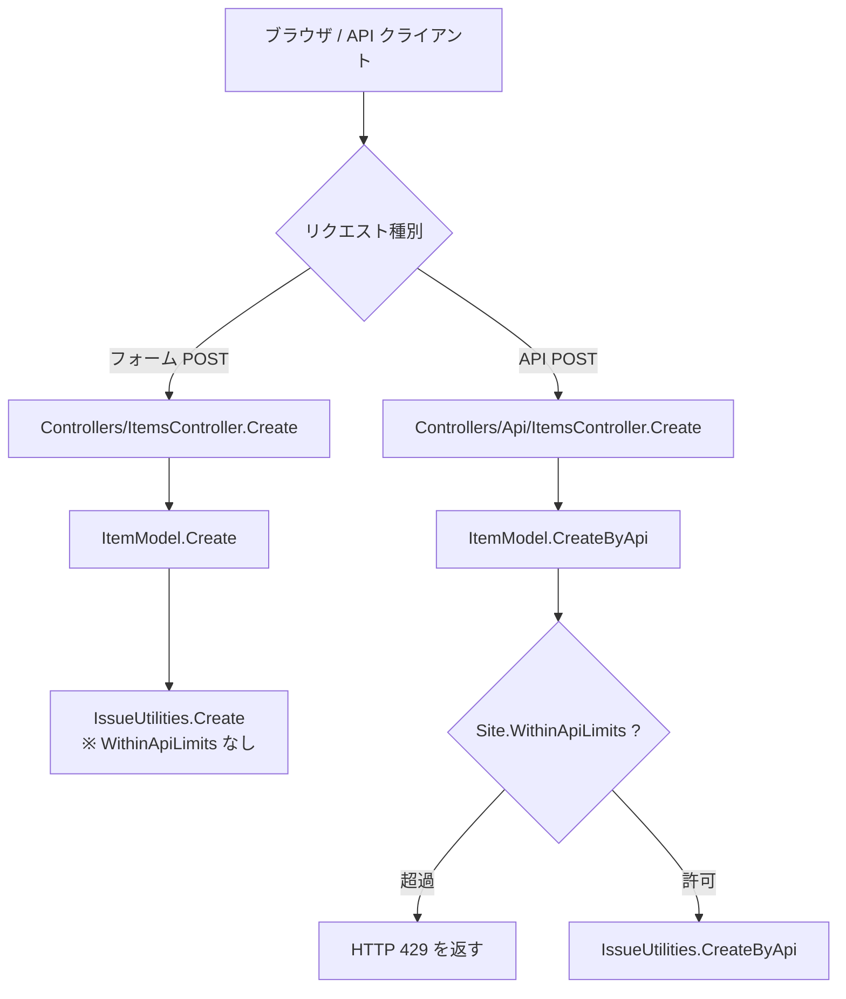
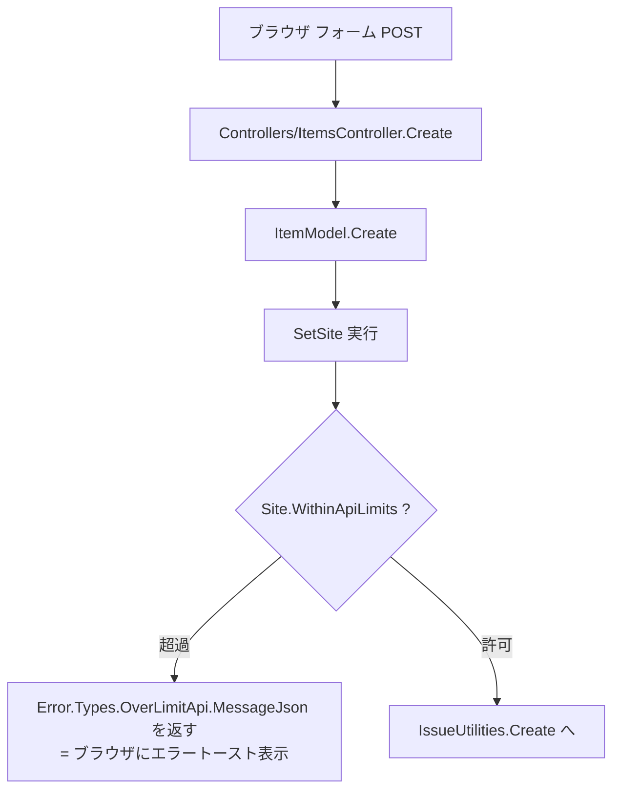
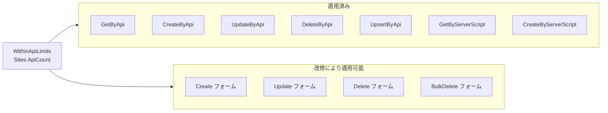

# フォーム投稿へのレートリミッター適用

プリザンターの既存 API レートリミッター機能をフォーム（ブラウザ UI）からの投稿にも適用する方法を調査する。必要な改修箇所・流用可能な既存インフラ・適用時の設計上の考慮点を明らかにする。

<!-- START doctoc generated TOC please keep comment here to allow auto update -->
<!-- DON'T EDIT THIS SECTION, INSTEAD RE-RUN doctoc TO UPDATE -->

- [調査情報](#調査情報)
- [調査目的](#調査目的)
- [現状の把握](#現状の把握)
    - [フォーム投稿のルーティング](#フォーム投稿のルーティング)
    - [フォーム投稿と API 投稿の処理分岐](#フォーム投稿と-api-投稿の処理分岐)
- [流用可能な既存インフラ](#流用可能な既存インフラ)
    - [WithinApiLimits メソッド](#withinapilimits-メソッド)
    - [フォーム用エラーレスポンス（Messages.ResponseOverLimitApi）](#フォーム用エラーレスポンスmessagesresponseoverlimitapi)
    - [Error.Types.OverLimitApi.MessageJson](#errortypesoverlimitapimessagejson)
- [適用方法](#適用方法)
    - [適用箇所の特定](#適用箇所の特定)
    - [改修イメージ（ItemModel.cs）](#改修イメージitemmodelcs)
    - [改修後の処理フロー](#改修後の処理フロー)
- [設計上の考慮点](#設計上の考慮点)
    - [カウンターの共有](#カウンターの共有)
    - [並行処理の制約](#並行処理の制約)
    - [UX への影響](#ux-への影響)
    - [設定の有効化](#設定の有効化)
- [適用範囲の整理](#適用範囲の整理)
- [結論](#結論)
- [関連ソースコード](#関連ソースコード)

<!-- END doctoc generated TOC please keep comment here to allow auto update -->

## 調査情報

| 調査日        | リポジトリ | ブランチ | タグ/バージョン    | コミット    | 備考     |
| ------------- | ---------- | -------- | ------------------ | ----------- | -------- |
| 2026年2月25日 | Pleasanter | main     | Pleasanter_1.5.1.0 | `34f162a43` | 初回調査 |

## 調査目的

- 既存の API レートリミッター (`WithinApiLimits`) をフォーム投稿にも適用する際の実装方針を明確にする
- 流用可能な既存コードと、追加改修が必要な箇所を整理する
- 適用時の設計上の考慮点（カウンター共有・競合・UX への影響）を洗い出す

---

## 現状の把握

### フォーム投稿のルーティング

フォームからの操作はブラウザが `Controllers/ItemsController.cs` にリクエストを送る。

**ファイル**: `Implem.Pleasanter/Controllers/ItemsController.cs`

```csharp
[HttpPost]
public string Create(long id)
{
    var context = new Context();
    var log = new SysLogModel(context: context);
    var json = new ItemModel(context: context, referenceId: id).Create(context: context);
    log.Finish(context: context, responseSize: json.Length);
    return json;
}
```

API からのリクエストは `Controllers/Api/ItemsController.cs` にルーティングされ、`CreateByApi` が呼ばれる。

| 呼び出し元コントローラー          | 呼び出しメソッド | レートリミット |
| --------------------------------- | ---------------- | -------------- |
| `Controllers/Api/ItemsController` | `CreateByApi`    | 適用済み       |
| `Controllers/ItemsController`     | `Create`         | 未適用         |

### フォーム投稿と API 投稿の処理分岐



---

## 流用可能な既存インフラ

フォーム投稿にレートリミッターを適用するうえで流用できる既存コードが揃っている。

### WithinApiLimits メソッド

**ファイル**: `Implem.Pleasanter/Models/Sites/SiteModel.cs`（行番号: 9527）

`SiteModel` のインスタンスメソッドとして定義されており、`ItemModel` 内ではすでに `SetSite()` 呼び出し後に
`this.Site` として参照できる。フォーム系メソッドも `SetSite()` を実行しているため、
`Site.WithinApiLimits(context)` をそのまま呼び出せる。

### フォーム用エラーレスポンス（Messages.ResponseOverLimitApi）

**ファイル**: `Implem.Pleasanter/Libraries/Responses/Messages.cs`（行番号: 3608）

```csharp
public static ResponseCollection ResponseOverLimitApi(
    Context context, string target = null, params string[] data)
{
    return ResponseMessage(
        context: context,
        message: OverLimitApi(context: context, data: data),
        target: target);
}
```

フォーム操作ではレスポンスとして `ResponseCollection` の JSON 文字列を返す必要がある。`Messages.ResponseOverLimitApi` はそのまま使用できるが、現時点ではコードベース内で一度も呼び出されていない（定義のみ）。

### Error.Types.OverLimitApi.MessageJson

**ファイル**: `Implem.Pleasanter/Libraries/General/Error.cs`（行番号: 471）

```csharp
case Types.OverLimitApi:
    return Messages.OverLimitApi(context: context, data: data);
```

```csharp
// 拡張メソッド
public static string MessageJson(this Types type, Context context, params string[] data)
{
    return new ResponseCollection(context: context).Message(type.Message(
        context: context, data: data)).ToJson();
}
```

`Error.Types.ItemsLimit.MessageJson(context)` が既存のフォーム処理で使われているパターンと同様に、
`Error.Types.OverLimitApi.MessageJson(context, siteId, limit)` で一行でエラー応答を返せる。

---

## 適用方法

### 適用箇所の特定

フォーム投稿のエントリポイントは `ItemModel` の以下のメソッドである。これらは `SetSite()` を呼び出してから処理を行っているため、その直後にレートリミットチェックを挿入できる。

| メソッド               | 説明                       |
| ---------------------- | -------------------------- |
| `ItemModel.Create`     | フォームによるレコード作成 |
| `ItemModel.Update`     | フォームによるレコード更新 |
| `ItemModel.Delete`     | フォームによるレコード削除 |
| `ItemModel.BulkDelete` | フォームによる一括削除     |

### 改修イメージ（ItemModel.cs）

**変更前**（`ItemModel.Create` の現状）:

```csharp
public string Create(Context context)
{
    SetSite(
        context: context,
        initSiteSettings: true);
    switch (Site.ReferenceType)
    {
        case "Issues":
            return IssueUtilities.Create(
                context: context,
                ss: Site.SiteSettings);
        // ...
    }
}
```

**変更後**（レートリミットチェックを追加）:

```csharp
public string Create(Context context)
{
    SetSite(
        context: context,
        initSiteSettings: true);
    if (!Site.WithinApiLimits(context: context))
    {
        return Error.Types.OverLimitApi.MessageJson(
            context: context,
            data: new[]
            {
                Site.SiteId.ToString(),
                context.ContractSettings.ApiLimit().ToString()
            });
    }
    switch (Site.ReferenceType)
    {
        case "Issues":
            return IssueUtilities.Create(
                context: context,
                ss: Site.SiteSettings);
        // ...
    }
}
```

`Update`・`Delete`・`BulkDelete` も同様のパターンで追加できる。

### 改修後の処理フロー



---

## 設計上の考慮点

### カウンターの共有

`WithinApiLimits` が操作する `Sites.ApiCount` は API リクエストと共通のカウンターである。フォーム投稿にそのまま適用した場合、以下の影響がある。

| 状況                                   | 影響                                                                                          |
| -------------------------------------- | --------------------------------------------------------------------------------------------- |
| API と UI の両方から使われている場合   | どちらの操作もカウントされるため制限に達しやすい                                              |
| フォームのみに別カウンターが欲しい場合 | `Sites` テーブルに `FormCount`/`FormCountDate` カラムを追加し、別メソッドを用意する必要がある |

**推奨**: API とフォームで制限を分けたい場合は、専用のカラムとメソッドを追加する。共通の制限で問題ない場合は既存の `WithinApiLimits` を流用できる。

### 並行処理の制約

`WithinApiLimits` はアプリケーション層のロックなしに「読み取り → インクリメント → DB 書き込み」を行う。同一サイトに対して複数のフォーム投稿が同時に発生すると、制限値をわずかに超えるリクエストが通る場合がある（詳細は記事「リクエストレートリミッター実装」を参照）。

### UX への影響

API クライアントは HTTP 429 と JSON レスポンスで制限超過を検知できるが、ブラウザからのフォーム操作では `ResponseCollection` による `alert-error` スタイルのトースト通知として表示される。メッセージは多言語対応済みのため、表示テキストの追加実装は不要である。

表示メッセージ例（日本語）:

```
ID: {siteId} のサイトで利用できるAPIの制限（{limit} 件/日）を超えました。
```

フォーム固有のメッセージが必要な場合は `App_Data/Displays/` 配下に別のメッセージ定義を追加する。

### 設定の有効化

デフォルトの `Parameters.Api.LimitPerSite: 0` は「制限なし」を意味する。フォームへの適用後も、値が `0`
のままであれば実質的にレートリミットは機能しない。適用と同時に `Api.json` の `LimitPerSite` を正の整数に
設定するか、`ContractSettings.ApiLimitPerSite` を設定する必要がある。

---

## 適用範囲の整理



---

## 結論

| 項目                       | 内容                                                                            |
| -------------------------- | ------------------------------------------------------------------------------- |
| 既存インフラの流用可否     | `Site.WithinApiLimits(context)` をそのまま流用できる                            |
| 主な改修箇所               | `ItemModel.cs` の `Create`・`Update`・`Delete`・`BulkDelete` メソッド           |
| エラー返却                 | `Error.Types.OverLimitApi.MessageJson(context, siteId, limit)` が使用可能       |
| カウンターの扱い           | API カウンターを共有するか、別カウンターを追加するかを要件に応じて選択する      |
| 設定の有効化               | `Parameters.Api.LimitPerSite` を正の整数に設定することで有効になる              |
| CodeDefiner 自動生成の影響 | `Sites` テーブルに新カラムを追加する場合は CodeDefiner のテンプレート修正が必要 |

---

## 関連ソースコード

| ファイル                                                   | 説明                                        |
| ---------------------------------------------------------- | ------------------------------------------- |
| `Implem.Pleasanter/Models/Items/ItemModel.cs`              | フォーム系エントリポイント（改修対象）      |
| `Implem.Pleasanter/Models/Sites/SiteModel.cs`              | `WithinApiLimits()` 実装                    |
| `Implem.Pleasanter/Libraries/Responses/Messages.cs`        | `ResponseOverLimitApi` 定義                 |
| `Implem.Pleasanter/Libraries/General/Error.cs`             | `Error.Types.OverLimitApi.MessageJson` 定義 |
| `Implem.Pleasanter/App_Data/Displays/OverLimitApi.json`    | エラーメッセージ多言語定義                  |
| `Implem.Pleasanter/App_Data/Parameters/Api.json`           | `LimitPerSite` パラメータ                   |
| `Implem.Pleasanter/Libraries/Settings/ContractSettings.cs` | テナント単位の制限設定                      |
