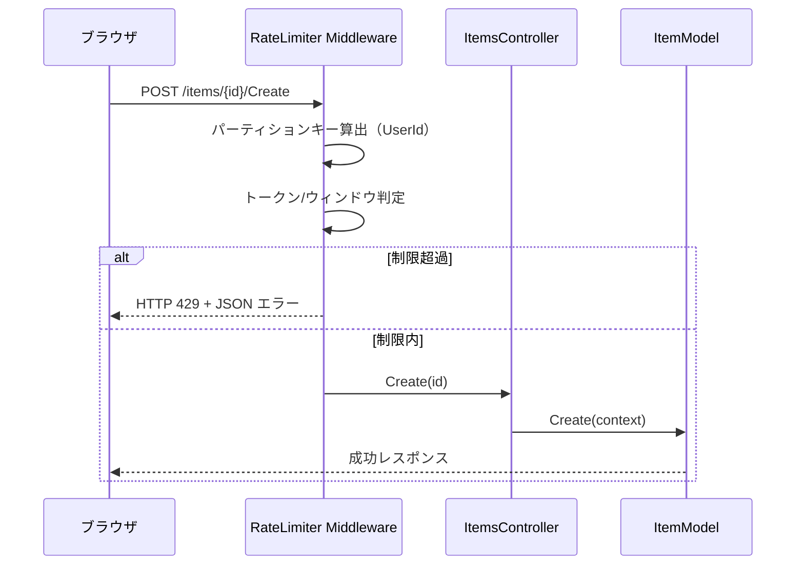
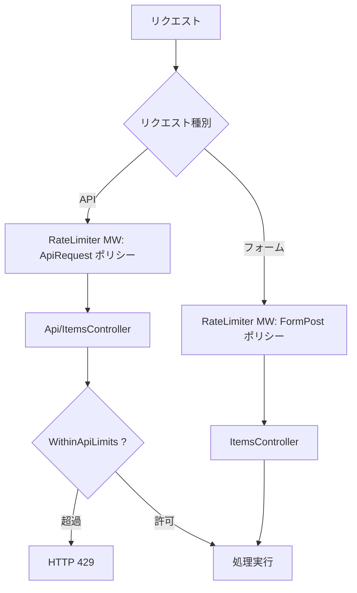

# ASP.NET Core レートリミッターミドルウェア適用

プリザンターのフォーム投稿機能に `Microsoft.AspNetCore.RateLimiting` / `System.Threading.RateLimiting`
を用いたレートリミッターを適用する方法を調査する。既存の自前実装（`WithinApiLimits`）との差異を比較し、
ミドルウェア方式の設計・実装方針を明らかにする。

<!-- START doctoc generated TOC please keep comment here to allow auto update -->
<!-- DON'T EDIT THIS SECTION, INSTEAD RE-RUN doctoc TO UPDATE -->

- [調査情報](#調査情報)
- [調査目的](#調査目的)
- [前提: .NET バージョンと利用可能なパッケージ](#前提-net-バージョンと利用可能なパッケージ)
- [ミドルウェアの概要](#ミドルウェアの概要)
    - [利用可能なアルゴリズム](#利用可能なアルゴリズム)
    - [既存自前実装との比較](#既存自前実装との比較)
- [フォーム投稿用ポリシーの設計](#フォーム投稿用ポリシーの設計)
    - [パーティションキーの選定](#パーティションキーの選定)
    - [推奨構成: 固定ウィンドウ + ユーザー ID パーティション](#推奨構成-固定ウィンドウ--ユーザー-id-パーティション)
- [実装方針](#実装方針)
    - [1. Startup.cs への登録（ConfigureServices）](#1-startupcs-への登録configureservices)
    - [2. ミドルウェアパイプラインへの挿入（Configure）](#2-ミドルウェアパイプラインへの挿入configure)
    - [3. コントローラーへのポリシー適用](#3-コントローラーへのポリシー適用)
    - [4. 処理フロー](#4-処理フロー)
- [パラメータ外部化の設計](#パラメータ外部化の設計)
    - [パラメータファイルの追加](#パラメータファイルの追加)
    - [パラメータクラスの追加](#パラメータクラスの追加)
    - [設定連携コード](#設定連携コード)
- [フォーム投稿における UX 上の考慮点](#フォーム投稿における-ux-上の考慮点)
    - [レスポンス形式の違い](#レスポンス形式の違い)
    - [対策案: OnRejected で ResponseCollection 形式を返す](#対策案-onrejected-で-responsecollection-形式を返す)
- [スケールアウト時の考慮](#スケールアウト時の考慮)
    - [分散構成への対応策](#分散構成への対応策)
- [既存実装との併用・移行戦略](#既存実装との併用移行戦略)
    - [併用パターン](#併用パターン)
    - [段階的移行パターン](#段階的移行パターン)
- [改修箇所のまとめ](#改修箇所のまとめ)
- [結論](#結論)
- [関連ソースコード](#関連ソースコード)
- [参考リンク](#参考リンク)

<!-- END doctoc generated TOC please keep comment here to allow auto update -->

## 調査情報

| 調査日        | リポジトリ | ブランチ | タグ/バージョン    | コミット    | 備考     |
| ------------- | ---------- | -------- | ------------------ | ----------- | -------- |
| 2026年2月26日 | Pleasanter | main     | Pleasanter_1.5.1.0 | `34f162a43` | 初回調査 |

## 調査目的

- ASP.NET Core 組み込みのレートリミッターミドルウェアをプリザンターに導入する方法を明らかにする
- 既存の自前実装（`SiteModel.WithinApiLimits`）と比較し、ミドルウェア方式の利点と制約を整理する
- フォーム投稿（ブラウザ UI）への適用を前提とした具体的な実装方針を示す

---

## 前提: .NET バージョンと利用可能なパッケージ

プリザンター 1.5.1.0 のターゲットフレームワークは **net10.0** である。

**ファイル**: `Implem.Pleasanter/Implem.Pleasanter.csproj`

```xml
<TargetFramework>net10.0</TargetFramework>
```

`Microsoft.AspNetCore.RateLimiting` は .NET 7 以降のランタイムに組み込まれており、
追加の NuGet パッケージは不要である。`System.Threading.RateLimiting` もフレームワークに同梱されている。

---

## ミドルウェアの概要

### 利用可能なアルゴリズム

`System.Threading.RateLimiting` は 4 種類のレートリミッターアルゴリズムを提供する。

| アルゴリズム             | クラス名                   | 特徴                                           |
| ------------------------ | -------------------------- | ---------------------------------------------- |
| 固定ウィンドウ           | `FixedWindowRateLimiter`   | 一定時間枠ごとに許可数をリセットする           |
| スライディングウィンドウ | `SlidingWindowRateLimiter` | 時間枠を細分化し、なめらかな流量制御を行う     |
| トークンバケット         | `TokenBucketRateLimiter`   | トークン補充方式。バースト許容と平均レート制御 |
| 同時実行数制限           | `ConcurrencyLimiter`       | 同時処理リクエスト数を制限する（時間軸なし）   |

### 既存自前実装との比較

| 項目             | 既存実装（WithinApiLimits）              | ASP.NET Core ミドルウェア                    |
| ---------------- | ---------------------------------------- | -------------------------------------------- |
| 制限単位         | サイト（SiteId）+ 日次リセット           | 任意のパーティションキー（IP、ユーザー等）   |
| 時間ウィンドウ   | 1 日固定                                 | 任意の時間幅（秒〜日単位で自由設定）         |
| アルゴリズム     | 固定ウィンドウのみ                       | 4 種類から選択可能                           |
| カウンター格納   | DB（Sites テーブル）                     | インメモリ（プロセス内）                     |
| 並行処理安全性   | ロックなし（レースコンディションあり）   | スレッドセーフ（内部ロック済み）             |
| 適用レイヤー     | アプリケーション層（モデル内チェック）   | HTTP ミドルウェア層（コントローラーの手前）  |
| 拒否時レスポンス | JSON（ResponseCollection / ApiResponse） | HTTP 503 または 429（カスタマイズ可能）      |
| スケールアウト   | DB 共有によりサーバー間でカウンター共有  | プロセスローカル（分散構成は別途対応が必要） |
| パッケージ追加   | 不要（自前実装済み）                     | 不要（net10.0 に組み込み済み）               |

---

## フォーム投稿用ポリシーの設計

### パーティションキーの選定

フォーム投稿に対するレートリミットでは、以下のパーティションキーが候補となる。

| パーティションキー | 取得元                                   | 特徴                                           |
| ------------------ | ---------------------------------------- | ---------------------------------------------- |
| IP アドレス        | `HttpContext.Connection.RemoteIpAddress` | 匿名ユーザー対策に有効。NAT 環境で共有される   |
| ユーザー ID        | `Context.UserId`                         | 認証済みユーザーごとに制限。未認証には適用不可 |
| テナント ID        | `Context.TenantId`                       | テナント単位の制限。マルチテナント向き         |
| サイト ID          | `Context.SiteId`                         | 既存実装と同じ粒度。ルートからの抽出が必要     |

### 推奨構成: 固定ウィンドウ + ユーザー ID パーティション

既存実装（日次 + サイト単位）に最も近い構成として、固定ウィンドウをユーザー ID でパーティションする
パターンを示す。

---

## 実装方針

### 1. Startup.cs への登録（ConfigureServices）

**ファイル**: `Implem.Pleasanter/Startup.cs`（`ConfigureServices` メソッドに追加）

```csharp
using Microsoft.AspNetCore.RateLimiting;
using System.Threading.RateLimiting;

// ConfigureServices 内に追加
services.AddRateLimiter(options =>
{
    // フォーム投稿用ポリシー
    options.AddPolicy("FormPost", context =>
    {
        var userId = context.User?.Identity?.IsAuthenticated == true
            ? context.User.FindFirst("UserId")?.Value ?? "anonymous"
            : "anonymous";
        return RateLimitPartition.GetFixedWindowLimiter(
            partitionKey: userId,
            factory: _ => new FixedWindowRateLimiterOptions
            {
                PermitLimit = 100,
                Window = TimeSpan.FromMinutes(1),
                QueueProcessingOrder = QueueProcessingOrder.OldestFirst,
                QueueLimit = 0
            });
    });

    // API 用ポリシー
    options.AddPolicy("ApiRequest", context =>
    {
        var apiKey = context.Request.Headers["X-Api-Key"]
            .FirstOrDefault() ?? "anonymous";
        return RateLimitPartition.GetTokenBucketLimiter(
            partitionKey: apiKey,
            factory: _ => new TokenBucketRateLimiterOptions
            {
                TokenLimit = 200,
                ReplenishmentPeriod = TimeSpan.FromMinutes(1),
                TokensPerPeriod = 200,
                QueueProcessingOrder = QueueProcessingOrder.OldestFirst,
                QueueLimit = 0,
                AutoReplenishment = true
            });
    });

    // 拒否時の HTTP ステータスコード
    options.RejectionStatusCode = StatusCodes.Status429TooManyRequests;

    // 拒否時のカスタムレスポンス
    options.OnRejected = async (context, cancellationToken) =>
    {
        context.HttpContext.Response.ContentType = "application/json";
        var response = new
        {
            StatusCode = 429,
            Message = "リクエスト制限を超えました。しばらく待ってから再試行してください。"
        };
        await context.HttpContext.Response.WriteAsJsonAsync(
            response, cancellationToken);
    };
});
```

### 2. ミドルウェアパイプラインへの挿入（Configure）

**ファイル**: `Implem.Pleasanter/Startup.cs`（`Configure` メソッドに追加）

```csharp
// UseRouting() の後、UseAuthentication() の前に配置
app.UseRouting();

// ここに追加
app.UseRateLimiter();

app.UseCors();
app.UseSession();
app.UseAuthentication();
app.UseAuthorization();
```

ミドルウェアの実行順序が重要である。`UseRouting()` の後に配置することで、ルート情報に基づいた
ポリシーの適用が可能になる。認証前に配置する場合は IP アドレスベース、認証後に配置する場合は
ユーザー ID ベースのパーティションが利用できる。

### 3. コントローラーへのポリシー適用

#### 方法 A: コントローラー属性による適用

**ファイル**: `Implem.Pleasanter/Controllers/ItemsController.cs`

```csharp
using Microsoft.AspNetCore.RateLimiting;

[Authorize]
[EnableRateLimiting("FormPost")]  // クラス全体に適用
public class ItemsController : Controller
{
    // 特定のアクションを除外する場合
    [DisableRateLimiting]
    [AcceptVerbs(HttpVerbs.Get)]
    public ActionResult Index(long id = 0)
    {
        // ...（一覧表示は制限対象外）
    }

    [HttpPost]
    // "FormPost" ポリシーが自動適用される
    public string Create(long id)
    {
        // ...
    }

    [HttpPut]
    public string Update(long id)
    {
        // ...
    }
}
```

#### 方法 B: エンドポイント単位での適用

**ファイル**: `Implem.Pleasanter/Startup.cs`（`UseEndpoints` 内）

```csharp
endpoints.MapControllerRoute(
    name: "Item",
    pattern: "{controller}/{id}/{action}",
    defaults: new
    {
        Controller = "Items",
        Action = "Edit"
    },
    constraints: new
    {
        Id = "[0-9]+",
        Action = "[A-Za-z][A-Za-z0-9_]*"
    })
    .RequireRateLimiting("FormPost");  // ルート単位で適用
```

#### 方法 C: API コントローラーへの別ポリシー適用

**ファイル**: `Implem.Pleasanter/Controllers/Api/ItemsController.cs`

```csharp
using Microsoft.AspNetCore.RateLimiting;

[CheckApiContextAttributes]
[AllowAnonymous]
[ApiController]
[Route("api/[controller]")]
[EnableRateLimiting("ApiRequest")]  // API 専用ポリシー
public class ItemsController : ControllerBase
{
    // ...
}
```

### 4. 処理フロー



---

## パラメータ外部化の設計

ハードコーディングを避け、プリザンターの既存パラメータ体系と統合する方式を示す。

### パラメータファイルの追加

**ファイル**: `Implem.Pleasanter/App_Data/Parameters/RateLimiting.json`（新規）

```json
{
    "FormPost": {
        "Enabled": true,
        "Algorithm": "FixedWindow",
        "PermitLimit": 100,
        "WindowSeconds": 60,
        "QueueLimit": 0
    },
    "ApiRequest": {
        "Enabled": true,
        "Algorithm": "TokenBucket",
        "TokenLimit": 200,
        "ReplenishmentPeriodSeconds": 60,
        "TokensPerPeriod": 200,
        "QueueLimit": 0
    }
}
```

### パラメータクラスの追加

**ファイル**: `Implem.ParameterAccessor/Parts/RateLimiting.cs`（新規）

```csharp
namespace Implem.ParameterAccessor.Parts
{
    public class RateLimiting
    {
        public RateLimitPolicy FormPost = new RateLimitPolicy();
        public RateLimitPolicy ApiRequest = new RateLimitPolicy();
    }

    public class RateLimitPolicy
    {
        public bool Enabled = false;
        public string Algorithm = "FixedWindow";
        public int PermitLimit = 100;
        public int WindowSeconds = 60;
        public int TokenLimit = 200;
        public int ReplenishmentPeriodSeconds = 60;
        public int TokensPerPeriod = 200;
        public int QueueLimit = 0;
    }
}
```

### 設定連携コード

```csharp
// Startup.ConfigureServices 内
if (Parameters.RateLimiting.FormPost.Enabled)
{
    services.AddRateLimiter(options =>
    {
        var config = Parameters.RateLimiting.FormPost;
        options.AddPolicy("FormPost", context =>
        {
            var userId = context.User?.Identity?.IsAuthenticated == true
                ? context.User.FindFirst("UserId")?.Value ?? "anonymous"
                : context.Connection.RemoteIpAddress?.ToString()
                    ?? "unknown";
            return RateLimitPartition.GetFixedWindowLimiter(
                partitionKey: userId,
                factory: _ => new FixedWindowRateLimiterOptions
                {
                    PermitLimit = config.PermitLimit,
                    Window = TimeSpan.FromSeconds(config.WindowSeconds),
                    QueueProcessingOrder =
                        QueueProcessingOrder.OldestFirst,
                    QueueLimit = config.QueueLimit
                });
        });

        options.RejectionStatusCode =
            StatusCodes.Status429TooManyRequests;
    });
}
```

---

## フォーム投稿における UX 上の考慮点

### レスポンス形式の違い

プリザンターのフォーム投稿は Ajax（`$.ajax`）で行われ、レスポンスは `ResponseCollection` 形式の
JSON 文字列である。ミドルウェアで HTTP 429 を返すと、フロントエンドの `$.ajax` ハンドラーが
`error` コールバックを受け取る。

プリザンターのフロントエンドには `$p.ajax` がラップした共通エラーハンドラーがあるため、
HTTP 429 を適切にハンドリングするにはフロントエンド側の修正が必要になる可能性がある。

| 項目           | 既存 WithinApiLimits 方式 | ミドルウェア方式                          |
| -------------- | ------------------------- | ----------------------------------------- |
| レスポンス形式 | `ResponseCollection` JSON | HTTP 429 + カスタム JSON                  |
| エラー表示     | トースト通知（自動表示）  | `$p.ajax` の error ハンドラーで処理が必要 |
| メッセージ     | 多言語対応済み            | `OnRejected` で個別実装                   |

### 対策案: OnRejected で ResponseCollection 形式を返す

ミドルウェアの `OnRejected` ハンドラーで、フォームリクエストの場合は `ResponseCollection` 形式の
JSON を返すようにすることで、既存のフロントエンドとの互換性を保てる。

```csharp
options.OnRejected = async (context, cancellationToken) =>
{
    var httpContext = context.HttpContext;
    var isFormRequest = !httpContext.Request.Path
        .StartsWithSegments("/api");

    if (isFormRequest)
    {
        // フォームリクエスト: ResponseCollection 互換形式
        httpContext.Response.StatusCode = 200;
        httpContext.Response.ContentType = "application/json";
        var json = new[]
        {
            new
            {
                Method = "Message",
                Target = (string)null,
                Value = new
                {
                    Id = "OverLimitApi",
                    Text = "リクエスト制限を超えました。"
                        + "しばらく待ってから再試行してください。",
                    Css = "alert-error"
                }
            }
        };
        await httpContext.Response.WriteAsJsonAsync(
            json, cancellationToken);
    }
    else
    {
        // API リクエスト: 標準 429
        httpContext.Response.StatusCode = 429;
        httpContext.Response.ContentType = "application/json";
        await httpContext.Response.WriteAsJsonAsync(
            new { StatusCode = 429, Message = "Rate limit exceeded." },
            cancellationToken);
    }
};
```

---

## スケールアウト時の考慮

ミドルウェア方式のカウンターはプロセスメモリ上に保持されるため、複数サーバー構成では
サーバーごとに独立したカウンターとなる。

| 構成               | 挙動                                                           |
| ------------------ | -------------------------------------------------------------- |
| シングルサーバー   | 正常に機能する                                                 |
| 複数サーバー（LB） | サーバーごとに独立。実効制限 = 設定値 x サーバー台数になりうる |

### 分散構成への対応策

- `IRateLimiterPolicy<TPartitionKey>` を実装し、Redis 等のバックエンドでカウンターを共有する
- プリザンターが既に `StackExchange.Redis` パッケージを参照しているため、Redis ベースの分散
  カウンターは比較的導入しやすい

---

## 既存実装との併用・移行戦略

### 併用パターン

既存の `WithinApiLimits`（DB ベース）をそのまま残し、ミドルウェア方式をフォーム投稿専用に
追加するパターン。



この構成では API は二重のレートリミット（ミドルウェア + DB）が適用される。
API に対してはミドルウェアを `[DisableRateLimiting]` で除外するか、
`WithinApiLimits` を削除してミドルウェアに一本化する選択肢がある。

### 段階的移行パターン

| フェーズ | 対象           | 方式                       | 備考                                      |
| -------- | -------------- | -------------------------- | ----------------------------------------- |
| 1        | フォーム投稿   | ミドルウェア（FormPost）   | 新規追加。既存 API には影響なし           |
| 2        | API リクエスト | ミドルウェア（ApiRequest） | WithinApiLimits と並行稼働で検証          |
| 3        | API リクエスト | ミドルウェアに一本化       | WithinApiLimits を削除。DB カウンター不要 |

---

## 改修箇所のまとめ

| 対象ファイル                                           | 変更内容                                              |
| ------------------------------------------------------ | ----------------------------------------------------- |
| `Implem.Pleasanter/Startup.cs`                         | `AddRateLimiter` 追加、`UseRateLimiter()` 追加        |
| `Implem.Pleasanter/Controllers/ItemsController.cs`     | `[EnableRateLimiting("FormPost")]` 属性追加           |
| `Implem.Pleasanter/Controllers/Api/ItemsController.cs` | `[EnableRateLimiting("ApiRequest")]` 属性追加（任意） |
| `Implem.ParameterAccessor/Parts/RateLimiting.cs`       | パラメータクラス新規作成                              |
| `App_Data/Parameters/RateLimiting.json`                | パラメータファイル新規作成                            |

---

## 結論

| 項目               | 内容                                                                    |
| ------------------ | ----------------------------------------------------------------------- |
| パッケージ追加     | 不要（net10.0 に組み込み済み）                                          |
| 推奨アルゴリズム   | 固定ウィンドウ（FixedWindow）またはトークンバケット（TokenBucket）      |
| 推奨パーティション | ユーザー ID（認証後）または IP アドレス（認証前）                       |
| 適用方式           | コントローラー属性 `[EnableRateLimiting]` またはエンドポイント単位      |
| スレッド安全性     | フレームワークが内部ロックを保証（既存実装の競合問題を解消）            |
| スケールアウト     | プロセスローカル。分散構成では Redis 等でカウンター共有が必要           |
| 既存実装との関係   | 併用可能。段階的にミドルウェアへ移行するアプローチを推奨                |
| UX への影響        | `OnRejected` で ResponseCollection 形式を返せばフロントエンド互換性維持 |

---

## 関連ソースコード

| ファイル                                               | 説明                         |
| ------------------------------------------------------ | ---------------------------- |
| `Implem.Pleasanter/Implem.Pleasanter.csproj`           | TargetFramework: net10.0     |
| `Implem.Pleasanter/Startup.cs`                         | ミドルウェアパイプライン定義 |
| `Implem.Pleasanter/Controllers/ItemsController.cs`     | フォーム系コントローラー     |
| `Implem.Pleasanter/Controllers/Api/ItemsController.cs` | API コントローラー           |
| `Implem.Pleasanter/Models/Sites/SiteModel.cs`          | 既存 WithinApiLimits 実装    |

## 参考リンク

- [Rate limiting middleware in ASP.NET Core](https://learn.microsoft.com/en-us/aspnet/core/performance/rate-limit)
- [System.Threading.RateLimiting API Reference](https://learn.microsoft.com/en-us/dotnet/api/system.threading.ratelimiting)
