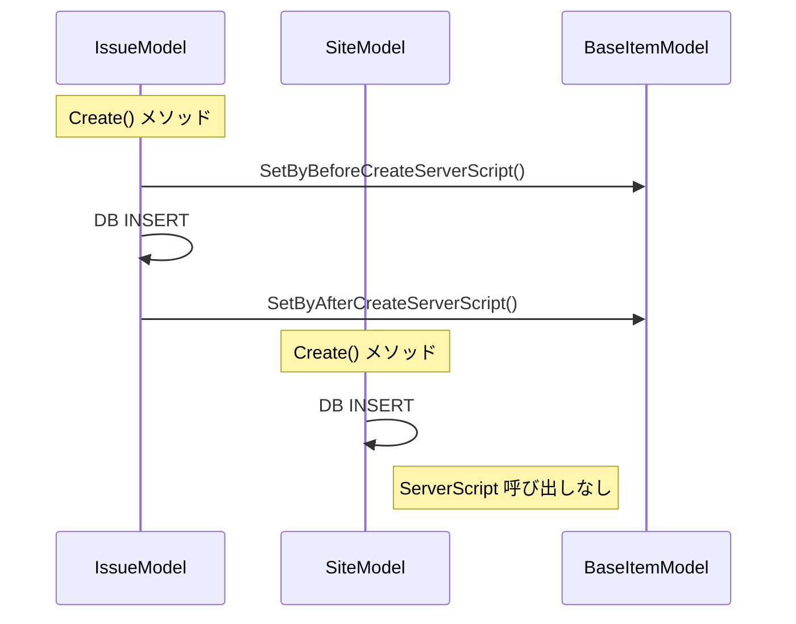
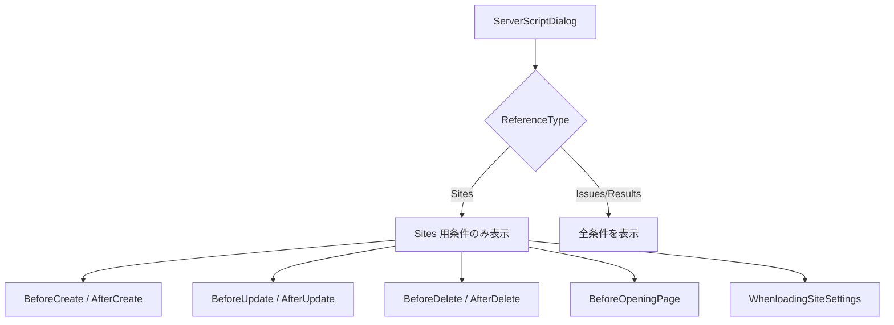
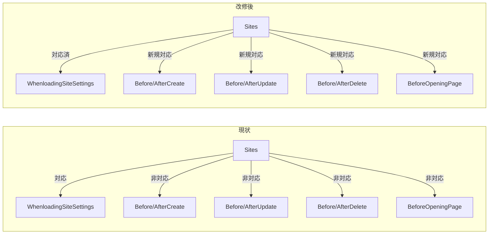

# ServerScript Sites 対応

サーバースクリプト（ServerScript）の実行可能箇所を Sites（フォルダ/テーブル定義）に拡大するための調査を行う。現状の実行条件の対応状況、制約箇所、改修に必要な変更点を明らかにする。

<!-- START doctoc generated TOC please keep comment here to allow auto update -->
<!-- DON'T EDIT THIS SECTION, INSTEAD RE-RUN doctoc TO UPDATE -->

- [調査情報](#調査情報)
- [調査目的](#調査目的)
- [現状の ServerScript 実行条件と Sites 対応状況](#現状の-serverscript-実行条件と-sites-対応状況)
    - [実行条件一覧](#実行条件一覧)
- [Sites でサーバースクリプトが実行されない原因](#sites-でサーバースクリプトが実行されない原因)
    - [原因1: UI での実行条件チェックボックスが非表示](#原因1-ui-での実行条件チェックボックスが非表示)
    - [原因2: API でのサーバースクリプト登録が制限されている](#原因2-api-でのサーバースクリプト登録が制限されている)
    - [原因3: SiteModel のライフサイクルメソッドでサーバースクリプトが呼ばれていない](#原因3-sitemodel-のライフサイクルメソッドでサーバースクリプトが呼ばれていない)
- [WhenloadingSiteSettings の動作](#whenloadingsitesettings-の動作)
- [items オブジェクトの既存 Sites 対応状況](#items-オブジェクトの既存-sites-対応状況)
    - [Sites 取得メソッド](#sites-取得メソッド)
    - [Sites 作成・操作メソッド](#sites-作成操作メソッド)
    - [GetSite で取得できる SiteModel の読み書き可能プロパティ](#getsite-で取得できる-sitemodel-の読み書き可能プロパティ)
    - [使用例](#使用例)
- [context オブジェクトで取得可能なサイト情報](#context-オブジェクトで取得可能なサイト情報)
    - [Sites 関連プロパティ](#sites-関連プロパティ)
    - [その他の有用なプロパティ](#その他の有用なプロパティ)
    - [context のメソッド](#context-のメソッド)
    - [画面条件での context と items の組み合わせ例](#画面条件での-context-と-items-の組み合わせ例)
- [siteSettings オブジェクトの機能](#sitesettings-オブジェクトの機能)
- [ServerScriptUtilities.Values() のモデル対応状況](#serverscriptutilitiesvalues-のモデル対応状況)
    - [共通プロパティ（BaseItemModel）](#共通プロパティbaseitemmodel)
    - [モデル固有プロパティ](#モデル固有プロパティ)
- [改修箇所一覧](#改修箇所一覧)
    - [改修1: UI の実行条件チェックボックスの表示](#改修1-ui-の実行条件チェックボックスの表示)
    - [改修2: API でのサーバースクリプト登録の許可](#改修2-api-でのサーバースクリプト登録の許可)
    - [改修3: SiteModel のライフサイクルメソッドにサーバースクリプト呼び出しを追加](#改修3-sitemodel-のライフサイクルメソッドにサーバースクリプト呼び出しを追加)
    - [改修4: ServerScriptUtilities.Values() に SiteModel 固有プロパティを追加](#改修4-serverscriptutilitiesvalues-に-sitemodel-固有プロパティを追加)
    - [改修5: SetByWhenloadingSiteSettingsServerScript のスキップ条件の見直し](#改修5-setbywhenloadingsitesettingsserverscript-のスキップ条件の見直し)
- [改修時の注意事項](#改修時の注意事項)
    - [SiteSettings の取得タイミング](#sitesettings-の取得タイミング)
    - [CodeDefiner 自動生成コードとの関係](#codedefiner-自動生成コードとの関係)
    - [サイト削除時の影響](#サイト削除時の影響)
    - [再帰呼び出し](#再帰呼び出し)
- [改修の全体像](#改修の全体像)
    - [改修ファイル一覧](#改修ファイル一覧)
- [結論](#結論)
- [関連ソースコード](#関連ソースコード)

<!-- END doctoc generated TOC please keep comment here to allow auto update -->

## 調査情報

| 調査日        | リポジトリ | ブランチ | タグ/バージョン    | コミット    | 備考     |
| ------------- | ---------- | -------- | ------------------ | ----------- | -------- |
| 2026年2月26日 | Pleasanter | main     | Pleasanter_1.5.1.0 | `34f162a43` | 初回調査 |

## 調査目的

- ServerScript の実行条件のうち、Sites に対して実行されているもの/されていないものを明確にする
- Sites に対してサーバースクリプトを実行可能にするために必要な改修箇所を洗い出す
- `items`/`context`/`siteSettings` オブジェクトの既存 Sites 対応状況を把握する
- Sites 固有情報（SiteId、SiteName 等）の読み書き方法を整理する
- 画面関連条件での `context` による情報取得と Sites 操作の実現方法を調査する
- 改修の影響範囲とリスクを評価する

---

## 現状の ServerScript 実行条件と Sites 対応状況

### 実行条件一覧

**ファイル**: `Implem.Pleasanter/Libraries/Settings/ServerScript.cs`

ServerScript クラスには以下の実行条件プロパティが定義されている。

| 実行条件                  | Issues | Results | Sites | 説明                 |
| ------------------------- | :----: | :-----: | :---: | -------------------- |
| `WhenloadingSiteSettings` |  対応  |  対応   | 対応  | サイト設定読み込み時 |
| `WhenViewProcessing`      |  対応  |  対応   |   -   | ビュー処理時         |
| `WhenloadingRecord`       |  対応  |  対応   |   -   | レコード読み込み時   |
| `BeforeFormula`           |  対応  |  対応   |   -   | 計算式実行前         |
| `AfterFormula`            |  対応  |  対応   |   -   | 計算式実行後         |
| `BeforeCreate`            |  対応  |  対応   |   -   | レコード作成前       |
| `AfterCreate`             |  対応  |  対応   |   -   | レコード作成後       |
| `BeforeUpdate`            |  対応  |  対応   |   -   | レコード更新前       |
| `AfterUpdate`             |  対応  |  対応   |   -   | レコード更新後       |
| `BeforeDelete`            |  対応  |  対応   |   -   | レコード削除前       |
| `AfterDelete`             |  対応  |  対応   |   -   | レコード削除後       |
| `BeforeBulkDelete`        |  対応  |  対応   |   -   | 一括削除前           |
| `AfterBulkDelete`         |  対応  |  対応   |   -   | 一括削除後           |
| `BeforeOpeningPage`       |  対応  |  対応   |   -   | ページ表示前         |
| `BeforeOpeningRow`        |  対応  |  対応   |   -   | 行表示前             |

Sites で対応済みなのは `WhenloadingSiteSettings` のみ。他の 14 条件は Sites では実行されない。

---

## Sites でサーバースクリプトが実行されない原因

### 原因1: UI での実行条件チェックボックスが非表示

**ファイル**: `Implem.Pleasanter/Models/Sites/SiteUtilities.cs`（行番号: 16737-16740）

```csharp
var enclosedCss = " enclosed" +
    (ss.ReferenceType == "Sites"
        ? " hidden"
        : string.Empty);
```

サーバースクリプトの設定ダイアログで、`ReferenceType == "Sites"` の場合は
実行条件チェックボックス群を含む `FieldSet` 全体に CSS クラス `hidden` が付与され、非表示になる。
この制御は Script/Style/HTML のダイアログでも同様に適用されている。

該当するダイアログと行番号:

| ダイアログ         | 行番号 |
| ------------------ | ------ |
| StyleDialog        | 15453  |
| ScriptDialog       | 15857  |
| HtmlDialog         | 16288  |
| ServerScriptDialog | 16737  |

### 原因2: API でのサーバースクリプト登録が制限されている

**ファイル**: `Implem.Pleasanter/Libraries/Settings/ApiSiteSetting.cs`（行番号: 13-17）

```csharp
public static List<string> ServerScriptRefTypes { get; } = new List<string>
{
    "Results",
    "Issues"
};
```

API 経由でサイト設定を更新する際、`ServerScriptRefTypes` に含まれる ReferenceType のみサーバースクリプトの登録が許可されている。`Sites` は含まれていないため、API 経由でもサーバースクリプトを登録できない。

**ファイル**: `Implem.Pleasanter/Models/Sites/SiteUtilities.cs`（行番号: 2404-2409）

```csharp
if (ApiSiteSetting.ServerScriptRefTypes.Contains(siteModel.ReferenceType)
    && siteSettingsApiModel.ServerScripts != null)
{
    siteModel.UpsertServerScriptByApi(
        siteSetting: ss,
        serverScriptsApiSiteSetting: siteSettingsApiModel.ServerScripts);
}
```

### 原因3: SiteModel のライフサイクルメソッドでサーバースクリプトが呼ばれていない

SiteModel は `BaseItemModel` を継承しており、`SetByBeforeCreateServerScript` 等のメソッドは利用可能であるが、`Create()`・`Update()`・`Delete()` メソッド内でこれらのメソッドが呼ばれていない。

**ファイル**: `Implem.Pleasanter/Models/Sites/SiteModel.cs`

#### IssueModel との比較



以下に、IssueModel と SiteModel の各ライフサイクルメソッドにおけるサーバースクリプト呼び出しの有無を示す。

| メソッド   | IssueModel                                                       | SiteModel    |
| ---------- | ---------------------------------------------------------------- | ------------ |
| `Create()` | `SetByBeforeCreateServerScript` + `SetByAfterCreateServerScript` | 呼び出しなし |
| `Update()` | `SetByBeforeUpdateServerScript` + `SetByAfterUpdateServerScript` | 呼び出しなし |
| `Delete()` | `SetByBeforeDeleteServerScript` + `SetByAfterDeleteServerScript` | 呼び出しなし |

---

## WhenloadingSiteSettings の動作

`WhenloadingSiteSettings` は唯一 Sites で動作するサーバースクリプト条件だが、その動作には注意が必要である。

**ファイル**: `Implem.Pleasanter/Models/Shared/_BaseModel.cs`（行番号: 758-786）

```csharp
public void SetByWhenloadingSiteSettingsServerScript(
    Context context,
    SiteSettings ss)
{
    if (context.Id == ss.SiteId)
    {
        switch (context.Action)
        {
            case "createbytemplate":
            case "edit":
            case "update":
            case "copy":
            case "delete":
            case "updatesitesettings":
                return;  // これらのアクションでは実行しない
        }
    }
    var scriptValues = ServerScriptUtilities.Execute(
        context: context,
        ss: ss,
        gridData: null,
        itemModel: null,   // itemModel は null
        view: null,
        where: script => script.WhenloadingSiteSettings == true,
        condition: ServerScriptConditions.WhenloadingSiteSettings);
    SetServerScriptModelColumns(context: context,
        ss: ss,
        scriptValues: scriptValues);
}
```

特徴:

- `itemModel: null` で実行されるため、`model` オブジェクトにはレコードのデータが含まれない
- サイト設定自体の編集操作（`edit`、`update`、`delete` 等）時には実行がスキップされる
- 主にレコード一覧表示やレコード編集画面を開いた際にサイト設定のカスタマイズ目的で使用される

---

## items オブジェクトの既存 Sites 対応状況

`items` オブジェクト（`ServerScriptModelApiItems`）は、
サーバースクリプトからレコードやサイトを操作するための API を提供する。
Sites に関する操作は既に複数サポートされている。

**ファイル**: `Implem.Pleasanter/Libraries/ServerScripts/ServerScriptModelApiItems.cs`

### Sites 取得メソッド

| メソッド                         | 引数              | 説明                               |
| -------------------------------- | ----------------- | ---------------------------------- |
| `items.GetSite(id)`              | SiteId            | SiteId でサイトを取得              |
| `items.GetSiteByTitle(title)`    | サイトタイトル    | タイトルでサイトを検索             |
| `items.GetSiteByName(siteName)`  | SiteName          | SiteName でサイトを検索            |
| `items.GetSiteByGroupName(name)` | SiteGroupName     | SiteGroupName でサイトを検索       |
| `items.GetClosestSite(name, id)` | SiteName, 起点 ID | 起点から最も近いサイトを名前で検索 |

### Sites 作成・操作メソッド

| メソッド                       | 説明                     |
| ------------------------------ | ------------------------ |
| `items.NewSite(referenceType)` | 新規 SiteModel を生成    |
| `items.Create(siteId, model)`  | サイト配下にレコード作成 |
| `items.Update(siteId, model)`  | サイト/レコードを更新    |
| `items.Delete(siteId)`         | サイト/レコードを削除    |

これらのメソッドは内部的に `ItemModel.CreateByServerScript()` 等を呼び出し、
`SiteUtilities.CreateByServerScript()` / `UpdateByServerScript()` /
`DeleteByServerScript()` に委譲される。

### GetSite で取得できる SiteModel の読み書き可能プロパティ

`items.GetSite()` 等で取得した結果は `ServerScriptModelApiModel` として返される。
このクラスは `DynamicObject` を継承しており、
SiteModel の場合は以下のプロパティが読み書き可能。

**ファイル**: `Implem.Pleasanter/Libraries/ServerScripts/ServerScriptModelApiModel.cs`（行番号: 103-176）

| プロパティ           | 型             | 読取 | 書込 | 説明                 |
| -------------------- | -------------- | :--: | :--: | -------------------- |
| `SiteId`             | `long`         |  可  |  -   | サイトID             |
| `SiteName`           | `string`       |  可  |  可  | サイト名             |
| `SiteGroupName`      | `string`       |  可  |  可  | サイトグループ名     |
| `ReferenceType`      | `string`       |  可  |  可  | 参照タイプ           |
| `ParentId`           | `long`         |  可  |  可  | 親サイトID           |
| `InheritPermission`  | `long`         |  可  |  可  | 権限継承元           |
| `Publish`            | `bool`         |  可  |  可  | 公開フラグ           |
| `DisableCrossSearch` | `bool`         |  可  |  可  | 横断検索無効         |
| `GridGuide`          | `string`       |  可  |  可  | 一覧ガイド           |
| `EditorGuide`        | `string`       |  可  |  可  | エディタガイド       |
| `CalendarGuide`      | `string`       |  可  |  可  | カレンダーガイド     |
| `CrosstabGuide`      | `string`       |  可  |  可  | クロス集計ガイド     |
| `GanttGuide`         | `string`       |  可  |  可  | ガントチャートガイド |
| `BurnDownGuide`      | `string`       |  可  |  可  | バーンダウンガイド   |
| `TimeSeriesGuide`    | `string`       |  可  |  可  | 時系列ガイド         |
| `AnalyGuide`         | `string`       |  可  |  可  | 分析ガイド           |
| `KambanGuide`        | `string`       |  可  |  可  | カンバンガイド       |
| `ImageLibGuide`      | `string`       |  可  |  可  | 画像ライブラリガイド |
| `SiteSettings`       | `SiteSettings` |  可  |  可  | サイト設定（JSON）   |
| `LockedTime`         | `Time`         |  可  |  可  | ロック日時           |
| `LockedUser`         | `User`         |  可  |  可  | ロックユーザー       |
| `ApiCountDate`       | `DateTime`     |  可  |  可  | API カウント日       |
| `ApiCount`           | `int`          |  可  |  可  | API カウント         |

加えて、`BaseItemModel` 共通プロパティ（`Title`、`Body`、`Ver`、
`Creator`、`Updator`、`CreatedTime`、`UpdatedTime`）も読み書き可能。

### 使用例

```javascript
// SiteId でサイト情報を取得
let site = items.GetSite(context.SiteId);
if (site.length > 0) {
    context.Log('SiteName: ' + site[0].SiteName);
    context.Log('ReferenceType: ' + site[0].ReferenceType);
    context.Log('ParentId: ' + site[0].ParentId);
}

// SiteName でサイトを検索
let sites = items.GetSiteByName('マスタテーブル');

// 新しいサイトを作成
let newSite = items.NewSite('Issues');
newSite.Title = '新しい課題管理';
newSite.SiteName = 'task-tracker';
newSite.Create(parentSiteId);

// サイト情報を更新
let target = items.GetSite(targetSiteId);
if (target.length > 0) {
    target[0].SiteName = '更新後のサイト名';
    target[0].Update();
}
```

---

## context オブジェクトで取得可能なサイト情報

`context` オブジェクト（`ServerScriptModelContext`）は、
現在のリクエストコンテキストに関する情報を提供する。
Sites 関連の情報も含まれている。

**ファイル**: `Implem.Pleasanter/Libraries/ServerScripts/ServerScriptModelContext.cs`

### Sites 関連プロパティ

| プロパティ      | 型       | 説明                                      |
| --------------- | -------- | ----------------------------------------- |
| `SiteId`        | `long`   | 現在のサイトID                            |
| `SiteTitle`     | `string` | 現在のサイトタイトル                      |
| `Id`            | `long`   | 現在のレコードID（サイトの場合は SiteId） |
| `ReferenceType` | `string` | 参照タイプ（Sites/Issues/Results 等）     |
| `Controller`    | `string` | コントローラー名                          |
| `Action`        | `string` | アクション名                              |

### その他の有用なプロパティ

| プロパティ     | 型       | 説明               |
| -------------- | -------- | ------------------ |
| `TenantId`     | `int`    | テナントID         |
| `UserId`       | `int`    | ユーザーID         |
| `LoginId`      | `string` | ログインID         |
| `DeptId`       | `int`    | 部署ID             |
| `Groups`       | `int[]`  | 所属グループID一覧 |
| `HasPrivilege` | `bool`   | 特権ユーザーフラグ |
| `ControlId`    | `string` | 操作コントロールID |
| `Condition`    | `string` | 実行条件           |
| `AbsoluteUri`  | `string` | リクエスト URI     |
| `Query`        | `string` | クエリ文字列       |
| `HttpMethod`   | `string` | HTTP メソッド      |

### context のメソッド

| メソッド                                   | 説明                       |
| ------------------------------------------ | -------------------------- |
| `context.Log(value)`                       | ログ出力                   |
| `context.Error(message)`                   | エラー設定                 |
| `context.AddMessage(text, css)`            | 画面メッセージ追加         |
| `context.Redirect(url)`                    | リダイレクト               |
| `context.AddResponse(method, target, ...)` | レスポンスコレクション追加 |
| `context.ResponseSet(target, value, ...)`  | UI 要素の値設定            |

### 画面条件での context と items の組み合わせ例

```javascript
// WhenloadingSiteSettings: サイト設定読み込み時
// context から現在のサイト情報を取得し、items で操作
context.Log('SiteId: ' + context.SiteId);
context.Log('SiteTitle: ' + context.SiteTitle);
context.Log('Action: ' + context.Action);

// 現在のサイト情報を items 経由で詳細取得
let site = items.GetSite(context.SiteId);
if (site.length > 0) {
    context.Log('SiteName: ' + site[0].SiteName);
    context.Log('ParentId: ' + site[0].ParentId);
}
```

---

## siteSettings オブジェクトの機能

`siteSettings` オブジェクト（`ServerScriptModelSiteSettings`）は、
現在のサイト設定に関する操作を提供する。

**ファイル**: `Implem.Pleasanter/Libraries/ServerScripts/ServerScriptModelSiteSettings.cs`

| プロパティ/メソッド | 型              | 説明                           |
| ------------------- | --------------- | ------------------------------ |
| `DefaultViewId`     | `int?`          | デフォルトビューID（読み書き） |
| `Sections`          | `List<Section>` | セクション一覧                 |
| `SiteId(title)`     | `long`          | タイトルからサイトIDを取得     |

---

## ServerScriptUtilities.Values() のモデル対応状況

**ファイル**: `Implem.Pleasanter/Libraries/ServerScripts/ServerScriptUtilities.cs`（行番号: 102-333）

`Values()` メソッドは、サーバースクリプトの `model` オブジェクトにマッピングするプロパティを定義している。

### 共通プロパティ（BaseItemModel）

全モデル共通で以下のプロパティが `model` オブジェクトに設定される。

| プロパティ    | 型         | 説明             |
| ------------- | ---------- | ---------------- |
| `ReadOnly`    | `bool`     | 読み取り専用     |
| `SiteId`      | `long`     | サイトID         |
| `Title`       | `string`   | タイトル         |
| `Body`        | `string`   | 本文             |
| `Ver`         | `int`      | バージョン       |
| `Creator`     | `int`      | 作成者ID         |
| `Updator`     | `int`      | 更新者ID         |
| `CreatedTime` | `DateTime` | 作成日時         |
| `UpdatedTime` | `DateTime` | 更新日時         |
| `Comments`    | `string`   | コメント（JSON） |

加えて、拡張カラム（ClassHash、NumHash、DateHash、DescriptionHash、CheckHash、AttachmentsHash）も動的に追加される。

### モデル固有プロパティ

```csharp
if (model is IssueModel issueModel)
{
    // IssueId, StartTime, CompletionTime, WorkValue, ProgressRate,
    // RemainingWorkValue, Status, Manager, Owner, Locked
}
if (model is ResultModel resultModel)
{
    // ResultId, Status, Manager, Owner, Locked
}
// SiteModel の場合: 固有プロパティの追加なし
```

SiteModel が `itemModel` として渡された場合、共通プロパティは設定されるが、
SiteModel 固有のプロパティ（`SiteName`、`SiteGroupName`、`ReferenceType`、`ParentId`、
各種 Guide 等）は `model` オブジェクトに含まれない。

---

## 改修箇所一覧

Sites でサーバースクリプトを実行可能にするために必要な改修箇所を以下に示す。

### 改修1: UI の実行条件チェックボックスの表示

**ファイル**: `Implem.Pleasanter/Models/Sites/SiteUtilities.cs`

`ServerScriptDialog()` メソッドの `enclosedCss` 変数を変更し、`Sites` の場合も条件チェックボックスを表示する。ただし、Sites では意味のない条件（`WhenloadingRecord`、`BeforeFormula`、`AfterFormula`、`BeforeOpeningRow`、`BeforeBulkDelete`、`AfterBulkDelete`）は個別に非表示にする制御が必要。



#### Sites で有効にすべき条件

| 条件                      | Sites での用途                           | 対応可否 |
| ------------------------- | ---------------------------------------- | :------: |
| `WhenloadingSiteSettings` | 既に対応済み                             |  対応済  |
| `BeforeCreate`            | サイト作成前のバリデーション・初期値設定 |    可    |
| `AfterCreate`             | サイト作成後の通知・連携処理             |    可    |
| `BeforeUpdate`            | サイト設定変更前のバリデーション         |    可    |
| `AfterUpdate`             | サイト設定変更後の通知・連携処理         |    可    |
| `BeforeDelete`            | サイト削除前の確認・依存チェック         |    可    |
| `AfterDelete`             | サイト削除後のクリーンアップ             |    可    |
| `BeforeOpeningPage`       | サイト管理画面表示前のカスタマイズ       |    可    |

#### Sites で対応不要な条件

| 条件                 | 対応不要の理由                       |
| -------------------- | ------------------------------------ |
| `WhenViewProcessing` | Sites にはビュー処理がない           |
| `WhenloadingRecord`  | Sites のレコード読み込みの概念がない |
| `BeforeFormula`      | Sites に計算式機能がない             |
| `AfterFormula`       | Sites に計算式機能がない             |
| `BeforeOpeningRow`   | Sites には行表示がない               |
| `BeforeBulkDelete`   | Sites の一括削除操作がない           |
| `AfterBulkDelete`    | Sites の一括削除操作がない           |

### 改修2: API でのサーバースクリプト登録の許可

**ファイル**: `Implem.Pleasanter/Libraries/Settings/ApiSiteSetting.cs`（行番号: 13-17）

`ServerScriptRefTypes` に `"Sites"` を追加する。

```csharp
public static List<string> ServerScriptRefTypes { get; } = new List<string>
{
    "Results",
    "Issues",
    "Sites"    // 追加
};
```

### 改修3: SiteModel のライフサイクルメソッドにサーバースクリプト呼び出しを追加

**ファイル**: `Implem.Pleasanter/Models/Sites/SiteModel.cs`

SiteModel の `Create()`、`Update()`、`Delete()` メソッドに、`BaseItemModel` から継承した `SetBy*ServerScript()` メソッドの呼び出しを追加する。

#### Create() メソッドの改修イメージ

```csharp
public ErrorData Create(Context context, bool otherInitValue = false)
{
    // ... 既存の初期化処理 ...

    SetByBeforeCreateServerScript(   // 追加
        context: context,
        ss: SiteSettings);

    var response = Repository.ExecuteScalar_response(
        context: context,
        transactional: true,
        selectIdentity: true,
        statements: new SqlStatement[] { /* ... */ });

    SiteId = response.Id ?? SiteId;
    Get(context: context);

    // ... 権限設定等 ...

    SetByAfterCreateServerScript(    // 追加
        context: context,
        ss: SiteSettings);

    return new ErrorData(type: Error.Types.None);
}
```

#### Update() メソッドの改修イメージ

```csharp
public ErrorData Update(Context context, SiteSettings ss, ...)
{
    // ... 既存処理 ...

    SetByBeforeUpdateServerScript(   // 追加
        context: context,
        ss: ss);

    var response = Repository.ExecuteScalar_response(/* ... */);

    // ... 既存処理 ...

    SetByAfterUpdateServerScript(    // 追加
        context: context,
        ss: ss);

    return new ErrorData(type: Error.Types.None);
}
```

#### Delete() メソッドの改修イメージ

```csharp
public ErrorData Delete(Context context, SiteSettings ss)
{
    SetByBeforeDeleteServerScript(   // 追加
        context: context,
        ss: ss);

    // ... 既存の削除処理 ...

    SetByAfterDeleteServerScript(    // 追加
        context: context,
        ss: ss);

    return new ErrorData(type: Error.Types.None);
}
```

### 改修4: ServerScriptUtilities.Values() に SiteModel 固有プロパティを追加

**ファイル**: `Implem.Pleasanter/Libraries/ServerScripts/ServerScriptUtilities.cs`（行番号: 102-333）

IssueModel・ResultModel と同様に、SiteModel の場合の分岐を追加する。

```csharp
if (model is SiteModel siteModel)
{
    values.Add(ReadNameValue(context, ss, "SiteName", siteModel.SiteName, mine));
    values.Add(ReadNameValue(context, ss, "SiteGroupName", siteModel.SiteGroupName, mine));
    values.Add(ReadNameValue(context, ss, "ReferenceType", siteModel.ReferenceType, mine));
    values.Add(ReadNameValue(context, ss, "ParentId", siteModel.ParentId, mine));
    values.Add(ReadNameValue(context, ss, "InheritPermission", siteModel.InheritPermission, mine));
    values.Add(ReadNameValue(context, ss, "Publish", siteModel.Publish, mine));
    values.Add(ReadNameValue(context, ss, "DisableCrossSearch", siteModel.DisableCrossSearch, mine));
}
```

### 改修5: SetByWhenloadingSiteSettingsServerScript のスキップ条件の見直し

**ファイル**: `Implem.Pleasanter/Models/Shared/_BaseModel.cs`（行番号: 758-786）

現在、`context.Id == ss.SiteId` かつ `context.Action` が `edit`、`update`、`delete` 等の場合に
スキップされる。サイト自身の CRUD 操作でサーバースクリプトを実行する場合、
`BeforeCreate` 等の条件で処理するため、`WhenloadingSiteSettings` のスキップ条件はそのままでよい。

---

## 改修時の注意事項

### SiteSettings の取得タイミング

SiteModel の `Create()` メソッドでは、`SiteSettings` は DB INSERT 後に
`SiteSettingsUtilities.Get()` で再取得される。
サーバースクリプトは `SiteSettings` に格納されるため、
`BeforeCreate` を実行するには新規作成用の `SiteSettings` が必要になる。
SiteModel の Create では `SiteSettings = new SiteSettings(context, referenceType)` で
初期化しているため、この時点の SiteSettings にサーバースクリプトが含まれていない可能性がある。

Sites の `BeforeCreate` を実現するには、親サイトの SiteSettings からサーバースクリプトを取得して実行する設計が必要。

### CodeDefiner 自動生成コードとの関係

IssueModel/ResultModel の `SetByBeforeCreateServerScript` 等の呼び出しは
CodeDefiner で自動生成されたコードに含まれている。
SiteModel は手動メンテナンスのコード（`/// Fixed:` マーク）が多いため、
CodeDefiner のテンプレートを変更するのではなく、SiteModel.cs を直接編集する方針が適切。

### サイト削除時の影響

SiteModel の `Delete()` は子サイトとその配下のレコード
（Issues、Results、Wikis、Dashboards）を一括削除する。
`BeforeDelete` でサーバースクリプトを実行する場合、
削除対象の子サイト一覧を `model` オブジェクト経由でスクリプトに公開するかどうかを検討する必要がある。

### 再帰呼び出し

サーバースクリプト内で `items` オブジェクトを使ってサイトを操作した場合に、
再度サーバースクリプトが実行される可能性がある。
既存の深度制限（`context.ServerScriptDepth < 10`）で保護されているが、
Sites 操作でもこの制限が有効であることを確認する必要がある。

---

## 改修の全体像



### 改修ファイル一覧

| #   | ファイル                                           | 改修内容                                                        | 影響度 |
| --- | -------------------------------------------------- | --------------------------------------------------------------- | :----: |
| 1   | `Models/Sites/SiteUtilities.cs`                    | `enclosedCss` の Sites 判定を条件別に変更                       |   中   |
| 2   | `Libraries/Settings/ApiSiteSetting.cs`             | `ServerScriptRefTypes` に `"Sites"` を追加                      |   低   |
| 3   | `Models/Sites/SiteModel.cs`                        | `Create()`/`Update()`/`Delete()` に ServerScript 呼び出しを追加 |   高   |
| 4   | `Libraries/ServerScripts/ServerScriptUtilities.cs` | `Values()` に SiteModel 固有プロパティ分岐を追加                |   中   |
| 5   | `Libraries/ServerScripts/ServerScriptUtilities.cs` | `SavedValues()` に SiteModel 固有プロパティ分岐を追加           |   中   |

---

## 結論

| 項目                    | 内容                                                                                                                                            |
| ----------------------- | ----------------------------------------------------------------------------------------------------------------------------------------------- |
| 現状の Sites 対応状況   | 15 条件中、`WhenloadingSiteSettings` のみ対応済。他の 14 条件は未対応                                                                           |
| items API の Sites 対応 | `GetSite`/`NewSite`/`Create`/`Update`/`Delete` は既にサポート済。SiteModel 固有プロパティの読み書きも対応済                                     |
| context の Sites 情報   | `SiteId`、`SiteTitle`、`ReferenceType`、`Action` 等で現在のサイト情報を取得可能                                                                 |
| 未対応の原因            | UI 非表示（CSS `hidden`）、API 制限（`ServerScriptRefTypes`）、モデルメソッド未呼び出し                                                         |
| 対応可能な条件          | `BeforeCreate`、`AfterCreate`、`BeforeUpdate`、`AfterUpdate`、`BeforeDelete`、`AfterDelete`、`BeforeOpeningPage` の 7 条件                      |
| 対応不要な条件          | `WhenViewProcessing`、`WhenloadingRecord`、`BeforeFormula`、`AfterFormula`、`BeforeOpeningRow`、`BeforeBulkDelete`、`AfterBulkDelete` の 7 条件 |
| 改修ファイル数          | 4-5 ファイル                                                                                                                                    |
| 主な改修リスク          | `BeforeCreate` 時の SiteSettings 未確定問題、サイト削除時の子サイト連鎖                                                                         |
| 既存機能への影響        | SiteModel は `BaseItemModel` を継承済みのため、ServerScript メソッドは利用可能。新規メソッド追加は不要                                          |
| model/saved での制約    | `Values()`/`SavedValues()` に SiteModel 分岐がないため、ライフサイクル条件での `model` オブジェクトに Site 固有プロパティが未設定               |

---

## 関連ソースコード

| ファイル                                                                     | 内容                                                           |
| ---------------------------------------------------------------------------- | -------------------------------------------------------------- |
| `Implem.Pleasanter/Libraries/Settings/ServerScript.cs`                       | ServerScript データモデル・実行条件プロパティ                  |
| `Implem.Pleasanter/Libraries/Settings/ApiSiteSetting.cs`                     | API 経由サーバースクリプト登録の ReferenceType 制限            |
| `Implem.Pleasanter/Libraries/ServerScripts/ServerScriptUtilities.cs`         | ServerScript 実行エンジン・Values() プロパティマッピング       |
| `Implem.Pleasanter/Libraries/ServerScripts/ServerScriptModelApiItems.cs`     | items オブジェクト（GetSite/NewSite/CRUD）                     |
| `Implem.Pleasanter/Libraries/ServerScripts/ServerScriptModelApiModel.cs`     | API モデル（SiteModel 読み書きプロパティ定義）                 |
| `Implem.Pleasanter/Libraries/ServerScripts/ServerScriptModelContext.cs`      | context オブジェクト（サイト情報含む）                         |
| `Implem.Pleasanter/Libraries/ServerScripts/ServerScriptModelSiteSettings.cs` | siteSettings オブジェクト                                      |
| `Implem.Pleasanter/Models/Shared/_BaseModel.cs`                              | SetBy\*ServerScript メソッド定義（BaseItemModel）              |
| `Implem.Pleasanter/Models/Sites/SiteModel.cs`                                | SiteModel ライフサイクルメソッド（Create/Update/Delete）       |
| `Implem.Pleasanter/Models/Sites/SiteUtilities.cs`                            | サーバースクリプト設定ダイアログ UI・ServerScript 操作メソッド |
