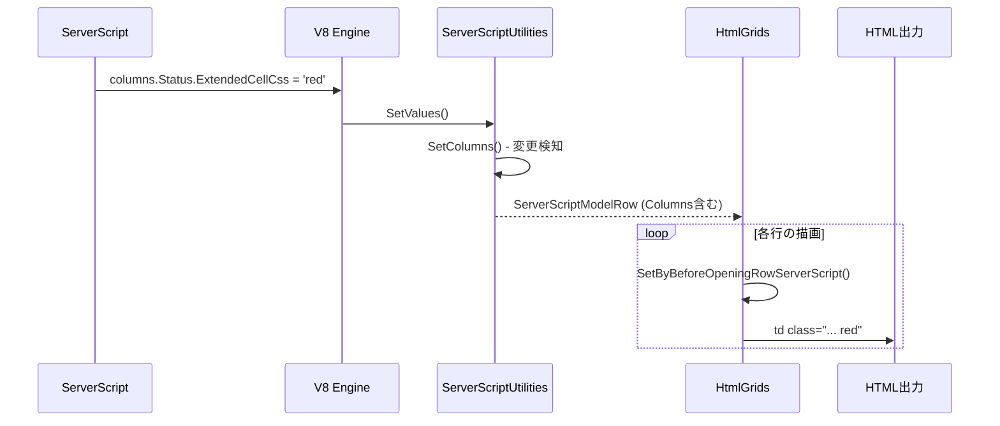
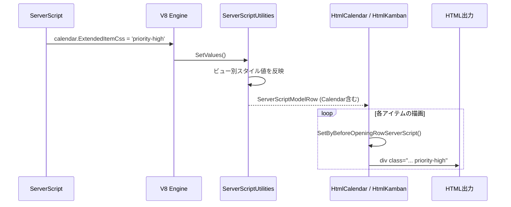

# ServerScript ビュー別スタイル設定

サーバースクリプトでカレンダー・クロス集計・ガントチャート・時系列・カンバンの各ビューに対してスタイル（CSS クラス等）を動的に設定できるようにするための調査を行う。
現行の `columns` オブジェクトによる一覧画面のスタイル制御の仕組みを分析し、各ビューモードへの拡張方針を示す。

<!-- START doctoc generated TOC please keep comment here to allow auto update -->
<!-- DON'T EDIT THIS SECTION, INSTEAD RE-RUN doctoc TO UPDATE -->

- [調査情報](#調査情報)
- [調査目的](#調査目的)
- [現行の columns によるスタイル設定](#現行の-columns-によるスタイル設定)
    - [columns オブジェクトの構造](#columns-オブジェクトの構造)
    - [サーバースクリプトからの利用例](#サーバースクリプトからの利用例)
    - [columns のV8 エンジンへの登録](#columns-のv8-エンジンへの登録)
    - [BeforeOpeningRow によるスタイル適用](#beforeopeningrow-によるスタイル適用)
- [各ビューの現状分析](#各ビューの現状分析)
    - [ビューモードの描画コードと ServerScriptModelRow の参照状況](#ビューモードの描画コードと-serverscriptmodelrow-の参照状況)
    - [各ビューの要素クラス](#各ビューの要素クラス)
- [ServerScript ホストオブジェクトの全体構成](#serverscript-ホストオブジェクトの全体構成)
- [拡張方針](#拡張方針)
    - [方針概要](#方針概要)
    - [ホストオブジェクト設計](#ホストオブジェクト設計)
    - [各ホストオブジェクトのプロパティ案](#各ホストオブジェクトのプロパティ案)
- [改修箇所の整理](#改修箇所の整理)
    - [1. ServerScript モデルクラスの追加](#1-serverscript-モデルクラスの追加)
    - [2. ServerScriptModel への統合](#2-serverscriptmodel-への統合)
    - [3. V8 エンジンへの登録](#3-v8-エンジンへの登録)
    - [4. SetValues での値反映](#4-setvalues-での値反映)
    - [5. 各ビュー要素クラスへのスタイルプロパティ追加](#5-各ビュー要素クラスへのスタイルプロパティ追加)
    - [6. 描画コードでのスタイル反映](#6-描画コードでのスタイル反映)
    - [7. BeforeOpeningRow の拡張](#7-beforeopeningrow-の拡張)
- [アイテム単位と全体単位のスタイル設定](#アイテム単位と全体単位のスタイル設定)
    - [アイテム単位（BeforeOpeningRow 拡張が必要）](#アイテム単位beforeopeningrow-拡張が必要)
    - [全体単位（BeforeOpeningPage で設定）](#全体単位beforeopeningpage-で設定)
- [処理フロー](#処理フロー)
    - [現行: 一覧画面での columns スタイル適用フロー](#現行-一覧画面での-columns-スタイル適用フロー)
    - [拡張後: カレンダー・カンバン等でのスタイル適用フロー](#拡張後-カレンダーカンバン等でのスタイル適用フロー)
- [考慮事項](#考慮事項)
    - [パフォーマンスへの影響](#パフォーマンスへの影響)
    - [FullCalendar との連携](#fullcalendar-との連携)
    - [ガントチャートの特殊性](#ガントチャートの特殊性)
    - [時系列チャートの制約](#時系列チャートの制約)
    - [後方互換性](#後方互換性)
- [結論](#結論)
- [関連ソースコード](#関連ソースコード)

<!-- END doctoc generated TOC please keep comment here to allow auto update -->

## 調査情報

| 調査日        | リポジトリ | ブランチ | タグ/バージョン    | コミット    | 備考     |
| ------------- | ---------- | -------- | ------------------ | ----------- | -------- |
| 2026年2月26日 | Pleasanter | main     | Pleasanter_1.5.1.0 | `34f162a43` | 初回調査 |

## 調査目的

- 現行のサーバースクリプトで一覧画面の `columns` オブジェクトを通じたスタイル設定がどのように実装されているかを把握する
- カレンダー・クロス集計・ガントチャート・時系列・カンバンの各ビューで、サーバースクリプトからスタイルを動的に制御するための拡張方針を示す
- 各ビューの描画コードが `ServerScriptModelRow` を参照しているかを確認し、不足箇所を洗い出す

---

## 現行の columns によるスタイル設定

### columns オブジェクトの構造

サーバースクリプトに公開される `columns` は `ExpandoObject` であり、各カラム名をキーとして `ServerScriptModelColumn` インスタンスを値に持つ。

**ファイル**: `Libraries/ServerScripts/ServerScriptModel.cs`（192-335行）

| プロパティ                           | 型         | 用途                                      |
| ------------------------------------ | ---------- | ----------------------------------------- |
| `LabelText`                          | string     | ラベル表示テキストの動的変更              |
| `LabelRaw`                           | string     | ラベルの生 HTML 出力                      |
| `RawText`                            | string     | セルの生テキスト出力                      |
| `ReadOnly`                           | bool       | 編集不可の動的制御                        |
| `Hide`                               | bool       | 非表示の動的制御                          |
| `ValidateRequired`                   | bool       | 必須バリデーションの動的制御              |
| `ExtendedFieldCss`                   | string     | フィールド全体に追加する CSS クラス       |
| `ExtendedControlCss`                 | string     | コントロール要素に追加する CSS クラス     |
| `ExtendedCellCss`                    | string     | 一覧画面のセル（td）に追加する CSS クラス |
| `ExtendedHtmlBeforeField`            | string     | フィールド前に挿入する HTML               |
| `ExtendedHtmlBeforeLabel`            | string     | ラベル前に挿入する HTML                   |
| `ExtendedHtmlBetweenLabelAndControl` | string     | ラベルとコントロールの間に挿入する HTML   |
| `ExtendedHtmlAfterControl`           | string     | コントロール後に挿入する HTML             |
| `ExtendedHtmlAfterField`             | string     | フィールド後に挿入する HTML               |
| `ChoiceHash`                         | Dictionary | 選択肢の動的設定                          |

### サーバースクリプトからの利用例

```javascript
// 一覧画面でのスタイル設定
columns.Status.ExtendedCellCss = 'highlight-red';
columns.Title.LabelText = '案件名';
columns.ClassA.Hide = true;
```

### columns のV8 エンジンへの登録

**ファイル**: `Libraries/ServerScripts/ServerScriptUtilities.cs`（1141行）

```csharp
engine.AddHostObject("columns", model.Columns);
```

### BeforeOpeningRow によるスタイル適用

一覧画面では、各行の描画時に `SetByBeforeOpeningRowServerScript` が呼ばれ、行ごとのスタイル設定が可能になっている。

**ファイル**: `Libraries/HtmlParts/HtmlGrids.cs`（319-378行）

```csharp
ServerScriptModelRow serverScriptModelRow = null;
// ...
serverScriptModelRow = issueModel?.SetByBeforeOpeningRowServerScript(
    context: context,
    ss: ss);
// ...
var extendedRowCss = serverScriptModelRow?.ExtendedRowCss;
// ...
var serverScriptModelColumn = serverScriptModelRow
    ?.Columns?.Get(column.ColumnName);
// ...
+ $" {serverScriptModelColumn?.ExtendedCellCss}",
```

---

## 各ビューの現状分析

### ビューモードの描画コードと ServerScriptModelRow の参照状況

| ビューモード   | 描画クラス       | ServerScriptModelRow 参照 | BeforeOpeningRow 呼び出し |
| -------------- | ---------------- | :-----------------------: | :-----------------------: |
| 一覧（Grid）   | `HtmlGrids`      |           あり            |           あり            |
| カレンダー     | `HtmlCalendar`   |           なし            |           なし            |
| クロス集計     | `HtmlCrosstab`   |           なし            |           なし            |
| ガントチャート | `HtmlGantt`      |           なし            |           なし            |
| 時系列         | `HtmlTimeSeries` |           なし            |           なし            |
| カンバン       | `HtmlKamban`     |           なし            |           なし            |
| リンク         | `HtmlLinks`      |           あり            |           あり            |

一覧画面とリンクテーブルのみが `ServerScriptModelRow` を参照しており、それ以外のビューモードでは `columns` のスタイル設定が反映されない。

### 各ビューの要素クラス

各ビューモードは専用の要素クラスを持つが、CSS クラスやスタイルを保持するプロパティは存在しない。

**カレンダー: `CalendarElement`**（`Libraries/ViewModes/CalendarElement.cs`）

```csharp
public class CalendarElement
{
    public long Id;
    public long SiteId;
    public string Title;
    public string Time;
    public string DateFormat;
    public DateTime From;
    public DateTime? To;
    public bool? Changed;
    public string StatusHtml;
}
```

**クロス集計: `CrosstabElement`**（`Libraries/ViewModes/CrosstabElement.cs`）

```csharp
public class CrosstabElement
{
    public string GroupByX;
    public string GroupByY;
    public decimal Value;
}
```

**ガントチャート: `GanttElement`**（`Libraries/ViewModes/GanttElement.cs`）

```csharp
public class GanttElement
{
    public string GroupBy;
    public object SortBy;
    public long Id;
    public string Title;
    public string StartTime;
    public string CompletionTime;
    public string DisplayCompletionTime;
    public decimal ProgressRate;
    public bool Completed;
    public bool? GroupSummary;
}
```

**カンバン: `KambanElement`**（`Libraries/ViewModes/KambanElement.cs`）

```csharp
public class KambanElement
{
    public long Id;
    public long SiteId;
    public string Title;
    public DateTime StartTime;
    public CompletionTime CompletionTime;
    public WorkValue WorkValue;
    public ProgressRate ProgressRate;
    public decimal RemainingWorkValue;
    public Status Status;
    public User Manager;
    public User Owner;
    public string GroupX;
    public string GroupY;
    public decimal Value;
}
```

いずれの要素クラスにもスタイル関連のプロパティは定義されていない。

---

## ServerScript ホストオブジェクトの全体構成

現行のサーバースクリプトで V8 エンジンに登録されるホストオブジェクトの一覧を示す。

**ファイル**: `Libraries/ServerScripts/ServerScriptUtilities.cs`（1133-1162行）

| オブジェクト名  | クラス                        | 用途                       |
| --------------- | ----------------------------- | -------------------------- |
| `context`       | ServerScriptModelContext      | リクエスト・セッション情報 |
| `grid`          | ServerScriptModelGrid         | 一覧画面データ             |
| `model`         | ExpandoObject                 | レコードデータ             |
| `saved`         | ExpandoObject                 | 保存前データ               |
| `depts`         | ServerScriptModelDepts        | 部署操作                   |
| `groups`        | ServerScriptModelGroups       | グループ操作               |
| `users`         | ServerScriptModelUsers        | ユーザー操作               |
| `columns`       | ExpandoObject                 | カラムスタイル制御         |
| `siteSettings`  | ServerScriptModelSiteSettings | サイト設定操作             |
| `view`          | ServerScriptModelView         | ビューフィルタ・ソート     |
| `items`         | ServerScriptModelApiItems     | レコード CRUD              |
| `hidden`        | ServerScriptModelHidden       | 隠しフィールド             |
| `responses`     | ServerScriptModelResponses    | レスポンス制御             |
| `elements`      | ServerScriptElements          | UI 要素表示制御            |
| `extendedSql`   | ServerScriptModelExtendedSql  | 拡張 SQL 実行              |
| `notifications` | ServerScriptModelNotification | 通知制御                   |
| `httpClient`    | ServerScriptModelHttpClient   | HTTP リクエスト            |
| `utilities`     | ServerScriptModelUtilities    | ユーティリティ             |
| `logs`          | ServerScriptModelLogs         | ログ出力                   |

ビュー固有のスタイル設定に対応するホストオブジェクトは現時点で存在しない。

---

## 拡張方針

### 方針概要

一覧画面の `columns` と同様のパターンで、各ビューモード専用のホストオブジェクトを追加する。ただし、各ビューモードの特性に応じて設定可能なプロパティを定義する。

### ホストオブジェクト設計

以下のホストオブジェクト名をサーバースクリプトに追加する。

| ホストオブジェクト名 | 対象ビュー     | 設定対象               |
| -------------------- | -------------- | ---------------------- |
| `calendar`           | カレンダー     | アイテム要素のスタイル |
| `crosstab`           | クロス集計     | セル・行のスタイル     |
| `gantt`              | ガントチャート | バー・行のスタイル     |
| `timeSeries`         | 時系列         | チャート要素のスタイル |
| `kamban`             | カンバン       | カード要素のスタイル   |

### 各ホストオブジェクトのプロパティ案

#### calendar

カレンダービューのアイテム要素に対するスタイル設定。

```csharp
public class ServerScriptModelCalendar
{
    // アイテム要素に追加する CSS クラス
    public string ExtendedItemCss { get; set; }
    // アイテム要素の表示・非表示制御
    public bool Hide { get; set; }
}
```

```javascript
// サーバースクリプトからの利用例
calendar.ExtendedItemCss = 'priority-high';
calendar.Hide = true;
```

#### crosstab

クロス集計ビューのセル・行に対するスタイル設定。

```csharp
public class ServerScriptModelCrosstab
{
    // セルに追加する CSS クラス
    public string ExtendedCellCss { get; set; }
    // 行に追加する CSS クラス
    public string ExtendedRowCss { get; set; }
}
```

```javascript
// サーバースクリプトからの利用例
crosstab.ExtendedCellCss = 'highlight';
crosstab.ExtendedRowCss = 'group-header';
```

#### gantt

ガントチャートビューのバー要素に対するスタイル設定。

```csharp
public class ServerScriptModelGantt
{
    // バー要素に追加する CSS クラス
    public string ExtendedBarCss { get; set; }
    // バーの色指定
    public string BarColor { get; set; }
}
```

```javascript
// サーバースクリプトからの利用例
gantt.ExtendedBarCss = 'delayed';
gantt.BarColor = '#ff6b6b';
```

#### timeSeries

時系列ビューのデータ系列に対するスタイル設定。

```csharp
public class ServerScriptModelTimeSeries
{
    // データ系列の色指定
    public string SeriesColor { get; set; }
}
```

```javascript
// サーバースクリプトからの利用例
timeSeries.SeriesColor = '#4ecdc4';
```

#### kamban

カンバンビューのカード要素に対するスタイル設定。

```csharp
public class ServerScriptModelKamban
{
    // カード要素に追加する CSS クラス
    public string ExtendedCardCss { get; set; }
    // カードの表示・非表示制御
    public bool Hide { get; set; }
}
```

```javascript
// サーバースクリプトからの利用例
kamban.ExtendedCardCss = 'urgent';
kamban.Hide = true;
```

---

## 改修箇所の整理

拡張を実現するために必要な改修箇所を以下に整理する。

### 1. ServerScript モデルクラスの追加

新規クラスを `Libraries/ServerScripts/` 配下に作成する。

| 新規ファイル                     | クラス名                    |
| -------------------------------- | --------------------------- |
| `ServerScriptModelCalendar.cs`   | ServerScriptModelCalendar   |
| `ServerScriptModelCrosstab.cs`   | ServerScriptModelCrosstab   |
| `ServerScriptModelGantt.cs`      | ServerScriptModelGantt      |
| `ServerScriptModelTimeSeries.cs` | ServerScriptModelTimeSeries |
| `ServerScriptModelKamban.cs`     | ServerScriptModelKamban     |

### 2. ServerScriptModel への統合

`ServerScriptModel.cs` にビュー別オブジェクトのフィールドを追加する。

```csharp
// ServerScriptModel.cs に追加
public readonly ServerScriptModelCalendar Calendar;
public readonly ServerScriptModelCrosstab Crosstab;
public readonly ServerScriptModelGantt Gantt;
public readonly ServerScriptModelTimeSeries TimeSeries;
public readonly ServerScriptModelKamban Kamban;
```

### 3. V8 エンジンへの登録

`ServerScriptUtilities.cs` の `Execute` メソッドに `AddHostObject` を追加する。

```csharp
// ServerScriptUtilities.cs Execute メソッドに追加
engine.AddHostObject("calendar", model.Calendar);
engine.AddHostObject("crosstab", model.Crosstab);
engine.AddHostObject("gantt", model.Gantt);
engine.AddHostObject("timeSeries", model.TimeSeries);
engine.AddHostObject("kamban", model.Kamban);
```

### 4. SetValues での値反映

`ServerScriptUtilities.SetValues` メソッドで、スクリプト実行後のスタイル値をモデルに反映する処理を追加する。

### 5. 各ビュー要素クラスへのスタイルプロパティ追加

| ファイル                           | 追加プロパティ例  |
| ---------------------------------- | ----------------- |
| `ViewModes/CalendarElement.cs`     | `ExtendedItemCss` |
| `ViewModes/FullCalendarElement.cs` | `ExtendedItemCss` |
| `ViewModes/CrosstabElement.cs`     | `ExtendedCellCss` |
| `ViewModes/GanttElement.cs`        | `ExtendedBarCss`  |
| `ViewModes/KambanElement.cs`       | `ExtendedCardCss` |

### 6. 描画コードでのスタイル反映

各ビューの HTML 描画コードで、要素クラスに追加したスタイルプロパティを CSS クラスとして出力する。

| ファイル                    | 改修内容                                  |
| --------------------------- | ----------------------------------------- |
| `HtmlParts/HtmlCalendar.cs` | アイテム描画時に `ExtendedItemCss` を適用 |
| `HtmlParts/HtmlCrosstab.cs` | セル描画時に `ExtendedCellCss` を適用     |
| `HtmlParts/HtmlGantt.cs`    | バー描画時に `ExtendedBarCss` を適用      |
| `HtmlParts/HtmlKamban.cs`   | カード描画時に `ExtendedCardCss` を適用   |

### 7. BeforeOpeningRow の拡張

カレンダー・カンバンなどアイテム単位でスタイルを適用するビューでは、`SetByBeforeOpeningRowServerScript` の呼び出しを追加する必要がある。

ただし、クロス集計や時系列のように集計済みデータを描画するビューでは、行単位のスクリプト呼び出しは適さないため、ビュー全体の `BeforeOpeningPage` でスタイルを一括設定するアプローチが適切である。

---

## アイテム単位と全体単位のスタイル設定

各ビューの特性に応じて、スタイル設定の粒度が異なる。

### アイテム単位（BeforeOpeningRow 拡張が必要）

アイテム個別にスタイルを設定するビューでは、BeforeOpeningRow の呼び出しを各ビューの描画コードに追加する。

| ビュー     | 個別アイテム                  | 既存の呼び出し |
| ---------- | ----------------------------- | :------------: |
| 一覧       | 各行（tr）                    |      あり      |
| カレンダー | 各イベント（CalendarElement） |      なし      |
| カンバン   | 各カード（KambanElement）     |      なし      |
| ガント     | 各バー（GanttElement）        |      なし      |

### 全体単位（BeforeOpeningPage で設定）

集計結果を表示するビューでは、ビュー全体に対してスタイルを設定する。

| ビュー     | 設定対象               |
| ---------- | ---------------------- |
| クロス集計 | テーブル全体のスタイル |
| 時系列     | チャート全体のスタイル |

---

## 処理フロー

### 現行: 一覧画面での columns スタイル適用フロー



### 拡張後: カレンダー・カンバン等でのスタイル適用フロー



---

## 考慮事項

### パフォーマンスへの影響

- アイテム単位の `BeforeOpeningRow` 呼び出しを追加すると、カレンダー・カンバンの描画時にレコード件数分のスクリプト実行が発生する
- 一覧画面では既にこの方式で動作しているため、同等のパフォーマンス特性を持つ
- 大量レコードのカレンダー表示時にはパフォーマンス劣化の可能性がある

### FullCalendar との連携

- FullCalendar モード（`calendarType != "Standard"`）では JSON データとして `FullCalendarElement` がクライアントに送信される
- CSS クラスのプロパティを `FullCalendarElement` に追加し、FullCalendar の `classNames` オプションに渡す必要がある

### ガントチャートの特殊性

- ガントチャートは JavaScript（`$p.gantt` / `d3.js`）でクライアントサイドにて描画される
- サーバーから送信される JSON データに CSS クラスを含め、クライアント描画時に適用する方式が必要

### 時系列チャートの制約

- 時系列チャートも JavaScript（`$p.drawTimeSeries` / Chart.js）でクライアントサイドにて描画される
- Chart.js のデータセット設定に色情報を含める方式が現実的

### 後方互換性

- 新規オブジェクト（`calendar`、`crosstab` 等）の追加は既存スクリプトに影響しない
- 各オブジェクトのプロパティはすべてオプショナルであり、未設定時は従来どおりの表示となる

---

## 結論

現行のプリザンターでは、サーバースクリプトの `columns` オブジェクトによるスタイル設定は一覧画面（Grid）とリンクテーブルでのみ有効である。
カレンダー・クロス集計・ガントチャート・時系列・カンバンの各ビューモードでは `ServerScriptModelRow` が参照されておらず、
`BeforeOpeningRow` も呼び出されていないため、スタイルの動的設定ができない。

この制約を解消するには、以下の対応が必要である。

1. ビューモード別のサーバースクリプトホストオブジェクト（`calendar`、`crosstab`、`gantt`、`timeSeries`、`kamban`）を新規追加する
2. 各ビューの要素クラス（`CalendarElement`、`KambanElement` 等）にスタイルプロパティを追加する
3. アイテム単位のビュー（カレンダー・カンバン・ガント）では `BeforeOpeningRow` の呼び出しを描画コードに追加する
4. 集計ビュー（クロス集計・時系列）では `BeforeOpeningPage` でビュー全体のスタイルを設定する方式とする
5. ガントチャートや時系列のようにクライアントサイドで描画されるビューでは、JSON データにスタイル情報を含めてクライアント側で適用する

改修は `columns` の既存パターンに沿った形で実装できるため、設計面での困難は少ない。パフォーマンス面では、アイテム単位の `BeforeOpeningRow` 追加による影響に注意が必要である。

## 関連ソースコード

| ファイル                                                   | 概要                                   |
| ---------------------------------------------------------- | -------------------------------------- |
| `Libraries/ServerScripts/ServerScriptModel.cs`             | ServerScriptModelColumn の定義         |
| `Libraries/ServerScripts/ServerScriptUtilities.cs`         | V8 登録・SetValues・Columns メソッド   |
| `Libraries/ServerScripts/ServerScriptModelView.cs`         | ビューフィルタ・ソート制御             |
| `Libraries/ServerScripts/ServerScriptElements.cs`          | UI 要素の表示制御                      |
| `Libraries/ServerScripts/ServerScriptModelSiteSettings.cs` | サイト設定操作                         |
| `Libraries/HtmlParts/HtmlGrids.cs`                         | 一覧画面描画（スタイル適用あり）       |
| `Libraries/HtmlParts/HtmlCalendar.cs`                      | カレンダー描画（スタイル適用なし）     |
| `Libraries/HtmlParts/HtmlCrosstab.cs`                      | クロス集計描画（スタイル適用なし）     |
| `Libraries/HtmlParts/HtmlGantt.cs`                         | ガントチャート描画（スタイル適用なし） |
| `Libraries/HtmlParts/HtmlTimeSeries.cs`                    | 時系列描画（スタイル適用なし）         |
| `Libraries/HtmlParts/HtmlKamban.cs`                        | カンバン描画（スタイル適用なし）       |
| `Libraries/ViewModes/CalendarElement.cs`                   | カレンダー要素クラス                   |
| `Libraries/ViewModes/FullCalendarElement.cs`               | FullCalendar 要素クラス                |
| `Libraries/ViewModes/CrosstabElement.cs`                   | クロス集計要素クラス                   |
| `Libraries/ViewModes/GanttElement.cs`                      | ガントチャート要素クラス               |
| `Libraries/ViewModes/KambanElement.cs`                     | カンバン要素クラス                     |
| `Libraries/Settings/View.cs`                               | ビュー設定（Calendar/Crosstab 等）     |
| `Models/Shared/_BaseModel.cs`                              | SetByBeforeOpeningRowServerScript      |
