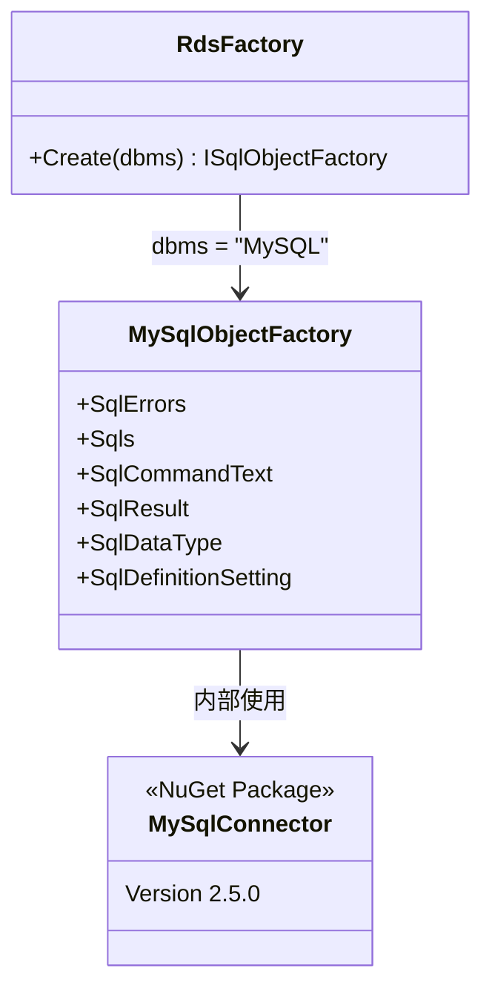

# MariaDB 互換性調査

MySQLに対応しているプリザンターが、MariaDB でもそのまま動作するか調査し、非互換箇所を洗い出す。

<!-- START doctoc generated TOC please keep comment here to allow auto update -->
<!-- DON'T EDIT THIS SECTION, INSTEAD RE-RUN doctoc TO UPDATE -->

- [調査情報](#調査情報)
- [調査目的](#調査目的)
- [調査対象の構成](#調査対象の構成)
- [互換性の分析](#互換性の分析)
    - [MySqlConnector ライブラリの MariaDB 対応状況](#mysqlconnector-ライブラリの-mariadb-対応状況)
    - [SQL 構文の互換性](#sql-構文の互換性)
    - [非互換箇所の詳細](#非互換箇所の詳細)
    - [設定上の注意事項](#設定上の注意事項)
- [結論](#結論)
- [関連ソースコード](#関連ソースコード)

<!-- END doctoc generated TOC please keep comment here to allow auto update -->

## 調査情報

| 調査日        | リポジトリ | ブランチ | タグ/バージョン    | コミット   | 備考     |
| ------------- | ---------- | -------- | ------------------ | ---------- | -------- |
| 2026年2月27日 | Pleasanter | main     | Pleasanter_1.5.1.0 | `34f162a4` | 初回調査 |

## 調査目的

MySQL対応のプリザンターをMariaDBで利用できるか検討するため、非互換箇所の有無とその修正方針を明らかにする。

---

## 調査対象の構成

プリザンターのMySQL対応は以下の構成で実装されている。



`Rds.json` に `"Dbms": "MySQL"` を設定すると `RdsFactory.Create()` が `MySqlObjectFactory` を返し、
`MySqlConnector` パッケージ（NuGet）経由でDBと通信する。

---

## 互換性の分析

### MySqlConnector ライブラリの MariaDB 対応状況

プリザンターが使用する .NET 向け MySQL ドライバは `MySqlConnector`（バージョン 2.5.0）である。

**ファイル**: `Rds/Implem.MySql/Implem.MySql.csproj`

```xml
<PackageReference Include="MySqlConnector" Version="2.5.0" />
```

MySqlConnector の公式 README には以下の記述がある。

> This library is compatible with many MySQL-compatible servers, including MySQL 5.5 and newer and **MariaDB 10.x and newer**.

ドライバレイヤーについては、追加の修正なしに MariaDB へ接続できる。

---

### SQL 構文の互換性

#### 互換ありと判断した箇所

以下の SQL 構文・機能は MySQL / MariaDB 双方でサポートされており、問題ない。

| 分類                 | 使用している機能                                                                           | 対象ファイル（抜粋）                                                  |
| -------------------- | ------------------------------------------------------------------------------------------ | --------------------------------------------------------------------- |
| DDL                  | `CREATE DATABASE ... COLLATE utf8mb4_general_ci`                                           | `CreateDatabase.sql`                                                  |
| DDL                  | `CREATE TABLE` / `ALTER TABLE MODIFY COLUMN`                                               | `CreateTable.sql`, `ModifyColumn.sql`                                 |
| DDL                  | `CREATE INDEX` / `DROP INDEX`                                                              | `CreateIx.sql`, `DropIndex.sql`                                       |
| DDL                  | `ALTER TABLE ADD CONSTRAINT PRIMARY KEY`                                                   | `CreatePk.sql`                                                        |
| DML                  | `INSERT INTO ... SELECT ... WHERE NOT EXISTS` (擬似Upsert)                                 | `UpsertGroupMember.sql`                                               |
| DML                  | `MATCH ... AGAINST (@param IN BOOLEAN MODE)` （全文検索クエリ）                            | `MySqlCommandText.cs`                                                 |
| CTE                  | `WITH RECURSIVE`                                                                           | `GetGroupChildrenIds.sql`, `RefreshAllChildMembers.sql`               |
| 関数                 | `last_insert_id()`, `ifnull()`, `cast()`                                                   | `SelectIdentity.sql`, `MySqlSqls.cs`                                  |
| 関数                 | `date_format()`, `date_add()`, `yearweek()`                                                | `MySqlSqls.cs`                                                        |
| 関数                 | `CURRENT_TIMESTAMP(3)`                                                                     | `MySqlSqls.cs`                                                        |
| セッション           | `SET SESSION sql_mode = 'ansi_quotes,pipes_as_concat'`                                     | `MySqlCommandText.cs`                                                 |
| ユーザー管理         | `CREATE USER ... IDENTIFIED BY`                                                            | `CreateLoginAdmin.sql`, `CreateLoginUser.sql`                         |
| ユーザー管理         | `ALTER USER ... IDENTIFIED BY`                                                             | `AlterLoginRole.sql`                                                  |
| ユーザー管理         | `GRANT ... WITH GRANT OPTION`                                                              | `GrantPrivilegeAdmin.sql`                                             |
| ユーザー管理         | `SELECT "user" FROM "mysql"."user"`                                                        | `ExistsUser.sql`                                                      |
| システム管理         | `KILL #Spid#`                                                                              | `KillSpid.sql`                                                        |
| システム管理         | `SELECT ... FROM information_schema.processlist`                                           | `SpWho.sql`                                                           |
| スキーマ照会         | `information_schema.columns`, `information_schema.statistics`, `information_schema.tables` | `Columns.sql`, `Indexes.sql`, `ExistsTable.sql`                       |
| ストアドプロシージャ | `CREATE PROCEDURE ... BEGIN ... END`                                                       | `LdapUpdateGroupMembersAndChildren.sql`, `RefreshAllChildMembers.sql` |

`WITH RECURSIVE` CTE は MySQL 8.0 以上と MariaDB 10.2.2 以上で利用可能であり、両者で対応している。

`ALTER USER ... IDENTIFIED BY` は MariaDB 10.2 で追加されたため、MariaDB 10.2 以上であれば互換性がある。

#### 非互換箇所

| 深刻度 | 箇所                 | 内容                                          |
| :----: | -------------------- | --------------------------------------------- |
|  重大  | `CreateFullText.sql` | `WITH PARSER "ngram"` が MariaDB に存在しない |

---

### 非互換箇所の詳細

#### `WITH PARSER "ngram"` — 全文検索インデックス作成の失敗

**ファイル**: `Implem.Pleasanter/App_Data/Definitions/Sqls/MySQL/CreateFullText.sql`

```sql
create fulltext index "ftx" on "Items"("FullText") with parser "ngram";
```

MySQL 5.7 以降に組み込まれている `ngram` 全文検索パーサーは、スペースで単語が区切られない日本語・中国語・韓国語（CJK）テキストを N グラム（bigram 等）で分割して索引化するものである。

MariaDB にはこの `ngram` パーサーが存在しない。`WITH PARSER "ngram"` 句を指定した場合、MariaDB は以下のようなエラーを返し全文検索インデックスの作成に失敗する。

```
ERROR 1286 (42000): Unknown storage engine 'ngram'
```

CodeDefiner 実行時に `ConfigureFullTextIndexMySql()` 内でこの SQL が発行されるため、MariaDB では初期セットアップ（DB作成・更新）が失敗する。

**影響範囲**:

- CodeDefiner による初期セットアップが失敗する
- 全文検索インデックスが作成されず、プリザンター上のキーワード検索が機能しない

#### 修正方針と代替案

| 案                                                                | 内容                                                                                                | 日本語検索品質                                                              |
| ----------------------------------------------------------------- | --------------------------------------------------------------------------------------------------- | --------------------------------------------------------------------------- |
| 1. `WITH PARSER "ngram"` 句を削除                                 | `create fulltext index "ftx" on "Items"("FullText");` として MariaDB のデフォルトパーサーを使用する | 低下する（CJK の N グラム分割がないため単語境界なしの日本語は検索できない） |
| 2. MariaDB の Mroonga ストレージエンジンを使用                    | Mroonga プラグイン導入後、`Items` テーブルを Mroonga テーブルとして作成しなおす                     | 高精度（形態素解析 / N グラム選択可）                                       |
| 3. プリザンター側で DBMS 判定を追加し MariaDB 向け SQL を定義する | `RdsFactory` や `Dbms` 設定に `"MariaDB"` を追加し、`CreateFullText.sql` を分岐させる               | 案1 または案2 を MariaDB 専用 SQL として実装できる                          |

案1 は最小修正であるが、英語環境でも単語単位（スペース区切り）以外のフレーズ検索精度が落ちる可能性がある。  
日本語環境を運用する場合は案2 か案3 が必要になる。

---

### 設定上の注意事項

`Rds.json` の `Dbms` フィールドは現在 `"SQLServer"` / `"PostgreSQL"` / `"MySQL"` の 3 値のみ受け付けている。

**ファイル**: `Implem.Factory/RdsFactory.cs`

```csharp
switch (dbms)
{
    case "SQLServer":
        return (ISqlObjectFactory)Activator.CreateInstance(typeof(SqlServerObjectFactory));
    case "PostgreSQL":
        return (ISqlObjectFactory)Activator.CreateInstance(typeof(PostgreSqlObjectFactory));
    case "MySQL":
        return (ISqlObjectFactory)Activator.CreateInstance(typeof(MySqlObjectFactory));
    default:
        throw new NotSupportedException($"DBMS[{dbms}] is not supported by Pleasanter.");
}
```

MariaDB を利用する場合は、接続に `MySqlObjectFactory`（および `MySqlConnector`）をそのまま使用できるため、`"Dbms": "MySQL"` の設定で接続自体は成立する。

ただし、上記の `WITH PARSER "ngram"` 問題を SQL レベルで分岐させるには、`"Dbms": "MariaDB"` という新しい値の追加と、対応する `MariaDB` 用の SQL 定義ディレクトリの作成が必要になる。

---

## 結論

| 区分                                           |    判定    | 詳細                                         |
| ---------------------------------------------- | :--------: | -------------------------------------------- |
| .NET ドライバ（MySqlConnector）                |    互換    | 公式に MariaDB 10.x 以上をサポート           |
| 基本 SQL 構文（DML / DDL）                     |    互換    | MySQL / MariaDB 共通構文のみ使用             |
| `WITH RECURSIVE` CTE                           |    互換    | MariaDB 10.2.2 以上が必要                    |
| `ALTER USER ... IDENTIFIED BY`                 |    互換    | MariaDB 10.2 以上が必要                      |
| ストアドプロシージャ                           |    互換    | 記法に差異なし                               |
| `utf8mb4_general_ci` 照合順序                  |    互換    | MariaDB も同一照合順序を持つ                 |
| `ANSI_QUOTES` / `PIPES_AS_CONCAT` モード       |    互換    | MariaDB も同一モードをサポート               |
| **全文検索インデックス (`WITH PARSER ngram`)** | **非互換** | **MariaDB に `ngram` パーサーなし→修正必須** |

MariaDB をそのままの設定で使用すると、CodeDefiner 実行時に全文検索インデックスの作成で失敗するため、
**最低でも `CreateFullText.sql` の `WITH PARSER "ngram"` 句の修正が必要**である。

日本語検索を維持したい場合はさらに追加の対応（Mroonga 導入または MariaDB 専用 SQL 分岐の実装）が必要になる。

---

## 関連ソースコード

| ファイル                                                               | 説明                                 |
| ---------------------------------------------------------------------- | ------------------------------------ |
| `Rds/Implem.MySql/Implem.MySql.csproj`                                 | MySqlConnector パッケージ参照        |
| `Implem.Factory/RdsFactory.cs`                                         | DBMS 判定と ObjectFactory 生成       |
| `Implem.Pleasanter/App_Data/Definitions/Sqls/MySQL/CreateFullText.sql` | 非互換箇所（`WITH PARSER "ngram"`）  |
| `Implem.Pleasanter/App_Data/Definitions/Sqls/MySQL/CreateDatabase.sql` | DB作成 SQL                           |
| `Implem.CodeDefiner/Functions/Rds/TablesConfigurator.cs`               | 全文検索インデックス作成呼び出し箇所 |
| `Rds/Implem.MySql/MySqlCommandText.cs`                                 | セッション設定・SQL生成ロジック      |
| `Rds/Implem.MySql/MySqlSqls.cs`                                        | MySQL固有の SQL テンプレート定義     |
| `Implem.ParameterAccessor/Parts/Rds.cs`                                | `Dbms` パラメータ定義                |
