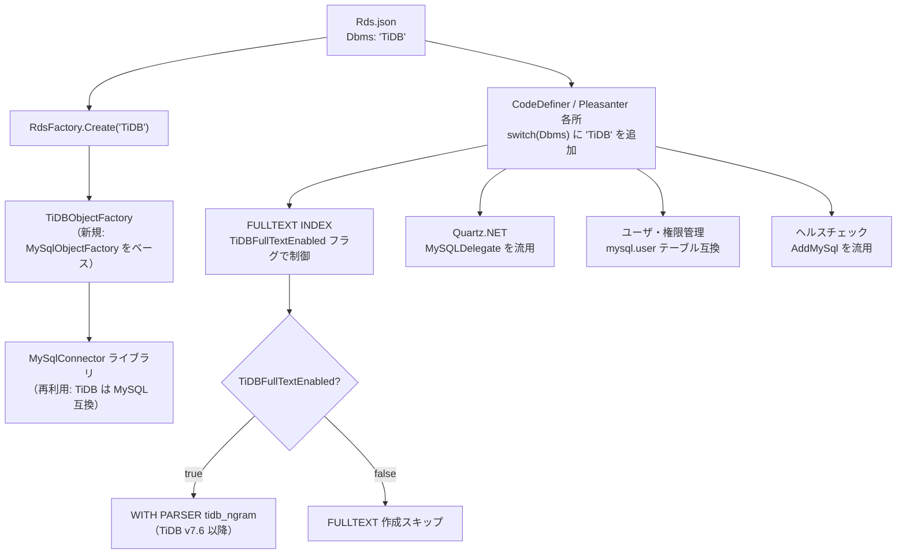

# TiDB 対応実装方針

TiDB を Pleasanter の対応 RDBMS として追加するための実装方針を、既存の MySQL 実装を参考に調査・整理した。

<!-- START doctoc generated TOC please keep comment here to allow auto update -->
<!-- DON'T EDIT THIS SECTION, INSTEAD RE-RUN doctoc TO UPDATE -->

- [調査情報](#調査情報)
- [調査目的](#調査目的)
- [TiDB の概要](#tidb-の概要)
    - [MySQL との主要な差異](#mysql-との主要な差異)
- [Pleasanter の MySQL 実装構造](#pleasanter-の-mysql-実装構造)
    - [RDBMS 差違吸収の仕組み](#rdbms-差違吸収の仕組み)
    - [MySQL 実装の構成](#mysql-実装の構成)
- [実装方針の比較](#実装方針の比較)
    - [アプローチ A: 新規 DBMS タイプ「TiDB」を追加](#アプローチ-a-新規-dbms-タイプtidbを追加)
    - [アプローチ B: MySQL のエイリアスとして TiDB を扱う](#アプローチ-b-mysql-のエイリアスとして-tidb-を扱う)
    - [推奨: アプローチ A（新規 DBMS タイプ）](#推奨-アプローチ-a新規-dbms-タイプ)
- [必要な変更箇所の一覧](#必要な変更箇所の一覧)
    - [1. RdsFactory（DBMS 判定）](#1-rdsfactorydbms-判定)
    - [2. TiDB 接続抽象層（新規）](#2-tidb-接続抽象層新規)
    - [3. SQL テンプレート（新規）](#3-sql-テンプレート新規)
    - [4. CodeDefiner: Starter.cs（DBMS バリデーション）](#4-codedefiner-startercsdbms-バリデーション)
    - [5. CodeDefiner: Configurator.cs（接続文字列パース）](#5-codedefiner-configuratorcs接続文字列パース)
    - [6. CodeDefiner: UsersConfigurator.cs / PrivilegeConfigurator.cs（ホスト指定）](#6-codedefiner-usersconfiguratorcs--privilegeconfiguratorcsホスト指定)
    - [7. CodeDefiner: Parts/Indexes.cs・Constraints.cs・Columns.cs](#7-codedefiner-partsindexescsconstraintscscolumnscs)
    - [8. CodeDefiner: TablesConfigurator.cs（FULLTEXT INDEX）](#8-codedefiner-tablesconfiguratorcsfulltext-index)
    - [9. Implem.Pleasanter: Startup.cs（ヘルスチェック登録）](#9-implempleasanter-startupcsヘルスチェック登録)
    - [10. Implem.Pleasanter: CustomQuartzHostedService.cs](#10-implempleasanter-customquartzhostedservicecs)
    - [11. Implem.Pleasanter: Attachment.cs（バイナリハッシュ）](#11-implempleasanter-attachmentcsバイナリハッシュ)
    - [12. Implem.Libraries: SqlDebugs.cs（ログオプション）](#12-implemlibraries-sqldebugscsログオプション)
    - [13. Implem.Libraries: SqlSelect.cs（MySQL 固有クエリ変換）](#13-implemlibraries-sqlselectcsmysql-固有クエリ変換)
    - [14. Rds.json パラメータの追加](#14-rdsjson-パラメータの追加)
- [TiDB 固有の注意事項](#tidb-固有の注意事項)
    - [AUTO_INCREMENT のバッチ割り当て](#auto_increment-のバッチ割り当て)
    - [FULLTEXT INDEX の対応バージョン](#fulltext-index-の対応バージョン)
    - [sql_mode の設定](#sql_mode-の設定)
    - [DDL の非同期実行](#ddl-の非同期実行)
    - [information_schema.tables.AUTO_INCREMENT](#information_schematablesauto_increment)
- [実装の全体像](#実装の全体像)
- [結論](#結論)
- [関連ソースコード](#関連ソースコード)

<!-- END doctoc generated TOC please keep comment here to allow auto update -->

---

## 調査情報

| 調査日     | リポジトリ | ブランチ | タグ/バージョン    | コミット    | 備考     |
| ---------- | ---------- | -------- | ------------------ | ----------- | -------- |
| 2026-02-27 | Pleasanter | main     | Pleasanter_1.5.1.0 | `34f162a43` | 初回調査 |

## 調査目的

TiDB は MySQL 互換の分散 SQL データベースであり、MySQL 接続クライアントをそのまま利用できる。
Pleasanter の既存 MySQL 対応の実装を参考に、TiDB を新しい RDBMS として追加するために
どのような変更が必要かを明らかにする。

---

## TiDB の概要

TiDB は PingCAP 社が開発する、MySQL 互換の分散 SQL データベースである。

### MySQL との主要な差異

| 項目                                       | MySQL                                  | TiDB                                                 |
| ------------------------------------------ | -------------------------------------- | ---------------------------------------------------- |
| アーキテクチャ                             | 単一ノード（または InnoDB Cluster 等） | 分散アーキテクチャ（TiKV ストレージ層）              |
| MySQL ワイヤプロトコル互換                 | -                                      | 互換（`MySqlConnector` がそのまま動作）              |
| `AUTO_INCREMENT`                           | 連番保証                               | バッチ割り当て（デフォルト 30000 単位）で連番非保証  |
| `LAST_INSERT_ID()`                         | トランザクション内で正確               | トランザクション内で正確                             |
| `FULLTEXT INDEX`                           | `WITH PARSER ngram` 対応               | v7.6 未満: 非対応 / v7.6 以降: `tidb_ngram` パーサー |
| `sql_mode`（PIPES_AS_CONCAT 等）           | 対応                                   | v7.1 以降: 対応                                      |
| `WITH RECURSIVE` CTE                       | 対応                                   | v5.0 以降: 対応                                      |
| DDL（ALTER TABLE）                         | 同期的に完了                           | 非同期オンライン DDL（v6.2 以降で改善）              |
| デフォルト分離レベル                       | `REPEATABLE READ`                      | `REPEATABLE READ`                                    |
| デッドロックエラーコード                   | `SQLSTATE 40001`                       | `SQLSTATE 40001`                                     |
| `mysql.user` テーブル                      | 存在する                               | 存在する（互換）                                     |
| `information_schema.columns`               | 標準的な構造                           | 互換                                                 |
| `information_schema.statistics`            | 標準的な構造                           | 互換                                                 |
| `information_schema.tables.AUTO_INCREMENT` | 次の自動採番値                         | バッチ次期開始値（実際の最大値とは異なる場合あり）   |
| Quartz.NET アダプタ                        | `MySQLDelegate`                        | `MySQLDelegate`（MySQL 互換のため流用可能）          |
| デフォルトポート                           | 3306                                   | 4000                                                 |

---

## Pleasanter の MySQL 実装構造

### RDBMS 差違吸収の仕組み

Pleasanter は Abstract Factory パターンで RDBMS を抽象化しており、`Rds.json` の `Dbms` フィールドで使用する RDBMS を指定する。

**ファイル**: `Implem.Factory/RdsFactory.cs`

```csharp
public static ISqlObjectFactory Create(string dbms)
{
    switch (dbms)
    {
        case "SQLServer":
            return (ISqlObjectFactory)Activator.CreateInstance(typeof(SqlServerObjectFactory));
        case "PostgreSQL":
            return (ISqlObjectFactory)Activator.CreateInstance(typeof(PostgreSqlObjectFactory));
        case "MySQL":
            return (ISqlObjectFactory)Activator.CreateInstance(typeof(MySqlObjectFactory));
        default:
            throw new NotSupportedException($"DBMS[{dbms}] is not supported by Pleasanter.");
    }
}
```

### MySQL 実装の構成

| 層               | ファイル・ディレクトリ                                           | 役割                                   |
| ---------------- | ---------------------------------------------------------------- | -------------------------------------- |
| ファクトリ       | `Implem.Factory/RdsFactory.cs`                                   | DBMS 判定と実装クラスの生成            |
| 接続抽象層       | `Rds/Implem.MySql/MySql*.cs`                                     | 接続・コマンド・パラメータの抽象化     |
| SQL 定義ファイル | `App_Data/Definitions/Sqls/MySQL/*.sql`                          | RDBMS 固有の SQL テンプレート          |
| CodeDefiner 分岐 | `Implem.CodeDefiner/Functions/Rds/Parts/MySql/*.cs` およびその他 | スキーマ比較・マイグレーションの分岐   |
| アプリ本体分岐   | `Implem.Pleasanter/Startup.cs` 等                                | ヘルスチェック・Quartz・添付ファイル等 |

---

## 実装方針の比較

TiDB 対応には以下の 2 つのアプローチが考えられる。

### アプローチ A: 新規 DBMS タイプ「TiDB」を追加

- `Implem.TiDB` プロジェクト（または `Implem.MySql` のサブクラス）を新規作成
- `RdsFactory.Create("TiDB")` → `TiDBObjectFactory` を返す
- SQL テンプレートを `App_Data/Definitions/Sqls/TiDB/` に新設
- 既存 MySQL 実装と完全に分離できる

| 評価軸       | 評価 | 理由                                       |
| ------------ | ---- | ------------------------------------------ |
| 保守性       | 高い | MySQL と TiDB を独立して管理できる         |
| 実装コスト   | 高い | 多数のファイルに "TiDB" 分岐を追加する必要 |
| 既存パターン | 適合 | SQLServer / PostgreSQL / MySQL と同じ構造  |

### アプローチ B: MySQL のエイリアスとして TiDB を扱う

- `RdsFactory.Create("TiDB")` → `MySqlObjectFactory` を返す（エイリアス）
- ほぼすべての処理は MySQL と共通化
- FULLTEXT INDEX などの差異はパラメータフラグで制御
- 最小限の変更で済む

| 評価軸       | 評価   | 理由                                     |
| ------------ | ------ | ---------------------------------------- |
| 保守性       | やや低 | MySQL と TiDB の差異がコード中に点在する |
| 実装コスト   | 低い   | 変更箇所が少ない                         |
| 既存パターン | 逸脱   | 他 RDBMS と異なる構造になる              |

### 推奨: アプローチ A（新規 DBMS タイプ）

MySQL との差異（特に FULLTEXT INDEX）を明確に分離でき、将来の TiDB 固有の最適化にも対応しやすいため、アプローチ A を推奨する。
ただし、TiDB は MySQL ワイヤプロトコル互換であるため、接続層（`Implem.TiDB`）は `Implem.MySql` のコードを流用できる。

---

## 必要な変更箇所の一覧

### 1. RdsFactory（DBMS 判定）

**ファイル**: `Implem.Factory/RdsFactory.cs`

```csharp
case "TiDB":
    return (ISqlObjectFactory)Activator.CreateInstance(typeof(TiDBObjectFactory));
```

### 2. TiDB 接続抽象層（新規）

**新規ファイル群**: `Rds/Implem.TiDB/*.cs`

TiDB は MySQL ワイヤプロトコル互換なので、`MySqlConnector` ライブラリをそのまま使用する。
大部分は `Implem.MySql` と同一のため、以下のクラスを流用・継承する。

| クラス                        | 方針               | 主な差異                                 |
| ----------------------------- | ------------------ | ---------------------------------------- |
| `TiDBObjectFactory`           | 新規作成           | 各インスタンスを TiDB 用クラスで差し替え |
| `TiDBConnection`              | MySQL と同一の実装 | なし（`MySqlConnector` がそのまま動作）  |
| `TiDBConnectionStringBuilder` | MySQL と同一の実装 | なし                                     |
| `TiDBCommand`                 | MySQL と同一の実装 | なし                                     |
| `TiDBParameter`               | MySQL と同一の実装 | なし                                     |
| `TiDBDataAdapter`             | MySQL と同一の実装 | なし                                     |
| `TiDBErrors`                  | MySQL と同一の実装 | なし（デッドロックコード同じ）           |
| `TiDBSqls`                    | MySQL とほぼ同一   | `UpsertBinary` 等は共通                  |
| `TiDBCommandText`             | MySQL とほぼ同一   | `BeforeAllCommand` の確認が必要（後述）  |
| `TiDBDataTypes`               | MySQL と同一の実装 | なし                                     |
| `TiDBDefinitionSetting`       | MySQL と同一の実装 | なし                                     |
| `TiDBResult`                  | MySQL と同一の実装 | なし                                     |

### 3. SQL テンプレート（新規）

**新規ディレクトリ**: `App_Data/Definitions/Sqls/TiDB/`

MySQL の SQL テンプレートをベースに、以下の変更が必要である。

| ファイル             | MySQL                                  | TiDB                                                                |
| -------------------- | -------------------------------------- | ------------------------------------------------------------------- |
| `CreateFullText.sql` | `WITH PARSER "ngram"`                  | v7.6 未満: 削除またはスキップ / v7.6 以降: `WITH PARSER tidb_ngram` |
| `ExistsFullText.sql` | `information_schema.statistics` クエリ | 同一（互換）                                                        |
| その他 `*.sql`       | MySQL のまま                           | 同一（互換）                                                        |

`CreateFullText.sql` の TiDB v7.6 以降向け例:

```sql
create fulltext index "ftx" on "Items"("FullText") with parser "tidb_ngram";
```

### 4. CodeDefiner: Starter.cs（DBMS バリデーション）

**ファイル**: `Implem.CodeDefiner/Starter.cs`

```csharp
switch (Parameters.Rds.Dbms)
{
    case "PostgreSQL":
    case "MySQL":
    case "TiDB":          // 追加
        checkRdsDbms = true;
        break;
}
```

### 5. CodeDefiner: Configurator.cs（接続文字列パース）

**ファイル**: `Implem.CodeDefiner/Functions/Rds/Configurator.cs`

```csharp
case "TiDB":              // 追加（MySQL と同じ処理）
    serverName = new MySqlConnectionStringBuilder(Parameters.Rds.SaConnectionString).Server;
    database = new MySqlConnectionStringBuilder(Parameters.Rds.SaConnectionString).Database;
    break;
```

### 6. CodeDefiner: UsersConfigurator.cs / PrivilegeConfigurator.cs（ホスト指定）

**ファイル**: `Implem.CodeDefiner/Functions/Rds/UsersConfigurator.cs`  
**ファイル**: `Implem.CodeDefiner/Functions/Rds/PrivilegeConfigurator.cs`

TiDB の `mysql.user` テーブルはホスト列を持つため MySQL と同様の処理が必要。

```csharp
var hostList = Parameters.Rds.Dbms == "MySQL" || Parameters.Rds.Dbms == "TiDB"
    ? Parameters.Rds.MySqlConnectingHost.Split(',').ToList<string>()
    : new List<string>([""]);
```

### 7. CodeDefiner: Parts/Indexes.cs・Constraints.cs・Columns.cs

各 `switch (Parameters.Rds.Dbms)` の MySQL ケースに TiDB ケースを追加する。

**ファイル**: `Implem.CodeDefiner/Functions/Rds/Parts/Indexes.cs`  
**ファイル**: `Implem.CodeDefiner/Functions/Rds/Parts/Constraints.cs`  
**ファイル**: `Implem.CodeDefiner/Functions/Rds/Parts/Columns.cs`

```csharp
case "MySQL":
case "TiDB":    // 追加
    // 既存の MySQL 用処理をそのまま適用
```

### 8. CodeDefiner: TablesConfigurator.cs（FULLTEXT INDEX）

**ファイル**: `Implem.CodeDefiner/Functions/Rds/TablesConfigurator.cs`

FULLTEXT INDEX の作成は TiDB バージョンによって対応が異なる。
パラメータファイル（`Rds.json`）に `TiDBFullTextEnabled` フラグを追加して制御する方法が現実的である。

```csharp
case "TiDB":
    ConfigureFullTextIndexTiDB(factory: factory);
    break;
```

```csharp
private static void ConfigureFullTextIndexTiDB(ISqlObjectFactory factory)
{
    // TiDB v7.6 未満では FULLTEXT INDEX 未対応のためスキップ
    // Rds.json に TiDBFullTextEnabled: true を設定した場合のみ実行
    if (!Parameters.Rds.TiDBFullTextEnabled) return;
    // MySQL と同様の処理（SQL テンプレートは TiDB 用）
    // ...
}
```

### 9. Implem.Pleasanter: Startup.cs（ヘルスチェック登録）

**ファイル**: `Implem.Pleasanter/Startup.cs`

```csharp
case "TiDB":    // 追加（MySQL と同じ addMySql を使用）
    return services.AddMySql(
        connectionString: conStr,
        healthQuery: healthQuery);
```

### 10. Implem.Pleasanter: CustomQuartzHostedService.cs

**ファイル**: `Implem.Pleasanter/Libraries/BackgroundServices/CustomQuartzHostedService.cs`

```csharp
"MySQL" or "TiDB" => "MySqlConnector",   // TiDB 追加
"MySQL" or "TiDB" => "Quartz.Impl.AdoJobStore.MySQLDelegate, Quartz",
```

### 11. Implem.Pleasanter: Attachment.cs（バイナリハッシュ）

**ファイル**: `Implem.Pleasanter/Libraries/DataTypes/Attachment.cs`

```csharp
case "MySQL":
case "TiDB":    // 追加
    return string.Empty;
```

### 12. Implem.Libraries: SqlDebugs.cs（ログオプション）

**ファイル**: `Implem.Libraries/DataSources/SqlServer/SqlDebugs.cs`

```csharp
"PostgreSQL" or "MySQL" or "TiDB" => new SqlLogOptions { ... },
```

### 13. Implem.Libraries: SqlSelect.cs（MySQL 固有クエリ変換）

**ファイル**: `Implem.Libraries/DataSources/SqlServer/SqlSelect.cs`

```csharp
if ((Parameters.Rds.Dbms == "MySQL" || Parameters.Rds.Dbms == "TiDB") &&
    !MainQueryInfo.sqlClass.IsNullOrEmpty() && ...)
```

### 14. Rds.json パラメータの追加

**ファイル**: `App_Data/Parameters/Rds.json`

FULLTEXT INDEX 対応フラグを追加する。

```json
{
    "Dbms": "TiDB",
    "MySqlConnectingHost": "%",
    "TiDBFullTextEnabled": false
}
```

**ファイル**: `Implem.ParameterAccessor/Parts/Rds.cs`

```csharp
public bool TiDBFullTextEnabled;
```

---

## TiDB 固有の注意事項

### AUTO_INCREMENT のバッチ割り当て

TiDB は `AUTO_INCREMENT` の ID をノードごとにバッチ（デフォルト 30000 単位）で割り当てるため、
ID が連番にならない場合がある。

- `LAST_INSERT_ID()` はトランザクション内での最後の挿入 ID を正確に返すため、Pleasanter の `SelectIdentity.sql` はそのまま動作する
- ただし、ID に連番性を前提としたロジックが存在する場合は注意が必要

### FULLTEXT INDEX の対応バージョン

TiDB の FULLTEXT INDEX 対応状況は以下の通り。

| TiDB バージョン | 状況                                                          |
| --------------- | ------------------------------------------------------------- |
| v7.6 未満       | FULLTEXT INDEX 非対応                                         |
| v7.6 以降       | `WITH PARSER tidb_ngram` で対応（日本語など多バイト文字対応） |

Pleasanter の全文検索機能（`FullText` カラムへの検索）は、TiDB v7.6 未満では使用できない。
TiDB v7.6 未満で運用する場合は、FULLTEXT INDEX の作成をスキップし、
全文検索機能を無効化するか、代替手段（LIKE 検索等）を検討する必要がある。

### sql_mode の設定

**ファイル**: `Rds/Implem.MySql/MySqlCommandText.cs`

MySQL の `BeforeAllCommand()` は以下の `sql_mode` を設定している。

```csharp
public string BeforeAllCommand()
{
    return "set session sql_mode = 'ansi_quotes,pipes_as_concat';";
}
```

TiDB での対応状況:

| モード            | 対応バージョン | 備考                                              |
| ----------------- | -------------- | ------------------------------------------------- |
| `ANSI_QUOTES`     | v5.0 以降      | `"` をクォート文字として使用できる                |
| `PIPES_AS_CONCAT` | v7.1 以降      | `&#124;&#124;` を文字列結合演算子として使用できる |

`PIPES_AS_CONCAT` が有効でない場合、`MySqlSqls` の `WhereLikeTemplateForward`（`'%' ||`）や
`WhereLikeTemplate`（`... || '%'`）が正しく動作しない。
TiDB v7.1 未満での利用は、この点で問題が生じる可能性がある。

### DDL の非同期実行

TiDB はオンライン DDL を採用しており、`ALTER TABLE` が非同期で完了する場合がある。
CodeDefiner のマイグレーション処理は完了まで待機するが、大規模テーブルのマイグレーション時は
MySQL よりも時間がかかる可能性がある。

### information_schema.tables.AUTO_INCREMENT

MySQL では `information_schema.tables.AUTO_INCREMENT` が次の採番値を示すが、
TiDB ではバッチの次期開始値を示すため、実際の最大値よりも大きくなる。
CodeDefiner の IDENTITY 列検出クエリ（`Columns.sql`）は AUTO_INCREMENT が `NOT NULL` かどうかで
IDENTITY 列を判定するため、この差異は機能的な問題を引き起こさない。

---

## 実装の全体像



---

## 結論

| 項目                     | 内容                                                                            |
| ------------------------ | ------------------------------------------------------------------------------- |
| 実装アプローチ           | アプローチ A（新規 DBMS タイプ "TiDB"）を推奨                                   |
| 接続ライブラリ           | `MySqlConnector`（v2.5.0）をそのまま利用可能                                    |
| 変更ファイル数           | 約 14 ファイル + 新規 `Implem.TiDB` プロジェクト + SQL テンプレートディレクトリ |
| FULLTEXT INDEX           | TiDB v7.6 未満は非対応。パラメータフラグでスキップ制御が必要                    |
| sql_mode 対応            | TiDB v7.1 以降が前提（`PIPES_AS_CONCAT` サポートのため）                        |
| 対応推奨 TiDB バージョン | v7.6 以降（FULLTEXT INDEX の利用には必須）、最低要件は v7.1                     |
| AUTO_INCREMENT           | ID の連番性は保証されないが、`LAST_INSERT_ID()` は正確に動作するため問題なし    |

---

## 関連ソースコード

| ファイル                                                                      | 役割                            |
| ----------------------------------------------------------------------------- | ------------------------------- |
| `Implem.Factory/RdsFactory.cs`                                                | DBMS ファクトリ                 |
| `Rds/Implem.MySql/MySqlObjectFactory.cs`                                      | MySQL ファクトリ（TiDB の参考） |
| `Rds/Implem.MySql/MySqlCommandText.cs`                                        | コマンドテキスト生成            |
| `Rds/Implem.MySql/MySqlSqls.cs`                                               | SQL 方言定義                    |
| `Rds/Implem.MySql/MySqlDefinitionSetting.cs`                                  | スキーマ定義設定                |
| `App_Data/Definitions/Sqls/MySQL/`                                            | MySQL SQL テンプレート          |
| `Implem.CodeDefiner/Starter.cs`                                               | DBMS バリデーション             |
| `Implem.CodeDefiner/Functions/Rds/TablesConfigurator.cs`                      | FULLTEXT INDEX 作成処理         |
| `Implem.CodeDefiner/Functions/Rds/Parts/MySql/MySqlColumns.cs`                | MySQL カラム定義生成            |
| `Implem.CodeDefiner/Functions/Rds/Parts/MySql/MySqlConstraints.cs`            | MySQL 制約定義生成              |
| `Implem.CodeDefiner/Functions/Rds/Parts/MySql/MySqlIndexes.cs`                | MySQL インデックス定義生成      |
| `Implem.Pleasanter/Startup.cs`                                                | ヘルスチェック・サービス登録    |
| `Implem.Pleasanter/Libraries/BackgroundServices/CustomQuartzHostedService.cs` | Quartz.NET 設定                 |
| `Implem.ParameterAccessor/Parts/Rds.cs`                                       | RDS パラメータ定義              |
