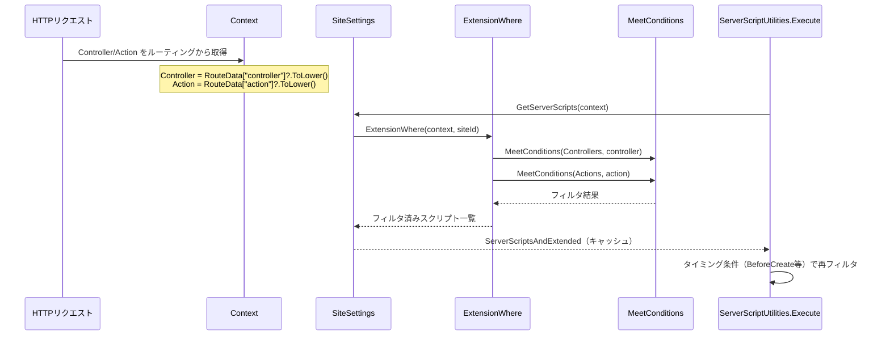
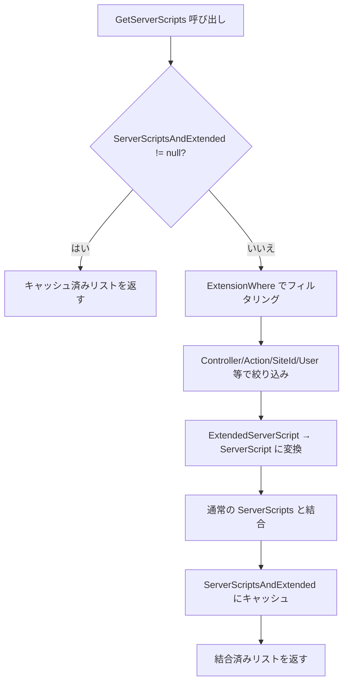

# 拡張サーバスクリプトの Action・Controller 制御

拡張サーバスクリプト（ExtendedServerScript）における Action・Controller フィルタリングの動作仕様を調査する。

<!-- START doctoc generated TOC please keep comment here to allow auto update -->
<!-- DON'T EDIT THIS SECTION, INSTEAD RE-RUN doctoc TO UPDATE -->

- [調査情報](#調査情報)
- [調査目的](#調査目的)
- [拡張サーバスクリプトの基本構成](#拡張サーバスクリプトの基本構成)
    - [ExtendedBase クラス（共通プロパティ）](#extendedbase-クラス共通プロパティ)
    - [ExtendedServerScript クラス](#extendedserverscript-クラス)
    - [JSON 設定ファイルの配置場所](#json-設定ファイルの配置場所)
- [フィルタリングの仕組み](#フィルタリングの仕組み)
    - [全体フロー](#全体フロー)
    - [ExtensionWhere メソッド](#extensionwhere-メソッド)
    - [MeetConditions メソッド](#meetconditions-メソッド)
- [注意事項と問題点](#注意事項と問題点)
    - [1. 大文字・小文字の区別（Case Sensitivity）](#1-大文字小文字の区別case-sensitivity)
    - [2. Controllers/Actions 未指定時の動作](#2-controllersactions-未指定時の動作)
    - [3. NegativeConditions の動作](#3-negativeconditions-の動作)
    - [4. 正条件と負条件を混在させた場合の動作](#4-正条件と負条件を混在させた場合の動作)
    - [5. 通常のサーバスクリプトとの差異](#5-通常のサーバスクリプトとの差異)
- [GetServerScripts のキャッシュ機構](#getserverscripts-のキャッシュ機構)
    - [キャッシュの動作](#キャッシュの動作)
    - [キャッシュのライフサイクル](#キャッシュのライフサイクル)
- [Controller・Action の具体的な値](#controlleraction-の具体的な値)
    - [Controller 値の一覧](#controller-値の一覧)
    - [Action 値の一覧（ItemsController の主要アクション）](#action-値の一覧itemscontroller-の主要アクション)
- [設定例](#設定例)
    - [特定のコントローラー・アクションでのみ実行](#特定のコントローラーアクションでのみ実行)
    - [特定のアクションを除外](#特定のアクションを除外)
    - [すべてのコントローラー・アクションで実行（デフォルト）](#すべてのコントローラーアクションで実行デフォルト)
- [結論](#結論)
- [関連ソースコード](#関連ソースコード)

<!-- END doctoc generated TOC please keep comment here to allow auto update -->

## 調査情報

| 調査日       | リポジトリ | ブランチ | タグ/バージョン    | コミット   | 備考     |
| ------------ | ---------- | -------- | ------------------ | ---------- | -------- |
| 2026年3月2日 | Pleasanter | main     | Pleasanter_1.5.1.0 | `34f162a4` | 初回調査 |

## 調査目的

拡張サーバスクリプトの JSON 設定で指定可能な `Controllers` / `Actions` プロパティによるフィルタリングが正しく動作しているかを確認する。フィルタリングの仕組み、注意点、および発生しうる問題を明らかにする。

---

## 拡張サーバスクリプトの基本構成

### ExtendedBase クラス（共通プロパティ）

拡張サーバスクリプトのフィルタリングプロパティは `ExtendedBase` 基底クラスで定義されている。

**ファイル**: `Implem.ParameterAccessor/Parts/ExtendedBase.cs`

```csharp
public class ExtendedBase
{
    public string Name;
    public bool SpecifyByName;
    public string Path;
    public string Description;
    public bool Disabled;
    public List<int> DeptIdList;
    public List<int> GroupIdList;
    public List<int> UserIdList;
    public List<long> SiteIdList;
    public List<long> IdList;
    public List<string> Controllers;   // コントローラーフィルタ
    public List<string> Actions;       // アクションフィルタ
    public List<string> ColumnList;
}
```

### ExtendedServerScript クラス

**ファイル**: `Implem.ParameterAccessor/Parts/ExtendedServerScript.cs`

```csharp
public class ExtendedServerScript : ExtendedBase
{
    public bool? WhenloadingSiteSettings;
    public bool? WhenViewProcessing;
    public bool? WhenloadingRecord;
    public bool? BeforeFormula;
    public bool? AfterFormula;
    public bool? BeforeCreate;
    // ... その他のタイミングフラグ
    public string Body;
}
```

### JSON 設定ファイルの配置場所

拡張サーバスクリプトは `App_Data/Parameters/ExtendedServerScripts/` 配下の JSON ファイルで定義する。

**ファイル**: `Implem.DefinitionAccessor/Initializer.cs`（行番号: 556-587）

```json
{
    "Name": "sample-script",
    "SiteIdList": [12345],
    "Controllers": ["items"],
    "Actions": ["create", "update"],
    "BeforeCreate": true,
    "BeforeUpdate": true,
    "Body": "// スクリプト内容"
}
```

スクリプト本体は JSON の `Body` フィールドに記述するか、同名の `.json.js` ファイルに分離して記述できる。

---

## フィルタリングの仕組み

### 全体フロー



### ExtensionWhere メソッド

**ファイル**: `Implem.Pleasanter/Models/Extensions/ExtensionUtilities.cs`（行番号: 204-230）

```csharp
public static IEnumerable<T> ExtensionWhere<T>(
    IEnumerable<ParameterAccessor.Parts.ExtendedBase> extensions,
    string name, int deptId, List<int> groups, int userId,
    long siteId, long id,
    string controller, string action,
    string columnName = null)
{
    return extensions
        ?.Where(o => !o.SpecifyByName || o.Name == name)
        .Where(o => MeetConditions(o.DeptIdList, deptId))
        .Where(o => o.GroupIdList?.Any() != true
            || groups?.Any(groupId => MeetConditions(o.GroupIdList, groupId)) == true)
        .Where(o => MeetConditions(o.UserIdList, userId))
        .Where(o => MeetConditions(o.SiteIdList, siteId))
        .Where(o => MeetConditions(o.IdList, id))
        .Where(o => MeetConditions(o.Controllers, controller))  // ここ
        .Where(o => MeetConditions(o.Actions, action))          // ここ
        .Where(o => MeetConditions(o.ColumnList, columnName))
        .Where(o => !o.Disabled)
        .Cast<T>();
}
```

### MeetConditions メソッド

**ファイル**: `Implem.Pleasanter/Models/Extensions/ExtensionUtilities.cs`（行番号: 236-298）

```csharp
public static bool MeetConditions<T, U>(List<T> list, U param)
{
    var data = param?.ToString();
    var items = GetItems(list);
    return NoConditions(items: items, data: data)
        || PositiveConditions(items: items, data: data)
        || NegativeConditions(items: items, data: data);
}
```

3 つの判定を **OR 結合**で評価する。

| 判定メソッド         | 条件                                                                                        |
| -------------------- | ------------------------------------------------------------------------------------------- |
| `NoConditions`       | `data` が null/空 **または** `items` が null/空 → 条件なしとみなし **true**                 |
| `PositiveConditions` | `items` のいずれかが `data` と**完全一致**する場合 **true**                                 |
| `NegativeConditions` | `-` プレフィックス付き要素がすべて `data` と不一致の場合 **true**（除外対象でなければ通過） |

---

## 注意事項と問題点

### 1. 大文字・小文字の区別（Case Sensitivity）

Context で Controller/Action は**小文字に変換**される。

**ファイル**: `Implem.Pleasanter/Libraries/Requests/Context.cs`

```csharp
Controller = RouteData.Get("controller")?.ToLower() ?? string.Empty;
Action = RouteData.Get("action")?.ToLower() ?? string.Empty;
```

一方、`PositiveConditions` の比較は `==` 演算子による**大文字・小文字区別あり**の比較である。

```csharp
private static bool PositiveConditions(List<string> items, string data)
{
    return items.Any(item => item == data);
}
```

従って、JSON 設定の `Controllers` / `Actions` の値は**小文字で記述する必要がある**。

| 設定値     | Context の値 |    一致するか     |
| ---------- | ------------ | :---------------: |
| `"items"`  | `"items"`    |         o         |
| `"Items"`  | `"items"`    |         x         |
| `"ITEMS"`  | `"items"`    |         x         |
| `"-items"` | `"items"`    |     o（除外）     |
| `"-Items"` | `"items"`    | x（除外されない） |

設定値を大文字で記述しても**エラーにはならない**が、**フィルタが無効になる**（後述の `NegativeConditions` を除く）。

### 2. Controllers/Actions 未指定時の動作

`Controllers` / `Actions` を JSON で指定しない場合（`null` または空配列）、`NoConditions` が `true` を返すため、**すべてのコントローラー・アクションで実行される**。

```csharp
private static bool NoConditions(List<string> items, string data)
{
    return data.IsNullOrEmpty()
        || items?.Any() != true;  // ← 空リストの場合 true
}
```

これは意図的な仕様であり、フィルタ不要の場合は省略すればよい。

### 3. NegativeConditions の動作

除外条件（`-` プレフィックス）の動作を詳しく確認する。

**ファイル**: `Implem.Pleasanter/Models/Extensions/ExtensionUtilities.cs`（行番号: 283-290）

```csharp
private static bool NegativeConditions(List<string> items, string data)
{
    return (items
        .Where(item => item.StartsWith("-"))
        .Any(item => item != $"-{data}")
            && items
                .Where(item => item.StartsWith("-"))
                .All(item => item != $"-{data}"));
}
```

| 設定値                   | data       | NoConditions | PositiveConditions | NegativeConditions | 結果 |
| ------------------------ | ---------- | :----------: | :----------------: | :----------------: | :--: |
| `["-delete"]`            | `"create"` |    false     |       false        |        true        | 通過 |
| `["-delete"]`            | `"delete"` |    false     |       false        |       false        | 除外 |
| `["-delete", "-update"]` | `"create"` |    false     |       false        |        true        | 通過 |
| `["-delete", "-update"]` | `"delete"` |    false     |       false        |       false        | 除外 |

### 4. 正条件と負条件を混在させた場合の動作

`PositiveConditions` と `NegativeConditions` は **OR 結合**で評価されるため、**同一リスト内で正条件と負条件を混在させると意図しない動作**が発生する可能性がある。

| 設定値                  | data       | PositiveConditions | NegativeConditions | 結果 |    意図と合致するか    |
| ----------------------- | ---------- | :----------------: | :----------------: | :--: | :--------------------: |
| `["create", "-delete"]` | `"create"` |        true        |        true        | 通過 |           o            |
| `["create", "-delete"]` | `"update"` |       false        |        true        | 通過 | x（意図: create のみ） |
| `["create", "-delete"]` | `"delete"` |       false        |       false        | 除外 |           o            |

「`create` のみ実行」を意図して `["create", "-delete"]` と設定した場合、`"update"` リクエストでも `NegativeConditions` が `true` になるため通過してしまう。

正条件と負条件の混在は避け、**いずれか一方に統一する**べきである。

- 特定のアクションのみ許可: `["create", "update"]`（正条件のみ）
- 特定のアクションのみ除外: `["-delete", "-bulkdelete"]`（負条件のみ）

### 5. 通常のサーバスクリプトとの差異

サイト設定から登録する通常の `ServerScript` クラスには `Controllers` / `Actions` プロパティが**存在しない**。

**ファイル**: `Implem.Pleasanter/Libraries/Settings/ServerScript.cs`

通常のサーバスクリプトは `Controllers` / `Actions` によるフィルタリングが**サポートされておらず**、設定されたタイミング条件（`BeforeCreate` 等）に基づいてすべてのコントローラー・アクションで実行される。

| 種別                 | Controllers/Actions フィルタ | タイミング制御    |
| -------------------- | :--------------------------: | ----------------- |
| 通常サーバスクリプト |            非対応            | サイト設定画面    |
| 拡張サーバスクリプト |             対応             | JSON 設定ファイル |

---

## GetServerScripts のキャッシュ機構

### キャッシュの動作

**ファイル**: `Implem.Pleasanter/Libraries/Settings/SiteSettings.cs`（行番号: 5989-6064）

```csharp
[NonSerialized]
public List<ServerScript> ServerScriptsAndExtended;  // 行番号: 158

public List<ServerScript> GetServerScripts(Context context)
{
    if (ServerScriptsAndExtended != null)  // キャッシュ済みならそのまま返す
    {
        return ServerScriptsAndExtended;
    }
    else
    {
        ServerScriptsAndExtended = Parameters.ExtendedServerScripts
            .ExtensionWhere<ExtendedServerScript>(context: context, siteId: SiteId)
            .Select(ext => new ServerScript { /* プロパティコピー */ })
            .Concat(ServerScripts.Where(script => script.Disabled != true))
            .ToList();
        // Shared/Include スクリプトの結合処理
        return ServerScriptsAndExtended;
    }
}
```



### キャッシュのライフサイクル

| 項目                 | 内容                                                  |
| -------------------- | ----------------------------------------------------- |
| キャッシュ保持先     | `SiteSettings.ServerScriptsAndExtended`               |
| キャッシュ単位       | SiteSettings インスタンスごと                         |
| 初期値               | `null`（`[NonSerialized]` のため）                    |
| 無効化タイミング     | SiteSettings インスタンスの再作成時のみ               |
| 明示的な無効化コード | なし（`= null` の代入箇所がコードベースに存在しない） |

SiteSettings は `SiteSettingsUtilities.Get()` によって**リクエストごとに新しいインスタンスが生成**される。そのため、リクエスト間でキャッシュが持ち越される問題は通常発生しない。

ただし、**同一リクエスト内**で `GetServerScripts` が複数回呼ばれる場合
（例: `WhenloadingSiteSettings` → `BeforeCreate` → `AfterCreate`）、
初回呼び出しの Controller/Action でフィルタリングされた結果がキャッシュされ、
以降の呼び出しではそのキャッシュが使用される。
同一リクエスト内では Controller/Action は変わらないため、これは正常な動作である。

---

## Controller・Action の具体的な値

### Controller 値の一覧

**ファイル**: `Implem.Pleasanter/Startup.cs`（行番号: 461-546）

Context の Controller 値はルーティングの `controller` パラメータを**小文字化**した値である。

| コントローラークラス  | Controller 値 | 主な用途                    |
| --------------------- | ------------- | --------------------------- |
| `ItemsController`     | `items`       | レコード操作（フォーム）    |
| `Api_ItemsController` | `api_items`   | レコード操作（レガシーAPI） |
| `Api.ItemsController` | `items`       | レコード操作（REST API）    |
| `SitesController`     | （未調査）    | サイト管理                  |
| `UsersController`     | `users`       | ユーザー管理                |
| `DeptsController`     | `depts`       | 組織管理                    |
| `GroupsController`    | `groups`      | グループ管理                |
| `BinariesController`  | `binaries`    | ファイル操作                |
| `TenantsController`   | `tenants`     | テナント管理                |

**注意**: `Controllers.Api.ItemsController` は
`[Route("api/[controller]")]` 属性ルーティングを使用しており、
`[controller]` トークンがクラス名から `Items` と解決されるため、
Context の Controller 値は `items` となる。
フォーム操作と API 操作で Controller 値が同じ `items` になるケースがある。

### Action 値の一覧（ItemsController の主要アクション）

| メソッド名   | Action 値（小文字） | HTTP メソッド |
| ------------ | ------------------- | ------------- |
| `Index`      | `index`             | GET           |
| `New`        | `new`               | GET           |
| `Edit`       | `edit`              | GET           |
| `Create`     | `create`            | POST          |
| `Update`     | `update`            | PUT           |
| `Delete`     | `delete`            | DELETE        |
| `BulkDelete` | `bulkdelete`        | DELETE        |
| `BulkUpdate` | `bulkupdate`        | POST          |
| `Copy`       | `copy`              | POST          |
| `Move`       | `move`              | PUT           |
| `Import`     | `import`            | POST          |
| `Export`     | `export`            | GET           |
| `Calendar`   | `calendar`          | GET           |
| `Crosstab`   | `crosstab`          | GET           |
| `Gantt`      | `gantt`             | GET           |
| `BurnDown`   | `burndown`          | GET           |
| `TimeSeries` | `timeseries`        | GET           |
| `Analy`      | `analy`             | GET           |
| `Kamban`     | `kamban`            | GET           |
| `ImageLib`   | `imagelib`          | GET           |

---

## 設定例

### 特定のコントローラー・アクションでのみ実行

```json
{
    "Name": "create-only-script",
    "SiteIdList": [12345],
    "Controllers": ["items"],
    "Actions": ["create"],
    "BeforeCreate": true,
    "Body": "context.Log('Create時のみ実行');"
}
```

### 特定のアクションを除外

```json
{
    "Name": "exclude-delete-script",
    "SiteIdList": [12345],
    "Actions": ["-delete", "-bulkdelete"],
    "BeforeOpeningPage": true,
    "BeforeCreate": true,
    "BeforeUpdate": true,
    "Body": "context.Log('削除以外で実行');"
}
```

### すべてのコントローラー・アクションで実行（デフォルト）

```json
{
    "Name": "all-actions-script",
    "SiteIdList": [12345],
    "BeforeCreate": true,
    "BeforeUpdate": true,
    "Body": "context.Log('全てのコントローラー・アクションで実行');"
}
```

`Controllers` / `Actions` を省略した場合、すべてのコントローラー・アクションで実行される。

---

## 結論

| 項目                         | 結果                                                                       |
| ---------------------------- | -------------------------------------------------------------------------- |
| Controllers/Actions フィルタ | `ExtensionWhere` → `MeetConditions` により**動作している**                 |
| 大文字・小文字               | **小文字で記述する必要がある**（Context 側が小文字変換するため）           |
| 正負条件の混在               | **非推奨**（OR 結合のため意図しない動作になる可能性あり）                  |
| 通常サーバスクリプト         | Controllers/Actions フィルタリング**非対応**                               |
| キャッシュ                   | リクエスト単位で適切にリセットされる（`[NonSerialized]` + 新インスタンス） |
| 未指定時の動作               | すべてのコントローラー・アクションで実行（意図的な仕様）                   |

フィルタリング機構自体は正しく実装されている。ただし、以下の点に注意が必要である。

- JSON 設定値は**小文字**で記述する（大文字だとフィルタが適用されない）
- 正条件（`"create"`）と負条件（`"-delete"`）を**同一リスト内で混在させない**
- 通常のサーバスクリプト（サイト設定画面から登録）には Controllers/Actions フィルタが存在しない

## 関連ソースコード

| ファイル                                                             | 内容                                   |
| -------------------------------------------------------------------- | -------------------------------------- |
| `Implem.ParameterAccessor/Parts/ExtendedBase.cs`                     | Controllers/Actions プロパティ定義     |
| `Implem.ParameterAccessor/Parts/ExtendedServerScript.cs`             | 拡張サーバスクリプトモデル             |
| `Implem.Pleasanter/Models/Extensions/ExtensionUtilities.cs`          | ExtensionWhere/MeetConditions ロジック |
| `Implem.Pleasanter/Libraries/Settings/SiteSettings.cs`               | GetServerScripts キャッシュ機構        |
| `Implem.Pleasanter/Libraries/Settings/ServerScript.cs`               | 通常サーバスクリプトモデル             |
| `Implem.Pleasanter/Libraries/Requests/Context.cs`                    | Controller/Action の設定               |
| `Implem.Pleasanter/Libraries/ServerScripts/ServerScriptUtilities.cs` | スクリプト実行ユーティリティ           |
| `Implem.Pleasanter/Models/Shared/_BaseModel.cs`                      | 各タイミングの Execute 呼び出し        |
| `Implem.DefinitionAccessor/Initializer.cs`                           | 拡張スクリプトの読み込み               |
| `Implem.Pleasanter/Startup.cs`                                       | ASP.NET Core ルーティング設定          |
