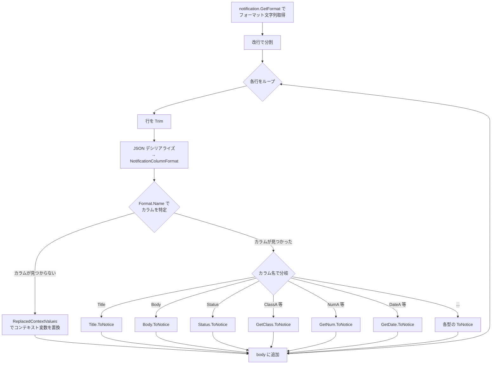

# 通知カスタムフォーマット・プレースホルダの仕組み

プリザンターの通知機能におけるカスタムフォーマット（`UseCustomFormat`）とプレースホルダ（`[ColumnName]`）の定義・解析・置換ロジックを調査する。

<!-- START doctoc generated TOC please keep comment here to allow auto update -->
<!-- DON'T EDIT THIS SECTION, INSTEAD RE-RUN doctoc TO UPDATE -->

- [調査情報](#調査情報)
- [調査目的](#調査目的)
- [概要](#概要)
- [通知設定クラスの構造](#通知設定クラスの構造)
    - [`GetFormat` メソッド](#getformat-メソッド)
    - [`GetDefaultFormat` メソッド](#getdefaultformat-メソッド)
- [NotificationColumnFormat クラス](#notificationcolumnformat-クラス)
    - [コンストラクタ](#コンストラクタ)
    - [`DisplayText` メソッド（表示テキスト生成）](#displaytext-メソッド表示テキスト生成)
    - [ValueDisplayTypes 列挙](#valuedisplaytypes-列挙)
- [通知本文の組み立て処理（NoticeBody メソッド）](#通知本文の組み立て処理noticebody-メソッド)
    - [処理フロー](#処理フロー)
    - [コード抜粋](#コード抜粋)
- [プレースホルダの解析（IncludedColumns メソッド）](#プレースホルダの解析includedcolumns-メソッド)
    - [正規表現パターン](#正規表現パターン)
- [件名（Subject）のプレースホルダ置換](#件名subjectのプレースホルダ置換)
    - [`ReplacedDisplayValues` メソッド](#replaceddisplayvalues-メソッド)
    - [`[NotificationTrigger]` 特殊プレースホルダ](#notificationtrigger-特殊プレースホルダ)
- [コンテキスト変数の置換](#コンテキスト変数の置換)
    - [`ReplacedContextValues` メソッド](#replacedcontextvalues-メソッド)
- [ToNotice 拡張メソッド](#tonotice-拡張メソッド)
    - [string 型の ToNotice（選択肢カラムの場合）](#string-型の-tonotice選択肢カラムの場合)
- [宛先アドレスのプレースホルダ](#宛先アドレスのプレースホルダ)
- [ラベルテキスト ↔ カラム名の変換](#ラベルテキスト--カラム名の変換)
- [リンクカラム形式 `[ClassA~1234,ClassB]` のサポート状況](#リンクカラム形式-classa1234classb-のサポート状況)
    - [結論: 通知プレースホルダではサポートされない](#結論-通知プレースホルダではサポートされない)
    - [理由](#理由)
    - [チルダ構文の本来の用途](#チルダ構文の本来の用途)
    - [グリッドデザインとの比較](#グリッドデザインとの比較)
    - [通知で選択肢の表示テキストを得る方法](#通知で選択肢の表示テキストを得る方法)
- [利用可能なプレースホルダ一覧](#利用可能なプレースホルダ一覧)
    - [フォーマット本文で指定可能な JSON プロパティ](#フォーマット本文で指定可能な-json-プロパティ)
    - [フォーマット本文（`Name` フィールドで指定可能なカラム名）](#フォーマット本文name-フィールドで指定可能なカラム名)
    - [コンテキスト変数（波括弧）](#コンテキスト変数波括弧)
    - [件名専用](#件名専用)
- [リンクカラム形式対応の実装案](#リンクカラム形式対応の実装案)
    - [現状の制約](#現状の制約)
    - [実装案の比較](#実装案の比較)
    - [案 A: `IncludedColumns` を拡張（推奨）](#案-a-includedcolumns-を拡張推奨)
    - [案 B: `NoticeBody` にフォールバック追加](#案-b-noticebody-にフォールバック追加)
    - [案 C: 通知 SQL クエリを JOIN 拡張](#案-c-通知-sql-クエリを-join-拡張)
    - [推奨案](#推奨案)
    - [実装時の注意事項](#実装時の注意事項)
- [結論](#結論)
- [関連ソースコード](#関連ソースコード)

<!-- END doctoc generated TOC please keep comment here to allow auto update -->

## 調査情報

| 調査日        | リポジトリ | ブランチ           | タグ/バージョン | コミット     | 備考     |
| ------------- | ---------- | ------------------ | --------------- | ------------ | -------- |
| 2026年2月18日 | Pleasanter | Pleasanter_1.5.1.0 |                 | `34f162a439` | 初回調査 |

## 調査目的

通知のカスタムフォーマットにおいて、`[ColumnName]` 形式のプレースホルダがどのように定義・解析・置換されるかを把握する。特に、リンクカラム形式（`[ClassA~1234,ClassB]` のようなチルダ構文）が通知プレースホルダで利用可能かを明らかにする。

---

## 概要

プリザンターの通知には 2 種類のプレースホルダ体系がある。

| 区分             | 使用箇所   | プレースホルダ形式                    | 概要                                                                               |
| ---------------- | ---------- | ------------------------------------- | ---------------------------------------------------------------------------------- |
| 本文（Format）   | 通知本文   | JSON 行（`NotificationColumnFormat`） | 各行が `NotificationColumnFormat` の JSON としてデシリアライズされ、カラム値に変換 |
| 件名（Subject）  | 通知件名   | `[ColumnName]`                        | `ReplacedDisplayValues` で `[カラム名]` → 表示値に置換                             |
| コンテキスト変数 | 本文・件名 | `{Url}`, `{UserName}` 等              | `ReplacedContextValues` で固定変数を置換                                           |

---

## 通知設定クラスの構造

**ファイル**: `Implem.Pleasanter/Libraries/Settings/Notification.cs`

```csharp
public class Notification : ISettingListItem
{
    public bool? UseCustomFormat;   // カスタムフォーマット有効化フラグ
    public string Format;           // カスタムフォーマット文字列（改行区切り）
    public string Subject;          // 通知件名（プレースホルダ使用可）
    public string Body;             // 通知本文（プロセス通知用）
    public List<string> MonitorChangesColumns; // 監視対象カラム
    // ...
}
```

### `GetFormat` メソッド

**ファイル**: `Implem.Pleasanter/Libraries/Settings/Notification.cs`（行番号: 556-560）

```csharp
public string GetFormat(Context context, SiteSettings ss)
{
    return Strings.CoalesceEmpty(Format, GetDefaultFormat(
        context: context,
        ss: ss));
}
```

カスタムフォーマットが空の場合、`GetDefaultFormat` でデフォルトフォーマットが生成される。

### `GetDefaultFormat` メソッド

**ファイル**: `Implem.Pleasanter/Libraries/Settings/Notification.cs`（行番号: 562-570）

```csharp
public string GetDefaultFormat(Context context, SiteSettings ss)
{
    return "{Url}\n"
        + ColumnCollection(
            context: context,
            ss: ss,
            update: true)
                .Select(o => new NotificationColumnFormat(
                    columnName: o.ColumnName).ToJson())
                .Join("\n")
        + "\n\n{UserName}<{MailAddress}>";
}
```

デフォルトフォーマットは以下の構造:

```text
{Url}
{"Name":"[Title]"}
{"Name":"[Body]"}
{"Name":"[Status]"}
...（監視対象カラムごとに1行のJSON）
{UserName}<{MailAddress}>
```

---

## NotificationColumnFormat クラス

**ファイル**: `Implem.Pleasanter/Libraries/Settings/NotificationColumnFormat.cs`

各行は `NotificationColumnFormat` の JSON 形式でシリアライズされる。

```csharp
public class NotificationColumnFormat
{
    public string Name;              // プレースホルダ名（例: "[Title]", "[ClassA]"）
    public string Prefix;            // ラベル前のプレフィックス
    public string Delimiter;         // ラベルと値の区切り文字（デフォルト: " : "）
    public string Allow;             // 変更前後の区切り文字（デフォルト: " => "）
    public string DiffTypes;         // 差分表示方式（"standard" or "DiffMatchPatch"）
    public string StartBracket;      // 差分表示の開始括弧
    public string EndBracket;        // 差分表示の終了括弧
    public string DeletePrefixSymbol; // 削除部分のプレフィックス記号
    public string DeleteSuffixSymbol; // 削除部分のサフィックス記号
    public string AddPrefixSymbol;   // 追加部分のプレフィックス記号
    public string AddSuffixSymbol;   // 追加部分のサフィックス記号
    public bool? Always;             // 更新されていなくても常に表示
    public ValueDisplayTypes? DisplayTypes; // 表示タイプ（変更前後/変更前のみ/変更後のみ）
    public bool? ValueOnly;          // 値のみ表示（ヘッダ非表示）
    public bool? ConsiderMultiLine;  // 複数行を考慮した表示
}
```

### コンストラクタ

```csharp
public NotificationColumnFormat(string columnName)
{
    Name = $"[{columnName}]";  // "[ClassA]" のように [] で囲む
}
```

### `DisplayText` メソッド（表示テキスト生成）

```csharp
public string DisplayText(string self, string saved, Column column, bool updated, bool update)
{
    return update
        ? updated
            ? !saved.IsNullOrEmpty()
                ? GetColumnDisplayText(column, saved, self)  // 変更あり
                : $"{Header(column)}{Self(self)}"            // 新規値
            : Always == true
                ? $"{Header(column)}{Self(self)}"            // 常に表示
                : string.Empty                               // 変更なし→空
        : $"{Header(column)}{Self(self)}";                   // 作成時
}
```

### ValueDisplayTypes 列挙

| 値  | 名前                   | 説明                                     |
| --- | ---------------------- | ---------------------------------------- |
| 0   | `BeforeAndAfterChange` | 変更前と変更後の両方を表示（デフォルト） |
| 1   | `BeforeChange`         | 変更前のみ                               |
| 2   | `AfterChange`          | 変更後のみ                               |

---

## 通知本文の組み立て処理（NoticeBody メソッド）

**ファイル**: `Implem.Pleasanter/Models/Results/ResultModel.cs`（行番号: 4030-4200）

### 処理フロー



### コード抜粋

```csharp
private string NoticeBody(
    Context context, SiteSettings ss,
    Notification notification, bool update = false)
{
    var body = new System.Text.StringBuilder();
    notification.GetFormat(context: context, ss: ss)
        .Split('\n')
        .Select(line => new
        {
            Line = line.Trim(),
            Format = line.Trim().Deserialize<NotificationColumnFormat>()
        })
        .ForEach(data =>
        {
            var column = ss.IncludedColumns(data.Format?.Name)?.FirstOrDefault();
            if (column == null)
            {
                // JSON ではない行 → コンテキスト変数として置換
                body.Append(ReplacedContextValues(context: context, value: data.Line));
                body.Append("\n");
            }
            else
            {
                // カラム名に対応する値を ToNotice で変換
                switch (column.Name)
                {
                    case "Title":
                        body.Append(Title.ToNotice(...));
                        break;
                    case "Body":
                        body.Append(Body.ToNotice(...));
                        break;
                    // ... 各カラムに対応する分岐
                    default:
                        switch (Def.ExtendedColumnTypes.Get(column?.Name ?? string.Empty))
                        {
                            case "Class":
                                body.Append(GetClass(columnName: column.Name).ToNotice(...));
                                break;
                            case "Num":
                                body.Append(GetNum(columnName: column.Name).ToNotice(...));
                                break;
                            // ... Date, Description, Check, Attachments
                        }
                        break;
                }
            }
        });
    return body.ToString();
}
```

---

## プレースホルダの解析（IncludedColumns メソッド）

**ファイル**: `Implem.Pleasanter/Libraries/Settings/SiteSettings.cs`（行番号: 4428-4460）

`[...]` で囲まれたカラム名を正規表現で抽出する中核メソッド。

```csharp
public List<Column> IncludedColumns(string value, bool labelText = false)
{
    var columns = new List<Column>();
    if (!value.IsNullOrEmpty())
    {
        foreach (Match match in value.RegexMatches(@"(?<=\[).+?(?=\])"))
        {
            var isValue = false;
            var columnName = match.Value;
            if (!labelText && columnName.StartsWith("@"))
            {
                isValue = true;
                columnName = columnName.Substring(1);
            }
            var column = labelText
                ? Columns.FirstOrDefault(o => o.LabelText == columnName)
                : Columns.FirstOrDefault(o => o.ColumnName == columnName);
            if (column != null)
            {
                column.OutputType = isValue
                    ? Column.OutputTypes.Value
                    : Column.OutputTypes.DisplayValue;
                columns.Add(column);
            }
        }
    }
    return columns.DistinctBy(column => column.ColumnName).ToList();
}
```

### 正規表現パターン

```regex
(?<=\[).+?(?=\])
```

| パターン要素 | 意味                              |
| ------------ | --------------------------------- |
| `(?<=\[)`    | `[` の直後（肯定後読み）          |
| `.+?`        | 1文字以上の任意文字（最短マッチ） |
| `(?=\])`     | `]` の直前（肯定先読み）          |

**重要**: この正規表現は `[` と `]` の間のテキストをカラム名として抽出するが、`Columns.FirstOrDefault(o => o.ColumnName == columnName)` でカラム名の完全一致を要求する。

**`@` プレフィックスについて**:
`IncludedColumns` は `[@ColumnName]` のように `@` を先頭に付けた形式も認識し、
`@` を除去してカラム名を検索する。
この場合 `column.OutputType` が `Column.OutputTypes.Value`（値出力）に設定される。
ただし、通知の件名置換（`ReplacedDisplayValues`）では
`value.Replace($"[{column.ColumnName}]", ...)` で置換するため、
元の文字列中の `[@ClassA]` は `[ClassA]` と一致せず**置換されない**。
このため、`@` プレフィックスは通知プレースホルダでは実質的に機能しない。
グリッドのカスタムデザインでも同様の制約がある。

---

## 件名（Subject）のプレースホルダ置換

**ファイル**: `Implem.Pleasanter/Models/Results/ResultModel.cs`（行番号: 3808-3822）

### `ReplacedDisplayValues` メソッド

```csharp
public string ReplacedDisplayValues(Context context, SiteSettings ss, string value)
{
    ss.IncludedColumns(value: value).ForEach(column =>
        value = value.Replace(
            $"[{column.ColumnName}]",
            ToDisplay(context: context, ss: ss, column: column,
                mine: Mine(context: context))));
    value = ReplacedContextValues(context, value);
    return value;
}
```

件名では `[ColumnName]` がそのカラムの表示値に直接置換される。

### `[NotificationTrigger]` 特殊プレースホルダ

件名で使用できる特殊プレースホルダ。通知トリガーの種類に応じて置換される。

```csharp
// Created の場合
notification.Subject.Replace("[NotificationTrigger]", Displays.CreatedWord(context: context))
// Updated の場合
notification.Subject.Replace("[NotificationTrigger]", Displays.UpdatedWord(context: context))
// Deleted の場合
notification.Subject.Replace("[NotificationTrigger]", Displays.DeletedWord(context: context))
```

---

## コンテキスト変数の置換

**ファイル**: `Implem.Pleasanter/Models/Results/ResultModel.cs`（行番号: 3825-3841）

### `ReplacedContextValues` メソッド

```csharp
private string ReplacedContextValues(Context context, string value)
{
    var url = Locations.ItemEditAbsoluteUri(context: context, id: ResultId);
    var mailAddress = MailAddressUtilities.Get(context: context, userId: context.UserId);
    value = value
        .Replace("{Url}", url)
        .Replace("{LoginId}", context.User.LoginId)
        .Replace("{UserName}", context.User.Name)
        .Replace("{MailAddress}", mailAddress);
    return value;
}
```

| 変数            | 置換内容                   |
| --------------- | -------------------------- |
| `{Url}`         | レコードの編集画面 URL     |
| `{LoginId}`     | 操作ユーザのログイン ID    |
| `{UserName}`    | 操作ユーザの表示名         |
| `{MailAddress}` | 操作ユーザのメールアドレス |

---

## ToNotice 拡張メソッド

**ファイル**: `Implem.Pleasanter/Libraries/Extensions/ToNoticeExtensions.cs`

各データ型に対応する `ToNotice` 拡張メソッドが定義されている。

| 対象型        | メソッドシグネチャ                     | 備考                                                   |
| ------------- | -------------------------------------- | ------------------------------------------------------ |
| `bool`        | `ToNotice(this bool self, ...)`        | チェックボックス列                                     |
| `int`         | `ToNotice(this int self, ...)`         | 整数列                                                 |
| `long`        | `ToNotice(this long self, ...)`        | 長整数列                                               |
| `DateTime`    | `ToNotice(this DateTime self, ...)`    | 日付列（ローカル時間変換あり）                         |
| `string`      | `ToNotice(this string self, ...)`      | クラス・テキスト列（**選択肢の表示テキスト変換あり**） |
| `Attachments` | `ToNotice(this Attachments self, ...)` | 添付ファイル列                                         |

### string 型の ToNotice（選択肢カラムの場合）

```csharp
public static string ToNotice(
    this string self, Context context, string saved,
    Column column, NotificationColumnFormat notificationColumnFormat,
    bool updated, bool update)
{
    if (column.HasChoices())
    {
        var selfChoiceParts = column.ChoiceParts(
            context: context, selectedValues: self, type: ExportColumn.Types.Text);
        var savedChoiceParts = column.ChoiceParts(
            context: context, selectedValues: saved, type: ExportColumn.Types.Text);
        return notificationColumnFormat.DisplayText(
            self: column.MultipleSelections == true
                ? selfChoiceParts.Join(", ")
                : selfChoiceParts.FirstOrDefault(),
            saved: ...,
            column: column, updated: updated, update: update);
    }
    // ...
}
```

選択肢カラム（Class 列がリンクカラムの場合を含む）では `ChoiceParts` を通じて値 → 表示テキストに変換される。

---

## 宛先アドレスのプレースホルダ

**ファイル**: `Implem.Pleasanter/Libraries/Settings/Notification.cs`（行番号: 247-273）

通知メールの宛先でもプレースホルダが使用可能。

```csharp
valuesTo?.ForEach(data => addresses = addresses.Replace(
    $"[{data.Key.ColumnName}]",
    ReplacedAddress(context: context, column: data.Key, value: data.Value, create: create)));
```

| プレースホルダ   | 説明                                                                             |
| ---------------- | -------------------------------------------------------------------------------- |
| `[ColumnName]`   | 該当カラムの値からメールアドレスを解決（例: `[Manager]`, `[Owner]`, `[ClassA]`） |
| `[RelatedUsers]` | 関連ユーザ（Manager・Owner・Creator・Updator）全員のメールアドレス               |

宛先フィールドに `[Manager]` や `[Owner]` を記述すると、
`ss.IncludedColumns(notification.Address)` でカラムを検出し、
そのカラムの値（ユーザ ID）からメールアドレスを
`ReplacedAddress` メソッドで解決する。
選択肢カラム（ClassA 等）にユーザが含まれている場合も同様に使用可能。

---

## ラベルテキスト ↔ カラム名の変換

**ファイル**: `Implem.Pleasanter/Libraries/Settings/SiteSettings.cs`（行番号: 4391-4415）

UI 上ではユーザにラベルテキスト（日本語名等）を表示し、内部ではカラム名で保存する。

```csharp
// ラベルテキスト → カラム名（保存時）
public string LabelTextToColumnName(string text)
{
    IncludedColumns(text, labelText: true).ForEach(column =>
        text = text.Replace($"[{column.LabelText}]", $"[{column.ColumnName}]"));
    return text;
}

// カラム名 → ラベルテキスト（表示時）
public string ColumnNameToLabelText(string text)
{
    IncludedColumns(text).ForEach(column =>
        text = text.Replace($"[{column.ColumnName}]", $"[{column.LabelText}]"));
    return text;
}
```

---

## リンクカラム形式 `[ClassA~1234,ClassB]` のサポート状況

### 結論: 通知プレースホルダではサポートされない

`[ClassA~1234,ClassB]` のようなチルダ構文は、通知のプレースホルダとしては**サポートされていない**。

### 理由

1. **`IncludedColumns` の正規表現**:
   `(?<=\[).+?(?=\])` で抽出されるテキストは
   `ClassA~1234,ClassB` となる
2. **カラム名の完全一致**:
   `Columns.FirstOrDefault(o => o.ColumnName == columnName)` で検索するため、
   `ClassA~1234,ClassB` という文字列はどのカラム名にも一致しない
3. **チルダ構文の解析ロジックが存在しない**:
   `IncludedColumns` メソッドにチルダ（`~`）やカンマ（`,`）を
   解析するロジックは実装されていない

### チルダ構文の本来の用途

チルダ構文 `ClassA~1234,ClassB` はプリザンターのテーブル結合（JOIN）を表す記法である。

| 記法                 | 意味                                                   |
| -------------------- | ------------------------------------------------------ |
| `ClassA~1234`        | ClassA カラムで SiteId=1234 のテーブルへのリンクパス   |
| `ClassA~1234,ClassB` | リンク先テーブルの ClassB カラムを参照（カンマ区切り） |
| `ClassA~1234,Title`  | リンク先テーブルのタイトルを参照                       |

この形式は `SiteSettings.GetColumn()` メソッドで処理され、
`columnName.Contains(',')` を検出して `AddJoinedColumn` を呼び出す。
しかし、`IncludedColumns` メソッドは `GetColumn` ではなく
`Columns.FirstOrDefault()` で直接検索するため、
JOIN を介した列解決が行われない。

### グリッドデザインとの比較

グリッドデザインのプレースホルダ置換ロジック
（`ResultUtilities.cs` の
`gridDesign.Replace("[" + column.ColumnName + "]", value)`）
も同じ `IncludedColumns` を使用しており、
チルダ構文を独自に解析する処理はない。ただし、グリッドの一覧表示では `GetGridColumns` → `GetColumn` の経路でテーブル結合カラムが `Columns` リストに追加済みとなるため、カスタムデザインで機能する場合がある。通知処理ではこの事前解決が行われない。

### 通知で選択肢の表示テキストを得る方法

通知フォーマットでは、リンクカラム（例: `ClassA`）に対して
`[ClassA]` と記述すると、`ToNotice` 拡張メソッド内で
`column.HasChoices()` が `true` の場合に `ChoiceParts` を経由して
選択肢の表示テキスト（`Text` プロパティ）が自動的に使用される。
つまり、**チルダ構文を使わなくても、リンクカラムの表示テキストは自動的に変換される**。

---

## 利用可能なプレースホルダ一覧

### フォーマット本文で指定可能な JSON プロパティ

カスタムフォーマットの各行は `NotificationColumnFormat` の JSON として記述する。

| プロパティ           | 型     | デフォルト | 説明                                                |
| -------------------- | ------ | ---------- | --------------------------------------------------- |
| `Name`               | string | ―          | `[ColumnName]` 形式のプレースホルダ名（必須）       |
| `Prefix`             | string | `""`       | ラベル前のプレフィックス                            |
| `Delimiter`          | string | `" : "`    | ラベルと値の区切り文字                              |
| `Allow`              | string | `" => "`   | 変更前後の区切り文字                                |
| `DiffTypes`          | string | `standard` | 差分表示方式（`standard` or `DiffMatchPatch`）      |
| `StartBracket`       | string | `(`        | DiffMatchPatch 差分の開始括弧                       |
| `EndBracket`         | string | `)`        | DiffMatchPatch 差分の終了括弧                       |
| `DeletePrefixSymbol` | string | `-`        | 削除部分のプレフィックス記号                        |
| `DeleteSuffixSymbol` | string | `""`       | 削除部分のサフィックス記号                          |
| `AddPrefixSymbol`    | string | `+`        | 追加部分のプレフィックス記号                        |
| `AddSuffixSymbol`    | string | `""`       | 追加部分のサフィックス記号                          |
| `Always`             | bool?  | `null`     | `true` の場合、更新されていなくても常に本文に含める |
| `DisplayTypes`       | int?   | `null`     | `0`: 変更前後、`1`: 変更前のみ、`2`: 変更後のみ     |
| `ValueOnly`          | bool?  | `null`     | `true` の場合、ヘッダ（ラベル名）を非表示にする     |
| `ConsiderMultiLine`  | bool?  | `null`     | `false` にすると MarkDown カラムの改行を抑制する    |

**記述例**:

```json
{"Name":"[Title]","Delimiter":": ","Always":true,"ValueOnly":true}
{"Name":"[Status]","DisplayTypes":2}
{"Name":"[Body]","DiffTypes":"DiffMatchPatch","StartBracket":"【","EndBracket":"】","DeletePrefixSymbol":"削除:","AddPrefixSymbol":"追加:"}
```

### フォーマット本文（`Name` フィールドで指定可能なカラム名）

| カテゴリ                  | プレースホルダ例                     | 説明                                   |
| ------------------------- | ------------------------------------ | -------------------------------------- |
| 固定カラム（共通）        | `[Title]`, `[Body]`, `[Status]`      | タイトル、本文、ステータス             |
| 固定カラム（共通）        | `[Manager]`, `[Owner]`               | 担当者、管理者                         |
| 固定カラム（共通）        | `[Locked]`, `[Comments]`             | ロック状態、コメント                   |
| 固定カラム（共通）        | `[Creator]`, `[Updator]`             | 作成者、更新者                         |
| 固定カラム（Issues 専用） | `[StartTime]`, `[CompletionTime]`    | 開始日、完了日（期限付きテーブルのみ） |
| 固定カラム（Issues 専用） | `[WorkValue]`, `[ProgressRate]`      | 作業量、進捗率（期限付きテーブルのみ） |
| 拡張カラム（Class）       | `[ClassA]` 〜 `[ClassZ]`             | 分類列                                 |
| 拡張カラム（Num）         | `[NumA]` 〜 `[NumZ]`                 | 数値列                                 |
| 拡張カラム（Date）        | `[DateA]` 〜 `[DateZ]`               | 日付列                                 |
| 拡張カラム（Description） | `[DescriptionA]` 〜 `[DescriptionZ]` | 説明列                                 |
| 拡張カラム（Check）       | `[CheckA]` 〜 `[CheckZ]`             | チェック列                             |
| 拡張カラム（Attachments） | `[AttachmentsA]` 〜 `[AttachmentsZ]` | 添付ファイル列                         |

### コンテキスト変数（波括弧）

| 変数            | 説明                       |
| --------------- | -------------------------- |
| `{Url}`         | レコード編集画面の URL     |
| `{LoginId}`     | 操作ユーザのログイン ID    |
| `{UserName}`    | 操作ユーザの表示名         |
| `{MailAddress}` | 操作ユーザのメールアドレス |

### 件名専用

| プレースホルダ          | 説明                                               |
| ----------------------- | -------------------------------------------------- |
| `[NotificationTrigger]` | 通知トリガー種別（作成/更新/削除）                 |
| `[カラム名]`            | 各カラムの表示値（`ReplacedDisplayValues` で置換） |

---

## リンクカラム形式対応の実装案

通知プレースホルダで `[ClassA~1234,ClassB]`
のようなリンクカラム形式をサポートするための実装案を以下に示す。

### 現状の制約

```text
ユーザが通知フォーマットに [ClassA~1234,ClassB] と記述
  ↓
IncludedColumns が正規表現で "ClassA~1234,ClassB" を抽出
  ↓
Columns.FirstOrDefault(o => o.ColumnName == "ClassA~1234,ClassB")
  ↓
ローカルの Columns リストに該当なし → null（カラム未解決）
  ↓
NoticeBody は column == null のため、行をそのまま出力（プレースホルダ未置換）
```

`GetColumn(context, columnName)` メソッドは `columnName.Contains(',')` を
検知して `AddJoinedColumn` を呼び出し、`JoinedSsHash` から
リンク先の `SiteSettings` を取得してカラムを動的に作成できる。
しかし `IncludedColumns` はこの経路を通らないため結合カラムが解決されない。

### 実装案の比較

| #   | 案                                | 変更範囲 | パフォーマンス | 既存互換性 |
| --- | --------------------------------- | -------- | -------------- | ---------- |
| A   | `IncludedColumns` を拡張          | 小       | ○ (遅延解決)   | 高         |
| B   | `NoticeBody` にフォールバック追加 | 中       | △ (追加クエリ) | 高         |
| C   | 通知 SQL を JOIN 拡張             | 大       | ◎ (一括取得)   | 中         |

### 案 A: `IncludedColumns` を拡張（推奨）

#### 概要

`IncludedColumns` メソッドにおいて、
ローカルの `Columns` リストで見つからなかったカラム名に `,` が
含まれる場合、`GetColumn(context, columnName)` にフォールバックする。
`GetColumn` は `AddJoinedColumn` を経由して
`JoinedSsHash` からリンク先カラムを動的に解決・登録する。

#### 変更対象ファイル

| ファイル                               | 変更内容                                                              |
| -------------------------------------- | --------------------------------------------------------------------- |
| `SiteSettings.cs`                      | `IncludedColumns` に `Context` パラメータ付きオーバーロード追加       |
| `Model_Notice_Body.txt`                | `ss.IncludedColumns(...)` → `ss.IncludedColumns(context, ...)` に変更 |
| `Model_ReplacedDisplayValues_Body.txt` | 同上                                                                  |

#### 変更の詳細

**1. `SiteSettings.IncludedColumns` にオーバーロード追加**

```csharp
// 既存メソッド（互換性維持のためそのまま残す）
public List<Column> IncludedColumns(string value, bool labelText = false)
{
    return IncludedColumns(
        context: null,
        value: value,
        labelText: labelText);
}

// 新規オーバーロード
public List<Column> IncludedColumns(
    Context context,
    string value,
    bool labelText = false)
{
    var columns = new List<Column>();
    if (!value.IsNullOrEmpty())
    {
        foreach (Match match in value.RegexMatches(
            @"(?<=\[).+?(?=\])"))
        {
            var isValue = false;
            var columnName = match.Value;
            if (!labelText && columnName.StartsWith("@"))
            {
                isValue = true;
                columnName = columnName.Substring(1);
            }
            var column = labelText
                ? Columns.FirstOrDefault(o =>
                    o.LabelText == columnName)
                : Columns.FirstOrDefault(o =>
                    o.ColumnName == columnName);
            // ★ 追加: ローカル未解決 & 結合カラム形式の場合
            if (column == null
                && context != null
                && columnName.Contains(','))
            {
                column = GetColumn(
                    context: context,
                    columnName: columnName);
            }
            if (column != null)
            {
                column.OutputType = isValue
                    ? Column.OutputTypes.Value
                    : Column.OutputTypes.DisplayValue;
                columns.Add(column);
            }
        }
    }
    return columns
        .DistinctBy(column => column.ColumnName)
        .ToList();
}
```

**2. `NoticeBody` テンプレート変更**

```diff
- var column = ss.IncludedColumns(data.Format?.Name)
-     ?.FirstOrDefault();
+ var column = ss.IncludedColumns(
+     context: context,
+     value: data.Format?.Name)
+         ?.FirstOrDefault();
```

**3. `ReplacedDisplayValues` テンプレート変更**

```diff
- ss.IncludedColumns(value: value).ForEach(column =>
+ ss.IncludedColumns(
+     context: context,
+     value: value).ForEach(column =>
```

#### カラム解決後のデータ取得

`IncludedColumns` の拡張により `Column` オブジェクトは解決されるが、
リンク先レコードの値は現在のモデルに読み込まれていない。
`NoticeBody` 内の `switch (column.Name)` で処理する際、
結合カラム（`column.Joined == true`）の場合は追加のデータ取得が必要になる。

**NoticeBody の結合カラム処理を追加**

`NoticeBody` テンプレートの `else` ブロック（カラムが解決された場合）に、
結合カラム専用の分岐を追加する。

```csharp
else
{
    if (column.Joined)
    {
        // リンク先レコードの値を取得して表示
        body.Append(GetJoinedColumnNotice(
            context: context,
            ss: ss,
            column: column,
            notificationColumnFormat: data.Format,
            update: update));
    }
    else
    {
        switch (column.Name)
        {
            // ... 既存の case 文
        }
    }
}
```

**`GetJoinedColumnNotice` ヘルパーメソッドの実装**

```csharp
private string GetJoinedColumnNotice(
    Context context,
    SiteSettings ss,
    Column column,
    NotificationColumnFormat notificationColumnFormat,
    bool update)
{
    var columnNameInfo = new ColumnNameInfo(column.ColumnName);
    var joinedSs = ss.JoinedSsHash.Get(columnNameInfo.SiteId);
    if (joinedSs == null) return string.Empty;

    // リンク元カラム（例: ClassA）からリンク先レコード ID を取得
    var linkColumnName = columnNameInfo
        .TableAlias.Split('-').Last().Split('~').First();
    var linkedRecordId = PropertyValue(
        context: context,
        column: ss.GetColumn(
            context: context,
            columnName: linkColumnName))?.ToLong() ?? 0;
    if (linkedRecordId == 0) return string.Empty;

    // リンク先テーブルの種別に応じてモデルを生成し値を取得
    switch (joinedSs.ReferenceType)
    {
        case "Issues":
            var issueModel = new IssueModel(
                context: context,
                ss: joinedSs,
                issueId: linkedRecordId);
            return issueModel.ToDisplay(
                context: context,
                ss: joinedSs,
                column: joinedSs.GetColumn(
                    context: context,
                    columnName: columnNameInfo.Name),
                mine: issueModel.Mine(context: context))
                    .ToNotice(
                        context: context,
                        saved: string.Empty,
                        column: column,
                        notificationColumnFormat:
                            notificationColumnFormat,
                        updated: false,
                        update: update);
        case "Results":
            var resultModel = new ResultModel(
                context: context,
                ss: joinedSs,
                resultId: linkedRecordId);
            return resultModel.ToDisplay(
                context: context,
                ss: joinedSs,
                column: joinedSs.GetColumn(
                    context: context,
                    columnName: columnNameInfo.Name),
                mine: resultModel.Mine(context: context))
                    .ToNotice(
                        context: context,
                        saved: string.Empty,
                        column: column,
                        notificationColumnFormat:
                            notificationColumnFormat,
                        updated: false,
                        update: update);
        default:
            return string.Empty;
    }
}
```

#### 案 A の考慮事項

| 観点           | 説明                                                                 |
| -------------- | -------------------------------------------------------------------- |
| 互換性         | 既存の引数なしオーバーロードを残すため既存コードへの影響なし         |
| パフォーマンス | 結合カラム 1 つにつき DB クエリ 1 回発生（N+1 問題の可能性あり）     |
| CodeDefiner    | テンプレート（`.txt`）の変更が必要。CodeDefiner 実行で全モデルに反映 |
| テーブル種別   | `IssueModel` / `ResultModel` / `WikiModel` の 3 種別に対応が必要     |
| 変更前後の差分 | `saved` 値の取得にはリンク先の変更前データも必要（完全対応は複雑）   |

### 案 B: `NoticeBody` にフォールバック追加

#### 概要

`IncludedColumns` は変更せず、`NoticeBody` メソッド内で
`column == null` かつプレースホルダ名に `,` が含まれる場合に
`ss.GetColumn(context, columnName)` を呼び出す。
カラム解決後のデータ取得は案 A と同様。

#### 変更の詳細

```csharp
// NoticeBody 内
var column = ss.IncludedColumns(
    data.Format?.Name)?.FirstOrDefault();
// ★ 追加: フォールバック
if (column == null && data.Format?.Name != null)
{
    var match = data.Format.Name
        .RegexMatches(@"(?<=\[).+?(?=\])")
        .FirstOrDefault();
    if (match?.Value?.Contains(',') == true)
    {
        column = ss.GetColumn(
            context: context,
            columnName: match.Value);
    }
}
```

#### 案 B の考慮事項

| 観点        | 説明                                                              |
| ----------- | ----------------------------------------------------------------- |
| 互換性      | `IncludedColumns` 自体を変更しないため影響範囲が狭い              |
| 一貫性      | `ReplacedDisplayValues`（件名）にも個別に同じフォールバックが必要 |
| CodeDefiner | `Model_Notice_Body.txt` テンプレートの変更が必要                  |
| 保守性      | 結合カラム解決のロジックが複数箇所に分散する                      |

### 案 C: 通知 SQL クエリを JOIN 拡張

#### 概要

`NoticeBody` 呼び出し前に、通知フォーマットに含まれる結合カラムを
解析し、リンク先テーブルを JOIN した SQL クエリでデータを一括取得する。
`GridData` のデータ取得方式に近いアプローチ。

#### 変更イメージ

1. 通知フォーマット解析時に結合カラム名を抽出
2. `ss.Join()` を使って JOIN 句を構築
3. JOIN 結果の `DataRow` からリンク先カラム値を取得
4. `NoticeBody` に取得済みの結合カラム値辞書を渡す

#### 変更対象ファイル

| ファイル                               | 変更内容                                        |
| -------------------------------------- | ----------------------------------------------- |
| `SiteSettings.cs`                      | 結合カラム名の一括解析メソッド追加              |
| `Model_Notice_Body.txt`                | JOIN クエリ実行 + 結合データ辞書の受け渡し      |
| `Model_ReplacedDisplayValues_Body.txt` | 結合データ辞書の参照                            |
| `GridData.cs`                          | 参考実装（既存のJOINカラム データ取得ロジック） |

#### 案 C の考慮事項

| 観点           | 説明                                                           |
| -------------- | -------------------------------------------------------------- |
| パフォーマンス | JOIN で一括取得するため N+1 問題が発生しない                   |
| 実装コスト     | 変更範囲が大きく、SQL 生成への影響を慎重にテストする必要がある |
| 互換性         | 通知処理の SQL 構造が変わるため回帰リスクが高い                |
| 変更前後の差分 | JOIN で `TableTypes.History` から変更前データも取得可能        |

### 推奨案

**案 A（`IncludedColumns` の拡張）を推奨する。** 理由は以下の通り。

1. **変更範囲が最小限**: `IncludedColumns` のオーバーロード追加 +
   テンプレート 2 ファイルの呼び出し修正 + ヘルパーメソッド 1 つ
2. **既存互換性が高い**: 引数なしオーバーロードをそのまま残すため、
   通知以外の `IncludedColumns` 呼び出し元に影響なし
3. **段階的な拡張が可能**: まず基本的な値表示に対応し、
   変更前後の差分表示は後続対応として切り分けられる
4. **CodeDefiner との親和性**: テンプレート変更のみで
   全モデル（Issues/Results/Wikis）に一括反映される

#### N+1 問題の緩和策

結合カラムが複数ある場合の N+1 クエリを緩和するために、
`NoticeBody` の先頭でフォーマット内の全結合カラムを事前解析し、
リンク先テーブルごとにまとめて 1 回のクエリでデータを取得する
バッチ取得方式を検討できる。

```csharp
// NoticeBody 先頭での事前取得イメージ
var joinedData = new Dictionary<string, BaseModel>();
notification.GetFormat(context: context, ss: ss)
    .Split('\n')
    .Select(line => line.Trim()
        .Deserialize<NotificationColumnFormat>())
    .Where(f => f?.Name != null)
    .ForEach(f =>
    {
        var col = ss.IncludedColumns(
            context: context,
            value: f.Name)?.FirstOrDefault();
        if (col?.Joined == true)
        {
            var info = new ColumnNameInfo(col.ColumnName);
            // リンク先レコード ID を取得して一括ロード
            // （同一テーブルのカラムはモデル 1 回の取得で済む）
        }
    });
```

### 実装時の注意事項

1. **CodeDefiner による自動生成**:
   `NoticeBody`、`ReplacedDisplayValues`、`Notice` は
   すべて `Implem.CodeDefiner` のテンプレートから自動生成される。
   手動でモデルファイルを編集しても CodeDefiner 実行時に上書きされる。
   変更は必ずテンプレートファイル
   （`App_Data/Definitions/Definition_Code/` 配下）に対して行うこと。
2. **`JoinedSsHash` の初期化タイミング**:
   `JoinedSsHash` は `SiteSettings.Init()` で初期化される。
   通知処理時点で `JoinedSsHash` が適切に設定されているか
   確認が必要。特にプロセス通知（`processes`）の場合は
   呼び出し元で `SiteSettings` の初期化状態を要確認。
3. **権限チェック**:
   `GridData` での結合カラム表示では `Permissions.CanRead` による
   リンク先レコードの閲覧権限チェックが行われている。
   通知での結合カラム値取得時にも同等の権限チェックを実装すること。
4. **多段リンク**:
   `ClassA~1234-ClassB~5678,ClassC` のような多段リンク
   （テーブル A → テーブル B → テーブル C）への対応要否を要検討。
   `ColumnNameInfo.Exists` は多段パスを検証するが、
   データ取得では中間テーブルを経由する必要がある。
5. **テスト観点**:
    - 単一リンク（`ClassA~1234,ClassB`）の基本動作
    - リンク先が Issues / Results / Wikis それぞれの場合
    - リンク元カラムが未設定（値が空）の場合
    - リンク先レコードが削除済みの場合
    - 閲覧権限がない場合
    - 件名（Subject）での結合カラムプレースホルダ
    - プロセス通知での動作
    - 更新通知での変更前後の差分表示

---

## 結論

| 項目                              | 結論                                                                                                            |
| --------------------------------- | --------------------------------------------------------------------------------------------------------------- |
| プレースホルダの定義方法          | `NotificationColumnFormat` の JSON 行として `{"Name":"[ColumnName]"}` 形式で定義                                |
| プレースホルダの解析              | `IncludedColumns` メソッドが正規表現 `(?<=\[).+?(?=\])` で `[]` 内を抽出し、カラム名完全一致で検索              |
| 置換の実行                        | 本文は `NoticeBody` メソッド内で `ToNotice` 拡張メソッドにより値変換、件名は `ReplacedDisplayValues` で直接置換 |
| コンテキスト変数                  | `{Url}`, `{LoginId}`, `{UserName}`, `{MailAddress}` が `ReplacedContextValues` で置換                           |
| チルダ構文 `[ClassA~1234,ClassB]` | **通知プレースホルダではサポートされない**。`IncludedColumns` がカラム名完全一致で検索するため                  |
| リンクカラムの表示テキスト        | `[ClassA]` と記述するだけで `ToNotice` が `ChoiceParts` 経由で表示テキストに自動変換する                        |
| カスタムフォーマットの切り替え    | `UseCustomFormat = true` で有効化、`Format` フィールドにカスタムフォーマットを格納                              |

---

## 関連ソースコード

| ファイル                                                                                      | 概要                                                                |
| --------------------------------------------------------------------------------------------- | ------------------------------------------------------------------- |
| `Implem.Pleasanter/Libraries/Settings/Notification.cs`                                        | 通知設定クラス・`GetFormat`・`GetDefaultFormat`・`Send`             |
| `Implem.Pleasanter/Libraries/Settings/NotificationColumnFormat.cs`                            | 通知カラムフォーマットクラス・`DisplayText`                         |
| `Implem.Pleasanter/Libraries/Settings/SiteSettings.cs`                                        | `IncludedColumns`・`GetColumn`・`AddJoinedColumn`・`JoinedSsHash`   |
| `Implem.Pleasanter/Libraries/Settings/ColumnNameInfo.cs`                                      | 結合カラム名の解析（`ClassA~1234,ClassB` → TableAlias/Name/SiteId） |
| `Implem.Pleasanter/Libraries/Settings/ColumnUtilities.cs`                                     | `GetSiteIdByTableAlias` による TableAlias → SiteId 変換             |
| `Implem.Pleasanter/Libraries/Extensions/ToNoticeExtensions.cs`                                | 各型の `ToNotice` 拡張メソッド                                      |
| `Implem.Pleasanter/Libraries/Models/GridData.cs`                                              | JOIN カラムのデータ取得・表示処理（実装案の参考）                   |
| `Implem.Pleasanter/Models/Results/ResultModel.cs`                                             | `NoticeBody`・`ReplacedDisplayValues`・`ReplacedContextValues`      |
| `Implem.Pleasanter/Models/Issues/IssueModel.cs`                                               | Issues 用の `NoticeBody`（Results と同構造）                        |
| `Implem.Pleasanter/Models/Wikis/WikiModel.cs`                                                 | Wiki 用の `NoticeBody`（Results と同構造）                          |
| `Implem.Pleasanter/Libraries/Settings/NotificationUtilities.cs`                               | 通知種別のユーティリティ                                            |
| `Implem.Pleasanter/App_Data/Definitions/Definition_Code/Model_Notice_Body.txt`                | CodeDefiner 自動生成テンプレート（Notice/NoticeBody）               |
| `Implem.Pleasanter/App_Data/Definitions/Definition_Code/Model_ReplacedDisplayValues_Body.txt` | CodeDefiner 自動生成テンプレート（ReplacedDisplayValues）           |
