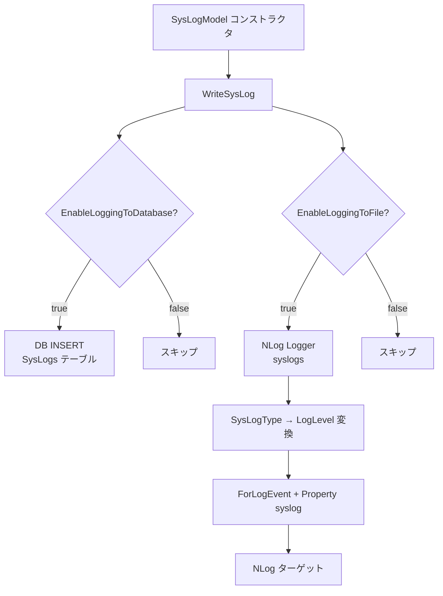
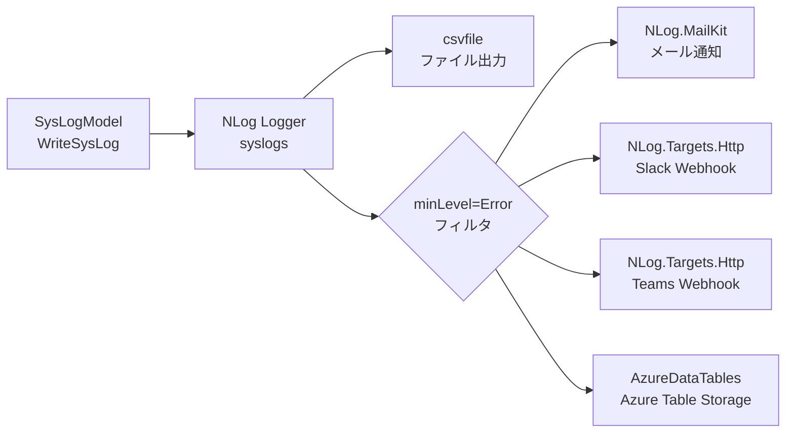
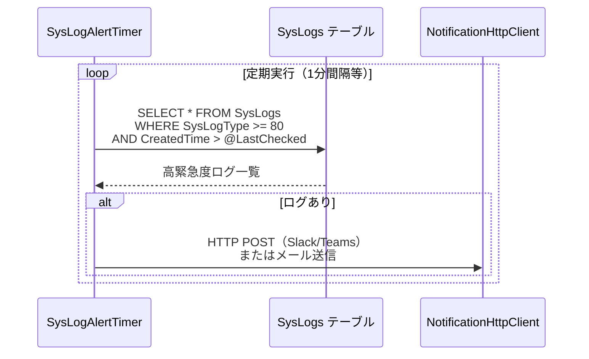
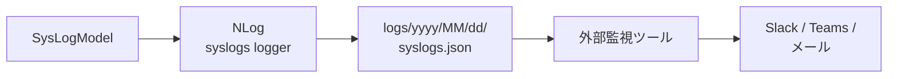
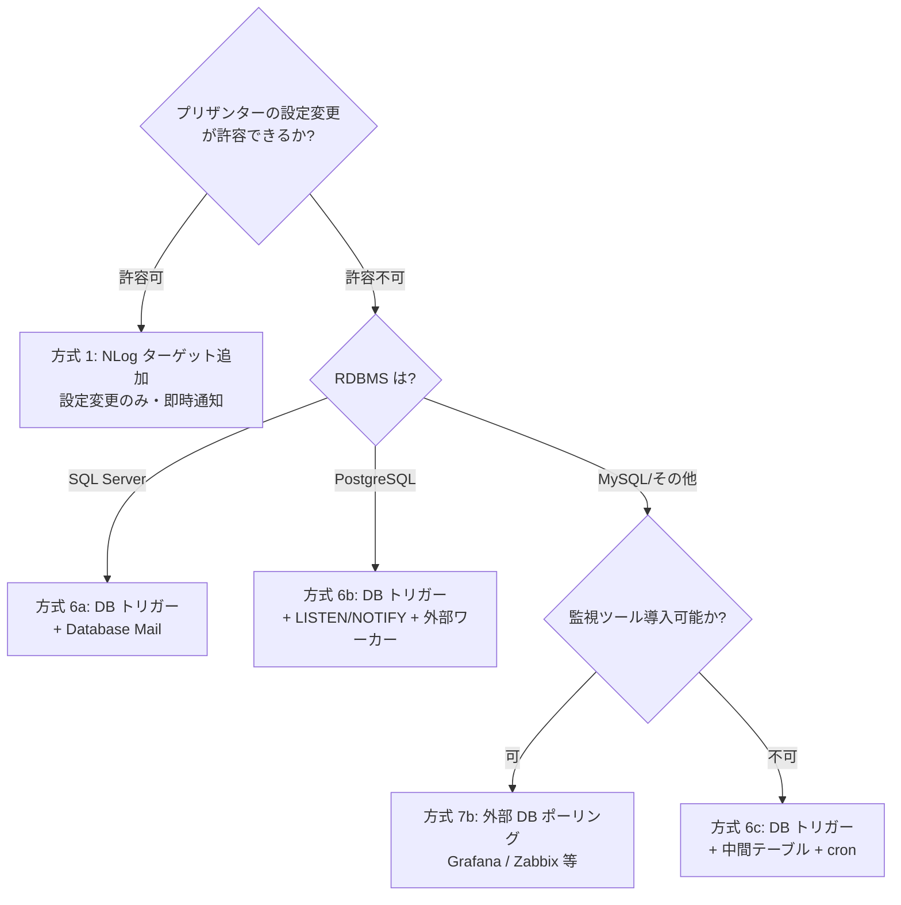
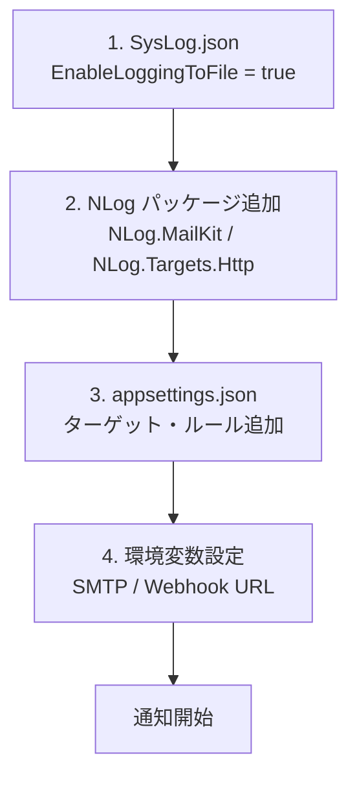

# SysLog 外部通知機構の調査

SysLog に出力される高緊急度ログ（SystemError・Exception）を外部チャットツールやメールに通知する仕組みについて、プリザンター内蔵の機能と NLog 拡張による実現方法を調査する。

<!-- START doctoc generated TOC please keep comment here to allow auto update -->
<!-- DON'T EDIT THIS SECTION, INSTEAD RE-RUN doctoc TO UPDATE -->

- [調査情報](#調査情報)
- [調査目的](#調査目的)
- [SysLog 出力の全体像](#syslog-出力の全体像)
    - [SysLogType の定義](#syslogtype-の定義)
    - [SysLog の出力先](#syslog-の出力先)
    - [SysLog パラメータ](#syslog-パラメータ)
- [NLog の現行構成](#nlog-の現行構成)
    - [パッケージ参照](#パッケージ参照)
    - [appsettings.json の NLog 設定](#appsettingsjson-の-nlog-設定)
    - [NLog.CspReport.config（別用途の参考例）](#nlogcspreportconfig別用途の参考例)
- [方式 1: NLog ターゲット追加による外部通知](#方式-1-nlog-ターゲット追加による外部通知)
    - [前提条件](#前提条件)
    - [SysLogType と NLog LogLevel のマッピング](#syslogtype-と-nlog-loglevel-のマッピング)
    - [方式 1a: NLog.MailKit によるメール通知](#方式-1a-nlogmailkit-によるメール通知)
    - [方式 1b: NLog.Targets.HTTP による Webhook 通知（Slack・Teams）](#方式-1b-nlogtargetshttp-による-webhook-通知slackteams)
    - [方式 1c: SysLogType 値による詳細フィルタリング](#方式-1c-syslogtype-値による詳細フィルタリング)
    - [NLog ターゲット方式のまとめ](#nlog-ターゲット方式のまとめ)
- [方式 2: プリザンター既存通知基盤の活用](#方式-2-プリザンター既存通知基盤の活用)
    - [既存の通知タイプ](#既存の通知タイプ)
    - [SysLog 通知への流用可否](#syslog-通知への流用可否)
- [方式 3: バックグラウンドサービスによるポーリング監視](#方式-3-バックグラウンドサービスによるポーリング監視)
    - [既存のバックグラウンドサービス](#既存のバックグラウンドサービス)
    - [想定実装](#想定実装)
- [方式 4: サーバースクリプト（logs API）の活用](#方式-4-サーバースクリプトlogs-apiの活用)
- [方式 5: HealthCheck エンドポイントの活用](#方式-5-healthcheck-エンドポイントの活用)
- [方式 6: DB トリガーによる外部通知](#方式-6-db-トリガーによる外部通知)
    - [プリザンターの SysLogs テーブル構造](#プリザンターの-syslogs-テーブル構造)
    - [方式 6a: SQL Server - Database Mail + トリガー](#方式-6a-sql-server---database-mail--トリガー)
    - [方式 6b: PostgreSQL - LISTEN/NOTIFY + 外部ワーカー](#方式-6b-postgresql---listennotify--外部ワーカー)
    - [方式 6c: MySQL - トリガー + 外部ポーリング](#方式-6c-mysql---トリガー--外部ポーリング)
    - [DB トリガー方式の比較](#db-トリガー方式の比較)
    - [DB トリガー方式の利点と注意点](#db-トリガー方式の利点と注意点)
- [方式 7: 外部ログ監視ツールによる通知](#方式-7-外部ログ監視ツールによる通知)
    - [方式 7a: ログファイル監視](#方式-7a-ログファイル監視)
    - [方式 7b: DB 直接ポーリング](#方式-7b-db-直接ポーリング)
- [方式比較](#方式比較)
- [推奨構成: 用途別の選択指針](#推奨構成-用途別の選択指針)
    - [推奨 A: NLog ターゲット追加（方式 1）](#推奨-a-nlog-ターゲット追加方式-1)
    - [推奨 B: DB トリガー（方式 6）](#推奨-b-db-トリガー方式-6)
    - [推奨 A の設定手順](#推奨-a-の設定手順)
    - [注意事項](#注意事項)
- [結論](#結論)
- [関連ソースコード](#関連ソースコード)
- [関連ドキュメント](#関連ドキュメント)

<!-- END doctoc generated TOC please keep comment here to allow auto update -->

## 調査情報

| 調査日       | リポジトリ | ブランチ | タグ/バージョン | コミット     | 備考     |
| ------------ | ---------- | -------- | --------------- | ------------ | -------- |
| 2026年3月5日 | Pleasanter | main     |                 | `34f162a439` | 初回調査 |

## 調査目的

SysLog のうち SysLogType の緊急度が高いもの（SystemError=80、Exception=90 など）を検知し、チャットツール（Slack・Teams 等）やメールで外部通知する仕組みを構築したい。そのために以下を明らかにする。

1. プリザンター組み込みの SysLog 出力経路に通知フックを差し込めるか
2. NLog Extension（カスタムターゲット）を利用して SysLogType によるフィルタリング付き通知が可能か
3. プリザンター既存の通知基盤（Notification）を SysLog に流用できるか
4. その他の組み込み機構（HealthCheck・BackgroundService 等）が活用できるか

---

## SysLog 出力の全体像

### SysLogType の定義

**ファイル**: `Implem.Pleasanter/Models/SysLogs/SysLogModel.cs`（行番号: 3342-3349）

```csharp
public enum SysLogTypes : int
{
    Info = 10,
    Warning = 50,
    UserError = 60,
    SystemError = 80,
    Exception = 90
}
```

| SysLogType  | 値  | NLog LogLevel | 想定される通知対象 |
| ----------- | --- | ------------- | ------------------ |
| Info        | 10  | Info          | 通知不要           |
| Warning     | 50  | Warn          | 条件付き           |
| UserError   | 60  | Error         | 条件付き           |
| SystemError | 80  | Error         | 通知対象           |
| Exception   | 90  | Fatal         | 通知対象           |

### SysLog の出力先

SysLog は `SysLogModel` の `WriteSysLog()` メソッドと `Update()` メソッドで 2 つの出力先に書き込まれる。



**ファイル**: `Implem.Pleasanter/Models/SysLogs/SysLogModel.cs`（行番号: 3354-3392）

```csharp
public void WriteSysLog(Context context, SysLogTypes sysLogType)
{
    if (NotLoggingIp(UserHostAddress)) return;
    StartTime = DateTime.Now;
    SetProperties(context: context, sysLogType: sysLogType);
    if (Parameters.SysLog.EnableLoggingToDatabase)
    {
        SysLogId = Repository.ExecuteScalar_response(
            context: context,
            selectIdentity: true,
            statements: Rds.InsertSysLogs(
                selectIdentity: true,
                param: SysLogParam(context: context)))
                    .Id.ToLong();
    }
    if (Parameters.SysLog.EnableLoggingToFile)
    {
        var logLevel = sysLogType switch
        {
            SysLogTypes.Info => LogLevel.Info,
            SysLogTypes.Warning => LogLevel.Warn,
            SysLogTypes.UserError => LogLevel.Error,
            SysLogTypes.SystemError => LogLevel.Error,
            SysLogTypes.Exception => LogLevel.Fatal,
            _ => LogLevel.Info
        };
        logger.ForLogEvent(logLevel)
            .Message("WriteSysLog")
            .Property("syslog", ToLogModel(context: context, sysLogModel: this))
            .Log();
    }
}
```

NLog ロガーの定義:

```csharp
private static readonly Logger logger = LogManager.GetLogger("syslogs");
```

### SysLog パラメータ

**ファイル**: `App_Data/Parameters/SysLog.json`

```json
{
    "RetentionPeriod": 90,
    "NotLoggingIp": null,
    "LoginSuccess": false,
    "LoginFailure": false,
    "SignOut": false,
    "ClientId": false,
    "ExportLimit": 10000,
    "EnableLoggingToDatabase": true,
    "EnableLoggingToFile": false,
    "OutputErrorDetails": true
}
```

`EnableLoggingToFile` が `false`（デフォルト）のため、NLog へのログ出力はデフォルトでは無効。外部通知を NLog 経由で実現するには、このパラメータを `true` に設定する必要がある。

---

## NLog の現行構成

### パッケージ参照

**ファイル**: `Implem.Pleasanter/Implem.Pleasanter.csproj`

```xml
<PackageReference Include="NLog.Web.AspNetCore" Version="5.5.0" />
<PackageReference Include="NLog.Extensions.AzureDataTables" Version="4.7.1" />
```

### appsettings.json の NLog 設定

**ファイル**: `Implem.Pleasanter/appsettings.json`

```json
{
    "NLog": {
        "throwConfigExceptions": true,
        "targets": {
            "async": true,
            "jsonfile": {
                "type": "File",
                "fileName": "logs/${date:format=yyyy}/${date:format=MM}/${date:format=dd}/syslogs.json"
            },
            "csvfile": {
                "type": "File",
                "fileName": "logs/${date:format=yyyy}/${date:format=MM}/${date:format=dd}/syslogs.csv"
            },
            "logconsole": {
                "type": "AsyncWrapper",
                "target": { "type": "Console" }
            }
        },
        "rules": [
            { "logger": "console", "minLevel": "Info", "writeTo": "logconsole" },
            { "logger": "syslogs", "minLevel": "Info", "writeTo": "csvfile" }
        ]
    }
}
```

現行ルールでは `syslogs` ロガーは `csvfile` ターゲットのみに出力される。

### NLog.CspReport.config（別用途の参考例）

CSP レポート用に別途 XML ベースの NLog 設定ファイルが存在する。Azure Data Tables へのログ出力が設定されている。

**ファイル**: `Implem.Pleasanter/NLog.CspReport.config`

```xml
<targets>
    <target name="file" xsi:type="File"
            fileName="Logs/CspReport_${date:format=yyyyMMdd}.log" />
    <target name="azureDataTable" xsi:type="AzureDataTables"
            tableName="${var:azureTableName}"
            connectionString="${var:azureConnectionString}" />
</targets>
```

---

## 方式 1: NLog ターゲット追加による外部通知

NLog の設定ファイル（`appsettings.json`）にターゲットとルールを追加し、緊急度の高いログのみを外部通知する方式。プリザンター本体のコード変更は不要で、設定変更とパッケージ追加のみで実現できる。

### 前提条件

`SysLog.json` で `EnableLoggingToFile` を `true` に変更する。

```json
{
    "EnableLoggingToFile": true
}
```

### SysLogType と NLog LogLevel のマッピング

SysLogModel の `WriteSysLog()` で SysLogType から NLog LogLevel への変換が行われるため、NLog のフィルタリング機能（`minLevel`）を利用して緊急度によるフィルタリングが可能。

| SysLogType  | NLog LogLevel | minLevel=Error で通知 | minLevel=Fatal で通知 |
| ----------- | ------------- | --------------------- | --------------------- |
| Info        | Info          | -                     | -                     |
| Warning     | Warn          | -                     | -                     |
| UserError   | Error         | 対象                  | -                     |
| SystemError | Error         | 対象                  | -                     |
| Exception   | Fatal         | 対象                  | 対象                  |

UserError と SystemError は同じ `LogLevel.Error` にマッピングされるため、NLog の `minLevel` だけでは区別できない。SysLogType の値でフィルタする場合は `when` 条件を使用する。

### 方式 1a: NLog.MailKit によるメール通知

NLog.MailKit パッケージを追加し、SMTP 経由でメール通知を行う。

```json
{
    "NLog": {
        "extensions": [{ "assembly": "NLog.MailKit" }],
        "targets": {
            "mail": {
                "type": "Mail",
                "smtpServer": "smtp.example.com",
                "smtpPort": 587,
                "smtpAuthentication": "Basic",
                "smtpUserName": "${environment:SMTP_USER}",
                "smtpPassword": "${environment:SMTP_PASSWORD}",
                "enableSsl": true,
                "from": "pleasanter-alert@example.com",
                "to": "admin@example.com",
                "subject": "[Pleasanter] ${level}: ${event-properties:syslog:objectpath=MachineName}",
                "body": "SysLogType: ${event-properties:syslog:objectpath=SysLogType}\nClass: ${event-properties:syslog:objectpath=Class}\nMethod: ${event-properties:syslog:objectpath=Method}\nUrl: ${event-properties:syslog:objectpath=Url}\nErrMessage: ${event-properties:syslog:objectpath=ErrMessage}\nErrStackTrace: ${event-properties:syslog:objectpath=ErrStackTrace}"
            }
        },
        "rules": [
            {
                "logger": "syslogs",
                "minLevel": "Error",
                "writeTo": "mail"
            }
        ]
    }
}
```

### 方式 1b: NLog.Targets.HTTP による Webhook 通知（Slack・Teams）

NLog.Targets.HTTP パッケージを追加し、HTTP POST で Slack Incoming Webhook や Teams Webhook に通知する。

#### Slack Incoming Webhook の場合

```json
{
    "NLog": {
        "extensions": [{ "assembly": "NLog.Targets.Http" }],
        "targets": {
            "slack": {
                "type": "HTTP",
                "Url": "${environment:SLACK_WEBHOOK_URL}",
                "Method": "POST",
                "ContentType": "application/json",
                "BatchSize": 1,
                "Layout": {
                    "type": "JsonLayout",
                    "Attributes": [
                        {
                            "name": "text",
                            "layout": "[${level:upperCase=true}] ${event-properties:syslog:objectpath=Class}.${event-properties:syslog:objectpath=Method}\n${event-properties:syslog:objectpath=ErrMessage}"
                        }
                    ]
                }
            }
        },
        "rules": [
            {
                "logger": "syslogs",
                "minLevel": "Error",
                "writeTo": "slack"
            }
        ]
    }
}
```

#### Microsoft Teams Webhook の場合

```json
{
    "NLog": {
        "targets": {
            "teams": {
                "type": "HTTP",
                "Url": "${environment:TEAMS_WEBHOOK_URL}",
                "Method": "POST",
                "ContentType": "application/json",
                "BatchSize": 1,
                "Layout": {
                    "type": "JsonLayout",
                    "Attributes": [
                        {
                            "name": "text",
                            "layout": "[${level:upperCase=true}] ${event-properties:syslog:objectpath=Class}.${event-properties:syslog:objectpath=Method}\n${event-properties:syslog:objectpath=ErrMessage}"
                        }
                    ]
                }
            }
        },
        "rules": [
            {
                "logger": "syslogs",
                "minLevel": "Error",
                "writeTo": "teams"
            }
        ]
    }
}
```

### 方式 1c: SysLogType 値による詳細フィルタリング

NLog の `when` 条件を使用して、SysLogType の値（80=SystemError、90=Exception）を直接フィルタリングする。
これにより UserError（60）を除外し、SystemError と Exception のみを通知対象にできる。

```json
{
    "NLog": {
        "rules": [
            {
                "logger": "syslogs",
                "minLevel": "Error",
                "writeTo": "slack",
                "filters": [
                    {
                        "type": "when",
                        "condition": "'${event-properties:syslog:objectpath=SysLogType}' < '80'",
                        "action": "Ignore"
                    }
                ]
            }
        ]
    }
}
```

SysLogLogModel の `SysLogType` プロパティは `int?` 型であり、NLog の `${event-properties}` レイアウトレンダラーで取得可能。

### NLog ターゲット方式のまとめ



---

## 方式 2: プリザンター既存通知基盤の活用

プリザンターには 10 種類の通知先が組み込まれている。ただし、これらは SysLog 用ではなく、レコード変更通知用に設計されている。

### 既存の通知タイプ

**ファイル**: `Implem.Pleasanter/Libraries/Settings/Notification.cs`

```csharp
public enum Types : int
{
    Mail = 1,
    Slack = 2,
    ChatWork = 3,
    Line = 4,
    LineGroup = 5,
    Teams = 6,
    RocketChat = 7,
    InCircle = 8,
    HttpClient = 9,
    LineWorks = 10
}
```

### SysLog 通知への流用可否

| 項目                      | 評価 | 理由                                                                                                      |
| ------------------------- | ---- | --------------------------------------------------------------------------------------------------------- |
| 通知先の種類              | 適合 | Slack・Teams・Mail・ChatWork・HttpClient など必要な通知先が網羅されている                                 |
| トリガー                  | 不適 | レコードの AfterCreate/AfterUpdate がトリガーで SysLog 書き込みとは独立                                   |
| SiteSettings 依存         | 不適 | 通知設定は SiteSettings に紐づくため、SysLog テーブルの SiteSettings が必要                               |
| SysLogType フィルタリング | 不適 | MonitorChangesColumns で監視するカラム変更検知の仕組みであり、SysLogType ベースのフィルタに対応していない |

既存の通知基盤は SysLog 通知に直接流用するのは困難だが、`NotificationHttpClient` クラスの HTTP 送信機能は参考にできる。

---

## 方式 3: バックグラウンドサービスによるポーリング監視

プリザンターの `BackgroundServices` に新たなタイマーサービスを追加し、SysLogs テーブルを定期ポーリングして高緊急度ログを検知・通知する方式。

### 既存のバックグラウンドサービス

**ファイル**: `Implem.Pleasanter/Libraries/BackgroundServices/`

| サービス                  | 役割                             |
| ------------------------- | -------------------------------- |
| DeleteSysLogsTimer        | SysLog の定期削除                |
| DeleteTemporaryFilesTimer | 一時ファイルの定期削除           |
| DeleteTrashBoxTimer       | ゴミ箱の定期削除                 |
| DeleteUnusedRecordTimer   | 未使用レコードの定期削除         |
| ReminderBackgroundTimer   | リマインダー通知                 |
| SyncByLdapExecutionTimer  | LDAP 同期                        |
| BackgroundServerScriptJob | バックグラウンドサーバスクリプト |
| CustomQuartzHostedService | Quartz スケジューラホスト        |

### 想定実装

新たに `SysLogAlertTimer` のようなサービスを作成し、Quartz.NET でスケジュール実行する。



この方式はプリザンター本体のコード変更が必要であり、バージョンアップ時の追従コストが発生する。

---

## 方式 4: サーバースクリプト（logs API）の活用

サーバースクリプトでは `context.Log` を通じて任意の SysLogType でログを記録できる。ただし、これはサーバースクリプト内から意図的にログを書く機能であり、システム内部で自動発生する SysLog を監視する仕組みではない。

**ファイル**: `Implem.Pleasanter/Libraries/ServerScripts/ServerScriptModelLogs.cs`

```csharp
public bool LogInfo(object message, string method = "", bool console = true, bool sysLogs = true)
public bool LogWarning(object message, ...)
public bool LogUserError(object message, ...)
public bool LogSystemError(object message, ...)
public bool LogException(object message, ...)
```

サーバースクリプトからは SysLog テーブルの読み取りや通知の送信は可能だが、SysLog 発生のリアルタイム検知には向かない。

---

## 方式 5: HealthCheck エンドポイントの活用

プリザンターは ASP.NET Core HealthChecks を組み込んでいる。

**ファイル**: `Implem.Pleasanter/Implem.Pleasanter.csproj`

```xml
<PackageReference Include="AspNetCore.HealthChecks.SqlServer" Version="9.0.0" />
<PackageReference Include="AspNetCore.HealthChecks.NpgSql" Version="9.0.0" />
<PackageReference Include="AspNetCore.HealthChecks.MySql" Version="9.0.0" />
<PackageReference Include="AspNetCore.HealthChecks.UI.Client" Version="9.0.0" />
```

カスタム HealthCheck を追加して SysLogs テーブルの高緊急度ログを検知し、HealthChecks.UI の Webhook 通知機能で外部通知する方式も考えられる。ただし、HealthCheck は本来システムの死活監視用であり、ログ通知の用途には適切でない。

---

## 方式 6: DB トリガーによる外部通知

SysLogs テーブルへの INSERT をデータベーストリガーで検知し、DB 側の機能で外部通知を行う方式。
プリザンター本体の設定・コード・パッケージを一切変更せずに実現できる。

### プリザンターの SysLogs テーブル構造

SysLogs テーブルのカラム定義は `App_Data/Definitions/Definition_Column/` 配下の JSON で管理されている。
主要カラムは以下の通り。

| カラム          | 型       | 説明                       |
| --------------- | -------- | -------------------------- |
| CreatedTime     | datetime | 作成日時（PK1）            |
| SysLogId        | bigint   | SysLog ID（PK2、IDENTITY） |
| SysLogType      | int      | ログ種別（10/50/60/80/90） |
| Class           | nvarchar | コントローラ名             |
| Method          | nvarchar | アクション名               |
| ErrMessage      | nvarchar | エラーメッセージ           |
| ErrStackTrace   | nvarchar | スタックトレース           |
| MachineName     | nvarchar | マシン名                   |
| Url             | nvarchar | リクエスト URL             |
| UserHostAddress | nvarchar | クライアント IP            |

### 方式 6a: SQL Server - Database Mail + トリガー

SQL Server では Database Mail を使用し、INSERT トリガーでメール送信する。

```sql
-- 1. Database Mail の有効化（初回のみ）
EXEC sp_configure 'show advanced options', 1;
RECONFIGURE;
EXEC sp_configure 'Database Mail XPs', 1;
RECONFIGURE;

-- 2. メールプロファイルの作成（初回のみ）
EXEC msdb.dbo.sysmail_add_account_sp
    @account_name = 'PleasanterAlert',
    @email_address = 'pleasanter-alert@example.com',
    @mailserver_name = 'smtp.example.com',
    @port = 587,
    @enable_ssl = 1,
    @username = 'smtp-user',
    @password = 'smtp-password';

EXEC msdb.dbo.sysmail_add_profile_sp
    @profile_name = 'PleasanterAlertProfile';

EXEC msdb.dbo.sysmail_add_profileaccount_sp
    @profile_name = 'PleasanterAlertProfile',
    @account_name = 'PleasanterAlert',
    @sequence_number = 1;

-- 3. トリガーの作成
CREATE TRIGGER trg_SysLogs_Alert
ON SysLogs
AFTER INSERT
AS
BEGIN
    SET NOCOUNT ON;
    IF EXISTS (
        SELECT 1 FROM inserted
        WHERE SysLogType >= 80
    )
    BEGIN
        DECLARE @body NVARCHAR(MAX);
        SELECT TOP 1
            @body = CONCAT(
                N'SysLogType: ',
                    CAST(SysLogType AS NVARCHAR(10)),
                NCHAR(13), NCHAR(10),
                N'Class: ', Class,
                NCHAR(13), NCHAR(10),
                N'Method: ', Method,
                NCHAR(13), NCHAR(10),
                N'ErrMessage: ', ErrMessage,
                NCHAR(13), NCHAR(10),
                N'Url: ', Url,
                NCHAR(13), NCHAR(10),
                N'MachineName: ', MachineName)
        FROM inserted
        WHERE SysLogType >= 80;

        EXEC msdb.dbo.sp_send_dbmail
            @profile_name = 'PleasanterAlertProfile',
            @recipients = 'admin@example.com',
            @subject = N'[Pleasanter] SysLog Alert',
            @body = @body;
    END
END;
```

### 方式 6b: PostgreSQL - LISTEN/NOTIFY + 外部ワーカー

PostgreSQL では LISTEN/NOTIFY で非同期イベントを発行し、外部プロセスで受信して通知する。

```sql
-- 1. 通知関数の作成
CREATE OR REPLACE FUNCTION notify_syslog_alert()
RETURNS TRIGGER AS $$
BEGIN
    IF NEW."SysLogType" >= 80 THEN
        PERFORM pg_notify(
            'syslog_alert',
            json_build_object(
                'SysLogId', NEW."SysLogId",
                'SysLogType', NEW."SysLogType",
                'Class', NEW."Class",
                'Method', NEW."Method",
                'ErrMessage', NEW."ErrMessage",
                'Url', NEW."Url",
                'MachineName', NEW."MachineName"
            )::text
        );
    END IF;
    RETURN NEW;
END;
$$ LANGUAGE plpgsql;

-- 2. トリガーの作成
CREATE TRIGGER trg_syslog_alert
AFTER INSERT ON "SysLogs"
FOR EACH ROW
EXECUTE FUNCTION notify_syslog_alert();
```

PostgreSQL の LISTEN/NOTIFY はメール送信機能を持たないため、外部ワーカーが必要。
Python での受信例を以下に示す。

```python
import psycopg2
import psycopg2.extensions
import json
import requests
import select

conn = psycopg2.connect("dbname=... user=... host=...")
conn.set_isolation_level(
    psycopg2.extensions.ISOLATION_LEVEL_AUTOCOMMIT
)
cur = conn.cursor()
cur.execute("LISTEN syslog_alert;")

while True:
    if select.select([conn], [], [], 60) != ([], [], []):
        conn.poll()
        while conn.notifies:
            notify = conn.notifies.pop(0)
            payload = json.loads(notify.payload)
            # Slack Webhook に送信
            requests.post(
                "https://hooks.slack.com/services/xxx",
                json={"text": json.dumps(payload, ensure_ascii=False)}
            )
```

### 方式 6c: MySQL - トリガー + 外部ポーリング

MySQL にはトリガーからの直接外部通知機能がないため、トリガーで中間テーブルに書き込み、
外部プロセスがポーリングする方式を取る。

```sql
-- 1. 通知キューテーブルの作成
CREATE TABLE SysLogAlertQueue (
    QueueId BIGINT AUTO_INCREMENT PRIMARY KEY,
    SysLogId BIGINT NOT NULL,
    SysLogType INT NOT NULL,
    Class VARCHAR(256),
    Method VARCHAR(256),
    ErrMessage TEXT,
    Url TEXT,
    MachineName VARCHAR(256),
    CreatedAt DATETIME DEFAULT CURRENT_TIMESTAMP,
    Processed BOOLEAN DEFAULT FALSE
);

-- 2. トリガーの作成
DELIMITER //
CREATE TRIGGER trg_syslog_alert
AFTER INSERT ON SysLogs
FOR EACH ROW
BEGIN
    IF NEW.SysLogType >= 80 THEN
        INSERT INTO SysLogAlertQueue (
            SysLogId, SysLogType, Class, Method,
            ErrMessage, Url, MachineName
        ) VALUES (
            NEW.SysLogId, NEW.SysLogType, NEW.Class,
            NEW.Method, NEW.ErrMessage, NEW.Url,
            NEW.MachineName
        );
    END IF;
END //
DELIMITER ;
```

### DB トリガー方式の比較

| RDBMS      | トリガー | 通知手段                        | 外部プロセス | リアルタイム性 |
| ---------- | -------- | ------------------------------- | ------------ | -------------- |
| SQL Server | 可能     | Database Mail（sp_send_dbmail） | 不要         | 即時           |
| PostgreSQL | 可能     | LISTEN/NOTIFY                   | 必要         | 即時           |
| MySQL      | 可能     | 中間テーブル + ポーリング       | 必要         | 遅延あり       |

### DB トリガー方式の利点と注意点

| 項目                         | 内容                                                                     |
| ---------------------------- | ------------------------------------------------------------------------ |
| プリザンター非汚染           | 本体の設定ファイル・コード・パッケージに一切変更を加えない               |
| バージョンアップ影響         | テーブル構造が変わらない限り影響なし。トリガーは DB 上に独立して存在する |
| INSERT パフォーマンス        | トリガー処理分の遅延が SysLog 書き込みに加算される。大量ログ時に注意     |
| トランザクション巻き込み     | トリガー内のエラーが SysLog INSERT をロールバックする可能性がある        |
| Database Mail の前提         | SQL Server の場合、Database Mail の有効化と SMTP 設定が前提              |
| PostgreSQL の外部ワーカー    | LISTEN/NOTIFY を受信する常駐プロセスの運用管理が必要                     |
| EnableLoggingToDatabase 依存 | DB トリガーは `EnableLoggingToDatabase=true`（デフォルト）が前提         |

---

## 方式 7: 外部ログ監視ツールによる通知

プリザンターの NLog ファイル出力または DB を外部ツールで監視し、通知する方式。
プリザンター側は `EnableLoggingToFile=true` の設定のみ（方式 7a の場合）、
または設定変更すら不要（方式 7b の場合）で実現できる。

### 方式 7a: ログファイル監視

NLog のファイル出力を外部ツールで監視する。



利用可能なツール例:

| ツール               | 特徴                                                |
| -------------------- | --------------------------------------------------- |
| Fluentd / Fluent Bit | ログ収集・フィルタ・転送。SysLogType でフィルタ可能 |
| Promtail + Loki      | Grafana エコシステム。ラベルベースのアラートルール  |
| Filebeat             | Elastic Stack。Logstash / Elasticsearch 連携        |
| Vector               | Rust 製。高パフォーマンスなログ収集・変換・送信     |

JSON ログ出力の場合、SysLogType フィールドで直接フィルタリングが可能。

Fluent Bit の設定例:

```ini
[INPUT]
    Name tail
    Path /app/logs/**/syslogs.json
    Parser json
    Tag  syslog

[FILTER]
    Name    grep
    Match   syslog
    Regex   SysLogType ^(80|90)$

[OUTPUT]
    Name  slack
    Match syslog
    Webhook https://hooks.slack.com/services/xxx
```

### 方式 7b: DB 直接ポーリング

SysLogs テーブルを外部ツールで定期的にクエリし、高緊急度ログを検知する。
プリザンターの設定変更は一切不要。

```sql
-- 外部ツールが定期実行するクエリ
SELECT SysLogId, SysLogType, "Class", "Method",
       ErrMessage, Url, MachineName, CreatedTime
FROM "SysLogs"
WHERE "SysLogType" >= 80
  AND "CreatedTime" > @LastCheckedTime
ORDER BY "CreatedTime";
```

利用可能なツール例:

| ツール                    | 特徴                                            |
| ------------------------- | ----------------------------------------------- |
| Grafana + DB データソース | DB クエリ + アラートルールで通知                |
| Zabbix                    | DB モニタリング + アクション（メール・Webhook） |
| Mackerel                  | カスタムメトリクス + アラート通知               |
| 自作スクリプト（cron）    | シンプルなポーリング + HTTP/SMTP 送信           |

---

## 方式比較

| 方式                          | コード変更 | 設定変更       | リアルタイム性 | バージョンアップ追従 | フィルタ柔軟性 | プリザンター非汚染 |
| ----------------------------- | ---------- | -------------- | -------------- | -------------------- | -------------- | ------------------ |
| 1. NLog ターゲット追加        | 不要       | appsettings 等 | 即時           | 影響なし             | 高             | -                  |
| 2. 既存通知基盤流用           | 大規模     | 不可           | 即時           | 高コスト             | 中             | -                  |
| 3. バックグラウンドポーリング | 必要       | 不可           | 遅延あり       | 中コスト             | 高             | -                  |
| 4. サーバースクリプト         | 不要       | 部分的         | 非対応         | 影響なし             | 低             | -                  |
| 5. HealthCheck                | 必要       | 不可           | 遅延あり       | 中コスト             | 低             | -                  |
| 6. DB トリガー                | 不要       | DB 側のみ      | 即時           | 影響小               | 高             | 完全               |
| 7a. 外部ログファイル監視      | 不要       | SysLog.json    | 準即時         | 影響なし             | 高             | ほぼ完全           |
| 7b. 外部 DB ポーリング        | 不要       | 不要           | 遅延あり       | 影響なし             | 高             | 完全               |

---

## 推奨構成: 用途別の選択指針

プリザンターの設定変更が許容できるかどうかで推奨方式が異なる。



### 推奨 A: NLog ターゲット追加（方式 1）

プリザンターの設定変更が許容できる場合の推奨構成。

1. プリザンター本体のコード変更が不要
2. `appsettings.json` と `SysLog.json` の設定変更のみで実現可能
3. NLog の豊富なフィルタリング機能（minLevel、when 条件）で SysLogType による緊急度フィルタが可能
4. バージョンアップ時の追従コストが低い（設定ファイルのマージのみ）
5. 通知先の追加・変更が設定ファイルの編集のみで完結する

### 推奨 B: DB トリガー（方式 6）

プリザンターの設定・コードを一切変更したくない場合の推奨構成。

1. プリザンター本体の設定ファイル・コード・パッケージを一切変更しない
2. DB 側の設定のみで完結する（SQL Server の場合は外部プロセスも不要）
3. バージョンアップ時にテーブル構造が変わらない限り影響なし
4. SysLogType >= 80 の条件をトリガー内で直接指定可能
5. ただし、トリガー内エラーが SysLog INSERT に影響するリスクがある

### 推奨 A の設定手順



#### 手順 1: SysLog.json の変更

```json
{
    "EnableLoggingToFile": true
}
```

#### 手順 2: NLog パッケージの追加

通知先に応じて必要なパッケージを追加する。

| パッケージ                      | 用途                          |
| ------------------------------- | ----------------------------- |
| NLog.MailKit                    | SMTP メール通知               |
| NLog.Targets.Http               | HTTP Webhook（Slack・Teams）  |
| NLog.Extensions.AzureDataTables | Azure Table Storage（導入済） |

#### 手順 3: appsettings.json に通知ターゲットとルールを追加

```json
{
    "NLog": {
        "extensions": [{ "assembly": "NLog.MailKit" }, { "assembly": "NLog.Targets.Http" }],
        "targets": {
            "alertMail": {
                "type": "Mail",
                "smtpServer": "${environment:SMTP_SERVER}",
                "smtpPort": 587,
                "smtpAuthentication": "Basic",
                "smtpUserName": "${environment:SMTP_USER}",
                "smtpPassword": "${environment:SMTP_PASSWORD}",
                "enableSsl": true,
                "from": "${environment:ALERT_FROM}",
                "to": "${environment:ALERT_TO}",
                "subject": "[Pleasanter Alert] ${level} - ${event-properties:syslog:objectpath=MachineName}",
                "body": "発生日時: ${event-properties:syslog:format=o:objectpath=CreatedTime}\nSysLogType: ${event-properties:syslog:objectpath=SysLogType}\nClass: ${event-properties:syslog:objectpath=Class}\nMethod: ${event-properties:syslog:objectpath=Method}\nUrl: ${event-properties:syslog:objectpath=Url}\nエラーメッセージ: ${event-properties:syslog:objectpath=ErrMessage}\nスタックトレース: ${event-properties:syslog:objectpath=ErrStackTrace}"
            },
            "alertSlack": {
                "type": "HTTP",
                "Url": "${environment:SLACK_WEBHOOK_URL}",
                "Method": "POST",
                "ContentType": "application/json",
                "BatchSize": 1,
                "Layout": {
                    "type": "JsonLayout",
                    "Attributes": [
                        {
                            "name": "text",
                            "layout": "[${level:upperCase=true}] ${event-properties:syslog:objectpath=Class}.${event-properties:syslog:objectpath=Method}\n${event-properties:syslog:objectpath=ErrMessage}\nURL: ${event-properties:syslog:objectpath=Url}"
                        }
                    ]
                }
            }
        },
        "rules": [
            {
                "logger": "syslogs",
                "minLevel": "Error",
                "writeTo": "alertMail,alertSlack",
                "filters": [
                    {
                        "type": "when",
                        "condition": "'${event-properties:syslog:objectpath=SysLogType}' < '80'",
                        "action": "Ignore"
                    }
                ]
            }
        ]
    }
}
```

#### 手順 4: 環境変数の設定

```bash
export SMTP_SERVER="smtp.example.com"
export SMTP_USER="user@example.com"
export SMTP_PASSWORD="password"
export ALERT_FROM="pleasanter-alert@example.com"
export ALERT_TO="admin@example.com"
export SLACK_WEBHOOK_URL="https://hooks.slack.com/services/xxx/yyy/zzz"
```

### 注意事項

| 項目                     | 内容                                                                                           |
| ------------------------ | ---------------------------------------------------------------------------------------------- |
| EnableLoggingToFile      | `true` にすると Info を含む全ログが NLog に流れる。ファイル出力のルールも有効になる            |
| UserError と SystemError | 同じ `LogLevel.Error` にマッピングされるため、区別するには `when` 条件で SysLogType を参照する |
| 大量通知の抑制           | NLog の `BufferingWrapper` や `RateLimitWrapper` で通知頻度を制御可能                          |
| 認証情報の管理           | Webhook URL や SMTP パスワードは環境変数で管理し、設定ファイルに直書きしない                   |
| NLog パッケージの追加    | プリザンターの csproj にパッケージ参照を追加する場合、バージョンアップ時に再追加が必要         |

---

## 結論

| 項目                           | 結果                                                                                                      |
| ------------------------------ | --------------------------------------------------------------------------------------------------------- |
| プリザンター組み込みの通知連携 | SysLog 用の外部通知機構は組み込まれていない。既存の通知基盤はレコード変更通知用で SysLog には非対応       |
| NLog 拡張による通知            | NLog ターゲット追加（Mail・HTTP Webhook）が設定のみで実現可能。appsettings.json と SysLog.json を変更する |
| DB トリガーによる通知          | プリザンターの設定・コードを一切変更せず DB 側のみで完結。SQL Server は Database Mail で即時通知可能      |
| 外部ログ監視ツール             | Fluentd / Grafana 等で SysLogs テーブルまたはログファイルを監視。DB ポーリングなら設定変更すら不要        |
| SysLogType フィルタリング      | SysLogType >= 80（SystemError・Exception）で全方式共通のフィルタが可能                                    |
| 推奨の使い分け                 | プリザンター設定変更可 → 方式 1、設定変更不可 → 方式 6 または 7b                                          |

---

## 関連ソースコード

| ファイル                                                               | 内容                             |
| ---------------------------------------------------------------------- | -------------------------------- |
| `Implem.Pleasanter/Models/SysLogs/SysLogModel.cs`                      | SysLog モデル・NLog 出力ロジック |
| `Implem.Pleasanter/Models/SysLogs/SysLogLogModel.cs`                   | NLog 用構造化ログモデル          |
| `Implem.Pleasanter/Libraries/Settings/Notification.cs`                 | 通知タイプ定義                   |
| `Implem.Pleasanter/Libraries/ServerScripts/ServerScriptModelLogs.cs`   | サーバースクリプト logs API      |
| `Implem.Pleasanter/Libraries/BackgroundServices/DeleteSysLogsTimer.cs` | SysLog 定期削除サービス          |
| `Implem.Pleasanter/appsettings.json`                                   | NLog 設定                        |
| `Implem.Pleasanter/NLog.CspReport.config`                              | CSP レポート用 NLog 設定         |
| `Implem.ParameterAccessor/Parts/SysLog.cs`                             | SysLog パラメータ定義            |
| `App_Data/Parameters/SysLog.json`                                      | SysLog パラメータ値              |

## 関連ドキュメント

- [通知カスタムフォーマット・プレースホルダの仕組み](001-通知カスタムフォーマット・プレースホルダ.md)
- [Webhook・iPaaS 連携の実現可能性調査](../04-外部連携・フィード/002-Webhook・iPaaS連携の実現可能性調査.md)
- [バックグラウンドタスク](../10-ServerScript/008-バックグラウンドタスク.md)
