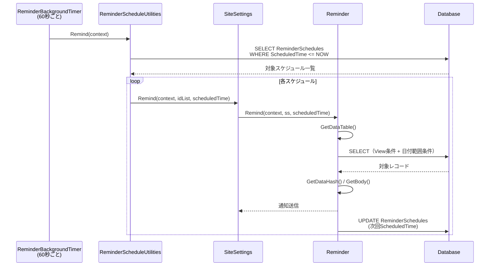
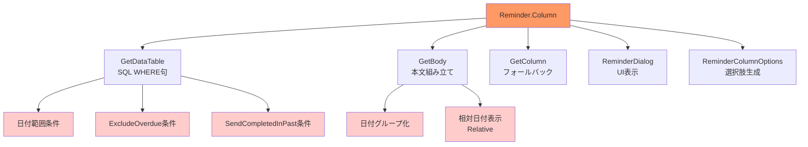

# リマインダー日付カラム不要化の調査

リマインダー機能において日付カラム指定を必須としない送出（View フィルタのみで対象レコードを絞り込む）を実現するための内部実装を調査する。

<!-- START doctoc generated TOC please keep comment here to allow auto update -->
<!-- DON'T EDIT THIS SECTION, INSTEAD RE-RUN doctoc TO UPDATE -->

- [調査情報](#調査情報)
- [調査目的](#調査目的)
- [現状の設計](#現状の設計)
    - [リマインダーの全体フロー](#リマインダーの全体フロー)
    - [Reminder クラスの主要プロパティ](#reminder-クラスの主要プロパティ)
- [日付カラムの使用箇所](#日付カラムの使用箇所)
    - [GetColumn メソッド](#getcolumn-メソッド)
    - [GetDataTable メソッド（日付フィルタの本体）](#getdatatable-メソッド日付フィルタの本体)
    - [GetBody メソッド（日付グループ化）](#getbody-メソッド日付グループ化)
- [View 条件フィルタの仕組み](#view-条件フィルタの仕組み)
- [UI の日付カラム選択](#ui-の日付カラム選択)
    - [ReminderColumnOptions メソッド](#remindercolumnoptions-メソッド)
    - [ReminderDialog のカラム選択部分](#reminderdialog-のカラム選択部分)
- [日付カラム不要化のために必要な変更](#日付カラム不要化のために必要な変更)
    - [変更箇所の一覧](#変更箇所の一覧)
    - [変更 1: ReminderColumnOptions に空選択肢を追加](#変更-1-remindercolumnoptions-に空選択肢を追加)
    - [変更 2: ReminderDialog に空選択を許可](#変更-2-reminderdialog-に空選択を許可)
    - [変更 3: GetDataTable の日付条件スキップ](#変更-3-getdatatable-の日付条件スキップ)
    - [変更 4: GetBody の日付グループ化スキップ](#変更-4-getbody-の日付グループ化スキップ)
    - [変更 5: 日付関連オプションの無効化（UI）](#変更-5-日付関連オプションの無効化ui)
- [変更の影響範囲](#変更の影響範囲)
    - [影響のある関連機能](#影響のある関連機能)
    - [後方互換性](#後方互換性)
- [結論](#結論)
- [関連ソースコード](#関連ソースコード)
- [関連ドキュメント](#関連ドキュメント)

<!-- END doctoc generated TOC please keep comment here to allow auto update -->

## 調査情報

| 調査日       | リポジトリ | ブランチ           | タグ/バージョン | コミット     | 備考     |
| ------------ | ---------- | ------------------ | --------------- | ------------ | -------- |
| 2026年3月9日 | Pleasanter | Pleasanter_1.5.1.0 |                 | `34f162a439` | 初回調査 |

## 調査目的

プリザンターのリマインダーは現状、日付カラム（`Column` プロパティ）を起点として「対象期間内のレコード」を抽出・通知する設計になっている。しかし、「View でフィルタされたレコードを日付制約なく一律送信したい」というユースケースがある。本調査では、日付カラムなしでリマインダーを送出できるようにするために必要な変更箇所を特定する。

---

## 現状の設計

### リマインダーの全体フロー

リマインダーは以下の流れで実行される。



### Reminder クラスの主要プロパティ

**ファイル**: `Implem.Pleasanter/Libraries/Settings/Reminder.cs`（行番号: 23-43）

```csharp
public class Reminder : ISettingListItem
{
    public int Id { get; set; }
    public ReminderTypes ReminderType;
    public string Subject;
    public string Body;
    public string Line;
    public string From;
    public string To;
    public string Token;
    public string Column;              // 日付カラム名（本調査の焦点）
    public DateTime StartDateTime;     // スケジュール開始日時
    public Times.RepeatTypes Type;     // 繰り返し種別
    public int Range;                  // 対象日数（デフォルト30）
    public bool? SendCompletedInPast;
    public bool? NotSendIfNotApplicable;
    public bool? NotSendHyperLink;
    public bool? ExcludeOverdue;
    public int Condition;              // View ID（フィルタ条件）
    public bool? Disabled;
}
```

`Column` プロパティは日付カラム名を保持し、`GetColumn()` メソッドで未指定時のフォールバックを提供する。

---

## 日付カラムの使用箇所

`Column` プロパティは以下の 3 つのメソッドで参照されている。

| メソッド       | 行番号  | 用途                                                  |
| -------------- | ------- | ----------------------------------------------------- |
| `GetColumn`    | 157-163 | `Column` 未指定時に `CompletionTime` へフォールバック |
| `GetDataTable` | 520-623 | SQL WHERE 句に日付範囲条件を追加                      |
| `GetBody`      | 455-518 | レコードを日付でグループ化し、本文を組み立てる        |

### GetColumn メソッド

**ファイル**: `Implem.Pleasanter/Libraries/Settings/Reminder.cs`（行番号: 157-163）

```csharp
public string GetColumn(SiteSettings ss)
{
    return Column
        ?? (ss.ColumnHash.ContainsKey("CompletionTime")
            ? "CompletionTime"
            : null);
}
```

`Column` が未設定の場合、`CompletionTime` が存在すればそれを返し、なければ `null` を返す。
`null` が返された場合、後続の `GetDataTable` で `NullReferenceException` が発生する。

### GetDataTable メソッド（日付フィルタの本体）

**ファイル**: `Implem.Pleasanter/Libraries/Settings/Reminder.cs`（行番号: 520-623）

```csharp
private DataTable GetDataTable(
    Context context,
    SiteSettings ss,
    List<Column> toColumns,
    List<Column> subjectColumns,
    List<Column> bodyColumns,
    DateTime scheduledTime)
{
    var orderByColumn = ss.GetColumn(
        context: context,
        columnName: Column);                    // ← Column が null/空の場合 null
    // ...
    .Add(column: orderByColumn)                 // ← null で例外
    // ...
    .Add(
        tableName: ss.ReferenceType,
        columnBrackets: new string[]
        {
            "\"" + orderByColumn.ColumnName + "\""  // ← null で NullReferenceException
        },
        _operator: "<'{0:yyyy/M/d H:m:s.fff}'".Params(
            DateTime.Now.ToLocal(context: context).Date.AddDays(Range)))
    // ...
}
```

`orderByColumn` が `null` の場合、以下の箇所で `NullReferenceException` が発生する。

| 行番号 | コード                             | 問題                                 |
| ------ | ---------------------------------- | ------------------------------------ |
| 536    | `.Add(column: orderByColumn)`      | SqlColumnCollection に null を追加   |
| 562    | `orderByColumn.ColumnName`         | null 参照                            |
| 570    | `orderByColumn.ColumnName`         | ExcludeOverdue 条件で null 参照      |
| 597    | `orderByColumn.ColumnName`         | SendCompletedInPast 条件で null 参照 |
| 604    | `.Add(column: orderByColumn, ...)` | OrderBy に null を追加               |

### GetBody メソッド（日付グループ化）

**ファイル**: `Implem.Pleasanter/Libraries/Settings/Reminder.cs`（行番号: 455-518）

```csharp
private string GetBody(
    Context context,
    SiteSettings ss,
    List<DataRow> dataRows)
{
    // ...
    var timeGroups = dataRows
        .GroupBy(dataRow => dataRow.DateTime(Column).Date)  // ← Column で日付グループ化
        .ToList();
    // ...
    timeGroups.ForEach(timeGroup =>
    {
        var date = timeGroup.First().DateTime(Column)       // ← Column 参照
            .ToLocal(context: context).Date;
        switch (Column)
        {
            case "CompletionTime":                          // ← Column による分岐
                date = date.AddDifferenceOfDates(...);
                break;
        }
        sb.Append("{0} ({1})\n".Params(
            date.ToString(...),
            Relative(context: context, time: date)));       // ← 日付ベースの相対表示
        // ...
    });
    // ...
}
```

`GetBody` は日付カラムの値でレコードをグループ化し、各グループに「2026/3/9（日） (3日後)」のようなヘッダを付与する。日付カラムがない場合、この処理全体が意味をなさない。

---

## View 条件フィルタの仕組み

`GetDataTable` では View 条件（`Condition` プロパティ）による WHERE 句を生成している。

**ファイル**: `Implem.Pleasanter/Libraries/Settings/Reminder.cs`（行番号: 552-557）

```csharp
var view = ss.Views?.Get(Condition) ?? new View();
var where = view.Where(
    context: context,
    ss: ss,
    checkPermission: false,
    requestSearchCondition: false)
```

`Condition` は View の ID を保持し、`ss.Views?.Get(Condition)` で対応する View を取得する。View が設定されている場合、その View のフィルタ条件が SQL の WHERE 句に変換される。この部分は日付カラムとは独立して機能している。

---

## UI の日付カラム選択

### ReminderColumnOptions メソッド

**ファイル**: `Implem.Pleasanter/Libraries/Settings/SiteSettings.cs`（行番号: 3468-3475）

```csharp
public Dictionary<string, ControlData> ReminderColumnOptions()
{
    return Columns
        .Where(o => o.TypeName == "datetime")
        .Where(o => !o.RecordedTime)
        .ToDictionary(o => o.ColumnName, o => new ControlData(o.LabelText));
}
```

ドロップダウンには `datetime` 型かつ `RecordedTime` でないカラムのみが表示される。現状では空選択肢（未指定）は存在しない。

### ReminderDialog のカラム選択部分

**ファイル**: `Implem.Pleasanter/Models/Sites/SiteUtilities.cs`（行番号: 14066-14072）

```csharp
.FieldDropDown(
    context: context,
    controlId: "ReminderColumn",
    controlCss: " always-send",
    labelText: Displays.Column(context: context),
    optionCollection: ss.ReminderColumnOptions(),
    selectedValue: reminder.GetColumn(ss))
```

`insertBlank: true` が指定されておらず、空（未選択）オプションが存在しない。このため、UI 上で「日付カラムなし」を選択する手段がない。

---

## 日付カラム不要化のために必要な変更

日付カラムなしでリマインダーを送出するには、以下の変更が必要となる。

### 変更箇所の一覧

| #   | ファイル           | メソッド/箇所             | 変更内容                                                |
| --- | ------------------ | ------------------------- | ------------------------------------------------------- |
| 1   | `SiteSettings.cs`  | `ReminderColumnOptions()` | 空選択肢（「指定なし」等）の追加                        |
| 2   | `SiteUtilities.cs` | `ReminderDialog()`        | `insertBlank: true` を追加して空選択を可能にする        |
| 3   | `Reminder.cs`      | `GetDataTable()`          | `Column` が空/null の場合に日付範囲条件をスキップする   |
| 4   | `Reminder.cs`      | `GetBody()`               | `Column` が空/null の場合に日付グループ化をスキップする |
| 5   | `Reminder.cs`      | `GetDataTable()`          | `orderByColumn` が null の場合の OrderBy 代替を設定する |

### 変更 1: ReminderColumnOptions に空選択肢を追加

`SiteSettings.cs` の `ReminderColumnOptions()` を変更し、空の選択肢を先頭に追加する。

```csharp
public Dictionary<string, ControlData> ReminderColumnOptions()
{
    var options = new Dictionary<string, ControlData>
    {
        { string.Empty, new ControlData(Displays.NotSet(context)) }
    };
    Columns
        .Where(o => o.TypeName == "datetime")
        .Where(o => !o.RecordedTime)
        .ForEach(o => options.Add(o.ColumnName, new ControlData(o.LabelText)));
    return options;
}
```

または、`ReminderDialog` 側で `insertBlank: true` を追加する方法もある。

### 変更 2: ReminderDialog に空選択を許可

`SiteUtilities.cs` の `ReminderDialog()` の `ReminderColumn` フィールドに `insertBlank: true` を追加する。

```csharp
.FieldDropDown(
    context: context,
    controlId: "ReminderColumn",
    controlCss: " always-send",
    labelText: Displays.Column(context: context),
    optionCollection: ss.ReminderColumnOptions(),
    selectedValue: reminder.GetColumn(ss),
    insertBlank: true)                          // ← 追加
```

### 変更 3: GetDataTable の日付条件スキップ

`Column` が空/null の場合に日付範囲条件の追加をスキップし、View 条件のみで対象レコードを取得する。

```csharp
private DataTable GetDataTable(...)
{
    var orderByColumn = !Column.IsNullOrEmpty()
        ? ss.GetColumn(context: context, columnName: Column)
        : null;
    // ...
    var column = new SqlColumnCollection()
        .Add(column: ss.GetColumn(
            context: context,
            columnName: Rds.IdColumn(ss.ReferenceType)));
    if (orderByColumn != null)
    {
        column.Add(column: orderByColumn);
    }
    column.ItemTitle(ss.ReferenceType);
    // ... (toColumns, subjectColumns, bodyColumns の追加)

    var view = ss.Views?.Get(Condition) ?? new View();
    var where = view.Where(
        context: context,
        ss: ss,
        checkPermission: false,
        requestSearchCondition: false);

    // orderByColumn が null でない場合のみ日付範囲条件を追加
    if (orderByColumn != null)
    {
        where
            .Add(/* 既存の日付範囲条件 */)
            .Add(/* ExcludeOverdue 条件 */)
            .Add(/* Status/SendCompletedInPast 条件 */);
    }

    var orderBy = new SqlOrderByCollection();
    if (orderByColumn != null)
    {
        orderBy.Add(column: orderByColumn, orderType: SqlOrderBy.Types.desc);
    }
    else
    {
        // 日付カラムなしの場合は ID 降順等のデフォルトソート
        orderBy.Add(
            column: ss.GetColumn(
                context: context,
                columnName: Rds.IdColumn(ss.ReferenceType)),
            orderType: SqlOrderBy.Types.desc);
    }
    // ...
}
```

### 変更 4: GetBody の日付グループ化スキップ

`Column` が空/null の場合は日付ごとのグループ化を行わず、レコードをフラットに列挙する。

```csharp
private string GetBody(
    Context context,
    SiteSettings ss,
    List<DataRow> dataRows)
{
    var sb = new StringBuilder();
    var body = ReplacedLine(
        context: context,
        ss: ss,
        dataRow: dataRows.FirstOrDefault(),
        line: Body);

    if (!Column.IsNullOrEmpty())
    {
        // 既存の日付グループ化ロジック
        var timeGroups = dataRows
            .GroupBy(dataRow => dataRow.DateTime(Column).Date)
            .ToList();
        timeGroups.ForEach(timeGroup =>
        {
            // ... 既存処理 ...
        });
    }
    else
    {
        // 日付カラムなし: フラットにレコードを列挙
        dataRows.ForEach(dataRow =>
        {
            sb.Append(
                ReplacedLine(
                    context: context,
                    ss: ss,
                    dataRow: dataRow,
                    line: Line));
            if (NotSendHyperLink != true)
            {
                sb.Append(
                    "\n\t",
                    Locations.ItemEditAbsoluteUri(
                        context: context,
                        id: dataRow.Long(Rds.IdColumn(ss.ReferenceType))));
            }
            sb.Append("\n");
        });
    }

    if (!dataRows.Any())
    {
        sb.Append(Displays.NoTargetRecord(context: context), "\r\n");
    }
    return body.Contains(BodyPlaceholder)
        ? body.Replace(BodyPlaceholder, sb.ToString())
        : body + "\n" + sb.ToString();
}
```

### 変更 5: 日付関連オプションの無効化（UI）

`Column` が未指定の場合、以下の設定項目は日付カラムに依存するため、意味をなさなくなる。

| 設定項目            | 日付カラムとの依存関係           |
| ------------------- | -------------------------------- |
| Range（対象日数）   | 日付範囲フィルタに使用           |
| SendCompletedInPast | 過去完了レコードの日付比較に使用 |
| ExcludeOverdue      | 期限超過の日付比較に使用         |

これらのフィールドは `Column` が未指定の場合に非表示またはグレーアウトすることが望ましい。JavaScript 側で `ReminderColumn` の変更イベントを監視し、UI を動的に制御する方法が考えられる。

---

## 変更の影響範囲

### 影響のある関連機能



色付きのノードが日付カラム不要化で変更が必要な箇所を示す。

### 後方互換性

- `Column` が設定されている既存のリマインダーは従来どおり動作する
- `Column` が未設定の場合のみ新しい動作（View フィルタのみで対象レコードを取得）が適用される
- `GetColumn()` のフォールバック（`CompletionTime` への自動設定）は既存動作を維持するため、そのまま残す

---

## 結論

| 項目               | 内容                                                                                       |
| ------------------ | ------------------------------------------------------------------------------------------ |
| 現状の制約         | `Column`（日付カラム）は事実上必須。未指定時は `CompletionTime` にフォールバックする       |
| 制約の原因         | `GetDataTable` が日付範囲条件を無条件に SQL に追加し、`GetBody` が日付でグループ化するため |
| 必要な変更ファイル | `Reminder.cs`, `SiteSettings.cs`, `SiteUtilities.cs`（計 3 ファイル）                      |
| 主な変更内容       | `GetDataTable` の日付条件分岐、`GetBody` の日付グループ化分岐、UI の空選択肢追加           |
| 後方互換性         | `Column` が設定済みの既存リマインダーには影響なし                                          |
| 実装難易度         | `Reminder.cs` 内のメソッド変更のみで完結し、モデル構造やスキーマの変更は不要               |

---

## 関連ソースコード

- `Implem.Pleasanter/Libraries/Settings/Reminder.cs` - リマインダーモデル・送信ロジック
- `Implem.Pleasanter/Libraries/Settings/SiteSettings.cs` - `ReminderColumnOptions()`, `Remind()`
- `Implem.Pleasanter/Models/Sites/SiteUtilities.cs` - `ReminderDialog()` UI 生成
- `Implem.Pleasanter/Models/Sites/SiteModel.cs` - `UpdateReminder()` 更新処理
- `Implem.Pleasanter/Models/Sites/SiteValidators.cs` - `SetReminder()` バリデーション
- `Implem.Pleasanter/Models/ReminderSchedules/ReminderScheduleUtilities.cs` - スケジュール実行
- `Implem.Pleasanter/Libraries/BackgroundServices/ReminderBackgroundTimer.cs` - バックグラウンドタイマー
- `Implem.Pleasanter/App_Data/Parameters/Reminder.json` - リマインダーパラメータ

## 関連ドキュメント

- [通知カスタムフォーマット・プレースホルダの仕組み](001-通知カスタムフォーマット・プレースホルダ.md)
