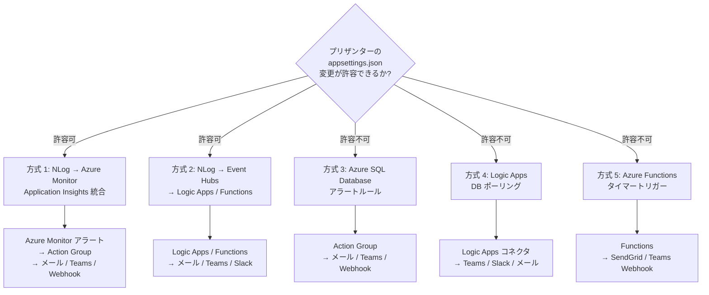
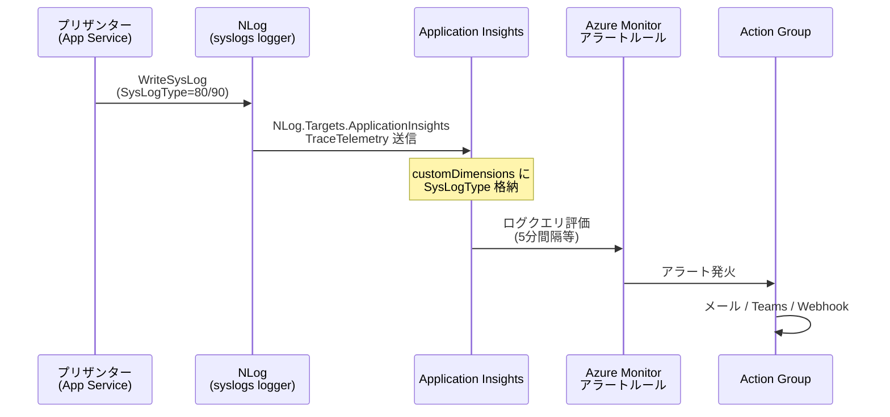
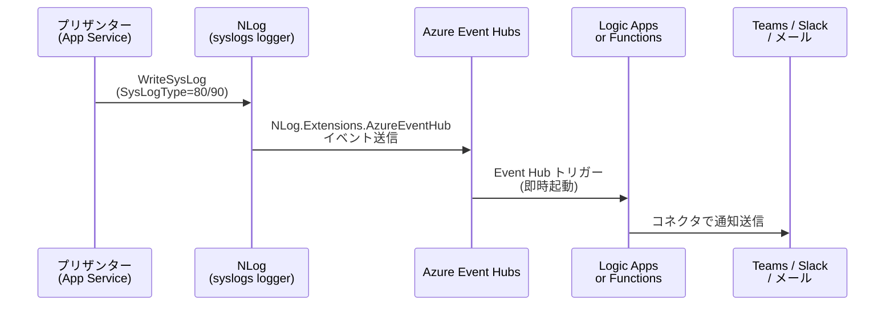
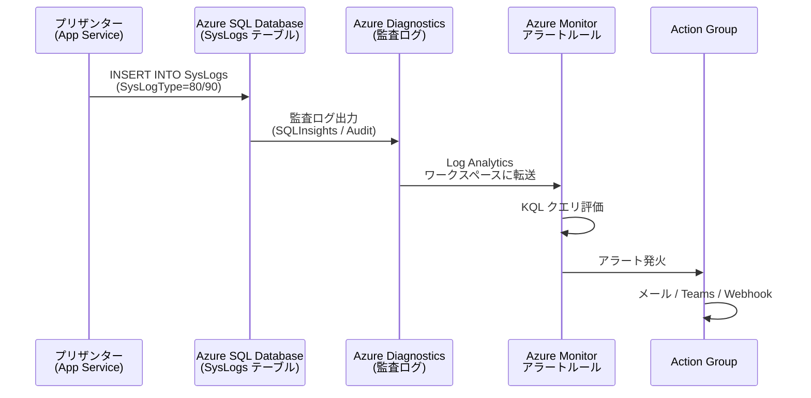
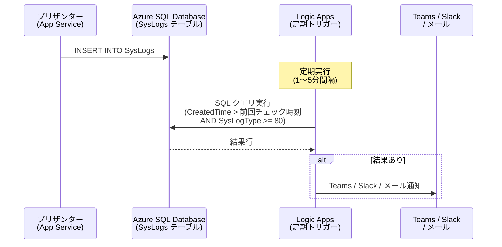
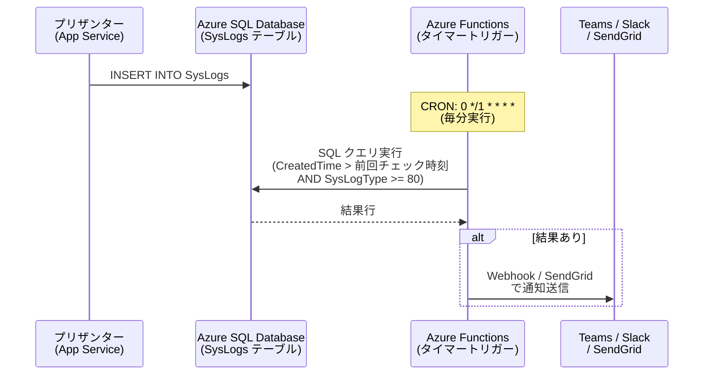
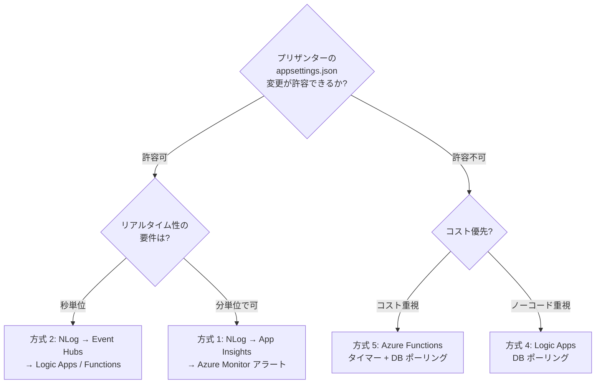

# Azure SaaS/PaaS による SysLog 外部通知

Azure 環境にプリザンターを構築している前提で、Azure のマネージドサービスのみを使用して SysLog の高緊急度ログ（SystemError=80, Exception=90）を外部通知する方式を調査する。

<!-- START doctoc generated TOC please keep comment here to allow auto update -->
<!-- DON'T EDIT THIS SECTION, INSTEAD RE-RUN doctoc TO UPDATE -->

- [調査情報](#調査情報)
- [調査目的](#調査目的)
- [前提: プリザンターの Azure 関連実装](#前提-プリザンターの-azure-関連実装)
    - [NLog.Extensions.AzureDataTables パッケージ](#nlogextensionsazuredatatables-パッケージ)
    - [SysLogs テーブルの OnAzure カラム](#syslogs-テーブルの-onazure-カラム)
    - [SysLogType と NLog LogLevel のマッピング](#syslogtype-と-nlog-loglevel-のマッピング)
- [方式一覧](#方式一覧)
- [方式 1: NLog + Application Insights + Azure Monitor アラート](#方式-1-nlog--application-insights--azure-monitor-アラート)
    - [アーキテクチャ](#アーキテクチャ)
    - [必要パッケージ](#必要パッケージ)
    - [設定例: appsettings.json](#設定例-appsettingsjson)
    - [設定例: Azure Monitor アラートルール（KQL）](#設定例-azure-monitor-アラートルールkql)
    - [方式 1 のまとめ](#方式-1-のまとめ)
- [方式 2: NLog + Event Hubs + Logic Apps / Functions](#方式-2-nlog--event-hubs--logic-apps--functions)
    - [アーキテクチャ](#アーキテクチャ-1)
    - [必要パッケージ](#必要パッケージ-1)
    - [設定例: appsettings.json](#設定例-appsettingsjson-1)
    - [設定例: Logic Apps ワークフロー](#設定例-logic-apps-ワークフロー)
    - [設定例: Azure Functions（Event Hub トリガー + Teams Webhook）](#設定例-azure-functionsevent-hub-トリガー--teams-webhook)
    - [方式 2 のまとめ](#方式-2-のまとめ)
- [方式 3: Azure SQL Database アラートルール](#方式-3-azure-sql-database-アラートルール)
    - [アーキテクチャ](#アーキテクチャ-2)
    - [前提条件](#前提条件)
    - [設定手順](#設定手順)
    - [制限事項](#制限事項)
    - [方式 3 のまとめ](#方式-3-のまとめ)
- [方式 4: Logic Apps による DB ポーリング](#方式-4-logic-apps-による-db-ポーリング)
    - [アーキテクチャ](#アーキテクチャ-3)
    - [設定例: Logic Apps ワークフロー](#設定例-logic-apps-ワークフロー-1)
    - [ポーリングクエリの最適化](#ポーリングクエリの最適化)
    - [方式 4 のまとめ](#方式-4-のまとめ)
- [方式 5: Azure Functions タイマートリガー + DB ポーリング](#方式-5-azure-functions-タイマートリガー--db-ポーリング)
    - [アーキテクチャ](#アーキテクチャ-4)
    - [設定例: Azure Functions（C#, Isolated Worker）](#設定例-azure-functionsc-isolated-worker)
    - [設定例: host.json（レート制限）](#設定例-hostjsonレート制限)
    - [設定例: local.settings.json（環境変数）](#設定例-localsettingsjson環境変数)
    - [方式 5 のまとめ](#方式-5-のまとめ)
- [方式比較](#方式比較)
- [推奨構成: 用途別の選択指針](#推奨構成-用途別の選択指針)
    - [推奨 A: Application Insights 統合（方式 1）](#推奨-a-application-insights-統合方式-1)
    - [推奨 B: Azure Functions タイマー（方式 5）](#推奨-b-azure-functions-タイマー方式-5)
    - [推奨 B の構築手順](#推奨-b-の構築手順)
- [コスト試算](#コスト試算)
    - [方式 1: Application Insights](#方式-1-application-insights)
    - [方式 5: Azure Functions + DB ポーリング](#方式-5-azure-functions--db-ポーリング)
- [結論](#結論)
- [関連ソースコード](#関連ソースコード)
- [関連ドキュメント](#関連ドキュメント)

<!-- END doctoc generated TOC please keep comment here to allow auto update -->

## 調査情報

| 調査日       | リポジトリ | ブランチ | タグ/バージョン | コミット     | 備考     |
| ------------ | ---------- | -------- | --------------- | ------------ | -------- |
| 2026年3月6日 | Pleasanter | main     |                 | `34f162a439` | 初回調査 |

## 調査目的

Azure App Service + Azure SQL Database（または Azure Database for PostgreSQL）上にプリザンターを構築している環境を前提として、
Azure の SaaS/PaaS サービスのみで SysLog の外部通知を実現する方法を調査する。

具体的には以下を明らかにする。

1. Azure マネージドサービスの組み合わせで SysLog の高緊急度ログを検知・通知できるか
2. プリザンター側の設定変更が必要な方式と不要な方式の両方を整理する
3. 各方式の具体的な設定例を提示する

## 前提: プリザンターの Azure 関連実装

### NLog.Extensions.AzureDataTables パッケージ

プリザンターは `NLog.Extensions.AzureDataTables` v4.7.1 を標準パッケージとして参照済み。
CSP レポートの出力先として Azure Table Storage への書き込みが実装されている。

**ファイル**: `Implem.Pleasanter/Implem.Pleasanter.csproj`

```xml
<PackageReference Include="NLog.Extensions.AzureDataTables" Version="4.7.1" />
```

**ファイル**: `Implem.Pleasanter/NLog.CspReport.config`

```xml
<target name="azureDataTable"
        xsi:type="AzureDataTables"
        tableName="${var:azureTableName}"
        connectionString="${var:azureConnectionString}"
        layout="${longdate} | ${message}" />
```

### SysLogs テーブルの OnAzure カラム

SysLogs テーブルには `OnAzure`（bit 型）カラムが存在し、Azure 環境フラグとして使用されている。

**ファイル**: `App_Data/Definitions/Definition_Column/SysLogs_OnAzure.json`

```json
{
    "ColumnName": "OnAzure",
    "LabelText": "Azureフラグ",
    "TypeName": "bit"
}
```

### SysLogType と NLog LogLevel のマッピング

**ファイル**: `Implem.Pleasanter/Models/SysLogs/SysLogModel.cs`（行番号: 3380-3384）

```csharp
SysLogTypes.Info => LogLevel.Info,
SysLogTypes.Warning => LogLevel.Warn,
SysLogTypes.UserError => LogLevel.Error,
SysLogTypes.SystemError => LogLevel.Error,
SysLogTypes.Exception => LogLevel.Fatal,
```

| SysLogType  | 値  | NLog LogLevel | 通知対象 |
| ----------- | --- | ------------- | -------- |
| Info        | 10  | Info          | -        |
| Warning     | 50  | Warn          | -        |
| UserError   | 60  | Error         | -        |
| SystemError | 80  | Error         | 対象     |
| Exception   | 90  | Fatal         | 対象     |

---

## 方式一覧

Azure 環境で利用可能な方式を以下にまとめる。



---

## 方式 1: NLog + Application Insights + Azure Monitor アラート

NLog の出力を Application Insights に送信し、Azure Monitor のアラートルールで通知する方式。
プリザンター側は `appsettings.json` の NLog 設定変更と NuGet パッケージ追加が必要。

### アーキテクチャ



### 必要パッケージ

```xml
<!-- プリザンターの .csproj に追加 -->
<PackageReference Include="NLog.Targets.ApplicationInsights" Version="3.1.0" />
```

### 設定例: appsettings.json

```json
{
    "NLog": {
        "extensions": [{ "assembly": "NLog.Targets.ApplicationInsights" }],
        "targets": {
            "appInsights": {
                "type": "ApplicationInsightsTarget",
                "instrumentationKey": "${environment:APPINSIGHTS_INSTRUMENTATIONKEY}",
                "contextProperties": [
                    {
                        "name": "SysLogType",
                        "layout": "${event-properties:syslog:objectpath=SysLogType}"
                    },
                    {
                        "name": "Class",
                        "layout": "${event-properties:syslog:objectpath=Class}"
                    },
                    {
                        "name": "Method",
                        "layout": "${event-properties:syslog:objectpath=Method}"
                    },
                    {
                        "name": "ErrMessage",
                        "layout": "${event-properties:syslog:objectpath=ErrMessage}"
                    },
                    {
                        "name": "Url",
                        "layout": "${event-properties:syslog:objectpath=Url}"
                    },
                    {
                        "name": "MachineName",
                        "layout": "${event-properties:syslog:objectpath=MachineName}"
                    }
                ]
            }
        },
        "rules": [
            {
                "logger": "syslogs",
                "minLevel": "Error",
                "writeTo": "appInsights",
                "filters": [
                    {
                        "type": "when",
                        "condition": "'${event-properties:syslog:objectpath=SysLogType}' < '80'",
                        "action": "Ignore"
                    }
                ]
            }
        ]
    }
}
```

### 設定例: Azure Monitor アラートルール（KQL）

Application Insights の `traces` テーブルに対するログクエリアラートを作成する。

```kusto
traces
| where severityLevel >= 3
| where customDimensions.SysLogType in ("80", "90")
| project
    timestamp,
    message,
    SysLogType = tostring(customDimensions.SysLogType),
    Class = tostring(customDimensions.Class),
    Method = tostring(customDimensions.Method),
    ErrMessage = tostring(customDimensions.ErrMessage),
    Url = tostring(customDimensions.Url)
| order by timestamp desc
```

#### Azure CLI でのアラートルール作成

```bash
# リソースグループとApplication Insightsリソース名を設定
RG="pleasanter-rg"
AI_NAME="pleasanter-appinsights"
ACTION_GROUP_ID="/subscriptions/{sub-id}/resourceGroups/${RG}/providers/Microsoft.Insights/actionGroups/pleasanter-alert-ag"

# ログクエリアラートルールの作成
az monitor scheduled-query create \
  --name "SysLog-HighSeverity-Alert" \
  --resource-group "$RG" \
  --scopes "/subscriptions/{sub-id}/resourceGroups/${RG}/providers/Microsoft.Insights/components/${AI_NAME}" \
  --condition "count 'traces | where severityLevel >= 3 | where customDimensions.SysLogType in (\"80\", \"90\")' > 0" \
  --evaluation-frequency "5m" \
  --window-size "5m" \
  --severity 1 \
  --action-groups "$ACTION_GROUP_ID" \
  --description "SysLogType 80(SystemError) or 90(Exception) detected"
```

#### Action Group の設定例

```bash
# Action Group の作成（メール + Teams Webhook）
az monitor action-group create \
  --name "pleasanter-alert-ag" \
  --resource-group "$RG" \
  --short-name "PlsntAlert" \
  --action email admin admin@example.com \
  --action webhook teams-webhook "https://outlook.office.com/webhook/xxx"
```

### 方式 1 のまとめ

| 項目               | 内容                                                    |
| ------------------ | ------------------------------------------------------- |
| プリザンター変更   | appsettings.json 変更 + NuGet パッケージ追加            |
| Azure サービス     | Application Insights + Azure Monitor + Action Group     |
| 検知遅延           | 5〜15 分（アラート評価間隔に依存）                      |
| コスト             | Application Insights のデータ取り込み量に応じた従量課金 |
| フィルタ柔軟性     | KQL で自由にフィルタ可能                                |
| プリザンター非汚染 | -（appsettings.json とパッケージ変更が必要）            |

---

## 方式 2: NLog + Event Hubs + Logic Apps / Functions

NLog の出力を Azure Event Hubs に送信し、Logic Apps または Azure Functions で通知する方式。
リアルタイム性が方式 1 より高い。

### アーキテクチャ



### 必要パッケージ

```xml
<!-- プリザンターの .csproj に追加 -->
<PackageReference Include="NLog.Extensions.AzureEventHub" Version="4.4.0" />
```

### 設定例: appsettings.json

```json
{
    "NLog": {
        "extensions": [{ "assembly": "NLog.Extensions.AzureEventHub" }],
        "targets": {
            "eventHub": {
                "type": "AzureEventHub",
                "connectionString": "${environment:EVENTHUB_CONNECTION_STRING}",
                "eventHubName": "pleasanter-syslogs",
                "partitionKey": "${event-properties:syslog:objectpath=MachineName}",
                "layout": {
                    "type": "JsonLayout",
                    "Attributes": [
                        {
                            "name": "timestamp",
                            "layout": "${date:format=O}"
                        },
                        {
                            "name": "SysLogType",
                            "layout": "${event-properties:syslog:objectpath=SysLogType}"
                        },
                        {
                            "name": "Class",
                            "layout": "${event-properties:syslog:objectpath=Class}"
                        },
                        {
                            "name": "Method",
                            "layout": "${event-properties:syslog:objectpath=Method}"
                        },
                        {
                            "name": "ErrMessage",
                            "layout": "${event-properties:syslog:objectpath=ErrMessage}"
                        },
                        {
                            "name": "Url",
                            "layout": "${event-properties:syslog:objectpath=Url}"
                        },
                        {
                            "name": "MachineName",
                            "layout": "${event-properties:syslog:objectpath=MachineName}"
                        }
                    ]
                }
            }
        },
        "rules": [
            {
                "logger": "syslogs",
                "minLevel": "Error",
                "writeTo": "eventHub",
                "filters": [
                    {
                        "type": "when",
                        "condition": "'${event-properties:syslog:objectpath=SysLogType}' < '80'",
                        "action": "Ignore"
                    }
                ]
            }
        ]
    }
}
```

### 設定例: Logic Apps ワークフロー

Event Hubs トリガーで受信し、Teams に通知する Logic Apps ワークフロー定義。

```json
{
    "definition": {
        "$schema": "https://schema.management.azure.com/providers/Microsoft.Logic/schemas/2016-06-01/workflowdefinition.json#",
        "triggers": {
            "When_events_are_available_in_Event_Hub": {
                "type": "ApiConnection",
                "inputs": {
                    "host": {
                        "connection": {
                            "name": "@parameters('$connections')['eventhubs']['connectionId']"
                        }
                    },
                    "method": "get",
                    "path": "/@{encodeURIComponent('pleasanter-syslogs')}/events/batch/head",
                    "queries": {
                        "consumerGroupName": "$Default",
                        "contentType": "application/json",
                        "maximumEventsCount": 50
                    }
                },
                "recurrence": {
                    "frequency": "Second",
                    "interval": 30
                }
            }
        },
        "actions": {
            "For_each_event": {
                "type": "Foreach",
                "foreach": "@triggerBody()",
                "actions": {
                    "Parse_JSON": {
                        "type": "ParseJson",
                        "inputs": {
                            "content": "@base64ToString(items('For_each_event')?['ContentData'])",
                            "schema": {
                                "type": "object",
                                "properties": {
                                    "timestamp": { "type": "string" },
                                    "SysLogType": { "type": "string" },
                                    "Class": { "type": "string" },
                                    "Method": { "type": "string" },
                                    "ErrMessage": { "type": "string" },
                                    "Url": { "type": "string" },
                                    "MachineName": { "type": "string" }
                                }
                            }
                        }
                    },
                    "Post_message_to_Teams": {
                        "type": "ApiConnection",
                        "inputs": {
                            "host": {
                                "connection": {
                                    "name": "@parameters('$connections')['teams']['connectionId']"
                                }
                            },
                            "method": "post",
                            "path": "/v3/beta/teams/@{encodeURIComponent('team-id')}/channels/@{encodeURIComponent('channel-id')}/messages",
                            "body": {
                                "body": {
                                    "content": "<h3>[Pleasanter] SysLog Alert</h3><ul><li><b>SysLogType:</b> @{body('Parse_JSON')?['SysLogType']}</li><li><b>Class:</b> @{body('Parse_JSON')?['Class']}</li><li><b>Method:</b> @{body('Parse_JSON')?['Method']}</li><li><b>Error:</b> @{body('Parse_JSON')?['ErrMessage']}</li><li><b>URL:</b> @{body('Parse_JSON')?['Url']}</li><li><b>Time:</b> @{body('Parse_JSON')?['timestamp']}</li></ul>",
                                    "contentType": "html"
                                }
                            }
                        },
                        "runAfter": {
                            "Parse_JSON": ["Succeeded"]
                        }
                    }
                }
            }
        }
    }
}
```

### 設定例: Azure Functions（Event Hub トリガー + Teams Webhook）

```csharp
using System.Net.Http;
using System.Text;
using System.Text.Json;
using Azure.Messaging.EventHubs;
using Microsoft.Azure.Functions.Worker;
using Microsoft.Extensions.Logging;

public class SysLogAlertFunction
{
    private static readonly HttpClient _httpClient = new();

    [Function("SysLogAlert")]
    public async Task Run(
        [EventHubTrigger(
            "pleasanter-syslogs",
            Connection = "EventHubConnection")] EventData[] events,
        FunctionContext context)
    {
        var logger = context.GetLogger("SysLogAlert");
        var teamsWebhookUrl = Environment.GetEnvironmentVariable(
            "TEAMS_WEBHOOK_URL");
        foreach (var eventData in events)
        {
            var payload = JsonSerializer.Deserialize<JsonElement>(
                eventData.Body.Span);
            var sysLogType = payload.GetProperty("SysLogType")
                .GetString();
            if (sysLogType != "80" && sysLogType != "90")
                continue;
            var card = new
            {
                type = "message",
                attachments = new[]
                {
                    new
                    {
                        contentType =
                            "application/vnd.microsoft.card.adaptive",
                        contentUrl = (string?)null,
                        content = new
                        {
                            type = "AdaptiveCard",
                            version = "1.4",
                            body = new object[]
                            {
                                new
                                {
                                    type = "TextBlock",
                                    text = "[Pleasanter] SysLog Alert",
                                    weight = "Bolder",
                                    size = "Medium"
                                },
                                new
                                {
                                    type = "FactSet",
                                    facts = new[]
                                    {
                                        new
                                        {
                                            title = "SysLogType",
                                            value = sysLogType
                                        },
                                        new
                                        {
                                            title = "Class",
                                            value = payload
                                                .GetProperty("Class")
                                                .GetString()
                                        },
                                        new
                                        {
                                            title = "Method",
                                            value = payload
                                                .GetProperty("Method")
                                                .GetString()
                                        },
                                        new
                                        {
                                            title = "Error",
                                            value = payload
                                                .GetProperty("ErrMessage")
                                                .GetString()
                                        },
                                        new
                                        {
                                            title = "URL",
                                            value = payload
                                                .GetProperty("Url")
                                                .GetString()
                                        }
                                    }
                                }
                            }
                        }
                    }
                }
            };
            var json = JsonSerializer.Serialize(card);
            await _httpClient.PostAsync(
                teamsWebhookUrl,
                new StringContent(json, Encoding.UTF8, "application/json"));
        }
    }
}
```

### 方式 2 のまとめ

| 項目               | 内容                                                 |
| ------------------ | ---------------------------------------------------- |
| プリザンター変更   | appsettings.json 変更 + NuGet パッケージ追加         |
| Azure サービス     | Event Hubs + Logic Apps または Functions             |
| 検知遅延           | 数秒〜30 秒（Event Hub トリガーの起動遅延）          |
| コスト             | Event Hubs（TU 単位）+ Logic Apps/Functions 実行回数 |
| フィルタ柔軟性     | NLog フィルタ + Logic Apps/Functions 内ロジック      |
| プリザンター非汚染 | -（appsettings.json とパッケージ変更が必要）         |

---

## 方式 3: Azure SQL Database アラートルール

Azure SQL Database のメトリクスおよびログを Azure Monitor で監視し、
SysLogs テーブルへの高緊急度 INSERT を検知する方式。
プリザンター側の変更は一切不要。

### アーキテクチャ



### 前提条件

Azure SQL Database の診断設定で以下を有効にする必要がある。

- **SQLInsights** または **QueryStoreRuntimeStatistics** を Log Analytics ワークスペースに送信
- SQL Auditing を有効化し、監査ログで INSERT 操作を記録

### 設定手順

#### 手順 1: 診断設定の有効化

```bash
# Azure SQL Database の診断設定を作成
az monitor diagnostic-settings create \
  --name "syslogs-diagnostics" \
  --resource "/subscriptions/{sub-id}/resourceGroups/${RG}/providers/Microsoft.Sql/servers/{server}/databases/{db}" \
  --workspace "/subscriptions/{sub-id}/resourceGroups/${RG}/providers/Microsoft.OperationalInsights/workspaces/{workspace}" \
  --logs '[{"category": "SQLInsights", "enabled": true, "retentionPolicy": {"enabled": false, "days": 0}}]'
```

#### 手順 2: SQL Auditing の有効化

```bash
# サーバーレベルの監査設定
az sql server audit-policy update \
  --resource-group "$RG" \
  --server "{server}" \
  --state Enabled \
  --log-analytics-target-state Enabled \
  --log-analytics-workspace-resource-id "/subscriptions/{sub-id}/resourceGroups/${RG}/providers/Microsoft.OperationalInsights/workspaces/{workspace}"
```

### 制限事項

この方式では SysLogs テーブルへの INSERT 自体は検知できるが、
INSERT されたレコードの `SysLogType` 値を監査ログから直接取得することは困難。

**代替**: 方式 4（Logic Apps DB ポーリング）または方式 5（Azure Functions タイマートリガー）を推奨。

### 方式 3 のまとめ

| 項目               | 内容                                                  |
| ------------------ | ----------------------------------------------------- |
| プリザンター変更   | 不要                                                  |
| Azure サービス     | Azure SQL Diagnostics + Log Analytics + Azure Monitor |
| 検知遅延           | 5〜15 分（診断ログ転送 + アラート評価間隔）           |
| コスト             | Log Analytics のデータ取り込み量に応じた従量課金      |
| フィルタ柔軟性     | 低（SysLogType 値による直接フィルタが困難）           |
| プリザンター非汚染 | 完全                                                  |

---

## 方式 4: Logic Apps による DB ポーリング

Logic Apps の SQL Server コネクタで SysLogs テーブルを定期的にクエリし、
高緊急度ログを検知して通知する方式。プリザンター側の変更は一切不要。

### アーキテクチャ



### 設定例: Logic Apps ワークフロー

#### トリガー: 定期実行（Recurrence）

```json
{
    "triggers": {
        "Recurrence": {
            "type": "Recurrence",
            "recurrence": {
                "frequency": "Minute",
                "interval": 1
            }
        }
    }
}
```

#### アクション: SQL クエリ実行

```json
{
    "Execute_query": {
        "type": "ApiConnection",
        "inputs": {
            "host": {
                "connection": {
                    "name": "@parameters('$connections')['sql']['connectionId']"
                }
            },
            "method": "post",
            "path": "/v2/datasets/@{encodeURIComponent(encodeURIComponent('pleasanter-db'))}/query",
            "body": {
                "query": "SELECT TOP 100 SysLogId, SysLogType, Class, Method, ErrMessage, Url, MachineName, CreatedTime FROM SysLogs WHERE SysLogType >= 80 AND CreatedTime > DATEADD(MINUTE, -2, GETUTCDATE()) ORDER BY CreatedTime DESC"
            }
        }
    }
}
```

#### アクション: 条件付き Teams 通知

```json
{
    "Condition_check_results": {
        "type": "If",
        "expression": {
            "and": [
                {
                    "greater": ["@length(body('Execute_query')?['ResultSets']?['Table1'])", 0]
                }
            ]
        },
        "actions": {
            "For_each_row": {
                "type": "Foreach",
                "foreach": "@body('Execute_query')?['ResultSets']?['Table1']",
                "actions": {
                    "Post_to_Teams": {
                        "type": "ApiConnection",
                        "inputs": {
                            "host": {
                                "connection": {
                                    "name": "@parameters('$connections')['teams']['connectionId']"
                                }
                            },
                            "method": "post",
                            "path": "/v3/beta/teams/@{encodeURIComponent('team-id')}/channels/@{encodeURIComponent('channel-id')}/messages",
                            "body": {
                                "body": {
                                    "content": "<h3>[Pleasanter] SysLog Alert</h3><ul><li><b>SysLogType:</b> @{items('For_each_row')?['SysLogType']}</li><li><b>Class:</b> @{items('For_each_row')?['Class']}</li><li><b>Method:</b> @{items('For_each_row')?['Method']}</li><li><b>Error:</b> @{items('For_each_row')?['ErrMessage']}</li><li><b>URL:</b> @{items('For_each_row')?['Url']}</li><li><b>Time:</b> @{items('For_each_row')?['CreatedTime']}</li></ul>",
                                    "contentType": "html"
                                }
                            }
                        }
                    }
                }
            }
        }
    }
}
```

### ポーリングクエリの最適化

SysLogs テーブルのプライマリキーは `(CreatedTime, SysLogId)` の複合キー。
`CreatedTime` 条件でインデックスシークに限定するため、テーブル全体の行数に影響を受けない。

```sql
-- 推奨クエリ: CreatedTime でインデックスシークに限定
SELECT TOP 100
    SysLogId, SysLogType, Class, Method,
    ErrMessage, Url, MachineName, CreatedTime
FROM SysLogs
WHERE CreatedTime > DATEADD(MINUTE, -2, GETUTCDATE())
  AND SysLogType >= 80
ORDER BY CreatedTime DESC;
```

90 日保持で数百万行のテーブルでも、直近 2 分間のスキャン範囲は数十行程度に限定される。

### 方式 4 のまとめ

| 項目               | 内容                                         |
| ------------------ | -------------------------------------------- |
| プリザンター変更   | 不要                                         |
| Azure サービス     | Logic Apps + SQL Server コネクタ             |
| 検知遅延           | 1〜5 分（ポーリング間隔に依存）              |
| コスト             | Logic Apps の実行回数 + コネクタ呼び出し回数 |
| フィルタ柔軟性     | SQL クエリで自由にフィルタ可能               |
| プリザンター非汚染 | 完全                                         |

---

## 方式 5: Azure Functions タイマートリガー + DB ポーリング

Azure Functions のタイマートリガーで SysLogs テーブルを定期的にクエリし、
高緊急度ログを検知して通知する方式。プリザンター側の変更は一切不要。
Logic Apps よりもコード制御が柔軟で、コストも低い。

### アーキテクチャ



### 設定例: Azure Functions（C#, Isolated Worker）

```csharp
using System.Net.Http;
using System.Text;
using System.Text.Json;
using Microsoft.Azure.Functions.Worker;
using Microsoft.Data.SqlClient;
using Microsoft.Extensions.Logging;

public class SysLogPollingFunction
{
    private static readonly HttpClient _httpClient = new();
    private static DateTime _lastChecked = DateTime.UtcNow;

    [Function("SysLogPolling")]
    public async Task Run(
        [TimerTrigger("0 */1 * * * *")] TimerInfo timer,
        FunctionContext context)
    {
        var logger = context.GetLogger("SysLogPolling");
        var connStr = Environment.GetEnvironmentVariable(
            "SqlConnectionString");
        var teamsWebhookUrl = Environment.GetEnvironmentVariable(
            "TEAMS_WEBHOOK_URL");
        var checkTime = _lastChecked;
        _lastChecked = DateTime.UtcNow;
        var alerts = new List<Dictionary<string, object>>();
        using (var conn = new SqlConnection(connStr))
        {
            await conn.OpenAsync();
            using var cmd = new SqlCommand(@"
                SELECT TOP 100
                    SysLogId, SysLogType, Class, Method,
                    ErrMessage, Url, MachineName, CreatedTime
                FROM SysLogs
                WHERE CreatedTime > @CheckTime
                  AND SysLogType >= 80
                ORDER BY CreatedTime DESC",
                conn);
            cmd.Parameters.AddWithValue("@CheckTime", checkTime);
            using var reader = await cmd.ExecuteReaderAsync();
            while (await reader.ReadAsync())
            {
                alerts.Add(new Dictionary<string, object>
                {
                    ["SysLogId"] = reader["SysLogId"],
                    ["SysLogType"] = reader["SysLogType"],
                    ["Class"] = reader["Class"],
                    ["Method"] = reader["Method"],
                    ["ErrMessage"] = reader["ErrMessage"],
                    ["Url"] = reader["Url"],
                    ["MachineName"] = reader["MachineName"],
                    ["CreatedTime"] = reader["CreatedTime"]
                });
            }
        }
        if (alerts.Count == 0)
        {
            logger.LogInformation(
                "No high-severity SysLogs since {CheckTime}",
                checkTime);
            return;
        }
        logger.LogWarning(
            "Found {Count} high-severity SysLogs", alerts.Count);
        foreach (var alert in alerts)
        {
            var card = new
            {
                type = "message",
                attachments = new[]
                {
                    new
                    {
                        contentType =
                            "application/vnd.microsoft.card.adaptive",
                        contentUrl = (string?)null,
                        content = new
                        {
                            type = "AdaptiveCard",
                            version = "1.4",
                            body = new object[]
                            {
                                new
                                {
                                    type = "TextBlock",
                                    text =
                                        "[Pleasanter] SysLog Alert",
                                    weight = "Bolder",
                                    size = "Medium"
                                },
                                new
                                {
                                    type = "FactSet",
                                    facts = new[]
                                    {
                                        new
                                        {
                                            title = "SysLogType",
                                            value = alert["SysLogType"]
                                                .ToString()
                                        },
                                        new
                                        {
                                            title = "Class",
                                            value = alert["Class"]
                                                .ToString()
                                        },
                                        new
                                        {
                                            title = "Method",
                                            value = alert["Method"]
                                                .ToString()
                                        },
                                        new
                                        {
                                            title = "Error",
                                            value = alert["ErrMessage"]
                                                .ToString()
                                        },
                                        new
                                        {
                                            title = "URL",
                                            value = alert["Url"]
                                                .ToString()
                                        },
                                        new
                                        {
                                            title = "Time",
                                            value = alert["CreatedTime"]
                                                .ToString()
                                        }
                                    }
                                }
                            }
                        }
                    }
                }
            };
            var json = JsonSerializer.Serialize(card);
            await _httpClient.PostAsync(
                teamsWebhookUrl,
                new StringContent(
                    json, Encoding.UTF8, "application/json"));
        }
    }
}
```

### 設定例: host.json（レート制限）

```json
{
    "version": "2.0",
    "functionTimeout": "00:00:30"
}
```

### 設定例: local.settings.json（環境変数）

```json
{
    "Values": {
        "AzureWebJobsStorage": "UseDevelopmentStorage=true",
        "FUNCTIONS_WORKER_RUNTIME": "dotnet-isolated",
        "SqlConnectionString": "Server=tcp:{server}.database.windows.net,1433;Database={db};Authentication=Active Directory Managed Identity;",
        "TEAMS_WEBHOOK_URL": "https://outlook.office.com/webhook/xxx"
    }
}
```

### 方式 5 のまとめ

| 項目               | 内容                                                      |
| ------------------ | --------------------------------------------------------- |
| プリザンター変更   | 不要                                                      |
| Azure サービス     | Azure Functions（Consumption プラン可）                   |
| 検知遅延           | 1〜5 分（タイマー間隔に依存）                             |
| コスト             | Consumption プランなら月 100 万回無料枠内に収まる可能性大 |
| フィルタ柔軟性     | コードで自由にフィルタ可能                                |
| プリザンター非汚染 | 完全                                                      |

---

## 方式比較

| 方式                           | プリザンター変更 | Azure サービス                    | 検知遅延    | コスト           | プリザンター非汚染 |
| ------------------------------ | ---------------- | --------------------------------- | ----------- | ---------------- | ------------------ |
| 1. NLog → Application Insights | appsettings 変更 | App Insights + Monitor            | 5〜15 分    | AI 取り込み量    | -                  |
| 2. NLog → Event Hubs           | appsettings 変更 | Event Hubs + Logic Apps/Functions | 数秒〜30 秒 | EH + 実行回数    | -                  |
| 3. Azure SQL アラート          | 不要             | SQL Diagnostics + Log Analytics   | 5〜15 分    | LA 取り込み量    | 完全               |
| 4. Logic Apps DB ポーリング    | 不要             | Logic Apps + SQL コネクタ         | 1〜5 分     | 実行回数         | 完全               |
| 5. Azure Functions タイマー    | 不要             | Functions（Consumption 可）       | 1〜5 分     | 無料枠内の可能性 | 完全               |

---

## 推奨構成: 用途別の選択指針



### 推奨 A: Application Insights 統合（方式 1）

プリザンターの appsettings.json 変更が許容でき、リアルタイム性の要件が厳しくない場合の推奨構成。

| 項目             | 推奨理由                                              |
| ---------------- | ----------------------------------------------------- |
| 運用負荷         | Azure Monitor のマネージドアラートで運用負荷が低い    |
| 可観測性         | Application Insights でログの可視化・分析も同時に実現 |
| スケーラビリティ | Application Insights は自動スケーリング               |
| Azure ネイティブ | Azure Portal で全ての設定が完結                       |

### 推奨 B: Azure Functions タイマー（方式 5）

プリザンター非汚染かつコストを最小化したい場合の推奨構成。

| 項目               | 推奨理由                                             |
| ------------------ | ---------------------------------------------------- |
| プリザンター非汚染 | プリザンターの設定・コード・パッケージに一切変更不要 |
| コスト             | Consumption プランで月 100 万回実行まで無料          |
| 柔軟性             | C# コードで自由にフィルタ・通知ロジックを実装可能    |
| パフォーマンス     | CreatedTime 条件でインデックスシーク。DB 負荷は極小  |

### 推奨 B の構築手順

#### 手順 1: Azure Functions プロジェクトの作成

```bash
# Functions プロジェクトの作成
func init PleasanterSysLogAlert --dotnet-isolated --target-framework net8.0
cd PleasanterSysLogAlert
func new --name SysLogPolling --template "Timer trigger"

# 必要パッケージの追加
dotnet add package Microsoft.Data.SqlClient
```

#### 手順 2: Azure リソースの作成

```bash
RG="pleasanter-rg"
FUNC_NAME="pleasanter-syslog-alert"
STORAGE="plsntsyslogalert"

# ストレージアカウント
az storage account create \
  --name "$STORAGE" \
  --resource-group "$RG" \
  --sku Standard_LRS

# Functions アプリ（Consumption プラン）
az functionapp create \
  --name "$FUNC_NAME" \
  --resource-group "$RG" \
  --storage-account "$STORAGE" \
  --consumption-plan-location "japaneast" \
  --runtime dotnet-isolated \
  --runtime-version 8 \
  --functions-version 4

# アプリケーション設定
az functionapp config appsettings set \
  --name "$FUNC_NAME" \
  --resource-group "$RG" \
  --settings \
    "SqlConnectionString=Server=tcp:{server}.database.windows.net,1433;Database={db};Authentication=Active Directory Managed Identity;" \
    "TEAMS_WEBHOOK_URL=https://outlook.office.com/webhook/xxx"
```

#### 手順 3: マネージド ID の設定

```bash
# システム割り当てマネージド ID の有効化
az functionapp identity assign \
  --name "$FUNC_NAME" \
  --resource-group "$RG"

# SQL Database への読み取り権限付与（Azure SQL 上で実行）
# CREATE USER [pleasanter-syslog-alert] FROM EXTERNAL PROVIDER;
# GRANT SELECT ON SysLogs TO [pleasanter-syslog-alert];
```

#### 手順 4: デプロイ

```bash
func azure functionapp publish "$FUNC_NAME"
```

---

## コスト試算

### 方式 1: Application Insights

| 項目                         | 想定値                    | 月額目安       |
| ---------------------------- | ------------------------- | -------------- |
| データ取り込み量             | SysLogType >= 80 のみ送信 | 数 MB〜数十 MB |
| Application Insights 無料枠  | 5 GB/月                   | 無料枠内       |
| Azure Monitor アラートルール | 1 ルール                  | 約 $1.50/月    |
| Action Group                 | メール + Webhook          | 無料〜微小     |

高緊急度ログのみ Application Insights に送信するため、データ量は極めて少ない。
無料枠（5 GB/月）内に収まる可能性が高い。

### 方式 5: Azure Functions + DB ポーリング

| 項目                  | 想定値                             | 月額目安       |
| --------------------- | ---------------------------------- | -------------- |
| Functions 実行回数    | 1 回/分 × 60 × 24 × 30 = 43,200 回 | 無料枠内       |
| Functions 実行時間    | 約 100ms/回 × 43,200               | 無料枠内       |
| SQL Database 読み取り | 既存 DTU/vCore 内                  | 追加コストなし |

Consumption プランの無料枠（100 万回/月、400,000 GB-秒/月）で十分に収まる。

---

## 結論

| 結論                          | 内容                                                                                      |
| ----------------------------- | ----------------------------------------------------------------------------------------- |
| Azure マネージドのみで可能    | Azure SaaS/PaaS サービスの組み合わせで SysLog 外部通知を実現できる                        |
| 推奨 A（設定変更可）          | NLog → Application Insights → Azure Monitor アラート。運用負荷が低く可観測性も向上        |
| 推奨 B（設定変更不可）        | Azure Functions タイマー + DB ポーリング。Consumption プランで月額コストほぼゼロ          |
| リアルタイム性が必要          | NLog → Event Hubs → Logic Apps/Functions で数秒〜30 秒の検知遅延                          |
| 既存パッケージの活用          | NLog.Extensions.AzureDataTables は参照済み。同シリーズの AzureEventHub 追加で統一感がある |
| DB ポーリングのパフォーマンス | CreatedTime 条件でプライマリキーのインデックスシーク。テーブルサイズの影響なし            |

---

## 関連ソースコード

| ファイル                                                      | 内容                                      |
| ------------------------------------------------------------- | ----------------------------------------- |
| `Implem.Pleasanter/Models/SysLogs/SysLogModel.cs`             | SysLogType 定義・NLog LogLevel マッピング |
| `Implem.Pleasanter/Implem.Pleasanter.csproj`                  | NLog.Extensions.AzureDataTables 参照      |
| `Implem.Pleasanter/NLog.CspReport.config`                     | AzureDataTables ターゲットの使用例        |
| `Implem.Pleasanter/appsettings.json`                          | NLog ルール・ターゲット設定               |
| `App_Data/Definitions/Definition_Column/SysLogs_OnAzure.json` | OnAzure カラム定義                        |
| `App_Data/Parameters/SysLog.json`                             | SysLog パラメータ                         |

## 関連ドキュメント

| ドキュメント                                           | 内容                        |
| ------------------------------------------------------ | --------------------------- |
| [SysLog 外部通知機構の調査](003-SysLog外部通知機構.md) | オンプレミス/汎用方式の調査 |
