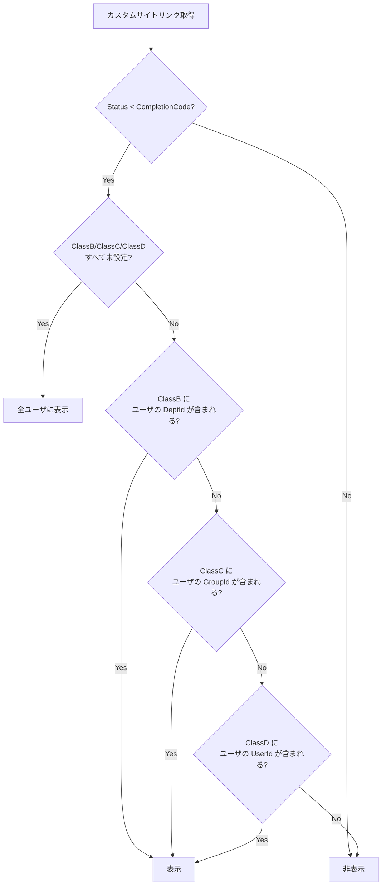
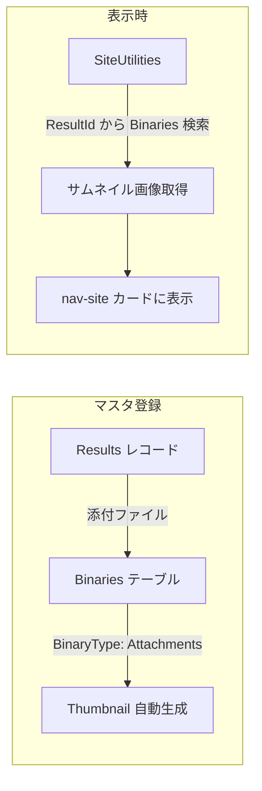
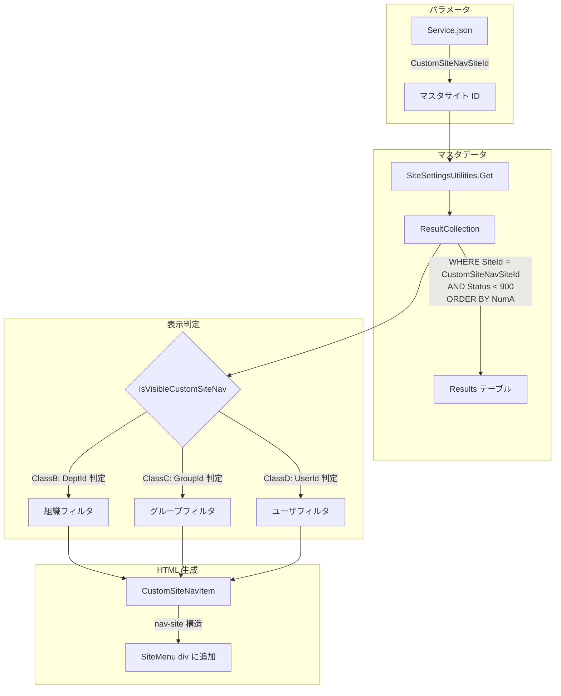
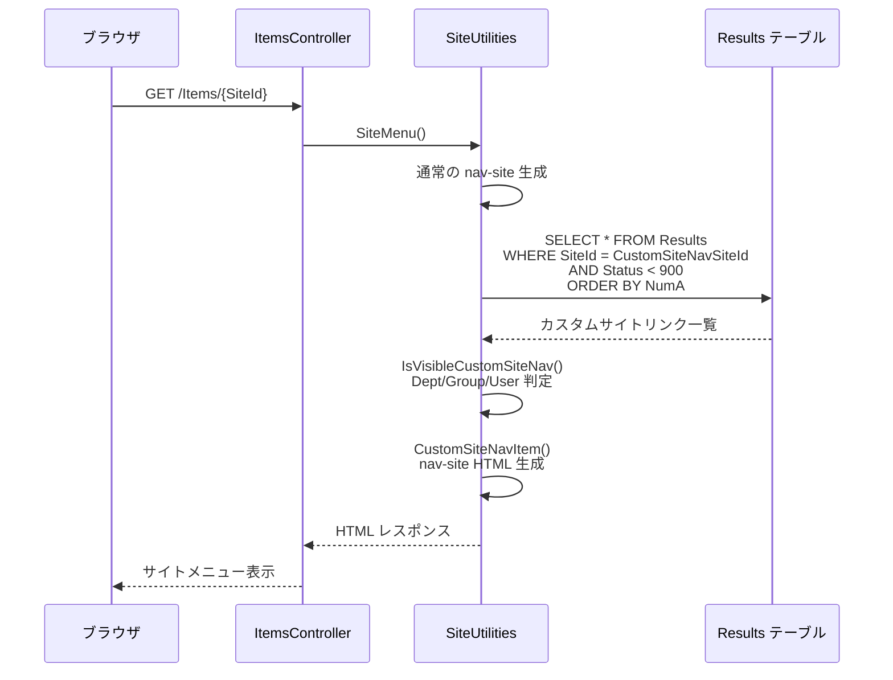

# 任意サイト追加ナビゲーション

サイトメニュー（nav-site）に任意のサイトリンクを追加する機能の設計調査。既存の nav-site 実装を流用し、Results テーブルをマスタとしてサイトリンク情報を管理する。組織・グループ・ユーザ単位での表示制御とサムネイル画像の設定にも対応する。

<!-- START doctoc generated TOC please keep comment here to allow auto update -->
<!-- DON'T EDIT THIS SECTION, INSTEAD RE-RUN doctoc TO UPDATE -->

- [調査情報](#調査情報)
- [調査目的](#調査目的)
- [現行の nav-site 実装](#現行の-nav-site-実装)
    - [SiteMenu の構造](#sitemenu-の構造)
    - [SiteMenuElement の構成](#sitemenuelement-の構成)
    - [nav-site の HTML 構造](#nav-site-の-html-構造)
    - [サイトアイコンの表示](#サイトアイコンの表示)
    - [サイト画像の保存方式](#サイト画像の保存方式)
    - [SiteConditions（件数・期限超過表示）](#siteconditions件数期限超過表示)
- [既存のアナウンス機能（参考パターン）](#既存のアナウンス機能参考パターン)
    - [アナウンスの仕組み](#アナウンスの仕組み)
    - [アナウンスのフィールド対応](#アナウンスのフィールド対応)
    - [アナウンスの制約](#アナウンスの制約)
- [カスタムサイトリンクの設計](#カスタムサイトリンクの設計)
    - [基本方針](#基本方針)
    - [パラメータの追加](#パラメータの追加)
- [マスタデータの構成](#マスタデータの構成)
    - [Results テーブルのフィールド設計](#results-テーブルのフィールド設計)
    - [フィールド設計の選択肢](#フィールド設計の選択肢)
    - [選択肢の設定例](#選択肢の設定例)
- [表示制御の設計](#表示制御の設計)
    - [表示判定ロジック](#表示判定ロジック)
    - [判定ルール](#判定ルール)
    - [実装例](#実装例)
- [サムネイル画像の設計](#サムネイル画像の設計)
    - [方式の選択肢](#方式の選択肢)
    - [推奨方式: Results の添付ファイル + Binaries テーブル](#推奨方式-results-の添付ファイル--binaries-テーブル)
    - [サムネイル画像の取得](#サムネイル画像の取得)
    - [代替案: ClassE に外部 URL 指定](#代替案-classe-に外部-url-指定)
- [HTML レンダリングの設計](#html-レンダリングの設計)
    - [nav-site 構造の流用](#nav-site-構造の流用)
    - [レンダリングメソッドの追加](#レンダリングメソッドの追加)
    - [カスタムサイトリンクアイテムの生成](#カスタムサイトリンクアイテムの生成)
- [データフロー](#データフロー)
    - [全体アーキテクチャ](#全体アーキテクチャ)
    - [シーケンス図](#シーケンス図)
- [改修対象の全体像](#改修対象の全体像)
    - [改修ファイル一覧](#改修ファイル一覧)
- [考慮事項](#考慮事項)
    - [パフォーマンス](#パフォーマンス)
    - [権限制御](#権限制御)
    - [ソート順](#ソート順)
    - [外部 URL への遷移](#外部-url-への遷移)
    - [CodeDefiner への影響](#codedefiner-への影響)
    - [sortable の無効化](#sortable-の無効化)
- [結論](#結論)
- [関連ソースコード](#関連ソースコード)

<!-- END doctoc generated TOC please keep comment here to allow auto update -->

## 調査情報

| 調査日       | リポジトリ | ブランチ | タグ/バージョン    | コミット     | 備考     |
| ------------ | ---------- | -------- | ------------------ | ------------ | -------- |
| 2026年3月3日 | Pleasanter | main     | Pleasanter_1.5.1.0 | `34f162a439` | 初回調査 |

## 調査目的

プリザンターのサイトメニュー画面に、管理者が任意のサイトリンクを追加できる機能を実装したい。
既存の nav-site（サイトナビゲーション）の見た目と動作を流用し、マスタデータ管理にはアナウンス機能が
Issues テーブルを参照するパターンを参考に Results テーブルを使用する。
サムネイル画像の設定と、組織（Dept）・グループ（Group）・ユーザ（User）単位での表示制御を実現する。

---

## 現行の nav-site 実装

### SiteMenu の構造

サイトメニューは `SiteMenu` クラス（`Dictionary<long, SiteMenuElement>`）で
サイト階層をメモリ上に保持し、`SiteUtilities.cs` の `SiteMenu()` メソッドで HTML を生成する。

**ファイル**: `Implem.Pleasanter/Libraries/Server/SiteMenu.cs`

```csharp
public class SiteMenu : Dictionary<long, SiteMenuElement>
{
    public SiteMenuElement Get(Context context, long siteId) { ... }
    public IEnumerable<SiteMenuElement> Children(Context context, long siteId) { ... }
    public IEnumerable<SiteCondition> SiteConditions(Context context, long siteId) { ... }
}
```

### SiteMenuElement の構成

各サイトの情報は `SiteMenuElement` で保持される。

**ファイル**: `Implem.Pleasanter/Libraries/Server/SiteMenuElement.cs`（行番号: 6-47）

| プロパティ     | 型         | 用途                                       |
| -------------- | ---------- | ------------------------------------------ |
| TenantId       | `int`      | テナント ID                                |
| SiteId         | `long`     | サイト ID                                  |
| ReferenceType  | `string`   | テーブル種別（Sites/Issues/Results/Wikis） |
| ParentId       | `long`     | 親サイト ID                                |
| OnlyOneChildId | `long`     | 唯一の子サイト（Wiki 直接遷移用）          |
| Title          | `string`   | サイト名                                   |
| CreatedTime    | `DateTime` | 作成日時                                   |

### nav-site の HTML 構造

`SiteUtilities.cs` の `SiteMenu()` メソッド（行番号: 4376-4405）で以下の HTML 構造を生成する。

```html
<div id="SiteMenu">
    <nav class="cf">
        <ul class="nav-sites sortable">
            <li class="nav-site results has-image" data-value="{siteId}" data-type="Results">
                <a href="/items/{siteId}">
                    <div class="site-icon">
                        
                    </div>
                    <span class="title">{サイト名}</span>
                    <div class="conditions">
                        <span class="count">{件数}</span>
                        <span class="overdue">{期限超過}</span>
                        <span class="elapsed-time">{経過時間}</span>
                    </div>
                </a>
            </li>
        </ul>
    </nav>
</div>
```

**ファイル**: `Implem.Pleasanter/Models/Sites/SiteUtilities.cs`（行番号: 4428-4475）

```csharp
return hb.Li(
    attributes: new HtmlAttributes()
        .Class(Css.Class("nav-site " + referenceType.ToLower() +
            (hasImage ? " has-image" : string.Empty),
            toParent ? " to-parent" : string.Empty))
        .DataValue(siteId.ToString())
        .DataType(referenceType),
    action: () => hb
        .A(...)
        .SiteMenuInnerElements(...));
```

### サイトアイコンの表示

テーマバージョンにより表示方式が異なる。

**ファイル**: `Implem.Pleasanter/Models/Sites/SiteUtilities.cs`（行番号: 4518-4607）

| テーマバージョン  | 画像あり                                 | 画像なし                                             |
| ----------------- | ---------------------------------------- | ---------------------------------------------------- |
| v1（jQuery UI）   | ``     | アイコンなし                                         |
| v2（SmartDesign） | `<div class="site-icon"></div>` | `<div class="site-icon">` |

### サイト画像の保存方式

サイト画像は `Binaries` テーブルに `BinaryType = "SiteImage"` として保存される。`Thumbnail`（小）と `Icon`（極小）の 2 サイズが自動生成される。

**ファイル**: `Implem.Pleasanter/Models/Binaries/BinaryUtilities.cs`（行番号: 164-194）

| カラム    | 用途                         | 取得パス                                              |
| --------- | ---------------------------- | ----------------------------------------------------- |
| Thumbnail | nav-site のサムネイル画像    | `Items/{siteId}/Binaries/SiteImageThumbnail/{prefix}` |
| Icon      | ブレッドクラム等の小アイコン | `Items/{siteId}/Binaries/SiteImageIcon/{prefix}`      |
| Bin       | 元画像                       | `Items/{siteId}/Binaries/SiteImageLogo/{prefix}`      |

### SiteConditions（件数・期限超過表示）

`SiteMenu.cs` の `SiteConditions()` メソッド（行番号: 117-162）で各サイトのレコード件数・期限超過件数・最終更新日時を集計し、nav-site カードの条件バッジとして表示する。

---

## 既存のアナウンス機能（参考パターン）

### アナウンスの仕組み

アナウンス機能は `Parameters.Service.AnnouncementSiteId` で指定した Issues テーブルからデータを取得し、ページ上部にバナーとして表示する。

**ファイル**: `Implem.Pleasanter/Libraries/HtmlParts/HtmlHeaders.cs`（行番号: 49-86）

```csharp
public static HtmlBuilder Announcement(this HtmlBuilder hb, Context context)
{
    var siteId = Parameters.Service.AnnouncementSiteId;
    if (siteId > 0)
    {
        var ss = SiteSettingsUtilities.Get(context: context, siteId: siteId);
        var now = DateTime.Now;
        var issueCollection = new IssueCollection(
            context: context,
            ss: ss,
            where: Rds.IssuesWhere()
                .SiteId(siteId)
                .Status(_operator: $"<{Parameters.General.CompletionCode}")
                .StartTime(now, _operator: "<=")
                .CompletionTime(now, _operator: ">="));
        // ...IssueModel ごとに HTML 生成
    }
    return hb;
}
```

### アナウンスのフィールド対応

| フィールド     | 用途                           |
| -------------- | ------------------------------ |
| Title          | タイトル                       |
| Body           | 本文（HTML）                   |
| Status         | 有効/無効（< CompletionCode）  |
| StartTime      | 表示開始日時                   |
| CompletionTime | 表示終了日時                   |
| CheckA         | 他ページ非表示                 |
| CheckB         | ログイン画面非表示             |
| CheckC         | トップページ非表示             |
| CheckD         | ユーザーによる閉じるボタン表示 |

### アナウンスの制約

アナウンス機能は組織・グループ・ユーザ単位での表示制御を持たない。表示条件はページコンテキスト（ログイン画面/トップ/その他）と CheckA-D フラグのみで制御される。

---

## カスタムサイトリンクの設計

### 基本方針

アナウンス機能のパターンを踏襲し、Results テーブルをマスタとしてカスタムサイトリンク情報を管理する。nav-site の HTML 構造と CSS を流用し、統一的な見た目で表示する。

| 項目           | アナウンス機能         | カスタムサイトリンク（新規）        |
| -------------- | ---------------------- | ----------------------------------- |
| テーブル種別   | Issues テーブル        | Results テーブル                    |
| パラメータ     | `AnnouncementSiteId`   | `CustomSiteNavSiteId`（新規追加）   |
| 表示先         | ページ上部バナー       | サイトメニュー内（nav-site カード） |
| 表示制御       | ページコンテキストのみ | 組織・グループ・ユーザ単位          |
| サムネイル画像 | なし                   | あり（Binaries テーブル）           |

### パラメータの追加

`Service.json` に `CustomSiteNavSiteId` パラメータを追加する。

**ファイル**: `Implem.ParameterAccessor/Parts/Service.cs`

```csharp
public class Service
{
    // ...
    public long AnnouncementSiteId;
    public long CustomSiteNavSiteId;  // 追加
    // ...
}
```

**ファイル**: `Implem.Pleasanter/App_Data/Parameters/Service.json`

```json
{
    "AnnouncementSiteId": 0,
    "CustomSiteNavSiteId": 0
}
```

---

## マスタデータの構成

### Results テーブルのフィールド設計

カスタムサイトリンクのマスタ情報は Results テーブルの標準フィールドと拡張カラムを組み合わせて構成する。

| フィールド   | Results カラム | 用途                                  | 入力例                    |
| ------------ | -------------- | ------------------------------------- | ------------------------- |
| サイト名     | Title          | nav-site カードに表示するタイトル     | 社内ポータル              |
| 説明         | Body           | サイトの説明文（ツールチップ等）      | 全社共通の情報ポータル    |
| リンク先 URL | ClassA         | 遷移先の URL（サイト ID または URL）  | 12345 または /items/12345 |
| 表示順       | NumA           | nav-site の表示順（昇順）             | 100                       |
| 有効/無効    | Status         | 表示の有効/無効                       | 100（有効）               |
| 対象組織     | ClassB         | 表示対象の組織 ID（カンマ区切り）     | 1,2,3                     |
| 対象グループ | ClassC         | 表示対象のグループ ID（カンマ区切り） | 10,20                     |
| 対象ユーザ   | ClassD         | 表示対象のユーザ ID（カンマ区切り）   | 100,200                   |
| アイコン種別 | ClassE         | アイコンの種類                        | issues / results / wikis  |
| サムネイル   | 添付ファイル   | サムネイル画像                        | _(後述)_                  |

### フィールド設計の選択肢

Results テーブルの拡張カラムにはいくつかの分類項目（Class）設定のパターンがある。

| 方式                               | 利点                      | 欠点                           |
| ---------------------------------- | ------------------------- | ------------------------------ |
| ClassA-D にカンマ区切りで ID 指定  | 実装が単純                | 選択 UI が貧弱                 |
| ClassA-D に `[[Depts]]` 等で選択肢 | プリザンター標準の選択 UI | 複数選択の組み合わせが煩雑     |
| CheckA-D でフラグ管理              | Boolean で直感的          | 組織・グループの指定ができない |
| DescriptionA に JSON で一括管理    | 柔軟性が高い              | UI が使いにくい                |

本設計では ClassB-D に `[[Depts]]`・`[[Groups]]`・`[[Users]]` の選択肢を設定し、複数選択可能な分類項目として運用する方式を推奨する。

### 選択肢の設定例

サイト設定のエディタ画面で ClassB-D に以下の選択肢を設定する。

| カラム | ラベル       | 選択肢設定   | 複数選択 |
| ------ | ------------ | ------------ | :------: |
| ClassB | 対象組織     | `[[Depts]]`  |   Yes    |
| ClassC | 対象グループ | `[[Groups]]` |   Yes    |
| ClassD | 対象ユーザ   | `[[Users]]`  |   Yes    |

これにより、プリザンター標準のドロップダウン UI で組織・グループ・ユーザを選択できる。

---

## 表示制御の設計

### 表示判定ロジック

カスタムサイトリンクの表示可否は、現在のユーザ情報と Results レコードの ClassB-D を突き合わせて判定する。



### 判定ルール

| 条件                                 | 結果   | 説明                      |
| ------------------------------------ | ------ | ------------------------- |
| ClassB・ClassC・ClassD すべて未設定  | 表示   | 制限なし = 全ユーザに表示 |
| ClassB にユーザの DeptId が含まれる  | 表示   | 組織単位の許可            |
| ClassC にユーザの GroupId が含まれる | 表示   | グループ単位の許可        |
| ClassD にユーザの UserId が含まれる  | 表示   | ユーザ単位の許可          |
| いずれにも該当しない                 | 非表示 | アクセス不可              |

組織・グループ・ユーザの判定は OR 条件で結合する。いずれか 1 つに該当すれば表示される。

### 実装例

```csharp
private static bool IsVisibleCustomSiteNav(
    Context context,
    ResultModel resultModel)
{
    var deptIds = GetIds(resultModel.GetClass("ClassB"));
    var groupIds = GetIds(resultModel.GetClass("ClassC"));
    var userIds = GetIds(resultModel.GetClass("ClassD"));
    if (!deptIds.Any() && !groupIds.Any() && !userIds.Any())
    {
        return true; // 制限なし
    }
    if (deptIds.Contains(context.DeptId))
    {
        return true; // 組織が一致
    }
    if (context.Groups?.Any(g => groupIds.Contains(g)) == true)
    {
        return true; // グループが一致
    }
    if (userIds.Contains(context.UserId))
    {
        return true; // ユーザが一致
    }
    return false;
}

private static List<int> GetIds(string csv)
{
    return csv?.Split(',')
        .Where(s => int.TryParse(s.Trim(), out _))
        .Select(s => int.Parse(s.Trim()))
        .ToList() ?? new List<int>();
}
```

---

## サムネイル画像の設計

### 方式の選択肢

サムネイル画像の管理には複数の方式が考えられる。

| 方式                               | 利点                           | 欠点                               |
| ---------------------------------- | ------------------------------ | ---------------------------------- |
| 1. Results の添付ファイルを流用    | 追加開発が最小                 | ファイル ID の紐付けが必要         |
| 2. ClassE に外部 URL を指定        | 実装が単純、外部画像も利用可能 | セキュリティリスク（外部参照）     |
| 3. Binaries テーブルに直接保存     | SiteImage と同じ仕組みで統一的 | BinaryType の拡張が必要            |
| 4. DescriptionA に Base64 埋め込み | DB 完結で簡単                  | データ量が増大、パフォーマンス劣化 |

### 推奨方式: Results の添付ファイル + Binaries テーブル

既存の SiteImage の仕組みを参考に、Results レコードの添付ファイルとして画像をアップロードし、Binaries テーブルに保存する方式を推奨する。



### サムネイル画像の取得

添付ファイルの画像は以下のパスで取得可能である。

```text
/binaries/{BinaryId}/show
```

添付ファイルの一覧は ResultModel の `AttachmentsHash` に格納されており、最初の画像ファイルをサムネイルとして使用する。

```csharp
private static string GetThumbnailUrl(
    Context context,
    ResultModel resultModel)
{
    var attachments = resultModel.AttachmentsHash
        ?.Values
        .SelectMany(a => a)
        .Where(a => a.ContentType?.StartsWith("image/") == true)
        .FirstOrDefault();
    if (attachments == null) return null;
    return Locations.Get(
        context: context,
        "Binaries",
        attachments.Guid,
        "Show");
}
```

### 代替案: ClassE に外部 URL 指定

より簡易な方式として、ClassE に画像 URL を直接指定する方法もある。

| フィールド | 用途               | 入力例                            |
| ---------- | ------------------ | --------------------------------- |
| ClassE     | サムネイル画像 URL | /binaries/xxx/show または外部 URL |

この場合、外部 URL のセキュリティ対策（CSP ヘッダー等）を別途検討する必要がある。

---

## HTML レンダリングの設計

### nav-site 構造の流用

カスタムサイトリンクは既存の nav-site の HTML 構造をそのまま流用する。これにより、既存のスタイルシートとスクリプトがそのまま適用される。

```html
<!-- 通常の nav-site（既存） -->
<ul class="nav-sites sortable">
    <li class="nav-site results has-image" data-value="12345">
        <a href="/items/12345">...</a>
    </li>
</ul>

<!-- カスタムサイトリンク（追加） -->
<ul class="nav-sites custom-site-nav">
    <li class="nav-site custom-link has-image" data-value="custom-1">
        <a href="/items/67890" target="_self">
            <div class="site-icon">
                
            </div>
            <span class="title">社内ポータル</span>
        </a>
    </li>
</ul>
```

### レンダリングメソッドの追加

`SiteUtilities.cs` にカスタムサイトリンクのレンダリングメソッドを追加する。

```csharp
private static HtmlBuilder CustomSiteNav(
    this HtmlBuilder hb,
    Context context,
    SiteModel siteModel)
{
    var customSiteNavSiteId = Parameters.Service.CustomSiteNavSiteId;
    if (customSiteNavSiteId <= 0) return hb;
    var ss = SiteSettingsUtilities.Get(
        context: context,
        siteId: customSiteNavSiteId);
    var resultCollection = new ResultCollection(
        context: context,
        ss: ss,
        where: Rds.ResultsWhere()
            .SiteId(customSiteNavSiteId)
            .Status(_operator: $"<{Parameters.General.CompletionCode}"),
        orderBy: Rds.ResultsOrderBy().NumA());
    return hb.Nav(
        css: "cf",
        _using: resultCollection.Any(),
        action: () => hb
            .Ul(
                css: "nav-sites custom-site-nav",
                action: () => resultCollection
                    .Where(r => IsVisibleCustomSiteNav(context, r))
                    .ForEach(resultModel => hb
                        .CustomSiteNavItem(
                            context: context,
                            resultModel: resultModel))));
}
```

### カスタムサイトリンクアイテムの生成

```csharp
private static HtmlBuilder CustomSiteNavItem(
    this HtmlBuilder hb,
    Context context,
    ResultModel resultModel)
{
    var url = resultModel.GetClass("ClassA");
    var iconType = resultModel.GetClass("ClassE");
    var thumbnailUrl = GetThumbnailUrl(context, resultModel);
    var hasImage = thumbnailUrl != null;
    var href = url?.StartsWith("/") == true || url?.StartsWith("http") == true
        ? url
        : Locations.ItemIndex(context: context, id: url?.ToLong() ?? 0);
    return hb.Li(
        attributes: new HtmlAttributes()
            .Class(Css.Class(
                "nav-site " + (iconType ?? "sites").ToLower() +
                (hasImage ? " has-image" : string.Empty),
                " custom-link"))
            .DataValue($"custom-{resultModel.ResultId}"),
        action: () => hb
            .A(
                href: href,
                action: () => hb
                    .CustomSiteNavIcon(
                        context: context,
                        iconType: iconType,
                        thumbnailUrl: thumbnailUrl,
                        hasImage: hasImage)
                    .Span(
                        css: "title",
                        action: () => hb
                            .Text(resultModel.Title.Value))));
}
```

---

## データフロー

### 全体アーキテクチャ



### シーケンス図



---

## 改修対象の全体像

```mermaid
flowchart LR
    subgraph パラメータ追加
        A1[Service.cs: CustomSiteNavSiteId]
        A2[Service.json: CustomSiteNavSiteId]
    end
    subgraph データ取得・判定
        B1[SiteUtilities.cs: CustomSiteNav]
        B2[SiteUtilities.cs: IsVisibleCustomSiteNav]
        B3[SiteUtilities.cs: GetThumbnailUrl]
    end
    subgraph HTML 生成
        C1[SiteUtilities.cs: CustomSiteNavItem]
        C2[SiteUtilities.cs: CustomSiteNavIcon]
    end
    subgraph CSS
        D1[style.scss: .custom-site-nav]
        D2[legacy.scss: .custom-site-nav]
    end
    A1 --> B1
    A2 --> B1
    B1 --> B2
    B1 --> B3
    B2 --> C1
    B3 --> C1
    C1 --> C2
```

### 改修ファイル一覧

| ファイル                             | 改修内容                                    | 種別     |
| ------------------------------------ | ------------------------------------------- | -------- |
| `ParameterAccessor/Parts/Service.cs` | `CustomSiteNavSiteId` プロパティ追加        | 既存改修 |
| `App_Data/Parameters/Service.json`   | `CustomSiteNavSiteId` パラメータ追加        | 既存改修 |
| `Models/Sites/SiteUtilities.cs`      | カスタムサイトリンク生成メソッド群の追加    | 既存改修 |
| `wwwroot/styles/style.scss`          | `.custom-site-nav` / `.custom-link` CSS追加 | 既存改修 |
| `wwwroot/styles/legacy.scss`         | `.custom-site-nav` / `.custom-link` CSS追加 | 既存改修 |

---

## 考慮事項

### パフォーマンス

カスタムサイトリンクはサイトメニュー表示のたびにクエリが実行される。マスタデータ量が少ない場合（数十件程度）は都度クエリで問題ないが、大量のリンクを登録する場合はキャッシュの検討が必要になる。

| 方式                    | 利点                 | 欠点                            |
| ----------------------- | -------------------- | ------------------------------- |
| 都度クエリ              | 実装が単純、即時反映 | DB アクセス増加                 |
| メモリキャッシュ        | 高速                 | キャッシュ無効化の設計が必要    |
| SiteInfo キャッシュ併用 | 既存の仕組みと統一   | SiteInfo の更新タイミングに依存 |

通常想定されるカスタムサイトリンク数は数件から数十件程度であるため、初期実装は都度クエリで十分である。

### 権限制御

Results テーブルに対する権限制御はプリザンター標準の仕組みで行われる。`SiteSettingsUtilities.Get` で対象サイトの `SiteSettings` を取得する際に暗黙的な権限チェックが行われる。マスタデータの編集はサイト管理者のみに制限し、表示は全ユーザに読み取り権限を付与する運用を想定する。

### ソート順

`NumA` カラムを表示順として使用する。100, 200, 300 ... のように間隔を空けた番号を付けることで、後からの挿入が容易になる。

### 外部 URL への遷移

ClassA に外部 URL（`https://...`）を指定した場合の動作を考慮する必要がある。

| URL の形式              | 遷移方式                 | 備考                     |
| ----------------------- | ------------------------ | ------------------------ |
| 数値（サイト ID）       | `/items/{siteId}` へ遷移 | プリザンター内部サイト   |
| `/items/...` の相対パス | そのまま遷移             | プリザンター内部パス     |
| `https://...`           | 外部 URL へ遷移          | `target="_blank"` を検討 |

外部 URL の場合は `target="_blank"` と `rel="noopener noreferrer"` を付与し、新しいタブで開く設計が望ましい。

### CodeDefiner への影響

`CustomSiteNavSiteId` パラメータは `Service.cs` への単純なプロパティ追加であり、
CodeDefiner による自動生成コードへの影響はない。
`SiteUtilities.cs` への改修は手動で行うコード部分であり、
CodeDefiner のテンプレートには影響しない。

### sortable の無効化

通常の nav-site は `sortable` CSS クラスにより jQuery UI Sortable で
ドラッグ&ドロップ並び替えが可能である。
カスタムサイトリンクは Results テーブルの NumA で順序を管理するため、
`sortable` クラスは付与せず `custom-site-nav` クラスのみを使用する。

---

## 結論

| 項目             | 結果                                                                 |
| ---------------- | -------------------------------------------------------------------- |
| 実装方式         | アナウンス機能パターンを踏襲し、Results テーブルをマスタとして使用   |
| パラメータ       | `Service.json` に `CustomSiteNavSiteId` を追加                       |
| マスタ構成       | Title（名称）・ClassA（URL）・NumA（表示順）・Status（有効/無効）    |
| 表示制御         | ClassB（組織）・ClassC（グループ）・ClassD（ユーザ）で OR 判定       |
| サムネイル画像   | 添付ファイルの画像をサムネイルとして使用（代替: ClassE に URL 指定） |
| HTML 構造        | 既存の nav-site 構造を流用（`<li class="nav-site custom-link">`）    |
| DB スキーマ変更  | 不要（既存の Results テーブルを使用）                                |
| 改修規模         | パラメータ追加 + SiteUtilities 改修 + CSS 追加                       |
| CodeDefiner 対応 | 不要（手動コード部分のみの改修）                                     |
| パフォーマンス   | マスタ件数は少量のため都度クエリで実用上問題なし                     |

---

## 関連ソースコード

| ファイル                                                | 概要                                                    |
| ------------------------------------------------------- | ------------------------------------------------------- |
| `Implem.Pleasanter/Models/Sites/SiteUtilities.cs`       | SiteMenu 生成（4376-4475行目）、SiteMenuInnerElements   |
| `Implem.Pleasanter/Libraries/Server/SiteMenu.cs`        | サイトメニューデータ構造（Get/Children/SiteConditions） |
| `Implem.Pleasanter/Libraries/Server/SiteMenuElement.cs` | サイトメニュー要素の定義（6-47行目）                    |
| `Implem.Pleasanter/Libraries/Server/SiteCondition.cs`   | サイト状態（件数・期限超過）                            |
| `Implem.Pleasanter/Libraries/HtmlParts/HtmlHeaders.cs`  | アナウンス機能（49-108行目）                            |
| `Implem.Pleasanter/Models/Users/UserUtilities.cs`       | CloseAnnouncement（5116-5136行目）                      |
| `Implem.Pleasanter/Models/Binaries/BinaryUtilities.cs`  | SiteImageThumbnail/Icon 取得（164-225行目）             |
| `Implem.Pleasanter/Models/Binaries/BinaryModel.cs`      | Binaries テーブルモデル（26-59行目）                    |
| `Implem.ParameterAccessor/Parts/Service.cs`             | AnnouncementSiteId パラメータ定義                       |
