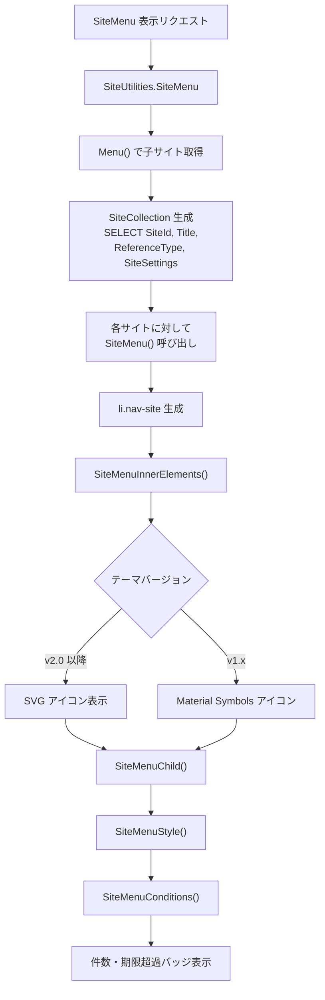
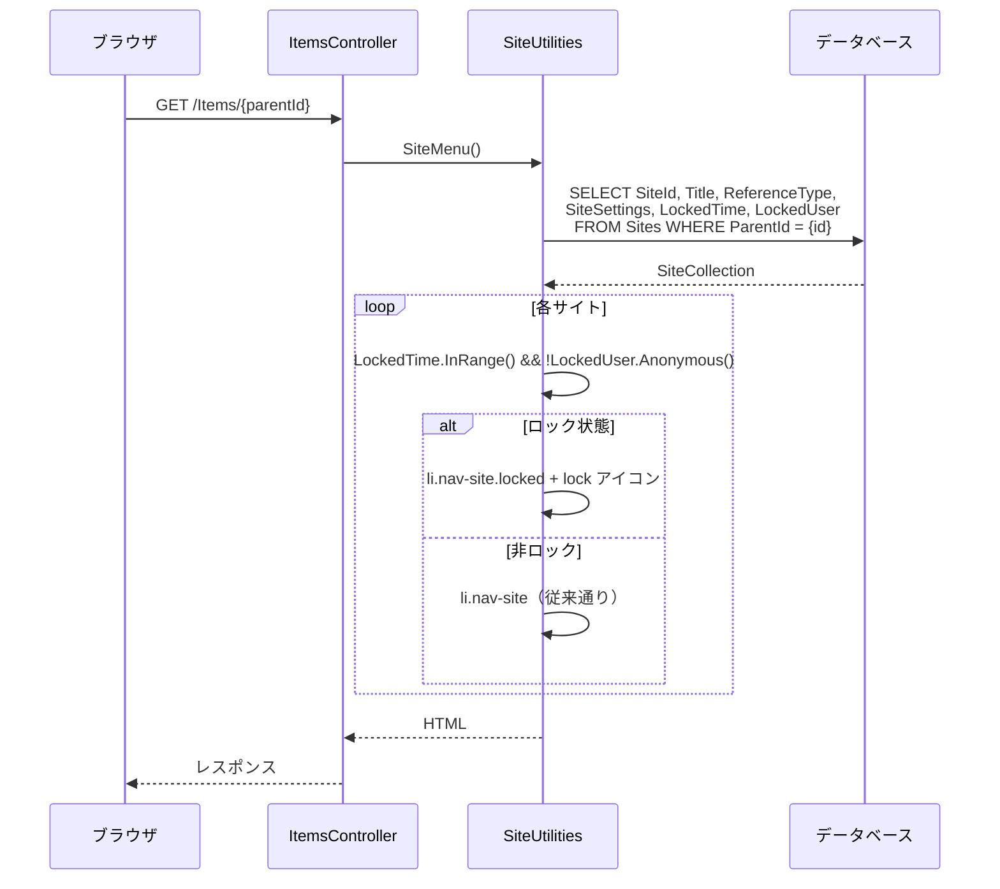

# サイトメニューテーブルロック状態表示

サイトメニュー（nav-site）でテーブルのロック状態が視覚的に判別できない問題を調査し、ロック状態を表示する機能の実装方針を設計する。

<!-- START doctoc generated TOC please keep comment here to allow auto update -->
<!-- DON'T EDIT THIS SECTION, INSTEAD RE-RUN doctoc TO UPDATE -->

- [調査情報](#調査情報)
- [調査目的](#調査目的)
- [現行のテーブルロック機構](#現行のテーブルロック機構)
    - [ロック機能の概要](#ロック機能の概要)
    - [DB カラム](#db-カラム)
    - [ロック判定ロジック](#ロック判定ロジック)
    - [権限制限の適用](#権限制限の適用)
    - [ロック / 解除の Controller アクション](#ロック--解除の-controller-アクション)
    - [ロック / 解除の実行処理](#ロック--解除の実行処理)
- [現行のサイトメニュー表示](#現行のサイトメニュー表示)
    - [nav-site の描画フロー](#nav-site-の描画フロー)
    - [nav-site の HTML 構造](#nav-site-の-html-構造)
    - [Menu() のデータ取得](#menu-のデータ取得)
- [問題の分析](#問題の分析)
    - [現状の課題](#現状の課題)
    - [ナビゲーションメニューでの既存ロック UI](#ナビゲーションメニューでの既存ロック-ui)
- [実装方針](#実装方針)
    - [方針の比較](#方針の比較)
    - [推奨方針: C（CSS クラス + ロックアイコン）](#推奨方針-ccss-クラス--ロックアイコン)
- [改修設計](#改修設計)
    - [1. Menu() のデータ取得にロック情報を追加](#1-menu-のデータ取得にロック情報を追加)
    - [2. SiteMenu() にロック情報を引き渡す](#2-sitemenu-にロック情報を引き渡す)
    - [3. nav-site に locked CSS クラスを追加](#3-nav-site-に-locked-css-クラスを追加)
    - [4. SiteMenuInnerElements にロックアイコンを追加](#4-sitemenuinnerelements-にロックアイコンを追加)
    - [5. SiteMenu() の呼び出し元でロック情報を判定](#5-sitemenu-の呼び出し元でロック情報を判定)
    - [6. CSS スタイルの追加](#6-css-スタイルの追加)
- [改修の全体像](#改修の全体像)
    - [改修対象ファイル一覧](#改修対象ファイル一覧)
    - [データフロー](#データフロー)
    - [HTML 出力の比較](#html-出力の比較)
- [CodeDefiner への影響](#codedefiner-への影響)
- [考慮事項](#考慮事項)
    - [パフォーマンス](#パフォーマンス)
    - [既存テーマとの互換性](#既存テーマとの互換性)
    - [フォルダサイト（Sites タイプ）の除外](#フォルダサイトsites-タイプの除外)
    - [ツールチップでの詳細表示](#ツールチップでの詳細表示)
- [結論](#結論)
- [関連ソースコード](#関連ソースコード)

<!-- END doctoc generated TOC please keep comment here to allow auto update -->

## 調査情報

| 調査日       | リポジトリ | ブランチ | タグ/バージョン    | コミット     | 備考     |
| ------------ | ---------- | -------- | ------------------ | ------------ | -------- |
| 2026年3月6日 | Pleasanter | main     | Pleasanter_1.5.1.0 | `34f162a439` | 初回調査 |

## 調査目的

プリザンターのサイトメニュー画面では、テーブルがロック状態であるかどうかを視覚的に判別する手段がない。テーブルロックは管理者がデータの更新・作成を一時的に禁止する重要な機能だが、ロック状態を確認するには個々のテーブルを開いてナビゲーションメニューを確認する必要がある。サイトメニュー上でロック状態を一目で把握できるようにすることで、運用時の利便性を向上させる。

---

## 現行のテーブルロック機構

### ロック機能の概要

テーブルロックは、サイト管理者がテーブル全体の更新操作を一時的に禁止する機能である。

| 項目               | 内容                                                            |
| ------------------ | --------------------------------------------------------------- |
| 有効化設定         | サイト設定 > `AllowLockTable` チェックボックスで有効化          |
| ロック操作         | ナビゲーションメニュー > テーブルをロック                       |
| 解除操作           | ナビゲーションメニュー > テーブルのロックを解除                 |
| 強制解除           | 特権ユーザのみ。他ユーザがロックしたテーブルを解除可能          |
| 制限される操作     | Create、Import、Update、Delete（Read、Export、SendMail は許可） |
| 対象 ReferenceType | Issues、Results（`ss.IsTable()` が true のもの）                |

### DB カラム

ロック状態は Sites テーブルの 2 カラムで管理される。

**ファイル**: `Implem.Pleasanter/App_Data/Definitions/Definition_Column/Sites_LockedTime.json`、`Sites_LockedUser.json`

| カラム名     | 型         | 説明                                        |
| ------------ | ---------- | ------------------------------------------- |
| `LockedTime` | `datetime` | ロック実行日時（NULL 許容）                 |
| `LockedUser` | `int`      | ロック実行ユーザ ID（NULL 許容、FK: Users） |

ロック状態の判定は `LockedUser` が NULL でないこと（= 匿名ユーザでないこと）と
`LockedTime` が有効範囲内であることの両方が成立する場合に「ロック中」と判定される。
解除時は `LockedUser` に `null` が書き込まれる。

### ロック判定ロジック

**ファイル**: `Implem.Pleasanter/Libraries/Settings/SiteSettings.cs`（行番号: 656-671）

```csharp
public bool Locked()
{
    return LockedTable() || LockedRecord();
}

public bool LockedTable()
{
    return LockedTableTime?.Value.InRange() == true
        && LockedTableUser?.Anonymous() == false;
}

public bool LockedRecord()
{
    return LockedRecordTime?.Value.InRange() == true
        && LockedRecordUser?.Anonymous() == false;
}
```

`SiteSettings` の `LockedTableTime` / `LockedTableUser` は `[NonSerialized]` フィールドであり、
JSON シリアライズ対象外である。`SiteSettingsUtilities` の各 `Get` メソッドで
`SiteModel` から転写される。

**ファイル**: `Implem.Pleasanter/Libraries/Settings/SiteSettingsUtilities.cs`（行番号: 475-476）

```csharp
ss.LockedTableTime = siteModel.LockedTime;
ss.LockedTableUser = siteModel.LockedUser;
```

### 権限制限の適用

テーブルがロック状態の場合、権限が Read / Export / SendMail に制限される。

**ファイル**: `Implem.Pleasanter/Libraries/Settings/SiteSettings.cs`（行番号: 646-653）

```csharp
if (LockedTable())
{
    var lockedPermissionType = Permissions.Types.Read
        | Permissions.Types.Export
        | Permissions.Types.SendMail;
    ss.PermissionType &= lockedPermissionType;
    ss.ItemPermissionType &= lockedPermissionType;
}
```

### ロック / 解除の Controller アクション

**ファイル**: `Implem.Pleasanter/Controllers/ItemsController.cs`（行番号: 1282-1325）

| アクション         | HTTP メソッド | 権限条件                                       |
| ------------------ | ------------- | ---------------------------------------------- |
| `LockTable`        | POST          | `CanManageSite` かつ未ロック状態               |
| `UnlockTable`      | POST          | ロック中かつ（ロック者本人 または 特権ユーザ） |
| `ForceUnlockTable` | POST          | ロック中かつ特権ユーザ                         |

### ロック / 解除の実行処理

**ファイル**: `Implem.Pleasanter/Models/Sites/SiteUtilities.cs`（行番号: 18724-18810）

```csharp
// LockTable: LockedTime = DateTime.Now, LockedUser = context.UserId
Repository.ExecuteNonQuery(
    context: context,
    statements: Rds.UpdateSites(
        where: Rds.SitesWhere()
            .TenantId(context.TenantId)
            .SiteId(ss.SiteId),
        param: Rds.SitesParam()
            .LockedTime(DateTime.Now)
            .LockedUser(context.UserId)));

// UnlockTable / ForceUnlockTable: LockedUser = null（LockedTimeは更新）
Repository.ExecuteNonQuery(
    context: context,
    statements: Rds.UpdateSites(
        where: Rds.SitesWhere()
            .TenantId(context.TenantId)
            .SiteId(ss.SiteId),
        param: Rds.SitesParam()
            .LockedTime(DateTime.Now)
            .LockedUser(raw: "null")));
```

---

## 現行のサイトメニュー表示

### nav-site の描画フロー



### nav-site の HTML 構造

**ファイル**: `Implem.Pleasanter/Models/Sites/SiteUtilities.cs`（行番号: 4428-4475）

```html
<li class="nav-site {referenceType} [has-image] [to-parent]" data-value="{siteId}" data-type="{referenceType}">
    <a href="/Items/{siteId}/{viewMode}">
        <!-- サイトアイコン（画像またはSVG） -->
        <div class="site-icon">
            
            <!-- 画像の場合 -->
        </div>
        <!-- または SVGアイコン -->
        <!-- サイトタイトル -->
        <span class="title">{title}</span>
        <!-- 参照タイプ表示（画像あり時） -->
        <span class="reference material-symbols-outlined">...</span>
        <!-- 件数バッジ -->
        <span class="count" title="数量">{itemCount}</span>
        <!-- 期限超過バッジ -->
        <span class="overdue" title="期限超過">{overdueCount}</span>
    </a>
</li>
```

### Menu() のデータ取得

**ファイル**: `Implem.Pleasanter/Models/Sites/SiteUtilities.cs`（行番号: 4793-4823）

```csharp
private static IEnumerable<SiteModel> Menu(Context context, SiteSettings ss)
{
    var siteCollection = new SiteCollection(
        context: context,
        column: Rds.SitesColumn()
            .SiteId()
            .Title()
            .ReferenceType()
            .SiteSettings(),
        where: Rds.SitesWhere()
            .TenantId(context.TenantId)
            .ParentId(ss.SiteId)
            .Add(
                raw: Def.Sql.HasPermission,
                _using: !context.HasPrivilege));
    // ...
}
```

取得カラムは `SiteId`、`Title`、`ReferenceType`、`SiteSettings` の 4 カラムのみであり、`LockedTime` / `LockedUser` は取得されていない。

---

## 問題の分析

### 現状の課題

| 課題                           | 詳細                                                                               |
| ------------------------------ | ---------------------------------------------------------------------------------- |
| ロック状態が視覚的に不明       | サイトメニューの nav-site にロック状態のインジケータがない                         |
| 確認に手間がかかる             | ロック状態を確認するにはテーブルを開いてナビゲーションメニューを表示する必要がある |
| 複数テーブルの一括確認が困難   | 多数のテーブルがある環境では、どのテーブルがロックされているか一目で分からない     |
| ロックデータが取得されていない | `Menu()` の SQL クエリに `LockedTime` / `LockedUser` が含まれていない              |

### ナビゲーションメニューでの既存ロック UI

テーブルを開いた後のナビゲーションメニューでは、ロック状態に応じてメニュー項目が切り替わる。

**ファイル**: `Implem.Pleasanter/Libraries/HtmlParts/HtmlNavigationMenu.cs`（行番号: 814-832）

```csharp
case "LockTableMenu_LockTable":
case "LockTableMenu_UnlockTable":
case "LockTableMenu_ForceUnlockTable":
    if (ss.IsTable())
    {
        if (!ss.Locked())
        {
            return (menuId == "LockTableMenu_LockTable");
        }
        else if (ss.LockedTableUser.Id == context.UserId)
        {
            return (menuId == "LockTableMenu_UnlockTable");
        }
        else if (context.HasPrivilege)
        {
            return (menuId == "LockTableMenu_ForceUnlockTable");
        }
    }
    return false;
```

この UI はテーブルを開かないと見えないため、サイトメニューからロック状態を把握することができない。

---

## 実装方針

### 方針の比較

| 方針                  | 概要                                               | メリット                           | デメリット            |
| --------------------- | -------------------------------------------------- | ---------------------------------- | --------------------- |
| A. CSS クラス追加     | `nav-site` に `locked` クラスを追加                | 既存構造の拡張が最小限             | CSS 追加が必要        |
| B. ロックアイコン追加 | `SiteMenuInnerElements` にロックアイコン要素を追加 | 視認性が高い                       | HTML 要素の追加が必要 |
| C. A + B の併用       | CSS クラスとアイコンの両方を追加                   | 柔軟なスタイリングと視覚表示を両立 | 改修箇所がやや多い    |

### 推奨方針: C（CSS クラス + ロックアイコン）

CSS クラスによるスタイリング制御とアイコンによる視覚的表示を組み合わせることで、テーマ側での柔軟なカスタマイズと明確なロック状態表示を両立する。

---

## 改修設計

### 1. Menu() のデータ取得にロック情報を追加

`Menu()` メソッドの SQL クエリに `LockedTime` と `LockedUser` を追加する。

**対象ファイル**: `Implem.Pleasanter/Models/Sites/SiteUtilities.cs`（行番号: 4793-4823）

```csharp
private static IEnumerable<SiteModel> Menu(Context context, SiteSettings ss)
{
    var siteCollection = new SiteCollection(
        context: context,
        column: Rds.SitesColumn()
            .SiteId()
            .Title()
            .ReferenceType()
            .SiteSettings()
            .LockedTime()       // 追加
            .LockedUser(),      // 追加
        where: Rds.SitesWhere()
            .TenantId(context.TenantId)
            .ParentId(ss.SiteId)
            .Add(
                raw: Def.Sql.HasPermission,
                _using: !context.HasPrivilege));
    // ...
}
```

`SiteModel` には既に `LockedTime` / `LockedUser` プロパティが定義されているため、カラムを追加するだけで自動的に値が設定される。

### 2. SiteMenu() にロック情報を引き渡す

`SiteMenu()` メソッド（個別サイトの `<li>` 生成）にロック状態を引き渡すため、パラメータを追加する。

**対象ファイル**: `Implem.Pleasanter/Models/Sites/SiteUtilities.cs`（行番号: 4428-4475）

```csharp
public static HtmlBuilder SiteMenu(
    this HtmlBuilder hb,
    Context context,
    SiteSettings ss,
    SiteSettings currentSs,
    long siteId,
    string referenceType,
    string title,
    bool toParent = false,
    bool locked = false,  // 追加
    IEnumerable<SiteCondition> siteConditions = null)
```

### 3. nav-site に locked CSS クラスを追加

ロック状態のテーブルに `locked` クラスを付与する。

```csharp
return hb.Li(
    attributes: new HtmlAttributes()
        .Class(Css.Class("nav-site " + referenceType.ToLower() +
            (hasImage
                ? " has-image"
                : string.Empty) +
            (locked
                ? " locked"
                : string.Empty),
             toParent
                ? " to-parent"
                : string.Empty))
        .DataValue(siteId.ToString())
        .DataType(referenceType),
    // ...
```

### 4. SiteMenuInnerElements にロックアイコンを追加

`SiteMenuInnerElements()` メソッド内でロック状態のアイコンを表示する。

**対象ファイル**: `Implem.Pleasanter/Models/Sites/SiteUtilities.cs`（行番号: 4518-4607）

```csharp
private static HtmlBuilder SiteMenuInnerElements(
    this HtmlBuilder hb,
    Context context,
    long siteId,
    string referenceType,
    string title,
    bool toParent,
    bool hasImage,
    bool locked,  // 追加
    string siteImagePrefix,
    IEnumerable<SiteCondition> siteConditions)
{
    // ... 既存のアイコン・タイトル描画 ...

    // ロックアイコンの追加
    if (locked)
    {
        hb.Span(
            attributes: new HtmlAttributes()
                .Class("locked-indicator material-symbols-outlined")
                .Title(Displays.Locked(context: context)),
            action: () => hb.Text("lock"));
    }

    return hb
        .SiteMenuStyle(referenceType: referenceType)
        .SiteMenuConditions(
            context: context,
            siteId: siteId,
            hasImage: hasImage,
            referenceType: referenceType,
            siteConditions: siteConditions);
}
```

### 5. SiteMenu() の呼び出し元でロック情報を判定

`SiteMenu()` の呼び出し元でロック状態を判定して引き渡す。

**対象ファイル**: `Implem.Pleasanter/Models/Sites/SiteUtilities.cs`（行番号: 4394-4405）

```csharp
Menu(context: context, ss: ss).ForEach(siteModelChild => hb
    .SiteMenu(
        context: context,
        ss: ss,
        currentSs: siteModelChild.SiteSettings,
        siteId: siteModelChild.SiteId,
        referenceType: siteModelChild.ReferenceType,
        title: siteModelChild.Title.Value,
        locked: siteModelChild.LockedTime.Value.InRange()
            && !siteModelChild.LockedUser.Anonymous(),  // 追加
        siteConditions: siteConditions))
```

`SiteModel` の `LockedTime` / `LockedUser` を直接参照してロック判定を行う。
`SiteSettings.LockedTable()` は `[NonSerialized]` フィールドに依存しており、
`SiteSettingsUtilities.Get*` 経由でないと設定されないため、
`SiteModel` のプロパティを直接使用する。

### 6. CSS スタイルの追加

**対象ファイル**: `Implem.PleasanterFrontend/wwwroot/src/styles/style.scss`（`.nav-site` セクション付近）

```scss
.nav-site {
    // ... 既存スタイル ...

    &.locked {
        position: relative;
        opacity: 0.7;

        .locked-indicator {
            position: absolute;
            top: 8px;
            right: 8px;
            font-size: 18px;
            color: var(--warning-color, #e67e22);
        }
    }
}
```

---

## 改修の全体像

### 改修対象ファイル一覧

| ファイル           | 改修内容                                                   | 影響範囲           |
| ------------------ | ---------------------------------------------------------- | ------------------ |
| `SiteUtilities.cs` | `Menu()` の SELECT カラムに `LockedTime`/`LockedUser` 追加 | DB クエリ          |
| `SiteUtilities.cs` | `SiteMenu()` に `locked` パラメータ追加                    | メソッドシグネチャ |
| `SiteUtilities.cs` | `SiteMenuInnerElements()` にロックアイコン描画追加         | HTML 出力          |
| `SiteUtilities.cs` | `nav-site` の `<li>` に `locked` クラス追加                | CSS クラス         |
| `style.scss`       | `.nav-site.locked` のスタイル定義追加                      | スタイルシート     |

### データフロー



### HTML 出力の比較

通常状態:

```html
<li class="nav-site results" data-value="123" data-type="Results">
    <a href="/Items/123/Index">
        <div class="site-icon">...</div>
        <span class="title">受注管理</span>
        <span class="count">42</span>
    </a>
</li>
```

ロック状態:

```html
<li class="nav-site results locked" data-value="123" data-type="Results">
    <a href="/Items/123/Index">
        <div class="site-icon">...</div>
        <span class="title">受注管理</span>
        <span class="locked-indicator material-symbols-outlined" title="ロック">lock</span>
        <span class="count">42</span>
    </a>
</li>
```

---

## CodeDefiner への影響

`SiteUtilities.cs` の `Menu()` メソッドは `/// Fixed:` コメントが付与されており、
CodeDefiner による自動生成対象外である。`SiteMenu()`、`SiteMenuInnerElements()` も
同様に `/// Fixed:` であるため、CodeDefiner の再実行による上書きの影響はない。

---

## 考慮事項

### パフォーマンス

`Menu()` の SELECT カラムに `LockedTime`（datetime）と `LockedUser`（int）を追加するが、いずれも Sites テーブルの既存カラムであり、JOIN は不要である。パフォーマンスへの影響は無視できる。

### 既存テーマとの互換性

`.locked` クラスの追加は既存のスタイルに影響しない。
`.locked-indicator` のスタイルは新規追加であり、既存テーマとの衝突はない。
第 2 世代テーマでは CSS カスタムプロパティ（`--warning-color` など）を
使用することで統一感のある表示が可能である。

### フォルダサイト（Sites タイプ）の除外

`referenceType` が `"Sites"` の場合はフォルダであり、テーブルロック機能の対象外である。`SiteModel.LockedUser` が匿名ユーザ（初期値）のままとなるため、ロック判定は自動的に false になり、特別な除外処理は不要である。

### ツールチップでの詳細表示

ロックアイコンの `title` 属性にロック者とロック日時を表示することで、ホバー時に詳細情報を確認できる。Displays の `LockedTable` メッセージ（「このテーブルは {0} が {1} にロックしました。」）を活用できる。

---

## 結論

| 項目                   | 内容                                                             |
| ---------------------- | ---------------------------------------------------------------- |
| 改修対象               | `SiteUtilities.cs`（4 箇所）、`style.scss`（1 箇所）             |
| 改修方針               | CSS クラス追加 + ロックアイコン表示の併用                        |
| CodeDefiner 影響       | なし（全対象メソッドが `/// Fixed:`）                            |
| DB スキーマ変更        | 不要（既存カラムの SELECT 追加のみ）                             |
| パフォーマンス影響     | 軽微（SELECT カラム 2 つ追加、JOIN 不要）                        |
| 既存テーマへの影響     | なし（新規 CSS クラスの追加のみ）                                |
| SiteSettings JSON 影響 | なし（`LockedTableTime`/`LockedTableUser` は `[NonSerialized]`） |

---

## 関連ソースコード

| ファイル                                                                         | 内容                                                                              |
| -------------------------------------------------------------------------------- | --------------------------------------------------------------------------------- |
| `Implem.Pleasanter/Libraries/Settings/SiteSettings.cs`                           | `LockedTable()`、`LockedRecord()`、`Locked()` メソッド                            |
| `Implem.Pleasanter/Libraries/Settings/SiteSettingsUtilities.cs`                  | `LockedTableTime`/`LockedTableUser` の転写処理                                    |
| `Implem.Pleasanter/Models/Sites/SiteUtilities.cs`                                | `SiteMenu()`、`SiteMenuInnerElements()`、`Menu()`、`LockTable()`、`UnlockTable()` |
| `Implem.Pleasanter/Models/Sites/SiteModel.cs`                                    | `LockedTime`、`LockedUser` プロパティ                                             |
| `Implem.Pleasanter/Models/Sites/SiteValidators.cs`                               | `OnLockTable()`、`OnUnlockTable()`、`OnForceUnlockTable()`                        |
| `Implem.Pleasanter/Controllers/ItemsController.cs`                               | `LockTable()`、`UnlockTable()`、`ForceUnlockTable()` アクション                   |
| `Implem.Pleasanter/Libraries/HtmlParts/HtmlNavigationMenu.cs`                    | ナビゲーションメニューのロック表示制御                                            |
| `Implem.Pleasanter/App_Data/Displays/LockedTable.json`                           | ロック表示メッセージ定義                                                          |
| `Implem.Pleasanter/App_Data/Displays/Locked.json`                                | ロックラベル定義                                                                  |
| `Implem.Pleasanter/App_Data/Definitions/Definition_Column/Sites_LockedTime.json` | `LockedTime` カラム定義                                                           |
| `Implem.Pleasanter/App_Data/Definitions/Definition_Column/Sites_LockedUser.json` | `LockedUser` カラム定義                                                           |
| `Implem.PleasanterFrontend/wwwroot/src/styles/style.scss`                        | `.nav-site` のスタイル定義                                                        |
