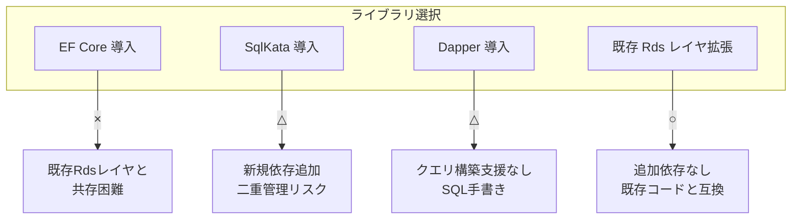
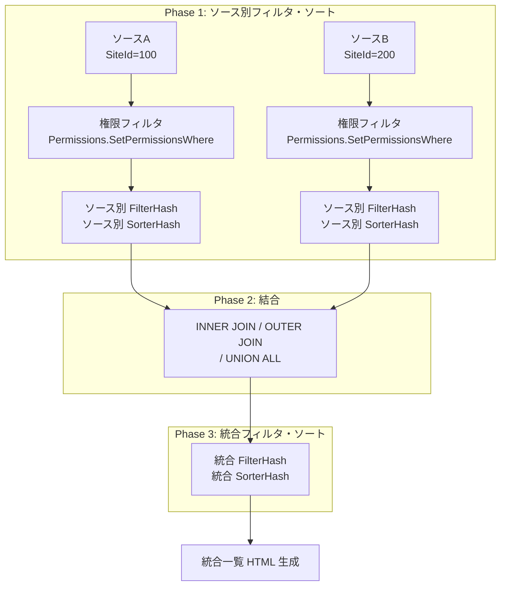
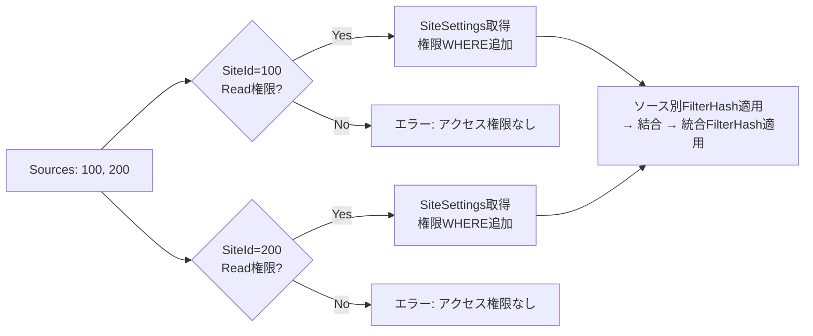
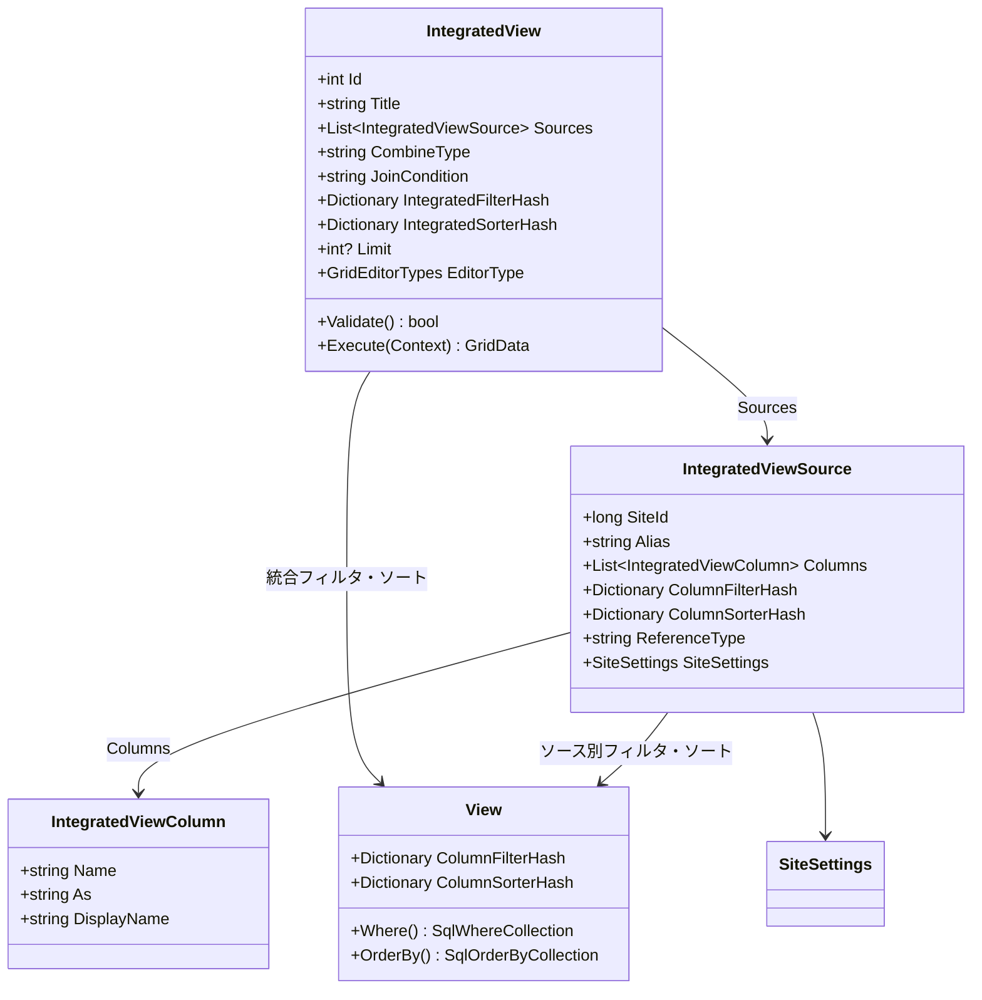
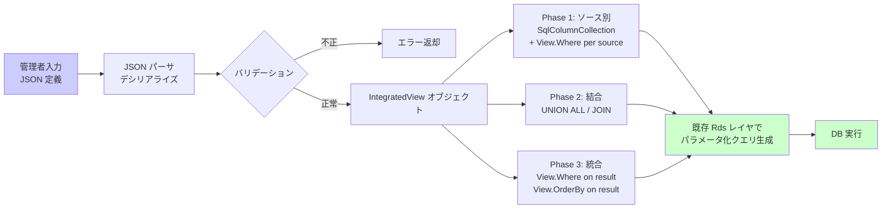
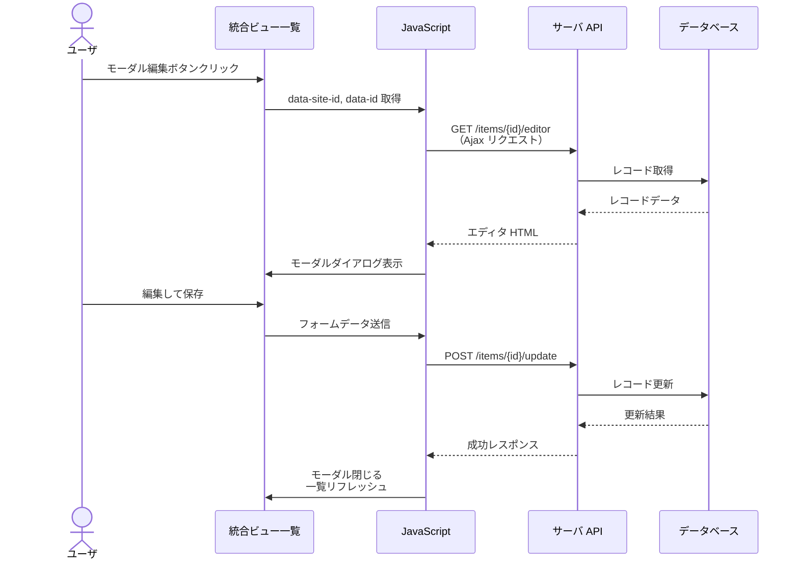
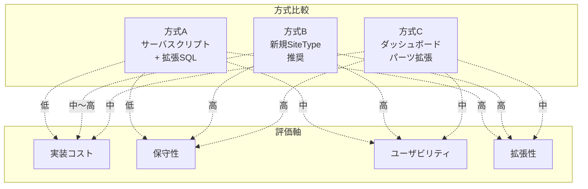
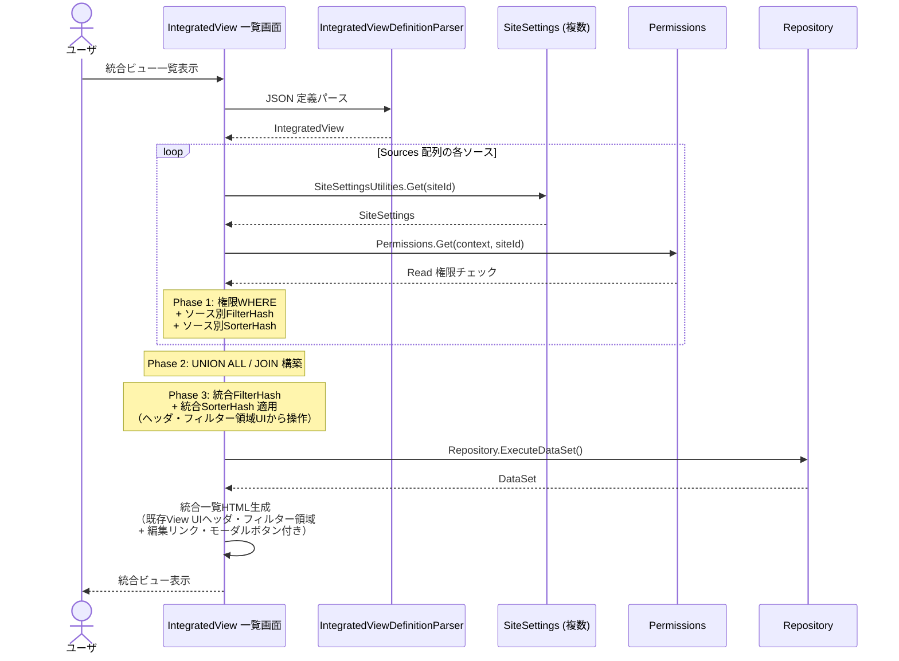

# 複数テーブル統合ビュー

複数のテーブル（Issues / Results）を横断して統合表示する「統合ビュー」機能の設計を行う。
JSON 定義形式でソーステーブル・カラム・結合方法を宣言的に記述し、
フィルタ・ソートは既存の一覧画面と同じ View UI（`ColumnFilterHash` / `ColumnSorterHash`）を
**ソース別（結合前）** と **統合結果（結合後）** の 2 段階で適用する。
各行から編集画面へのリンク・編集モーダルを提供する。

<!-- START doctoc generated TOC please keep comment here to allow auto update -->
<!-- DON'T EDIT THIS SECTION, INSTEAD RE-RUN doctoc TO UPDATE -->

- [調査情報](#調査情報)
- [調査目的](#調査目的)
- [既存機能の分析](#既存機能の分析)
    - [ダッシュボード Index パーツによる複数テーブル表示](#ダッシュボード-index-パーツによる複数テーブル表示)
    - [リンクカラム形式（チルダ構文）による JOIN](#リンクカラム形式チルダ構文による-join)
    - [GridData によるデータ取得](#griddata-によるデータ取得)
    - [権限フィルタリング](#権限フィルタリング)
    - [GridEditorType — 一覧画面の編集方式](#grideditortype--一覧画面の編集方式)
    - [ExtendedSql — 拡張 SQL 機構](#extendedsql--拡張-sql-機構)
    - [既存のフィルタ・ソート機構（View）](#既存のフィルタソート機構view)
- [クエリ構築ライブラリの検討](#クエリ構築ライブラリの検討)
    - [プリザンターの現行データアクセス層](#プリザンターの現行データアクセス層)
    - [ライブラリ候補の比較](#ライブラリ候補の比較)
    - [評価](#評価)
    - [推奨: 既存 Rds レイヤの拡張](#推奨-既存-rds-レイヤの拡張)
- [統合ビューの設計](#統合ビューの設計)
    - [設計方針](#設計方針)
    - [JSON 定義形式](#json-定義形式)
    - [内部アーキテクチャ](#内部アーキテクチャ)
    - [一覧画面の実装](#一覧画面の実装)
    - [編集画面リンクと編集モーダル](#編集画面リンクと編集モーダル)
    - [実装方式の比較](#実装方式の比較)
    - [推奨方式: 方式 B（新規 SiteType）](#推奨方式-方式-b新規-sitetype)
    - [改修対象ファイル一覧](#改修対象ファイル一覧)
    - [データフロー](#データフロー)
- [考慮事項](#考慮事項)
    - [パフォーマンス](#パフォーマンス)
    - [セキュリティ](#セキュリティ)
    - [既存機能との互換性](#既存機能との互換性)
- [結論](#結論)
- [関連ソースコード](#関連ソースコード)
- [関連ドキュメント](#関連ドキュメント)

<!-- END doctoc generated TOC please keep comment here to allow auto update -->

## 調査情報

| 調査日        | リポジトリ | ブランチ | タグ/バージョン    | コミット     | 備考     |
| ------------- | ---------- | -------- | ------------------ | ------------ | -------- |
| 2026年3月14日 | Pleasanter | main     | Pleasanter_1.5.2.0 | `c76832d69f` | 初回調査 |

## 調査目的

プリザンターでは 1 つのサイト（テーブル）に対して 1 つの一覧画面が対応しており、
複数テーブルのデータを横断的に統合表示する標準機能がない。
ダッシュボードの Index パーツは複数サイトのデータを並べて表示できるが、
テーブル間の JOIN やカラム選択の自由度は限定的である。

本調査では、複数テーブルを横断してデータを取得・統合表示する機能を設計する。要件は以下の通り。

| 要件                         | 説明                                                                                 |
| ---------------------------- | ------------------------------------------------------------------------------------ |
| 統合一覧表示                 | 複数テーブル（Issues / Results）のデータを 1 つの一覧画面に統合して表示する          |
| JSON 定義形式                | ソーステーブル・カラム・結合方法を JSON で宣言的に記述する                           |
| 2 段階フィルタ・ソート       | ソース別（結合前）と統合結果（結合後）の 2 段階で FilterHash / SorterHash を適用する |
| 既存フィルタ・ソート UI 流用 | フィルタとソートは既存の一覧画面と同じ View UI を使用する                            |
| 編集画面リンク               | 一覧の各行から元テーブルの編集画面へ遷移するリンクを表示する                         |
| 編集モーダル                 | 編集画面へ遷移せず、モーダルダイアログで編集操作を行える                             |
| 権限フィルタ自動適用         | 各ソーステーブルに対してユーザごとの権限フィルタを自動挿入する                       |

---

## 既存機能の分析

### ダッシュボード Index パーツによる複数テーブル表示

現行のプリザンターでは、ダッシュボードの Index パーツが最も近い既存機能である。

**ファイル**: `Implem.Pleasanter/Libraries/Settings/DashboardPart.cs`

```csharp
public class DashboardPart : ISettingListItem
{
    public DashboardPartType Type { get; set; }
    public string IndexSites { get; set; }          // 対象サイトID群
    public List<string> IndexSitesData { get; set; } // サイトデータ
    public string KambanSites { get; set; }          // カンバン用サイトID群
    public string CalendarSites { get; set; }        // カレンダー用サイトID群
}
```

| 比較項目         | ダッシュボード Index パーツ    | 統合ビュー（本設計）           |
| ---------------- | ------------------------------ | ------------------------------ |
| 複数テーブル表示 | ○（複数サイト指定可能）        | ○                              |
| カラム選択       | サイト設定のグリッド設定に依存 | JSON 定義で自由に指定          |
| テーブル間 JOIN  | ×                              | ○（UNION / JOIN 対応）         |
| フィルタ・ソート | View フィルタ経由              | 2 段階 FilterHash / SorterHash |
| 編集リンク       | ○（各行クリックで遷移）        | ○                              |
| 編集モーダル     | ×                              | ○                              |

### リンクカラム形式（チルダ構文）による JOIN

プリザンターは既にリンクカラム形式（チルダ構文）でテーブル間 JOIN をサポートしている。

**ファイル**: `Implem.Pleasanter/Libraries/Settings/ColumnNameInfo.cs`

```csharp
public class ColumnNameInfo
{
    public string ColumnName;   // 元のカラム名
    public string Name;         // 抽出されたカラム名
    public string TableAlias;   // テーブルエイリアス
    public long SiteId;         // 対象サイトID
    public bool Joined;         // JOIN カラムかどうか

    private void Set(string columnName)
    {
        ColumnName = columnName;
        if (columnName.Contains(","))
        {
            Name = columnName.Split(',').Skip(1).Join(string.Empty);
            TableAlias = columnName.Split_1st();
            SiteId = ColumnUtilities.GetSiteIdByTableAlias(TableAlias);
            Joined = true;
        }
        else
        {
            Name = columnName;
        }
    }
}
```

チルダ構文の基本パターン:

| 構文                    | 意味                                              |
| ----------------------- | ------------------------------------------------- |
| `ClassA~200`            | ClassA カラムで SiteId=200 の親テーブルへ JOIN    |
| `ClassA~~200`           | ClassA カラムで SiteId=200 の子テーブルへ JOIN    |
| `ClassA~200-ClassB~300` | 200 経由で 300 へ多段 JOIN                        |
| `ClassA~200,Status`     | SiteId=200 の Status カラムを参照（カンマ区切り） |

ただし、チルダ構文はリンクカラムの定義に基づく JOIN のみをサポートし、任意のテーブル間で自由な結合条件を指定する仕組みではない。

### GridData によるデータ取得

一覧画面のデータ取得は `GridData` クラスが担う。

**ファイル**: `Implem.Pleasanter/Libraries/Models/GridData.cs`（行番号: 55-150）

```csharp
private void Get(
    Context context,
    SiteSettings ss,
    View view,
    Sqls.TableTypes tableType = Sqls.TableTypes.Normal,
    SqlColumnCollection column = null,
    SqlJoinCollection join = null,
    SqlWhereCollection where = null,
    int top = 0,
    int offset = 0,
    int pageSize = 0,
    bool count = true)
{
    var gridColumns = ss.GetGridColumns(context, view, includedColumns: true);
    column = column ?? ColumnUtilities.SqlColumnCollection(
        context: context, ss: ss, view: view, columns: gridColumns);
    where = view.Where(context: context, ss: ss, where: where);
    var orderBy = view.OrderBy(context: context, ss: ss);
    join = join ?? ss.Join(
        context: context,
        join: new IJoin[] { column, where, orderBy });
    var statements = new List<SqlStatement> {
        Rds.Select(
            tableName: ss.ReferenceType,
            tableType: tableType,
            dataTableName: "Main",
            column: column,
            join: join,
            where: where,
            orderBy: orderBy,
            top: top,
            offset: offset,
            pageSize: pageSize)
    };
    // ...
}
```

### 権限フィルタリング

`View.Where()` 内で `Permissions.SetPermissionsWhere()` が呼ばれ、テナント ID・サイト ID・レコード単位の権限フィルタが WHERE 句に追加される。

**ファイル**: `Implem.Pleasanter/Libraries/Settings/View.cs`（行番号: 1838-1884）

```csharp
public SqlWhereCollection Where(
    Context context,
    SiteSettings ss,
    SqlWhereCollection where = null,
    bool checkPermission = true,
    bool itemJoin = true,
    bool requestSearchCondition = true)
{
    if (where == null) where = new SqlWhereCollection();
    SetGeneralsWhere(context, ss, where);
    SetColumnsWhere(context, ss, where);
    SetSearchWhere(context, ss, where);
    Permissions.SetPermissionsWhere(
        context: context,
        ss: ss,
        where: where,
        checkPermission: checkPermission);
    return where;
}
```

### GridEditorType — 一覧画面の編集方式

**ファイル**: `Implem.Pleasanter/Libraries/Settings/SiteSettings.cs`（行番号: 29-34, 172）

```csharp
public enum GridEditorTypes : int
{
    None = 0,
    Grid = 10,      // インライン編集
    Dialog = 20     // モーダルダイアログ編集
}

public GridEditorTypes? GridEditorType;
```

- `Grid`: 一覧画面上でインライン編集
- `Dialog`: モーダルダイアログで編集

### ExtendedSql — 拡張 SQL 機構

**ファイル**: `Implem.Pleasanter/Implem.ParameterAccessor/Parts/ExtendedSql.cs`

```csharp
public class ExtendedSql : ExtendedBase
{
    public bool OnSelectingWhere;              // WHERE 句拡張
    public bool OnSelectingOrderBy;            // ORDER BY 句拡張
    public bool OnSelectingColumn;             // SELECT 句拡張
    public string CommandText;                 // 生 SQL
    public string DbUser;                      // 実行ユーザ
    public List<string> OnSelectingWhereParams;

    public string ReplacedCommandText(
        long siteId, long id, DateTime? timestamp,
        Dictionary<string, string> columnPlaceholders = null)
    {
        var commandText = CommandText
            .Replace("{{SiteId}}", siteId.ToString())
            .Replace("{{Id}}", id.ToString());
        // ...
    }
}
```

拡張 SQL はパラメータファイルで定義し、既存クエリの WHERE / ORDER BY / SELECT 句を拡張できる。ただし、FROM 句（テーブル指定）の変更や UNION クエリの構築は対象外である。

### 既存のフィルタ・ソート機構（View）

統合ビューのフィルタとソートは、既存の一覧画面と同じ UI・仕組みを流用する。
View クラスの `ColumnFilterHash` / `ColumnSorterHash` が
既存一覧のフィルタ・ソートの中核である。

**ファイル**: `Implem.Pleasanter/Libraries/Settings/View.cs`

```csharp
public class View
{
    // フィルタ設定
    public Dictionary<string, string> ColumnFilterHash;
    public Dictionary<string, string> ColumnFilterExpressions;
    public Dictionary<string, Column.SearchTypes> ColumnFilterSearchTypes;
    public List<string> ColumnFilterNegatives;
    public string Search;

    // ソート設定
    public Dictionary<string, SqlOrderBy.Types> ColumnSorterHash;
}
```

| プロパティ                | 型                                       | 説明                              |
| ------------------------- | ---------------------------------------- | --------------------------------- |
| `ColumnFilterHash`        | `Dictionary<string, string>`             | カラム名 → フィルタ値             |
| `ColumnFilterSearchTypes` | `Dictionary<string, Column.SearchTypes>` | カラム名 → 検索種別（完全一致等） |
| `ColumnSorterHash`        | `Dictionary<string, SqlOrderBy.Types>`   | カラム名 → ASC/DESC               |

`View.Where()` がこれらの設定を `SqlWhereCollection` に変換し、
`View.OrderBy()` が `SqlOrderByCollection` に変換する。
統合ビューでもこの仕組みをそのまま利用することで、
ユーザは既存の一覧画面と同じフィルタ・ソート UI を操作できる。

---

## クエリ構築ライブラリの検討

統合ビューのクエリ構築において、EF Core やその他のライブラリを
活用できるか検討する。

### プリザンターの現行データアクセス層

プリザンターは **EF Core を使用していない**。
独自の Rds（Relational Database System）抽象レイヤで
ADO.NET を直接操作している。

| ライブラリ                 | バージョン | 用途       |
| -------------------------- | ---------- | ---------- |
| `Microsoft.Data.SqlClient` | 6.1.3      | SQL Server |
| `Npgsql`                   | 10.0.0     | PostgreSQL |
| `MySqlConnector`           | 2.5.0      | MySQL      |

EF Core、Dapper、SqlKata 等の ORM / クエリビルダは一切参照されていない。

**Rds レイヤの構造**:

```
Rds/
├── Implem.IRds/           （インタフェース）
│   ├── ISqlCommand.cs
│   ├── ISqlCommandText.cs
│   ├── ISqlObjectFactory.cs
│   └── ISqls.cs
├── Implem.SqlServer/      （SQL Server 実装）
├── Implem.PostgreSql/     （PostgreSQL 実装）
└── Implem.MySql/          （MySQL 実装）

Implem.Libraries/DataSources/SqlServer/
├── SqlSelect.cs           （SELECT ビルダ）
├── SqlWhere.cs            （WHERE ビルダ）
├── SqlOrderBy.cs          （ORDER BY ビルダ）
├── SqlJoin.cs             （JOIN ビルダ）
└── SqlStatement.cs        （SQL 文基底クラス）
```

### ライブラリ候補の比較

| ライブラリ          | 概要                   | メリット                                             | デメリット                                          |
| ------------------- | ---------------------- | ---------------------------------------------------- | --------------------------------------------------- |
| **EF Core**         | Microsoft 公式 ORM     | LINQ で型安全なクエリ、マイグレーション管理          | 既存 Rds レイヤと共存が困難、DbContext 導入コスト大 |
| **SqlKata**         | Fluent クエリビルダ    | SQL 方言自動変換、UNION/JOIN 対応、軽量              | 新規依存追加、Rds レイヤとの二重管理リスク          |
| **Dapper**          | Micro ORM              | 生 SQL + オブジェクトマッピング、軽量                | クエリ構築支援なし（SQL は手書き）                  |
| **既存 Rds レイヤ** | プリザンター独自ビルダ | 追加依存なし、3DB 方言対応済み、既存コードと完全互換 | UNION 未対応、統合ビュー用の拡張が必要              |

### 評価



**EF Core** は最も強力だが、プリザンターの Rds レイヤ全体を
置き換えない限り共存が難しい。
統合ビューのためだけに DbContext を導入すると、
データアクセスの二重管理が発生する。

**SqlKata** は UNION / JOIN を含む複雑なクエリを
Fluent API で構築でき、SQL 方言の自動変換もサポートする。
既存 Rds レイヤと並行利用が可能だが、
新規 NuGet 依存の追加と二重管理のリスクがある。

```csharp
// SqlKata での UNION ALL 構築例
var query1 = new Query("Issues")
    .Select("IssueId as Id", "Title", "Status")
    .Where("SiteId", 100)
    .Where("Status", "<>", 900);
var query2 = new Query("Results")
    .Select("ResultId as Id", "Title", "Status")
    .Where("SiteId", 200);
var union = query1.UnionAll(query2).OrderBy("Title");
```

**既存 Rds レイヤの拡張** は追加依存が不要で、
既存の `SqlSelect` / `SqlWhere` / `SqlOrderBy` と完全互換である。
UNION ALL 用の `SqlUnion` クラスを追加するだけで対応可能であり、
3DB 方言（SQL Server / PostgreSQL / MySQL）の対応も
既存の `ISqlCommandText` パターンで統一できる。

### 推奨: 既存 Rds レイヤの拡張

以下の理由から、既存 Rds レイヤの拡張を推奨する。

1. **依存追加なし**: 新規 NuGet パッケージの追加が不要
2. **既存互換**: `SqlColumnCollection` / `SqlWhereCollection` /
   `SqlOrderByCollection` をそのまま利用可能
3. **View 統合**: 既存の `View.Where()` / `View.OrderBy()` が
   生成する SQL コレクションをそのまま統合クエリに注入可能
4. **3DB 方言対応**: `ISqlCommandText` パターンにより
   SQL Server / PostgreSQL / MySQL を統一的にサポート

ただし、将来的にクエリの複雑性が増す場合は SqlKata の導入を
再検討する余地がある。

---

## 統合ビューの設計

### 設計方針

統合ビューは新しい SiteType `IntegratedView` として実装し、
既存の GridData / View アーキテクチャを拡張する形で設計する。

**定義形式は JSON を採用し、フィルタ・ソートは 2 段階で適用する。**

1. **ソース別（結合前）**: 各ソーステーブルに対して
   権限フィルタ + ソース別 `ColumnFilterHash` / `ColumnSorterHash` を適用
2. **結合**: INNER JOIN / OUTER JOIN / UNION ALL で結合
3. **統合結果（結合後）**: 結合結果に対して
   統合 `ColumnFilterHash` / `ColumnSorterHash` を適用



### JSON 定義形式

統合ビューの定義は JSON 形式で記述する。
設定 UI・API でのデータ交換は JSON を使用する。

#### 基本構造

```json
{
    "Title": "課題・成果物統合ビュー",
    "Sources": [
        {
            "SiteId": 100,
            "Alias": "a",
            "Columns": [
                { "Name": "IssueId", "As": "Id" },
                { "Name": "Title" },
                { "Name": "Status" },
                { "Name": "ClassA", "As": "Category" }
            ],
            "ColumnFilterHash": {
                "Status": "[\"100\",\"200\",\"300\"]"
            },
            "ColumnSorterHash": {
                "UpdatedTime": "desc"
            }
        },
        {
            "SiteId": 200,
            "Alias": "b",
            "Columns": [
                { "Name": "ResultId", "As": "Id" },
                { "Name": "Title" },
                { "Name": "Status" },
                { "Name": "ClassA", "As": "Category" }
            ],
            "ColumnFilterHash": {
                "Status": "[\"100\",\"200\"]"
            },
            "ColumnSorterHash": {}
        }
    ],
    "CombineType": "UnionAll",
    "JoinCondition": null,
    "IntegratedFilterHash": {
        "Category": "インフラ"
    },
    "IntegratedSorterHash": {
        "Title": "asc"
    },
    "Limit": 100
}
```

#### JSON プロパティ一覧

| プロパティ                   | 型           | 説明                                       |
| ---------------------------- | ------------ | ------------------------------------------ |
| `Title`                      | `string`     | 統合ビューの表示名                         |
| `Sources`                    | `Source[]`   | ソーステーブル定義の配列                   |
| `Sources[].SiteId`           | `long`       | ソーステーブルのサイト ID                  |
| `Sources[].Alias`            | `string`     | エイリアス（JOIN 時の識別用）              |
| `Sources[].Columns`          | `Column[]`   | 取得カラム定義                             |
| `Sources[].Columns[].Name`   | `string`     | プリザンターのカラム名                     |
| `Sources[].Columns[].As`     | `string?`    | 表示別名（統合結果のカラム名）             |
| `Sources[].ColumnFilterHash` | `Dictionary` | **ソース別フィルタ**（結合前に適用）       |
| `Sources[].ColumnSorterHash` | `Dictionary` | **ソース別ソート**（結合前に適用）         |
| `CombineType`                | `string`     | `UnionAll` / `InnerJoin` / `LeftOuterJoin` |
| `JoinCondition`              | `string?`    | JOIN 条件（`a.ClassA = b.ResultId` 等）    |
| `IntegratedFilterHash`       | `Dictionary` | **統合フィルタ**（結合後に適用）           |
| `IntegratedSorterHash`       | `Dictionary` | **統合ソート**（結合後に適用）             |
| `Limit`                      | `int?`       | 取得件数上限                               |

#### 2 段階フィルタ・ソートの詳細

統合ビューではフィルタとソートを **2 段階** で適用する。
どちらも既存の `ColumnFilterHash` / `ColumnSorterHash` と
同じデータ構造・UI を使用する。

```mermaid
flowchart TB
    subgraph ソースA（SiteId=100）
        A1[全レコード] --> A2[権限フィルタ<br/>Permissions.SetPermissionsWhere]
        A2 --> A3[ソース別 FilterHash<br/>Status: 進行中のみ]
        A3 --> A4[ソース別 SorterHash<br/>UpdatedTime DESC]
    end

    subgraph ソースB（SiteId=200）
        B1[全レコード] --> B2[権限フィルタ<br/>Permissions.SetPermissionsWhere]
        B2 --> B3[ソース別 FilterHash<br/>Status: 完了以外]
        B3 --> B4[ソース別 SorterHash]
    end

    subgraph 結合
        C[UNION ALL / JOIN]
    end

    subgraph 統合フィルタ・ソート
        D1[統合 FilterHash<br/>Category = インフラ]
        D2[統合 SorterHash<br/>Title ASC]
    end

    A4 --> C
    B4 --> C
    C --> D1 --> D2 --> E[統合一覧表示]
```

| 段階                | 対象             | FilterHash の適用先      | SorterHash の適用先      |
| ------------------- | ---------------- | ------------------------ | ------------------------ |
| Phase 1（ソース別） | 各ソーステーブル | ソーステーブルの実カラム | ソーステーブルの実カラム |
| Phase 2（統合）     | 結合結果         | `AS` 別名カラム          | `AS` 別名カラム          |

**Phase 1（ソース別）** では、各ソーステーブルの
`SiteSettings` に基づくカラム定義でフィルタ・ソートを適用する。
権限フィルタ（`Permissions.SetPermissionsWhere`）も
このフェーズで自動挿入される。
ユーザは既存の一覧画面と同じフィルタ UI で
ソースごとの絞り込み条件を設定できる。

**Phase 2（統合）** では、結合後の統合カラム
（`AS` 別名で定義された仮想カラム）に対して
フィルタ・ソートを適用する。
ユーザは統合一覧の画面上で既存の View フィルタ・ソート UI を
そのまま操作でき、セッション保持や
フィルタ表示/非表示切り替え等の既存機能も自動適用される。

#### UNION 形式の JSON 定義例

```json
{
    "Title": "課題・成果物統合",
    "Sources": [
        {
            "SiteId": 100,
            "Columns": [
                { "Name": "IssueId", "As": "Id" },
                { "Name": "Title" },
                { "Name": "Status" },
                { "Name": "ClassA", "As": "Category" }
            ],
            "ColumnFilterHash": {
                "Status": "[\"100\",\"200\",\"300\"]"
            },
            "ColumnSorterHash": {}
        },
        {
            "SiteId": 200,
            "Columns": [
                { "Name": "ResultId", "As": "Id" },
                { "Name": "Title" },
                { "Name": "Status" },
                { "Name": "ClassA", "As": "Category" }
            ],
            "ColumnFilterHash": {},
            "ColumnSorterHash": {}
        }
    ],
    "CombineType": "UnionAll",
    "IntegratedFilterHash": {},
    "IntegratedSorterHash": { "Title": "asc" },
    "Limit": 100
}
```

上記 JSON は SQL に展開すると以下と等価になる:

```sql
-- Phase 1: ソース別フィルタ適用済みの各テーブル
(SELECT IssueId AS Id, Title, Status, ClassA AS Category
 FROM Issues
 WHERE /* 権限WHERE */ AND Status IN (100, 200, 300))

UNION ALL

(SELECT ResultId AS Id, Title, Status, ClassA AS Category
 FROM Results
 WHERE /* 権限WHERE */)

-- Phase 2: 統合ソート
ORDER BY Title ASC
LIMIT 100
```

#### JOIN 形式の JSON 定義例

```json
{
    "Title": "課題-成果物結合",
    "Sources": [
        {
            "SiteId": 100,
            "Alias": "a",
            "Columns": [
                { "Name": "IssueId", "As": "Id" },
                { "Name": "Title", "As": "IssueTitle" },
                { "Name": "Status" }
            ],
            "ColumnFilterHash": {
                "Status": "[\"100\",\"200\",\"300\"]"
            },
            "ColumnSorterHash": {}
        },
        {
            "SiteId": 200,
            "Alias": "b",
            "Columns": [{ "Name": "Title", "As": "ResultTitle" }],
            "ColumnFilterHash": {},
            "ColumnSorterHash": {}
        }
    ],
    "CombineType": "InnerJoin",
    "JoinCondition": "a.ClassA = b.ResultId",
    "IntegratedFilterHash": {},
    "IntegratedSorterHash": { "IssueTitle": "asc" },
    "Limit": 50
}
```

#### 既存 View UI との統合

フィルタとソートは既存の View 機構をそのまま利用する。
2 段階のフィルタ・ソートそれぞれで同じ UI コンポーネントを使用する。

**統合フィルタ・ソート（Phase 3）は、既存の Results / Issues 一覧と同じ
カラムヘッダのフィルタ入力欄・ソートクリック・フィルター領域から操作する。**
新規 SiteType `IntegratedView` の一覧画面に既存の View フィルタ・ソート UI を
そのまま組み込むことで、ユーザは通常の一覧操作と同じ体験で統合結果を絞り込める。

```mermaid
flowchart LR
    subgraph ソース別設定（JSON定義で事前設定）
        A1[ソースA フィルタ] --> B1[Sources.0.ColumnFilterHash]
        A2[ソースA ソート] --> B2[Sources.0.ColumnSorterHash]
        A3[ソースB フィルタ] --> B3[Sources.1.ColumnFilterHash]
        A4[ソースB ソート] --> B4[Sources.1.ColumnSorterHash]
    end

    subgraph 統合一覧画面（既存UIで操作）
        C1[カラムヘッダ<br/>フィルタ入力欄] --> D1[IntegratedFilterHash]
        C2[カラムヘッダ<br/>ソートクリック] --> D2[IntegratedSorterHash]
        C3[フィルター領域<br/>FiltersDisplayType] --> D1
    end

    B1 --> E[View.Where per source]
    B2 --> F[View.OrderBy per source]
    B3 --> E
    B4 --> F
    D1 --> G[View.Where on result]
    D2 --> H[View.OrderBy on result]
```

| 操作                | ソース別フィルタ・ソート | 統合フィルタ・ソート                                             |
| ------------------- | ------------------------ | ---------------------------------------------------------------- |
| フィルタ設定        | JSON 定義で事前設定      | **一覧画面のカラムヘッダ入力欄**（既存 Results / Issues と同じ） |
| フィルタ検索種別    | 完全一致/部分一致 等     | 完全一致/部分一致 等                                             |
| ソート設定          | JSON 定義で事前設定      | **カラムヘッダクリック**（既存 Results / Issues と同じ）         |
| フィルタ状態の保持  | JSON 定義に永続化        | View セッション保存（既存機能）                                  |
| フィルタ表示/非表示 | —                        | **FiltersDisplayType**（既存 Results / Issues と同じ）           |
| フィルター領域      | —                        | **一覧上部のフィルター領域**（既存 Results / Issues と同じ）     |

#### ソーステーブルの権限チェック

`Sources` 配列で指定される各サイト ID は、統合ビュー実行時に以下の権限チェックが自動適用される。



各ソーステーブルに対して、現行の `Permissions.SetPermissionsWhere()` と同じロジックで権限フィルタが自動挿入される。

---

### 内部アーキテクチャ

#### クラス構成



#### SiteSettings への統合

統合ビューの JSON 定義は `SiteSettings` に格納する。既存の `Views` コレクションと並列に `IntegratedViews` を追加する。

**追加プロパティ案（`SiteSettings.cs`）**:

```csharp
public class SiteSettings
{
    // 既存プロパティ
    public List<View> Views;
    public GridEditorTypes? GridEditorType;

    // 追加プロパティ
    public List<IntegratedView> IntegratedViews;
}

public class IntegratedView
{
    public int Id;
    public string Title;
    public List<IntegratedViewSource> Sources;
    public string CombineType;           // UnionAll / InnerJoin / LeftOuterJoin
    public string JoinCondition;         // JOIN 条件式
    public Dictionary<string, string> IntegratedFilterHash;   // 統合フィルタ
    public Dictionary<string, SqlOrderBy.Types> IntegratedSorterHash; // 統合ソート
    public int? Limit;
    public GridEditorTypes EditorType;
}

public class IntegratedViewSource
{
    public long SiteId;
    public string Alias;
    public List<IntegratedViewColumn> Columns;
    public Dictionary<string, string> ColumnFilterHash;       // ソース別フィルタ
    public Dictionary<string, SqlOrderBy.Types> ColumnSorterHash; // ソース別ソート
}

public class IntegratedViewColumn
{
    public string Name;  // プリザンターのカラム名
    public string As;    // 表示別名（統合結果のカラム名）
}
```

#### パーサの実装方針

JSON 定義が正式な設定形式であるため、パース処理は
`System.Text.Json` による JSON デシリアライズで行う。

```csharp
public class IntegratedViewDefinitionParser
{
    /// <summary>JSON 定義から IntegratedView を生成</summary>
    public IntegratedView ParseJson(string json)
    {
        return JsonSerializer.Deserialize<IntegratedView>(json);
    }
}
```

#### SQL インジェクション対策

JSON 定義形式ではユーザ入力を構造化データとして受け取るため、
生 SQL が直接実行されるリスクは低い。
各プロパティ値は既存 Rds レイヤの `SqlColumnCollection` を経由して
パラメータ化クエリに変換される。



| 対策項目                 | 方法                                                           |
| ------------------------ | -------------------------------------------------------------- |
| SQL インジェクション防止 | JSON 構造化データ → 既存 Rds レイヤで SQL 生成                 |
| フィルタ・ソート         | ソース別・統合の各 FilterHash/SorterHash は View 機構経由      |
| テーブル参照制限         | `Sources[].SiteId` を `SiteSettingsUtilities.Get()` で検証     |
| カラム参照制限           | `Columns[].Name` を `SiteSettings.ColumnDefinitionHash` で検証 |
| JOIN 条件の検証          | `JoinCondition` はカラム名参照のみ許可（関数・サブクエリ禁止） |
| 権限チェック             | 各ソースに対して `Permissions.Get()` で Read 権限を確認        |

---

### 一覧画面の実装

#### UNION 形式のクエリ生成

UNION 形式では、各ソースに対して Phase 1（権限フィルタ + ソース別フィルタ・ソート）
を適用した `SqlStatement` を生成し、`UNION ALL` で結合後、
Phase 2（統合フィルタ・ソート）を適用する。

```csharp
public SqlStatement ToUnionSqlStatement(Context context)
{
    var unionStatements = new List<SqlStatement>();

    // Phase 1: ソース別フィルタ・ソート
    foreach (var source in Sources)
    {
        var ss = SiteSettingsUtilities.Get(
            context: context, siteId: source.SiteId);
        var column = new SqlColumnCollection();
        foreach (var col in source.Columns)
        {
            column.Add(new SqlColumn(
                columnBracket: $"\"{col.Name}\"",
                tableName: ss.ReferenceType,
                _as: col.As ?? col.Name));
        }
        // 編集リンク用の隠しカラム追加
        column.Add(new SqlColumn(
            columnBracket: "\"SiteId\"",
            tableName: ss.ReferenceType,
            _as: "_SourceSiteId"));
        column.Add(new SqlColumn(
            columnBracket: $"\"{Rds.IdColumn(ss.ReferenceType)}\"",
            tableName: ss.ReferenceType,
            _as: "_SourceId"));

        // 権限 WHERE 自動追加
        var where = new SqlWhereCollection();
        Permissions.SetPermissionsWhere(
            context: context, ss: ss, where: where);

        // ソース別 ColumnFilterHash を View.Where() で適用
        var sourceView = new View {
            ColumnFilterHash = source.ColumnFilterHash
        };
        sourceView.Where(context: context, ss: ss, where: where);

        // ソース別 ColumnSorterHash を View.OrderBy() で適用
        var sourceOrderBy = new View {
            ColumnSorterHash = source.ColumnSorterHash
        };

        unionStatements.Add(Rds.Select(
            tableName: ss.ReferenceType,
            column: column,
            where: where,
            orderBy: sourceOrderBy.OrderBy(
                context: context, ss: ss)));
    }

    // Phase 2: UNION ALL で結合
    var unionSql = Rds.Union(unionStatements);

    // Phase 2: 統合 FilterHash / SorterHash を適用
    var integratedView = new View {
        ColumnFilterHash = IntegratedFilterHash,
        ColumnSorterHash = IntegratedSorterHash
    };
    // 統合フィルタは結合結果の AS 別名カラムに対して適用
    // 統合ソートは結合結果全体に対して適用
    return unionSql;
}
```

#### 一覧画面の HTML 構造

統合ビューの一覧は既存の `GridData` の HTML 構造を流用し、追加で元テーブルの識別情報と編集リンクを含める。

```html
<table class="grid integrated-view">
    <thead>
        <tr>
            <th class="iv-source">テーブル</th>
            <th>タイトル</th>
            <th>状態</th>
            <th>カテゴリ</th>
            <th class="iv-actions">操作</th>
        </tr>
    </thead>
    <tbody>
        <tr data-source-site-id="100" data-source-id="1">
            <td class="iv-source">
                <span class="iv-badge issues">課題管理</span>
            </td>
            <td>サーバ移行作業</td>
            <td>進行中</td>
            <td>インフラ</td>
            <td class="iv-actions">
                <a href="/items/1/edit" class="iv-edit-link" title="編集画面を開く">
                    <span class="iv-icon edit"></span>
                </a>
                <button
                    class="iv-edit-modal"
                    data-action="EditDialog"
                    data-site-id="100"
                    data-id="1"
                    title="モーダルで編集"
                >
                    <span class="iv-icon modal"></span>
                </button>
            </td>
        </tr>
        <tr data-source-site-id="200" data-source-id="5">
            <td class="iv-source">
                <span class="iv-badge results">成果物</span>
            </td>
            <td>移行手順書</td>
            <td>完了</td>
            <td>ドキュメント</td>
            <td class="iv-actions">
                <a href="/items/5/edit" class="iv-edit-link" title="編集画面を開く">
                    <span class="iv-icon edit"></span>
                </a>
                <button
                    class="iv-edit-modal"
                    data-action="EditDialog"
                    data-site-id="200"
                    data-id="5"
                    title="モーダルで編集"
                >
                    <span class="iv-icon modal"></span>
                </button>
            </td>
        </tr>
    </tbody>
</table>
```

---

### 編集画面リンクと編集モーダル

#### 編集画面リンクの実装

統合ビューの各行には元テーブルの `SiteId` と `ReferenceId` が保持されている。編集リンクは `Items` テーブルのルーティングを利用して生成する。

**ファイル**: `Implem.Pleasanter/Models/Items/ItemModel.cs`

```csharp
// ItemModel はReferenceType に基づいて適切なモデルにルーティング
public long ReferenceId = 0;
public string ReferenceType = string.Empty;
public long SiteId = 0;
```

編集リンクの URL は `/items/{ReferenceId}/edit` 形式で、
`ItemModel.SetSite()` により適切な `SiteSettings` が解決される。
統合ビューでは `_SourceId` 隠しカラムの値を使って URL を生成する。

```csharp
public static string EditUrl(long sourceId)
{
    return $"/items/{sourceId}/edit";
}
```

#### 編集モーダルの実装

編集モーダルは既存の `GridEditorTypes.Dialog` の仕組みを流用する。

**ファイル**: `Implem.Pleasanter/Libraries/Settings/SiteSettings.cs`（行番号: 29-34）

```csharp
public enum GridEditorTypes : int
{
    None = 0,
    Grid = 10,      // インライン編集
    Dialog = 20     // モーダルダイアログ編集
}
```

統合ビューのモーダル編集では、クリックされた行の `data-site-id` と `data-id` を使って、Ajax で該当レコードのエディタフォームを取得し、モーダルダイアログ内に表示する。



#### モーダル表示の JavaScript 実装方針

```javascript
// 統合ビュー用モーダル編集
$('.iv-edit-modal').on('click', function () {
    var siteId = $(this).data('site-id');
    var id = $(this).data('id');
    $.ajax({
        url: '/items/' + id + '/editor',
        type: 'GET',
        success: function (html) {
            // 既存の EditorDialog 機構を流用
            $('#EditorDialog').html(html);
            $('#EditorDialog').dialog({
                modal: true,
                width: '80%',
                close: function () {
                    // 一覧リフレッシュ
                    refreshIntegratedView();
                },
            });
        },
    });
});
```

---

### 実装方式の比較

統合ビューの実装方式として 3 つの選択肢を検討する。

#### 方式 A: サーバスクリプト + 拡張 SQL

既存の拡張 SQL（`ExtendedSql`）とサーバスクリプトを組み合わせて実装する。

| 項目         | 内容                                                 |
| ------------ | ---------------------------------------------------- |
| 仕組み       | ExtendedSql の CommandText に UNION ALL クエリを記述 |
| 設定方法     | Parameters/ExtendedSqls/ にJSON ファイルを配置       |
| 権限チェック | `OnSelectingWhere` フックで権限 WHERE を挿入         |
| カスタム性   | SQL を直接記述するため自由度が高い                   |
| メンテ性     | JSON ファイルの管理が煩雑になりやすい                |

```json
{
    "Name": "IntegratedView_TaskAndResult",
    "OnSelectingColumn": true,
    "CommandText": "SELECT IssueId AS Id, Title, Status, SiteId AS _SourceSiteId FROM Issues WHERE SiteId = {{SiteId}} AND Status <> 900 UNION ALL SELECT ResultId AS Id, Title, Status, SiteId AS _SourceSiteId FROM Results WHERE SiteId IN (200, 201) AND Status <> 900"
}
```

#### 方式 B: 新規 SiteType「IntegratedView」（推奨）

プリザンターの SiteType に `IntegratedView` を追加し、専用の管理画面を持たせる。

| 項目           | 内容                                                                        |
| -------------- | --------------------------------------------------------------------------- |
| 仕組み         | Sites テーブルに `ReferenceType = 'IntegratedView'` を追加                  |
| 設定方法       | サイト設定画面に統合ビュー専用タブを追加                                    |
| 権限チェック   | 既存の SiteSettings 権限機構をそのまま利用                                  |
| 定義形式       | JSON 定義                                                                   |
| フィルタ       | 2 段階: ソース別 + 統合（既存 View UI 流用）                                |
| 統合フィルタUI | **既存の一覧ヘッダ・フィルター領域から操作**（Results / Issues と同じ体験） |
| ソート         | 2 段階: ソース別 + 統合（既存 View UI 流用）                                |
| メンテ性       | SiteSettings と統合されるため管理しやすい                                   |

#### 方式 C: ダッシュボードパーツ拡張

既存のダッシュボード機構に「統合ビュー」パーツを追加する。

| 項目         | 内容                                           |
| ------------ | ---------------------------------------------- |
| 仕組み       | `DashboardPartType` に `IntegratedView` を追加 |
| 設定方法     | ダッシュボード設定画面でパーツとして追加       |
| 権限チェック | 既存のダッシュボード権限機構を流用             |
| 定義形式     | JSON 定義                                      |
| フィルタ     | 2 段階: ソース別 + 統合（既存 View UI 流用）   |
| ソート       | 2 段階: ソース別 + 統合（既存 View UI 流用）   |
| メンテ性     | 既存のダッシュボード UI / API と統合           |



#### 方式比較表

| 評価軸           | 方式 A（拡張 SQL）  | 方式 B（新規 SiteType）        | 方式 C（ダッシュボード拡張） |
| ---------------- | ------------------- | ------------------------------ | ---------------------------- |
| 実装コスト       | ◎ 低い              | ○ 中〜高                       | ○ 中程度                     |
| 保守性           | △ JSON ファイル散在 | ◎ SiteSettings 統合            | ○ ダッシュボード統合         |
| UI 操作性        | △ JSON 手動編集     | ◎ 専用 UI + 既存ヘッダUI流用   | ○ ダッシュボード UI 流用     |
| 権限制御         | △ 手動実装          | ◎ 既存機構流用                 | ○ 既存機構流用               |
| フィルタ・ソート | △ SQL 手書き        | ◎ 2 段階 FilterHash + ヘッダUI | ○ 2 段階 FilterHash 対応     |
| 編集モーダル     | △ 別途実装          | ○ 組み込み可能                 | ○ 組み込み可能               |
| 拡張性           | ◎ SQL 自由度高い    | ◎ 将来拡張容易                 | ○ パーツ追加容易             |
| 学習コスト       | △ SQL 知識必要      | ◎ GUI 操作                     | ○ JSON 定義 + 既存 UI        |

---

### 推奨方式: 方式 B（新規 SiteType）

以下の理由から方式 B を推奨する。

1. **独立した SiteType**: `ReferenceType = 'IntegratedView'` として Sites テーブルに登録し、専用の一覧画面・設定画面を持たせることで、既存の Issues / Results と同列の扱いが可能
2. **既存 View UI の完全流用**: 新規 SiteType の一覧画面に既存の View フィルタ・ソート UI
   （カラムヘッダのフィルタ入力欄・ソートクリック・フィルター領域）をそのまま組み込み、
   統合フィルタ・ソートを既存の Results / Issues と同じ体験で操作可能
3. **2 段階フィルタ・ソート**: ソース別は JSON 定義で事前設定、統合は既存のヘッダ・フィルター領域 UI から操作。既存の `ColumnFilterHash` / `ColumnSorterHash` を両フェーズで適用
4. **権限機構の自然な統合**: SiteSettings の権限機構をそのまま利用でき、統合ビュー自体の閲覧・編集権限も既存の仕組みで管理可能
5. **JSON 定義**: 宣言的な JSON 形式で定義を管理でき、API 経由の設定変更や版管理が容易
6. **段階的実装**: 最初は UNION 形式のみ実装し、後から JOIN 形式を追加するなど段階的な拡張が可能
7. **将来の拡張性**: 独立した SiteType であるため、専用のエクスポート・API・ビュー切り替え等の機能を将来追加しやすい

---

### 改修対象ファイル一覧

| ファイル                                                                         | 変更内容                                                  |
| -------------------------------------------------------------------------------- | --------------------------------------------------------- |
| `Implem.Pleasanter/Libraries/Settings/SiteSettings.cs`                           | `IntegratedView` 関連メソッド・プロパティ追加             |
| `Implem.Pleasanter/Models/Sites/SiteUtilities.cs`                                | `ReferenceType = 'IntegratedView'` の一覧画面・設定画面   |
| `Implem.Pleasanter/Models/Items/ItemModel.cs`                                    | IntegratedView のルーティング追加                         |
| `Implem.Pleasanter/Libraries/Settings/IntegratedView.cs`（新規）                 | 統合ビュー定義クラス（JSON 定義モデル）                   |
| `Implem.Pleasanter/Libraries/Settings/IntegratedViewSource.cs`（新規）           | ソーステーブル定義クラス                                  |
| `Implem.Pleasanter/Libraries/Settings/IntegratedViewDefinitionParser.cs`（新規） | JSON パーサ                                               |
| `Implem.Pleasanter/Models/IntegratedViews/IntegratedViewUtilities.cs`（新規）    | 統合ビューの一覧画面 HTML 生成（既存 View UI ヘッダ流用） |
| `Implem.PleasanterFrontend/wwwroot/src/scripts/generals/`（新規）                | モーダル編集 JavaScript                                   |

### データフロー



---

## 考慮事項

### パフォーマンス

| 考慮点               | 対策                                                             |
| -------------------- | ---------------------------------------------------------------- |
| UNION ALL の件数増加 | Limit の必須化（デフォルト上限: GridPageSize）                   |
| 大量テーブル結合     | Sources 配列のテーブル数上限（推奨: 5 テーブル以下）             |
| ソートのコスト       | UNION ALL 後の ORDER BY は一時テーブルソートとなるため件数に注意 |
| カラム型の不一致     | UNION ALL 時に暗黙的型変換が発生する場合、明示的 CAST を検討     |

### セキュリティ

| 考慮点                 | 対策                                                         |
| ---------------------- | ------------------------------------------------------------ |
| SQL インジェクション   | JSON 構造化データ → 既存 Rds レイヤでパラメータ化クエリ生成  |
| 権限バイパス           | 各ソーステーブルに必ず権限 WHERE を自動挿入                  |
| 未許可テーブルアクセス | サイト ID の存在確認と Read 権限チェックをソース処理時に実施 |
| 危険な構文の排除       | サブクエリ・関数・コメント・セミコロンをバリデーションで拒否 |

### 既存機能との互換性

| 考慮点                 | 対策                                                                                            |
| ---------------------- | ----------------------------------------------------------------------------------------------- |
| View フィルタ・ソート  | 2 段階で ColumnFilterHash / ColumnSorterHash を利用。統合フィルタは既存ヘッダ・フィルター領域UI |
| フィルタ状態の保持     | ソース別は JSON 定義に永続化。統合は View セッション保存の既存機能が適用される                  |
| エクスポート           | 統合ビューの結果を CSV / JSON でエクスポートする機能は後続対応                                  |
| API 対応               | 統合ビューの結果を API で取得する機能は後続対応                                                 |
| 既存 SiteType への影響 | Issues / Results / Wikis / Dashboards 等の既存 SiteType への影響なし                            |

---

## 結論

| 項目                     | 結論                                                                                                 |
| ------------------------ | ---------------------------------------------------------------------------------------------------- |
| 推奨方式                 | 方式 B: 新規 SiteType `IntegratedView`                                                               |
| 定義形式                 | JSON 定義                                                                                            |
| クエリ構築               | 既存 Rds レイヤを拡張。EF Core / SqlKata 等の新規ライブラリ導入は不要                                |
| フィルタ・ソート         | 2 段階: ソース別（JSON 定義）+ 統合（既存ヘッダ・フィルター領域 UI）の ColumnFilterHash / SorterHash |
| 統合フィルタ UI          | 既存の Results / Issues と同じカラムヘッダ入力欄・ソートクリック・フィルター領域を流用               |
| 権限フィルタ             | 各ソースに `Permissions.SetPermissionsWhere()` を自動適用（Phase 1 で挿入）                          |
| 一覧表示                 | 既存の GridData HTML 構造を流用し、元テーブル識別と操作カラムを追加                                  |
| 編集リンク               | `/items/{ReferenceId}/edit` 形式で Items ルーティングを利用                                          |
| 編集モーダル             | `GridEditorTypes.Dialog` と同等の Ajax ベースモーダルを実装                                          |
| SQL インジェクション対策 | JSON 構造化データ → 既存 Rds レイヤで SQL 生成。生 SQL の直接実行は禁止                              |
| 段階的実装               | Phase 1: UNION ALL 形式 → Phase 2: JOIN 形式 → Phase 3: エクスポート・API                            |

---

## 関連ソースコード

| ファイル                                                          | 説明                                    |
| ----------------------------------------------------------------- | --------------------------------------- |
| `Implem.Pleasanter/Libraries/Settings/View.cs`                    | View モデル（WHERE / ORDER BY 生成）    |
| `Implem.Pleasanter/Libraries/Models/GridData.cs`                  | 一覧データ取得                          |
| `Implem.Pleasanter/Libraries/Settings/ColumnNameInfo.cs`          | カラム名パーサ（チルダ構文）            |
| `Implem.Pleasanter/Libraries/Settings/SiteSettings.cs`            | サイト設定・GridEditorType              |
| `Implem.Pleasanter/Models/Sites/SiteUtilities.cs`                 | SiteType ごとの画面生成                 |
| `Implem.Pleasanter/Models/Items/ItemModel.cs`                     | Items ルーティング（SiteType 振り分け） |
| `Implem.Libraries/DataSources/SqlServer/SqlJoinCollection.cs`     | SQL JOIN 生成                           |
| `Implem.Pleasanter/Implem.ParameterAccessor/Parts/ExtendedSql.cs` | 拡張 SQL 定義                           |

## 関連ドキュメント

- [リンクカラム形式の View モデル・SQL 生成](002-リンクカラム形式のViewモデル・SQL生成.md)
- [一覧画面 ページネーション改修](001-一覧ページネーション.md)
- [拡張 SQL・外部 DB 接続](../03-データ操作・API/003-拡張SQL・外部DB接続.md)
