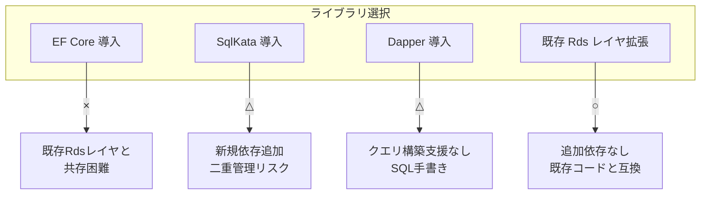
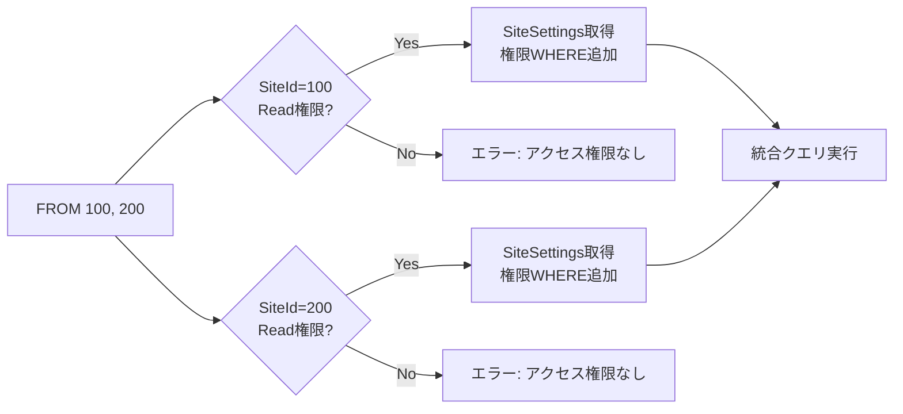
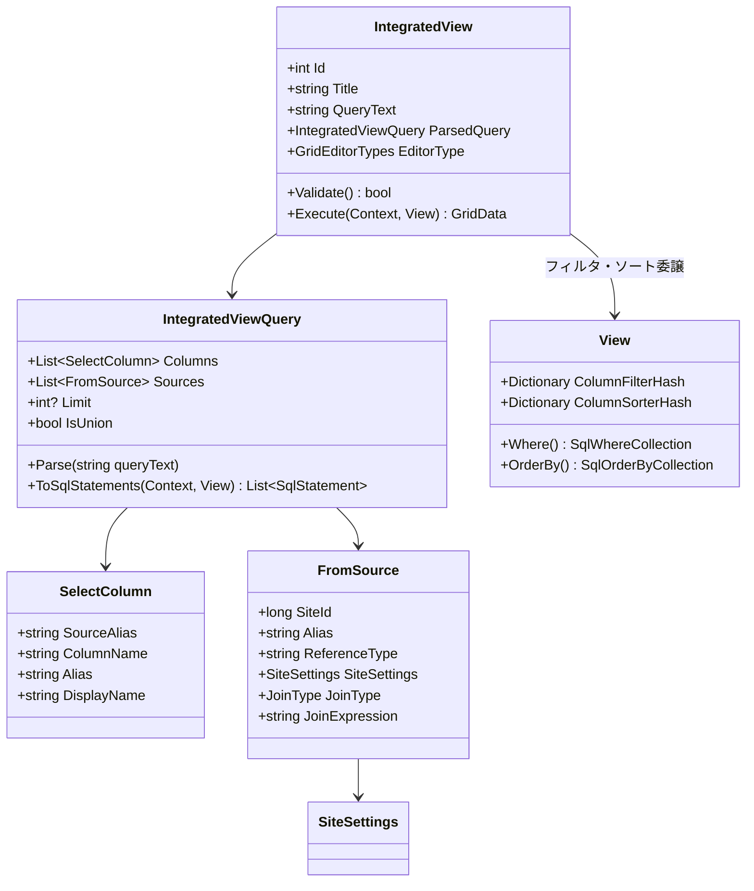
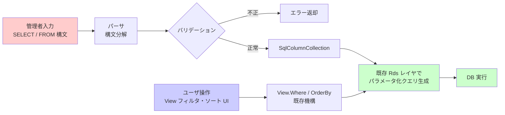
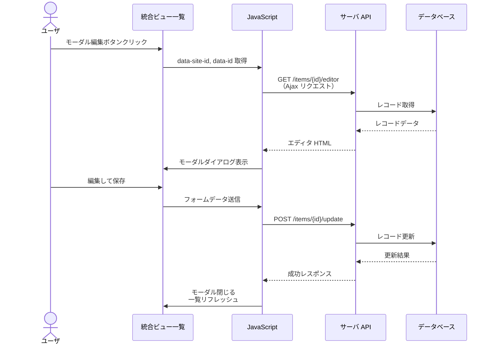
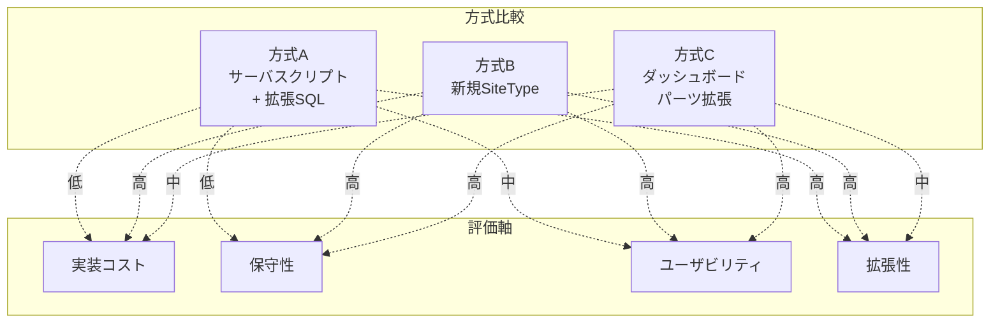
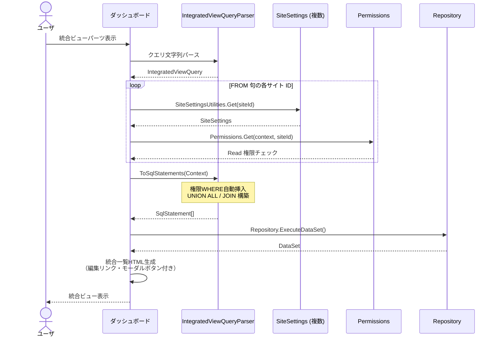

# 複数テーブル統合ビュー

複数のテーブル（Issues / Results）を横断して統合表示する「統合ビュー」機能の設計を行う。
簡易的な SQL ライクな SELECT / FROM 構文でテーブルとカラムを定義し、
フィルタ・ソートは既存の一覧画面と同じ View UI を使用する。
各行から編集画面へのリンク・編集モーダルを提供する。

<!-- START doctoc generated TOC please keep comment here to allow auto update -->
<!-- DON'T EDIT THIS SECTION, INSTEAD RE-RUN doctoc TO UPDATE -->

- [調査情報](#調査情報)
- [調査目的](#調査目的)
- [既存機能の分析](#既存機能の分析)
    - [ダッシュボード Index パーツによる複数テーブル表示](#ダッシュボード-index-パーツによる複数テーブル表示)
    - [リンクカラム形式（チルダ構文）による JOIN](#リンクカラム形式チルダ構文による-join)
    - [GridData によるデータ取得](#griddata-によるデータ取得)
    - [権限フィルタリング](#権限フィルタリング)
    - [GridEditorType — 一覧画面の編集方式](#grideditortype--一覧画面の編集方式)
    - [ExtendedSql — 拡張 SQL 機構](#extendedsql--拡張-sql-機構)
    - [既存のフィルタ・ソート機構（View）](#既存のフィルタソート機構view)
- [クエリ構築ライブラリの検討](#クエリ構築ライブラリの検討)
    - [プリザンターの現行データアクセス層](#プリザンターの現行データアクセス層)
    - [ライブラリ候補の比較](#ライブラリ候補の比較)
    - [評価](#評価)
    - [推奨: 既存 Rds レイヤの拡張](#推奨-既存-rds-レイヤの拡張)
- [統合ビューの設計](#統合ビューの設計)
    - [設計方針](#設計方針)
    - [SQL ライク構文の仕様](#sql-ライク構文の仕様)
    - [内部アーキテクチャ](#内部アーキテクチャ)
    - [一覧画面の実装](#一覧画面の実装)
    - [編集画面リンクと編集モーダル](#編集画面リンクと編集モーダル)
    - [実装方式の比較](#実装方式の比較)
    - [推奨方式: 方式 C（ダッシュボードパーツ拡張）](#推奨方式-方式-cダッシュボードパーツ拡張)
    - [改修対象ファイル一覧](#改修対象ファイル一覧)
    - [データフロー](#データフロー)
- [考慮事項](#考慮事項)
    - [パフォーマンス](#パフォーマンス)
    - [セキュリティ](#セキュリティ)
    - [既存機能との互換性](#既存機能との互換性)
- [結論](#結論)
- [関連ソースコード](#関連ソースコード)
- [関連ドキュメント](#関連ドキュメント)

<!-- END doctoc generated TOC please keep comment here to allow auto update -->

## 調査情報

| 調査日        | リポジトリ | ブランチ | タグ/バージョン    | コミット     | 備考     |
| ------------- | ---------- | -------- | ------------------ | ------------ | -------- |
| 2026年3月14日 | Pleasanter | main     | Pleasanter_1.5.2.0 | `c76832d69f` | 初回調査 |

## 調査目的

プリザンターでは 1 つのサイト（テーブル）に対して 1 つの一覧画面が対応しており、
複数テーブルのデータを横断的に統合表示する標準機能がない。
ダッシュボードの Index パーツは複数サイトのデータを並べて表示できるが、
テーブル間の JOIN やカラム選択の自由度は限定的である。

本調査では、ユーザが簡易的な SQL ライクな SELECT 文を記述することで、複数テーブルを横断してデータを取得・統合表示する機能を設計する。要件は以下の通り。

| 要件                     | 説明                                                                                |
| ------------------------ | ----------------------------------------------------------------------------------- |
| 統合一覧表示             | 複数テーブル（Issues / Results）のデータを 1 つの一覧画面に統合して表示する         |
| SQL ライク SELECT 構文   | SELECT / FROM / UNION ALL を簡易的に記述できるクエリ構文を提供する                  |
| 既存フィルタ・ソート流用 | フィルタとソートは既存の一覧画面と同じ View UI を使用する                           |
| 編集画面リンク           | 一覧の各行から元テーブルの編集画面へ遷移するリンクを表示する                        |
| 編集モーダル             | 編集画面へ遷移せず、モーダルダイアログで編集操作を行える                            |
| 権限フィルタ済み FROM 句 | FROM 句で指定するテーブルは既にユーザごとの権限で絞り込み済みであることを前提とする |

---

## 既存機能の分析

### ダッシュボード Index パーツによる複数テーブル表示

現行のプリザンターでは、ダッシュボードの Index パーツが最も近い既存機能である。

**ファイル**: `Implem.Pleasanter/Libraries/Settings/DashboardPart.cs`

```csharp
public class DashboardPart : ISettingListItem
{
    public DashboardPartType Type { get; set; }
    public string IndexSites { get; set; }          // 対象サイトID群
    public List<string> IndexSitesData { get; set; } // サイトデータ
    public string KambanSites { get; set; }          // カンバン用サイトID群
    public string CalendarSites { get; set; }        // カレンダー用サイトID群
}
```

| 比較項目         | ダッシュボード Index パーツ    | 統合ビュー（本設計）   |
| ---------------- | ------------------------------ | ---------------------- |
| 複数テーブル表示 | ○（複数サイト指定可能）        | ○                      |
| カラム選択       | サイト設定のグリッド設定に依存 | SELECT 句で自由に指定  |
| テーブル間 JOIN  | ×                              | ○（UNION / JOIN 対応） |
| WHERE 条件       | View フィルタ経由              | WHERE 句で直接指定     |
| ソート           | View ソート経由                | ORDER BY 句で直接指定  |
| 編集リンク       | ○（各行クリックで遷移）        | ○                      |
| 編集モーダル     | ×                              | ○                      |

### リンクカラム形式（チルダ構文）による JOIN

プリザンターは既にリンクカラム形式（チルダ構文）でテーブル間 JOIN をサポートしている。

**ファイル**: `Implem.Pleasanter/Libraries/Settings/ColumnNameInfo.cs`

```csharp
public class ColumnNameInfo
{
    public string ColumnName;   // 元のカラム名
    public string Name;         // 抽出されたカラム名
    public string TableAlias;   // テーブルエイリアス
    public long SiteId;         // 対象サイトID
    public bool Joined;         // JOIN カラムかどうか

    private void Set(string columnName)
    {
        ColumnName = columnName;
        if (columnName.Contains(","))
        {
            Name = columnName.Split(',').Skip(1).Join(string.Empty);
            TableAlias = columnName.Split_1st();
            SiteId = ColumnUtilities.GetSiteIdByTableAlias(TableAlias);
            Joined = true;
        }
        else
        {
            Name = columnName;
        }
    }
}
```

チルダ構文の基本パターン:

| 構文                    | 意味                                              |
| ----------------------- | ------------------------------------------------- |
| `ClassA~200`            | ClassA カラムで SiteId=200 の親テーブルへ JOIN    |
| `ClassA~~200`           | ClassA カラムで SiteId=200 の子テーブルへ JOIN    |
| `ClassA~200-ClassB~300` | 200 経由で 300 へ多段 JOIN                        |
| `ClassA~200,Status`     | SiteId=200 の Status カラムを参照（カンマ区切り） |

ただし、チルダ構文はリンクカラムの定義に基づく JOIN のみをサポートし、任意のテーブル間で自由な結合条件を指定する仕組みではない。

### GridData によるデータ取得

一覧画面のデータ取得は `GridData` クラスが担う。

**ファイル**: `Implem.Pleasanter/Libraries/Models/GridData.cs`（行番号: 55-150）

```csharp
private void Get(
    Context context,
    SiteSettings ss,
    View view,
    Sqls.TableTypes tableType = Sqls.TableTypes.Normal,
    SqlColumnCollection column = null,
    SqlJoinCollection join = null,
    SqlWhereCollection where = null,
    int top = 0,
    int offset = 0,
    int pageSize = 0,
    bool count = true)
{
    var gridColumns = ss.GetGridColumns(context, view, includedColumns: true);
    column = column ?? ColumnUtilities.SqlColumnCollection(
        context: context, ss: ss, view: view, columns: gridColumns);
    where = view.Where(context: context, ss: ss, where: where);
    var orderBy = view.OrderBy(context: context, ss: ss);
    join = join ?? ss.Join(
        context: context,
        join: new IJoin[] { column, where, orderBy });
    var statements = new List<SqlStatement> {
        Rds.Select(
            tableName: ss.ReferenceType,
            tableType: tableType,
            dataTableName: "Main",
            column: column,
            join: join,
            where: where,
            orderBy: orderBy,
            top: top,
            offset: offset,
            pageSize: pageSize)
    };
    // ...
}
```

### 権限フィルタリング

`View.Where()` 内で `Permissions.SetPermissionsWhere()` が呼ばれ、テナント ID・サイト ID・レコード単位の権限フィルタが WHERE 句に追加される。

**ファイル**: `Implem.Pleasanter/Libraries/Settings/View.cs`（行番号: 1838-1884）

```csharp
public SqlWhereCollection Where(
    Context context,
    SiteSettings ss,
    SqlWhereCollection where = null,
    bool checkPermission = true,
    bool itemJoin = true,
    bool requestSearchCondition = true)
{
    if (where == null) where = new SqlWhereCollection();
    SetGeneralsWhere(context, ss, where);
    SetColumnsWhere(context, ss, where);
    SetSearchWhere(context, ss, where);
    Permissions.SetPermissionsWhere(
        context: context,
        ss: ss,
        where: where,
        checkPermission: checkPermission);
    return where;
}
```

### GridEditorType — 一覧画面の編集方式

**ファイル**: `Implem.Pleasanter/Libraries/Settings/SiteSettings.cs`（行番号: 29-34, 172）

```csharp
public enum GridEditorTypes : int
{
    None = 0,
    Grid = 10,      // インライン編集
    Dialog = 20     // モーダルダイアログ編集
}

public GridEditorTypes? GridEditorType;
```

- `Grid`: 一覧画面上でインライン編集
- `Dialog`: モーダルダイアログで編集

### ExtendedSql — 拡張 SQL 機構

**ファイル**: `Implem.Pleasanter/Implem.ParameterAccessor/Parts/ExtendedSql.cs`

```csharp
public class ExtendedSql : ExtendedBase
{
    public bool OnSelectingWhere;              // WHERE 句拡張
    public bool OnSelectingOrderBy;            // ORDER BY 句拡張
    public bool OnSelectingColumn;             // SELECT 句拡張
    public string CommandText;                 // 生 SQL
    public string DbUser;                      // 実行ユーザ
    public List<string> OnSelectingWhereParams;

    public string ReplacedCommandText(
        long siteId, long id, DateTime? timestamp,
        Dictionary<string, string> columnPlaceholders = null)
    {
        var commandText = CommandText
            .Replace("{{SiteId}}", siteId.ToString())
            .Replace("{{Id}}", id.ToString());
        // ...
    }
}
```

拡張 SQL はパラメータファイルで定義し、既存クエリの WHERE / ORDER BY / SELECT 句を拡張できる。ただし、FROM 句（テーブル指定）の変更や UNION クエリの構築は対象外である。

### 既存のフィルタ・ソート機構（View）

統合ビューのフィルタとソートは、既存の一覧画面と同じ UI・仕組みを流用する。
View クラスの `ColumnFilterHash` / `ColumnSorterHash` が
既存一覧のフィルタ・ソートの中核である。

**ファイル**: `Implem.Pleasanter/Libraries/Settings/View.cs`

```csharp
public class View
{
    // フィルタ設定
    public Dictionary<string, string> ColumnFilterHash;
    public Dictionary<string, string> ColumnFilterExpressions;
    public Dictionary<string, Column.SearchTypes> ColumnFilterSearchTypes;
    public List<string> ColumnFilterNegatives;
    public string Search;

    // ソート設定
    public Dictionary<string, SqlOrderBy.Types> ColumnSorterHash;
}
```

| プロパティ                | 型                                       | 説明                              |
| ------------------------- | ---------------------------------------- | --------------------------------- |
| `ColumnFilterHash`        | `Dictionary<string, string>`             | カラム名 → フィルタ値             |
| `ColumnFilterSearchTypes` | `Dictionary<string, Column.SearchTypes>` | カラム名 → 検索種別（完全一致等） |
| `ColumnSorterHash`        | `Dictionary<string, SqlOrderBy.Types>`   | カラム名 → ASC/DESC               |

`View.Where()` がこれらの設定を `SqlWhereCollection` に変換し、
`View.OrderBy()` が `SqlOrderByCollection` に変換する。
統合ビューでもこの仕組みをそのまま利用することで、
ユーザは既存の一覧画面と同じフィルタ・ソート UI を操作できる。

---

## クエリ構築ライブラリの検討

統合ビューのクエリ構築において、EF Core やその他のライブラリを
活用できるか検討する。

### プリザンターの現行データアクセス層

プリザンターは **EF Core を使用していない**。
独自の Rds（Relational Database System）抽象レイヤで
ADO.NET を直接操作している。

| ライブラリ                 | バージョン | 用途       |
| -------------------------- | ---------- | ---------- |
| `Microsoft.Data.SqlClient` | 6.1.3      | SQL Server |
| `Npgsql`                   | 10.0.0     | PostgreSQL |
| `MySqlConnector`           | 2.5.0      | MySQL      |

EF Core、Dapper、SqlKata 等の ORM / クエリビルダは一切参照されていない。

**Rds レイヤの構造**:

```
Rds/
├── Implem.IRds/           （インタフェース）
│   ├── ISqlCommand.cs
│   ├── ISqlCommandText.cs
│   ├── ISqlObjectFactory.cs
│   └── ISqls.cs
├── Implem.SqlServer/      （SQL Server 実装）
├── Implem.PostgreSql/     （PostgreSQL 実装）
└── Implem.MySql/          （MySQL 実装）

Implem.Libraries/DataSources/SqlServer/
├── SqlSelect.cs           （SELECT ビルダ）
├── SqlWhere.cs            （WHERE ビルダ）
├── SqlOrderBy.cs          （ORDER BY ビルダ）
├── SqlJoin.cs             （JOIN ビルダ）
└── SqlStatement.cs        （SQL 文基底クラス）
```

### ライブラリ候補の比較

| ライブラリ          | 概要                   | メリット                                             | デメリット                                          |
| ------------------- | ---------------------- | ---------------------------------------------------- | --------------------------------------------------- |
| **EF Core**         | Microsoft 公式 ORM     | LINQ で型安全なクエリ、マイグレーション管理          | 既存 Rds レイヤと共存が困難、DbContext 導入コスト大 |
| **SqlKata**         | Fluent クエリビルダ    | SQL 方言自動変換、UNION/JOIN 対応、軽量              | 新規依存追加、Rds レイヤとの二重管理リスク          |
| **Dapper**          | Micro ORM              | 生 SQL + オブジェクトマッピング、軽量                | クエリ構築支援なし（SQL は手書き）                  |
| **既存 Rds レイヤ** | プリザンター独自ビルダ | 追加依存なし、3DB 方言対応済み、既存コードと完全互換 | UNION 未対応、統合ビュー用の拡張が必要              |

### 評価



**EF Core** は最も強力だが、プリザンターの Rds レイヤ全体を
置き換えない限り共存が難しい。
統合ビューのためだけに DbContext を導入すると、
データアクセスの二重管理が発生する。

**SqlKata** は UNION / JOIN を含む複雑なクエリを
Fluent API で構築でき、SQL 方言の自動変換もサポートする。
既存 Rds レイヤと並行利用が可能だが、
新規 NuGet 依存の追加と二重管理のリスクがある。

```csharp
// SqlKata での UNION ALL 構築例
var query1 = new Query("Issues")
    .Select("IssueId as Id", "Title", "Status")
    .Where("SiteId", 100)
    .Where("Status", "<>", 900);
var query2 = new Query("Results")
    .Select("ResultId as Id", "Title", "Status")
    .Where("SiteId", 200);
var union = query1.UnionAll(query2).OrderBy("Title");
```

**既存 Rds レイヤの拡張** は追加依存が不要で、
既存の `SqlSelect` / `SqlWhere` / `SqlOrderBy` と完全互換である。
UNION ALL 用の `SqlUnion` クラスを追加するだけで対応可能であり、
3DB 方言（SQL Server / PostgreSQL / MySQL）の対応も
既存の `ISqlCommandText` パターンで統一できる。

### 推奨: 既存 Rds レイヤの拡張

以下の理由から、既存 Rds レイヤの拡張を推奨する。

1. **依存追加なし**: 新規 NuGet パッケージの追加が不要
2. **既存互換**: `SqlColumnCollection` / `SqlWhereCollection` /
   `SqlOrderByCollection` をそのまま利用可能
3. **View 統合**: 既存の `View.Where()` / `View.OrderBy()` が
   生成する SQL コレクションをそのまま統合クエリに注入可能
4. **3DB 方言対応**: `ISqlCommandText` パターンにより
   SQL Server / PostgreSQL / MySQL を統一的にサポート

ただし、将来的にクエリの複雑性が増す場合は SqlKata の導入を
再検討する余地がある。

---

## 統合ビューの設計

### 設計方針

統合ビューは新しい SiteType として実装するのではなく、
既存の GridData / View アーキテクチャを拡張する形で設計する。

**フィルタとソートは既存の一覧画面と同じ UI を使用する。**
ユーザは SQL ライク構文で SELECT / FROM / UNION ALL を記述し、
フィルタ・ソートは既存の View フィルタ・ソート UI で操作する。

```mermaid
flowchart TB
    subgraph 管理者設定
        A[統合ビュー定義<br/>SELECT / FROM / UNION ALL]
    end

    subgraph ユーザ操作（既存UIを流用）
        B[View フィルタUI<br/>ColumnFilterHash]
        C[View ソートUI<br/>ColumnSorterHash]
    end

    subgraph パーサ
        D[SELECT 句パーサ]
        E[FROM 句パーサ]
    end

    subgraph 権限チェック
        F[FROM 句の各テーブルに対して<br/>SiteSettings 取得]
        G[Permissions.SetPermissionsWhere<br/>でテーブルごとにフィルタ適用]
    end

    subgraph SQL生成（既存Rdsレイヤ拡張）
        H[UNION ALL クエリ生成<br/>or JOIN クエリ生成]
        I[SqlJoinCollection 構築]
        J[View.Where → SqlWhereCollection]
        K[View.OrderBy → SqlOrderByCollection]
    end

    subgraph 表示
        L[GridData 取得]
        M[統合一覧 HTML 生成]
        N[編集リンク / モーダル]
    end

    A --> D & E
    E --> F --> G
    B --> J
    C --> K
    D & G --> H
    H --> I
    I & J & K --> L --> M --> N
```

### SQL ライク構文の仕様

統合ビューの定義では、SELECT / FROM / UNION ALL を SQL ライク構文で記述する。
**WHERE（フィルタ）と ORDER BY（ソート）は既存の一覧画面と同じ View UI で操作する**ため、
SQL ライク構文には含めない。

#### 基本構文

```sql
SELECT カラム名 [AS 別名], ...
FROM サイトID [AS エイリアス], ...
[LIMIT 件数]
```

#### UNION 形式（異なるテーブルの行を縦に結合）

```sql
SELECT
  IssueId AS Id,
  Title,
  Status,
  ClassA AS Category
FROM 100

UNION ALL

SELECT
  ResultId AS Id,
  Title,
  Status,
  ClassA AS Category
FROM 200

LIMIT 100
```

#### JOIN 形式（テーブル間の横結合）

```sql
SELECT
  a.IssueId AS Id,
  a.Title AS IssueTitle,
  b.Title AS ResultTitle,
  a.Status
FROM 100 AS a
JOIN 200 AS b ON a.ClassA = b.ResultId
```

#### 構文要素の詳細

| 構文要素  | 説明                                                                      | 例                                 |
| --------- | ------------------------------------------------------------------------- | ---------------------------------- |
| SELECT    | 取得カラムの指定。`AS` で一覧表示時の別名を設定可能                       | `SELECT Title, Status AS 状態`     |
| FROM      | サイト ID を指定。`AS` でエイリアスを設定可能。カンマ区切りで複数テーブル | `FROM 100 AS a, 200 AS b`          |
| UNION ALL | 複数 SELECT の縦結合。カラム数と型の互換性が必要                          | `SELECT ... UNION ALL SELECT ...`  |
| JOIN      | テーブル間の横結合。`ON` で結合条件を指定                                 | `JOIN 200 AS b ON a.ClassA = b.Id` |
| LEFT JOIN | 左外部結合。結合先が存在しない場合も主テーブルの行を保持                  | `LEFT JOIN 200 AS b ON ...`        |
| LIMIT     | 取得件数の上限。グリッドの PageSize 設定とも連携                          | `LIMIT 50`                         |

> **WHERE / ORDER BY を SQL ライク構文に含めない理由:**
> 既存の一覧画面と同じフィルタ・ソート UI を使用することで、
> ユーザの学習コストを削減し、操作の一貫性を保つ。
> `View.ColumnFilterHash` / `View.ColumnSorterHash` がそのまま利用でき、
> セッション保持やフィルタの表示/非表示切り替え等の既存機能も自動的に適用される。

#### フィルタ・ソートの流用方式

フィルタとソートは既存の View 機構をそのまま利用する。

```mermaid
flowchart LR
    subgraph 既存一覧画面
        A1[フィルタUI] --> B1[ColumnFilterHash]
        A2[ソートUI] --> B2[ColumnSorterHash]
        B1 --> C1[View.Where]
        B2 --> C2[View.OrderBy]
    end

    subgraph 統合ビュー（同じ仕組みを流用）
        D1[フィルタUI] --> E1[ColumnFilterHash]
        D2[ソートUI] --> E2[ColumnSorterHash]
        E1 --> F1[View.Where]
        E2 --> F2[View.OrderBy]
    end

    C1 --> G[SqlWhereCollection]
    C2 --> H[SqlOrderByCollection]
    F1 --> G
    F2 --> H
```

統合ビューでは SELECT 句の `AS` 別名をフィルタ・ソートの
カラム名としてマッピングする。
例えば `SELECT ClassA AS Category` と定義した場合、
フィルタ UI には「Category」カラムが表示され、
ユーザは既存の一覧画面と同じ操作でフィルタ・ソートを適用できる。

| 操作                | 既存一覧             | 統合ビュー（同じ動作） |
| ------------------- | -------------------- | ---------------------- |
| フィルタ設定        | カラムヘッダの入力欄 | カラムヘッダの入力欄   |
| フィルタ検索種別    | 完全一致/部分一致 等 | 完全一致/部分一致 等   |
| ソート設定          | カラムヘッダクリック | カラムヘッダクリック   |
| フィルタ状態の保持  | View セッション保存  | View セッション保存    |
| フィルタ表示/非表示 | FiltersDisplayType   | FiltersDisplayType     |

#### FROM 句の権限前提

FROM 句で指定される各サイト ID は、統合ビュー実行時に以下の権限チェックが自動適用される。



FROM 句で指定された各テーブルに対して、現行の `Permissions.SetPermissionsWhere()` と同じロジックで権限フィルタが自動挿入される。

---

### 内部アーキテクチャ

#### クラス構成



#### SiteSettings への統合

統合ビューの定義は `SiteSettings` に格納する。既存の `Views` コレクションと並列に `IntegratedViews` を追加する。

**追加プロパティ案（`SiteSettings.cs`）**:

```csharp
public class SiteSettings
{
    // 既存プロパティ
    public List<View> Views;
    public GridEditorTypes? GridEditorType;

    // 追加プロパティ
    public List<IntegratedView> IntegratedViews;
}
```

#### パーサの実装方針

SQL ライク構文のパースは、正規表現ベースの簡易パーサで実装する。
パーサは SELECT / FROM / UNION ALL / JOIN / LIMIT のみを処理し、
WHERE / ORDER BY は既存の View 機構に委譲する。
既存 Rds レイヤの `SqlColumnCollection` 等を直接生成することで、
3DB 方言への対応も自動的に行われる。

```csharp
public class IntegratedViewQueryParser
{
    private static readonly Regex SelectPattern =
        new(@"SELECT\s+(.+?)\s+FROM",
            RegexOptions.IgnoreCase | RegexOptions.Singleline);
    private static readonly Regex FromPattern =
        new(@"FROM\s+(.+?)(?:\s+LIMIT|\s*$)",
            RegexOptions.IgnoreCase | RegexOptions.Singleline);
    private static readonly Regex LimitPattern =
        new(@"LIMIT\s+(\d+)", RegexOptions.IgnoreCase);

    public IntegratedViewQuery Parse(string queryText)
    {
        var query = new IntegratedViewQuery();
        // UNION ALL で分割
        var unionParts = Regex.Split(queryText,
            @"\bUNION\s+ALL\b", RegexOptions.IgnoreCase);
        if (unionParts.Length > 1)
        {
            query.IsUnion = true;
            // 各パートの SELECT / FROM を個別にパース
        }
        // SELECT / FROM / LIMIT をパース
        // WHERE / ORDER BY は View 機構に委譲
        return query;
    }
}
```

#### SQL インジェクション対策

ユーザ入力の SQL ライク構文は直接 SQL 文として実行せず、パーサで構文要素を分解した上で、
既存 Rds レイヤの `SqlColumnCollection` を経由して SQL を構築する。
フィルタ・ソートは View 機構経由のため、パーサでの WHERE / ORDER BY 処理は不要。



| 対策項目                 | 方法                                                               |
| ------------------------ | ------------------------------------------------------------------ |
| SQL インジェクション防止 | パーサでトークン分解後、既存 Rds レイヤで SQL 生成                 |
| フィルタ・ソート         | View 機構経由（`SqlParam` パラメータバインド済み）                 |
| テーブル参照制限         | FROM 句のサイト ID を `SiteSettingsUtilities.Get()` で検証         |
| カラム参照制限           | SELECT 句のカラム名を `SiteSettings.ColumnDefinitionHash` で検証   |
| 関数・サブクエリ禁止     | パーサレベルで `(`, `)`, `;`, `--` 等の危険パターンを拒否          |
| 権限チェック             | FROM 句の各テーブルに対して `Permissions.Get()` で Read 権限を確認 |

---

### 一覧画面の実装

#### UNION 形式のクエリ生成

UNION 形式では、各 SELECT 文を個別に `SqlStatement` に変換し、`UNION ALL` で結合する。
フィルタ・ソートは既存の `View.Where()` / `View.OrderBy()` を利用する。

```csharp
public List<SqlStatement> ToUnionSqlStatements(
    Context context, View view)
{
    var statements = new List<SqlStatement>();
    foreach (var part in UnionParts)
    {
        var ss = SiteSettingsUtilities.Get(
            context: context, siteId: part.Source.SiteId);
        var column = new SqlColumnCollection();
        foreach (var col in part.Columns)
        {
            column.Add(new SqlColumn(
                columnBracket: $"\"{col.ColumnName}\"",
                tableName: ss.ReferenceType,
                _as: col.Alias));
        }
        // 元テーブルの SiteId と ReferenceType を追加
        // （編集リンク生成に必要）
        column.Add(new SqlColumn(
            columnBracket: "\"SiteId\"",
            tableName: ss.ReferenceType,
            _as: "_SourceSiteId"));
        column.Add(new SqlColumn(
            columnBracket: $"\"{Rds.IdColumn(ss.ReferenceType)}\"",
            tableName: ss.ReferenceType,
            _as: "_SourceId"));
        // 権限 WHERE 自動追加
        var where = new SqlWhereCollection();
        Permissions.SetPermissionsWhere(
            context: context, ss: ss, where: where);
        // 既存 View フィルタを適用（カラム別名→実カラム名にマッピング）
        view.Where(context: context, ss: ss, where: where);
        statements.Add(Rds.Select(
            tableName: ss.ReferenceType,
            column: column,
            where: where));
    }
    // 既存 View ソートを適用
    var orderBy = view.OrderBy(context: context, ss: ss);
    return statements;
}
```

#### 一覧画面の HTML 構造

統合ビューの一覧は既存の `GridData` の HTML 構造を流用し、追加で元テーブルの識別情報と編集リンクを含める。

```html
<table class="grid integrated-view">
    <thead>
        <tr>
            <th class="iv-source">テーブル</th>
            <th>タイトル</th>
            <th>状態</th>
            <th>カテゴリ</th>
            <th class="iv-actions">操作</th>
        </tr>
    </thead>
    <tbody>
        <tr data-source-site-id="100" data-source-id="1">
            <td class="iv-source">
                <span class="iv-badge issues">課題管理</span>
            </td>
            <td>サーバ移行作業</td>
            <td>進行中</td>
            <td>インフラ</td>
            <td class="iv-actions">
                <a href="/items/1/edit" class="iv-edit-link" title="編集画面を開く">
                    <span class="iv-icon edit"></span>
                </a>
                <button
                    class="iv-edit-modal"
                    data-action="EditDialog"
                    data-site-id="100"
                    data-id="1"
                    title="モーダルで編集"
                >
                    <span class="iv-icon modal"></span>
                </button>
            </td>
        </tr>
        <tr data-source-site-id="200" data-source-id="5">
            <td class="iv-source">
                <span class="iv-badge results">成果物</span>
            </td>
            <td>移行手順書</td>
            <td>完了</td>
            <td>ドキュメント</td>
            <td class="iv-actions">
                <a href="/items/5/edit" class="iv-edit-link" title="編集画面を開く">
                    <span class="iv-icon edit"></span>
                </a>
                <button
                    class="iv-edit-modal"
                    data-action="EditDialog"
                    data-site-id="200"
                    data-id="5"
                    title="モーダルで編集"
                >
                    <span class="iv-icon modal"></span>
                </button>
            </td>
        </tr>
    </tbody>
</table>
```

---

### 編集画面リンクと編集モーダル

#### 編集画面リンクの実装

統合ビューの各行には元テーブルの `SiteId` と `ReferenceId` が保持されている。編集リンクは `Items` テーブルのルーティングを利用して生成する。

**ファイル**: `Implem.Pleasanter/Models/Items/ItemModel.cs`

```csharp
// ItemModel はReferenceType に基づいて適切なモデルにルーティング
public long ReferenceId = 0;
public string ReferenceType = string.Empty;
public long SiteId = 0;
```

編集リンクの URL は `/items/{ReferenceId}/edit` 形式で、
`ItemModel.SetSite()` により適切な `SiteSettings` が解決される。
統合ビューでは `_SourceId` 隠しカラムの値を使って URL を生成する。

```csharp
public static string EditUrl(long sourceId)
{
    return $"/items/{sourceId}/edit";
}
```

#### 編集モーダルの実装

編集モーダルは既存の `GridEditorTypes.Dialog` の仕組みを流用する。

**ファイル**: `Implem.Pleasanter/Libraries/Settings/SiteSettings.cs`（行番号: 29-34）

```csharp
public enum GridEditorTypes : int
{
    None = 0,
    Grid = 10,      // インライン編集
    Dialog = 20     // モーダルダイアログ編集
}
```

統合ビューのモーダル編集では、クリックされた行の `data-site-id` と `data-id` を使って、Ajax で該当レコードのエディタフォームを取得し、モーダルダイアログ内に表示する。



#### モーダル表示の JavaScript 実装方針

```javascript
// 統合ビュー用モーダル編集
$('.iv-edit-modal').on('click', function () {
    var siteId = $(this).data('site-id');
    var id = $(this).data('id');
    $.ajax({
        url: '/items/' + id + '/editor',
        type: 'GET',
        success: function (html) {
            // 既存の EditorDialog 機構を流用
            $('#EditorDialog').html(html);
            $('#EditorDialog').dialog({
                modal: true,
                width: '80%',
                close: function () {
                    // 一覧リフレッシュ
                    refreshIntegratedView();
                },
            });
        },
    });
});
```

---

### 実装方式の比較

統合ビューの実装方式として 3 つの選択肢を検討する。

#### 方式 A: サーバスクリプト + 拡張 SQL

既存の拡張 SQL（`ExtendedSql`）とサーバスクリプトを組み合わせて実装する。

| 項目         | 内容                                                 |
| ------------ | ---------------------------------------------------- |
| 仕組み       | ExtendedSql の CommandText に UNION ALL クエリを記述 |
| 設定方法     | Parameters/ExtendedSqls/ にJSON ファイルを配置       |
| 権限チェック | `OnSelectingWhere` フックで権限 WHERE を挿入         |
| カスタム性   | SQL を直接記述するため自由度が高い                   |
| メンテ性     | JSON ファイルの管理が煩雑になりやすい                |

```json
{
    "Name": "IntegratedView_TaskAndResult",
    "OnSelectingColumn": true,
    "CommandText": "SELECT IssueId AS Id, Title, Status, SiteId AS _SourceSiteId FROM Issues WHERE SiteId = {{SiteId}} AND Status <> 900 UNION ALL SELECT ResultId AS Id, Title, Status, SiteId AS _SourceSiteId FROM Results WHERE SiteId IN (200, 201) AND Status <> 900"
}
```

#### 方式 B: 新規 SiteType「IntegratedView」

プリザンターの SiteType に `IntegratedView` を追加し、専用の管理画面を持たせる。

| 項目         | 内容                                                       |
| ------------ | ---------------------------------------------------------- |
| 仕組み       | Sites テーブルに `ReferenceType = 'IntegratedView'` を追加 |
| 設定方法     | サイト設定画面に統合ビュー専用タブを追加                   |
| 権限チェック | 既存の SiteSettings 権限機構をそのまま利用                 |
| カスタム性   | UI で設定するため、SQL 構文の知識不要                      |
| メンテ性     | SiteSettings と統合されるため管理しやすい                  |

#### 方式 C: ダッシュボードパーツ拡張（推奨）

既存のダッシュボード機構に「統合ビュー」パーツを追加する。

| 項目         | 内容                                           |
| ------------ | ---------------------------------------------- |
| 仕組み       | `DashboardPartType` に `IntegratedView` を追加 |
| 設定方法     | ダッシュボード設定画面でパーツとして追加       |
| 権限チェック | 既存のダッシュボード権限機構を流用             |
| カスタム性   | SQL ライク構文をパーツ設定に記述               |
| フィルタ     | 既存の View フィルタ UI を流用                 |
| ソート       | 既存の View ソート UI を流用                   |
| メンテ性     | 既存のダッシュボード UI / API と統合           |



#### 方式比較表

| 評価軸           | 方式 A（拡張 SQL）  | 方式 B（新規 SiteType） | 方式 C（ダッシュボード拡張） |
| ---------------- | ------------------- | ----------------------- | ---------------------------- |
| 実装コスト       | ◎ 低い              | △ 高い                  | ○ 中程度                     |
| 保守性           | △ JSON ファイル散在 | ○ SiteSettings 統合     | ○ ダッシュボード統合         |
| UI 操作性        | △ JSON 手動編集     | ◎ 専用 UI               | ○ ダッシュボード UI 流用     |
| 権限制御         | △ 手動実装          | ○ 既存機構流用          | ○ 既存機構流用               |
| フィルタ・ソート | △ SQL 手書き        | ○ 既存 View UI 流用     | ○ 既存 View UI 流用          |
| 編集モーダル     | △ 別途実装          | ○ 組み込み可能          | ○ 組み込み可能               |
| 拡張性           | ◎ SQL 自由度高い    | ○ 将来拡張容易          | ○ パーツ追加容易             |
| 学習コスト       | △ SQL 知識必要      | ◎ GUI 操作              | ○ SELECT 構文 + 既存 UI      |

---

### 推奨方式: 方式 C（ダッシュボードパーツ拡張）

以下の理由から方式 C を推奨する。

1. **既存基盤の活用**: `DashboardPart` の Index / Kamban / Calendar パーツと同じフレームワークで実装でき、権限制御・レイアウト管理・非同期読み込みの仕組みをそのまま流用可能
2. **UI の一貫性**: ダッシュボード設定画面の操作体系と統一され、ユーザの学習コストが低い
3. **既存フィルタ・ソートの流用**: 既存の View フィルタ・ソート UI をそのまま利用でき、ユーザは新しい操作を覚える必要がない
4. **段階的実装**: 最初は UNION 形式のみ実装し、後から JOIN 形式を追加するなど段階的な拡張が可能
5. **編集モーダルとの相性**: ダッシュボードには既に各パーツからの遷移・モーダル表示の基盤があり、統合ビューの編集モーダルも同じ仕組みで実装可能

---

### 改修対象ファイル一覧

| ファイル                                                              | 変更内容                                       |
| --------------------------------------------------------------------- | ---------------------------------------------- |
| `Implem.Pleasanter/Libraries/Settings/DashboardPart.cs`               | `DashboardPartType` に `IntegratedView` を追加 |
| `Implem.Pleasanter/Libraries/Settings/DashboardPart.cs`               | 統合ビュー用プロパティ追加                     |
| `Implem.Pleasanter/Libraries/Settings/SiteSettings.cs`                | `IntegratedView` 関連メソッド追加              |
| `Implem.Pleasanter/Models/Dashboards/DashboardUtilities.cs`           | 統合ビューパーツの HTML 生成                   |
| `Implem.Pleasanter/Libraries/Settings/IntegratedView.cs`（新規）      | 統合ビュー定義クラス                           |
| `Implem.Pleasanter/Libraries/Settings/IntegratedViewQuery.cs`（新規） | SELECT / FROM パーサ（既存 Rds レイヤ拡張）    |
| `Implem.PleasanterFrontend/wwwroot/src/scripts/generals/`（新規）     | モーダル編集 JavaScript                        |

### データフロー



---

## 考慮事項

### パフォーマンス

| 考慮点               | 対策                                                             |
| -------------------- | ---------------------------------------------------------------- |
| UNION ALL の件数増加 | LIMIT 句の必須化（デフォルト上限: GridPageSize）                 |
| 大量テーブル結合     | FROM 句のテーブル数上限（推奨: 5 テーブル以下）                  |
| ソートのコスト       | UNION ALL 後の ORDER BY は一時テーブルソートとなるため件数に注意 |
| カラム型の不一致     | UNION ALL 時に暗黙的型変換が発生する場合、明示的 CAST を検討     |

### セキュリティ

| 考慮点                 | 対策                                                           |
| ---------------------- | -------------------------------------------------------------- |
| SQL インジェクション   | パーサでトークン分解後、パラメータバインドで値を渡す           |
| 権限バイパス           | FROM 句の各テーブルに必ず権限 WHERE を自動挿入                 |
| 未許可テーブルアクセス | サイト ID の存在確認と Read 権限チェックを FROM 句処理時に実施 |
| 危険な SQL 構文の排除  | サブクエリ・関数・コメント・セミコロンをパーサレベルで拒否     |

### 既存機能との互換性

| 考慮点                   | 対策                                                                      |
| ------------------------ | ------------------------------------------------------------------------- |
| View フィルタ・ソート    | 既存の View UI をそのまま流用。ColumnFilterHash / ColumnSorterHash を利用 |
| フィルタ状態の保持       | View セッション保存の既存機能がそのまま適用される                         |
| エクスポート             | 統合ビューの結果を CSV / JSON でエクスポートする機能は後続対応            |
| API 対応                 | 統合ビューの結果を API で取得する機能は後続対応                           |
| ダッシュボードの既存機能 | Index / Kamban / Calendar パーツへの影響なし                              |

---

## 結論

| 項目                     | 結論                                                                                |
| ------------------------ | ----------------------------------------------------------------------------------- |
| 推奨方式                 | 方式 C: ダッシュボードパーツ拡張                                                    |
| クエリ構築               | 既存 Rds レイヤを拡張。EF Core / SqlKata 等の新規ライブラリ導入は不要               |
| クエリ構文               | SQL ライクな SELECT / FROM / UNION ALL / JOIN をサポート                            |
| フィルタ・ソート         | 既存の View UI をそのまま流用（ColumnFilterHash / ColumnSorterHash）                |
| FROM 句の権限            | 各テーブルに `Permissions.SetPermissionsWhere()` を自動適用。権限フィルタ済みが前提 |
| 一覧表示                 | 既存の GridData HTML 構造を流用し、元テーブル識別と操作カラムを追加                 |
| 編集リンク               | `/items/{ReferenceId}/edit` 形式で Items ルーティングを利用                         |
| 編集モーダル             | `GridEditorTypes.Dialog` と同等の Ajax ベースモーダルを実装                         |
| SQL インジェクション対策 | パーサでトークン分解 → 既存 Rds レイヤで SQL 生成。生 SQL の直接実行は禁止          |
| 段階的実装               | Phase 1: UNION ALL 形式 → Phase 2: JOIN 形式 → Phase 3: エクスポート・API           |

---

## 関連ソースコード

| ファイル                                                          | 説明                                 |
| ----------------------------------------------------------------- | ------------------------------------ |
| `Implem.Pleasanter/Libraries/Settings/View.cs`                    | View モデル（WHERE / ORDER BY 生成） |
| `Implem.Pleasanter/Libraries/Models/GridData.cs`                  | 一覧データ取得                       |
| `Implem.Pleasanter/Libraries/Settings/ColumnNameInfo.cs`          | カラム名パーサ（チルダ構文）         |
| `Implem.Pleasanter/Libraries/Settings/SiteSettings.cs`            | サイト設定・GridEditorType           |
| `Implem.Pleasanter/Libraries/Settings/DashboardPart.cs`           | ダッシュボードパーツ定義             |
| `Implem.Pleasanter/Models/Dashboards/DashboardUtilities.cs`       | ダッシュボード描画処理               |
| `Implem.Pleasanter/Models/Items/ItemModel.cs`                     | Items ルーティング                   |
| `Implem.Libraries/DataSources/SqlServer/SqlJoinCollection.cs`     | SQL JOIN 生成                        |
| `Implem.Pleasanter/Implem.ParameterAccessor/Parts/ExtendedSql.cs` | 拡張 SQL 定義                        |

## 関連ドキュメント

- [リンクカラム形式の View モデル・SQL 生成](002-リンクカラム形式のViewモデル・SQL生成.md)
- [一覧画面 ページネーション改修](001-一覧ページネーション.md)
- [拡張 SQL・外部 DB 接続](../03-データ操作・API/003-拡張SQL・外部DB接続.md)
