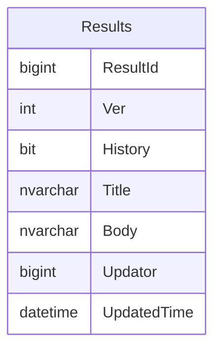
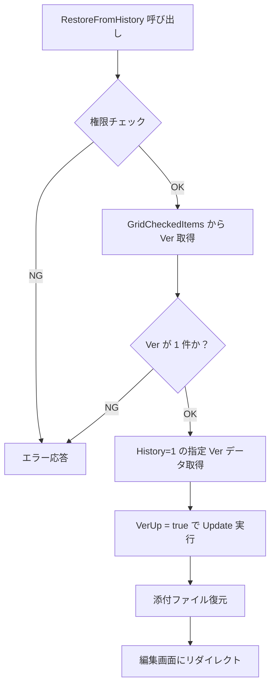
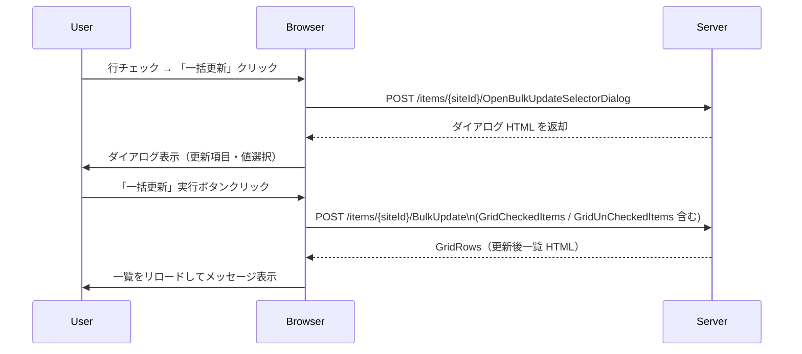
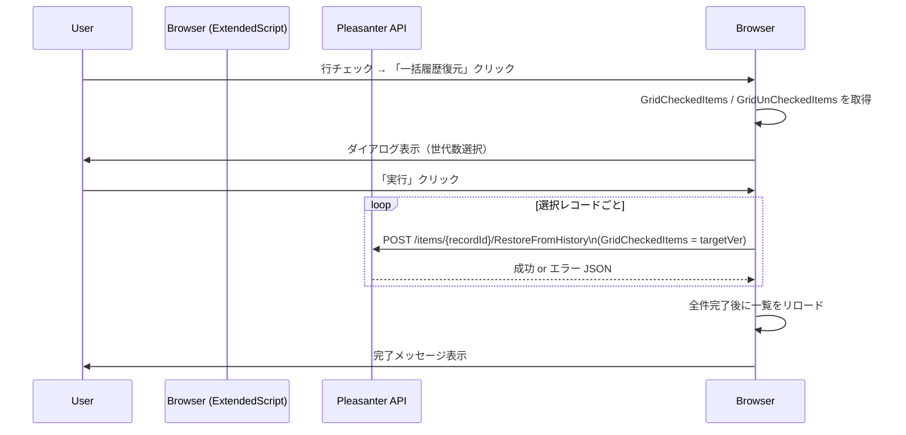

# 一覧画面 一括履歴復元拡張

一覧画面に「一括履歴復元」ボタンを追加し、チェックボックスで選択した複数レコードを直前バージョンへ一括で復元する拡張機能の設計をまとめる。
UI・動作は既存の「一括更新」と同じスタイルとし、ExtendedScript と ExtendedHTML を組み合わせて実装する。
拡張 SQL によるダイレクト SQL 復元方式も代替案として記述する。

<!-- START doctoc generated TOC please keep comment here to allow auto update -->
<!-- DON'T EDIT THIS SECTION, INSTEAD RE-RUN doctoc TO UPDATE -->

- [調査情報](#調査情報)
- [調査目的](#調査目的)
- [既存アーキテクチャの分析](#既存アーキテクチャの分析)
    - [履歴管理の仕組み](#履歴管理の仕組み)
    - [1 件ずつの履歴復元（RestoreFromHistory）](#1-件ずつの履歴復元restorefromhistory)
    - [一括更新の仕組み](#一括更新の仕組み)
    - [チェックボックス選択の仕組み](#チェックボックス選択の仕組み)
    - [拡張 SQL のトリガー一覧](#拡張-sql-のトリガー一覧)
- [拡張機能による一括履歴復元の設計](#拡張機能による一括履歴復元の設計)
    - [設計方針](#設計方針)
    - [UI 設計](#ui-設計)
    - [処理フロー](#処理フロー)
- [実装設計 — 方式 A（ExtendedScript + 逐次 API 呼び出し）](#実装設計--方式-aextendedscript--逐次-api-呼び出し)
    - [前提条件](#前提条件)
    - [ExtendedHtml の設定（ダイアログ HTML）](#extendedhtml-の設定ダイアログ-html)
    - [ExtendedScript の設定（JavaScript）](#extendedscript-の設定javascript)
    - [拡張ファイルの配置](#拡張ファイルの配置)
    - [ExtendedHtml の JSON 設定ファイル例](#extendedhtml-の-json-設定ファイル例)
    - [ExtendedScript の JSON 設定ファイル例](#extendedscript-の-json-設定ファイル例)
- [実装設計 — 方式 B（ExtendedSQL ダイレクト復元）](#実装設計--方式-bextendedsql-ダイレクト復元)
    - [前提条件と制約](#前提条件と制約)
    - [ダイレクト SQL（SQL Server）](#ダイレクト-sqlsql-server)
    - [ExtendedSQL の JSON 設定ファイル例](#extendedsql-の-json-設定ファイル例)
    - [方式 B 利用時の追加 ExtendedScript](#方式-b-利用時の追加-extendedscript)
- [方式比較](#方式比較)
- [制約事項と注意点](#制約事項と注意点)
- [結論](#結論)
- [関連ソースコード](#関連ソースコード)
- [関連ドキュメント](#関連ドキュメント)

<!-- END doctoc generated TOC please keep comment here to allow auto update -->

## 調査情報

| 調査日       | リポジトリ | ブランチ | タグ/バージョン    | コミット     | 備考     |
| ------------ | ---------- | -------- | ------------------ | ------------ | -------- |
| 2026年4月8日 | Pleasanter | main     | Pleasanter_1.5.2.0 | `46471ef5f1` | 初回調査 |

対象ファイル:
`Implem.Pleasanter/Models/Results/ResultUtilities.cs`,
`Implem.Pleasanter/Controllers/ItemsController.cs`,
`Implem.Pleasanter/Libraries/HtmlParts/HtmlCommands.cs`,
`Implem.Pleasanter/Libraries/HtmlParts/HtmlHistoryCommands.cs`,
`Implem.Pleasanter/Libraries/HtmlParts/HtmlBulkUpdate.cs`,
`Implem.PleasanterFrontend/wwwroot/src/scripts/generals/bulkupdate.js`,
`Implem.PleasanterFrontend/wwwroot/src/scripts/generals/gridevents.js`,
`Implem.Pleasanter/App_Data/Definitions/Definition_Code/Rds_ExtendedSql_Body.txt`

---

## 調査目的

- 一覧画面に「一括更新」と同じ操作スタイルで「一括履歴復元」ボタンを追加する方法を明確にする
- ExtendedScript・ExtendedHtml・ExtendedSQL のみを使用した純粋な拡張機能として実装できるかを確認する
- 実装方式を複数提示し、それぞれの制約・トレードオフを整理する

---

## 既存アーキテクチャの分析

### 履歴管理の仕組み

プリザンターは更新のたびに旧バージョンを同一テーブル（`Results` など）内に残す。
`History` フラグ（`0` = 最新版 / `1` = 過去版）と `Ver` 連番でバージョンを管理する。

| 列名          | 説明                                |
| ------------- | ----------------------------------- |
| `ResultId`    | レコード固有 ID（全バージョン共通） |
| `Ver`         | 1 から始まる連番。更新のたびに +1   |
| `History`     | `0` = 現行版（最新）、`1` = 履歴版  |
| `Updator`     | 最終更新者                          |
| `UpdatedTime` | 最終更新日時                        |



同一 `ResultId` に対してレコードが複数行存在し、`Ver` 最大かつ `History = 0` の行が現行版である。

### 1 件ずつの履歴復元（RestoreFromHistory）

編集画面の「履歴」タブから呼び出すコア機能。

**コントローラー**（`ItemsController.cs`）:

```text
POST /items/{resultId}/RestoreFromHistory
```

フォームパラメーター `GridCheckedItems` に **バージョン番号（Ver 値）を 1 つだけ** カンマ区切りで指定する。
2 つ以上指定すると `Error.Types.SelectOne` エラーが返る。

**サーバーサイド**（`ResultUtilities.cs`）の処理フロー:



### 一括更新の仕組み

一覧の「一括更新」ボタンは `HtmlCommands.cs` で描画され、以下のフローで動作する。



関連ボタンの描画条件（`HtmlCommands.cs`）:

```csharp
.Button(
    controlId: "OpenBulkUpdateSelectorDialogCommand",
    text: Displays.BulkUpdate(context: context),
    controlCss: "button-icon button-positive",
    onClick: "$p.openBulkUpdateSelectorDialog($(this));",
    action: "OpenBulkUpdateSelectorDialog",
    method: "post",
    _using: context.CanUpdate(ss: ss)
        && ss.GetAllowBulkUpdateOptions(context: context)?.Any() == true
        && !readOnly)
```

### チェックボックス選択の仕組み

`gridevents.js` がグリッドのチェックボックス状態を `GridCheckedItems` / `GridUnCheckedItems` としてフォームデータに格納する。

| フォームキー         | 値                                                  |
| -------------------- | --------------------------------------------------- |
| `GridCheckedItems`   | チェック済み行の `data-id` をカンマ区切り           |
| `GridUnCheckedItems` | 「全選択」時に未チェックの `data-id` をカンマ区切り |

バルクアクションのサーバー処理はこの値を使って対象 ID を特定する。

### 拡張 SQL のトリガー一覧

`ExtendedSql` が提供するトリガーのうち、一括操作に関わるもの:

| トリガー名       | 発火タイミング                       |
| ---------------- | ------------------------------------ |
| `OnBulkUpdating` | 一括更新 開始前（全件まとめて 1 回） |
| `OnBulkUpdated`  | 一括更新 完了後（全件まとめて 1 回） |
| `OnBulkDeleting` | 一括削除 開始前                      |
| `OnBulkDeleted`  | 一括削除 完了後                      |
| `OnUpdating`     | 1 件更新 開始前（レコードごと）      |
| `OnUpdated`      | 1 件更新 完了後（レコードごと）      |

`OnBulkUpdating` / `OnBulkUpdated` では `{SiteId}`・`{UserId}` プレースホルダーのみ利用可能であり、
**選択した ID リストは SQL 内で直接参照できない**（後述の制約）。

---

## 拡張機能による一括履歴復元の設計

### 設計方針

| 要件                         | 採用方針                                                                          |
| ---------------------------- | --------------------------------------------------------------------------------- |
| プリザンターコアを改修しない | ExtendedScript / ExtendedHtml のみで UI を追加する                                |
| チェックボックス動作         | 既存の `GridCheckedItems` / `GridUnCheckedItems` をそのまま流用する               |
| 復元バージョン               | 「直前の 1 バージョン前」をデフォルトとし、ダイアログで N 世代前も選択可能にする  |
| 権限                         | 更新権限（`CanUpdate`）があるユーザーのみ実行できる。権限チェックはサーバーが担う |
| 添付ファイル・通知           | 方式 A（コア API 経由）はコアの処理が走るため自動的に対応。方式 B（SQL）は対象外  |

### UI 設計

一覧画面のコマンドエリアに「一括更新」ボタンの直後に「一括履歴復元」ボタンを配置する。


クリックすると jQuery UI ダイアログが開き、復元する世代数を選択してから実行する。

**ダイアログのワイヤーフレーム**:

```text
┌─────────────────────────────────────┐
│  一括履歴復元                         │
├─────────────────────────────────────┤
│  復元バージョン                        │
│  ┌────────────────────────────────┐  │
│  │ ▼  1 つ前のバージョンに復元    │  │
│  └────────────────────────────────┘  │
│                                       │
│  ⚠ 選択した N 件を復元します。        │
│     この操作は元に戻せません。         │
│                                       │
│       [実行]         [キャンセル]      │
└─────────────────────────────────────┘
```

### 処理フロー



---

## 実装設計 — 方式 A（ExtendedScript + 逐次 API 呼び出し）

### 前提条件

- `Parameters.History.Restore` が `true`（デフォルト `true`）
- 対象テーブルの `AllowRestoreHistories` が `false` になっていないこと
- 実行ユーザーが対象サイトの更新権限を持つこと

### ExtendedHtml の設定（ダイアログ HTML）

**ファイル**: `App_Data/Parameters/ExtendedHtmls/bulk-restore-history-dialog.html`

```html
<div id="BulkRestoreHistoryDialog" title="一括履歴復元" style="display: none">
    <p id="BulkRestoreHistoryMessage"></p>
    <label for="BulkRestoreHistoryOffset">復元バージョン</label>
    <select id="BulkRestoreHistoryOffset">
        <option value="1">1 つ前のバージョンに復元</option>
        <option value="2">2 つ前のバージョンに復元</option>
        <option value="3">3 つ前のバージョンに復元</option>
    </select>
    <p class="message-dialog"></p>
</div>
```

### ExtendedScript の設定（JavaScript）

**ファイル**: `App_Data/Parameters/ExtendedScripts/bulk-restore-history.js`

```javascript
$(function () {
    // 一覧画面（index）のみ適用
    if ($('#Grid').length === 0) return;

    // ─── ボタン追加 ────────────────────────────────────────────────
    var $btn = $('<button>')
        .attr('id', 'BulkRestoreHistoryCommand')
        .addClass('button-icon button-positive')
        .text('一括履歴復元')
        .css('margin-left', '4px');

    // 一括更新ボタンの直後に挿入。なければコマンドエリア末尾に追加
    var $anchor = $('#OpenBulkUpdateSelectorDialogCommand');
    if ($anchor.length) {
        $anchor.after($btn);
    } else {
        $('.command-left').append($btn);
    }

    // ─── ダイアログ初期化 ──────────────────────────────────────────
    $('#BulkRestoreHistoryDialog').dialog({
        autoOpen: false,
        modal: true,
        width: 400,
        resizable: false,
        buttons: {
            実行: function () {
                executeBulkRestore();
            },
            キャンセル: function () {
                $(this).dialog('close');
            },
        },
    });

    // ─── ボタンクリック → ダイアログ表示 ──────────────────────────
    $(document).on('click', '#BulkRestoreHistoryCommand', function () {
        var checkedIds = getCheckedIds();
        if (checkedIds.length === 0) {
            alert('復元するレコードを 1 件以上選択してください。');
            return;
        }
        $('#BulkRestoreHistoryMessage').text(
            '選択した ' + checkedIds.length + ' 件のレコードを復元します。\nこの操作は取り消せません。'
        );
        $('#BulkRestoreHistoryDialog').dialog('open');
    });

    // ─── 選択 ID 取得（一括更新と同じ仕組みを流用） ───────────────
    function getCheckedIds() {
        var data = $p.getData($('.main-form'));
        if ($('#GridCheckAll').prop('checked')) {
            // 「全選択」状態: 一覧の全 data-id を取得し unchecked を除外
            var unchecked = (data.GridUnCheckedItems || '').split(',').filter(Boolean);
            var all = $('.grid-check')
                .map(function () {
                    return $(this).attr('data-id');
                })
                .get();
            return all.filter(function (id) {
                return unchecked.indexOf(id) === -1;
            });
        } else {
            return (data.GridCheckedItems || '').split(',').filter(Boolean);
        }
    }

    // ─── 実行処理 ──────────────────────────────────────────────────
    function executeBulkRestore() {
        var $dialog = $('#BulkRestoreHistoryDialog');
        var offset = parseInt($('#BulkRestoreHistoryOffset').val(), 10);
        var checkedIds = getCheckedIds();
        var baseUrl = $('#BaseUrl').val(); // 例: /items/

        $dialog.dialog('close');

        // 各レコードに対して順次 API 呼び出し
        var results = { success: 0, failed: 0, errors: [] };

        function processNext(index) {
            if (index >= checkedIds.length) {
                // 全件完了: 一覧をリロード
                var msg =
                    results.success +
                    ' 件を復元しました。' +
                    (results.failed > 0 ? results.failed + ' 件が失敗しました。' : '');
                // 一覧を再描画（既存の Index アクションを再送信）
                $p.ajax(baseUrl.replace(/\/items\/$/, '/items/' + $('#ReferenceId').val()), 'post', {}, function () {
                    // コールバック後にメッセージを表示
                    $p.setMessage('.main-message', msg, 'success');
                });
                return;
            }

            var recordId = checkedIds[index];

            // Step 1: 対象レコードの現行 Ver を取得
            $.ajax({
                url: baseUrl + recordId,
                type: 'POST',
                data: { Action: 'Histories' },
                dataType: 'json',
                success: function (historyResponse) {
                    // HistoriesTableBody の HTML から target Ver を取得するより
                    // 直接 API GET でレコードを取得して Ver を読む
                    var targetVer = getTargetVer(historyResponse, offset);
                    if (targetVer === null) {
                        results.failed++;
                        results.errors.push('ID ' + recordId + ': 復元対象の履歴が見つかりません');
                        processNext(index + 1);
                        return;
                    }
                    // Step 2: RestoreFromHistory 呼び出し
                    $.ajax({
                        url: baseUrl + recordId + '/RestoreFromHistory',
                        type: 'POST',
                        data: { GridCheckedItems: String(targetVer) },
                        dataType: 'json',
                        success: function () {
                            results.success++;
                            processNext(index + 1);
                        },
                        error: function () {
                            results.failed++;
                            results.errors.push('ID ' + recordId + ': 通信エラー');
                            processNext(index + 1);
                        },
                    });
                },
                error: function () {
                    results.failed++;
                    results.errors.push('ID ' + recordId + ': 履歴取得エラー');
                    processNext(index + 1);
                },
            });
        }

        processNext(0);
    }

    // 履歴応答から offset 世代前の Ver を取得するヘルパー
    // ※ Histories アクションの応答 HTML に含まれる data-ver 属性を解析する
    function getTargetVer(historyJson, offset) {
        if (!historyJson || !historyJson.Html) return null;
        var $html = $(historyJson.Html['#FieldSetHistories'] || '');
        // 履歴テーブルは Ver 降順で並んでいる
        // data-latest="1" が現行版。それより古い行（History 版）の offset 番目
        var $historyRows = $html.find('.grid-row[data-latest!="1"]');
        if ($historyRows.length < offset) return null;
        return parseInt($historyRows.eq(offset - 1).attr('data-ver'), 10);
    }
});
```

### 拡張ファイルの配置

```text
Implem.Pleasanter/App_Data/Parameters/
├── ExtendedHtmls/
│   ├── bulk-restore-history-dialog.json   ← HTML のメタ設定（後述）
│   └── bulk-restore-history-dialog.html   ← ダイアログ HTML
└── ExtendedScripts/
    ├── bulk-restore-history.json          ← Script のメタ設定（後述）
    └── bulk-restore-history.js            ← JavaScript
```

### ExtendedHtml の JSON 設定ファイル例

**ファイル**: `App_Data/Parameters/ExtendedHtmls/bulk-restore-history-dialog.json`

```json
{
    "SiteIdList": [12345],
    "Controllers": ["items"],
    "Actions": ["index"]
}
```

- `SiteIdList`: 対象サイト ID（複数サイトに適用する場合は配列に追加）
- `Actions`: `"index"` のみ（一覧画面に限定）

### ExtendedScript の JSON 設定ファイル例

**ファイル**: `App_Data/Parameters/ExtendedScripts/bulk-restore-history.json`

```json
{
    "SiteIdList": [12345],
    "Controllers": ["items"],
    "Actions": ["index"]
}
```

---

## 実装設計 — 方式 B（ExtendedSQL ダイレクト復元）

### 前提条件と制約

方式 B は `Results` テーブルを直接 SQL で操作する高度な方式である。
以下の制約があるため、適用には注意が必要。

| 制約事項                          | 詳細                                                                             |
| --------------------------------- | -------------------------------------------------------------------------------- |
| 添付ファイルは対象外              | バイナリテーブルへの処理が走らないため、添付ファイルの復元は行われない           |
| 通知・サーバースクリプトなし      | プリザンターの `Update` 処理を経由しないため通知やサーバースクリプトが発火しない |
| 選択 ID を SQL に渡す方法が限定的 | `OnBulkUpdating` の SQL プレースホルダーに ID リストを渡す手段がない             |
| VerUp の実装が複雑                | 履歴行の挿入処理が必要                                                           |

**選択 ID を SQL へ渡すための回避策**: ExtendedScript から選択 ID を URL パラメーターまたは一時テーブルに書き込む方法がないため、方式 B では「**全件 / 特定条件**」を WHERE 句で絞り込む形に限定される（例：特定のカラム値が一致する全レコード）。

### ダイレクト SQL（SQL Server）

`OnBulkUpdating` トリガーを利用して、直前バージョンのデータで現行レコードを上書きし、Ver をインクリメントする。

```sql
-- ① 現行レコードを履歴行としてコピー（Ver 変更なし、History を 1 に）
-- プリザンターの History 書き込みは UPDATE で行われる（INSERT ではない）
-- ※ Ver の管理上、直接 UPDATE のみで実装する

-- ② 現行レコードを直前履歴の値で上書き
UPDATE cur
SET
    cur.[Title]       = prev.[Title],
    cur.[Body]        = prev.[Body],
    -- 必要に応じてカスタムカラムを追加（ClassA, ClassB, NumA ...）
    cur.[Updator]     = {UserId},
    cur.[UpdatedTime] = GETUTCDATE(),
    cur.[Ver]         = cur.[Ver] + 1
FROM [dbo].[Results] cur
INNER JOIN [dbo].[Results] prev
    ON  prev.[ResultId] = cur.[ResultId]
    AND prev.[History]  = 1
    AND prev.[Ver] = (
        SELECT MAX(p2.[Ver])
        FROM [dbo].[Results] p2
        WHERE p2.[ResultId] = cur.[ResultId]
          AND p2.[History]  = 1
          AND p2.[Ver]      < cur.[Ver]
    )
WHERE cur.[SiteId]  = {SiteId}
  AND cur.[History] = 0
  -- 注意: ここでは全レコードが対象になる。
  -- 選択した ID のみに絞り込むには別途フィルター条件が必要
```

> **⚠ 注意**: 上記 SQL は `OnBulkUpdating` または `OnBulkUpdated` トリガーに設定するが、
> このトリガーは「一括更新」操作時にのみ発火する。一括履歴復元専用のボタンから直接呼び出すことは
> コアを改修しない限り不可能である。方式 B を採用する場合は、
> 「一括更新」の sentinel 値（ダミー項目の更新）をトリガーとして SQL を実行する設計が必要になる。

### ExtendedSQL の JSON 設定ファイル例

**ファイル**: `App_Data/Parameters/ExtendedSqls/bulk-restore-history.json`

```json
{
    "SiteIdList": [12345],
    "OnBulkUpdating": true,
    "CommandText": "-- 上記 SQL を記載"
}
```

**ファイル**: `App_Data/Parameters/ExtendedSqls/bulk-restore-history.sql`

```sql
-- SQL は CommandText に直接記述するか、.json.sql ファイルとして配置する
```

### 方式 B 利用時の追加 ExtendedScript

「一括更新」ダイアログから sentinel 値で発火させる場合、ExtendedScript から
一括更新の BulkUpdate エンドポイントに sentinel カラムと値を POST する。

```javascript
// ExtendedScript: 方式 B の場合のボタン処理
$(document).on('click', '#BulkRestoreHistoryCommand', function () {
    // 一括更新エンドポイントを利用して OnBulkUpdating SQL を発火させる
    // ※ 実際のフォームデータと組み合わせて POST
    $.ajax({
        url: $('#BaseUrl').val() + 'BulkUpdate',
        type: 'POST',
        data: {
            BulkUpdateColumnName: '_BulkRestoreHistory', // sentinel カラム名
            GridCheckedItems: $p.getData($('.main-form')).GridCheckedItems,
        },
        success: function (json) {
            // 一覧リロード
        },
    });
});
```

---

## 方式比較

| 比較項目                     | 方式 A（ExtendedScript + API）      | 方式 B（ExtendedSQL ダイレクト）    |
| ---------------------------- | ----------------------------------- | ----------------------------------- |
| コア改修の要否               | 不要                                | 不要                                |
| 添付ファイルの復元           | ✅ 対応（コア処理を通るため）       | ❌ 対応不可                         |
| 通知・サーバースクリプト発火 | ✅ 発火する                         | ❌ 発火しない                       |
| 選択 ID での絞り込み         | ✅ 個別呼び出しのため完全対応       | ❌ 困難（全件 or 条件絞り込みのみ） |
| パフォーマンス               | △ N 件 = N HTTP リクエスト          | ✅ 1 SQL で全件処理                 |
| 実装の複雑さ                 | △ JavaScript が複雑                 | △ SQL・sentinel 設計が複雑          |
| 推奨度                       | ✅ **推奨**（汎用性・安全性が高い） | ⚠ 添付なし・特定用途向け            |

---

## 制約事項と注意点

| 項目                            | 内容                                                                                                   |
| ------------------------------- | ------------------------------------------------------------------------------------------------------ |
| `Ver = 1` のレコード            | 最初のバージョンしか存在しないレコードは直前履歴がなく、復元処理がスキップされる                       |
| `AllowRestoreHistories = false` | サイト設定で復元を禁止しているサイトでは `RestoreFromHistory` がエラーを返す                           |
| `Parameters.History.Restore`    | システムパラメーターが `false` の場合、方式 A の API 呼び出しが全件失敗する                            |
| 大量レコードのパフォーマンス    | 方式 A で 100 件超を復元する場合、連続 POST により処理時間が長くなる                                   |
| CSRF トークン                   | `$p.ajax` は Pleasanter 組み込みの CSRF 対策（`__RequestVerificationToken`）を自動付与するため問題なし |
| Issues テーブルへの適用         | `Results` と同様に `Issues` テーブルにも同じ設計が適用できる                                           |

---

## 結論

| 項目                 | 結論                                                                                              |
| -------------------- | ------------------------------------------------------------------------------------------------- |
| 推奨実装方式         | **方式 A**（ExtendedScript + `POST /items/{id}/RestoreFromHistory` の逐次呼び出し）               |
| ボタン配置           | ExtendedScript で `#OpenBulkUpdateSelectorDialogCommand` の直後に動的追加                         |
| ダイアログ           | ExtendedHtml でダイアログ HTML を注入し、ExtendedScript で jQuery UI Dialog として初期化          |
| チェックボックス動作 | 既存の `GridCheckedItems` / `GridUnCheckedItems` をそのまま流用（一括更新と同一）                 |
| バージョン選択       | ダイアログの `<select>` で世代数（1〜3）を選択し、`Histories` レスポンス HTML から対象 Ver を特定 |
| 拡張 SQL の活用      | 方式 A では ExtendedSQL 不要。添付ファイル不要で大量件数対応が必要な場合のみ方式 B を検討する     |
| 適用範囲の制御       | JSON 設定ファイルの `SiteIdList` で対象テーブルを限定できる                                       |

---

## 関連ソースコード

| ファイル                                                                          | 関連内容                                           |
| --------------------------------------------------------------------------------- | -------------------------------------------------- |
| `Implem.Pleasanter/Models/Results/ResultUtilities.cs`                             | `RestoreFromHistory`, `Histories`, `BulkUpdate`    |
| `Implem.Pleasanter/Controllers/ItemsController.cs`                                | `RestoreFromHistory` HTTP エンドポイント           |
| `Implem.Pleasanter/Libraries/HtmlParts/HtmlCommands.cs`                           | 一覧コマンドエリアのボタン定義                     |
| `Implem.Pleasanter/Libraries/HtmlParts/HtmlHistoryCommands.cs`                    | 編集画面「履歴」タブのコマンドボタン               |
| `Implem.Pleasanter/Libraries/HtmlParts/HtmlBulkUpdate.cs`                         | 一括更新ダイアログ HTML                            |
| `Implem.PleasanterFrontend/wwwroot/src/scripts/generals/bulkupdate.js`            | `$p.openBulkUpdateSelectorDialog`, `$p.bulkUpdate` |
| `Implem.PleasanterFrontend/wwwroot/src/scripts/generals/gridevents.js`            | `GridCheckedItems` / `GridUnCheckedItems` 管理     |
| `Implem.Pleasanter/App_Data/Definitions/Definition_Code/Rds_ExtendedSql_Body.txt` | `OnBulkUpdatingExtendedSqls` 等の実装              |

---

## 関連ドキュメント

- [履歴タブ表示条件](../07-編集画面・モーダル/005-履歴タブ表示条件.md)
- [一覧セルアクションボタン](004-一覧セルアクションボタン.md)
- [拡張機能実装方式比較と改善方針](../15-拡張機能・多言語/004-拡張機能実装方式比較と改善方針.md)
- [拡張 SQL 実行権限・外部 DB 接続](../03-データ操作・API/003-拡張SQL・外部DB接続.md)
