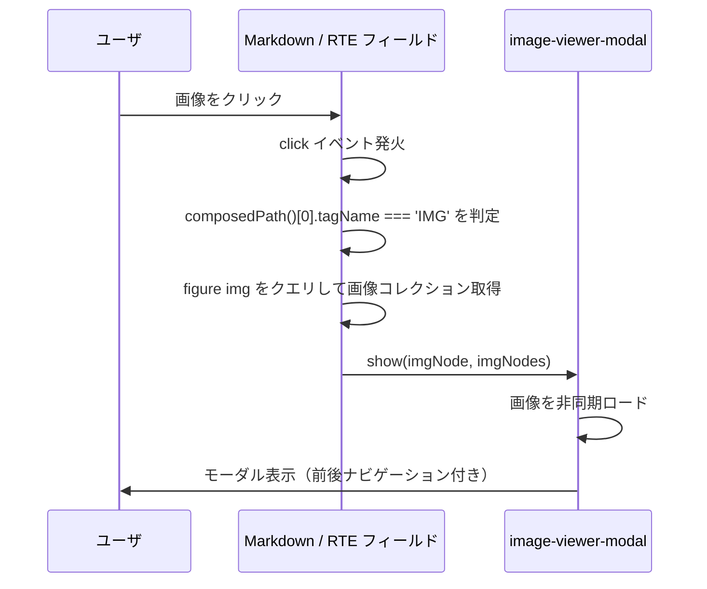
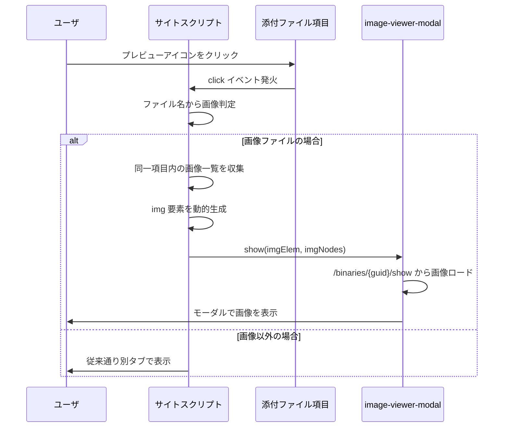
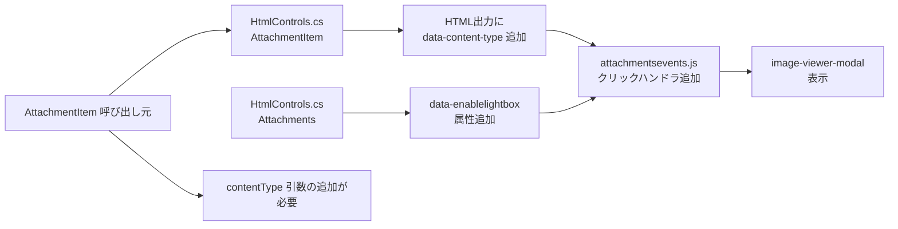

# 添付ファイル画像プレビューモーダル

添付ファイル項目に画像ファイルがアップロードされた際に、説明項目（Markdown / リッチテキスト）と同じ画像プレビューモーダルを表示する方法を調査した結果。

<!-- START doctoc generated TOC please keep comment here to allow auto update -->
<!-- DON'T EDIT THIS SECTION, INSTEAD RE-RUN doctoc TO UPDATE -->

- [調査情報](#調査情報)
- [調査目的](#調査目的)
- [現状の動作](#現状の動作)
    - [説明項目（Markdown / リッチテキスト）の画像プレビュー](#説明項目markdown--リッチテキストの画像プレビュー)
    - [添付ファイル項目の画像表示](#添付ファイル項目の画像表示)
- [画像プレビューモーダルの仕組み](#画像プレビューモーダルの仕組み)
    - [image-viewer-modal Web Component](#image-viewer-modal-web-component)
    - [EnableLightBox パラメータとテーマ世代による実装の違い](#enablelightbox-パラメータとテーマ世代による実装の違い)
    - [画像ファイルの判定](#画像ファイルの判定)
- [添付ファイルにプレビューモーダルを追加する方法](#添付ファイルにプレビューモーダルを追加する方法)
    - [方法1: スクリプトによるクリックイベントの差し替え（推奨）](#方法1-スクリプトによるクリックイベントの差し替え推奨)
    - [方法2: プリザンター本体の改修](#方法2-プリザンター本体の改修)
- [方法の比較](#方法の比較)
- [結論](#結論)
- [関連ソースコード](#関連ソースコード)

<!-- END doctoc generated TOC please keep comment here to allow auto update -->

## 調査情報

| 調査日       | リポジトリ | ブランチ | タグ/バージョン    | コミット     | 備考     |
| ------------ | ---------- | -------- | ------------------ | ------------ | -------- |
| 2026年3月2日 | Pleasanter | main     | Pleasanter_1.5.1.0 | `34f162a439` | 初回調査 |

## 調査目的

- 添付ファイル項目に画像ファイル（JPEG、PNG 等）を添付した場合、現状ではファイル名のリンクをクリックすると別タブで画像が表示される
- 説明項目（Markdown / リッチテキスト）に埋め込まれた画像にはプレビューモーダル（`<image-viewer-modal>`）が実装されているが、添付ファイル項目には同等のプレビューモーダルが存在しない
- 添付ファイルの画像に対しても同じプレビューモーダルを適用する方法を調査する

---

## 現状の動作

### 説明項目（Markdown / リッチテキスト）の画像プレビュー

説明項目では `Parameters.General.EnableLightBox` が `true`（デフォルト）の場合、画像クリック時に `<image-viewer-modal>` Web Component によるプレビューモーダルが表示される。



**主要ファイル**:

- `Implem.PleasanterFrontend/wwwroot/src/scripts/generals/modal/imageViewerModal.ts`
- `Implem.PleasanterFrontend/wwwroot/src/scripts/modules/markdownField/markdownField.ts`（行番号: 422-437）
- `Implem.PleasanterFrontend/wwwroot/src/scripts/modules/richTextEditor/richTextEditor.ts`（行番号: 404-418）

### 添付ファイル項目の画像表示

添付ファイル項目では、画像ファイルを含む全てのファイルが以下の形式でリスト表示される。

**ファイル**: `Implem.Pleasanter/Libraries/HtmlParts/HtmlControls.cs`（行番号: 1099-1147）

```csharp
private static HtmlBuilder AttachmentItem(
    this HtmlBuilder hb,
    Context context,
    string controlId = null,
    string guid = null,
    string css = null,
    string fileName = null,
    string displaySize = null,
    bool? added = null,
    bool? deleted = null,
    bool readOnly = false,
    bool allowDelete = true,
    bool _using = true)
{
    return _using
        ? hb.Div(
            id: guid,
            css: Css.Class("control-attachments-item ", css),
            action: () => hb
                .A(
                    attributes: new HtmlAttributes()
                        .Class("file-name")
                        .Href(Locations.ShowFile(
                            context: context,
                            guid: guid,
                            temp: added == true))
                        .Target("_blank"),
                    action: () => hb
                        .Span(css: "ui-icon ui-icon-circle-zoomin show-file"))
                .A(
                    attributes: new HtmlAttributes()
                        .Class("file-name")
                        .Href(Locations.DownloadFile(
                            context: context,
                            guid: guid,
                            temp: added == true)),
                    action: () => hb
                        .Text(text: fileName + "　(" + displaySize + ")"))
                .Div(/* 削除ボタン */))
         : hb;
}
```

生成される HTML 構造:

```html
<div id="{guid}" class="control-attachments-item">
    <!-- プレビューアイコン（別タブで開く） -->
    <a class="file-name" href="/binaries/{guid}/show" target="_blank">
        <span class="ui-icon ui-icon-circle-zoomin show-file"></span>
    </a>
    <!-- ダウンロードリンク -->
    <a class="file-name" href="/binaries/{guid}/download"> {ファイル名}　({サイズ}) </a>
    <!-- 削除ボタン -->
    <div class="ui-icon ui-icon-circle-close delete-file" ...></div>
</div>
```

現状のプレビューアイコン（虫眼鏡アイコン）をクリックすると、`/binaries/{guid}/show` が別タブ（`target="_blank"`）で開かれる。画像ファイルの場合はブラウザの別タブに画像が表示されるのみで、モーダルは使用されない。

---

## 画像プレビューモーダルの仕組み

### image-viewer-modal Web Component

プレビューモーダルは `<image-viewer-modal>` というカスタム要素（Web Component）として実装されている。

**ファイル**: `Implem.PleasanterFrontend/wwwroot/src/scripts/generals/modal/imageViewerModal.ts`

```typescript
export class ImageViewerModal extends HTMLElement {
    // Shadow DOM で独立した DOM ツリーを構築
    private shadow: ShadowRoot;
    private imgElem!: HTMLImageElement;
    private imgCurrent?: number;
    private imgCollection?: string[];

    // 画像を表示するメインメソッド
    show(node: HTMLImageElement, imageNodes?: NodeListOf<HTMLImageElement>) {
        // 画像コレクションが複数ある場合はナビゲーション付きで表示
        if (imageNodes && imageNodes.length > 1) {
            this.imgCurrent = Array.from(imageNodes).indexOf(node);
            this.imgCollection = Array.from(imageNodes).map((img) => img.src);
            // ...
        }
        this.imgDisplay(imgSrc, 1000);
    }
}

customElements.define('image-viewer-modal', ImageViewerModal);
```

主な機能:

| 機能             | 説明                                         |
| ---------------- | -------------------------------------------- |
| 画像表示         | `<ui-modal>` 内の `` 要素で画像を表示   |
| コレクション対応 | 複数画像の前後ナビゲーション（矢印キー対応） |
| ローディング表示 | 画像読み込み中にスピナーを表示               |
| サムネイル除去   | `?thumbnail` パラメータを除去して原寸表示    |
| Shadow DOM       | スタイルの分離による他要素への影響防止       |

### EnableLightBox パラメータとテーマ世代による実装の違い

画像プレビュー機能の有効/無効は `Parameters.General.EnableLightBox` パラメータで制御される。ただし、パラメータ名に「LightBox」を含むものの、実際のプレビュー機構はテーマ世代によって異なる。

**ファイル**: `Implem.ParameterAccessor/Parts/General.cs`（行番号: 124）

```csharp
public bool EnableLightBox { get; set; }
```

**ファイル**: `Implem.Pleasanter/App_Data/Parameters/General.json`（行番号: 104）

```json
"EnableLightBox": true
```

| テーマ世代                            | プレビュー機構                       | 説明                                                                            |
| ------------------------------------- | ------------------------------------ | ------------------------------------------------------------------------------- |
| 第1世代（blitzer, cupertino 等 25種） | Lightbox v2.11.4 jQuery プラグイン   | `lightbox.min.js` を読み込み、`a[data-lightbox]` 属性でトリガーする従来型の実装 |
| 第2世代（cerulean, green-tea 等 4種） | `<image-viewer-modal>` Web Component | Shadow DOM ベースのカスタム要素で、Markdown / RTE フィールドが生成・使用する    |

第2世代テーマでは Lightbox v2.11.4 プラグインは使用されておらず、代わりに `<image-viewer-modal>` Web Component がプレビュー表示を担う。
`EnableLightBox` パラメータは第2世代テーマにおいては `<image-viewer-modal>` の生成を制御するフラグとして機能する。

Markdown フィールドとリッチテキストエディタでは、`data-enablelightbox` 属性としてフロントエンドに渡される。

**ファイル**: `Implem.Pleasanter/Libraries/HtmlParts/HtmlControls.cs`（行番号: 335, 379）

```csharp
.Add("data-enablelightbox",
    Implem.DefinitionAccessor.Parameters.General.EnableLightBox ? "1" : "0")
```

第2世代テーマの Markdown / RTE フィールドは `data-enablelightbox="1"` の場合に `<image-viewer-modal>` 要素を生成し、画像クリック時に `show()` メソッドを呼び出す。

**ファイル**: `Implem.PleasanterFrontend/wwwroot/src/scripts/modules/markdownField/markdownField.ts`（行番号: 55-57）

```typescript
if (this.controller.dataset.enablelightbox === '1' && !MarkdownFieldElement.imageViewerModal) {
    MarkdownFieldElement.imageViewerModal = document.createElement('image-viewer-modal');
    document.body.appendChild(MarkdownFieldElement.imageViewerModal);
}
```

### 画像ファイルの判定

添付ファイルがブラウザで表示可能かどうかは `BinaryStorage.IsContentPreviewable()` で判定される。

**ファイル**: `Implem.ParameterAccessor/Parts/BinaryStorage.cs`（行番号: 75-85）

```csharp
public bool IsContentPreviewable(string contentType)
{
    if (string.IsNullOrEmpty(contentType)
        || BrowserAllowMimeTypes == null
        || BrowserAllowMimeTypes.Count == 0)
    {
        return false;
    }
    var lowerContentType = contentType.ToLower();
    return BrowserAllowMimeTypes.Any(
        allowMimeTypes => allowMimeTypes.ToLower() == lowerContentType);
}
```

**ファイル**: `Implem.Pleasanter/App_Data/Parameters/BinaryStorage.json`（行番号: 29-38）

```json
"BrowserAllowMimeTypes": [
    "application/pdf",
    "text/plain",
    "image/jpeg",
    "image/png",
    "image/gif",
    "image/webp"
]
```

---

## 添付ファイルにプレビューモーダルを追加する方法

### 方法1: スクリプトによるクリックイベントの差し替え（推奨）

サイトスクリプトまたは拡張スクリプトを使用して、添付ファイルのプレビューアイコン（`.show-file`）のクリック動作を差し替え、画像ファイルの場合にモーダルを表示する方法。プリザンター本体のコード改修が不要。

#### 実装コード

```javascript
$(function () {
    // image-viewer-modal 要素が存在しない場合は作成
    if (!document.querySelector('image-viewer-modal')) {
        document.body.appendChild(document.createElement('image-viewer-modal'));
    }
    var modal = document.querySelector('image-viewer-modal');

    // 画像ファイルの拡張子パターン
    var imageExtensions = /\.(jpe?g|png|gif|webp|bmp|svg)$/i;

    // 添付ファイルのプレビューアイコンのクリックイベントを差し替え
    $(document).on('click', '.control-attachments-item .show-file', function (e) {
        e.preventDefault();
        e.stopPropagation();
        var $item = $(this).closest('.control-attachments-item');
        // ファイル名を取得して画像かどうか判定
        var fileName = $item.find('.file-name').last().text().trim();
        if (!imageExtensions.test(fileName)) {
            // 画像でない場合は従来通り別タブで開く
            window.open($(this).closest('a').attr('href'), '_blank');
            return;
        }
        // 画像 URL を取得（/binaries/{guid}/show）
        var imgSrc = $(this).closest('a').attr('href');
        // 同一添付ファイル項目内の全画像ファイルを収集
        var $container = $item.closest('.control-attachments-items');
        var imgNodes = [];
        var currentIndex = 0;
        $container.find('.control-attachments-item').each(function (index) {
            var fn = $(this).find('.file-name').last().text().trim();
            if (imageExtensions.test(fn)) {
                if ($(this).attr('id') === $item.attr('id')) {
                    currentIndex = imgNodes.length;
                }
                imgNodes.push($(this).find('.show-file').closest('a').attr('href'));
            }
        });
        // img 要素を動的に生成して show() を呼び出す
        var imgElem = document.createElement('img');
        imgElem.src = imgSrc;
        if (imgNodes.length > 1) {
            // 複数画像のコレクションナビゲーション用に NodeList 相当を構築
            var tempDiv = document.createElement('div');
            imgNodes.forEach(function (src) {
                var img = document.createElement('img');
                img.src = src;
                var figure = document.createElement('figure');
                figure.appendChild(img);
                tempDiv.appendChild(figure);
            });
            var allImgs = tempDiv.querySelectorAll('figure img');
            modal.show(allImgs[currentIndex], allImgs);
        } else {
            modal.show(imgElem);
        }
    });
});
```

#### 設定手順

1. 対象テーブルの「テーブルの管理」を開く
2. 「スクリプト」タブを選択する
3. 上記コードをスクリプトとして登録する
4. 出力先は「編集」を選択する

#### 動作フロー



#### 注意事項

| 項目                        | 説明                                                                                                                                        |
| --------------------------- | ------------------------------------------------------------------------------------------------------------------------------------------- |
| `image-viewer-modal` の存在 | 第2世代テーマかつ `EnableLightBox: true` の環境では、Markdown / RTE フィールドが既にモーダル要素を生成済みの場合がある                      |
| 第1世代テーマ               | `<image-viewer-modal>` は第2世代テーマ（Svelte + Vite）のビルドで定義される Web Component のため、第1世代テーマでは利用できない可能性がある |
| ファイル名の判定            | MIME タイプではなく拡張子で判定しているため、拡張子なしのファイルには対応できない                                                           |
| アップロード直後            | アップロード直後のファイルは一時 URL（`/binaries/{guid}/showtemp`）を使用するため、アイコンの `href` が異なる点に注意                       |

### 方法2: プリザンター本体の改修

プリザンター本体のソースコードを改修して、添付ファイル項目に画像プレビューモーダルを組み込む方法。

#### 改修箇所の概要

##### 2-1. HtmlControls.cs: AttachmentItem メソッドの改修

添付ファイル項目の HTML 出力に `data-content-type` 属性を追加し、フロントエンドで MIME タイプを判定可能にする。

**ファイル**: `Implem.Pleasanter/Libraries/HtmlParts/HtmlControls.cs`

```csharp
private static HtmlBuilder AttachmentItem(
    this HtmlBuilder hb,
    Context context,
    string controlId = null,
    string guid = null,
    string css = null,
    string fileName = null,
    string displaySize = null,
    string contentType = null,  // 追加
    bool? added = null,
    bool? deleted = null,
    bool readOnly = false,
    bool allowDelete = true,
    bool _using = true)
{
    var isImage = !string.IsNullOrEmpty(contentType)
        && contentType.StartsWith("image/");
    return _using
        ? hb.Div(
            id: guid,
            css: Css.Class("control-attachments-item ", css),
            attributes: new HtmlAttributes()
                .Add("data-content-type", contentType ?? string.Empty),
            action: () => hb
                .A(
                    attributes: new HtmlAttributes()
                        .Class("file-name" + (isImage ? " attachment-image-preview" : ""))
                        .Href(Locations.ShowFile(
                            context: context,
                            guid: guid,
                            temp: added == true))
                        .Target(isImage ? null : "_blank"),
                    // ...
```

##### 2-2. フロントエンドの添付ファイル用プレビューハンドラ追加

`attachmentsevents.js` にプレビューモーダルのクリックハンドラを追加する。

```javascript
$(document).on('click', '.attachment-image-preview', function (e) {
    e.preventDefault();
    var modal = document.querySelector('image-viewer-modal');
    if (!modal) {
        window.open($(this).attr('href'), '_blank');
        return;
    }
    var imgSrc = $(this).attr('href');
    var imgElem = document.createElement('img');
    imgElem.src = imgSrc;
    modal.show(imgElem);
});
```

##### 2-3. Attachments コントロールの生成時に EnableLightBox を伝達

`HtmlControls.cs` の `Attachments` メソッドで `data-enablelightbox` 属性を追加する。

#### 改修影響範囲



| 改修対象ファイル                                        | 改修内容                                       |
| ------------------------------------------------------- | ---------------------------------------------- |
| `Implem.Pleasanter/Libraries/HtmlParts/HtmlControls.cs` | `AttachmentItem` に `contentType` 引数追加     |
| `Implem.Pleasanter/Libraries/HtmlParts/HtmlControls.cs` | `Attachments` に `data-enablelightbox` 追加    |
| `attachmentsevents.js`                                  | `.attachment-image-preview` のクリックハンドラ |
| `AttachmentItem` 呼び出し元                             | `contentType` パラメータの追加                 |

---

## 方法の比較

| 観点                     | 方法1: スクリプト                         | 方法2: 本体改修                          |
| ------------------------ | ----------------------------------------- | ---------------------------------------- |
| 導入コスト               | 低（スクリプト登録のみ）                  | 高（ソースコード改修・ビルド・テスト）   |
| 保守性                   | サイト単位で管理                          | 本体コードに統合                         |
| バージョンアップ耐性     | 高（スクリプトは独立）                    | 低（本体更新時にマージ必要）             |
| 画像判定精度             | 拡張子ベース                              | MIME タイプベース                        |
| 第1世代テーマ対応        | `image-viewer-modal` が利用可能な場合のみ | 同左                                     |
| 全サイトへの一括適用     | 拡張スクリプトで可能                      | 全サイトで自動的に有効                   |
| CodeDefiner 自動生成影響 | なし                                      | HtmlControls.cs は手動管理のため影響なし |

---

## 結論

| 項目          | 結論                                                                                       |
| ------------- | ------------------------------------------------------------------------------------------ |
| 推奨方法      | 方法1（スクリプトによるクリックイベント差し替え）                                          |
| 推奨理由      | プリザンター本体の改修が不要で、バージョンアップ時のマージコストを回避できる               |
| 前提条件      | 第2世代テーマかつ `EnableLightBox: true` の環境（`<image-viewer-modal>` が利用可能な状態） |
| 画像判定      | スクリプト方式では拡張子ベースの判定となるが、実用上は十分                                 |
| コレクション  | 同一添付ファイル項目内の複数画像に対して前後ナビゲーションが可能                           |
| 第1世代テーマ | `<image-viewer-modal>` が定義されていないため、Lightbox プラグインの利用や独自実装が必要   |
| 全サイト適用  | 拡張スクリプト（`App_Data/Parameters/ExtendedScripts/`）に配置すれば全サイトに適用可能     |

---

## 関連ソースコード

| ファイル                                                                                 | 概要                                       |
| ---------------------------------------------------------------------------------------- | ------------------------------------------ |
| `Implem.PleasanterFrontend/wwwroot/src/scripts/generals/modal/imageViewerModal.ts`       | `<image-viewer-modal>` Web Component 実装  |
| `Implem.PleasanterFrontend/wwwroot/src/scripts/generals/modal/imageViewerModal.scss`     | プレビューモーダルのスタイル               |
| `Implem.PleasanterFrontend/wwwroot/src/scripts/modules/markdownField/markdownField.ts`   | Markdown フィールドの画像プレビュー処理    |
| `Implem.PleasanterFrontend/wwwroot/src/scripts/modules/richTextEditor/richTextEditor.ts` | リッチテキストエディタの画像プレビュー処理 |
| `Implem.PleasanterFrontend/wwwroot/src/plugins/lightbox/lightbox.min.js`                 | Lightbox v2.11.4 プラグイン（第1世代用）   |
| `Implem.PleasanterFrontend/wwwroot/src/plugins/lightbox/lightbox.css`                    | Lightbox プラグインのスタイル              |
| `Implem.Pleasanter/Libraries/HtmlParts/HtmlControls.cs`                                  | 添付ファイル項目の HTML 生成               |
| `Implem.PleasanterFrontend/wwwroot/src/scripts/generals/attachments.js`                  | 添付ファイルのアップロード処理             |
| `Implem.PleasanterFrontend/wwwroot/src/scripts/generals/attachmentsevents.js`            | 添付ファイルのイベントハンドラ             |
| `Implem.Pleasanter/Libraries/Responses/Locations.cs`                                     | ShowFile / DownloadFile の URL 生成        |
| `Implem.Pleasanter/Controllers/BinariesController.cs`                                    | Show / Download アクション                 |
| `Implem.ParameterAccessor/Parts/General.cs`                                              | `EnableLightBox` パラメータ定義            |
| `Implem.ParameterAccessor/Parts/BinaryStorage.cs`                                        | `IsContentPreviewable` メソッド            |
