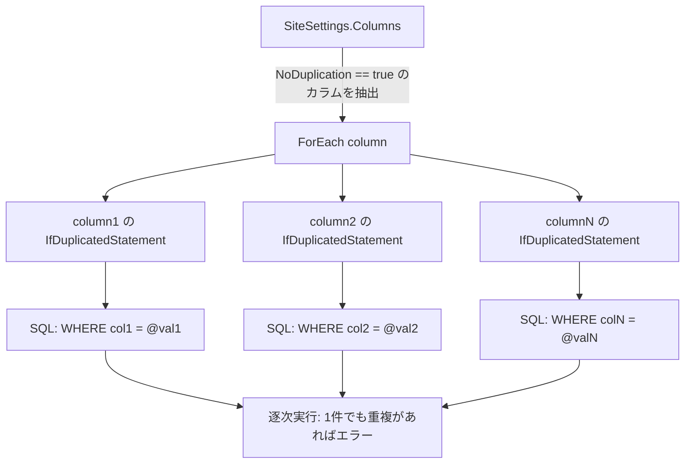
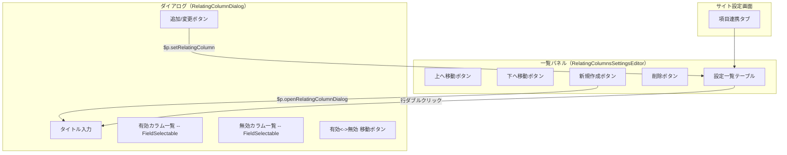
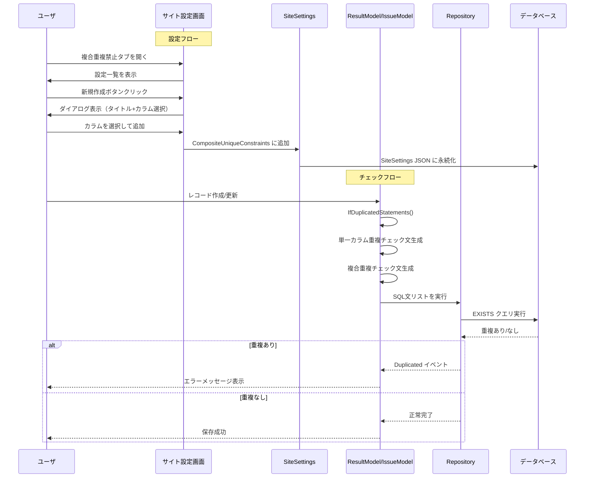
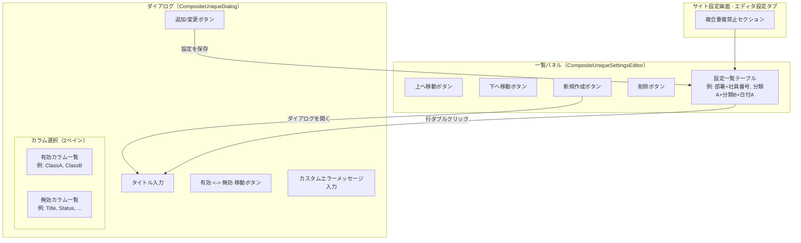

# 複合重複禁止（複数項目ユニーク制約）の実装方針

現行の重複禁止（NoDuplication）は単一項目でしか機能しないため、複数項目の組み合わせによるユニーク制約（複合重複禁止）を実現する方法を調査し、項目連携（RelatingColumn）の UI パターンを参考にした実装方針をまとめた。

<!-- START doctoc generated TOC please keep comment here to allow auto update -->
<!-- DON'T EDIT THIS SECTION, INSTEAD RE-RUN doctoc TO UPDATE -->

- [調査情報](#調査情報)
- [調査目的](#調査目的)
- [現行の重複禁止（NoDuplication）の仕組み](#現行の重複禁止noduplicationの仕組み)
    - [データモデル](#データモデル)
    - [SQL テンプレート](#sql-テンプレート)
    - [重複チェックの生成ロジック](#重複チェックの生成ロジック)
    - [SQL 実行とエラーハンドリング](#sql-実行とエラーハンドリング)
    - [現行アーキテクチャの制約](#現行アーキテクチャの制約)
- [項目連携（RelatingColumn）の UI パターン](#項目連携relatingcolumnの-ui-パターン)
    - [データモデル](#データモデル-1)
    - [設定一覧 UI（RelatingColumnsSettingsEditor）](#設定一覧-uirelatingcolumnssettingseditor)
    - [個別設定ダイアログ（RelatingColumnDialog）](#個別設定ダイアログrelatingcolumndialog)
    - [UI 構成図](#ui-構成図)
- [複合重複禁止の実装方針](#複合重複禁止の実装方針)
    - [新規データモデル](#新規データモデル)
    - [新規 SQL テンプレート](#新規-sql-テンプレート)
    - [重複チェックの拡張](#重複チェックの拡張)
    - [処理フロー](#処理フロー)
    - [UI 設計](#ui-設計)
- [改修箇所の一覧](#改修箇所の一覧)
    - [新規ファイル](#新規ファイル)
    - [変更ファイル](#変更ファイル)
    - [CodeDefiner の影響](#codedefiner-の影響)
- [既存機能との関係](#既存機能との関係)
    - [単一カラム重複禁止との共存](#単一カラム重複禁止との共存)
    - [API 対応](#api-対応)
    - [インポート・一括更新](#インポート一括更新)
- [結論](#結論)
- [関連ソースコード](#関連ソースコード)

<!-- END doctoc generated TOC please keep comment here to allow auto update -->

## 調査情報

| 調査日       | リポジトリ | ブランチ | タグ/バージョン    | コミット     | 備考     |
| ------------ | ---------- | -------- | ------------------ | ------------ | -------- |
| 2026年3月3日 | Pleasanter | main     | Pleasanter_1.5.1.0 | `34f162a439` | 初回調査 |

## 調査目的

- 現行の重複禁止（`NoDuplication`）は、カラム単位の `bool` フラグで制御されており、単一項目でしか重複チェックができない
- 「分類A + 分類B の組み合わせが重複しない」といった複合ユニーク制約を実現したい
- 項目連携（`RelatingColumn`）の複数カラム選択 UI を参考に、同様の操作体験で複合重複禁止を設定できる UI と実装方針を設計する

---

## 現行の重複禁止（NoDuplication）の仕組み

### データモデル

重複禁止は `Column` クラスの `bool?` フラグとして定義されている。

**ファイル**: `Implem.Pleasanter/Libraries/Settings/Column.cs`（行番号: 133-134）

```csharp
public bool? NoDuplication;
public string MessageWhenDuplicated;
```

`SiteSettings` の JSON シリアライズ/デシリアライズで永続化される。

### SQL テンプレート

重複チェックは `IfDuplicated` SQL テンプレートで実行される。

**ファイル**: `Implem.Pleasanter/App_Data/Definitions/Definition_Sql/IfDuplicated_Body.txt`

```sql
if exists(
    select *
    from "{0}"
    where
        "{0}"."SiteId"={1}
        and "{0}"."{4}"=@{4}_#CommandCount#
        and "{0}"."{2}"<>{3}
    )
begin;
    rollback;
    select '{{"Event":"Duplicated","Id":{3},"ColumnName":"{4}"}}';
    return;
end;
```

| パラメータ | 内容                 | 例         |
| ---------- | -------------------- | ---------- |
| `{0}`      | テーブル名           | `Results`  |
| `{1}`      | SiteId               | `12345`    |
| `{2}`      | IDカラム名           | `ResultId` |
| `{3}`      | 現在のレコードID     | `67890`    |
| `{4}`      | チェック対象カラム名 | `ClassA`   |

### 重複チェックの生成ロジック

各モデル（`ResultModel`・`IssueModel`）の `IfDuplicatedStatements` メソッドで、`NoDuplication == true` のカラムごとに個別の SQL 文を生成する。

**ファイル**: `Implem.Pleasanter/Models/Results/ResultModel.cs`（行番号: 2326-2420）

```csharp
private List<SqlStatement> IfDuplicatedStatements(SiteSettings ss)
{
    var statements = new List<SqlStatement>();
    ss.Columns
        .Where(column => column.NoDuplication == true)
        .ForEach(column =>
        {
            var param = new Rds.ResultsParamCollection();
            switch (column.ColumnName)
            {
                case "Title":
                    if (Title.Value != string.Empty)
                        statements.Add(column.IfDuplicatedStatement(
                            param.Title(Title.Value.MaxLength(1024)), SiteId, ResultId));
                    break;
                // ... 他のカラムも同様
                default:
                    switch (Def.ExtendedColumnTypes.Get(column?.ColumnName ?? string.Empty))
                    {
                        case "Class":
                            if (!GetClass(column: column).IsNullOrEmpty())
                                statements.Add(column.IfDuplicatedStatement(
                                    param: param.Add(
                                        columnBracket: $"\"{column.ColumnName}\"",
                                        name: column.ColumnName,
                                        value: GetClass(column: column).MaxLength(1024)),
                                    siteId: SiteId,
                                    referenceId: ResultId));
                            break;
                        // ... Num, Date, Description も同様
                    }
                    break;
            }
        });
    return statements;
}
```

### SQL 実行とエラーハンドリング

`Repository.cs` で `IfDuplicated` フラグ付きの SQL 文を逐次実行し、重複が検出された時点で即座にロールバック・エラーレスポンスを返す。

**ファイル**: `Implem.Pleasanter/Libraries/DataSources/Repository.cs`（行番号: 55-76）

```csharp
else if (statement.IfDuplicated)
{
    int exists = Rds.ExecuteScalar_int(
        context: context,
        dbTransaction: transaction,
        dbConnection: connection,
        statements: statement);
    if (exists > 0)
    {
        return (false, new List<SqlResponse> {
        new SqlResponse
        {
            DataTableName = statement.DataTableName,
            Event = "Duplicated",
            Id = 0,
            ColumnName = statement
                .SqlParamCollection
                .FirstOrDefault()?
                .Name,
        }});
    }
}
```

### 現行アーキテクチャの制約



| 制約                 | 説明                                                                                   |
| -------------------- | -------------------------------------------------------------------------------------- |
| 単一カラムのみ       | 各 SQL 文は 1 カラムの WHERE 条件しか持たない                                          |
| 独立した重複チェック | 複数カラムに `NoDuplication` を設定しても、各カラムが独立にチェックされる              |
| 複合ユニーク制約不可 | 「分類A + 分類B の組み合わせが重複しない」という条件は表現できない                     |
| カラム設定に依存     | 設定が `Column` クラスの一プロパティであるため、複数カラムの関係性を定義する場所がない |

---

## 項目連携（RelatingColumn）の UI パターン

項目連携は「複数カラムを選択してグループ化する」UI を持っており、複合重複禁止の設定 UI の参考になる。

### データモデル

**ファイル**: `Implem.Pleasanter/Libraries/Settings/RelatingColumn.cs`

```csharp
[Serializable]
public class RelatingColumn : ISettingListItem
{
    public int Id { get; set; }
    public string Title;
    public List<string> Columns;
    public Dictionary<string, string> ColumnsLinkedClass;
    // ...
    public void Update(string title, List<string> columns)
    {
        Title = title;
        Columns = columns;
    }
}
```

`SiteSettings` には `SettingList<RelatingColumn> RelatingColumns` として保持される。

### 設定一覧 UI（RelatingColumnsSettingsEditor）

**ファイル**: `Implem.Pleasanter/Models/Sites/SiteUtilities.cs`（行番号: 6759-6799）

サイト設定画面にリスト形式で表示され、上下移動・新規作成・削除のボタンを持つ。

```csharp
.FieldSet(id: "RelatingColumnsSettingsEditor",
    css: " enclosed",
    legendText: Displays.RelatingColumnSettings(context: context),
    action: () => hb
    .Div(css: "command-left", action: () => hb
        .Button(controlId: "MoveUpRelatingColumns", ...)
        .Button(controlId: "MoveDownRelatingColumns", ...)
        .Button(controlId: "NewRelatingColumn",
            onClick: "$p.openRelatingColumnDialog($(this));", ...)
        .Button(controlId: "DeleteRelatingColumns", ...))
    .EditRelatingColumns(context: context, ss: ss))
```

### 個別設定ダイアログ（RelatingColumnDialog）

**ファイル**: `Implem.Pleasanter/Models/Sites/SiteUtilities.cs`（行番号: 18616-18718）

タイトル入力 + 2 ペイン（有効/無効）のカラム選択 UI で構成される。

```csharp
public static HtmlBuilder RelatingColumnDialog(
    Context context, SiteSettings ss, string controlId, RelatingColumn relatingColumn)
{
    return hb.Form(...)
        .FieldTextBox(
            controlId: "RelatingColumnTitle",
            labelText: Displays.Title(context: context), ...)
        .FieldSet(
            legendText: Displays.RelatingColumnSettings(context: context),
            action: () => hb
                .FieldSelectable(
                    controlId: "RelatingColumnColumns",       // 有効カラム
                    labelText: Displays.CurrentSettings(context: context),
                    listItemCollection: ss.RelatingColumnSelectableOptions(...),
                    commandOptionAction: () => hb
                        .Button(controlId: "MoveUpRelatingColumnColumnsLocal", ...)
                        .Button(controlId: "MoveDownRelatingColumnColumnsLocal", ...)
                        .Button(controlId: "ToDisableRelatingColumnColumnsLocal", ...))
                .FieldSelectable(
                    controlId: "RelatingColumnSourceColumns", // 無効カラム
                    labelText: Displays.OptionList(context: context),
                    listItemCollection: ss.RelatingColumnSelectableOptions(..., enabled: false),
                    commandOptionAction: () => hb
                        .Button(controlId: "ToEnableRelatingColumnColumnsLocal", ...)))
        .Button(controlId: "AddRelatingColumn", ...)      // 追加ボタン
        .Button(controlId: "UpdateRelatingColumn", ...)    // 変更ボタン
        .Button(text: Displays.Cancel(...), ...);          // キャンセルボタン
}
```

### UI 構成図



---

## 複合重複禁止の実装方針

### 新規データモデル

項目連携の `RelatingColumn` と同じパターンで、複合重複禁止の設定を保持する `CompositeUniqueConstraint` クラスを新設する。

```csharp
[Serializable]
public class CompositeUniqueConstraint : ISettingListItem
{
    public int Id { get; set; }
    public string Title;                        // 管理用名称（例: "部署+社員番号"）
    public List<string> Columns;                // 対象カラム名リスト
    public string MessageWhenDuplicated;        // カスタムエラーメッセージ
    public bool? Disabled;                      // 一時無効化フラグ

    public CompositeUniqueConstraint GetRecordingData()
    {
        var data = new CompositeUniqueConstraint();
        data.Id = Id;
        data.Title = Title;
        if (Columns?.Any() == true) data.Columns = Columns;
        if (!MessageWhenDuplicated.IsNullOrEmpty())
            data.MessageWhenDuplicated = MessageWhenDuplicated;
        data.Disabled = Disabled;
        return data;
    }

    public void Update(string title, List<string> columns, string messageWhenDuplicated)
    {
        Title = title;
        Columns = columns;
        MessageWhenDuplicated = messageWhenDuplicated;
    }
}
```

`SiteSettings` への追加:

```csharp
public SettingList<CompositeUniqueConstraint> CompositeUniqueConstraints;
```

### 新規 SQL テンプレート

複数カラムの AND 条件を動的に生成する SQL テンプレートを追加する。

```sql
-- IfCompositeDuplicated テンプレート案
if exists(
    select *
    from "{TableName}"
    where
        "{TableName}"."SiteId"={SiteId}
        and "{TableName}"."{Column1}"=@{Column1}_#CommandCount#
        and "{TableName}"."{Column2}"=@{Column2}_#CommandCount#
        -- ... 動的に AND 条件を追加
        and "{TableName}"."{IdColumn}"<>{ReferenceId}
    )
begin;
    rollback;
    select '{{"Event":"CompositeDuplicated","Id":{ReferenceId},"Columns":"{Column1},{Column2}"}}';
    return;
end;
```

既存の `IfDuplicated` テンプレートは固定パラメータ数（5個）で設計されているため、可変数のカラムに対応する新テンプレートが必要になる。

実装方法としては、SQL テンプレートを使わずに `SqlStatement` を直接構築する方式が現実的:

```csharp
public SqlStatement IfCompositesDuplicatedStatement(
    CompositeUniqueConstraint constraint,
    SiteSettings ss,
    long siteId,
    long referenceId,
    SqlParamCollection param)
{
    var tableName = ss.ReferenceType;
    var idColumn = Rds.IdColumn(tableName);
    var whereColumns = constraint.Columns
        .Select(c => $"\"{tableName}\".\"{c}\"=@{c}_#CommandCount#")
        .Join(" and ");

    var sql = $@"
if exists(
    select *
    from ""{tableName}""
    where
        ""{tableName}"".""SiteId""={siteId}
        and {whereColumns}
        and ""{tableName}"".""{idColumn}""<>{referenceId}
    )
begin;
    rollback;
    select '{{""Event"":""Duplicated"",""Id"":{referenceId},""ColumnName"":""{constraint.Title}""}}';
    return;
end;";

    return new SqlStatement(sql, param) { IfDuplicated = true };
}
```

### 重複チェックの拡張

既存の `IfDuplicatedStatements` メソッドに複合重複禁止のチェックを追加する。

```csharp
private List<SqlStatement> IfDuplicatedStatements(SiteSettings ss)
{
    var statements = new List<SqlStatement>();

    // 既存: 単一カラムの重複禁止チェック（変更なし）
    ss.Columns
        .Where(column => column.NoDuplication == true)
        .ForEach(column => { /* 既存ロジック */ });

    // 新規: 複合重複禁止チェック
    ss.CompositeUniqueConstraints?
        .Where(c => c.Disabled != true && c.Columns?.Count >= 2)
        .ForEach(constraint =>
        {
            var param = new Rds.ResultsParamCollection();
            foreach (var columnName in constraint.Columns)
            {
                // カラム型に応じてパラメータを追加
                AddParamForColumn(param, ss, columnName);
            }
            statements.Add(IfCompositesDuplicatedStatement(
                constraint, ss, SiteId, ResultId, param));
        });

    return statements;
}
```

### 処理フロー



### UI 設計

項目連携の UI パターンを踏襲し、以下の構成とする。

#### サイト設定タブへの追加

エディタ設定タブ内に「複合重複禁止」セクションを追加する。

```csharp
// SiteUtilities.cs - EditorSettingsEditor 内
.FieldSet(id: "CompositeUniqueSettingsEditor",
    css: " enclosed",
    legendText: Displays.CompositeUniqueSettings(context: context),
    action: () => hb
    .Div(css: "command-left", action: () => hb
        .Button(controlId: "MoveUpCompositeUniques", ...)
        .Button(controlId: "MoveDownCompositeUniques", ...)
        .Button(controlId: "NewCompositeUnique",
            onClick: "$p.openCompositeUniqueDialog($(this));", ...)
        .Button(controlId: "DeleteCompositeUniques", ...))
    .EditCompositeUniques(context: context, ss: ss))
```

#### 設定ダイアログ

項目連携のダイアログと同じ 2 ペイン構成で、追加でエラーメッセージ入力欄を設ける。

```csharp
public static HtmlBuilder CompositeUniqueDialog(
    Context context, SiteSettings ss, string controlId,
    CompositeUniqueConstraint constraint)
{
    return hb.Form(...)
        // 管理用タイトル
        .FieldTextBox(
            controlId: "CompositeUniqueTitle",
            labelText: Displays.Title(context: context), ...)
        // カラム選択（2ペイン）
        .FieldSet(
            legendText: Displays.CompositeUniqueSettings(context: context),
            action: () => hb
                .FieldSelectable(
                    controlId: "CompositeUniqueColumns",       // 有効カラム
                    labelText: Displays.CurrentSettings(context: context), ...)
                .FieldSelectable(
                    controlId: "CompositeUniqueSourceColumns",  // 無効カラム
                    labelText: Displays.OptionList(context: context), ...))
        // カスタムエラーメッセージ
        .FieldTextBox(
            controlId: "CompositeUniqueMessage",
            labelText: Displays.MessageWhenDuplicated(context: context), ...)
        .Button(controlId: "AddCompositeUnique", ...)
        .Button(controlId: "UpdateCompositeUnique", ...)
        .Button(text: Displays.Cancel(...), ...);
}
```

#### UI 構成図



---

## 改修箇所の一覧

### 新規ファイル

| ファイル                                                              | 内容                     |
| --------------------------------------------------------------------- | ------------------------ |
| `Libraries/Settings/CompositeUniqueConstraint.cs`                     | データモデルクラス       |
| `App_Data/Definitions/Definition_Sql/IfCompositesDuplicated_Body.txt` | SQL テンプレート（任意） |
| `App_Data/Displays/CompositeUniqueSettings.json`                      | 表示リソース             |

### 変更ファイル

| ファイル                                                | 変更内容                                                      |
| ------------------------------------------------------- | ------------------------------------------------------------- |
| `Libraries/Settings/SiteSettings.cs`                    | `CompositeUniqueConstraints` プロパティ追加、シリアライズ対応 |
| `Models/Results/ResultModel.cs`                         | `IfDuplicatedStatements` に複合チェック追加                   |
| `Models/Issues/IssueModel.cs`                           | 同上                                                          |
| `Models/Sites/SiteUtilities.cs`                         | 設定 UI（一覧パネル・ダイアログ）追加                         |
| `Models/Sites/SiteModel.cs`                             | ダイアログ表示・設定保存のアクション追加                      |
| `Models/Sites/ApiSiteSettings/ColumnApiSettingModel.cs` | API 対応（任意）                                              |
| `Libraries/DataSources/Repository.cs`                   | 複合重複イベントのハンドリング（既存ロジック流用可）          |

### CodeDefiner の影響

`ResultModel.cs` と `IssueModel.cs` の `IfDuplicatedStatements` メソッドは `Implem.Pleasanter.CodeDefiner` によって自動生成されるコードである。コード定義テンプレートの以下のファイルを修正する必要がある。

| コード定義ファイル                              | 内容                                     |
| ----------------------------------------------- | ---------------------------------------- |
| `Model_IfDuplicatedStatements.json`             | 複合チェックの追加ロジック               |
| `Model_IfDuplicatedStatements_ColumnCases.json` | カラム型ごとのパラメータ生成（変更なし） |

---

## 既存機能との関係

### 単一カラム重複禁止との共存

| 項目             | 単一カラム NoDuplication             | 複合重複禁止 CompositeUniqueConstraint                  |
| ---------------- | ------------------------------------ | ------------------------------------------------------- |
| 設定場所         | カラム設定の「重複禁止」チェック     | サイト設定の専用セクション                              |
| 対象カラム数     | 1                                    | 2以上                                                   |
| データモデル     | `Column.NoDuplication` (bool?)       | `SiteSettings.CompositeUniqueConstraints` (SettingList) |
| SQL 生成         | `IfDuplicatedStatement` (1カラム)    | 複数カラムの AND 条件                                   |
| エラーメッセージ | `MessageWhenDuplicated` (カラム単位) | `MessageWhenDuplicated` (制約単位)                      |
| 無効化           | チェック外すだけ                     | `Disabled` フラグ                                       |

両方の設定が存在する場合、単一カラムの重複チェックが先に実行され、複合重複チェックが後に実行される。いずれかで重複が検出された時点でエラーとなる。

### API 対応

`SiteSettings` の JSON シリアライズに `CompositeUniqueConstraints` が含まれるため、API 経由でのサイト設定取得・更新でも自動的に対応される。個別の API エンドポイントの追加は不要。

### インポート・一括更新

`IfDuplicatedStatements` メソッドを共通で使用しているため、以下の操作でも自動的に複合重複チェックが適用される。

- CSV インポート
- 一覧画面での一括更新
- API 経由の Create / Update / Upsert

---

## 結論

| 項目               | 内容                                                                                   |
| ------------------ | -------------------------------------------------------------------------------------- |
| 実現可能性         | 既存アーキテクチャの拡張で実現可能                                                     |
| UI 設計            | 項目連携（RelatingColumn）の 2 ペインカラム選択ダイアログを踏襲                        |
| データモデル       | `CompositeUniqueConstraint` クラスを新設し、`SiteSettings` に `SettingList` として保持 |
| SQL チェック       | 複数カラムの AND 条件を持つ EXISTS クエリを動的生成                                    |
| 既存機能への影響   | 単一カラム重複禁止はそのまま維持、両方が共存可能                                       |
| CodeDefiner 対応   | `IfDuplicatedStatements` のコード定義テンプレート修正が必要                            |
| 主な改修ファイル数 | 新規 2-3 ファイル、変更 5-7 ファイル                                                   |

---

## 関連ソースコード

| ファイル                                                                      | 内容                                |
| ----------------------------------------------------------------------------- | ----------------------------------- |
| `Implem.Pleasanter/Libraries/Settings/Column.cs`                              | `NoDuplication` プロパティ定義      |
| `Implem.Pleasanter/Libraries/Settings/SiteSettings.cs`                        | サイト設定のカラム管理              |
| `Implem.Pleasanter/Libraries/Settings/RelatingColumn.cs`                      | 項目連携データモデル（UI 参考元）   |
| `Implem.Pleasanter/Models/Results/ResultModel.cs`                             | Results の重複チェック文生成        |
| `Implem.Pleasanter/Models/Issues/IssueModel.cs`                               | Issues の重複チェック文生成         |
| `Implem.Pleasanter/Models/Sites/SiteUtilities.cs`                             | サイト設定 UI（項目連携ダイアログ） |
| `Implem.Pleasanter/Libraries/DataSources/Repository.cs`                       | SQL 実行・重複検出ハンドリング      |
| `Implem.Pleasanter/App_Data/Definitions/Definition_Sql/IfDuplicated_Body.txt` | 重複チェック SQL テンプレート       |
