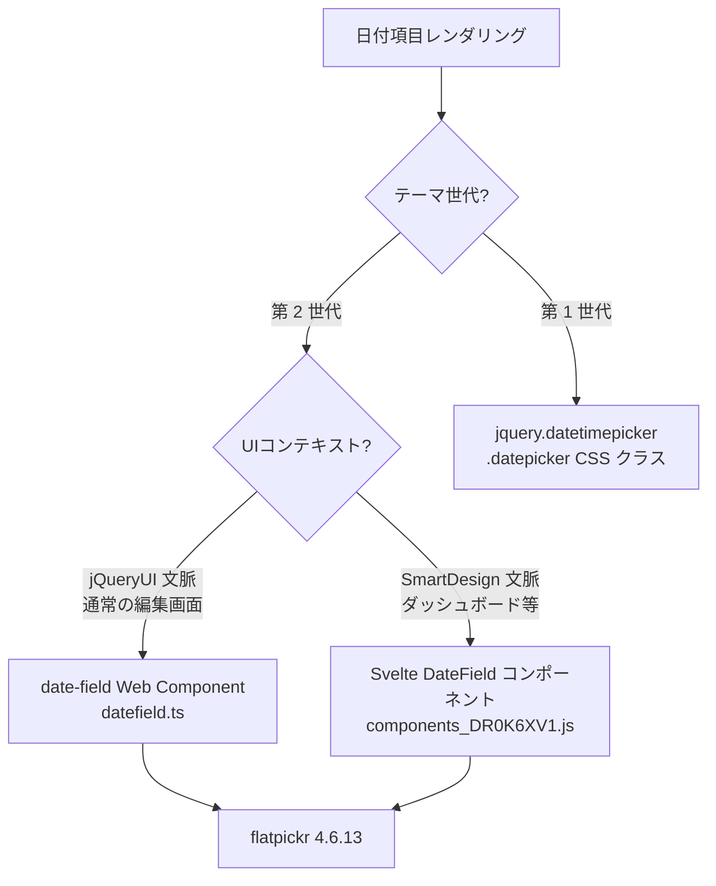
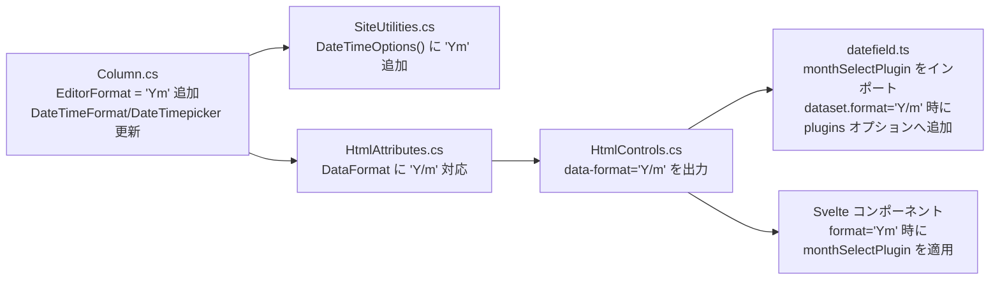
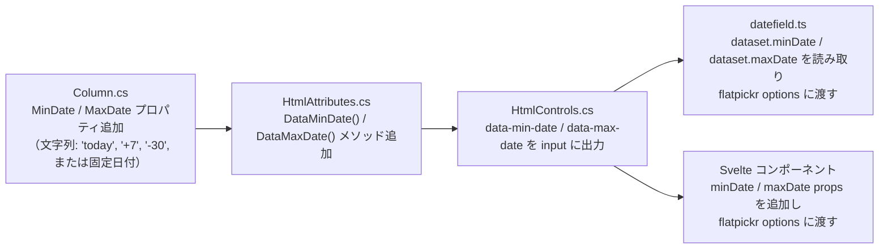

# 新 DatePicker の年月・年選択モードと日付範囲カスタマイズ

第 2 世代テーマ（SmartDesign）における新しい DatePicker（flatpickr ベース）で、年月選択・年選択モードを実現する方法、および今日から N 日前後までに入力可能日付を制限する方法を調査した結果。

<!-- START doctoc generated TOC please keep comment here to allow auto update -->
<!-- DON'T EDIT THIS SECTION, INSTEAD RE-RUN doctoc TO UPDATE -->

- [調査情報](#調査情報)
- [調査目的](#調査目的)
- [新 DatePicker のアーキテクチャ](#新-datepicker-のアーキテクチャ)
    - [テーマ世代による DatePicker の違い](#テーマ世代による-datepicker-の違い)
    - [第 2 世代テーマの DatePicker 実装](#第-2-世代テーマの-datepicker-実装)
    - [現行の EditorFormat と flatpickr オプションの対応](#現行の-editorformat-と-flatpickr-オプションの対応)
- [年月選択モード（Ym 形式）の実現方法](#年月選択モードym-形式の実現方法)
    - [monthSelectPlugin とは](#monthselectplugin-とは)
    - [実装に必要な変更箇所](#実装に必要な変更箇所)
- [年選択モード（Y 形式）の実現方法](#年選択モードy-形式の実現方法)
    - [flatpickr の年選択対応状況](#flatpickr-の年選択対応状況)
    - [実現アプローチの比較](#実現アプローチの比較)
    - [推奨アプローチ：カスタム onReady フック](#推奨アプローチカスタム-onready-フック)
- [日付範囲カスタマイズ（今日から N 日前後）](#日付範囲カスタマイズ今日から-n-日前後)
    - [flatpickr の minDate / maxDate オプション](#flatpickr-の-mindate--maxdate-オプション)
    - [fp_incr ヘルパー](#fp_incr-ヘルパー)
    - [現行実装での minDate / maxDate サポート状況](#現行実装での-mindate--maxdate-サポート状況)
    - [実装に必要な変更箇所](#実装に必要な変更箇所-1)
    - [disable / enable による個別日付の制御](#disable--enable-による個別日付の制御)
- [結論](#結論)
- [関連ソースコード](#関連ソースコード)

<!-- END doctoc generated TOC please keep comment here to allow auto update -->

## 調査情報

| 調査日       | リポジトリ | ブランチ | タグ/バージョン    | コミット     | 備考     |
| ------------ | ---------- | -------- | ------------------ | ------------ | -------- |
| 2026年3月6日 | Pleasanter | main     | Pleasanter_1.5.1.0 | `34f162a439` | 初回調査 |

## 調査目的

- 第 2 世代テーマで採用された新しい DatePicker（flatpickr 4.6.13）において、年月のみを選択するモードおよび年のみを選択するモードを実現できるか確認する
- 入力可能な日付を「今日から N 日前まで」「今日から N 日後まで」のように動的に制限する方法を調査する

---

## 新 DatePicker のアーキテクチャ

### テーマ世代による DatePicker の違い

| テーマ世代 | テーマ名                                | DatePicker ライブラリ                      |
| ---------- | --------------------------------------- | ------------------------------------------ |
| 第 1 世代  | blitzer, cupertino, dark-hive 等        | jquery.datetimepicker（jQuery プラグイン） |
| 第 2 世代  | cerulean, green-tea, mandarin, midnight | flatpickr 4.6.13                           |

テーマ世代の判定は `Context.ThemeVersionForCss()` で行われる。`>= 2.0M` が第 2 世代。

**ファイル**: `Implem.Pleasanter/Libraries/HtmlParts/HtmlControls.cs`（行番号: 113-114）

```csharp
case HtmlTypes.TextTypes.DateTime:
    return !Parameters.General.UseOldDatepicker && context.ThemeVersionForCss() >= 2.0M ?
        hb.DateField(     // 第 2 世代: <date-field> Web Component
            css: "date-field",
            ...
        )
        : hb.Div(         // 第 1 世代: .datepicker クラス付き <div>
            css: "date-field",
            ...
        );
```

`Parameters.General.UseOldDatepicker = true` にすると第 2 世代テーマでも旧 DatePicker に戻せる。

### 第 2 世代テーマの DatePicker 実装

第 2 世代テーマには**2 つの DatePicker 実装**が共存している。



#### date-field Web Component（jQueryUI 文脈）

**ファイル**: `Implem.PleasanterFrontend/wwwroot/src/scripts/modules/datefield.ts`

Shadow DOM ベースの Web Component として実装されている。flatpickr の初期化は `initDatePicker()` メソッドで行われる。

```typescript
private initDatePicker() {
    const fpOptions: Options = {
        locale: Object.assign({}, flatpickr.l10ns.default, InputDate.language === 'ja' ? Japanese : {}, {
            firstDayOfWeek: 1
        }),
        appendTo: dialog ? (dialog as HTMLElement) : document.body,
        positionElement: this.inputElm,
        enableTime: this.inputElm.dataset.timepicker === '1',
        enableSeconds: (this.inputElm.dataset.format && this.inputElm.dataset.format.includes(':s')) || false,
        minuteIncrement: Number(this.inputElm.dataset.step || 1),
        allowInput: !InputDate.isRwd ? true : false,
        disableMobile: true,
        dateFormat: this.dateFormat,
        // ...
    };
    this.dataPicker = flatpickr(this.inputElm as HTMLElement, fpOptions);
}
```

`<input>` 要素の `data-*` 属性から設定値を読み取る構造になっている。

#### Svelte コンポーネント（SmartDesign 文脈）

**ファイル**: `Implem.Pleasanter/wwwroot/components/components_DR0K6XV1.js`（ビルド済み）

SmartDesign のダッシュボードや新しい UI で使用される Svelte コンポーネント。コンポーネントの props として設定を受け取る。

| Prop          | 型      | 説明                             |
| ------------- | ------- | -------------------------------- |
| `model`       | 任意    | バインド値                       |
| `format`      | string  | `"Ymd"` / `"Ymdhm"` / `"Ymdhms"` |
| `step`        | number  | 分の刻み値                       |
| `diff`        | number  | 基準日からのオフセット（日数）   |
| `required`    | boolean | 必須検証                         |
| `readOnly`    | boolean | 読み取り専用                     |
| `placeholder` | string  | プレースホルダ                   |

### 現行の EditorFormat と flatpickr オプションの対応

**ファイル**: `Implem.Pleasanter/Libraries/Settings/Column.cs`（行番号: 1030-1053）

| EditorFormat | 意味       | enableTime | enableSeconds | dateFormat (ja) |
| ------------ | ---------- | :--------: | :-----------: | --------------- |
| `Ymd`        | 日付のみ   |   false    |     false     | `Y/m/d`         |
| `Ymdhm`      | 日時（分） |    true    |     false     | `Y/m/d H:i`     |
| `Ymdhms`     | 日時（秒） |    true    |     true      | `Y/m/d H:i:S`   |

年月のみ（`Ym`）や年のみ（`Y`）の `EditorFormat` は**現時点では定義されていない**。

---

## 年月選択モード（Ym 形式）の実現方法

### monthSelectPlugin とは

flatpickr 4.x には公式の `monthSelectPlugin` が付属している。このプラグインを使うと、カレンダーの代わりに 12 カ月のグリッドが表示され、年ナビゲーションと組み合わせて年月のみを選択できるようになる。

- パス: `flatpickr/dist/plugins/monthSelect/index.js`
- スタイル: `flatpickr/dist/plugins/monthSelect/style.css`

プラグインを有効にすると次のような UI になる。

```
        < 2025 >
   Jan  Feb  Mar
   Apr  May  Jun
   Jul  Aug  Sep
   Oct  Nov  Dec
```

使用例（TypeScript）：

```typescript
import monthSelectPlugin from 'flatpickr/dist/plugins/monthSelect';

flatpickr(input, {
    plugins: [
        monthSelectPlugin({
            shorthand: true, // 月名を短縮形で表示（Jan, Feb...）
            dateFormat: 'Y/m', // 選択値の形式
            altFormat: 'Y年m月', // 代替表示形式（altInput 使用時）
        }),
    ],
});
```

現行の vendor バンドル（`vendor_k0RsABuf.js`）には `monthSelectPlugin` が**含まれていない**。追加にはビルド設定の変更が必要。

### 実装に必要な変更箇所



**変更が必要なファイルの一覧：**

| ファイル                                                             | 変更内容                                                           |
| -------------------------------------------------------------------- | ------------------------------------------------------------------ |
| `Implem.Pleasanter/Libraries/Settings/Column.cs`                     | `DateTimeFormat()` / `DateTimepicker()` の switch に `"Ym"` を追加 |
| `Implem.Pleasanter/Models/Sites/SiteUtilities.cs`                    | `DateTimeOptions()` の配列に `"Ym"` を追加                         |
| `Implem.PleasanterFrontend/wwwroot/src/scripts/modules/datefield.ts` | `monthSelectPlugin` をインポート・適用                             |
| Svelte コンポーネントのソース                                        | `format="Ym"` 時に `monthSelectPlugin` を使用                      |
| `package.json`（フロントエンド）                                     | `monthSelectPlugin` が flatpickr 本体に含まれるため変更不要        |

**`Column.cs` の変更イメージ：**

```csharp
public string DateTimeFormat(Context context)
{
    switch (EditorFormat)
    {
        case "Ymdhm":
            return Displays.YmdhmDatePickerFormat(context: context);
        case "Ymdhms":
            return Displays.YmdhmsDatePickerFormat(context: context);
        case "Ym":                                              // 追加
            return Displays.YmDatePickerFormat(context: context); // 追加
        default:
            return Displays.YmdDatePickerFormat(context: context);
    }
}
```

**`datefield.ts` の変更イメージ：**

```typescript
import monthSelectPlugin from 'flatpickr/dist/plugins/monthSelect';

private initDatePicker() {
    const isMonthOnly = this.inputElm.dataset.format?.startsWith('Y/m') ?? false;
    const fpOptions: Options = {
        // ...既存オプション...
        plugins: isMonthOnly
            ? [monthSelectPlugin({ shorthand: false, dateFormat: this.dateFormat })]
            : [],
    };
    this.dataPicker = flatpickr(this.inputElm as HTMLElement, fpOptions);
}
```

---

## 年選択モード（Y 形式）の実現方法

### flatpickr の年選択対応状況

flatpickr 4.x には年のみを選択するための公式プラグインが**存在しない**。

標準機能で近いものは次のとおり：

- `noCalendar: true` → カレンダー部分を非表示にして時刻選択のみにする（年選択には使えない）
- `showMonths: N` → 複数月を同時表示（年選択には使えない）

年選択には独自実装が必要になる。

### 実現アプローチの比較

| アプローチ                      | 概要                                                                                   | 難易度 | 備考                                                 |
| ------------------------------- | -------------------------------------------------------------------------------------- | :----: | ---------------------------------------------------- |
| A. flatpickr カスタムプラグイン | `onReady` / `onOpen` フックでカレンダーの DOM を年グリッドに差し替え                   |   高   | flatpickr のバージョンアップ時に破綻するリスクがある |
| B. `<select>` 要素              | 年の選択を通常のドロップダウンで実装                                                   |   低   | 年範囲を固定またはパラメータで指定する必要がある     |
| C. 数値スピナー                 | 年を数値入力で受け付ける（`type="number"`）                                            |   低   | UI の統一感が失われる                                |
| D. flatpickr + CSS 非表示       | `onOpen` で月・日のセレクタと日付グリッドを CSS で非表示にし、年変更時に即選択確定する |   中   | DOM 操作に依存するため壊れやすい                     |

アプローチ B（`<select>` によるドロップダウン）が実装コスト・保守性のバランスが最も良い。プリザンター内部でもスピナー型（`control-spinner`）や数値型（`control-textbox`）の実績があり、年入力に転用しやすい。

### 推奨アプローチ：カスタム onReady フック

アプローチ A（flatpickr の DOM カスタマイズ）を採用する場合、`onReady` フックを使う実装例を示す。

```typescript
private initDatePicker() {
    const isYearOnly = this.inputElm.dataset.format === 'Y';
    const fpOptions: Options = {
        dateFormat: 'Y',
        onReady: (_dates, _str, instance) => {
            if (!isYearOnly) return;
            const cal = instance.calendarContainer;
            // 月・日グリッドを非表示
            (cal.querySelector('.flatpickr-innerContainer') as HTMLElement).style.display = 'none';
            // 月選択ドロップダウンを非表示
            (cal.querySelector('.flatpickr-current-month .flatpickr-monthDropdown-months') as HTMLElement).style.display = 'none';
        },
        onChange: (_dates, _str, instance) => {
            if (!isYearOnly) return;
            // 年が変わったら即座にピッカーを閉じる（年選択完了とみなす）
            instance.close();
        },
        onYearChange: (_dates, _str, instance) => {
            if (!isYearOnly) return;
            // 年変更を値として確定させる
            const year = instance.currentYear;
            this.inputElm!.value = String(year);
            instance.close();
        },
    };
}
```

この実装は flatpickr の内部 DOM 構造に依存するため、**flatpickr のバージョンアップで動作しなくなる可能性がある**点に注意する。

---

## 日付範囲カスタマイズ（今日から N 日前後）

### flatpickr の minDate / maxDate オプション

flatpickr は `minDate` / `maxDate` オプションで入力可能な日付範囲を制限できる。

| 値の形式            | 例                      | 説明                            |
| ------------------- | ----------------------- | ------------------------------- |
| 文字列（日付形式）  | `"2026/01/01"`          | 特定の日付以降・以前を制限      |
| `"today"`           | `"today"`               | 今日を基準日として設定          |
| `Date` オブジェクト | `new Date()`            | JavaScript の Date オブジェクト |
| `fp_incr` ヘルパー  | `new Date().fp_incr(7)` | 今日から 7 日後                 |

使用例：

```typescript
flatpickr(input, {
    minDate: 'today', // 今日以前の日付を選択不可
    maxDate: new Date().fp_incr(30), // 今日から 30 日後以降を選択不可
});
```

```typescript
flatpickr(input, {
    minDate: new Date().fp_incr(-30), // 今日から 30 日前以前を選択不可
    maxDate: 'today', // 今日以降を選択不可（過去のみ選択可）
});
```

### fp_incr ヘルパー

flatpickr は `Date.prototype.fp_incr` を追加する。

**ファイル**: `Implem.Pleasanter/wwwroot/components/vendor_k0RsABuf.js`（ビルド済み）

```javascript
Date.prototype.fp_incr = function (t) {
    return new Date(
        this.getFullYear(),
        this.getMonth(),
        this.getDate() + (typeof t === 'string' ? parseInt(t, 10) : t)
    );
};
```

- 正の値：今日から N 日後
- 負の値：今日から N 日前

### 現行実装での minDate / maxDate サポート状況

**`date-field` Web Component**（`datefield.ts`）および **Svelte コンポーネント**のいずれも、現時点で `minDate` / `maxDate` の flatpickr オプションを渡す仕組みを**持っていない**。

現行コードで日付関連として渡されている `data-*` 属性：

| data 属性           | 対応するファイル / メソッド                                 | 用途                          |
| ------------------- | ----------------------------------------------------------- | ----------------------------- |
| `data-format`       | `HtmlAttributes.DataFormat()`                               | 日付フォーマット文字列        |
| `data-timepicker`   | `HtmlAttributes.DataTimepicker()`                           | 時刻入力の有無（"1" or なし） |
| `data-step`         | `HtmlAttributes.DataStep()`                                 | 分の刻み値                    |
| `data-hide-current` | `HtmlAttributes.DataHideCurrent()` / `HtmlTags.DateField()` | 「現在時刻」ボタンの非表示    |

`data-min-date` / `data-max-date` の属性は定義・使用されていない。

### 実装に必要な変更箇所



**変更が必要なファイルの一覧：**

| ファイル                                                             | 変更内容                                                                    |
| -------------------------------------------------------------------- | --------------------------------------------------------------------------- |
| `Implem.Pleasanter/Libraries/Settings/Column.cs`                     | `MinDateStr` / `MaxDateStr` プロパティ追加（または既存 `Min`/`Max` の転用） |
| `Implem.Pleasanter/Libraries/Html/HtmlAttributes.cs`                 | `DataMinDate(string)` / `DataMaxDate(string)` メソッドを追加                |
| `Implem.Pleasanter/Libraries/HtmlParts/HtmlControls.cs`              | TextBox メソッドに `minDate` / `maxDate` パラメータを追加し属性を出力       |
| `Implem.PleasanterFrontend/wwwroot/src/scripts/modules/datefield.ts` | `dataset.minDate` / `dataset.maxDate` を読み取り flatpickr に渡す           |
| Svelte コンポーネントのソース                                        | `minDate` / `maxDate` props を追加                                          |

**`HtmlAttributes.cs` の変更イメージ：**

```csharp
public HtmlAttributes DataMinDate(string value, bool _using = true)
{
    if (!value.IsNullOrEmpty() && _using)
    {
        Add("data-min-date");
        Add(HttpUtility.HtmlAttributeEncode(value));
    }
    return this;
}

public HtmlAttributes DataMaxDate(string value, bool _using = true)
{
    if (!value.IsNullOrEmpty() && _using)
    {
        Add("data-max-date");
        Add(HttpUtility.HtmlAttributeEncode(value));
    }
    return this;
}
```

**`datefield.ts` の変更イメージ：**

```typescript
private parseDateConstraint(value: string | undefined): Date | string | undefined {
    if (!value) return undefined;
    if (value === 'today') return 'today';
    const n = parseInt(value, 10);
    if (!isNaN(n)) return new Date().fp_incr(n); // "+7" → 7日後, "-30" → 30日前
    return value; // "2026/01/01" など絶対日付はそのまま渡す
}

private initDatePicker() {
    const fpOptions: Options = {
        // ...既存オプション...
        minDate: this.parseDateConstraint(this.inputElm?.dataset.minDate),
        maxDate: this.parseDateConstraint(this.inputElm?.dataset.maxDate),
    };
    this.dataPicker = flatpickr(this.inputElm as HTMLElement, fpOptions);
}
```

**サーバーサイドでの設定値の例：**

| 設定値  | 意味                                                               |
| ------- | ------------------------------------------------------------------ |
| `today` | 今日のみ（minDate と maxDate 両方に設定すると今日だけ選択可能）    |
| `+7`    | 今日から 7 日後（maxDate に設定すると 7 日先まで選択可能）         |
| `-30`   | 今日から 30 日前（minDate に設定すると過去 30 日以内のみ選択可能） |
| `0`     | 今日（`"today"` と等価）                                           |

### disable / enable による個別日付の制御

flatpickr の `disable` / `enable` オプションを使うと特定の日付や曜日を個別に無効化・有効化できる。

```typescript
flatpickr(input, {
    // 特定日付を無効化
    disable: ['2026/12/29', '2026/12/30', '2026/12/31'],
    // または曜日で無効化（0=日, 6=土）
    disable: [(date: Date) => date.getDay() === 0 || date.getDay() === 6],
});
```

これらは `minDate` / `maxDate` より細かい制御が必要な場合に有効だが、サーバーサイドからの動的な渡し方（JSON 配列など）が別途必要になる。

---

## 結論

| 機能                            |         flatpickr 対応         | 現行実装サポート | 実装難易度 |
| ------------------------------- | :----------------------------: | :--------------: | :--------: |
| 年月選択（Ym 形式）             |  あり（`monthSelectPlugin`）   |       なし       |     中     |
| 年選択（Y 形式）                | プラグインなし（独自実装必要） |       なし       |     高     |
| minDate（今日以降のみ等）       |              あり              |       なし       |     低     |
| maxDate（今日まで等）           |              あり              |       なし       |     低     |
| 今日から N 日後（fp_incr）      |              あり              |       なし       |     低     |
| 特定日・曜日の無効化（disable） |              あり              |       なし       |     中     |

**年月選択モード（Ym）** は `monthSelectPlugin` を使うことで実現できる。必要な変更は `Column.cs`（EditorFormat 追加）・`datefield.ts` /
Svelte コンポーネント（プラグイン適用）・`SiteUtilities.cs`（選択肢追加）の計 4〜5 ファイルに留まり、変更コストは中程度。

**年選択モード（Y）** は flatpickr の公式サポートがなく、DOM 直接操作による独自実装が必要になるため保守コストが高い。`<select>` などの
標準コントロールへの差し替えか、数値型カラムで年を数値として入力させる代替策の方が現実的。

**minDate / maxDate による日付範囲制限** は flatpickr の標準機能として存在し、実装コストが低い。`data-min-date` / `data-max-date` 属性を
追加し、`datefield.ts` および Svelte コンポーネントに数行の変更を加えるだけで対応できる。サーバー側での設定値として `"today"`・`"+N"`・
`"-N"` 形式の相対表現と絶対日付文字列の両方をサポートする設計が推奨される。

---

## 関連ソースコード

| ファイル                                                             | 関連箇所                                               |
| -------------------------------------------------------------------- | ------------------------------------------------------ |
| `Implem.PleasanterFrontend/wwwroot/src/scripts/modules/datefield.ts` | `initDatePicker()` メソッド（flatpickr 初期化）        |
| `Implem.Pleasanter/Libraries/HtmlParts/HtmlControls.cs`              | 行 113-167（DatePicker の世代分岐）                    |
| `Implem.Pleasanter/Libraries/HtmlParts/HtmlTags.cs`                  | 行 813-832（`DateField()` 拡張メソッド）               |
| `Implem.Pleasanter/Libraries/Html/HtmlAttributes.cs`                 | 行 489-507（`DataFormat`, `DataTimepicker`）           |
| `Implem.Pleasanter/Libraries/Settings/Column.cs`                     | 行 1030-1053（`DateTimeFormat()`, `DateTimepicker()`） |
| `Implem.Pleasanter/Models/Sites/SiteUtilities.cs`                    | 行 8534-8548（`DateTimeOptions()`）                    |
| `Implem.Pleasanter/wwwroot/components/vendor_k0RsABuf.js`            | flatpickr 本体（ビルド済み）                           |
| `Implem.Pleasanter/wwwroot/components/components_DR0K6XV1.js`        | Svelte DateField コンポーネント（ビルド済み）          |
