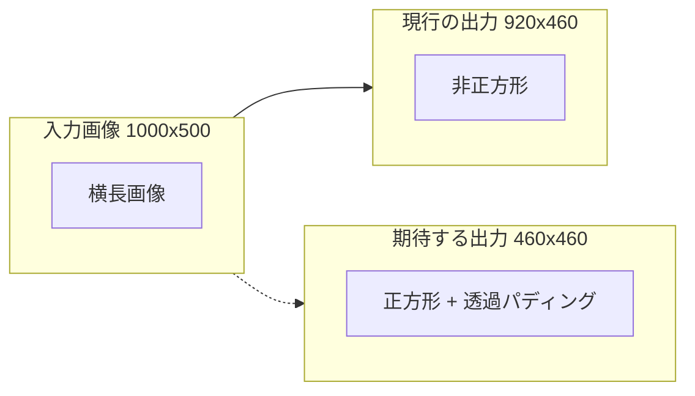
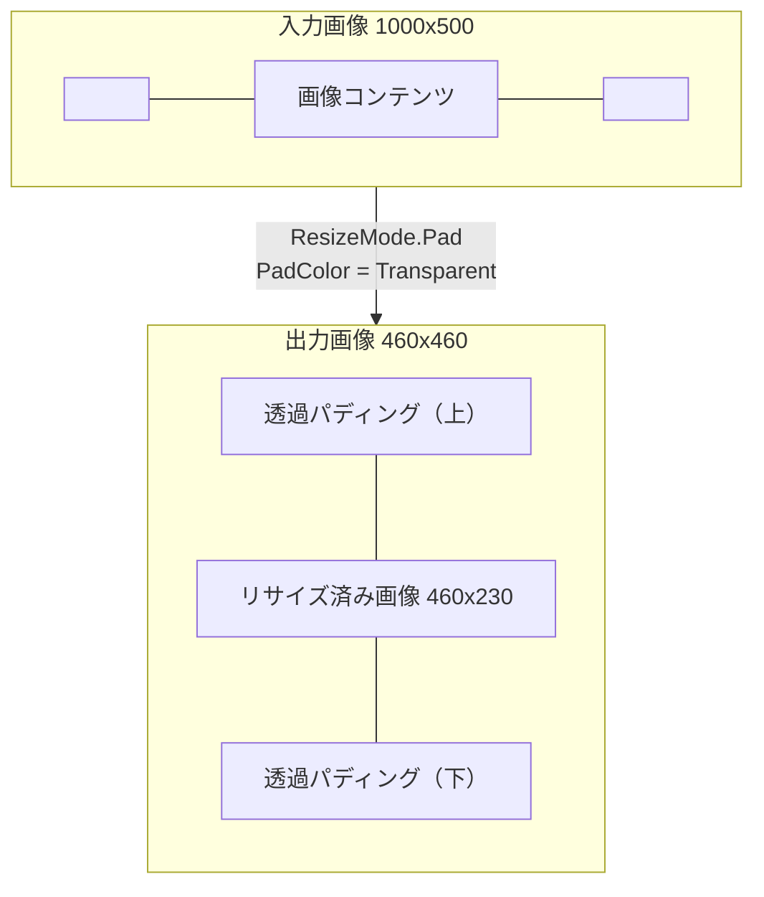

# サイト画像 1:1 リサイズ

アップロードされたサイト画像を 1:1（正方形）にリサイズし、塗り足し領域を透過で埋める機能の実装方針を調査する。

<!-- START doctoc generated TOC please keep comment here to allow auto update -->
<!-- DON'T EDIT THIS SECTION, INSTEAD RE-RUN doctoc TO UPDATE -->

- [調査情報](#調査情報)
- [調査目的](#調査目的)
- [現行実装の全体像](#現行実装の全体像)
    - [サイト画像の処理フロー](#サイト画像の処理フロー)
    - [サイズバリエーション](#サイズバリエーション)
    - [ストレージプロバイダ](#ストレージプロバイダ)
- [現行リサイズ処理の問題点](#現行リサイズ処理の問題点)
    - [ImageData.ReSize メソッドの解析](#imagedataresize-メソッドの解析)
    - [GetImage メソッド](#getimage-メソッド)
    - [問題点の詳細](#問題点の詳細)
- [改修方針](#改修方針)
    - [方針: ResizeMode.Pad の利用](#方針-resizemodepad-の利用)
- [改修対象ファイル一覧](#改修対象ファイル一覧)
    - [改修の影響範囲](#改修の影響範囲)
    - [Logo（テナント画像）への対応](#logoテナント画像への対応)
    - [decimal? 引数の ReSize オーバーロードについて](#decimal-引数の-resize-オーバーロードについて)
- [出力フォーマットの確認](#出力フォーマットの確認)
    - [PNG エンコーダの透過サポート](#png-エンコーダの透過サポート)
- [CSS 表示への影響](#css-表示への影響)
    - [現行の CSS スタイル](#現行の-css-スタイル)
- [結論](#結論)
- [関連ソースコード](#関連ソースコード)

<!-- END doctoc generated TOC please keep comment here to allow auto update -->

## 調査情報

| 調査日     | リポジトリ | ブランチ | タグ/バージョン    | コミット     | 備考     |
| ---------- | ---------- | -------- | ------------------ | ------------ | -------- |
| 2026-03-10 | Pleasanter | main     | Pleasanter_1.5.1.0 | `34f162a439` | 初回調査 |

## 調査目的

サイト画像（ナビゲーションのサムネイルやパンくずのアイコン等に使用）をアップロードした際、アスペクト比が 1:1 でない画像を正方形に変換し、塗り足し（パディング）領域を透過にしたい。現行のリサイズ処理を解析し、改修方針を明確にする。

---

## 現行実装の全体像

### サイト画像の処理フロー

```mermaid
sequenceDiagram
    participant User as ユーザ
    participant FE as フロントエンド
    participant Ctrl as BinariesController
    participant BU as BinaryUtilities
    participant BV as BinaryValidators
    participant BM as BinaryModel
    participant ID as ImageData
    participant Store as Binaries テーブル/ローカル

    User->>FE: 画像ファイルを選択
    FE->>Ctrl: POST binaries/updatesiteimage<br>（FormData）
    Ctrl->>BU: UpdateSiteImage()
    BU->>BV: OnUploadingSiteImage()
    BV->>BV: 権限チェック + Image.Load で形式検証
    BV-->>BU: Error.Types.None
    BU->>BM: UpdateSiteImage(bin)
    BM->>ID: new ImageData(bin, refId, SiteImage)
    Note over ID: Image.Load&lt;Rgba32&gt;() でデコード
    alt ローカルストレージ
        BM->>ID: WriteToLocal()
        ID->>ID: ReSize(Regular) → 460px
        ID->>ID: ReSize(Thumbnail) → 50px
        ID->>ID: ReSize(Icon) → 26px
        ID->>Store: PNG ファイル出力 x3
    else データベース（Rds）
        BM->>ID: ReSizeBytes(Regular)
        BM->>ID: ReSizeBytes(Thumbnail)
        BM->>ID: ReSizeBytes(Icon)
        BM->>Store: Binaries テーブルに INSERT/UPDATE
    end
    BM-->>BU: Error.Types.None
    BU-->>Ctrl: ResponseCollection JSON
    Ctrl-->>FE: UI 更新
```

### サイズバリエーション

**ファイル**: `Implem.Pleasanter/App_Data/Parameters/General.json`（行番号: 85-88）

| SizeTypes   | パラメータ名         | 既定値（px） | 用途                                 |
| ----------- | -------------------- | ------------ | ------------------------------------ |
| `Regular`   | `ImageSizeRegular`   | 460          | サイト設定エディタでの表示           |
| `Thumbnail` | `ImageSizeThumbnail` | 50           | ナビゲーションサイドバーのアイコン   |
| `Icon`      | `ImageSizeIcon`      | 26           | パンくずリストのアイコン             |
| `Logo`      | `ImageSizeLogo`      | 32           | テナントロゴ（サイト画像では未使用） |

### ストレージプロバイダ

**ファイル**: `Implem.ParameterAccessor/Parts/BinaryStorage.cs`（行番号: 36, 49-52）

```csharp
public string SiteImageProvider;

public string GetSiteImageProvider()
{
    return GetProvider(SiteImageProvider);
}
```

`BinaryStorage.json` の `SiteImageProvider` で切り替え可能。未設定時は `Provider`（既定: `Rds`）にフォールバックする。

| プロバイダ | 保存先                                                 |
| ---------- | ------------------------------------------------------ |
| `Local`    | `App_Data/BinaryStorage/SiteImage/{SiteId}_{Size}.png` |
| `Rds`      | Binaries テーブルの `Bin`/`Thumbnail`/`Icon` カラム    |

---

## 現行リサイズ処理の問題点

### ImageData.ReSize メソッドの解析

**ファイル**: `Implem.Pleasanter/Libraries/Images/ImageData.cs`（行番号: 118-136）

```csharp
private Image ReSize(SizeTypes sizeType)
{
    var size = (double)Size(sizeType);
    var rate = (Data.Width > Data.Height) || (sizeType == SizeTypes.Logo)
        ? size / Data.Height      // 横長: 高さ基準でスケーリング
        : size / Data.Width;       // 縦長: 幅基準でスケーリング
    if (rate != 1)
    {
        var width = (Data.Width * rate).ToInt();
        var height = (Data.Height * rate).ToInt();
        var x = (sizeType == SizeTypes.Logo) ? 0 : ((size - width) / 2).ToInt();
        var y = (sizeType == SizeTypes.Logo) ? 0 : ((size - height) / 2).ToInt();
        return GetImage(width, height, x, y);
    }
    else
    {
        return Data;
    }
}
```

### GetImage メソッド

**ファイル**: `Implem.Pleasanter/Libraries/Images/ImageData.cs`（行番号: 178-186）

```csharp
private Image GetImage(int width, int height, int x, int y)
{
    Data.Mutate(x =>
    {
        x.Resize(width, height);
    });

    return Data;
}
```

### 問題点の詳細

現行コードには以下の 2 つの問題がある。

#### 問題 1: x/y オフセットが無視されている

`ReSize` メソッドで計算された `x`、`y`（センタリング用オフセット）が
`GetImage` メソッドに渡されているにもかかわらず、`GetImage` 内では一切使用されていない。
`Resize(width, height)` のみが実行され、パディング処理は行われない。

#### 問題 2: 短辺基準のスケーリング

`rate` の計算が**短辺基準**になっている。横長画像の場合は高さ（短辺）を目標サイズに合わせるため、リサイズ後の幅が目標サイズを超える。

以下に具体例を示す。

**例: 1000x500 の横長画像を Regular（460px）にリサイズする場合**

```text
rate = 460 / 500 = 0.92
scaledWidth  = 1000 × 0.92 = 920 px（目標の 460px を超過）
scaledHeight = 500  × 0.92 = 460 px
x = (460 - 920) / 2 = -230（負値 → クロップ想定だが未使用）
y = (460 - 460) / 2 = 0

結果: 920×460 の非正方形画像が出力される
```



---

## 改修方針

### 方針: ResizeMode.Pad の利用

SixLabors.ImageSharp 3.1.12 には `ResizeMode.Pad` が組み込まれている。これはアスペクト比を維持したまま指定サイズに収め、余白を指定色で埋める機能である。

#### 改修後の GetImage メソッド

**ファイル**: `Implem.Pleasanter/Libraries/Images/ImageData.cs`

```csharp
// using SixLabors.ImageSharp.Processing; は既存のインポート済み

private Image GetImage(int targetSize)
{
    Data.Mutate(ctx =>
    {
        ctx.Resize(new ResizeOptions
        {
            Size = new Size(targetSize, targetSize),
            Mode = ResizeMode.Pad,
            PadColor = Color.Transparent
        });
    });
    return Data;
}
```

#### 改修後の ReSize メソッド

`ReSize` メソッドは `GetImage` にターゲットサイズのみを渡す形に簡略化できる。

```csharp
private Image ReSize(SizeTypes sizeType)
{
    var size = Size(sizeType);
    if (Data.Width == size && Data.Height == size)
    {
        return Data;
    }
    return GetImage(size);
}
```

#### ResizeMode.Pad の動作

`ResizeMode.Pad` は以下の処理を内部的に行う。

1. アスペクト比を維持したまま、長辺が目標サイズに収まるようスケーリング
2. 短辺側の余白を `PadColor` で塗りつぶし
3. 画像を中央に配置



**例: 1000x500 の横長画像を 460px 正方形にリサイズする場合**

```text
長辺（幅）基準でスケーリング:
  scaledWidth  = 460 px
  scaledHeight = 500 × (460 / 1000) = 230 px

出力キャンバス: 460×460 px
  上下パディング: (460 - 230) / 2 = 115 px ずつ透過で埋める
  画像は中央に配置
```

---

## 改修対象ファイル一覧

| ファイル                        | 変更内容                            |
| ------------------------------- | ----------------------------------- |
| `Libraries/Images/ImageData.cs` | `ReSize`・`GetImage` メソッドの改修 |

### 改修の影響範囲

`ImageData.ReSize(SizeTypes)` は以下の箇所から呼び出される。

| 呼び出し元                 | メソッド              | SizeTypes                      |
| -------------------------- | --------------------- | ------------------------------ |
| `ImageData.WriteToLocal()` | `ReSize(SizeTypes)`   | Regular, Thumbnail, Icon       |
| `ImageData.ReSizeBytes()`  | `ReSize(SizeTypes)`   | Regular, Thumbnail, Icon       |
| `BinaryModel`              | `UpdateSiteImage()`   | 上記を経由                     |
| `BinaryModel`              | `UpdateTenantImage()` | Logo（テナント画像、影響なし） |

サイト画像で使用する `Regular`、`Thumbnail`、`Icon` の 3 サイズが改修対象となる。`Logo`（テナント画像用）は `sizeType == SizeTypes.Logo` の分岐で従来のスケーリングのみを適用しているため、個別対応が必要。

### Logo（テナント画像）への対応

`Logo` タイプは現行コードで意図的にパディングなしのスケーリングとなっている。改修後も `Logo` の動作は維持する必要がある。

```csharp
private Image ReSize(SizeTypes sizeType)
{
    var size = Size(sizeType);
    if (Data.Width == size && Data.Height == size)
    {
        return Data;
    }
    if (sizeType == SizeTypes.Logo)
    {
        return GetImageScaled(size);
    }
    return GetImage(size);
}

// Logo 用: 従来のアスペクト比維持リサイズ（パディングなし）
private Image GetImageScaled(int size)
{
    var rate = (double)size / Data.Height;
    var width = (Data.Width * rate).ToInt();
    var height = (Data.Height * rate).ToInt();
    Data.Mutate(ctx =>
    {
        ctx.Resize(width, height);
    });
    return Data;
}

// SiteImage 用: 1:1 正方形 + 透過パディング
private Image GetImage(int targetSize)
{
    Data.Mutate(ctx =>
    {
        ctx.Resize(new ResizeOptions
        {
            Size = new Size(targetSize, targetSize),
            Mode = ResizeMode.Pad,
            PadColor = Color.Transparent
        });
    });
    return Data;
}
```

### decimal? 引数の ReSize オーバーロードについて

**ファイル**: `Implem.Pleasanter/Libraries/Images/ImageData.cs`（行番号: 148-176）

```csharp
private Image ReSize(decimal? size)
```

このオーバーロードは Markdown 画像アップロード時のリサイズ（`ImageLimitSize`/`ThumbnailLimitSize` パラメータによる制限）に使用される。アスペクト比を維持した単純なリサイズのみを行い、正方形化は不要なため改修対象外とする。

---

## 出力フォーマットの確認

### PNG エンコーダの透過サポート

**ファイル**: `Implem.Pleasanter/Libraries/Images/ImageData.cs`（行番号: 83, 113）

```csharp
// WriteToLocal
Files.Write(image, Path(referenceId, type, sizeType), new PngEncoder());

// ReSizeBytes
ReSize(sizeType).Save(memory, new PngEncoder());
```

サイト画像は常に PNG 形式で出力されるため、透過（アルファチャンネル）をそのままサポートする。追加の対応は不要。

---

## CSS 表示への影響

### 現行の CSS スタイル

**ファイル**: `Implem.PleasanterFrontend/wwwroot/src/styles/legacy.scss`

```scss
// ナビゲーションサイドバー（行番号: 1694-1706）
.nav-site .site-image-thumbnail {
    position: absolute;
    top: 8px;
    left: 8px;
    border-radius: 8px;
}

.nav-site .site-image-icon {
    position: absolute;
    top: 4px;
    left: 8px;
    border-radius: 8px;
}

// アプリケーションヘッダ（行番号: 590-594）
#Application > .site-image-icon {
    float: left;
    display: block;
    margin: 0 10px 0 0;
}
```

1:1 の正方形画像となるため、`border-radius: 8px` のスタイルは引き続き正常に機能する。`border-radius: 50%` にすれば円形表示も可能になる（CSS 側の改修は任意）。

---

## 結論

| 項目             | 内容                                                                                  |
| ---------------- | ------------------------------------------------------------------------------------- |
| 現行の問題       | `GetImage` メソッドが x/y オフセットを無視しており、非正方形の画像が出力される        |
| 改修方針         | ImageSharp の `ResizeMode.Pad` と `Color.Transparent` を使用して 1:1 正方形化する     |
| 改修対象ファイル | `Libraries/Images/ImageData.cs` の `ReSize`・`GetImage` メソッド（1 ファイル）        |
| 影響範囲         | サイト画像（Regular/Thumbnail/Icon）の 3 サイズ。テナント画像（Logo）は現行動作を維持 |
| 出力形式         | PNG（透過サポート済み）のため追加対応は不要                                           |
| 必要ライブラリ   | SixLabors.ImageSharp 3.1.12（既存パッケージ内の機能で対応可能、追加インストール不要） |
| CSS への影響     | 正方形になることで `border-radius` による丸角・円形表示がより自然に動作する           |

---

## 関連ソースコード

| ファイル                                          | 行番号    | 内容                                  |
| ------------------------------------------------- | --------- | ------------------------------------- |
| `Libraries/Images/ImageData.cs`                   | 118-136   | ReSize(SizeTypes) メソッド            |
| `Libraries/Images/ImageData.cs`                   | 178-186   | GetImage メソッド（x/y 未使用）       |
| `Libraries/Images/ImageData.cs`                   | 197-207   | Size メソッド（サイズ定数の取得）     |
| `Libraries/Images/ImageData.cs`                   | 67-78     | WriteToLocal メソッド                 |
| `Libraries/Images/ImageData.cs`                   | 108-116   | ReSizeBytes メソッド                  |
| `Models/Binaries/BinaryModel.cs`                  | 1005-1039 | UpdateSiteImage メソッド              |
| `Models/Binaries/BinaryUtilities.cs`              | 258-299   | UpdateSiteImage メソッド              |
| `Models/Binaries/BinaryValidators.cs`             | 40-60     | OnUploadingSiteImage メソッド         |
| `Models/Sites/SiteUtilities.cs`                   | 5809-5844 | SiteImageSettingsEditor UI 生成       |
| `Libraries/HtmlParts/HtmlTemplates.cs`            | 551-563   | SiteImageIcon HTML 生成               |
| `Implem.ParameterAccessor/Parts/General.cs`       | 104-107   | ImageSize パラメータ定義              |
| `Implem.ParameterAccessor/Parts/BinaryStorage.cs` | 36, 49-52 | SiteImageProvider 設定                |
| `App_Data/Parameters/General.json`                | 85-88     | ImageSize 既定値                      |
| `App_Data/Parameters/BinaryStorage.json`          | 全体      | ストレージ設定                        |
| `PleasanterFrontend/.../sitesettings.js`          | 1-9       | $p.uploadSiteImage フロントエンド関数 |
| `PleasanterFrontend/.../legacy.scss`              | 590-594   | site-image-icon CSS                   |
| `PleasanterFrontend/.../legacy.scss`              | 1694-1706 | site-image-thumbnail/icon CSS         |
