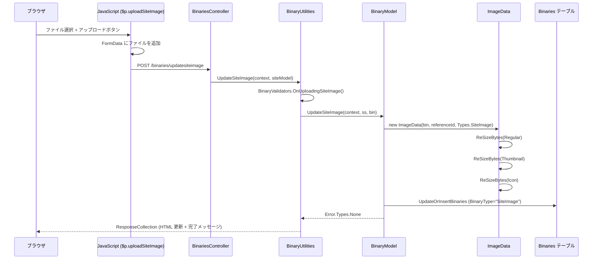
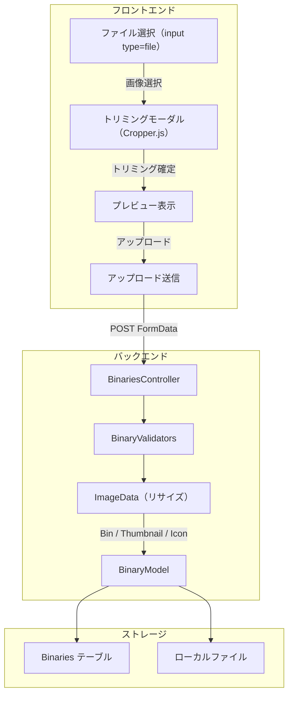
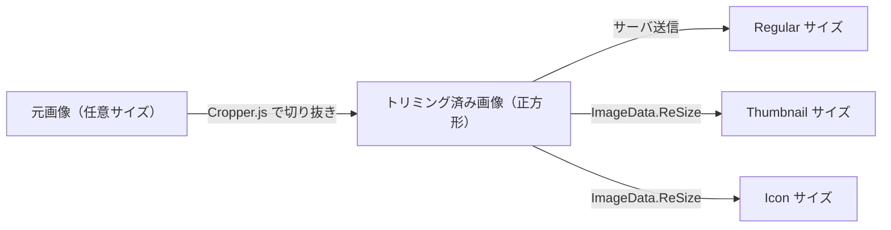
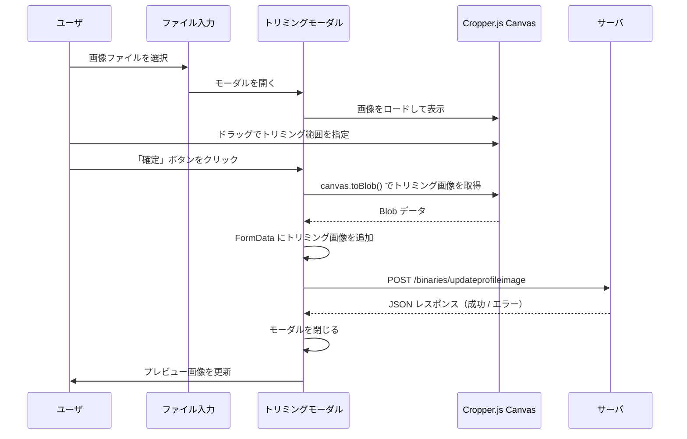
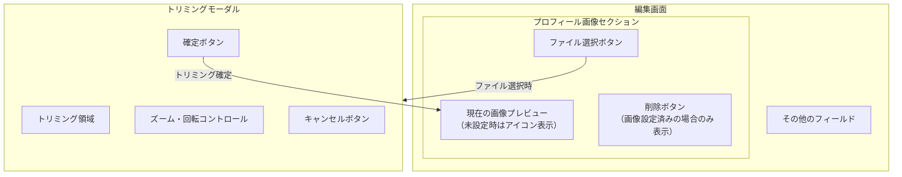

# プロフィール画像アップロード・トリミング機能の実装方針

ユーザ・グループ・組織（Dept）にプロフィール画像を設定できる機能と、アップロード時にクライアント側でトリミング（切り抜き）を行うモーダル UI の実装方針を調査した。

<!-- START doctoc generated TOC please keep comment here to allow auto update -->
<!-- DON'T EDIT THIS SECTION, INSTEAD RE-RUN doctoc TO UPDATE -->

- [調査情報](#調査情報)
- [調査目的](#調査目的)
- [現行アーキテクチャの調査](#現行アーキテクチャの調査)
    - [プロフィール画像の現状](#プロフィール画像の現状)
    - [Binaries テーブル構造](#binaries-テーブル構造)
    - [BinaryType の種別](#binarytype-の種別)
    - [画像処理ライブラリ](#画像処理ライブラリ)
    - [リサイズ処理](#リサイズ処理)
- [既存の画像アップロード機構](#既存の画像アップロード機構)
    - [サイト画像アップロードフロー](#サイト画像アップロードフロー)
    - [サイト画像アップロード UI](#サイト画像アップロード-ui)
    - [フロントエンドのアップロード関数](#フロントエンドのアップロード関数)
    - [テナントロゴアップロード](#テナントロゴアップロード)
    - [削除時のバイナリクリーンアップ](#削除時のバイナリクリーンアップ)
    - [バリデーション](#バリデーション)
- [プロフィール画像機能の実装方針](#プロフィール画像機能の実装方針)
    - [全体構成](#全体構成)
    - [BinaryType の定義](#binarytype-の定義)
- [ImageData の拡張](#imagedata-の拡張)
    - [Types 列挙型への追加](#types-列挙型への追加)
    - [SizeTypes の利用](#sizetypes-の利用)
    - [リサイズ処理の拡張](#リサイズ処理の拡張)
- [クライアントサイドトリミング機能](#クライアントサイドトリミング機能)
    - [ライブラリ選定](#ライブラリ選定)
    - [トリミングモーダルの処理フロー](#トリミングモーダルの処理フロー)
    - [トリミングモーダル UI 設計](#トリミングモーダル-ui-設計)
    - [Cropper.js v2.x の実装例](#cropperjs-v2x-の実装例)
    - [JavaScript でのトリミング結果取得](#javascript-でのトリミング結果取得)
- [バックエンド改修箇所](#バックエンド改修箇所)
    - [新規ファイル](#新規ファイル)
    - [変更ファイル](#変更ファイル)
    - [CodeDefiner の影響](#codedefiner-の影響)
    - [画像取得エンドポイント](#画像取得エンドポイント)
    - [バリデーション](#バリデーション-1)
- [フロントエンド改修箇所](#フロントエンド改修箇所)
    - [新規ファイル](#新規ファイル-1)
    - [変更ファイル](#変更ファイル-1)
    - [編集画面の UI 構成](#編集画面の-ui-構成)
- [画像表示の拡張](#画像表示の拡張)
    - [ユーザ表示の変更](#ユーザ表示の変更)
    - [パフォーマンス考慮事項](#パフォーマンス考慮事項)
- [結論](#結論)
- [関連ソースコード](#関連ソースコード)

<!-- END doctoc generated TOC please keep comment here to allow auto update -->

## 調査情報

| 調査日        | リポジトリ | ブランチ | タグ/バージョン    | コミット     | 備考     |
| ------------- | ---------- | -------- | ------------------ | ------------ | -------- |
| 2026年3月10日 | Pleasanter | main     | Pleasanter_1.5.1.0 | `34f162a439` | 初回調査 |

## 調査目的

- ユーザ・グループ・組織の編集画面にプロフィール画像を設定できる UI を追加したい
- アップロード時にクライアントサイドでトリミング（正方形切り抜き）できるモーダルを提供し、不要な領域を除去した画像を保存したい
- 既存のサイト画像・テナントロゴ画像のアップロード機構との整合性を確認し、最小限の改修範囲を明らかにする

---

## 現行アーキテクチャの調査

### プロフィール画像の現状

現行の Pleasanter には、ユーザ・グループ・組織に対する専用のプロフィール画像機能は存在しない。ユーザ表示は `ui-icon-person` アイコンで代替されている。

**ファイル**: `Implem.Pleasanter/Libraries/HtmlParts/HtmlHelpers.cs`

```csharp
public static HtmlBuilder HtmlUser(this HtmlBuilder hb, Context context, string text)
{
    return hb.P(css: "user", action: () => hb
        .Icon(iconCss: "ui-icon-person", text: text));
}
```

ただし、Binaries テーブルには `BinaryType = "TenantManagementImages"` として管理画面用の画像を保存するための仕組みがすでに存在する。削除処理にも組み込まれているため、ストレージ層は整備済みである。

### Binaries テーブル構造

画像データの格納先となる Binaries テーブルの主要カラムを以下に示す。

| カラム名    | 型        | 説明                                        |
| ----------- | --------- | ------------------------------------------- |
| BinaryId    | bigint    | 主キー（Identity）                          |
| TenantId    | int       | テナント ID                                 |
| ReferenceId | bigint    | 参照先の ID（UserId / GroupId / DeptId 等） |
| BinaryType  | nvarchar  | 画像種別（`SiteImage` / `TenantImage` 等）  |
| Bin         | varbinary | 元画像のバイナリデータ                      |
| Thumbnail   | varbinary | サムネイル画像のバイナリデータ              |
| Icon        | varbinary | アイコン画像のバイナリデータ                |
| FileName    | nvarchar  | 元ファイル名                                |
| Extension   | nvarchar  | 拡張子                                      |
| Size        | bigint    | ファイルサイズ（バイト）                    |
| ContentType | nvarchar  | MIME タイプ                                 |

### BinaryType の種別

| BinaryType               | 用途                   | サイズ種別                 |
| ------------------------ | ---------------------- | -------------------------- |
| `SiteImage`              | サイトアイコン         | Regular / Thumbnail / Icon |
| `TenantImage`            | テナントロゴ           | Logo のみ                  |
| `TenantManagementImages` | 管理画面用画像（汎用） | 用途に応じて定義可能       |

### 画像処理ライブラリ

サーバサイドの画像処理には **SixLabors.ImageSharp 3.1.12** を使用している。

**ファイル**: `Implem.Pleasanter/Implem.Pleasanter.csproj`（行番号: 75）

```xml
<PackageReference Include="SixLabors.ImageSharp" Version="3.1.12" />
```

**ファイル**: `Implem.Pleasanter/Libraries/Images/ImageData.cs`

```csharp
public enum Types : int
{
    SiteImage = 1,
    TenantImage = 2
}

public enum SizeTypes : int
{
    Regular = 1,
    Thumbnail = 2,
    Icon = 3,
    Logo = 4
}
```

画像サイズは `Parameters.General` で定義されている。

**ファイル**: `Implem.ParameterAccessor/Parts/General.cs`（行番号: 104-107）

```csharp
public int ImageSizeRegular { get; set; }
public int ImageSizeThumbnail { get; set; }
public int ImageSizeIcon { get; set; }
public int ImageSizeLogo { get; set; }
```

### リサイズ処理

現行のリサイズは、アスペクト比を維持しながら指定サイズに収まるよう縮小する方式である。トリミング（切り抜き）は行わない。

**ファイル**: `Implem.Pleasanter/Libraries/Images/ImageData.cs`（行番号: 118-176）

```csharp
private Image ReSize(SizeTypes sizeType)
{
    var size = (double)Size(sizeType);
    var rate = (Data.Width > Data.Height) || (sizeType == SizeTypes.Logo)
        ? size / Data.Height
        : size / Data.Width;
    if (rate != 1)
    {
        var width = (Data.Width * rate).ToInt();
        var height = (Data.Height * rate).ToInt();
        var x = (sizeType == SizeTypes.Logo) ? 0 : ((size - width) / 2).ToInt();
        var y = (sizeType == SizeTypes.Logo) ? 0 : ((size - height) / 2).ToInt();
        return GetImage(width, height, x, y);
    }
    else { return Data; }
}
```

---

## 既存の画像アップロード機構

### サイト画像アップロードフロー

サイト画像のアップロードは、プロフィール画像の実装で最も参考になるパターンである。



### サイト画像アップロード UI

**ファイル**: `Implem.Pleasanter/Models/Sites/SiteUtilities.cs`（行番号: 5809-5844）

```csharp
public static HtmlBuilder SiteImageSettingsEditor(
    this HtmlBuilder hb, Context context, SiteSettings ss)
{
    return hb.TabsPanelField(id: "SiteImageSettingsEditor", action: () => hb
        .FieldSet(
            css: " enclosed",
            legendText: Displays.Icon(context: context),
            action: () => hb
                .FieldTextBox(
                    textType: HtmlTypes.TextTypes.File,
                    controlId: "SiteImage",
                    fieldCss: "field-auto-thin",
                    controlCss: " w400",
                    labelText: Displays.File(context: context))
                .Button(
                    controlId: "SetSiteImage",
                    controlCss: "button-icon button-positive",
                    text: Displays.Upload(context: context),
                    onClick: "$p.uploadSiteImage($(this));",
                    icon: "ui-icon-disk",
                    action: "binaries/updatesiteimage",
                    method: "post")
                .Button(
                    controlCss: "button-icon button-negative",
                    text: Displays.Delete(context: context),
                    onClick: "$p.send($(this));",
                    icon: "ui-icon-trash",
                    action: "binaries/deletesiteimage",
                    method: "delete",
                    confirm: "ConfirmDelete",
                    _using: BinaryUtilities.ExistsSiteImage(...))));
}
```

### フロントエンドのアップロード関数

**ファイル**: `Implem.PleasanterFrontend/wwwroot/src/scripts/generals/sitesettings.js`

```javascript
$p.uploadSiteImage = function ($control) {
    var data = new FormData();
    data.append('file', $('#SiteImage').prop('files')[0]);
    $p.multiUpload($('.main-form').attr('action').replace('_action_', $control.attr('data-action')), data, $control);
};
```

### テナントロゴアップロード

テナントロゴも同様のパターンで実装されている。

**ファイル**: `Implem.Pleasanter/Models/Tenants/TenantUtilities.cs`（行番号: 1870-1904）

テナントロゴは `BinaryType = "TenantImage"` で格納され、`SizeTypes.Logo` のみ生成する。

### 削除時のバイナリクリーンアップ

ユーザ・グループ・組織の削除処理では、すでに `TenantManagementImages` の削除が組み込まれている。

**ファイル**: `Implem.Pleasanter/Models/Users/UserModel.cs`（行番号: 3181-3210）

```csharp
public ErrorData Delete(Context context, SiteSettings ss, bool notice = false)
{
    var statements = new List<SqlStatement>();
    statements.AddRange(new List<SqlStatement>
    {
        Rds.DeleteBinaries(
            factory: context,
            where: Rds.BinariesWhere()
                .TenantId(context.TenantId)
                .ReferenceId(UserId)
                .BinaryType(value: "TenantManagementImages")),
        Rds.DeleteUsers(
            factory: context,
            where: Rds.UsersWhere().UserId(UserId)),
        // ...
    });
    // ...
}
```

GroupModel.Delete、DeptModel.Delete でも同様の処理が実装されている。

### バリデーション

画像アップロードのバリデーションは SixLabors.ImageSharp による画像形式検証を行っている。

**ファイル**: `Implem.Pleasanter/Models/Binaries/BinaryValidators.cs`（行番号: 40-60）

```csharp
public static Error.Types OnUploadingSiteImage(
    Context context, SiteSettings ss, byte[] bin)
{
    if (!context.CanManageSite(ss: ss))
        return Error.Types.HasNotPermission;
    if (bin == null)
        return Error.Types.SelectFile;
    try
    {
        SixLabors.ImageSharp.Image.Load<Rgba32>(new MemoryStream(bin));
    }
    catch (Exception)
    {
        return Error.Types.IncorrectFileFormat;
    }
    return Error.Types.None;
}
```

---

## プロフィール画像機能の実装方針

### 全体構成



### BinaryType の定義

プロフィール画像は既存の `TenantManagementImages` を活用するか、新しい BinaryType を定義する。

| 方式 | BinaryType 値            | メリット                           | デメリット                               |
| ---- | ------------------------ | ---------------------------------- | ---------------------------------------- |
| A    | `TenantManagementImages` | 削除処理のクリーンアップ改修が不要 | 汎用名称のため画像の用途が区別しにくい   |
| B    | `ProfileImage`（新規）   | 用途が明確で、クエリや管理が容易   | 削除処理への追加やバリデータの新設が必要 |

方式 B の場合、新たに以下の改修が必要になる。

- UserModel / GroupModel / DeptModel の Delete メソッドに `BinaryType = "ProfileImage"` のクリーンアップを追加
- BinaryValidators に `OnUploadingProfileImage` メソッドを追加
- ImageData.Types に `ProfileImage` を追加

方式 A であれば、ストレージ層は現状のまま利用できる。
ただし `ReferenceId` でユーザ / グループ / 組織を区別する際に、ID の衝突（例: UserId=1 と GroupId=1）が発生しうるため、
BinaryType で識別する列を細分化するか、BinarySettings に付加情報を持たせる必要がある。

推奨は **方式 B（`ProfileImage`）** である。理由は以下の通り。

1. 既存の `TenantManagementImages` は汎用的な画像用途で使われており、プロフィール画像と混在すると管理が複雑になる
2. ReferenceId の名前空間が異なるモデル間で衝突する可能性がある
3. BinaryType で明示的に分離することで、取得・表示・削除のロジックが単純化される

---

## ImageData の拡張

### Types 列挙型への追加

**ファイル**: `Implem.Pleasanter/Libraries/Images/ImageData.cs`

```csharp
public enum Types : int
{
    SiteImage = 1,
    TenantImage = 2,
    ProfileImage = 3  // 追加
}
```

### SizeTypes の利用

プロフィール画像では以下のサイズを生成する。

| SizeTypes | 用途                           | 参照パラメータ                          |
| --------- | ------------------------------ | --------------------------------------- |
| Regular   | 編集画面のプロフィール画像表示 | `Parameters.General.ImageSizeRegular`   |
| Thumbnail | 一覧・コメント・ヘッダでの表示 | `Parameters.General.ImageSizeThumbnail` |
| Icon      | 小型アイコン表示               | `Parameters.General.ImageSizeIcon`      |

### リサイズ処理の拡張

既存の `ReSize` メソッドはアスペクト比を維持して縮小するが、プロフィール画像ではクライアント側でトリミング済みの正方形画像が渡される前提とする。そのため、既存のリサイズロジックをそのまま利用できる。



---

## クライアントサイドトリミング機能

### ライブラリ選定

現行フロントエンドにはクライアントサイドの画像トリミングライブラリが存在しない。導入候補を以下に比較する。

| ライブラリ       | バージョン | サイズ  | 特徴                                               |
| ---------------- | ---------- | ------- | -------------------------------------------------- |
| Cropper.js v2.x  | 2.1.0      | 約 50KB | Web Component ベース、モジュラー構成、複数選択対応 |
| Cropper.js v1.x  | 1.6.2      | 約 40KB | jQuery 対応、安定、実績豊富                        |
| react-image-crop | 11.x       | 約 15KB | React 専用、プリザンターのフロントエンドとは不適合 |

プリザンターのフロントエンドは jQuery ベースから Web Component への移行途上にある（v2 テーマ）。
Cropper.js v2.x は Web Component として動作するため、プリザンターの方向性と一致する。
ただし、現行の jQuery プラグイン群との互換性を重視する場合は、v1.x も選択肢となる。

推奨は **Cropper.js v2.x** である。

### トリミングモーダルの処理フロー



### トリミングモーダル UI 設計

モーダルの構成要素は以下の通り。

| 要素               | 説明                                                 |
| ------------------ | ---------------------------------------------------- |
| 画像プレビュー領域 | Cropper.js の操作対象画像を表示                      |
| トリミング枠       | 正方形固定（aspectRatio: 1）でドラッグ・リサイズ可能 |
| ズームコントロール | 拡大・縮小ボタン                                     |
| 回転コントロール   | 90度単位の回転ボタン（任意）                         |
| 確定ボタン         | トリミング結果を確定してアップロード                 |
| キャンセルボタン   | モーダルを閉じて操作を取り消す                       |
| プレビュー表示     | トリミング結果のリアルタイムプレビュー               |

### Cropper.js v2.x の実装例

```html
<cropper-canvas background>
    <cropper-image src="selected-image.jpg" rotatable scalable></cropper-image>
    <cropper-shade hidden></cropper-shade>
    <cropper-handle action="select" plain></cropper-handle>
    <cropper-selection initial-coverage="0.8" aspect-ratio="1" movable resizable>
        <cropper-grid role="grid" covered></cropper-grid>
        <cropper-crosshair centered></cropper-crosshair>
        <cropper-handle action="move" theme-color="rgba(255, 255, 255, 0.35)"></cropper-handle>
        <cropper-handle action="n-resize"></cropper-handle>
        <cropper-handle action="e-resize"></cropper-handle>
        <cropper-handle action="s-resize"></cropper-handle>
        <cropper-handle action="w-resize"></cropper-handle>
        <cropper-handle action="ne-resize"></cropper-handle>
        <cropper-handle action="nw-resize"></cropper-handle>
        <cropper-handle action="se-resize"></cropper-handle>
        <cropper-handle action="sw-resize"></cropper-handle>
    </cropper-selection>
</cropper-canvas>
```

### JavaScript でのトリミング結果取得

```javascript
// Cropper.js v2.x でのトリミング結果取得
const selection = document.querySelector('cropper-selection');
const canvas = selection.$toCanvas({ width: 256, height: 256 });
canvas.toBlob(function (blob) {
    var data = new FormData();
    data.append('file', blob, 'profile.png');
    $p.multiUpload(url, data, $control);
}, 'image/png');
```

---

## バックエンド改修箇所

### 新規ファイル

| ファイル                                | 説明                                       |
| --------------------------------------- | ------------------------------------------ |
| `Controllers/ProfileImageController.cs` | プロフィール画像のアップロード・取得・削除 |

### 変更ファイル

| ファイル                              | 変更内容                                                                  |
| ------------------------------------- | ------------------------------------------------------------------------- |
| `Libraries/Images/ImageData.cs`       | `Types` に `ProfileImage` を追加、`WriteToLocal` で 3 サイズ生成          |
| `Models/Binaries/BinaryUtilities.cs`  | `UpdateProfileImage` / `DeleteProfileImage` / `ExistsProfileImage` を追加 |
| `Models/Binaries/BinaryValidators.cs` | `OnUploadingProfileImage` バリデーションメソッドを追加                    |
| `Models/Binaries/BinaryModel.cs`      | `UpdateProfileImage` / `DeleteProfileImage` メソッドを追加                |
| `Models/Users/UserUtilities.cs`       | 編集画面に画像アップロード UI を追加                                      |
| `Models/Groups/GroupUtilities.cs`     | 編集画面に画像アップロード UI を追加                                      |
| `Models/Depts/DeptUtilities.cs`       | 編集画面に画像アップロード UI を追加                                      |
| `Models/Users/UserModel.cs`           | Delete に `ProfileImage` クリーンアップを追加                             |
| `Models/Groups/GroupModel.cs`         | Delete に `ProfileImage` クリーンアップを追加                             |
| `Models/Depts/DeptModel.cs`           | Delete に `ProfileImage` クリーンアップを追加                             |
| `Libraries/HtmlParts/HtmlHelpers.cs`  | `HtmlUser` でプロフィール画像を表示するよう拡張                           |

### CodeDefiner の影響

以下の観点で CodeDefiner の影響を確認した。

| 影響箇所                 | 影響有無 | 説明                                                                                                       |
| ------------------------ | :------: | ---------------------------------------------------------------------------------------------------------- |
| カラム定義の追加         |    無    | Users / Groups / Depts テーブルへの新規カラム追加は不要（Binaries テーブルで管理）                         |
| BinaryType の定義        |    無    | BinaryType は文字列定数であり、CodeDefiner による自動生成対象ではない                                      |
| ImageData.Types 列挙型   |    無    | ImageData.cs は手動管理ファイルであり、CodeDefiner の対象外                                                |
| ルーティング定義         |    要    | 新規 Controller の追加に伴い、ルーティング設定の追加が必要                                                 |
| モデルの Delete メソッド |   注意   | UserModel / GroupModel / DeptModel の Delete は CodeDefiner 生成コードに手動追記されたコードを含むため注意 |

### 画像取得エンドポイント

既存の SiteImage / TenantImage と同様のパターンで実装する。

| エンドポイント                        | メソッド | 説明                 |
| ------------------------------------- | -------- | -------------------- |
| `GET /binaries/profileimage/{id}`     | GET      | Regular サイズ取得   |
| `GET /binaries/profilethumbnail/{id}` | GET      | Thumbnail サイズ取得 |
| `GET /binaries/profileicon/{id}`      | GET      | Icon サイズ取得      |
| `POST /binaries/updateprofileimage`   | POST     | プロフィール画像更新 |
| `DELETE /binaries/deleteprofileimage` | DELETE   | プロフィール画像削除 |

### バリデーション

プロフィール画像のアップロードバリデーションは以下の通り。

| チェック項目           | 条件                                             |
| ---------------------- | ------------------------------------------------ |
| 権限チェック           | 自身のプロフィール画像、またはテナント管理者権限 |
| ファイル存在チェック   | ファイルが選択されているか                       |
| 画像形式チェック       | SixLabors.ImageSharp で読み込み可能な画像形式か  |
| ファイルサイズチェック | テナントストレージ容量の上限を超えていないか     |

---

## フロントエンド改修箇所

### 新規ファイル

| ファイル                                               | 説明                                 |
| ------------------------------------------------------ | ------------------------------------ |
| `wwwroot/src/scripts/modules/profileImageCropper.ts`   | トリミングモーダルの TypeScript 実装 |
| `wwwroot/src/styles/modules/profile-image-cropper.css` | トリミングモーダルのスタイル         |

### 変更ファイル

| ファイル                                 | 変更内容                               |
| ---------------------------------------- | -------------------------------------- |
| `wwwroot/package.json`                   | `cropperjs` パッケージの追加           |
| `wwwroot/src/scripts/generals/users.js`  | プロフィール画像アップロード関数の追加 |
| `wwwroot/src/scripts/generals/groups.js` | プロフィール画像アップロード関数の追加 |
| `wwwroot/src/scripts/generals/depts.js`  | プロフィール画像アップロード関数の追加 |

### 編集画面の UI 構成

ユーザ・グループ・組織の編集画面に、以下の UI 要素を追加する。



---

## 画像表示の拡張

### ユーザ表示の変更

`HtmlHelpers.HtmlUser` メソッドを拡張し、プロフィール画像が設定されている場合は画像を表示する。

```csharp
// 変更前
public static HtmlBuilder HtmlUser(this HtmlBuilder hb, Context context, int id)
{
    return hb.P(css: "user", action: () => hb
        .Icon(iconCss: "ui-icon-person", text: SiteInfo.UserName(
            context: context, userId: id)));
}

// 変更後（案）
public static HtmlBuilder HtmlUser(this HtmlBuilder hb, Context context, int id)
{
    var hasProfileImage = BinaryUtilities.ExistsProfileImage(context, id);
    return hb.P(css: "user", action: () =>
    {
        if (hasProfileImage)
        {
            hb.Img(src: $"/binaries/profileicon/{id}",
                css: "profile-icon");
        }
        else
        {
            hb.Icon(iconCss: "ui-icon-person");
        }
        hb.Text(text: SiteInfo.UserName(context: context, userId: id));
    });
}
```

### パフォーマンス考慮事項

| 項目                 | 対策                                                                                   |
| -------------------- | -------------------------------------------------------------------------------------- |
| 画像取得の N+1 問題  | SiteInfo キャッシュにプロフィール画像の有無フラグを追加                                |
| レスポンスキャッシュ | 画像取得エンドポイントに `ResponseCache` / `OutputCache` を設定                        |
| 画像サイズの最適化   | Icon サイズ（小型）をデフォルト表示に使用し、編集画面のみ Regular サイズを表示         |
| 一覧画面の負荷       | 一覧表示では Thumbnail または Icon サイズのみ使用し、DB クエリでは Icon カラムのみ取得 |

---

## 結論

| 項目                         | 結論                                                                                           |
| ---------------------------- | ---------------------------------------------------------------------------------------------- |
| ストレージ層                 | Binaries テーブルをそのまま利用可能。BinaryType を `ProfileImage` として新設する               |
| 画像処理                     | SixLabors.ImageSharp による既存のリサイズ処理をそのまま活用可能                                |
| クライアントサイドトリミング | Cropper.js v2.x を導入し、Web Component ベースのトリミングモーダルを実装する                   |
| バックエンド改修             | SiteImage のパターンを踏襲して Controller / Utilities / Validators / Model を追加する          |
| フロントエンド改修           | トリミングモーダル用の TypeScript モジュールを新規作成し、各管理画面の JS に連携関数を追加する |
| CodeDefiner の影響           | テーブルスキーマ変更は不要。ただし Delete メソッドの追記箇所は CodeDefiner 再生成時に注意      |
| 削除処理の互換性             | 既存の `TenantManagementImages` クリーンアップは維持し、`ProfileImage` 用の処理を並列追加する  |
| パフォーマンス               | SiteInfo キャッシュとレスポンスキャッシュの活用により、一覧画面での負荷を抑制する              |

---

## 関連ソースコード

| ファイル                                                                 | 説明                                   |
| ------------------------------------------------------------------------ | -------------------------------------- |
| `Implem.Pleasanter/Libraries/Images/ImageData.cs`                        | 画像処理（リサイズ・フォーマット変換） |
| `Implem.Pleasanter/Models/Binaries/BinaryModel.cs`                       | バイナリモデル                         |
| `Implem.Pleasanter/Models/Binaries/BinaryUtilities.cs`                   | バイナリユーティリティ                 |
| `Implem.Pleasanter/Models/Binaries/BinaryValidators.cs`                  | バイナリバリデーション                 |
| `Implem.Pleasanter/Controllers/BinariesController.cs`                    | バイナリコントローラ                   |
| `Implem.Pleasanter/Models/Users/UserModel.cs`                            | ユーザモデル（Delete メソッド）        |
| `Implem.Pleasanter/Models/Users/UserUtilities.cs`                        | ユーザ管理画面生成                     |
| `Implem.Pleasanter/Models/Groups/GroupModel.cs`                          | グループモデル（Delete メソッド）      |
| `Implem.Pleasanter/Models/Groups/GroupUtilities.cs`                      | グループ管理画面生成                   |
| `Implem.Pleasanter/Models/Depts/DeptModel.cs`                            | 組織モデル（Delete メソッド）          |
| `Implem.Pleasanter/Models/Depts/DeptUtilities.cs`                        | 組織管理画面生成                       |
| `Implem.Pleasanter/Libraries/HtmlParts/HtmlHelpers.cs`                   | ユーザ表示ヘルパー                     |
| `Implem.Pleasanter/Models/Sites/SiteUtilities.cs`                        | サイト画像アップロード UI（参考）      |
| `Implem.Pleasanter/Models/Tenants/TenantUtilities.cs`                    | テナントロゴアップロード UI（参考）    |
| `Implem.PleasanterFrontend/wwwroot/src/scripts/generals/sitesettings.js` | サイト画像アップロード JS（参考）      |
| `Implem.ParameterAccessor/Parts/General.cs`                              | 画像サイズパラメータ                   |
| `Implem.ParameterAccessor/Parts/BinaryStorage.cs`                        | バイナリストレージ設定                 |
