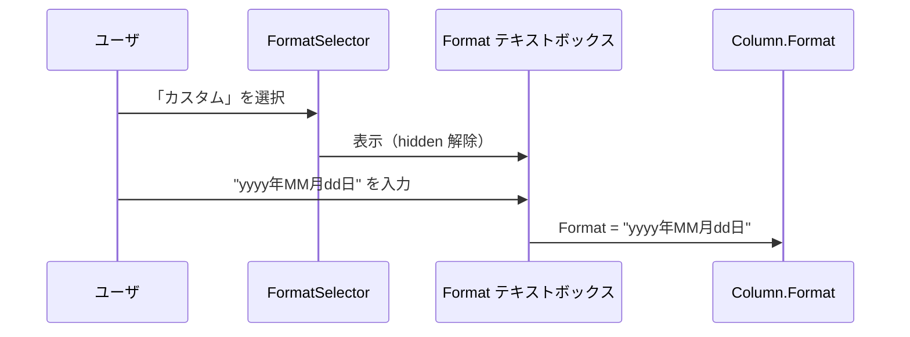

# 日付項目カスタム表示形式の実装方針

日付項目（datetime 型カラム）の一覧・エクスポート表示形式に、.NET カスタム書式文字列を直接指定できる「カスタム」オプションを追加するための調査と実装方針をまとめた。

<!-- START doctoc generated TOC please keep comment here to allow auto update -->
<!-- DON'T EDIT THIS SECTION, INSTEAD RE-RUN doctoc TO UPDATE -->

- [調査情報](#調査情報)
- [調査目的](#調査目的)
- [現行の日付表示形式の仕組み](#現行の日付表示形式の仕組み)
    - [日付項目が持つ 3 つの表示形式プロパティ](#日付項目が持つ-3-つの表示形式プロパティ)
    - [Display ID から書式文字列への変換フロー](#display-id-から書式文字列への変換フロー)
    - [定義済み表示形式の一覧](#定義済み表示形式の一覧)
    - [EditorFormat の特殊性](#editorformat-の特殊性)
- [現行の設定 UI](#現行の設定-ui)
    - [一覧設定の GridFormat ドロップダウン](#一覧設定の-gridformat-ドロップダウン)
    - [編集設定の EditorFormat ドロップダウン](#編集設定の-editorformat-ドロップダウン)
    - [DateTimeOptions メソッド](#datetimeoptions-メソッド)
    - [エクスポート設定の ExportFormat ドロップダウン](#エクスポート設定の-exportformat-ドロップダウン)
- [数値項目のカスタム書式（参考実装）](#数値項目のカスタム書式参考実装)
    - [FormatSelector ドロップダウン + Format テキストボックス](#formatselector-ドロップダウン--format-テキストボックス)
    - [Formats 定義](#formats-定義)
    - [JavaScript イベントハンドラ](#javascript-イベントハンドラ)
- [カスタム表示形式の実装方針](#カスタム表示形式の実装方針)
    - [対象スコープ](#対象スコープ)
    - [FormatExtension.Display() の改修](#formatextensiondisplay-の改修)
    - [DateTimeOptions メソッドの改修](#datetimeoptions-メソッドの改修)
    - [GridFormat / ExportFormat ドロップダウンの改修](#gridformat--exportformat-ドロップダウンの改修)
    - [JavaScript イベントハンドラの追加](#javascript-イベントハンドラの追加)
- [DifferenceOfDates への影響](#differenceofdates-への影響)
- [API エクスポートへの影響](#api-エクスポートへの影響)
    - [SettingsJsonConverter の GridFormat/EditorFormat 変換](#settingsjsonconverter-の-gridformateditorformat-変換)
- [改修箇所の一覧](#改修箇所の一覧)
    - [変更ファイル](#変更ファイル)
    - [変更不要なファイル](#変更不要なファイル)
    - [CodeDefiner の影響](#codedefiner-の影響)
- [注意事項](#注意事項)
    - [不正な書式文字列への対策](#不正な書式文字列への対策)
    - [XSS 対策](#xss-対策)
    - [EditorFormat を将来的にカスタム対応する場合](#editorformat-を将来的にカスタム対応する場合)
- [結論](#結論)
- [関連ソースコード](#関連ソースコード)

<!-- END doctoc generated TOC please keep comment here to allow auto update -->

## 調査情報

| 調査日       | リポジトリ | ブランチ | タグ/バージョン    | コミット     | 備考     |
| ------------ | ---------- | -------- | ------------------ | ------------ | -------- |
| 2026年3月6日 | Pleasanter | main     | Pleasanter_1.5.1.0 | `34f162a439` | 初回調査 |

## 調査目的

- 現行の日付項目表示形式は定義済みの 6 パターン（年月日、年月日曜、年月日時分 等）に限定されている
- 「yyyy年MM月dd日」「MM-dd」「HH:mm」など任意の .NET DateTime 書式文字列を指定したいニーズがある
- 数値項目では既にカスタム書式（`FormatSelector` + `Format` テキストボックス）が実装されている
- この仕組みを日付項目にも適用するための改修箇所と影響範囲を調査する

---

## 現行の日付表示形式の仕組み

### 日付項目が持つ 3 つの表示形式プロパティ

**ファイル**: `Implem.Pleasanter/Libraries/Settings/Column.cs`（行番号: 88-90）

```csharp
public string GridFormat;      // 一覧画面の表示形式
public string EditorFormat;    // 編集画面の表示形式（DatePicker の種類も決定）
public string ExportFormat;    // CSV エクスポートの表示形式
```

それぞれ「Ymd」「Ymdhm」等の **Display ID** を保持し、表示時に `FormatExtension.Display()` で .NET 書式文字列に変換される。

### Display ID から書式文字列への変換フロー

**ファイル**: `Implem.Pleasanter/Libraries/Extensions/FormatExtension.cs`

```csharp
public static string Display(this DateTime value, Context context, string format)
{
    return value.InRange()
        ? !format.IsNullOrEmpty()
            ? value.ToString(
                Displays.Get(
                    context: context,
                    id: format + "Format"),   // Display ID に "Format" を付加して検索
                context.CultureInfo())
            : value.ToString(context.CultureInfo())
        : string.Empty;
}
```


### 定義済み表示形式の一覧

Display JSON ファイル（`App_Data/Displays/`）で定義されている表示形式は以下のとおり。

| Display ID | 日本語ラベル         | 書式文字列（ja）          | Type |
| ---------- | -------------------- | ------------------------- | ---- |
| Ymd        | 年月日               | `yyyy/MM/dd`              | 120  |
| Ymdhm      | 日付と時刻(分)       | `yyyy/MM/dd HH:mm`        | 120  |
| Ymdhms     | 日付と時刻(秒)       | `yyyy/MM/dd HH:mm:ss`     | 120  |
| Ymda       | 年月日曜             | `yyyy/MM/dd ddd`          | 120  |
| Ymdahm     | 日付と曜日と時刻(分) | `yyyy/MM/dd ddd HH:mm`    | 120  |
| Ymdahms    | 日付と曜日と時刻(秒) | `yyyy/MM/dd ddd HH:mm:ss` | 120  |

- Type 120 = `DisplayAccessor.Displays.Types.Date`（ラベル定義）
- 各 Display ID に対応する `{ID}Format` ファイル（Type 130 = `DateFormat`）が書式文字列を保持

### EditorFormat の特殊性

EditorFormat は表示形式であると同時に、DatePicker コントロールの種類を決定する。

**ファイル**: `Implem.Pleasanter/Libraries/Settings/Column.cs`（行番号: 1030-1053）

```csharp
public string DateTimeFormat(Context context)
{
    switch (EditorFormat)
    {
        case "Ymdhm":
            return Displays.YmdhmDatePickerFormat(context: context);
        case "Ymdhms":
            return Displays.YmdhmsDatePickerFormat(context: context);
        default:
            return Displays.YmdDatePickerFormat(context: context);
    }
}

public bool DateTimepicker()
{
    switch (EditorFormat)
    {
        case "Ymdhm":
        case "Ymdhms":
            return true;   // 時刻ピッカーを表示
        default:
            return false;  // 日付のみのピッカー
    }
}
```

EditorFormat が DatePicker の表示・入力制御と密結合しているため、カスタム書式を EditorFormat に適用するのは困難である。

---

## 現行の設定 UI

### 一覧設定の GridFormat ドロップダウン

**ファイル**: `Implem.Pleasanter/Models/Sites/SiteUtilities.cs`（行番号: 6084-6092）

```csharp
if (column.TypeName == "datetime")
{
    hb
        .FieldDropDown(
            context: context,
            controlId: "GridFormat",
            labelText: Displays.GridFormat(context: context),
            optionCollection: DateTimeOptions(context: context),
            selectedValue: column.GridFormat);
}
```

### 編集設定の EditorFormat ドロップダウン

**ファイル**: `Implem.Pleasanter/Models/Sites/SiteUtilities.cs`（行番号: 7948-7959）

```csharp
if (column.TypeName == "datetime")
{
    hb
        .FieldDropDown(
            context: context,
            controlId: "EditorFormat",
            labelText: Displays.EditorFormat(context: context),
            optionCollection: DateTimeOptions(
                context: context,
                editorFormat: true),
            selectedValue: column.EditorFormat,
            _using: !column.NotUpdate);
}
```

### DateTimeOptions メソッド

**ファイル**: `Implem.Pleasanter/Models/Sites/SiteUtilities.cs`（行番号: 8534-8548）

```csharp
private static Dictionary<string, string> DateTimeOptions(
    Context context, bool editorFormat = false)
{
    return editorFormat
        ? DisplayAccessor.Displays.DisplayHash
            .Where(o => new string[] { "Ymd", "Ymdhm", "Ymdhms" }.Contains(o.Key))
            .ToDictionary(o => o.Key, o => Displays.Get(
                context: context,
                id: o.Key))
        : DisplayAccessor.Displays.DisplayHash
            .Where(o => o.Value.Type == DisplayAccessor.Displays.Types.Date)
            .ToDictionary(o => o.Key, o => Displays.Get(
                context: context,
                id: o.Key));
}
```

| 引数               | 選択肢                                | 用途               |
| ------------------ | ------------------------------------- | ------------------ |
| editorFormat=true  | Ymd, Ymdhm, Ymdhms の 3 種のみ        | 編集画面の表示形式 |
| editorFormat=false | DisplayHash の Type=Date 全件（6 種） | 一覧・エクスポート |

### エクスポート設定の ExportFormat ドロップダウン

**ファイル**: `Implem.Pleasanter/Models/Sites/SiteUtilities.cs`（行番号: 14527-14532）

```csharp
.FieldDropDown(
    context: context,
    controlId: "ExportFormat",
    controlCss: " always-send",
    labelText: Displays.ExportFormat(context: context),
    optionCollection: DateTimeOptions(context: context),
    selectedValue: exportColumn.GetFormat(),
    _using: exportColumn.Column.TypeName == "datetime")
```

---

## 数値項目のカスタム書式（参考実装）

数値項目では既にカスタム書式を指定できる仕組みが存在する。日付項目のカスタム書式もこのパターンに倣う。

### FormatSelector ドロップダウン + Format テキストボックス

**ファイル**: `Implem.Pleasanter/Models/Sites/SiteUtilities.cs`（行番号: 8411-8438）

```csharp
private static HtmlBuilder EditorColumnFormatProperties(
    this HtmlBuilder hb, Context context, Column column)
{
    var formats = Formats();
    var custom = !column.Format.IsNullOrEmpty() && !formats.Keys.Contains(column.Format);
    return hb
        .FieldDropDown(
            context: context,
            controlId: "FormatSelector",
            controlCss: " not-send",
            labelText: Displays.Format(context: context),
            optionCollection: formats
                .ToDictionary(o => o.Key, o => Displays.Get(
                    context: context,
                    id: o.Value)),
            selectedValue: custom
                ? "\t"              // カスタムの場合はタブ文字を選択
                : column.Format,
            _using: !column.Id_Ver)
        .FieldTextBox(
            fieldId: "FormatField",
            controlId: "Format",
            fieldCss: custom ? string.Empty : " hidden",
            labelText: Displays.Custom(context: context),
            text: custom
                ? column.Format
                : string.Empty);
}
```

### Formats 定義

**ファイル**: `Implem.Pleasanter/Models/Sites/SiteUtilities.cs`（行番号: 8520-8529）

```csharp
private static Dictionary<string, string> Formats()
{
    return new Dictionary<string, string>()
    {
        { string.Empty, "Standard" },
        { "C", "Currency" },
        { "N", "DigitGrouping"},
        { "\t", "Custom" },       // タブ文字をカスタムのキーとして使用
    };
}
```

### JavaScript イベントハンドラ

**ファイル**: `Implem.PleasanterFrontend/wwwroot/src/scripts/generals/sitesettingsevents.js`（行番号: 35-47）

```javascript
$(document).on('change', '#FormatSelector', function () {
    var $control = $(this);
    switch ($control.val()) {
        case '\t': // カスタム選択時
            $('#FormatField').toggle(true); // テキストボックスを表示
            $('#Format').val('');
            break;
        default: // 定義済み選択時
            $('#FormatField').toggle(false); // テキストボックスを非表示
            $('#Format').val($control.val());
            break;
    }
});
```



---

## カスタム表示形式の実装方針

### 対象スコープ

| プロパティ   | カスタム対応 | 理由                                                   |
| ------------ | :----------: | ------------------------------------------------------ |
| GridFormat   |     対象     | 一覧画面の表示のみに影響し、入力制御と無関係           |
| ExportFormat |     対象     | CSV 出力の書式のみに影響し、入力制御と無関係           |
| EditorFormat |    対象外    | DatePicker の種類（日付/日時）と密結合しており改修困難 |

### FormatExtension.Display() の改修

現状の `Display()` メソッドは Display ID に `"Format"` を付加して DisplayHash から検索するため、DisplayHash に存在しないカスタム書式文字列はそのまま使えない。

**改修案**: DisplayHash に存在しない場合は、format 文字列をそのまま .NET DateTime 書式文字列として使用する。

```csharp
// 改修後の FormatExtension.Display()
public static string Display(this DateTime value, Context context, string format)
{
    return value.InRange()
        ? !format.IsNullOrEmpty()
            ? value.ToString(
                GetDateTimeFormat(context, format),
                context.CultureInfo())
            : value.ToString(context.CultureInfo())
        : string.Empty;
}

private static string GetDateTimeFormat(Context context, string format)
{
    var displayId = format + "Format";
    var resolved = Displays.Get(context: context, id: displayId);
    // Displays.Get は ID が見つからない場合、ID 自体を返す
    // 「{format}Format」がそのまま返った場合はカスタム書式と判定
    return resolved == displayId
        ? format   // カスタム書式文字列をそのまま使用
        : resolved; // 定義済みの書式文字列を使用
}
```

`Displays.Get()` の挙動に依存する方法であり、DisplayHash に同名のキーが追加された場合に意図しない動作となるリスクがある。より安全な方法として、Column にカスタム書式専用のプロパティを追加する案も検討すべきである。

### DateTimeOptions メソッドの改修

GridFormat / ExportFormat のドロップダウンに「カスタム」オプションを追加する。

```csharp
private static Dictionary<string, string> DateTimeOptions(
    Context context, bool editorFormat = false)
{
    if (editorFormat)
    {
        // EditorFormat は従来どおり 3 種のみ（カスタム不可）
        return DisplayAccessor.Displays.DisplayHash
            .Where(o => new string[] { "Ymd", "Ymdhm", "Ymdhms" }.Contains(o.Key))
            .ToDictionary(o => o.Key, o => Displays.Get(
                context: context,
                id: o.Key));
    }
    var options = DisplayAccessor.Displays.DisplayHash
        .Where(o => o.Value.Type == DisplayAccessor.Displays.Types.Date)
        .ToDictionary(o => o.Key, o => Displays.Get(
            context: context,
            id: o.Key));
    // カスタムオプションを追加
    options.Add("\t", Displays.Custom(context: context));
    return options;
}
```

### GridFormat / ExportFormat ドロップダウンの改修

ドロップダウン選択時にカスタムテキストボックスの表示切り替えが必要になる。数値項目の `FormatSelector` と同様のパターンを適用する。

**GridFormat の UI 改修案**（SiteUtilities.cs 行番号: 6084-6092 付近）:

```csharp
if (column.TypeName == "datetime")
{
    var isCustomGridFormat = !column.GridFormat.IsNullOrEmpty()
        && !DateTimeOptions(context: context).Keys.Contains(column.GridFormat);
    hb
        .FieldDropDown(
            context: context,
            controlId: "GridFormatSelector",
            controlCss: " not-send",
            labelText: Displays.GridFormat(context: context),
            optionCollection: DateTimeOptions(context: context),
            selectedValue: isCustomGridFormat ? "\t" : column.GridFormat)
        .FieldTextBox(
            fieldId: "CustomGridFormatField",
            controlId: "GridFormat",
            fieldCss: isCustomGridFormat ? string.Empty : " hidden",
            labelText: Displays.Custom(context: context),
            text: isCustomGridFormat ? column.GridFormat : string.Empty);
}
```

### JavaScript イベントハンドラの追加

**ファイル**: `Implem.PleasanterFrontend/wwwroot/src/scripts/generals/sitesettingsevents.js`

```javascript
// GridFormat カスタム切り替え
$(document).on('change', '#GridFormatSelector', function () {
    var $control = $(this);
    switch ($control.val()) {
        case '\t':
            $('#CustomGridFormatField').toggle(true);
            $('#GridFormat').val('');
            break;
        default:
            $('#CustomGridFormatField').toggle(false);
            $('#GridFormat').val($control.val());
            break;
    }
});

// ExportFormat も同様のハンドラを追加
$(document).on('change', '#ExportFormatSelector', function () {
    var $control = $(this);
    switch ($control.val()) {
        case '\t':
            $('#CustomExportFormatField').toggle(true);
            $('#ExportFormat').val('');
            break;
        default:
            $('#CustomExportFormatField').toggle(false);
            $('#ExportFormat').val($control.val());
            break;
    }
});
```

---

## DifferenceOfDates への影響

`TimeExtensions.DifferenceOfDates()` は EditorFormat が `"Ymd"` の場合のみ +1/-1 日の補正を行う。

**ファイル**: `Implem.Pleasanter/Libraries/Extensions/TimeExtensions.cs`

```csharp
public static int DifferenceOfDates(string format, bool minus = false)
{
    switch (format)
    {
        case "Ymd": return minus ? -1 : 1;
        default: return 0;
    }
}
```

GridFormat / ExportFormat をカスタムに変更しても、この処理は EditorFormat のみを参照するため影響はない。
EditorFormat は本方針ではカスタム対象外としているため、既存の DifferenceOfDates 処理に影響は生じない。

---

## API エクスポートへの影響

### SettingsJsonConverter の GridFormat/EditorFormat 変換

**ファイル**: `Implem.Pleasanter/Libraries/SiteManagement/SettingsJsonConverter.Settings.cs`

EditorFormat の変換（行番号: 2177-2186）:

```csharp
if (column.TypeName == "datetime" && !column.NotUpdate)
{
    dst.EditorFormat = column.EditorFormat switch
    {
        "Ymd" => Displays.Ymd(context: context),
        "Ymdhm" => Displays.Ymdhm(context: context),
        "Ymdhms" => Displays.Ymdhms(context: context),
        _ => null
    };
}
```

GridFormat の変換（行番号: 1033-1035）:

```csharp
if (column.TypeName == "datetime")
{
    dst.GridFormat = Displays.Get(context: context, id: column.GridFormat);
}
```

GridFormat は `Displays.Get()` を使用しているため、カスタム書式文字列がそのまま出力される
（DisplayHash に存在しない ID は ID 自体が返るため）。
EditorFormat は switch 式で 3 種のみ変換しており、それ以外は null になる。

カスタム書式を GridFormat に設定した場合、API エクスポート時にカスタム書式文字列がそのまま出力される点は許容可能と考える。

---

## 改修箇所の一覧

### 変更ファイル

| ファイル                                  | 変更内容                                                           |
| ----------------------------------------- | ------------------------------------------------------------------ |
| `Libraries/Extensions/FormatExtension.cs` | カスタム書式文字列のフォールバック処理を追加                       |
| `Models/Sites/SiteUtilities.cs`           | DateTimeOptions にカスタム追加、GridFormat/ExportFormat の UI 改修 |
| `sitesettingsevents.js`                   | GridFormatSelector / ExportFormatSelector のイベントハンドラ追加   |

### 変更不要なファイル

| ファイル                             | 理由                                                              |
| ------------------------------------ | ----------------------------------------------------------------- |
| `Libraries/Settings/Column.cs`       | GridFormat/ExportFormat は既に string 型で任意値を保持可能        |
| `Libraries/Settings/SiteSettings.cs` | SetColumnProperty の GridFormat/ExportFormat case は既存のまま    |
| `TimeExtensions.cs`                  | EditorFormat のみ参照しており、GridFormat 変更の影響なし          |
| `SettingsJsonConverter.Settings.cs`  | GridFormat は Displays.Get() 経由でカスタム値がそのまま出力される |

### CodeDefiner の影響

Column 定義への新規プロパティ追加はないため、CodeDefiner による自動生成コードへの影響はない。

---

## 注意事項

### 不正な書式文字列への対策

ユーザが不正な .NET 書式文字列を入力した場合、`DateTime.ToString()` で `FormatException` が発生する可能性がある。try-catch による例外処理と、入力時のバリデーションの両方が必要である。

```csharp
// バリデーション例
private static bool IsValidDateTimeFormat(string format)
{
    try
    {
        DateTime.Now.ToString(format, CultureInfo.InvariantCulture);
        return true;
    }
    catch (FormatException)
    {
        return false;
    }
}
```

### XSS 対策

カスタム書式文字列には「'」（リテラル文字指定）を使った任意テキスト埋め込みが可能である（例: `yyyy'年'MM'月'dd'日'`）。HTML 出力時にはエスケープ処理が必要だが、プリザンターの既存の HTML エンコーディング（`HtmlEncode`）が適用されるため、追加対策は不要と考える。

### EditorFormat を将来的にカスタム対応する場合

EditorFormat をカスタム対応するには、以下の課題を解決する必要がある。

| 課題                        | 詳細                                                               |
| --------------------------- | ------------------------------------------------------------------ |
| DatePicker の種類判定       | `DateTimepicker()` が EditorFormat で時刻ピッカーの要否を判定      |
| DatePicker の書式文字列     | `DateTimeFormat()` が EditorFormat で jQuery DatePicker 書式を返却 |
| DifferenceOfDates           | `TimeExtensions.DifferenceOfDates()` が "Ymd" を判定               |
| DateTimeStep（分ステップ）  | EditorFormat が "Ymdhm" の場合のみ有効                             |
| CompletionTime の +1 日補正 | EditorFormat = "Ymd" の場合のみ終了日に +1 日                      |

これらは EditorFormat から DatePicker 種類（日付のみ/日時/日時秒）を分離する設計変更が必要であり、本方針の対象外とする。

---

## 結論

| 項目                   | 内容                                                        |
| ---------------------- | ----------------------------------------------------------- |
| 対象プロパティ         | GridFormat（一覧）、ExportFormat（エクスポート）            |
| 対象外                 | EditorFormat（DatePicker との密結合のため）                 |
| UI パターン            | 数値項目の FormatSelector + Format テキストボックスを踏襲   |
| 主な改修箇所           | FormatExtension.cs、SiteUtilities.cs、sitesettingsevents.js |
| Column.cs の変更       | 不要（既存の string 型プロパティで任意値を保持可能）        |
| CodeDefiner の影響     | なし                                                        |
| バリデーション         | 不正な書式文字列に対する FormatException 対策が必要         |
| DifferenceOfDates 影響 | なし（EditorFormat のみ参照のため）                         |

## 関連ソースコード

| ファイル                                                                       | 内容                         |
| ------------------------------------------------------------------------------ | ---------------------------- |
| `Implem.Pleasanter/Libraries/Settings/Column.cs`                               | GridFormat/EditorFormat 定義 |
| `Implem.Pleasanter/Libraries/Extensions/FormatExtension.cs`                    | DateTime 書式変換            |
| `Implem.Pleasanter/Libraries/Extensions/TimeExtensions.cs`                     | DifferenceOfDates 処理       |
| `Implem.Pleasanter/Libraries/Responses/Displays.cs`                            | Display ID 解決              |
| `Implem.Pleasanter/Models/Sites/SiteUtilities.cs`                              | 設定 UI 生成                 |
| `Implem.Pleasanter/Libraries/Settings/SiteSettings.cs`                         | SetColumnProperty            |
| `Implem.Pleasanter/Libraries/SiteManagement/SettingsJsonConverter.Settings.cs` | API エクスポート時の変換     |
| `Implem.PleasanterFrontend/wwwroot/src/scripts/generals/sitesettingsevents.js` | 設定画面イベントハンドラ     |
| `Implem.Pleasanter/App_Data/Displays/Ymd.json`                                 | 年月日 Display 定義          |
| `Implem.Pleasanter/App_Data/Displays/YmdFormat.json`                           | 年月日書式文字列定義         |
