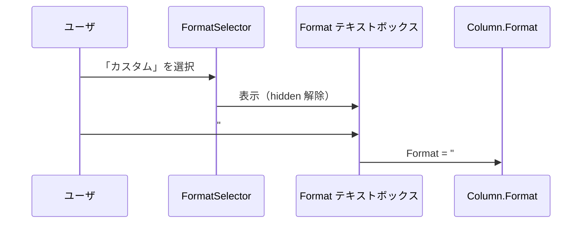
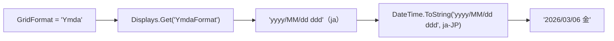

# 日付項目カスタム表示形式の実装方針

日付項目（datetime 型カラム）の一覧画面の表示形式に、.NET カスタム書式文字列を直接指定できる「カスタム」オプションを追加するための調査と実装方針をまとめた。数値項目が既に持つカスタム書式の仕組みを参考にする。

<!-- START doctoc generated TOC please keep comment here to allow auto update -->
<!-- DON'T EDIT THIS SECTION, INSTEAD RE-RUN doctoc TO UPDATE -->

- [調査情報](#調査情報)
- [調査目的](#調査目的)
- [数値項目のカスタム書式（参考実装）](#数値項目のカスタム書式参考実装)
    - [仕組みの概要](#仕組みの概要)
    - [FormatSelector ドロップダウン + Format テキストボックス](#formatselector-ドロップダウン--format-テキストボックス)
    - [Formats 定義](#formats-定義)
    - [JavaScript イベントハンドラ](#javascript-イベントハンドラ)
    - [SetColumnProperty での値保存](#setcolumnproperty-での値保存)
- [現行の日付一覧表示形式の仕組み](#現行の日付一覧表示形式の仕組み)
    - [GridFormat プロパティ](#gridformat-プロパティ)
    - [Display ID から書式文字列への変換フロー](#display-id-から書式文字列への変換フロー)
    - [定義済み表示形式の一覧](#定義済み表示形式の一覧)
    - [一覧設定の GridFormat ドロップダウン](#一覧設定の-gridformat-ドロップダウン)
    - [DateTimeOptions メソッド](#datetimeoptions-メソッド)
    - [DisplayGrid メソッド](#displaygrid-メソッド)
- [カスタム表示形式の実装方針](#カスタム表示形式の実装方針)
    - [対象](#対象)
    - [GridFormat ドロップダウンの改修](#gridformat-ドロップダウンの改修)
    - [DateTimeOptions メソッドの改修](#datetimeoptions-メソッドの改修)
    - [JavaScript イベントハンドラの追加](#javascript-イベントハンドラの追加)
    - [FormatExtension.Display() の改修](#formatextensiondisplay-の改修)
- [改修箇所の一覧](#改修箇所の一覧)
    - [変更ファイル](#変更ファイル)
    - [変更不要なファイル](#変更不要なファイル)
    - [CodeDefiner の影響](#codedefiner-の影響)
- [注意事項](#注意事項)
    - [不正な書式文字列への対策](#不正な書式文字列への対策)
    - [XSS 対策](#xss-対策)
- [結論](#結論)
- [関連ソースコード](#関連ソースコード)

<!-- END doctoc generated TOC please keep comment here to allow auto update -->

## 調査情報

| 調査日       | リポジトリ | ブランチ | タグ/バージョン    | コミット     | 備考     |
| ------------ | ---------- | -------- | ------------------ | ------------ | -------- |
| 2026年3月6日 | Pleasanter | main     | Pleasanter_1.5.1.0 | `34f162a439` | 初回調査 |

## 調査目的

- 現行の日付項目の一覧表示形式は定義済みの 6 パターン（年月日、年月日曜、年月日時分 等）に限定されている
- 「yyyy年MM月dd日」「MM-dd」「HH:mm」など任意の .NET DateTime 書式文字列を一覧画面で指定したいニーズがある
- 数値項目では既にカスタム書式（`FormatSelector` + `Format` テキストボックス）が実装されている
- この仕組みを日付項目の一覧表示にも適用するための改修箇所を調査する

---

## 数値項目のカスタム書式（参考実装）

数値項目では既にカスタム書式を指定できる仕組みが存在する。日付項目のカスタム表示形式もこのパターンに倣う。

### 仕組みの概要

数値項目の編集設定ダイアログで、`FormatSelector` ドロップダウンから「カスタム」を選択するとテキストボックスが表示され、任意の .NET 書式文字列を入力できる。



### FormatSelector ドロップダウン + Format テキストボックス

**ファイル**: `Implem.Pleasanter/Models/Sites/SiteUtilities.cs`（行番号: 8411-8438）

```csharp
private static HtmlBuilder EditorColumnFormatProperties(
    this HtmlBuilder hb, Context context, Column column)
{
    var formats = Formats();
    var custom = !column.Format.IsNullOrEmpty() && !formats.Keys.Contains(column.Format);
    return hb
        .FieldDropDown(
            context: context,
            controlId: "FormatSelector",
            controlCss: " not-send",                     // サーバに送信しない
            labelText: Displays.Format(context: context),
            optionCollection: formats
                .ToDictionary(o => o.Key, o => Displays.Get(
                    context: context,
                    id: o.Value)),
            selectedValue: custom
                ? "\t"              // カスタムの場合はタブ文字を選択
                : column.Format,
            _using: !column.Id_Ver)
        .FieldTextBox(
            fieldId: "FormatField",
            controlId: "Format",                         // 実際にサーバに送信される値
            fieldCss: custom ? string.Empty : " hidden",
            labelText: Displays.Custom(context: context),
            text: custom
                ? column.Format
                : string.Empty);
}
```

ポイントは以下のとおり。

| 要素             | 仕様                                                           |
| ---------------- | -------------------------------------------------------------- |
| FormatSelector   | `controlCss: " not-send"` でサーバに送信されない               |
| Format テキスト  | `controlId: "Format"` でサーバに送信される実値                 |
| カスタムの判定   | `"\t"`（タブ文字）をカスタムのキーとして使用                   |
| カスタム値の保持 | 定義済みキーに含まれない値が Format に設定されていればカスタム |
| 初期表示         | カスタム値がある場合のみテキストボックスを表示                 |

### Formats 定義

**ファイル**: `Implem.Pleasanter/Models/Sites/SiteUtilities.cs`（行番号: 8520-8529）

```csharp
private static Dictionary<string, string> Formats()
{
    return new Dictionary<string, string>()
    {
        { string.Empty, "Standard" },
        { "C", "Currency" },
        { "N", "DigitGrouping"},
        { "\t", "Custom" },       // タブ文字をカスタムのキーとして使用
    };
}
```

### JavaScript イベントハンドラ

**ファイル**: `Implem.PleasanterFrontend/wwwroot/src/scripts/generals/sitesettingsevents.js`（行番号: 35-47）

```javascript
$(document).on('change', '#FormatSelector', function () {
    var $control = $(this);
    switch ($control.val()) {
        case '\t': // カスタム選択時
            $('#FormatField').toggle(true); // テキストボックスを表示
            $('#Format').val('');
            break;
        default: // 定義済み選択時
            $('#FormatField').toggle(false); // テキストボックスを非表示
            $('#Format').val($control.val());
            break;
    }
});
```

### SetColumnProperty での値保存

**ファイル**: `Implem.Pleasanter/Libraries/Settings/SiteSettings.cs`（行番号: 4348-4350）

```csharp
case "GridFormat": column.GridFormat = value; break;
case "EditorFormat": column.EditorFormat = value; break;
case "Format": column.Format = value; break;
```

`SetColumnProperty` はフォームから送信された値をそのまま Column プロパティに設定するため、
カスタム書式文字列もそのまま保持される。

---

## 現行の日付一覧表示形式の仕組み

### GridFormat プロパティ

**ファイル**: `Implem.Pleasanter/Libraries/Settings/Column.cs`（行番号: 88）

```csharp
public string GridFormat;      // 一覧画面の表示形式
```

GridFormat は「Ymd」「Ymda」等の **Display ID** を保持し、表示時に `FormatExtension.Display()` で
.NET 書式文字列に変換される。

### Display ID から書式文字列への変換フロー

**ファイル**: `Implem.Pleasanter/Libraries/Extensions/FormatExtension.cs`

```csharp
public static string Display(this DateTime value, Context context, string format)
{
    return value.InRange()
        ? !format.IsNullOrEmpty()
            ? value.ToString(
                Displays.Get(
                    context: context,
                    id: format + "Format"),   // Display ID に "Format" を付加して検索
                context.CultureInfo())
            : value.ToString(context.CultureInfo())
        : string.Empty;
}
```



### 定義済み表示形式の一覧

Display JSON ファイル（`App_Data/Displays/`）で定義されている表示形式は以下のとおり。

| Display ID | 日本語ラベル         | 書式文字列（ja）          | Type |
| ---------- | -------------------- | ------------------------- | ---- |
| Ymd        | 年月日               | `yyyy/MM/dd`              | 120  |
| Ymdhm      | 日付と時刻(分)       | `yyyy/MM/dd HH:mm`        | 120  |
| Ymdhms     | 日付と時刻(秒)       | `yyyy/MM/dd HH:mm:ss`     | 120  |
| Ymda       | 年月日曜             | `yyyy/MM/dd ddd`          | 120  |
| Ymdahm     | 日付と曜日と時刻(分) | `yyyy/MM/dd ddd HH:mm`    | 120  |
| Ymdahms    | 日付と曜日と時刻(秒) | `yyyy/MM/dd ddd HH:mm:ss` | 120  |

- Type 120 = `DisplayAccessor.Displays.Types.Date`（ラベル定義）
- 各 Display ID に対応する `{ID}Format` ファイル（Type 130 = `DateFormat`）が書式文字列を保持

### 一覧設定の GridFormat ドロップダウン

**ファイル**: `Implem.Pleasanter/Models/Sites/SiteUtilities.cs`（行番号: 6084-6092）

```csharp
if (column.TypeName == "datetime")
{
    hb
        .FieldDropDown(
            context: context,
            controlId: "GridFormat",
            labelText: Displays.GridFormat(context: context),
            optionCollection: DateTimeOptions(context: context),
            selectedValue: column.GridFormat);
}
```

### DateTimeOptions メソッド

**ファイル**: `Implem.Pleasanter/Models/Sites/SiteUtilities.cs`（行番号: 8534-8548）

```csharp
private static Dictionary<string, string> DateTimeOptions(
    Context context, bool editorFormat = false)
{
    return editorFormat
        ? DisplayAccessor.Displays.DisplayHash
            .Where(o => new string[] { "Ymd", "Ymdhm", "Ymdhms" }.Contains(o.Key))
            .ToDictionary(o => o.Key, o => Displays.Get(
                context: context,
                id: o.Key))
        : DisplayAccessor.Displays.DisplayHash
            .Where(o => o.Value.Type == DisplayAccessor.Displays.Types.Date)
            .ToDictionary(o => o.Key, o => Displays.Get(
                context: context,
                id: o.Key));
}
```

一覧設定（`editorFormat=false`）では DisplayHash の Type=Date 全件（6 種）がドロップダウンに表示される。

### DisplayGrid メソッド

**ファイル**: `Implem.Pleasanter/Libraries/Settings/Column.cs`（行番号: 952-957）

```csharp
public string DisplayGrid(Context context, DateTime value)
{
    return value.Display(
        context: context,
        format: GridFormat);
}
```

一覧画面のセル描画時に `GridFormat` を使って `FormatExtension.Display()` を呼び出す。

---

## カスタム表示形式の実装方針

数値項目の FormatSelector パターンを日付項目の GridFormat に適用する。

### 対象

一覧画面の表示形式（GridFormat）のみを対象とする。

### GridFormat ドロップダウンの改修

現行の `GridFormat` ドロップダウンを、数値項目と同様に Selector + テキストボックスの 2 段構成に変更する。

**改修案**（SiteUtilities.cs 行番号: 6084-6092 付近）:

```csharp
if (column.TypeName == "datetime")
{
    var dateTimeOptions = DateTimeOptions(context: context);
    var isCustomGridFormat = !column.GridFormat.IsNullOrEmpty()
        && !dateTimeOptions.Keys.Contains(column.GridFormat);
    hb
        .FieldDropDown(
            context: context,
            controlId: "GridFormatSelector",        // Selector（not-send）
            controlCss: " not-send",
            labelText: Displays.GridFormat(context: context),
            optionCollection: dateTimeOptions,
            selectedValue: isCustomGridFormat ? "\t" : column.GridFormat)
        .FieldTextBox(
            fieldId: "CustomGridFormatField",
            controlId: "GridFormat",                // 実値（サーバに送信）
            fieldCss: isCustomGridFormat ? string.Empty : " hidden",
            labelText: Displays.Custom(context: context),
            text: isCustomGridFormat ? column.GridFormat : string.Empty);
}
```

### DateTimeOptions メソッドの改修

ドロップダウンにカスタムオプションを追加する。

```csharp
private static Dictionary<string, string> DateTimeOptions(
    Context context, bool editorFormat = false)
{
    if (editorFormat)
    {
        return DisplayAccessor.Displays.DisplayHash
            .Where(o => new string[] { "Ymd", "Ymdhm", "Ymdhms" }.Contains(o.Key))
            .ToDictionary(o => o.Key, o => Displays.Get(
                context: context,
                id: o.Key));
    }
    var options = DisplayAccessor.Displays.DisplayHash
        .Where(o => o.Value.Type == DisplayAccessor.Displays.Types.Date)
        .ToDictionary(o => o.Key, o => Displays.Get(
            context: context,
            id: o.Key));
    options.Add("\t", Displays.Custom(context: context));
    return options;
}
```

### JavaScript イベントハンドラの追加

**ファイル**: `Implem.PleasanterFrontend/wwwroot/src/scripts/generals/sitesettingsevents.js`

数値項目の `#FormatSelector` と同じパターンで `#GridFormatSelector` のイベントを追加する。

```javascript
$(document).on('change', '#GridFormatSelector', function () {
    var $control = $(this);
    switch ($control.val()) {
        case '\t':
            $('#CustomGridFormatField').toggle(true);
            $('#GridFormat').val('');
            break;
        default:
            $('#CustomGridFormatField').toggle(false);
            $('#GridFormat').val($control.val());
            break;
    }
});
```

### FormatExtension.Display() の改修

現状の `Display()` メソッドは Display ID に `"Format"` を付加して DisplayHash から検索する。
カスタム書式文字列は DisplayHash に存在しないため、フォールバック処理が必要になる。

**改修案**:

```csharp
public static string Display(this DateTime value, Context context, string format)
{
    return value.InRange()
        ? !format.IsNullOrEmpty()
            ? value.ToString(
                GetDateTimeFormat(context, format),
                context.CultureInfo())
            : value.ToString(context.CultureInfo())
        : string.Empty;
}

private static string GetDateTimeFormat(Context context, string format)
{
    var displayId = format + "Format";
    var resolved = Displays.Get(context: context, id: displayId);
    // Displays.Get は ID が見つからない場合、ID 自体を返す
    // 「{format}Format」がそのまま返った場合はカスタム書式と判定
    return resolved == displayId
        ? format   // カスタム書式文字列をそのまま使用
        : resolved; // 定義済みの書式文字列を使用
}
```

`Displays.Get()` のフォールバック挙動（存在しない ID はそのまま返す）に依存している点に注意が必要である。

---

## 改修箇所の一覧

### 変更ファイル

| ファイル                                  | 変更内容                                                |
| ----------------------------------------- | ------------------------------------------------------- |
| `Libraries/Extensions/FormatExtension.cs` | カスタム書式文字列のフォールバック処理を追加            |
| `Models/Sites/SiteUtilities.cs`           | DateTimeOptions にカスタム追加、GridFormat の UI を改修 |
| `sitesettingsevents.js`                   | `#GridFormatSelector` のイベントハンドラを追加          |

### 変更不要なファイル

| ファイル                             | 理由                                              |
| ------------------------------------ | ------------------------------------------------- |
| `Libraries/Settings/Column.cs`       | GridFormat は既に string 型で任意値を保持可能     |
| `Libraries/Settings/SiteSettings.cs` | SetColumnProperty の GridFormat case は既存のまま |

### CodeDefiner の影響

Column 定義への新規プロパティ追加はないため、CodeDefiner による自動生成コードへの影響はない。

---

## 注意事項

### 不正な書式文字列への対策

ユーザが不正な .NET 書式文字列を入力した場合、`DateTime.ToString()` で `FormatException` が発生する。
try-catch による例外処理と、入力時のバリデーションの両方が必要である。

```csharp
private static bool IsValidDateTimeFormat(string format)
{
    try
    {
        DateTime.Now.ToString(format, CultureInfo.InvariantCulture);
        return true;
    }
    catch (FormatException)
    {
        return false;
    }
}
```

### XSS 対策

カスタム書式文字列にはリテラル文字指定（`'`）を使った任意テキスト埋め込みが可能である
（例: `yyyy'年'MM'月'dd'日'`）。
HTML 出力時にはエスケープ処理が必要だが、プリザンターの既存の HTML エンコーディング（`HtmlEncode`）が
適用されるため、追加対策は不要と考える。

---

## 結論

| 項目               | 内容                                                          |
| ------------------ | ------------------------------------------------------------- |
| 対象               | GridFormat（一覧画面の表示形式）                              |
| 参考実装           | 数値項目の FormatSelector + Format テキストボックス           |
| UI パターン        | Selector（not-send）+ テキストボックス（実値送信）の 2 段構成 |
| 主な改修箇所       | FormatExtension.cs、SiteUtilities.cs、sitesettingsevents.js   |
| Column.cs の変更   | 不要（既存の string 型プロパティで任意値を保持可能）          |
| CodeDefiner の影響 | なし                                                          |
| バリデーション     | 不正な書式文字列に対する FormatException 対策が必要           |

## 関連ソースコード

| ファイル                                                                       | 内容                                   |
| ------------------------------------------------------------------------------ | -------------------------------------- |
| `Implem.Pleasanter/Libraries/Settings/Column.cs`                               | GridFormat 定義、DisplayGrid メソッド  |
| `Implem.Pleasanter/Libraries/Extensions/FormatExtension.cs`                    | DateTime 書式変換                      |
| `Implem.Pleasanter/Libraries/Responses/Displays.cs`                            | Display ID 解決                        |
| `Implem.Pleasanter/Models/Sites/SiteUtilities.cs`                              | 設定 UI 生成、DateTimeOptions、Formats |
| `Implem.Pleasanter/Libraries/Settings/SiteSettings.cs`                         | SetColumnProperty                      |
| `Implem.PleasanterFrontend/wwwroot/src/scripts/generals/sitesettingsevents.js` | 設定画面イベントハンドラ               |
| `Implem.Pleasanter/App_Data/Displays/Ymd.json`                                 | 年月日 Display 定義                    |
| `Implem.Pleasanter/App_Data/Displays/YmdFormat.json`                           | 年月日書式文字列定義                   |
