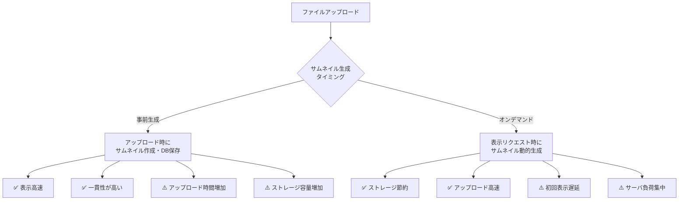
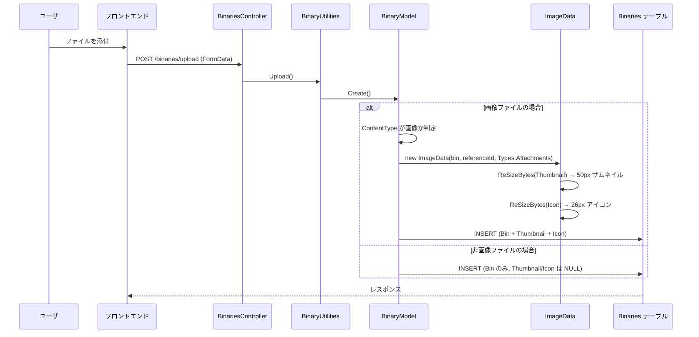
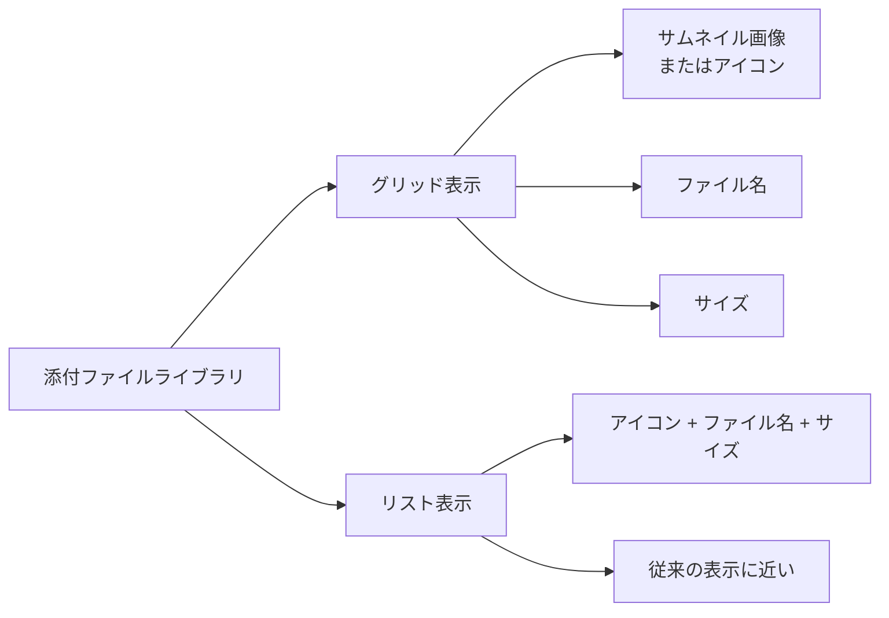
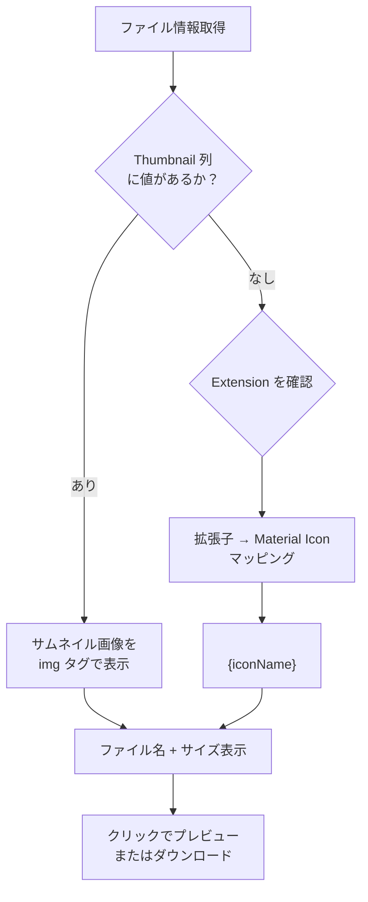

# 添付ファイルライブラリ機能の実装調査

画像ライブラリのように添付ファイルをサムネイル付きで一覧表示する「添付ファイルライブラリ」の実装可否と方針を調査した。

<!-- START doctoc generated TOC please keep comment here to allow auto update -->
<!-- DON'T EDIT THIS SECTION, INSTEAD RE-RUN doctoc TO UPDATE -->

- [調査情報](#調査情報)
- [調査目的](#調査目的)
- [現行の添付ファイルアーキテクチャ](#現行の添付ファイルアーキテクチャ)
    - [Binaries テーブル構造](#binaries-テーブル構造)
    - [BinaryType ごとのサムネイル生成状況](#binarytype-ごとのサムネイル生成状況)
    - [現行の添付ファイル表示 HTML](#現行の添付ファイル表示-html)
- [サムネイル生成の技術調査](#サムネイル生成の技術調査)
    - [SixLabors.ImageSharp による画像サムネイル生成](#sixlaborsimagesharp-による画像サムネイル生成)
    - [サムネイル生成可能なファイル形式](#サムネイル生成可能なファイル形式)
    - [アップロード時事前生成 vs オンデマンド生成](#アップロード時事前生成-vs-オンデマンド生成)
- [サムネイル生成の実装方針](#サムネイル生成の実装方針)
    - [添付ファイルアップロード時のサムネイル生成フロー](#添付ファイルアップロード時のサムネイル生成フロー)
    - [画像判定ロジック](#画像判定ロジック)
    - [サムネイル生成処理（ImageData 拡張）](#サムネイル生成処理imagedata-拡張)
    - [BinaryModel への組み込み](#binarymodel-への組み込み)
- [サムネイル非対応ファイルのフォールバック表示](#サムネイル非対応ファイルのフォールバック表示)
    - [Google Material Symbols によるファイルタイプアイコン](#google-material-symbols-によるファイルタイプアイコン)
    - [拡張子から Material Icon へのマッピング](#拡張子から-material-icon-へのマッピング)
    - [C# 側のアイコンマッピング実装](#c-側のアイコンマッピング実装)
    - [フロントエンド側のアイコンマッピング実装](#フロントエンド側のアイコンマッピング実装)
- [添付ファイルライブラリ UI の設計](#添付ファイルライブラリ-ui-の設計)
    - [表示モード](#表示モード)
    - [グリッド表示のレンダリングロジック](#グリッド表示のレンダリングロジック)
    - [HTML 出力例](#html-出力例)
    - [CSS 設計案](#css-設計案)
- [サムネイル配信エンドポイント](#サムネイル配信エンドポイント)
    - [既存エンドポイントの拡張](#既存エンドポイントの拡張)
- [実装時の考慮事項](#実装時の考慮事項)
    - [既存データへのサムネイル追加（マイグレーション）](#既存データへのサムネイル追加マイグレーション)
    - [ストレージ容量への影響](#ストレージ容量への影響)
    - [パフォーマンスへの影響](#パフォーマンスへの影響)
    - [セキュリティ考慮](#セキュリティ考慮)
- [結論](#結論)
- [関連ソースコード](#関連ソースコード)
- [関連ドキュメント](#関連ドキュメント)

<!-- END doctoc generated TOC please keep comment here to allow auto update -->

## 調査情報

| 調査日        | リポジトリ | ブランチ | タグ/バージョン    | コミット     | 備考     |
| ------------- | ---------- | -------- | ------------------ | ------------ | -------- |
| 2026年3月10日 | Pleasanter | main     | Pleasanter_1.5.1.0 | `34f162a439` | 初回調査 |

## 調査目的

- 画像ライブラリのように添付ファイルをサムネイル付きで一覧表示する UI の実現可否を確認する
- サムネイル生成の技術的アプローチ（アップロード時事前生成 vs オンデマンド生成）を比較し最適解を導く
- サムネイル非対応ファイル形式に対する代替表示（Google Material Icons による拡張子推測アイコン）の実装方式を調査する

---

## 現行の添付ファイルアーキテクチャ

### Binaries テーブル構造

添付ファイルは `Binaries` テーブルに格納される。

| カラム      | 型          | 用途                                                   |
| ----------- | ----------- | ------------------------------------------------------ |
| BinaryId    | bigint      | 主キー（Identity）                                     |
| TenantId    | int         | テナント識別子                                         |
| ReferenceId | bigint      | 参照先 ID（SiteId / UserId / ThreadId 等）             |
| Guid        | uniqueident | ファイル識別子（URL パスに使用）                       |
| BinaryType  | nvarchar    | 種別（`SiteImage` / `TenantImage` / `Attachments` 等） |
| Bin         | varbinary   | 元ファイルバイナリ                                     |
| Thumbnail   | varbinary   | サムネイル画像バイナリ（50px）                         |
| Icon        | varbinary   | アイコン画像バイナリ（26px）                           |
| FileName    | nvarchar    | 元ファイル名                                           |
| Extension   | nvarchar    | 拡張子                                                 |
| Size        | bigint      | ファイルサイズ（バイト）                               |
| ContentType | nvarchar    | MIME タイプ                                            |

### BinaryType ごとのサムネイル生成状況

| BinaryType               | サムネイル生成 | 生成サイズ                                    | 備考                |
| ------------------------ | -------------- | --------------------------------------------- | ------------------- |
| `SiteImage`              | ✅ あり        | Regular(460px) / Thumbnail(50px) / Icon(26px) | 3 サイズ自動生成    |
| `TenantImage`            | ⚠️ 部分的      | Logo(32px) のみ                               | サムネイル列は NULL |
| `TenantManagementImages` | ❌ なし        | —                                             | 元バイナリのみ      |
| `Attachments`            | ❌ なし        | —                                             | 元バイナリのみ      |

**ポイント**: 現状の `Attachments` タイプではサムネイル・アイコン列は常に NULL であり、画像ファイルであってもサムネイルは生成されない。

### 現行の添付ファイル表示 HTML

**ファイル**: `Implem.Pleasanter/Libraries/HtmlParts/HtmlControls.cs`（行番号: 1099-1147）

```html
<div id="{guid}" class="control-attachments-item">
    <a class="file-name" href="/binaries/{guid}/show" target="_blank">
        <span class="ui-icon ui-icon-circle-zoomin show-file"></span>
    </a>
    <a class="file-name" href="/binaries/{guid}/download"> {FileName} ({Size}) </a>
    <div class="ui-icon ui-icon-circle-close delete-file"></div>
</div>
```

現在は「ファイル名 + サイズ」のテキストリスト表示のみで、サムネイルやアイコン表示は行われていない。

---

## サムネイル生成の技術調査

### SixLabors.ImageSharp による画像サムネイル生成

プリザンターは `SixLabors.ImageSharp 3.1.12` をサーバサイド画像処理ライブラリとして使用している。

**ファイル**: `Implem.Pleasanter/Libraries/Images/ImageData.cs`

```csharp
// 既存のリサイズ処理（SiteImage 用）
private Image ReSize(SizeTypes sizeType)
{
    var size = (double)Size(sizeType);
    var rate = (Data.Width > Data.Height) || (sizeType == SizeTypes.Logo)
        ? size / Data.Height
        : size / Data.Width;
    // ...
    return GetImage(width, height, x, y);
}

public byte[] ReSizeBytes(SizeTypes sizeType)
{
    using var memory = new MemoryStream();
    ReSize(sizeType).Save(memory, new PngEncoder());
    return memory.ToArray();
}
```

### サムネイル生成可能なファイル形式

| ファイル種別                  | サムネイル生成 | 方式                                       | 備考                             |
| ----------------------------- | -------------- | ------------------------------------------ | -------------------------------- |
| 画像（JPEG/PNG/GIF/WebP/BMP） | ✅ 可能        | ImageSharp でリサイズ                      | 既存処理の流用可                 |
| PDF                           | ⚠️ 条件付き    | 外部ライブラリ必要（PDFium / Ghostscript） | サーバ側依存ライブラリが必要     |
| Office ドキュメント           | ⚠️ 条件付き    | LibreOffice CLI / Open XML SDK             | サーバ環境への追加インストール要 |
| 動画                          | ⚠️ 条件付き    | FFmpeg                                     | サーバ環境への追加インストール要 |
| テキスト/CSV                  | ❌ 不可        | —                                          | 視覚的サムネイルの意味が薄い     |
| その他バイナリ                | ❌ 不可        | —                                          | サムネイル生成不可               |

### アップロード時事前生成 vs オンデマンド生成



| 比較項目             | アップロード時事前生成                 | オンデマンド生成                        |
| -------------------- | -------------------------------------- | --------------------------------------- |
| 表示速度             | ✅ 高速（DB/ストレージから即座に返却） | ⚠️ 初回は遅延（キャッシュ後は高速）     |
| アップロード体験     | ⚠️ 処理時間が若干増加                  | ✅ 高速                                 |
| ストレージ消費       | ⚠️ サムネイル分の追加容量が必要        | ✅ 必要時のみ生成（キャッシュ方式次第） |
| 実装の一貫性         | ✅ SiteImage と同じパターン            | ⚠️ 新しいキャッシュ機構の導入が必要     |
| サーバ負荷           | ✅ アップロード時に分散                | ⚠️ 一覧表示時に集中                     |
| 既存テーブルとの整合 | ✅ Thumbnail/Icon 列をそのまま活用     | ⚠️ 別テーブルまたはキャッシュ層が必要   |
| 既存処理との親和性   | ✅ ImageData.ReSizeBytes() を流用      | ⚠️ 新規エンドポイント・処理が必要       |

**推奨: アップロード時事前生成**

理由:

1. **既存の SiteImage アーキテクチャと同じパターン** — `Binaries` テーブルの `Thumbnail` / `Icon` 列に格納する方式は既存の `SiteImage` と完全に同じであり、新たなインフラ変更が不要
2. **ImageData クラスの再利用** — `ReSizeBytes(SizeTypes.Thumbnail)` をそのまま呼び出せる
3. **表示時のレスポンス** — 一覧表示時にサムネイルを即座に返却でき、ユーザ体験が良い
4. **サムネイル生成の失敗ハンドリング** — アップロード時にサムネイル生成に失敗しても、元ファイルの保存は成功させ、サムネイル列を NULL のまま残す（＝フォールバックアイコン表示）という処理が明快

---

## サムネイル生成の実装方針

### 添付ファイルアップロード時のサムネイル生成フロー



### 画像判定ロジック

```csharp
// 提案: BinaryModel または BinaryUtilities に追加
private static readonly HashSet<string> ThumbnailSupportedMimeTypes = new(StringComparer.OrdinalIgnoreCase)
{
    "image/jpeg",
    "image/png",
    "image/gif",
    "image/webp",
    "image/bmp"
};

private bool CanGenerateThumbnail(string contentType)
{
    return ThumbnailSupportedMimeTypes.Contains(contentType);
}
```

### サムネイル生成処理（ImageData 拡張）

```csharp
// ImageData.cs への追加
// Types 列挙型に Attachments を追加
public enum Types : int
{
    SiteImage = 1,
    TenantImage = 2,
    ProfileImage = 3,
    Attachments = 4    // 新規追加
}

// サムネイル生成メソッド
public byte[] GenerateAttachmentThumbnail()
{
    try
    {
        return ReSizeBytes(SizeTypes.Thumbnail);  // 50px
    }
    catch
    {
        return null;  // 生成失敗時は NULL（フォールバックアイコン表示）
    }
}

public byte[] GenerateAttachmentIcon()
{
    try
    {
        return ReSizeBytes(SizeTypes.Icon);  // 26px
    }
    catch
    {
        return null;
    }
}
```

### BinaryModel への組み込み

```csharp
// BinaryModel.cs - Attachments 保存時の処理
public void CreateAttachment(Context context, byte[] bin, string fileName, string contentType)
{
    byte[] thumbnail = null;
    byte[] icon = null;

    if (CanGenerateThumbnail(contentType))
    {
        try
        {
            var imageData = new ImageData(bin, ReferenceId, ImageData.Types.Attachments);
            thumbnail = imageData.GenerateAttachmentThumbnail();
            icon = imageData.GenerateAttachmentIcon();
        }
        catch
        {
            // サムネイル生成失敗は無視（元ファイルの保存は継続）
        }
    }

    // Binaries テーブルへ INSERT
    Rds.ExecuteNonQuery(
        context: context,
        statements: Rds.InsertBinaries(
            param: Rds.BinariesParam()
                .TenantId(context.TenantId)
                .ReferenceId(ReferenceId)
                .BinaryType("Attachments")
                .Bin(bin)
                .Thumbnail(thumbnail)      // 画像の場合のみ値あり
                .Icon(icon)                // 画像の場合のみ値あり
                .FileName(fileName)
                .Extension(Path.GetExtension(fileName))
                .Size(bin.LongLength)
                .ContentType(contentType)));
}
```

---

## サムネイル非対応ファイルのフォールバック表示

### Google Material Symbols によるファイルタイプアイコン

プリザンターは既に `Google Material Symbols Sharp` を導入済みである。

**ファイル**: `Implem.PleasanterFrontend/wwwroot/src/plugins/material-symbols/`

```
material-symbols/
├── index.css
├── material-symbols-outlined.woff2
├── material-symbols-rounded.woff2
└── material-symbols-sharp.woff2
```

**レンダリング方式**（リガチャベース）:

```html
<span class="material-symbols-sharp">attach_file</span>
```

### 拡張子から Material Icon へのマッピング

サムネイルが `NULL`（非画像ファイルまたはサムネイル生成失敗）の場合、ファイル拡張子から推測して Material Icon を表示する。

| 拡張子                              | Material Icon 名 | 表示             | カテゴリ     |
| ----------------------------------- | ---------------- | ---------------- | ------------ |
| `.pdf`                              | `picture_as_pdf` | PDF アイコン     | ドキュメント |
| `.doc` / `.docx`                    | `description`    | 文書アイコン     | Office       |
| `.xls` / `.xlsx`                    | `table_chart`    | 表アイコン       | Office       |
| `.ppt` / `.pptx`                    | `slideshow`      | スライドアイコン | Office       |
| `.txt` / `.csv` / `.log`            | `text_snippet`   | テキストアイコン | テキスト     |
| `.zip` / `.rar` / `.7z` / `.tar.gz` | `folder_zip`     | 圧縮アイコン     | アーカイブ   |
| `.mp4` / `.avi` / `.mov` / `.webm`  | `movie`          | 動画アイコン     | メディア     |
| `.mp3` / `.wav` / `.ogg` / `.flac`  | `audio_file`     | 音声アイコン     | メディア     |
| `.html` / `.css` / `.js` / `.ts`    | `code`           | コードアイコン   | 開発         |
| `.json` / `.xml` / `.yaml`          | `data_object`    | データアイコン   | データ       |
| その他 / 不明                       | `attach_file`    | 汎用添付アイコン | デフォルト   |

### C# 側のアイコンマッピング実装

```csharp
// 提案: HtmlControls.cs または新規 AttachmentIconHelper.cs に追加
public static string GetMaterialIconForExtension(string extension)
{
    return extension?.ToLower() switch
    {
        ".pdf" => "picture_as_pdf",
        ".doc" or ".docx" => "description",
        ".xls" or ".xlsx" => "table_chart",
        ".ppt" or ".pptx" => "slideshow",
        ".txt" or ".csv" or ".log" => "text_snippet",
        ".zip" or ".rar" or ".7z" or ".gz" or ".tar" => "folder_zip",
        ".mp4" or ".avi" or ".mov" or ".webm" or ".mkv" => "movie",
        ".mp3" or ".wav" or ".ogg" or ".flac" or ".aac" => "audio_file",
        ".html" or ".css" or ".js" or ".ts" => "code",
        ".json" or ".xml" or ".yaml" or ".yml" => "data_object",
        _ => "attach_file"
    };
}
```

### フロントエンド側のアイコンマッピング実装

サイトスクリプト等で動的にアイコン表示を制御する場合の JavaScript 実装:

```javascript
function getMaterialIconForExtension(fileName) {
    var ext = (fileName.match(/\.([^.]+)$/) || [])[1]?.toLowerCase();
    var iconMap = {
        pdf: 'picture_as_pdf',
        doc: 'description',
        docx: 'description',
        xls: 'table_chart',
        xlsx: 'table_chart',
        ppt: 'slideshow',
        pptx: 'slideshow',
        txt: 'text_snippet',
        csv: 'text_snippet',
        log: 'text_snippet',
        zip: 'folder_zip',
        rar: 'folder_zip',
        '7z': 'folder_zip',
        gz: 'folder_zip',
        mp4: 'movie',
        avi: 'movie',
        mov: 'movie',
        webm: 'movie',
        mp3: 'audio_file',
        wav: 'audio_file',
        ogg: 'audio_file',
        html: 'code',
        css: 'code',
        js: 'code',
        ts: 'code',
        json: 'data_object',
        xml: 'data_object',
        yaml: 'data_object',
        yml: 'data_object',
    };
    return iconMap[ext] || 'attach_file';
}
```

---

## 添付ファイルライブラリ UI の設計

### 表示モード



### グリッド表示のレンダリングロジック



### HTML 出力例

#### サムネイルありの場合（画像ファイル）

```html
<div class="attachment-library-item">
    <div class="attachment-thumbnail">
        <a href="/binaries/{guid}/show" target="_blank">
            
        </a>
    </div>
    <div class="attachment-info">
        <a href="/binaries/{guid}/download" class="file-name">{FileName}</a>
        <span class="file-size">({Size})</span>
    </div>
</div>
```

#### サムネイルなしの場合（非画像ファイル）

```html
<div class="attachment-library-item">
    <div class="attachment-thumbnail attachment-icon-fallback">
        <a href="/binaries/{guid}/show" target="_blank">
            <span class="material-symbols-sharp">picture_as_pdf</span>
        </a>
    </div>
    <div class="attachment-info">
        <a href="/binaries/{guid}/download" class="file-name">{FileName}</a>
        <span class="file-size">({Size})</span>
    </div>
</div>
```

### CSS 設計案

```css
/* 添付ファイルライブラリ グリッド */
.attachment-library {
    display: grid;
    grid-template-columns: repeat(auto-fill, minmax(120px, 1fr));
    gap: 8px;
    padding: 8px;
}

.attachment-library-item {
    display: flex;
    flex-direction: column;
    align-items: center;
    border: 1px solid var(--border-color);
    border-radius: 4px;
    padding: 8px;
    cursor: pointer;
    transition: background-color 0.2s;
}

.attachment-library-item:hover {
    background-color: var(--hover-bg-color);
}

.attachment-thumbnail {
    width: 80px;
    height: 80px;
    display: flex;
    align-items: center;
    justify-content: center;
    overflow: hidden;
}

.attachment-thumbnail img {
    max-width: 100%;
    max-height: 100%;
    object-fit: contain;
}

/* フォールバックアイコン */
.attachment-icon-fallback .material-symbols-sharp {
    font-size: 48px;
    color: var(--icon-color, #5f6368);
}

.attachment-info {
    text-align: center;
    margin-top: 4px;
    font-size: 12px;
    overflow: hidden;
    text-overflow: ellipsis;
    white-space: nowrap;
    max-width: 100%;
}
```

---

## サムネイル配信エンドポイント

### 既存エンドポイントの拡張

サムネイル取得用に既存の `Show` アクションにクエリパラメータを追加する方式が既存パターンと整合する。

| エンドポイント                          | 用途                 |
| --------------------------------------- | -------------------- |
| `GET /binaries/{guid}/show`             | 元ファイル表示       |
| `GET /binaries/{guid}/show?thumbnail=1` | サムネイル表示       |
| `GET /binaries/{guid}/download`         | ファイルダウンロード |

```csharp
// BinariesController.cs - Show アクションの拡張案
public ActionResult Show(string guid, bool thumbnail = false)
{
    var binary = BinaryUtilities.GetBinaryByGuid(context, guid);
    if (binary == null) return NotFound();

    if (thumbnail && binary.Thumbnail != null)
    {
        return File(binary.Thumbnail, "image/png");
    }

    return File(binary.Bin, binary.ContentType, binary.FileName);
}
```

---

## 実装時の考慮事項

### 既存データへのサムネイル追加（マイグレーション）

既存の `Attachments` レコードにはサムネイルが存在しない。以下のアプローチが考えられる。

| アプローチ         | 説明                                                 | 推奨度 |
| ------------------ | ---------------------------------------------------- | ------ |
| バッチ一括生成     | CodeDefiner 等でまとめてサムネイルを生成             | ⚠️     |
| 遅延生成           | 初回アクセス時にサムネイルがなければ生成して DB 更新 | ✅     |
| フォールバックのみ | 既存データは Material Icon 表示のみ                  | ✅     |

**推奨**: 既存データに対しては Material Icon フォールバック表示で対応し、新規アップロード分からサムネイルを生成する方式が最も低リスク。

### ストレージ容量への影響

| 項目                   | 推定値                                               |
| ---------------------- | ---------------------------------------------------- |
| サムネイル（50px PNG） | 約 2-10 KB/ファイル                                  |
| アイコン（26px PNG）   | 約 1-3 KB/ファイル                                   |
| 1,000 ファイルの増分   | 約 3-13 MB                                           |
| 影響度                 | 元ファイルサイズに比して極めて小さく、問題にならない |

### パフォーマンスへの影響

| 項目                     | 影響                                                   |
| ------------------------ | ------------------------------------------------------ |
| アップロード時の処理時間 | 画像ファイルの場合 +50-200ms 程度（ImageSharp 処理）   |
| 一覧表示のレスポンス     | サムネイルを `Binaries` テーブルから返すため既存と同等 |
| 非画像ファイル           | サムネイル生成処理なし、影響ゼロ                       |

### セキュリティ考慮

- サムネイル生成時の入力検証は既存の `BinaryValidators.OnUploadingSiteImage()` と同様に `Image.Load<Rgba32>()` で画像形式を検証する
- 悪意のあるファイル（拡張子偽装等）に対しては `Image.Load` の例外で安全にフォールバックする
- サムネイルは PNG 形式で再エンコードされるため、元画像に埋め込まれた悪意のあるメタデータは除去される

---

## 結論

| 調査項目                     | 結論                                                                    |
| ---------------------------- | ----------------------------------------------------------------------- |
| サムネイル生成の可否         | 画像ファイル（JPEG/PNG/GIF/WebP/BMP）は ImageSharp で生成可能           |
| 推奨生成タイミング           | **アップロード時の事前生成**（既存 SiteImage パターンと統一）           |
| 事前生成の理由               | 既存テーブル構造・ImageData クラスの再利用、表示時の高速レスポンス      |
| 非画像ファイルの表示         | Google Material Symbols（導入済み）で拡張子からアイコン推測表示         |
| 既存データのマイグレーション | Material Icon フォールバックで対応、新規分からサムネイル生成            |
| ストレージ影響               | サムネイル追加による容量増は元ファイルに比して微小（2-10KB/件）         |
| 必要な改修箇所               | ImageData.cs / BinaryModel.cs / HtmlControls.cs / BinariesController.cs |

---

## 関連ソースコード

| ファイル                                                                      | 説明                         |
| ----------------------------------------------------------------------------- | ---------------------------- |
| `Implem.Pleasanter/Libraries/Images/ImageData.cs`                             | 画像リサイズ・サムネイル生成 |
| `Implem.Pleasanter/Models/Binaries/BinaryModel.cs`                            | バイナリモデル（CRUD 操作）  |
| `Implem.Pleasanter/Models/Binaries/BinaryValidators.cs`                       | アップロード検証             |
| `Implem.Pleasanter/Controllers/BinariesController.cs`                         | バイナリ関連エンドポイント   |
| `Implem.Pleasanter/Libraries/HtmlParts/HtmlControls.cs`                       | 添付ファイル HTML 生成       |
| `Implem.ParameterAccessor/Parts/BinaryStorage.cs`                             | ストレージプロバイダ設定     |
| `Implem.ParameterAccessor/Parts/General.cs`                                   | 画像サイズパラメータ         |
| `Implem.PleasanterFrontend/wwwroot/src/plugins/material-symbols/`             | Material Symbols フォント    |
| `Implem.PleasanterFrontend/wwwroot/src/scripts/generals/attachmentsevents.js` | 添付ファイルイベントハンドラ |

## 関連ドキュメント

- [添付ファイル画像プレビューモーダル](007-添付ファイル画像プレビューモーダル.md)
- [サイト画像 1:1 リサイズ](011-サイト画像1対1リサイズ.md)
- [プロフィール画像アップロード・トリミング機能](012-プロフィール画像・トリミング機能.md)
- [アイコンシステム](../09-フロントエンド基盤/002-アイコンシステム.md)
- [添付ファイル拡張子制限](../14-セキュリティ/006-添付ファイル拡張子制限.md)
