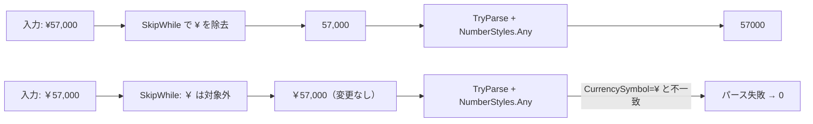
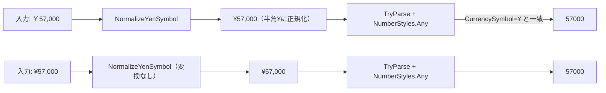
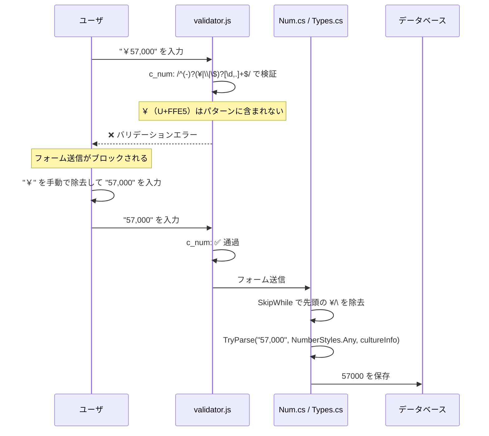
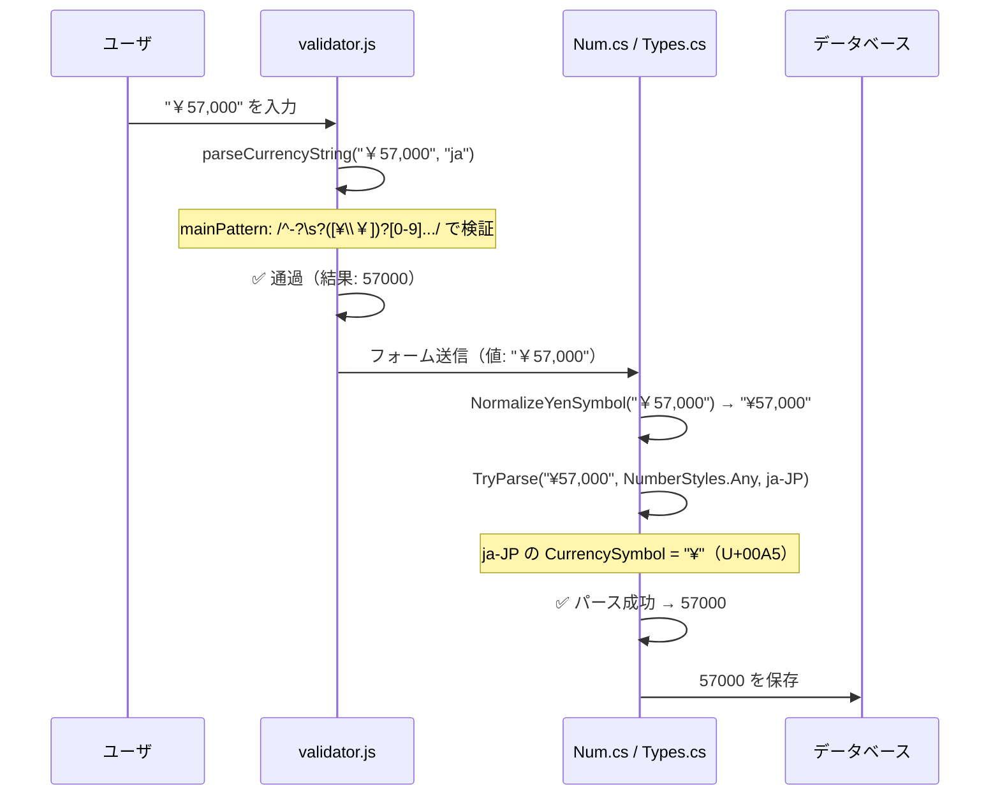

# 数値項目における通貨記号変換の改変調査

プリザンター 1.5.0.0 → 1.5.1.0 で行われた数値項目の通貨記号処理の変更を調査し、「￥57,000」のような入力が 0 になる現象の原因を分析する。

<!-- START doctoc generated TOC please keep comment here to allow auto update -->
<!-- DON'T EDIT THIS SECTION, INSTEAD RE-RUN doctoc TO UPDATE -->

- [調査情報](#調査情報)
- [調査目的](#調査目的)
- [変更箇所の特定](#変更箇所の特定)
- [円記号のコードポイント整理](#円記号のコードポイント整理)
- [サーバサイドの変更](#サーバサイドの変更)
    - [旧コード（1.5.0.0）: SkipWhile 方式](#旧コード1500-skipwhile-方式)
    - [新コード（1.5.1.0 以降）: NormalizeYenSymbol 方式](#新コード1510-以降-normalizeyensymbol-方式)
    - [CultureInfo の変更](#cultureinfo-の変更)
- [クライアントサイドの変更](#クライアントサイドの変更)
    - [旧コード（1.5.0.0）: 単純正規表現方式](#旧コード1500-単純正規表現方式)
    - [新コード（1.5.1.0 以降）: parseCurrencyString 方式](#新コード1510-以降-parsecurrencystring-方式)
- [処理フロー全体の比較](#処理フロー全体の比較)
    - [旧処理フロー（1.5.0.0）](#旧処理フロー1500)
    - [新処理フロー（1.5.1.0 以降）](#新処理フロー1510-以降)
- [原因分析](#原因分析)
    - [新コードにおける「値が 0 になる」シナリオの検証](#新コードにおける値が-0-になるシナリオの検証)
    - [旧コードで通貨記号付き入力が成功していた可能性](#旧コードで通貨記号付き入力が成功していた可能性)
- [変更の要約](#変更の要約)
    - [サーバサイドの変更一覧](#サーバサイドの変更一覧)
    - [クライアントサイドの変更一覧](#クライアントサイドの変更一覧)
- [結論](#結論)
- [関連ソースコード](#関連ソースコード)

<!-- END doctoc generated TOC please keep comment here to allow auto update -->

## 調査情報

| 調査日        | リポジトリ | ブランチ | タグ/バージョン                          | コミット                   | 備考     |
| ------------- | ---------- | -------- | ---------------------------------------- | -------------------------- | -------- |
| 2026年3月16日 | Pleasanter | main     | Pleasanter_1.5.0.0 ～ Pleasanter_1.5.2.0 | `b3c35fb04b`～`363365b35c` | 初回調査 |

## 調査目的

- 従来であれば「￥57,000」といった通貨記号付きの入力が「57000」に自動変換されていた
- 1.5.0.0 → 1.5.2.0 の間で改変が行われ、「￥」を手動で取り除かないと値が 0 になる現象が発生している
- 変更箇所の特定と原因分析を行い、根本原因と対処方針を明確にする

---

## 変更箇所の特定

1.5.0.0（`b3c35fb04b`）と 1.5.2.0（`363365b35c`）の間には 2 つのリリースコミットが存在する。
数値項目に関する変更はすべて **1.5.1.0（`8b352ca50a`）** で導入された。
1.5.1.0 → 1.5.2.0 の間には数値関連の変更はない。

| 変更ファイル                                                          | 変更内容                                                                      |
| --------------------------------------------------------------------- | ----------------------------------------------------------------------------- |
| `Implem.Libraries/Utilities/Strings.cs`                               | `NormalizeYenSymbol()` 拡張メソッドを新規追加                                 |
| `Implem.Libraries/Utilities/Types.cs`                                 | `ToDecimal(CultureInfo)` 内の通貨記号除去処理を `NormalizeYenSymbol()` に置換 |
| `Implem.Pleasanter/Libraries/DataTypes/Num.cs`                        | コンストラクタ内の通貨記号除去処理を `NormalizeYenSymbol()` に置換            |
| `Implem.PleasanterFrontend/wwwroot/src/scripts/generals/validator.js` | クライアント側バリデーションを `$p.parseCurrencyString()` に全面書き換え      |

---

## 円記号のコードポイント整理

この調査で頻出する円記号のバリエーションを整理する。フォントによっては見分けがつかないことに注意。

| 文字 | コードポイント | C# 表記             | JavaScript 表記 | 名称                                                               |
| ---- | -------------- | ------------------- | --------------- | ------------------------------------------------------------------ |
| `¥`  | U+00A5         | `(char)165`         | `\u00A5`        | 半角円記号（Latin Small Letter Yen Sign）                          |
| `￥` | U+FFE5         | `'￥'`              | `\uFFE5`        | 全角円記号（Fullwidth Yen Sign）                                   |
| `\`  | U+005C         | `(char)92` / `'\\'` | `\\`            | バックスラッシュ（日本語環境では円記号として表示される場合がある） |

---

## サーバサイドの変更

### 旧コード（1.5.0.0）: SkipWhile 方式

**ファイル**: `Implem.Libraries/Utilities/Types.cs`（行番号: 279-293）

```csharp
public static decimal ToDecimal(this object self, CultureInfo cultureInfo)
{
    if (self is string value)
    {
        self = new string(value
            .SkipWhile(c => c == (char)92 || c == (char)165)
            .ToArray());
    }
    decimal data;
    if (self != null && decimal.TryParse(
        self.ToString(), NumberStyles.Any, cultureInfo, out data))
    {
        return data;
    }
    else
    {
        return 0;
    }
}
```

**ファイル**: `Implem.Pleasanter/Libraries/DataTypes/Num.cs`（行番号: 38-57）

```csharp
public Num(Context context, Column column, string value)
{
    if (column?.Nullable == true)
    {
        if (value.IsNullOrEmpty())
        {
            return;
        }
        if (!decimal.TryParse(
            new string(value
                .SkipWhile(c => c == (char)92 || c == (char)165)
                .ToArray()),
            NumberStyles.Any,
            context.CultureInfo(),
            out _))
        {
            return;    // Value = null のまま return
        }
    }
    Value = column?.Round(value: value.ToDecimal(cultureInfo: context.CultureInfo()))
        ?? 0;
}
```

#### 旧コードの動作

`SkipWhile` は文字列先頭から条件に合致する文字を**すべてスキップ**する。

| 対象文字                | コードポイント         | スキップ対象 |
| ----------------------- | ---------------------- | ------------ |
| `\`（バックスラッシュ） | `(char)92` = U+005C    | ✅ Yes       |
| `¥`（半角円記号）       | `(char)165` = U+00A5   | ✅ Yes       |
| `￥`（全角円記号）      | `(char)65509` = U+FFE5 | ❌ **No**    |



### 新コード（1.5.1.0 以降）: NormalizeYenSymbol 方式

**ファイル**: `Implem.Libraries/Utilities/Strings.cs`（行番号: 155-174）

```csharp
public static string NormalizeYenSymbol(this object self)
{
    if (self == null) return null;
    var value = self.ToString().Trim();
    if (value.IsNullOrEmpty())
    {
        return value;
    }
    if (value[0] == '\\' || value[0] == '￥')
    {
        value = '¥' + value.Substring(1);
    }
    else if (value.Length >= 2 && value[0] == '-'
        && (value[1] == '\\' || value[1] == '￥'))
    {
        value = "-" + '¥' + value.Substring(2);
    }
    return value;
}
```

**ファイル**: `Implem.Libraries/Utilities/Types.cs`（行番号: 279-297）

```csharp
public static decimal ToDecimal(this object self, CultureInfo cultureInfo)
{
    if (self is string value)
    {
        self = self.NormalizeYenSymbol();
    }
    decimal data;
    if (self != null && decimal.TryParse(
        self.ToString(),
        NumberStyles.Any,
        CultureInfo.CreateSpecificCulture(cultureInfo.Name),
        out data))
    {
        return data;
    }
    else
    {
        return 0;
    }
}
```

**ファイル**: `Implem.Pleasanter/Libraries/DataTypes/Num.cs`（行番号: 38-57）

```csharp
public Num(Context context, Column column, string value)
{
    if (column?.Nullable == true)
    {
        if (value.IsNullOrEmpty())
        {
            return;
        }
        if (!decimal.TryParse(
            value.NormalizeYenSymbol(),
            NumberStyles.Any,
            CultureInfo.CreateSpecificCulture(context.CultureInfo().Name),
            out _))
        {
            return;    // Value = null のまま return
        }
    }
    Value = column?.Round(value: value.ToDecimal(cultureInfo: context.CultureInfo()))
        ?? 0;
}
```

#### 新コードの動作

`NormalizeYenSymbol()` は先頭 1 文字のみを変換する。

| 対象文字                | 変換結果               | 処理            |
| ----------------------- | ---------------------- | --------------- |
| `\`（バックスラッシュ） | `¥`（U+00A5）に変換    | ✅ 対応         |
| `￥`（全角円記号）      | `¥`（U+00A5）に変換    | ✅ **新規対応** |
| `¥`（半角円記号）       | 変換しない（そのまま） | ✅ 既に正規形   |
| `-￥` / `-\`            | `-¥` に変換            | ✅ 負数対応     |



### CultureInfo の変更

サーバサイドのもう 1 つの変更として、`decimal.TryParse` に渡す `IFormatProvider` が変更された。

| 項目              | 旧（1.5.0.0）                            | 新（1.5.1.0 以降）                                    |
| ----------------- | ---------------------------------------- | ----------------------------------------------------- |
| `IFormatProvider` | `cultureInfo`（`new CultureInfo("ja")`） | `CultureInfo.CreateSpecificCulture(cultureInfo.Name)` |
| カルチャの種類    | ニュートラルカルチャ（`ja`）             | 固有カルチャ（`ja-JP`）                               |

`context.CultureInfo()` の実装は以下の通りである。

**ファイル**: `Implem.Pleasanter/Libraries/Requests/Context.cs`（行番号: 616-624）

```csharp
public CultureInfo CultureInfo()
{
    if (Language == "vn")
    {
        return new CultureInfo("vi");
    }
    return new CultureInfo(Language);
}
```

`Language` が `"ja"` の場合、旧コードでは `new CultureInfo("ja")`（ニュートラル）がそのまま
`decimal.TryParse` に渡されていたが、新コードでは `CultureInfo.CreateSpecificCulture("ja")` によって
`ja-JP`（固有カルチャ）に変換される。通常のケースでは両者の `NumberFormat.CurrencySymbol` は
同一（`¥` = U+00A5）であるため、この変更による影響は限定的と考えられる。

---

## クライアントサイドの変更

### 旧コード（1.5.0.0）: 単純正規表現方式

**ファイル**: `Implem.PleasanterFrontend/wwwroot/src/scripts/generals/validator.js`（行番号: 6-20）

```javascript
$.validator.addMethod('c_num', function (value, element) {
    return this.optional(element) || /^(-)?(¥|\\|\$)?[\d,.]+$/.test(value);
});
$.validator.addMethod('c_min_num', function (value, element, params) {
    return this.optional(element) || parseFloat(value.replace(/[\uC2A5|\u005C,¥]/g, '')) >= parseFloat(params);
});
$.validator.addMethod('c_max_num', function (value, element, params) {
    return this.optional(element) || parseFloat(value.replace(/[\uC2A5|\u005C,¥]/g, '')) <= parseFloat(params);
});
```

#### 旧バリデーションの問題点

**`c_num` の正規表現**:

`/^(-)?(¥|\\|\$)?[\d,.]+$/` — ここでの `¥` は半角円記号（U+00A5）のみ。

| 入力値     | U+00A5 `¥`            | U+FFE5 `￥`             | 結果                   |
| ---------- | --------------------- | ----------------------- | ---------------------- |
| `¥57,000`  | ✅ パターンに含まれる | -                       | バリデーション通過     |
| `￥57,000` | -                     | ❌ パターンに含まれない | **バリデーション失敗** |
| `$57,000`  | -                     | -                       | ✅ バリデーション通過  |
| `57,000`   | -                     | -                       | ✅ バリデーション通過  |

**`c_min_num` / `c_max_num` の replace 正規表現**:

`/[\uC2A5|\u005C,¥]/g` — この正規表現には以下のバグがある。

| 文字     | コードポイント             | 意図                                               | 実際                                             |
| -------- | -------------------------- | -------------------------------------------------- | ------------------------------------------------ |
| `\uC2A5` | U+C2A5（쩥、韓国語の漢字） | ¥ の UTF-8 バイト列を誤って Unicode 文字として指定 | ❌ 意図と異なる                                  |
| `\|`     | U+007C（パイプ）           | 文字クラス内で OR を意味するつもり                 | ❌ 文字クラス `[...]` 内では `\|` はリテラル文字 |
| `\u005C` | U+005C（バックスラッシュ） | `\` の除去                                         | ✅ 正しい                                        |
| `,`      | U+002C（カンマ）           | 桁区切りの除去                                     | ✅ 正しい                                        |
| `¥`      | U+00A5（半角円記号）       | 通貨記号の除去                                     | ✅ 正しい                                        |

### 新コード（1.5.1.0 以降）: parseCurrencyString 方式

**ファイル**: `Implem.PleasanterFrontend/wwwroot/src/scripts/generals/validator.js`（行番号: 6-24, 125-241）

```javascript
$.validator.addMethod('c_num', function (value, element) {
    const lang = $('#Language').val();
    return this.optional(element) || $p.parseCurrencyString(value, lang) !== null;
});
$.validator.addMethod('c_min_num', function (value, element, params) {
    if (this.optional(element)) return true;
    const lang = $('#Language').val();
    const num = $p.parseCurrencyString(value, lang);
    if (num === null) return false;
    return num >= parseFloat(params);
});
$.validator.addMethod('c_max_num', function (value, element, params) {
    if (this.optional(element)) return true;
    const lang = $('#Language').val();
    const num = $p.parseCurrencyString(value, lang);
    if (num === null) return false;
    return num <= parseFloat(params);
});
```

`$p.parseCurrencyString` は言語ごとに通貨記号・書式パターンを切り替える関数として新設された。日本語（`ja`）の場合の定義は以下の通り。

```javascript
case 'zh':
case 'ja':
    format = {
        currencyRegex: /[¥\\￥]/,
        mainPattern: /^-?\s?([¥\\￥])?[0-9][0-9,]*(\.[0-9]+)?$/,
        bannedPatterns: [
            /,,/,
            /,$/,
            /\.[0-9]*,/,
            /^\s*[¥\\￥]-/,
            /[0-9]\s*[¥\\￥]$/,
            /^\./
        ]
    };
    break;
```

#### 新バリデーションの改善点

| 入力値             | 旧 `c_num` 結果 | 新 `parseCurrencyString` 結果   |
| ------------------ | --------------- | ------------------------------- |
| `¥57,000`（半角）  | ✅ 通過         | ✅ 通過（57000）                |
| `￥57,000`（全角） | ❌ **失敗**     | ✅ **通過（57000）**            |
| `\57,000`          | ✅ 通過         | ✅ 通過（57000）                |
| `57,000`           | ✅ 通過         | ✅ 通過（57000）                |
| `-¥57,000`         | ✅ 通過         | ✅ 通過（-57000）               |
| `$57,000`          | ✅ 通過         | ❌ 失敗（`ja` では `$` 非対応） |
| `¥-57,000`         | ❌ 失敗         | ❌ 失敗（bannedPattern）        |

---

## 処理フロー全体の比較

### 旧処理フロー（1.5.0.0）



### 新処理フロー（1.5.1.0 以降）



---

## 原因分析

### 新コードにおける「値が 0 になる」シナリオの検証

新コードの `NormalizeYenSymbol()` と `parseCurrencyString()` は全角円記号 `￥`（U+FFE5）を正しく処理する設計になっている。しかし、以下のシナリオでは依然として値が 0 になる可能性がある。

#### シナリオ 1: NormalizeYenSymbol が処理しない円記号パターン

`NormalizeYenSymbol()` は**先頭 1 文字目**（または負号の後の 2 文字目）のみを変換する。以下のケースは処理されない。

| 入力例                        | NormalizeYenSymbol の結果  | TryParse 結果 |
| ----------------------------- | -------------------------- | ------------- |
| `￥57,000`                    | `¥57,000`                  | ✅ 成功       |
| `¥57,000`                     | `¥57,000`（変更なし）      | ✅ 成功       |
| `57,000￥`                    | `57,000￥`（変更なし）     | ❌ 失敗 → 0   |
| `" ￥57,000"`（先頭スペース） | `¥57,000`（Trim 後に変換） | ✅ 成功       |

#### シナリオ 2: CultureInfo の CurrencySymbol 不一致

`NormalizeYenSymbol()` は `￥`（U+FFE5）を `¥`（U+00A5）に変換する。
`CultureInfo.CreateSpecificCulture("ja")` で生成される `ja-JP` カルチャの
`NumberFormat.CurrencySymbol` が `¥`（U+00A5）であれば正常にパースされる。

| .NET ランタイム                | CurrencySymbol         | NormalizeYenSymbol 後の入力 | TryParse 結果 |
| ------------------------------ | ---------------------- | --------------------------- | ------------- |
| .NET 8（Linux/Windows）        | `¥`（U+00A5）          | `¥57,000`                   | ✅ 成功       |
| .NET 8（ICU ベースの一部環境） | `￥`（U+FFE5）の可能性 | `¥57,000`                   | ❌ 失敗 → 0   |

> **注意**: .NET のカルチャ情報は OS の ICU（International Components for Unicode）ライブラリに依存する。Linux と Windows で `CurrencySymbol` が異なる可能性がある。

#### シナリオ 3: Nullable カラムでの早期 return

`Num` コンストラクタでは `Nullable == true` のカラムに対して、
`NormalizeYenSymbol()` + `TryParse` による**事前検証**を行う。
この検証が失敗すると `Value = null`（初期値）のまま return し、
呼び出し側で 0 として扱われる。

```csharp
if (!decimal.TryParse(
    value.NormalizeYenSymbol(),
    NumberStyles.Any,
    CultureInfo.CreateSpecificCulture(context.CultureInfo().Name),
    out _))
{
    return;    // Value = null のまま
}
```

`Nullable == false`（デフォルト）の場合はこの検証をスキップし、直接 `ToDecimal()` を呼ぶため、`NormalizeYenSymbol()` による正規化が適用される。

### 旧コードで通貨記号付き入力が成功していた可能性

旧コードのクライアントサイドバリデーション（`c_num` 正規表現）は全角円記号 `￥`（U+FFE5）を**受け付けない**設計であった。にもかかわらず「従来は変換されていた」とする場合、以下の経路が考えられる。

| 経路                                      | 説明                                                                                              |
| ----------------------------------------- | ------------------------------------------------------------------------------------------------- |
| API 経由の入力                            | REST API からの入力はクライアントサイドバリデーションを経由しない                                 |
| サーバスクリプトからの入力                | `model.NumA = "￥57,000"` のようなサーバスクリプトからの設定                                      |
| インポート機能                            | CSV / Excel インポートでは validator.js を経由しない                                              |
| jQuery Validate 未適用のフォーム          | 一部のフォーム（拡張フォーム等）で jQuery Validate が適用されていないケース                       |
| `NumberStyles.Any` + ニュートラルカルチャ | 旧コードの `new CultureInfo("ja")` が `￥` を CurrencySymbol として認識していた可能性（環境依存） |

---

## 変更の要約

### サーバサイドの変更一覧

| 項目                 | 旧（1.5.0.0）                                       | 新（1.5.1.0 以降）                                    | 影響                              |
| -------------------- | --------------------------------------------------- | ----------------------------------------------------- | --------------------------------- |
| 通貨記号除去方式     | `SkipWhile(c => c == (char)92 \|\| c == (char)165)` | `NormalizeYenSymbol()`                                | 全角円記号（U+FFE5）の対応を追加  |
| 処理対象の文字       | `\`（U+005C）、`¥`（U+00A5）                        | `\`（U+005C）、`￥`（U+FFE5）→ `¥`（U+00A5）に正規化  | 対象文字が変更された              |
| CultureInfo の渡し方 | `cultureInfo` をそのまま使用                        | `CultureInfo.CreateSpecificCulture(cultureInfo.Name)` | ニュートラル → 固有カルチャに変更 |
| `SkipWhile` の挙動   | 先頭から連続する `\` / `¥` をすべて除去             | 先頭 1 文字のみ `¥` に正規化                          | 実用上の差異は小さい              |

### クライアントサイドの変更一覧

| 項目                      | 旧（1.5.0.0）                      | 新（1.5.1.0 以降）                           | 影響                           |
| ------------------------- | ---------------------------------- | -------------------------------------------- | ------------------------------ |
| バリデーション方式        | 固定正規表現                       | `$p.parseCurrencyString()` 関数（言語別）    | 多言語対応を強化               |
| 全角円記号対応            | ❌ 未対応                          | ✅ 対応（`ja` / `zh`）                       | 全角 `￥` 付き入力が通過可能に |
| 対応通貨                  | `¥`、`\`、`$`                      | `¥`、`\`、`￥`、`$`、`€`、`₩`、`₫`（言語別） | 通貨記号の対応範囲を拡大       |
| 旧 replace 正規表現のバグ | `\uC2A5`（韓国語文字）を誤って指定 | 修正済み                                     | バグ修正                       |

---

## 結論

| 項目                       | 内容                                                                                                                                                                                                                                             |
| -------------------------- | ------------------------------------------------------------------------------------------------------------------------------------------------------------------------------------------------------------------------------------------------ |
| 変更導入バージョン         | **1.5.1.0**（1.5.0.0 → 1.5.1.0 の間、1.5.2.0 での追加変更はなし）                                                                                                                                                                                |
| 変更の目的                 | 通貨記号処理の多言語対応強化・全角円記号（U+FFE5）の正式対応                                                                                                                                                                                     |
| 変更ファイル数             | 4 ファイル（Strings.cs、Types.cs、Num.cs、validator.js）                                                                                                                                                                                         |
| 新コードの設計             | `NormalizeYenSymbol()` による正規化 + `parseCurrencyString()` による言語別バリデーション                                                                                                                                                         |
| 旧コードの問題点           | 全角円記号 `￥`（U+FFE5）が旧 `SkipWhile` および旧 `c_num` 正規表現のいずれでも未対応であった                                                                                                                                                    |
| 新コードでの改善           | 全角円記号に対応し、バリデーション・パース双方で `￥` を `¥` に正規化して処理する                                                                                                                                                                |
| 「0 になる」現象の推定原因 | (1) `CultureInfo.CreateSpecificCulture()` で生成されるカルチャの `CurrencySymbol` が環境（OS / ICU バージョン）によって `¥`（U+00A5）ではなく `￥`（U+FFE5）等の値を返す可能性、(2) Nullable カラムでの `TryParse` 事前検証失敗による早期 return |
| 推奨対処                   | デプロイ環境で `CultureInfo.CreateSpecificCulture("ja").NumberFormat.CurrencySymbol` の値を確認し、`NormalizeYenSymbol()` が変換する文字（`¥` U+00A5）と一致しているかを検証する                                                                 |

---

## 関連ソースコード

| ファイル                                                              | 概要                                                          |
| --------------------------------------------------------------------- | ------------------------------------------------------------- |
| `Implem.Libraries/Utilities/Strings.cs`                               | `NormalizeYenSymbol()` 拡張メソッド                           |
| `Implem.Libraries/Utilities/Types.cs`                                 | `ToDecimal(CultureInfo)` 拡張メソッド                         |
| `Implem.Pleasanter/Libraries/DataTypes/Num.cs`                        | `Num` クラスのコンストラクタ（フォーム入力のパース）          |
| `Implem.Pleasanter/Libraries/Requests/Context.cs`                     | `CultureInfo()` メソッド（`Language` → `CultureInfo` の変換） |
| `Implem.PleasanterFrontend/wwwroot/src/scripts/generals/validator.js` | `$p.parseCurrencyString()` / jQuery Validate カスタムメソッド |
