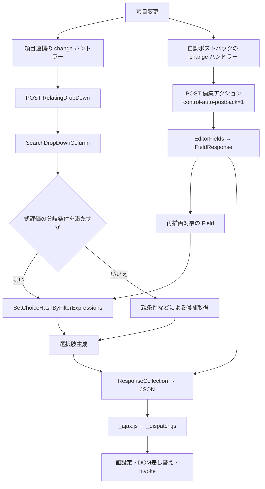
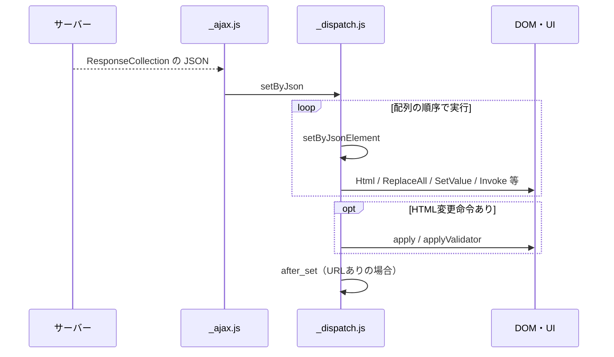

# 項目連携・自動ポストバック・画面項目絞り込みの相互関係

項目連携、自動ポストバック、画面の項目での絞り込み（`ColumnFilterExpressions`）の内部実装を整理する。
変更イベントから条件評価、選択肢取得、`_dispatch.js` による画面反映までの接続と、併用時の注意点を扱う。

<!-- START doctoc generated TOC please keep comment here to allow auto update -->
<!-- DON'T EDIT THIS SECTION, INSTEAD RE-RUN doctoc TO UPDATE -->

- [調査情報](#調査情報)
- [調査目的](#調査目的)
- [全体構造](#全体構造)
- [項目連携の処理](#項目連携の処理)
    - [親子関係の解決](#親子関係の解決)
    - [イベントと通信](#イベントと通信)
    - [サーバー処理と次段への連鎖](#サーバー処理と次段への連鎖)
- [自動ポストバックの処理](#自動ポストバックの処理)
    - [入力値の送信と編集モデルの再評価](#入力値の送信と編集モデルの再評価)
    - [絞り込み式との接続](#絞り込み式との接続)
- [ColumnFilterExpressions の評価と選択肢取得](#columnfilterexpressions-の評価と選択肢取得)
    - [画面値を検索条件に変換する](#画面値を検索条件に変換する)
    - [評価されるタイミング](#評価されるタイミング)
- [条件の合成と併用時の分岐](#条件の合成と併用時の分岐)
    - [親条件と式条件は常に AND 結合されるわけではない](#親条件と式条件は常に-and-結合されるわけではない)
    - [再初期化時の送信抑止とイベント連鎖](#再初期化時の送信抑止とイベント連鎖)
- [dispatch による共通の画面反映](#dispatch-による共通の画面反映)
    - [サーバー応答は値だけでなく操作命令列](#サーバー応答は値だけでなく操作命令列)
    - [機能別の返却内容](#機能別の返却内容)
    - [値設定と change は別](#値設定と-change-は別)
- [選択済み値の扱い](#選択済み値の扱い)
- [結論](#結論)
- [関連リンク](#関連リンク)
- [関連ソースコード](#関連ソースコード)

<!-- END doctoc generated TOC please keep comment here to allow auto update -->

## 調査情報

| 調査日     | リポジトリ               | ブランチ | タグ/バージョン | コミット                                   | 備考                            |
| ---------- | ------------------------ | -------- | --------------- | ------------------------------------------ | ------------------------------- |
| 2026-09-24 | Implem/Implem.Pleasanter | main     | タグ未指定      | `fdcbb3f8f4b724a4d8efbd3263630141e1ecfc54` | GitHub 上のソースによる静的調査 |
| 2026-09-25 | Implem/Implem.Pleasanter | main     | 同上            | `fdcbb3f8f4b724a4d8efbd3263630141e1ecfc54` | dispatch 経路の追加確認と文書化 |

本書は編集画面を中心に、サーバー側の具体例として `ResultUtilities` を追跡した。
導入順序・開発経緯は対象外とし、実機での通信回数・ブラウザー動作の再現試験は行っていない。
参照リンクは調査対象コミットに固定している。

## 調査目的

- 3機能を単なる役割説明ではなく、呼び出し関係として理解する。
- 項目連携と自動ポストバックの独立部分と共通部分を区別する。
- 絞り込み条件が合成される箇所・分岐する箇所を明確にする。
- JSON 応答を受けた後の値設定、DOM 更新、変更イベントの連鎖を説明する。

---

## 全体構造

**項目連携と自動ポストバックは別の通信経路を持ち、画面への返却は共通の dispatch 経路を通る。**
`ColumnFilterExpressions` は通信機構ではなく、両経路から呼ばれ得るサーバー側の選択肢生成処理である。

| 機能             | 設定・実装の中心                                     | 主な処理                                         |
| ---------------- | ---------------------------------------------------- | ------------------------------------------------ |
| 項目連携         | `SiteSettings.RelatingColumns`、`relatingcolumns.js` | 親子関係に従って子の候補を取得し、後続項目へ連鎖 |
| 自動ポストバック | `Column.AutoPostBack`、`_controllevents.js`          | 入力途中のフォーム値で編集画面を再評価           |
| 画面項目絞り込み | `Link.View.ColumnFilterExpressions`                  | 画面値を検索条件に展開し、選択肢を取得           |
| 共通の画面反映   | `ResponseCollection`、`_ajax.js`、`_dispatch.js`     | JSON の操作命令を順番に実行                      |

`Field()` 内の式評価は対象リンクに式が存在する場合だけ実処理を行う。
通常の値更新ではフィールドを再描画せず、`SetValue` 命令を返す。

---

## 項目連携の処理

### 親子関係の解決

`SetRelatingColumnsLinkedClass()` は設定された項目の順序をたどる。
A → B → C なら、A→B と B→C の隣接ペアを処理する。

`GetParentLinkedClass()` は、子の参照先テーブルから、親の参照先テーブルをリンクしている項目を探す。
その項目名を `ColumnsLinkedClass` に保持する。
候補が複数ある場合は、参照先の編集項目順序を使って先頭の候補を選ぶ。

つまり、項目連携は画面項目同士の値比較を任意に記述する機能ではなく、
**参照先テーブル間のリンク構造から親条件を導出する機能**である。

根拠：[SiteSettings.cs：親子関係の解決][relating-settings]

### イベントと通信

`relatingcolumns.js` は hidden 項目 `TriggerRelatingColumns_Editor` の設定を読み取り、
子が `SELECT` の場合に親の変更イベントを登録する。

1. 初期表示では `IsInitDisplay=true` で候補を取得する。
2. 親の変更時は500msのデバウンス後、`IsInitDisplay=false` で候補を取得する。
3. 親の選択ID、子の選択済みID、参照先の親項目名をフォームデータに設定する。
4. `$p.send()` で `RelatingDropDown` に POST する。

主な送信項目は以下のとおり。

| 送信項目                       | 内容                           |
| ------------------------------ | ------------------------------ |
| `RelatingDropDownControlId`    | 更新する子コントロール         |
| `RelatingDropDownSelected`     | 子の選択済みID                 |
| `RelatingDropDownParentClass`  | 子の参照先にある親リンク項目名 |
| `RelatingDropDownParentDataId` | 親の選択IDリスト               |
| `IsInitDisplay`                | 初期表示時かどうか             |

同時に子へ `parent-data-class`、`parent-data-id`、`selected-options` 属性を設定する。
これらの親情報は選択肢検索ダイアログでも使われる。

**この通信に `Column.AutoPostBack=true` は必要ない。**
項目連携は `$p.controlAutoPostBack()` とは別に送信する。

根拠：[relatingcolumns.js][relating-js]、[\_form.js][form-js]

### サーバー処理と次段への連鎖

`DropDowns.RelatingDropDown()` は `SearchDropDownColumn()` で候補を取得し、
`Html` → `Invoke(callbackRelatingColumn)` → `ClearFormData` の順で応答命令を返す。

`callbackRelatingColumn()` は子の複数選択UIを更新し、`always-send` を付与したうえで、
明示的に子の `change` を発火する。
これにより B→C のような次段の項目連携へ進む。

根拠：[DropDowns.cs：RelatingDropDown][relating-server]、[relatingcolumns.js][relating-js]

---

## 自動ポストバックの処理

### 入力値の送信と編集モデルの再評価

`HtmlFields.ControlCss()` は、有効な `Column.AutoPostBack` に対して
`control-auto-postback` クラスを付与する。
`_controllevents.js` はこのクラスの変更イベントから `$p.controlAutoPostBack()` を呼ぶ。
複数選択は単一選択とイベントの対象条件が異なる。

送信先は編集／新規画面のアクションで、`control-auto-postback=1` とタブ情報を付ける。
送信データにはフォーム値、`ControlId`、`ReplaceFieldColumns` が含まれる。
ダイアログ編集ではフォーム・レコードID・アクションを切り替える。

サーバー側は以下の順に処理する。

1. `EditorJson()` がフォーム値を取り込んだ編集モデルを作る。
2. `EditorResponse()` がクエリ値により `EditorFields()` へ分岐する。
3. 編集時検証を行い、`BeforeOpeningPage` のサーバースクリプトを実行する。
4. `FieldResponse()` が各フィールドの応答を作る。
5. `Invoke(initRelatingColumnEditorNoSend)` を応答に追加する。

これは通常のレコード更新アクションではなく、入力途中の値で画面を再評価する経路である。
サーバースクリプト自身が行う更新などの副作用まで禁止する意味ではない。

根拠：[HtmlFields.cs：ControlCss][control-css]、[\_controllevents.js][control-events]、
[ResultUtilities.cs：編集応答][editor-response]

### 絞り込み式との接続

`SiteSettings.ReplaceFieldColumns()` は、式を持つリンク項目を HTML 差し替え対象に加える。
変更項目が式に含まれているかをここで依存解析するのではなく、式を持つリンク項目を列挙する。

`FieldResponse()` は対象項目に対して `ReplaceAll` を生成し、
その HTML を作る `Field()` が `SetChoiceHashByFilterExpressions()` を呼ぶ。
したがって、**自動ポストバックは再描画を通じて式を再評価する**。

ただし、先に `GetEditorColumnNames(postbackColumn)` で返却対象が限定される。
`ColumnsReturnedWhenAutomaticPostback` から対象項目を外している場合、
差し替え対象リストに含まれていても当該フィールドは返却されない。

根拠：[差し替え対象][replace-columns]、[返却対象の限定][returned-columns]、
[FieldResponse][field-response]、[Field][field]

---

## ColumnFilterExpressions の評価と選択肢取得

### 画面値を検索条件に変換する

`ColumnFilterExpressionsLink()` は、対象項目に対応する JSON 形式のリンクから、
`View.ColumnFilterExpressions` を持つものを取得する。

`SetChoiceHashByFilterExpressions()` は次の順に処理する。

1. 辞書のキーから、絞り込み先の項目を解決する。
2. 式に含まれる `[項目名]` を、編集モデルの値に置換する。
3. 出力種別に応じて `ToValue()` または `ToDisplay()` を使用する。
4. `View.SetColumnFilterHashByExpression()` で型別に検索条件へ変換する。
5. `Column.SetChoiceHash()` → `Link.SetChoiceHash()` で候補を取得する。

| 式の評価結果            | `ColumnFilterHash` への変換                                         |
| ----------------------- | ------------------------------------------------------------------- |
| 先頭が `=`              | 先頭を除いた文字列を条件値として使用。SQLを直接実行する指定ではない |
| 空文字、または `=` のみ | 対象テーブルのIDに `-1` を指定し、候補なしとなる条件を設定          |
| 通常の値                | 真偽値・数値・日付・文字列および選択肢の有無に応じて変換            |

既存の `ColumnFilterHash` は利用され、同じキーの条件値は式の結果で上書きされる。
ブラウザー上の候補をフィルターするのではなく、サーバーで候補取得条件を作る仕組みである。

根拠：[式の評価][expressions]、[型別変換][expression-conversion]、
[リンクからの候補取得][link]

### 評価されるタイミング

| 契機                                   | 経路                                                     |
| -------------------------------------- | -------------------------------------------------------- |
| 初回のフィールド描画                   | `Field()` → 式評価                                       |
| 自動ポストバックによるフィールド再描画 | `FieldResponse()` → `Field()` → 式評価                   |
| 選択肢の検索ダイアログ                 | `SearchDropDownColumn()` → 条件を満たす場合に式評価      |
| 項目連携による候補取得                 | 同じ `SearchDropDownColumn()` → 条件を満たす場合に式評価 |

検索ダイアログはメインフォームの入力データを転記する。
`ItemUtilities.SetChoiceHashByFilterExpressions()` はレコードID・新規フラグ・フォーム値を使って
`IssueModel` または `ResultModel` を構成し、モデル別の式評価へ渡す。
このため、自動ポストバックなしでも検索時に未保存の入力値を使う経路がある。

一方、**式の設定自体は変更イベントの監視や自動ポストバックの有効化を行わない**。
通常のプルダウンを入力変更直後に再取得するには、別途その契機が必要になる。

根拠：[dropdownsearch.js][dropdown-search]、[ItemUtilities.cs][item-utilities]

---

## 条件の合成と併用時の分岐

### 親条件と式条件は常に AND 結合されるわけではない

`SearchDropDownColumn()` の JSON 形式リンクの処理は次の二者に分かれる。

| 分岐条件                                               | 呼び出し                                           | 親条件の引き渡し                      |
| ------------------------------------------------------ | -------------------------------------------------- | ------------------------------------- |
| 式あり、かつ `IsNew` または `ss.SiteId != referenceId` | `ItemUtilities.SetChoiceHashByFilterExpressions()` | `parentClass`／`parentIds` を渡さない |
| 上記以外                                               | `Column.SetChoiceHash()`                           | `parentColumn`／`parentIds` を渡す    |

ここでの `referenceId` は `DropDownSearchReferenceId` から読んだ値である。
すべての画面・要求で必ず式の分岐に入る、と一般化してはいけない。

通常側の `Link.Items()` は、View の条件に加えて、
`LinkHashRelatingColumnsSubQuery()` が作る親IDの絞り込みを追加する。
一方、式評価側の `SetChoiceHash()` 呼び出しには親条件の引数がないため、
**その呼び出しでは項目連携由来の親IDサブクエリが付かない**。

式側でも同じ親値を参照する条件を記述していれば、結果的に親で絞り込むことはできるが、
項目連携の条件が自動的に AND 追加されるという意味ではない。
また、項目連携の親未選択判定やコールバックなど、候補取得の外側の処理は残る。

根拠：[SearchDropDownColumn の分岐][dropdown-column]、[Link.Items の条件合成][link-items]、
[式評価からの候補取得][expressions]

### 再初期化時の送信抑止とイベント連鎖

自動ポストバックでフィールドを置き換えると、項目連携が付けた属性も再設定が必要になる。
そこで `initRelatingColumnEditorNoSend()` が `noSend=true` で再初期化を行う。
属性などを設定する一方、その呼び出しからの `RelatingDropDown` 送信は抑止する。

これは全体の通信を1回にまとめる仕組みではない。

- 同じ項目が項目連携の親かつ自動ポストバック対象なら、別々の変更ハンドラーが動く。
- 項目連携完了後の子の `change` は、子の自動ポストバックを起動し得る。
- `not-set-form-changed` は変更状態などの制御用であり、送信そのものを止めない。
- `$p.disableAutPostback` は両処理にチェックがあるが、通常の併用を自動調停するものではない。

項目連携の変更処理は500msのデバウンスを持つ。
両送信箇所は `_async=false` を指定するが、
カスタムイベントや CAPTCHA 前処理などもあるため、最終的な通信回数・順序は実機確認が必要である。

根拠：[relatingcolumns.js][relating-js]、[\_controllevents.js][control-events]、[\_ajax.js][ajax]

---

## dispatch による共通の画面反映

### サーバー応答は値だけでなく操作命令列

`ResponseCollection` は `Method`、`Target`、`Value`、`Options` を持つ操作命令を列挙する。
`ToJson()` で返した JSON を `_ajax.js` の通信成功処理が受け取り、
`_dispatch.js` の `$p.setByJson()` に渡す。

| サーバー側        | JSON の `Method` | dispatch の処理                     |
| ----------------- | ---------------- | ----------------------------------- |
| `Html()`          | `Html`           | `$(target).html(value)`             |
| `ReplaceAll()`    | `ReplaceAll`     | `$(value).replaceAll(target)`       |
| `Val()`           | **`SetValue`**   | `$p.setValue()` と `$p.hideField()` |
| `Invoke()`        | `Invoke`         | `$p[target](value)`                 |
| `ClearFormData()` | `ClearFormData`  | `$p.clearData()`                    |

`ClearFormData` は送信用データのクリアであり、DOM の入力値を空にする命令とは区別する。
`Val()` の JSON 命令名は `Val` ではなく `SetValue` である。

根拠：[ResponseCollection.cs][response-collection]、[\_ajax.js][ajax]、[\_dispatch.js][dispatch]

### 機能別の返却内容

| 経路                         | 返却命令と役割                                                         |
| ---------------------------- | ---------------------------------------------------------------------- |
| 項目連携                     | `Html` で子の候補を差し替え、`Invoke` で子の変更イベントにつなぐ       |
| 自動ポストバックの値更新     | `SetValue` で値を設定                                                  |
| 自動ポストバックの再描画     | `ReplaceAll` でフィールドごと置き換え                                  |
| 自動ポストバック後の項目連携 | `Invoke` で送信なしの再初期化                                          |
| `ColumnFilterExpressions`    | 専用命令はなく、生成した候補が `Html`／`ReplaceAll` 等の内容に含まれる |

### 値設定と change は別

`_view.js` の `$p.setValue()` は型別に値を設定する。
通常の単一選択の `SELECT` では `.val(value)` を呼ぶだけで、明示的な `change` は発火しない。
複数選択では別のヘルパーへ委譲するため、単一選択の説明をそのまま一般化しない。

項目連携の連鎖は、単なる `Html` や値設定ではなく、
**応答内の `Invoke` が `callbackRelatingColumn()` を呼び、そこで `change` を発火する**ことで成立する。

また、`Invoke` は命令配列の中の位置で実行される。
HTML変更命令があった場合の `$p.apply()`／`$p.applyValidator()` は配列全体の処理後である。
「UI再初期化がすべて終わってからコールバックを実行する」という順序ではない。

根拠：[\_dispatch.js][dispatch]、[\_view.js][view-js]、[relatingcolumns.js][relating-js]

---

## 選択済み値の扱い

候補の絞り込みと、現在値を消すかどうかは別の処理である。

| 経路・条件                   | 選択済み値の扱い                                                  |
| ---------------------------- | ----------------------------------------------------------------- |
| 項目連携の初期表示           | 候補にない選択済み値を `AddToChoiceHash()` で補完                 |
| 項目連携の親変更後           | 初期表示用の補完を行わず、`addSelectedValue=false` で候補を描画   |
| 項目連携で親IDリストが空     | 選択値を `null` にする                                            |
| 通常のリンクフィールド再描画 | `HtmlFields.EditChoices()` に既存選択値を候補へ補完する処理がある |

ここで「親IDリストが空」とは `parentIds?.Any() != true` の判定を指す。
画面上の空欄・未設定値のすべてが同じ表現になるとは限らない。

通常フィールドの補完にはリンク先タイトルを解決できることなどの条件がある。
したがって、式で候補が変わっても、既存値が必ずクリアされるとは限らない。

根拠：[RelatingDropDown の候補描画][relating-server]、[HtmlFields.EditChoices][edit-choices]

---

## 結論

| 組み合わせ                 | 実装上の関係                                                                |
| -------------------------- | --------------------------------------------------------------------------- |
| 項目連携のみ               | 自動ポストバック設定なしで独自に候補取得・次段への連鎖を行う                |
| 自動ポストバック＋式       | フィールド再描画を介して画面値から候補を再生成する                          |
| 式＋検索ダイアログ         | 検索時にフォーム値を渡して再評価する経路がある                              |
| 項目連携＋式               | 候補取得の分岐を共有するが、親条件と式条件が常に AND 合成されるわけではない |
| 項目連携＋自動ポストバック | 別イベント・別要求。再初期化からの送信は抑止するが、全要求を統合しない      |
| 画面反映                   | どちらも JSON 命令列を `_dispatch.js` が処理する                            |

**全体は「別々の入口とサーバー処理 → 共通の JSON 命令列 → dispatch → 値・DOM 更新とイベント連鎖」である。**
挙動を追う際は、送信先だけでなく、候補取得の分岐と返却命令の順序まで確認する必要がある。

実機で追加確認する場合は、親子の自動ポストバック設定、返却対象の限定、通常選択／検索／複数選択、
新規／編集／ダイアログ、親未選択・候補外の既存値を組み合わせて確認する。

## 関連リンク

- [Sections サーバースクリプト AutoPostBack 動作](001-Sections-AutoPostBack動作.md)

## 関連ソースコード

以下はすべて調査対象コミットのソースである。

| ソース                                                                   | 主な確認対象                               |
| ------------------------------------------------------------------------ | ------------------------------------------ |
| [SiteSettings.cs][relating-settings]                                     | 親子解決・返却対象・差し替え対象           |
| [Column.cs][column]／[Link.cs][link]                                     | 選択肢生成と条件合成                       |
| [View.cs][expression-conversion]                                         | 式の結果から検索条件への変換               |
| [ResultUtilities.cs][editor-response]                                    | 編集応答・再描画・式評価                   |
| [ItemUtilities.cs][item-utilities]／[DropDowns.cs][dropdown-column]      | 検索・項目連携からの式評価                 |
| [HtmlFields.cs][edit-choices]                                            | 自動ポストバック用クラス・既存選択値の補完 |
| [ResponseCollection.cs][response-collection]                             | JSON 操作命令の生成                        |
| [relatingcolumns.js][relating-js]／[\_controllevents.js][control-events] | イベント・通信の入口                       |
| [dropdownsearch.js][dropdown-search]／[\_form.js][form-js]               | フォームデータの準備と送信                 |
| [\_ajax.js][ajax]／[\_dispatch.js][dispatch]／[\_view.js][view-js]       | 応答受信・命令実行・値設定                 |

[relating-settings]: https://github.com/Implem/Implem.Pleasanter/blob/fdcbb3f8f4b724a4d8efbd3263630141e1ecfc54/Implem.Pleasanter/Libraries/Settings/SiteSettings.cs#L6079-L6134
[relating-js]: https://github.com/Implem/Implem.Pleasanter/blob/fdcbb3f8f4b724a4d8efbd3263630141e1ecfc54/Implem.PleasanterFrontend/wwwroot/src/scripts/generals/relatingcolumns.js
[form-js]: https://github.com/Implem/Implem.Pleasanter/blob/fdcbb3f8f4b724a4d8efbd3263630141e1ecfc54/Implem.PleasanterFrontend/wwwroot/src/scripts/generals/_form.js
[relating-server]: https://github.com/Implem/Implem.Pleasanter/blob/fdcbb3f8f4b724a4d8efbd3263630141e1ecfc54/Implem.Pleasanter/Libraries/Models/DropDowns.cs#L351-L443
[control-css]: https://github.com/Implem/Implem.Pleasanter/blob/fdcbb3f8f4b724a4d8efbd3263630141e1ecfc54/Implem.Pleasanter/Libraries/HtmlParts/HtmlFields.cs#L243-L265
[control-events]: https://github.com/Implem/Implem.Pleasanter/blob/fdcbb3f8f4b724a4d8efbd3263630141e1ecfc54/Implem.PleasanterFrontend/wwwroot/src/scripts/generals/_controllevents.js
[editor-response]: https://github.com/Implem/Implem.Pleasanter/blob/fdcbb3f8f4b724a4d8efbd3263630141e1ecfc54/Implem.Pleasanter/Models/Results/ResultUtilities.cs#L2435-L2566
[replace-columns]: https://github.com/Implem/Implem.Pleasanter/blob/fdcbb3f8f4b724a4d8efbd3263630141e1ecfc54/Implem.Pleasanter/Libraries/Settings/SiteSettings.cs#L6177-L6201
[returned-columns]: https://github.com/Implem/Implem.Pleasanter/blob/fdcbb3f8f4b724a4d8efbd3263630141e1ecfc54/Implem.Pleasanter/Libraries/Settings/SiteSettings.cs#L2719-L2742
[field-response]: https://github.com/Implem/Implem.Pleasanter/blob/fdcbb3f8f4b724a4d8efbd3263630141e1ecfc54/Implem.Pleasanter/Models/Results/ResultUtilities.cs#L2653-L2824
[field]: https://github.com/Implem/Implem.Pleasanter/blob/fdcbb3f8f4b724a4d8efbd3263630141e1ecfc54/Implem.Pleasanter/Models/Results/ResultUtilities.cs#L1857-L1926
[expressions]: https://github.com/Implem/Implem.Pleasanter/blob/fdcbb3f8f4b724a4d8efbd3263630141e1ecfc54/Implem.Pleasanter/Models/Results/ResultUtilities.cs#L2826-L2908
[expression-conversion]: https://github.com/Implem/Implem.Pleasanter/blob/fdcbb3f8f4b724a4d8efbd3263630141e1ecfc54/Implem.Pleasanter/Libraries/Settings/View.cs#L3612-L3657
[link]: https://github.com/Implem/Implem.Pleasanter/blob/fdcbb3f8f4b724a4d8efbd3263630141e1ecfc54/Implem.Pleasanter/Libraries/Settings/Link.cs
[column]: https://github.com/Implem/Implem.Pleasanter/blob/fdcbb3f8f4b724a4d8efbd3263630141e1ecfc54/Implem.Pleasanter/Libraries/Settings/Column.cs
[dropdown-search]: https://github.com/Implem/Implem.Pleasanter/blob/fdcbb3f8f4b724a4d8efbd3263630141e1ecfc54/Implem.PleasanterFrontend/wwwroot/src/scripts/generals/dropdownsearch.js
[item-utilities]: https://github.com/Implem/Implem.Pleasanter/blob/fdcbb3f8f4b724a4d8efbd3263630141e1ecfc54/Implem.Pleasanter/Models/Items/ItemUtilities.cs
[dropdown-column]: https://github.com/Implem/Implem.Pleasanter/blob/fdcbb3f8f4b724a4d8efbd3263630141e1ecfc54/Implem.Pleasanter/Libraries/Models/DropDowns.cs#L512-L594
[link-items]: https://github.com/Implem/Implem.Pleasanter/blob/fdcbb3f8f4b724a4d8efbd3263630141e1ecfc54/Implem.Pleasanter/Libraries/Settings/Link.cs#L636-L675
[ajax]: https://github.com/Implem/Implem.Pleasanter/blob/fdcbb3f8f4b724a4d8efbd3263630141e1ecfc54/Implem.PleasanterFrontend/wwwroot/src/scripts/generals/_ajax.js
[response-collection]: https://github.com/Implem/Implem.Pleasanter/blob/fdcbb3f8f4b724a4d8efbd3263630141e1ecfc54/Implem.Pleasanter/Libraries/Responses/ResponseCollection.cs
[dispatch]: https://github.com/Implem/Implem.Pleasanter/blob/fdcbb3f8f4b724a4d8efbd3263630141e1ecfc54/Implem.PleasanterFrontend/wwwroot/src/scripts/generals/_dispatch.js
[view-js]: https://github.com/Implem/Implem.Pleasanter/blob/fdcbb3f8f4b724a4d8efbd3263630141e1ecfc54/Implem.PleasanterFrontend/wwwroot/src/scripts/generals/_view.js
[edit-choices]: https://github.com/Implem/Implem.Pleasanter/blob/fdcbb3f8f4b724a4d8efbd3263630141e1ecfc54/Implem.Pleasanter/Libraries/HtmlParts/HtmlFields.cs#L267-L303
