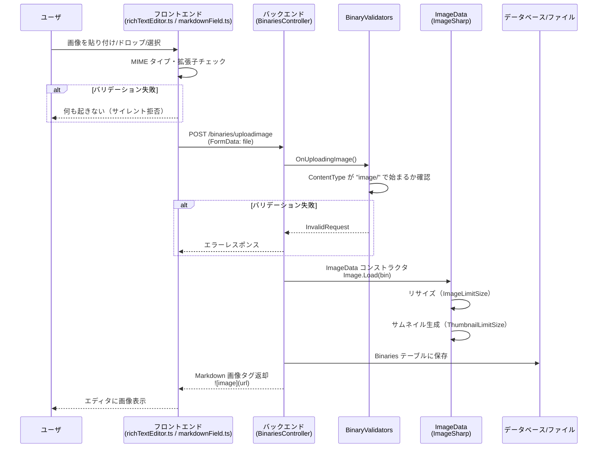
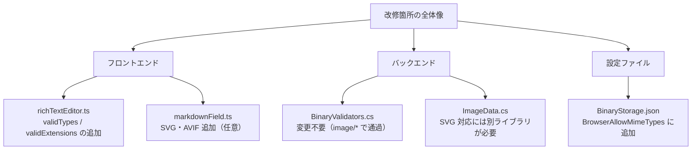

# リッチテキストエディタ画像形式対応

リッチテキストエディタ（SunEditor）および Markdown フィールドで使用可能な画像形式の現状と、Web で一般的に使われる画像形式（WebP・SVG・AVIF）および BMP への対応状況を調査する。

<!-- START doctoc generated TOC please keep comment here to allow auto update -->
<!-- DON'T EDIT THIS SECTION, INSTEAD RE-RUN doctoc TO UPDATE -->

- [調査情報](#調査情報)
- [調査目的](#調査目的)
- [画像アップロードの全体フロー](#画像アップロードの全体フロー)
- [3 形式制限の経緯](#3-形式制限の経緯)
    - [導入時の経緯](#導入時の経緯)
    - [SunEditor 自体のデフォルト設定](#suneditor-自体のデフォルト設定)
    - [3 形式に制限した推定理由](#3-形式に制限した推定理由)
- [フロントエンドのバリデーション](#フロントエンドのバリデーション)
    - [リッチテキストエディタ（SunEditor）](#リッチテキストエディタsuneditor)
    - [Markdown フィールド](#markdown-フィールド)
    - [フロントエンドの比較](#フロントエンドの比較)
- [バックエンドのバリデーション](#バックエンドのバリデーション)
    - [BinaryValidators.OnUploadingImage](#binaryvalidatorsonuploadingimage)
    - [ImageData によるリサイズ処理](#imagedata-によるリサイズ処理)
    - [サムネイル・画像配信](#サムネイル画像配信)
    - [BinaryStorage.json の BrowserAllowMimeTypes](#binarystoragejson-の-browserallowmimetypes)
- [ImageSharp 3.1.12 の対応形式](#imagesharp-3112-の対応形式)
- [改修方針](#改修方針)
    - [改修対象の優先度](#改修対象の優先度)
    - [改修箇所](#改修箇所)
    - [WebP・BMP 対応（フロントエンドのみの改修）](#webpbmp-対応フロントエンドのみの改修)
    - [SVG 対応の課題](#svg-対応の課題)
    - [AVIF 対応の課題](#avif-対応の課題)
- [結論](#結論)
- [関連ソースコード](#関連ソースコード)
- [関連リンク](#関連リンク)

<!-- END doctoc generated TOC please keep comment here to allow auto update -->

## 調査情報

| 調査日     | リポジトリ | ブランチ | タグ/バージョン    | コミット   | 備考     |
| ---------- | ---------- | -------- | ------------------ | ---------- | -------- |
| 2026-03-02 | Pleasanter | main     | Pleasanter_1.5.1.0 | `34f162a4` | 初回調査 |

## 調査目的

リッチテキストエディタ（SunEditor）で貼り付け・アップロードできる画像形式が JPEG・PNG・GIF の 3 種類に限定されている。Web で一般的に使われる WebP・SVG・AVIF、およびレガシー形式の BMP にも対応するために、フロントエンドとバックエンドの画像形式バリデーション箇所を特定し、改修方針を明確にする。

---

## 画像アップロードの全体フロー

ユーザが画像をアップロード（貼り付け・ドラッグ&ドロップ・ボタン選択）してから表示されるまでの処理の流れを示す。



---

## 3 形式制限の経緯

リッチテキストエディタが JPEG・PNG・GIF の 3 形式のみに制限されている理由を、Git 履歴から調査した。

### 導入時の経緯

| バージョン          | コミット    | 日付       | 変更内容                                                   |
| ------------------- | ----------- | ---------- | ---------------------------------------------------------- |
| Pleasanter 1.4.21.0 | `57d0c50eb` | 2025-10-24 | `richTextEditor.ts` 新規追加。3 形式（JPEG/PNG/GIF）で実装 |
| Pleasanter 1.5.0.0  | `8c261c0a8` | 2026-01-13 | `markdownField.ts` 新規追加。5 形式（+WebP/BMP）で実装     |

`richTextEditor.ts` は v1.4.21.0 で SunEditor 統合の一環として新規作成されたファイルであり、
初期コミットの時点で `validTypes` に 3 形式のみが指定されている。
それ以前の第 1 世代テーマではリッチテキストエディタは存在せず、
Markdown のテキストエリアに対する `$p.uploadImage`（video.js）が
カメラ撮影画像のアップロードに使われていた。
この旧実装にはフロントエンド側の画像形式チェックが存在しなかった。

### SunEditor 自体のデフォルト設定

SunEditor のオプション `imageAccept` のデフォルト値は `'image/*'`（全画像形式を許可）である。

**ファイル**: SunEditor `src/lib/constructor.js`

```javascript
options.imageAccept =
    typeof options.imageAccept !== 'string' || options.imageAccept.trim() === '*'
        ? 'image/*'
        : options.imageAccept.trim() || 'image/*';
```

プリザンター側の `richTextEditor.ts` では SunEditor の `imageAccept` オプションを設定しておらず、
SunEditor のダイアログからのファイル選択では全画像形式が選択可能である。
ただし、選択後の `uploadBinary` メソッド内で 3 形式に絞り込んでいるため、
対応外の形式はサイレントに拒否される。

### 3 形式に制限した推定理由

コミットメッセージやコード内コメントに制限理由の明示的な記述はない。以下の理由が推定される。

| 推定理由                       | 詳細                                                                                                                                       |
| ------------------------------ | ------------------------------------------------------------------------------------------------------------------------------------------ |
| 安全側に倒した設計             | 新規コンポーネント作成時に、広く普及し安全性が確立された 3 形式のみを許可する保守的なアプローチを採用したと考えられる                      |
| ImageSharp の処理確実性        | JPEG/PNG/GIF は ImageSharp で長期間にわたり安定してデコード・リサイズできる形式であり、確実に動作する範囲に限定した可能性がある            |
| 後発の markdownField.ts で拡張 | 約 3 か月後に追加された `markdownField.ts` では WebP・BMP が追加されており、richTextEditor.ts 側の更新が行われなかった（更新漏れの可能性） |

---

## フロントエンドのバリデーション

### リッチテキストエディタ（SunEditor）

**ファイル**: `Implem.PleasanterFrontend/wwwroot/src/scripts/modules/richTextEditor/richTextEditor.ts`（行番号: 278-286）

```typescript
private uploadBinary = (blob: File | null, _core: Core, uploadHandler?: Function) => {
    const validTypes = ['image/jpeg', 'image/png', 'image/gif'];
    const validExtensions = ['.jpg', '.jpeg', '.png', '.gif'];

    const typeIsValid = blob && validTypes.includes(blob.type);
    const nameIsValid = blob && blob.name && validExtensions.some(ext => blob.name.toLowerCase().endsWith(ext));

    if (!typeIsValid || !nameIsValid) return;
```

| 項目               | 内容                                       |
| ------------------ | ------------------------------------------ |
| 許可 MIME タイプ   | `image/jpeg`, `image/png`, `image/gif`     |
| 許可拡張子         | `.jpg`, `.jpeg`, `.png`, `.gif`            |
| バリデーション方式 | MIME タイプ **AND** 拡張子の二重チェック   |
| 拒否時の挙動       | `return`（サイレント拒否、エラー表示なし） |

### Markdown フィールド

**ファイル**: `Implem.PleasanterFrontend/wwwroot/src/scripts/modules/markdownField/markdownField.ts`（行番号: 15, 374-377）

```typescript
static ALLOWED_IMAGE_TYPES = ['image/jpeg', 'image/png', 'image/gif', 'image/webp', 'image/bmp'];

private uploadBinary(blob: File) {
    if (!blob || !MarkdownFieldElement.ALLOWED_IMAGE_TYPES.includes(blob.type)) {
        return;
    }
```

| 項目                   | 内容                                                              |
| ---------------------- | ----------------------------------------------------------------- |
| 許可 MIME タイプ       | `image/jpeg`, `image/png`, `image/gif`, `image/webp`, `image/bmp` |
| 許可拡張子             | チェックなし（MIME タイプのみ）                                   |
| バリデーション方式     | MIME タイプのみ                                                   |
| ファイル選択ダイアログ | `accept` 属性に `ALLOWED_IMAGE_TYPES` を適用（行 514）            |

### フロントエンドの比較

| 画像形式 | MIME タイプ     | リッチテキストエディタ | Markdown フィールド |
| -------- | --------------- | :--------------------: | :-----------------: |
| JPEG     | `image/jpeg`    |          対応          |        対応         |
| PNG      | `image/png`     |          対応          |        対応         |
| GIF      | `image/gif`     |          対応          |        対応         |
| WebP     | `image/webp`    |       **非対応**       |        対応         |
| BMP      | `image/bmp`     |       **非対応**       |        対応         |
| SVG      | `image/svg+xml` |       **非対応**       |     **非対応**      |
| AVIF     | `image/avif`    |       **非対応**       |     **非対応**      |
| TIFF     | `image/tiff`    |       **非対応**       |     **非対応**      |

リッチテキストエディタは Markdown フィールドよりも制限が厳しく、WebP と BMP が使用できない不整合がある。

---

## バックエンドのバリデーション

### BinaryValidators.OnUploadingImage

**ファイル**: `Implem.Pleasanter/Models/Binaries/BinaryValidators.cs`（行番号: 116-145）

```csharp
public static Error.Types OnUploadingImage(
    Context context,
    SiteSettings ss = null,
    string columnName = null,
    PostedFile file = null)
{
    if (!context.ContractSettings.Attachments())
    {
        return Error.Types.BadRequest;
    }
    if (!file.ContentType.StartsWith("image/"))
    {
        return Error.Types.InvalidRequest;
    }
    // ストレージ容量・AllowImage チェック（省略）
    return Error.Types.None;
}
```

バックエンドは `image/` で始まる全ての MIME タイプを許可しており、画像形式の制限はフロントエンド側で行われている。

### ImageData によるリサイズ処理

**ファイル**: `Implem.Pleasanter/Libraries/Images/ImageData.cs`（行番号: 33-37, 108-116）

```csharp
public ImageData(byte[] data, long referenceId, Types type)
{
    Data = Image.Load<Rgba32>(new MemoryStream(data));
    // ...
}

public byte[] ReSizeBytes(SizeTypes sizeType)
{
    using (var memory = new MemoryStream())
    {
        memory.Position = 0;
        ReSize(sizeType).Save(memory, new PngEncoder());
        return GetByte(memory);
    }
}
```

| 項目                 | 内容                                                         |
| -------------------- | ------------------------------------------------------------ |
| ライブラリ           | SixLabors.ImageSharp 3.1.12                                  |
| デコード対応形式     | JPEG, PNG, GIF, BMP, WebP, TIFF, TGA, PBM（ImageSharp 内蔵） |
| リサイズ後の出力形式 | 常に PNG（`PngEncoder()`）                                   |
| SVG 対応             | 非対応（ImageSharp はラスタ画像専用）                        |
| AVIF 対応            | 非対応（ImageSharp 3.x では未サポート）                      |

### サムネイル・画像配信

**ファイル**: `Implem.Pleasanter/Libraries/Responses/FileContentResults.cs`（行番号: 273-291）

```csharp
private static ResponseFile Bytes(DataRow dataRow, bool thumbnail = false)
{
    var isThumbnail = thumbnail && dataRow["Thumbnail"] != DBNull.Value;
    var contentType = dataRow.String("ContentType");
    if (isThumbnail)
    {
        contentType = contentType.IsNullOrEmpty()
            ? "image/bmp"
            : "image/png";
    }
```

サムネイルは ImageData.ReSizeBytes で PNG に変換されるため、配信時の ContentType は `image/png` となる。元画像は保存時の ContentType がそのまま使われる。

### BinaryStorage.json の BrowserAllowMimeTypes

**ファイル**: `Implem.Pleasanter/App_Data/Parameters/BinaryStorage.json`（行番号: 29-36）

```json
"BrowserAllowMimeTypes": [
    "application/pdf",
    "text/plain",
    "image/jpeg",
    "image/png",
    "image/gif",
    "image/webp"
]
```

この設定はブラウザ上での表示許可を制御する。`image/bmp` は含まれていない点に注意が必要である。

---

## ImageSharp 3.1.12 の対応形式

| 形式 | デコード | エンコード | MIME タイプ               | 備考                          |
| ---- | :------: | :--------: | ------------------------- | ----------------------------- |
| JPEG |   対応   |    対応    | `image/jpeg`              |                               |
| PNG  |   対応   |    対応    | `image/png`               | リサイズ出力形式              |
| GIF  |   対応   |    対応    | `image/gif`               | アニメーション GIF 対応       |
| BMP  |   対応   |    対応    | `image/bmp`               |                               |
| WebP |   対応   |    対応    | `image/webp`              |                               |
| TIFF |   対応   |    対応    | `image/tiff`              |                               |
| TGA  |   対応   |    対応    | `image/x-tga`             |                               |
| PBM  |   対応   |    対応    | `image/x-portable-bitmap` |                               |
| SVG  |  非対応  |   非対応   | `image/svg+xml`           | ベクタ形式のため非対応        |
| AVIF |  非対応  |   非対応   | `image/avif`              | ImageSharp 3.x では未サポート |

---

## 改修方針

### 改修対象の優先度

| 優先度 | 画像形式 | 理由                                                  |
| :----: | -------- | ----------------------------------------------------- |
|   高   | WebP     | Web 標準、ファイルサイズ小、主要ブラウザ対応済        |
|   高   | BMP      | Markdown フィールドでは既に対応、レガシーだが需要あり |
|   中   | SVG      | Web 標準だが ImageSharp 非対応、XSS リスクあり        |
|   低   | AVIF     | ImageSharp 未対応、ブラウザ対応が進行中               |

### 改修箇所



### WebP・BMP 対応（フロントエンドのみの改修）

WebP と BMP は ImageSharp がデコード・エンコードに対応しており、バックエンドの `BinaryValidators.OnUploadingImage` も `image/` プレフィックスで通過するため、フロントエンドの修正のみで対応可能である。

**richTextEditor.ts の改修案**:

```typescript
// 変更前
const validTypes = ['image/jpeg', 'image/png', 'image/gif'];
const validExtensions = ['.jpg', '.jpeg', '.png', '.gif'];

// 変更後
const validTypes = ['image/jpeg', 'image/png', 'image/gif', 'image/webp', 'image/bmp'];
const validExtensions = ['.jpg', '.jpeg', '.png', '.gif', '.webp', '.bmp'];
```

**BinaryStorage.json の改修案**（BMP のブラウザ表示許可）:

```json
"BrowserAllowMimeTypes": [
    "application/pdf",
    "text/plain",
    "image/jpeg",
    "image/png",
    "image/gif",
    "image/webp",
    "image/bmp"
]
```

### SVG 対応の課題

SVG は ImageSharp で処理できないため、以下の課題がある。

| 課題                   | 詳細                                                                               |
| ---------------------- | ---------------------------------------------------------------------------------- |
| ImageSharp 非対応      | `Image.Load()` が例外を発生させる。リサイズ・サムネイル生成が不可                  |
| XSS リスク             | SVG は XML ベースであり、`<script>` タグや `onload` 属性で JavaScript を埋め込める |
| サニタイズの必要性     | DOMPurify 等でサニタイズしてから保存する必要がある                                 |
| リサイズ処理のバイパス | SVG の場合は ImageData を経由せずバイナリをそのまま保存する分岐が必要              |

SVG 対応を行う場合は、バックエンドでの個別対応が必要になる。

### AVIF 対応の課題

| 課題              | 詳細                                                                                  |
| ----------------- | ------------------------------------------------------------------------------------- |
| ImageSharp 未対応 | ImageSharp 3.x では AVIF のデコード・エンコードに非対応                               |
| 将来的な対応      | ImageSharp 4.x 以降、または別ライブラリ（libavif バインディング等）で対応の可能性あり |

---

## 結論

| 項目                         | 内容                                                                                       |
| ---------------------------- | ------------------------------------------------------------------------------------------ |
| 現状のリッチテキストエディタ | JPEG・PNG・GIF の 3 形式のみ対応                                                           |
| Markdown フィールドとの差異  | Markdown フィールドは WebP・BMP にも対応しており、不整合がある                             |
| WebP・BMP 対応に必要な改修   | `richTextEditor.ts` の `validTypes` / `validExtensions` への追加のみ（フロントエンドのみ） |
| バックエンドの改修           | WebP・BMP は不要（ImageSharp 対応済、バリデーションは `image/*` で通過）                   |
| BMP のブラウザ表示           | `BinaryStorage.json` の `BrowserAllowMimeTypes` に `image/bmp` の追加が必要                |
| SVG 対応                     | ImageSharp 非対応・XSS リスクがあり、個別のバックエンド改修が必要                          |
| AVIF 対応                    | ImageSharp 3.x 未対応のため、現時点では対応不可                                            |

---

## 関連ソースコード

| ファイル                                                                                 | 説明                                       |
| ---------------------------------------------------------------------------------------- | ------------------------------------------ |
| `Implem.PleasanterFrontend/wwwroot/src/scripts/modules/richTextEditor/richTextEditor.ts` | リッチテキストエディタの画像バリデーション |
| `Implem.PleasanterFrontend/wwwroot/src/scripts/modules/markdownField/markdownField.ts`   | Markdown フィールドの画像バリデーション    |
| `Implem.Pleasanter/Models/Binaries/BinaryValidators.cs`                                  | バックエンド画像アップロードバリデーション |
| `Implem.Pleasanter/Models/Binaries/BinaryUtilities.cs`                                   | 画像アップロード・保存処理                 |
| `Implem.Pleasanter/Libraries/Images/ImageData.cs`                                        | ImageSharp による画像処理                  |
| `Implem.Pleasanter/Libraries/Responses/FileContentResults.cs`                            | 画像配信時の ContentType 処理              |
| `Implem.Pleasanter/App_Data/Parameters/BinaryStorage.json`                               | ブラウザ表示許可 MIME タイプ設定           |

---

## 関連リンク

- [Markdown 実装](001-Markdown実装.md)
- [SunEditor 公式ドキュメント](https://suneditor.com/)
- [SixLabors.ImageSharp GitHub](https://github.com/SixLabors/ImageSharp)
- [Can I use WebP](https://caniuse.com/webp)
- [Can I use AVIF](https://caniuse.com/avif)
