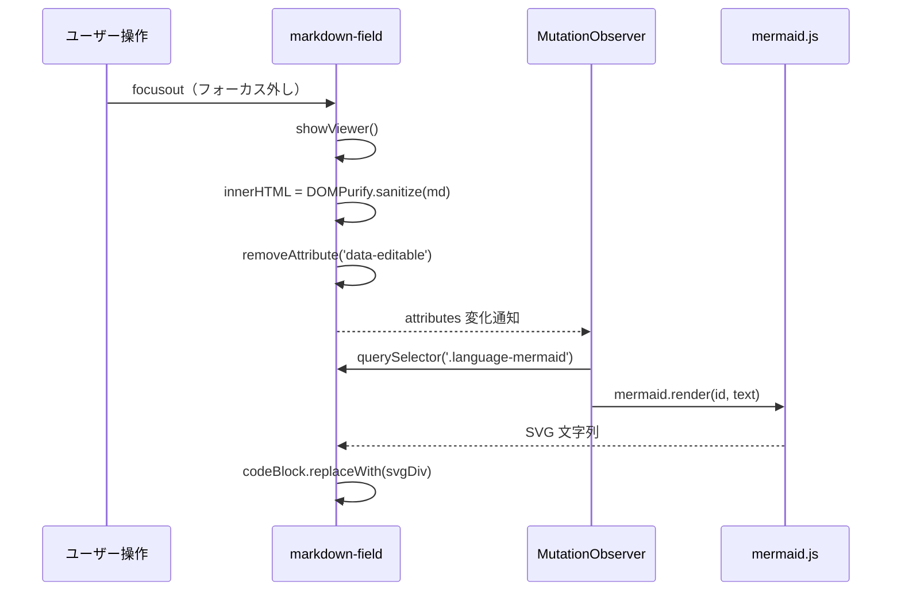

# Markdown エディタ mermaid 対応

Markdown フィールドで `mermaid` コードブロックを図として描画できるようにするための実装方法を調査する。現状の制約・実装アーキテクチャを踏まえ、難易度の低い順に 2 つのアプローチを整理し、それぞれの具体的な実装手順を示す。

<!-- START doctoc generated TOC please keep comment here to allow auto update -->
<!-- DON'T EDIT THIS SECTION, INSTEAD RE-RUN doctoc TO UPDATE -->

- [調査情報](#調査情報)
- [調査目的](#調査目的)
- [前提となる現状](#前提となる現状)
    - [mermaid.js の配置状況](#mermaidjs-の配置状況)
    - [Markdown フィールドでの現在の挙動](#markdown-フィールドでの現在の挙動)
    - [課題の整理](#課題の整理)
- [実装アプローチの選択](#実装アプローチの選択)
- [アプローチ A: DOM 後処理（推奨）](#アプローチ-a-dom-後処理推奨)
    - [アーキテクチャ概要](#アーキテクチャ概要)
    - [動作の仕組み](#動作の仕組み)
    - [実装コード](#実装コード)
    - [注意事項](#注意事項)
    - [適用方法 A-1: ExtendedScripts（全サイト共通）](#適用方法-a-1-extendedscripts全サイト共通)
    - [適用方法 A-2: サイト設定スクリプト（テーブル単位）](#適用方法-a-2-サイト設定スクリプトテーブル単位)
    - [評価](#評価)
- [アプローチ B: フロントエンドビルドのフォーク](#アプローチ-b-フロントエンドビルドのフォーク)
    - [アーキテクチャ概要](#アーキテクチャ概要-1)
    - [実装方針](#実装方針)
    - [評価](#評価-1)
- [アプローチ比較](#アプローチ比較)
- [結論](#結論)
- [関連ソースコード](#関連ソースコード)

<!-- END doctoc generated TOC please keep comment here to allow auto update -->

## 調査情報

| 調査日       | リポジトリ | ブランチ | タグ/バージョン    | コミット   | 備考     |
| ------------ | ---------- | -------- | ------------------ | ---------- | -------- |
| 2026年3月4日 | Pleasanter | main     | Pleasanter_1.5.1.0 | `34f162a4` | 初回調査 |

## 調査目的

Markdown フィールドで ` ```mermaid ` コードブロックを図（フローチャート・シーケンス図・ER 図など）として描画するための実装方法を明らかにし、具体的な実装コードを提示する。

---

## 前提となる現状

### mermaid.js の配置状況

プリザンター本体には mermaid.js v11.9.0 が配置されている。

| ファイルパス                                | 用途                             |
| ------------------------------------------- | -------------------------------- |
| `wwwroot/Extensions/mermaid-11.9.0.min.js`  | Site Visualizer の ER 図描画専用 |
| `wwwroot/Extensions/smt-json-to-table.html` | Site Visualizer の HTML ページ   |

mermaid.js は `smt-json-to-table.html` 内でのみ読み込まれており、プリザンターの通常ページでは読み込まれない。

### Markdown フィールドでの現在の挙動

**ファイル**: `Implem.PleasanterFrontend/wwwroot/src/scripts/modules/markdownField/markdownField.ts`

`mdRenderCode()` メソッドがコードブロックを処理するが、言語が `mermaid` の場合でも通常のシンタックスハイライト処理が適用される。

```typescript
private mdRenderCode = (token: Tokens.Code) => {
    const lang = (token.lang || '').trim();
    let highlighted: string;
    if (lang && hljs.getLanguage(lang)) {
        highlighted = hljs.highlight(token.text, { language: lang }).value;
    } else {
        // mermaid は highlight.js の対応言語外のため highlightAuto が適用される
        highlighted = hljs.highlightAuto(token.text).value;
    }
    return `<div class="md-code-block">
                <button class="md-code-copy">...
                <pre><code class="hljs language-mermaid">${highlighted}</code></pre>
            </div>`;
};
```

結果として ` ```mermaid ` ブロックは `<code class="hljs language-mermaid">` として DOM に出力され、図ではなくテキストとして表示される。

### 課題の整理

| 課題                             | 内容                                                                                          |
| -------------------------------- | --------------------------------------------------------------------------------------------- |
| mermaid.js 未読み込み            | 通常ページでは `mermaid-11.9.0.min.js` が読み込まれない                                       |
| mdRenderCode の mermaid 非対応   | mermaid コードブロックが図としてレンダリングされず `<code>` タグとして出力される              |
| showViewer() の innerHTML 上書き | ビューアが再表示されるたびに `viewerElem.innerHTML` が上書きされるため、再処理が必要          |
| DOMPurify のサニタイズ           | marked.js の出力は DOMPurify でサニタイズされるため、SVG をマークアップ内に含める場合は要注意 |

---

## 実装アプローチの選択

本調査では、プリザンター本体を改修しないか、改修を最小限にする観点から 2 つのアプローチを評価する。

| アプローチ | 方式                           | 本体改修 | 難易度 | 推奨度               |
| ---------- | ------------------------------ | -------- | ------ | -------------------- |
| A          | DOM 後処理（MutationObserver） | 不要     | 低     | 推奨（第一候補）     |
| B          | フロントエンドビルドのフォーク | 必要     | 中     | 本格統合が必要な場合 |

---

## アプローチ A: DOM 後処理（推奨）

marked.js の変換後の DOM に対して、JavaScript スクリプトで後処理を行い mermaid 図を描画する。

### アーキテクチャ概要

````mermaid
flowchart LR
    MD["Markdownテキスト\n```mermaid...```"] --> MARKED["marked.js\nmdRenderCode()"]
    MARKED --> PURIFY["DOMPurify\nサニタイズ"]
    PURIFY --> DOM["DOM出力\n&lt;code class='language-mermaid'&gt;"]
    DOM --> OBSERVER["MutationObserver\ndata-editable削除を検出"]
    OBSERVER --> MERMAID["mermaid.render()\nSVG生成"]
    MERMAID --> RESULT["図として表示\n&lt;div class='mermaid-diagram'&gt;"]
````

### 動作の仕組み

#### showViewer() のライフサイクルと data-editable 属性

`markdown-field` カスタム要素は、エディタ/ビューアの切り替えを `data-editable` 属性で管理する。

| 状態           | `data-editable` 属性 | 呼び出しメソッド |
| -------------- | -------------------- | ---------------- |
| エディタ表示中 | 存在する（`""`）     | `showEditor()`   |
| ビューア表示中 | 存在しない           | `showViewer()`   |

`showViewer()` が完了すると `this.removeAttribute('data-editable')` が呼ばれる。MutationObserver でこの変化を監視することで、ビューア表示完了のタイミングを検知できる。



#### DOMPurify との関係

DOM 後処理は `showViewer()` が `this.viewerElem.innerHTML = md` を代入した後に実行される。
この時点では DOMPurify によるサニタイズが完了しているため、DOM 後処理で追加する SVG は DOMPurify の影響を受けない。

- mermaid テキストは DOMPurify 済みの DOM から `textContent` で取得するため XSS リスクはない
- mermaid.js が生成する SVG は直接 DOM に挿入されるため、DOMPurify の制約を回避できる

### 実装コード

```javascript
(function () {
    'use strict';

    // mermaid.js の読み込み（既に読み込み済みの場合はスキップ）
    function loadMermaid(callback) {
        if (window.mermaid) {
            callback();
            return;
        }
        var script = document.createElement('script');
        script.src = $p.applicationPath() + 'Extensions/mermaid-11.9.0.min.js';
        script.onload = callback;
        document.head.appendChild(script);
    }

    // .md-viewer 内の mermaid コードブロックを図として描画する
    function renderMermaidInViewer(viewerElem) {
        viewerElem.querySelectorAll('pre code.language-mermaid').forEach(function (codeEl) {
            var text = codeEl.textContent;
            var codeBlock = codeEl.closest('.md-code-block');
            if (!codeBlock || !text.trim()) return;

            var id = 'mermaid-' + Math.random().toString(36).slice(2, 11);
            window.mermaid
                .render(id, text)
                .then(function (result) {
                    var div = document.createElement('div');
                    div.className = 'mermaid-diagram';
                    div.innerHTML = result.svg;
                    codeBlock.replaceWith(div);
                })
                .catch(function (e) {
                    console.warn('[mermaid] render error:', e);
                });
        });
    }

    // markdown-field 要素の data-editable 変化を監視する
    function observeMarkdownField(fieldEl, attrObserver) {
        attrObserver.observe(fieldEl, {
            attributes: true,
            attributeFilter: ['data-editable'],
        });
        // 既にビューア表示中の場合は即時レンダリング
        if (!fieldEl.hasAttribute('data-editable')) {
            var viewer = fieldEl.querySelector('.md-viewer');
            if (viewer) renderMermaidInViewer(viewer);
        }
    }

    loadMermaid(function () {
        window.mermaid.initialize({ startOnLoad: false, securityLevel: 'loose' });

        // data-editable 属性の変化（エディタ→ビューア切替）を検知する Observer
        var attrObserver = new MutationObserver(function (mutations) {
            mutations.forEach(function (mutation) {
                if (mutation.type !== 'attributes') return;
                var field = mutation.target;
                // data-editable が削除された = ビューア表示完了
                if (!field.hasAttribute('data-editable')) {
                    var viewer = field.querySelector('.md-viewer');
                    if (viewer) renderMermaidInViewer(viewer);
                }
            });
        });

        // 既存の markdown-field 要素を登録
        document.querySelectorAll('markdown-field').forEach(function (field) {
            observeMarkdownField(field, attrObserver);
        });

        // 動的に追加される markdown-field 要素（モーダル・Ajax 読み込みなど）にも対応
        var bodyObserver = new MutationObserver(function (mutations) {
            mutations.forEach(function (mutation) {
                mutation.addedNodes.forEach(function (node) {
                    if (node.nodeType !== 1) return;
                    var fields = [];
                    if (node.tagName === 'MARKDOWN-FIELD') {
                        fields.push(node);
                    } else if (node.querySelectorAll) {
                        fields = Array.from(node.querySelectorAll('markdown-field'));
                    }
                    fields.forEach(function (field) {
                        observeMarkdownField(field, attrObserver);
                    });
                });
            });
        });
        bodyObserver.observe(document.body, { childList: true, subtree: true });
    });
})();
```

### 注意事項

| 項目                                  | 内容                                                                                                                                                                                     |
| ------------------------------------- | ---------------------------------------------------------------------------------------------------------------------------------------------------------------------------------------- |
| `$p.applicationPath()`                | `$p.applicationPath()` は Pleasanter のアプリケーションルートパスを返す。アプリケーションパスが `/` でない環境（サブディレクトリ配置）でも正しく動作する                                 |
| securityLevel                         | `mermaid.initialize({ securityLevel: 'loose' })` を指定しないと、一部の図（flowchart の click イベントなど）が描画できない場合がある                                                     |
| CSP（コンテンツセキュリティポリシー） | `mermaid.js` の動的 script 挿入は nonce なしとなるため、CSP が `script-src 'self'` のみを許可している場合は読み込み可能だが、インライン script (`unsafe-inline` 不使用時) には注意が必要 |
| showViewer() の再実行                 | `data-editable` 削除を監視するため、ビューアが表示されるたびにレンダリング処理が走る。mermaid テキストがなければ早期リターンするため、パフォーマンス影響は軽微                           |
| mermaid エラー処理                    | 構文エラーのある mermaid テキストは `.catch()` で捕捉し、コンソール警告を出力する。エラーの場合はコードブロックが残る                                                                    |

### 適用方法 A-1: ExtendedScripts（全サイト共通）

全サイトに一括適用する場合は ExtendedScripts を使用する。

#### ファイル配置

```text
App_Data/Parameters/ExtendedScripts/
└── mermaid-md-support.js          ← 上記の実装コードを記述
```

#### 設定 JSON

ExtendedScripts は JSON に `Script` プロパティとしてインラインで記述する方法と、ファイルに `Path` を指定する方法の 2 通りがある。
DB 登録（管理画面の拡張機能）を使う場合は ExtensionType を `Script` にし、Body に実装コードを貼り付ける。

ファイルシステムに配置する場合は `.js` ファイルを `ExtendedScripts/` に置き、対応する JSON 設定ファイルに `Script` の内容を記述する（Pleasanter のパラメータ読み込み仕様に従う）。

### 適用方法 A-2: サイト設定スクリプト（テーブル単位）

特定のテーブルのみに適用する場合はサイト設定のスクリプトタブを使用する。

1. 対象サイトを開き、「サイト管理」→「スクリプト」タブを選択
2. 新規スクリプトを追加し、実行タイミングを「ページ読み込み時（全体）」に設定
3. 上記の実装コードを貼り付けて保存

### 評価

| 項目     | 評価  |
| -------- | ----- |
| 難易度   | ★☆☆☆☆ |
| リスク   | ★★☆☆☆ |
| 柔軟性   | ★★★☆☆ |
| 保守性   | ★★★☆☆ |
| 本体改修 | 不要  |

---

## アプローチ B: フロントエンドビルドのフォーク

`Implem.PleasanterFrontend` をフォークし、`markdownField.ts` に mermaid 処理を組み込む。本体アップデート時のマージコストが生じるが、最もシームレスな統合が実現できる。

### アーキテクチャ概要

````mermaid
flowchart LR
    MD["Markdownテキスト\n```mermaid...```"] --> MARKED["marked.js\nmdRenderCode()（改修）"]
    MARKED --> PLACEHOLDER["プレースホルダ出力\n&lt;div data-mermaid-text='...'&gt;"]
    PLACEHOLDER --> PURIFY["DOMPurify\ndata-mermaid-text 属性通過"]
    PURIFY --> DOM["DOM出力\n（プレースホルダ）"]
    DOM --> VIEWER["showViewer()\n後処理ブロック（追加）"]
    VIEWER --> MERMAID["mermaid.render()\nSVG生成"]
    MERMAID --> RESULT["図として表示"]
````

### 実装方針

#### 手順 1: mermaid パッケージの追加

`Implem.PleasanterFrontend/wwwroot/` で mermaid パッケージをインストールする。

```bash
cd Implem.PleasanterFrontend/wwwroot
npm install mermaid
```

既存の `mermaid-11.9.0.min.js` を直接 import するよりも、npm パッケージを使う方がビルド管理が容易である。

#### 手順 2: mdRenderCode の拡張

**ファイル**: `Implem.PleasanterFrontend/wwwroot/src/scripts/modules/markdownField/markdownField.ts`

`mdRenderCode` メソッドで `mermaid` 言語を特別処理し、プレースホルダ要素を返す。

```typescript
// import 追加
import mermaid from 'mermaid';

// mdRenderCode の先頭に mermaid 分岐を追加
private mdRenderCode = (token: Tokens.Code) => {
    const lang = (token.lang || '').trim();
    if (lang === 'mermaid') {
        // テキストを data 属性に保存したプレースホルダを返す
        // DOMPurify は data-* 属性をデフォルトで通過させる
        return `<div class="mermaid-placeholder" data-mermaid-text="${this.escapeHtml(token.text)}"></div>`;
    }
    // 既存のシンタックスハイライト処理（変更なし）
    let highlighted: string;
    if (lang && hljs.getLanguage(lang)) {
        highlighted = hljs.highlight(token.text, { language: lang }).value;
    } else {
        highlighted = hljs.highlightAuto(token.text).value;
    }
    return `<div class="md-code-block">
                <button class="md-code-copy">
                    <span class="md-btn-icon material-symbols-outlined">content_copy</span>
                    <pre class="md-code-copy-item" name="copy_data">${this.escapeHtml(token.text)}</pre>
                </button>
                <div class="md-code-copied">Copied!</div>
                <pre><code class="hljs ${lang ? `language-${lang}` : ''}">${highlighted}</code></pre>
            </div>`;
};
```

#### 手順 3: showViewer() へのレンダリング処理追加

`showViewer()` の `finalizeViewerDom()` 呼び出し後に mermaid レンダリング処理を追加する。

```typescript
public showViewer() {
    if (this.controller.value || this.isReadonly || this.isComment) {
        let md = this.controller.value;
        md = this.encodeCustomSchemeLink(md);
        if (md.indexOf('[md]') === 0) {
            md = md.split('\n').slice(1).join('\n');
            md = String(this.viewerMarked!.parse(md));
        } else {
            const tokens = this.viewerMarked?.lexer(this.escapeMarkdown(md));
            md = tokens!.map(token => this.notesRender(token)).join('');
            md = `<div class="notes">${md}<br></div>`;
        }
        md = this.createCustomSchemeLink(md);
        md = md.replace(/&amp;#(\d+);/g, '&#$1;');
        md = DOMPurify.sanitize(md, {
            ADD_ATTR: ['target']
        });
        this.viewerElem!.innerHTML = md;
        this.finalizeViewerDom();
        this.removeAttribute('data-editable');
        this.isEditable = false;

        // mermaid プレースホルダをレンダリング（追加）
        this.renderMermaidPlaceholders();
    } else if (!this.controller.value) {
        this.viewerElem!.innerHTML = '';
        if (!this.isReadonly && !this.isComment) {
            this.showEditor();
        }
    }
}

private renderMermaidPlaceholders() {
    this.viewerElem!.querySelectorAll<HTMLElement>('.mermaid-placeholder').forEach(el => {
        const text = el.dataset.mermaidText;
        if (!text) return;
        const id = `mermaid-${Math.random().toString(36).slice(2, 11)}`;
        mermaid.render(id, text).then(({ svg }) => {
            const div = document.createElement('div');
            div.className = 'mermaid-diagram';
            div.innerHTML = svg;
            el.replaceWith(div);
        }).catch(e => {
            console.warn('[mermaid] render error:', e);
        });
    });
}
```

#### 手順 4: DOMPurify 設定の調整

DOMPurify はデフォルトで `data-*` 属性を通過させるため、`data-mermaid-text` に関しては追加設定不要である。
ただし mermaid テキスト内に HTML エンティティが含まれる場合は `escapeHtml()` で適切にエスケープする（手順 2 で実施済み）。

#### 手順 5: ビルドと配置

```bash
cd Implem.PleasanterFrontend/wwwroot
npm run build
# 成果物は Implem.Pleasanter/wwwroot/assets/ に出力される
```

Vite のビルドにより `manifest.json` が更新され、`HtmlScripts.cs` の `ManifestScripts()` が新しいファイル名でスクリプトを出力する。

### 評価

| 項目     | 評価                 |
| -------- | -------------------- |
| 難易度   | ★★★☆☆                |
| リスク   | ★★★☆☆                |
| 柔軟性   | ★★★★★                |
| 保守性   | ★★☆☆☆                |
| 本体改修 | **必要**（フォーク） |

---

## アプローチ比較

| 項目                      | アプローチ A（DOM 後処理）                       | アプローチ B（フォーク）                                     |
| ------------------------- | ------------------------------------------------ | ------------------------------------------------------------ |
| 本体改修                  | 不要                                             | 必要                                                         |
| mermaid.js の読み込み方法 | JavaScript で動的に `<script>` を挿入            | npm パッケージとして Vite バンドルに組み込み                 |
| ビューア切替時の再描画    | MutationObserver で `data-editable` 削除を検知   | `showViewer()` 内の `renderMermaidPlaceholders()` で自動実行 |
| DOMPurify との関係        | サニタイズ後の DOM に SVG を直接挿入（制約なし） | `data-mermaid-text` 属性でプレースホルダを通過               |
| アップデート追従          | 容易（スクリプトのみ更新）                       | 困難（フォーク差分のマージが必要）                           |
| 対応タイミング            | 即時適用可能                                     | ビルド・デプロイが必要                                       |
| モーダル・Ajax への対応   | bodyObserver で自動対応                          | `markdown-field` 生成時に自動対応                            |
| 推奨シナリオ              | 標準利用・カスタマイズ環境                       | プリザンターをフォークして開発する場合                       |

---

## 結論

| 観点                         | 結論                                                                                                              |
| ---------------------------- | ----------------------------------------------------------------------------------------------------------------- |
| 推奨アプローチ               | **アプローチ A**（DOM 後処理）。本体改修が不要で、ExtendedScripts またはサイト設定スクリプトで即時適用できる      |
| mermaid.js の利用可否        | `wwwroot/Extensions/mermaid-11.9.0.min.js` が既に配置されており、追加配置は不要                                   |
| DOMPurify の制約             | DOM 後処理では DOMPurify の後に SVG を挿入するため、DOMPurify の制約を受けない                                    |
| ビューア切替時の再描画       | MutationObserver で `data-editable` 属性の削除を監視することで、showViewer() 完了直後に自動処理できる             |
| フォークアプローチの適用条件 | プリザンターをフォークして継続開発している場合に限り、アプローチ B を選択することで最もシームレスな統合が得られる |
| 本格的なプラグイン機構の不在 | Markdown 拡張向けのプラグイン機構は存在しない。DOM 後処理が実質的に唯一の非改修アプローチである                   |

---

## 関連ソースコード

| ファイルパス                                                                           | 説明                                                   |
| -------------------------------------------------------------------------------------- | ------------------------------------------------------ |
| `Implem.PleasanterFrontend/wwwroot/src/scripts/modules/markdownField/markdownField.ts` | Markdown フィールド Custom Element（mdRenderCode 等）  |
| `Implem.Pleasanter/wwwroot/Extensions/mermaid-11.9.0.min.js`                           | mermaid.js v11.9.0（配置済み）                         |
| `Implem.Pleasanter/wwwroot/Extensions/smt-json-to-table.html`                          | mermaid.js 使用例（initialize・render の呼び出し方）   |
| `Implem.Pleasanter/Libraries/HtmlParts/HtmlScripts.cs`                                 | ExtendedScripts の HTML 出力・スクリプト読み込み順序   |
| `Implem.Pleasanter/Libraries/Initializers/ExtensionInitializer.cs`                     | ExtendedScripts の DB 登録読み込みロジック             |
| `Implem.ParameterAccessor/Parts/ExtendedScript.cs`                                     | ExtendedScript パラメータクラス                        |
| `Implem.ParameterAccessor/Parts/ExtendedBase.cs`                                       | ExtendedBase（SiteIdList・Actions などのフィルタ定義） |
