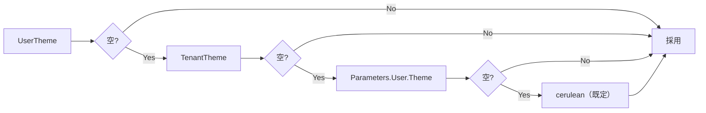
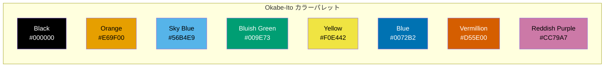

# アクセシビリティテーマ追加

色覚異常（Color Vision Deficiency: CVD）対応を主目的として、プリザンターにアクセシビリティテーマを追加するための調査と設計をまとめる。

<!-- START doctoc generated TOC please keep comment here to allow auto update -->
<!-- DON'T EDIT THIS SECTION, INSTEAD RE-RUN doctoc TO UPDATE -->

- [調査情報](#調査情報)
- [調査目的](#調査目的)
- [現行テーマシステムの構造](#現行テーマシステムの構造)
    - [テーマ世代](#テーマ世代)
    - [テーマ解決の優先順位](#テーマ解決の優先順位)
    - [テーマディレクトリ構成](#テーマディレクトリ構成)
    - [CSS カスタムプロパティの構造](#css-カスタムプロパティの構造)
    - [テーマ追加時の変更対象](#テーマ追加時の変更対象)
- [色覚異常の種類と影響](#色覚異常の種類と影響)
- [提案テーマ一覧](#提案テーマ一覧)
- [1. ハイコントラストテーマ（high-contrast）](#1-ハイコントラストテーマhigh-contrast)
    - [概要](#概要)
    - [設計方針](#設計方針)
    - [ColorScheme 定義案](#colorscheme-定義案)
    - [コントラスト比の検証](#コントラスト比の検証)
- [2. Okabe-Ito カラーパレットテーマ（okabe-ito）](#2-okabe-ito-カラーパレットテーマokabe-ito)
    - [概要](#概要-1)
    - [Okabe-Ito カラーパレット](#okabe-ito-カラーパレット)
    - [設計方針](#設計方針-1)
    - [ColorScheme 定義案](#colorscheme-定義案-1)
    - [色覚シミュレーション結果](#色覚シミュレーション結果)
- [3. ダークハイコントラストテーマ（dark-high-contrast）](#3-ダークハイコントラストテーマdark-high-contrast)
    - [概要](#概要-2)
    - [設計方針](#設計方針-2)
    - [ColorScheme 定義案](#colorscheme-定義案-2)
    - [コントラスト比の検証](#コントラスト比の検証-1)
- [4. モノクロームテーマ（monochrome）](#4-モノクロームテーマmonochrome)
    - [概要](#概要-3)
    - [設計方針](#設計方針-3)
    - [ColorScheme 定義案](#colorscheme-定義案-3)
- [実装手順](#実装手順)
    - [1. テーマディレクトリの作成](#1-テーマディレクトリの作成)
    - [2. Context.cs の変更](#2-contextcs-の変更)
    - [3. テーマ選択肢の追加](#3-テーマ選択肢の追加)
    - [4. テーマ名の多言語対応](#4-テーマ名の多言語対応)
- [WCAG 準拠の補足的 CSS 対応](#wcag-準拠の補足的-css-対応)
    - [prefers-contrast メディアクエリ](#prefers-contrast-メディアクエリ)
    - [forced-colors メディアクエリ](#forced-colors-メディアクエリ)
- [テーマ比較表](#テーマ比較表)
- [結論](#結論)
- [関連ソースコード](#関連ソースコード)
- [関連リンク](#関連リンク)

<!-- END doctoc generated TOC please keep comment here to allow auto update -->

## 調査情報

| 調査日       | リポジトリ | ブランチ | タグ/バージョン    | コミット     | 備考     |
| ------------ | ---------- | -------- | ------------------ | ------------ | -------- |
| 2026年3月3日 | Pleasanter | main     | Pleasanter_1.5.1.0 | `34f162a439` | 初回調査 |

## 調査目的

プリザンターの現行テーマは色覚異常ユーザへの配慮が十分でなく、ステータス表示やボタンの識別が困難になるケースがある。以下の観点からアクセシビリティテーマの追加方針を策定する。

- ハイコントラストテーマの設計
- Okabe-Ito カラーパレットテーマの設計
- その他推奨テーマの提案
- 現行テーマシステムにおける追加手順の整理

---

## 現行テーマシステムの構造

### テーマ世代

プリザンターのテーマは 2 世代で構成されている。

| 世代 | バージョン | ベース技術       | テーマ数 | 備考                                    |
| ---- | ---------- | ---------------- | -------- | --------------------------------------- |
| 第 1 | 1.0M       | jQuery UI テーマ | 25       | レガシー。CSS 変数未使用                |
| 第 2 | 2.0M       | CSS Custom Props | 4        | cerulean, green-tea, mandarin, midnight |

アクセシビリティテーマは第 2 世代（2.0M）として追加する。第 2 世代テーマは CSS カスタムプロパティ（`:root` 変数）でカラースキームを定義しており、色の差し替えだけでテーマを構成できるため拡張性が高い。

### テーマ解決の優先順位



**ファイル**: `Implem.Pleasanter/Libraries/Requests/Context.cs`（行番号: 1277-1284）

```csharp
public string Theme()
{
    var theme = Strings.CoalesceEmpty(
        UserTheme,
        TenantTheme,
        Parameters.User.Theme,
        "cerulean");
    return theme;
}
```

### テーマディレクトリ構成

各テーマは以下のディレクトリに配置される。

```text
Implem.PleasanterFrontend/wwwroot/src/clone/assets/themes/{テーマ名}/
  +-- custom.css        ... CSS カスタムプロパティ定義（約210変数）
  +-- jquery-ui.min.css ... jQuery UI フレームワーク CSS
  +-- images/           ... アイコンスプライト画像
```

### CSS カスタムプロパティの構造

`custom.css` では `:root` セレクタ内に約 210 個の CSS カスタムプロパティが定義されている。主要なカテゴリは以下のとおり。

| カテゴリ       | 変数プレフィックス例            | 役割                          |
| -------------- | ------------------------------- | ----------------------------- |
| ColorScheme    | `--primaryColor`, `--nonColor*` | テーマの基本カラーパレット    |
| BaseSetting    | `--page-bg`, `--base-text`      | ページ全体の背景・文字色      |
| Buttons        | `--btn-positive-*`              | ボタンの状態別スタイル        |
| FormController | `--control-*`                   | フォーム入力要素のスタイル    |
| Module         | `--grid-*`, `--editor-*`        | グリッド・エディタのスタイル  |
| WebComponents  | `--u-modal-*`                   | モーダルダイアログ            |
| SmartDesign    | `--sd-*`                        | SmartDesign UI コンポーネント |

### テーマ追加時の変更対象

新しい第 2 世代テーマを追加するために必要な変更箇所は以下のとおり。

| #   | 対象ファイル                           | 変更内容                                |
| --- | -------------------------------------- | --------------------------------------- |
| 1   | `themes/{テーマ名}/custom.css`         | CSS カスタムプロパティ定義（新規）      |
| 2   | `themes/{テーマ名}/jquery-ui.min.css`  | jQuery UI CSS（既存テーマからコピー可） |
| 3   | `themes/{テーマ名}/images/`            | アイコン画像（既存からコピー可）        |
| 4   | `Context.cs` ThemeVersion()            | switch case に新テーマ名を追加          |
| 5   | `Context.cs` ThemeVersionForCss()      | 同上                                    |
| 6   | `Definition_Column/Users_Theme.json`   | ChoicesText に新テーマ名を追加          |
| 7   | `Definition_Column/Tenants_Theme.json` | ChoicesText に新テーマ名を追加          |

---

## 色覚異常の種類と影響

テーマ設計にあたり、対象とする色覚異常の種類と影響を整理する。

| 種類   | 英名          | 人口比率（男性） | 影響を受ける色の組み合わせ        |
| ------ | ------------- | ---------------- | --------------------------------- |
| 1 型   | Protanopia    | 約 1%            | 赤-緑の区別が困難。赤が暗く見える |
| 2 型   | Deuteranopia  | 約 5%            | 赤-緑の区別が困難。最も多い       |
| 3 型   | Tritanopia    | 約 0.01%         | 青-黄の区別が困難                 |
| 全色盲 | Achromatopsia | 極めてまれ       | すべての色の区別が困難            |

現行テーマで問題が生じやすい箇所:

- 赤（`--commonColor01: #e03e3e`）と緑（`--commonColor07`）のステータス表示
- 成功色（`--success-color`）と警告色（`--warning-color`）の区別
- リンクテキスト（`--link-text`）と通常テキスト（`--base-text`）の区別

---

## 提案テーマ一覧

以下の 4 テーマを追加することを提案する。

| #   | テーマ名               | 内部名               | 主目的                        |
| --- | ---------------------- | -------------------- | ----------------------------- |
| 1   | ハイコントラスト       | `high-contrast`      | WCAG AAA 準拠の高コントラスト |
| 2   | Okabe-Ito              | `okabe-ito`          | CVD 対応カラーパレット        |
| 3   | ダークハイコントラスト | `dark-high-contrast` | 暗色背景での高コントラスト    |
| 4   | モノクローム           | `monochrome`         | 色に依存しない UI             |

---

## 1. ハイコントラストテーマ（high-contrast）

### 概要

WCAG 2.1 AAA レベル（コントラスト比 7:1 以上）を満たす明色背景のハイコントラストテーマ。Windows のハイコントラストモードに類似した、明確な視覚的区別を提供する。

### 設計方針

| 項目           | 方針                                           |
| -------------- | ---------------------------------------------- |
| 背景色         | 純白（`#ffffff`）                              |
| テキスト色     | 純黒（`#000000`）                              |
| コントラスト比 | 通常テキスト 21:1、最低でも 7:1（AAA 準拠）    |
| ボーダー       | 2px 以上の実線。色のみに依存しない境界線       |
| フォーカス表示 | 3px 以上のアウトライン                         |
| 色の使い方     | 色だけで情報を伝えない（形状・テキストを併用） |

### ColorScheme 定義案

```css
:root {
    /* ColorScheme ---------------------------------------------------------- */
    --primaryColor: #0000cc; /* 濃い青 - リンク・アクセントに使用 */
    --primaryDark: #000099;
    --primarySub01: #6666ff;
    --primarySub02: #9999ff;
    --primarySub03: #ccccff;
    --primarySub04: #e6e6ff;
    --commonColor01: #cc0000; /* 濃い赤 - エラー・警告 */
    --commonColor02: #ff3333;
    --commonColor03: #ffcccc;
    --commonColor04: #ffe6e6;
    --commonColor05: #ffffcc;
    --commonColor06: #cc6600; /* 濃いオレンジ */
    --commonColor07: #006600; /* 濃い緑 - 成功 */

    /* グレースケール（高コントラスト） */
    --nonColor01: #000000;
    --nonColor02: #1a1a1a;
    --nonColor03: #333333;
    --nonColor04: #4d4d4d;
    --nonColor05: #666666;
    --nonColor06: #808080;
    --nonColor07: #999999;
    --nonColor08: #b3b3b3;
    --nonColor09: #cccccc;
    --nonColor10: #d9d9d9;
    --nonColor11: #e6e6e6;
    --nonColor12: #f0f0f0;
    --nonColor13: #f5f5f5;
    --nonColor14: #fafafa;
    --nonColor15: #fcfcfc;
    --nonColor16: #ffffff;

    /* BaseSetting ---------------------------------------------------------- */
    --page-bg: #ffffff;
    --base-text: #000000;
    --base-bg: #ffffff;
    --base-border: #000000; /* 黒い境界線で明確な区分 */
    --link-text: #0000cc;
    --success-color: #006600;
    --warning-color: #cc0000;
}
```

### コントラスト比の検証

| 要素           | 前景色    | 背景色    | コントラスト比 | WCAG レベル |
| -------------- | --------- | --------- | -------------- | ----------- |
| 通常テキスト   | `#000000` | `#ffffff` | 21:1           | AAA         |
| リンクテキスト | `#0000cc` | `#ffffff` | 9.4:1          | AAA         |
| エラーテキスト | `#cc0000` | `#ffffff` | 5.9:1          | AA          |
| 成功表示       | `#006600` | `#ffffff` | 7.1:1          | AAA         |
| ボタン文字     | `#ffffff` | `#0000cc` | 9.4:1          | AAA         |

---

## 2. Okabe-Ito カラーパレットテーマ（okabe-ito）

### 概要

岡部・伊藤カラーパレットは、色覚異常の有無にかかわらず識別しやすい 8 色のカラーパレットである。Masataka Okabe と Kei Ito によって提案され、科学論文やデータ可視化で広く使用されている。

### Okabe-Ito カラーパレット

| #   | 色名           | Hex コード | 用途例             |
| --- | -------------- | ---------- | ------------------ |
| 1   | Black          | `#000000`  | テキスト・境界線   |
| 2   | Orange         | `#E69F00`  | 注意・警告         |
| 3   | Sky Blue       | `#56B4E9`  | 情報・補助         |
| 4   | Bluish Green   | `#009E73`  | 成功・完了         |
| 5   | Yellow         | `#F0E442`  | ハイライト・注目   |
| 6   | Blue           | `#0072B2`  | プライマリ・リンク |
| 7   | Vermillion     | `#D55E00`  | エラー・削除       |
| 8   | Reddish Purple | `#CC79A7`  | アクセント・タグ   |



### 設計方針

| 項目           | 方針                                        |
| -------------- | ------------------------------------------- |
| プライマリ     | Blue（`#0072B2`）をベースカラーとして採用   |
| 成功色         | Bluish Green（`#009E73`）                   |
| 警告色         | Orange（`#E69F00`）                         |
| エラー色       | Vermillion（`#D55E00`）                     |
| リンク色       | Blue（`#0072B2`）                           |
| アクセント     | Reddish Purple（`#CC79A7`）                 |
| 背景色         | 白系（cerulean テーマベース）               |
| ステータス表示 | Okabe-Ito の 8 色を組み合わせて識別性を確保 |

### ColorScheme 定義案

```css
:root {
    /* ColorScheme ---------------------------------------------------------- */
    --primaryColor: #0072b2; /* Blue - プライマリカラー */
    --primaryDark: #005a8e;
    --primarySub01: #56b4e9; /* Sky Blue */
    --primarySub02: #a3d5f0;
    --primarySub03: #d4eaf7;
    --primarySub04: #eaf5fb;
    --commonColor01: #d55e00; /* Vermillion - エラー */
    --commonColor02: #e07a33;
    --commonColor03: #f5cdb0;
    --commonColor04: #fae6d5;
    --commonColor05: #fdf8e0; /* Yellow 系の薄い背景 */
    --commonColor06: #e69f00; /* Orange - 警告 */
    --commonColor07: #009e73; /* Bluish Green - 成功 */
}
```

### 色覚シミュレーション結果

Okabe-Ito パレットは以下のすべての色覚タイプで識別可能であることが確認されている。

| 色の組み合わせ         | 正常色覚 | 1 型（P 型） | 2 型（D 型） | 3 型（T 型） |
| ---------------------- | :------: | :----------: | :----------: | :----------: |
| Blue と Vermillion     |  識別可  |    識別可    |    識別可    |    識別可    |
| Bluish Green と Orange |  識別可  |    識別可    |    識別可    |    識別可    |
| Sky Blue と Yellow     |  識別可  |    識別可    |    識別可    |    識別可    |
| Black とその他すべて   |  識別可  |    識別可    |    識別可    |    識別可    |

---

## 3. ダークハイコントラストテーマ（dark-high-contrast）

### 概要

暗色背景で高コントラストを実現するテーマ。光過敏やまぶしさを感じるユーザ向けで、明るい画面が苦手な場合にも使用できる。既存の midnight テーマをベースに、コントラスト比を WCAG AAA レベルまで引き上げる。

### 設計方針

| 項目           | 方針                                     |
| -------------- | ---------------------------------------- |
| 背景色         | 純黒（`#000000`）                        |
| テキスト色     | 純白（`#ffffff`）                        |
| コントラスト比 | 最低 7:1（AAA 準拠）                     |
| ボーダー       | 明色の実線（`#ffffff` または `#cccccc`） |
| フォーカス表示 | 高輝度の黄色アウトライン（`#ffff00`）    |
| リンク色       | 明るい水色（`#66ccff`）                  |

### ColorScheme 定義案

```css
:root {
    /* ColorScheme ---------------------------------------------------------- */
    --primaryColor: #66ccff; /* 明るい水色 */
    --primaryDark: #3399cc;
    --primarySub01: #1a1a2e;
    --primarySub02: #0d0d1a;
    --primarySub03: #2a2a3e;
    --primarySub04: #e6f5ff;
    --commonColor01: #ff6666; /* 明るい赤 */
    --commonColor02: #ff9999;
    --commonColor03: #4d0000;
    --commonColor04: #330000;
    --commonColor05: #333300;
    --commonColor06: #ffcc00; /* 明るい黄 */
    --commonColor07: #66ff99; /* 明るい緑 */

    /* グレースケール（ダーク用） */
    --nonColor01: #000000;
    --nonColor02: #0d0d0d;
    --nonColor03: #1a1a1a;
    --nonColor04: #262626;
    --nonColor05: #333333;
    --nonColor06: #4d4d4d;
    --nonColor07: #666666;
    --nonColor08: #999999;
    --nonColor09: #b3b3b3;
    --nonColor10: #cccccc;
    --nonColor11: #d9d9d9;
    --nonColor12: #e6e6e6;
    --nonColor13: #f0f0f0;
    --nonColor14: #f5f5f5;
    --nonColor15: #fafafa;
    --nonColor16: #ffffff;

    /* BaseSetting ---------------------------------------------------------- */
    --page-bg: #000000;
    --base-text: #ffffff;
    --base-bg: #000000;
    --base-border: #cccccc;
    --link-text: #66ccff;
    --success-color: #66ff99;
    --warning-color: #ff6666;
}
```

### コントラスト比の検証

| 要素           | 前景色    | 背景色    | コントラスト比 | WCAG レベル |
| -------------- | --------- | --------- | -------------- | ----------- |
| 通常テキスト   | `#ffffff` | `#000000` | 21:1           | AAA         |
| リンクテキスト | `#66ccff` | `#000000` | 10.3:1         | AAA         |
| エラーテキスト | `#ff6666` | `#000000` | 5.5:1          | AA          |
| 成功表示       | `#66ff99` | `#000000` | 12.4:1         | AAA         |
| ボタン文字     | `#000000` | `#66ccff` | 10.3:1         | AAA         |

---

## 4. モノクロームテーマ（monochrome）

### 概要

色に依存せず、明度差（グレースケール）のみで UI 要素を区別するテーマ。全色盲（Achromatopsia）のユーザや、色を使わずに画面を利用したいケースに対応する。

### 設計方針

| 項目           | 方針                                         |
| -------------- | -------------------------------------------- |
| カラーパレット | グレースケールのみ使用                       |
| 情報の伝達     | 明度差・パターン・テキストラベルで区別       |
| ステータス表示 | テキストラベルを必須とし、色だけに依存しない |
| ボーダー       | 異なる太さ・スタイルで要素を区分             |
| アクセント色   | なし（グレースケールの濃淡で対応）           |

### ColorScheme 定義案

```css
:root {
    /* ColorScheme ---------------------------------------------------------- */
    --primaryColor: #333333;
    --primaryDark: #1a1a1a;
    --primarySub01: #999999;
    --primarySub02: #b3b3b3;
    --primarySub03: #d9d9d9;
    --primarySub04: #f0f0f0;
    --commonColor01: #1a1a1a; /* エラー（最も濃い） */
    --commonColor02: #333333;
    --commonColor03: #e6e6e6;
    --commonColor04: #f0f0f0;
    --commonColor05: #fafafa;
    --commonColor06: #4d4d4d; /* 警告（やや濃い） */
    --commonColor07: #808080; /* 成功（中間） */

    /* BaseSetting ---------------------------------------------------------- */
    --page-bg: #f5f5f5;
    --base-text: #000000;
    --base-bg: #ffffff;
    --base-border: #333333;
    --link-text: #000000;
    --success-color: #808080;
    --warning-color: #1a1a1a;
}
```

---

## 実装手順

### 1. テーマディレクトリの作成

各テーマについて、以下のディレクトリ・ファイルを作成する。

```text
Implem.PleasanterFrontend/wwwroot/src/clone/assets/themes/
  +-- high-contrast/
  |   +-- custom.css
  |   +-- jquery-ui.min.css    ... cerulean からコピー
  |   +-- images/              ... cerulean からコピー（dark 系アイコン）
  +-- okabe-ito/
  |   +-- custom.css
  |   +-- jquery-ui.min.css    ... cerulean からコピー
  |   +-- images/              ... cerulean からコピー
  +-- dark-high-contrast/
  |   +-- custom.css
  |   +-- jquery-ui.min.css    ... midnight からコピー
  |   +-- images/              ... midnight からコピー（light 系アイコン）
  +-- monochrome/
  |   +-- custom.css
  |   +-- jquery-ui.min.css    ... cerulean からコピー
  |   +-- images/              ... cerulean からコピー
```

### 2. Context.cs の変更

`ThemeVersion()` と `ThemeVersionForCss()` の switch 文に新テーマを追加する。

**ファイル**: `Implem.Pleasanter/Libraries/Requests/Context.cs`（行番号: 1287-1313）

```csharp
public decimal ThemeVersion()
{
    switch (Theme())
    {
        case "cerulean":
        case "green-tea":
        case "mandarin":
        case "midnight":
        case "high-contrast":       // 追加
        case "okabe-ito":           // 追加
        case "dark-high-contrast":  // 追加
        case "monochrome":          // 追加
            return 2.0M;
        default:
            return 1.0M;
    }
}
```

### 3. テーマ選択肢の追加

`Definition_Column` の `Users_Theme.json` と `Tenants_Theme.json` の `ChoicesText` に新テーマ名を追加する。

**ファイル**: `Implem.Pleasanter/App_Data/Definitions/Definition_Column/Users_Theme.json`

```json
{
    "ChoicesText": "cerulean\ngreen-tea\nmandarin\nmidnight\nhigh-contrast\nokabe-ito\ndark-high-contrast\nmonochrome\nbase\n..."
}
```

### 4. テーマ名の多言語対応

テーマ名の表示ラベルを多言語対応する場合は、`DisplayAccessor` を通じて以下の表示名を追加する。

| テーマ内部名         | 日本語表示名           | 英語表示名         |
| -------------------- | ---------------------- | ------------------ |
| `high-contrast`      | ハイコントラスト       | High Contrast      |
| `okabe-ito`          | Okabe-Ito              | Okabe-Ito          |
| `dark-high-contrast` | ダークハイコントラスト | Dark High Contrast |
| `monochrome`         | モノクローム           | Monochrome         |

---

## WCAG 準拠の補足的 CSS 対応

テーマの CSS カスタムプロパティ変更に加えて、以下のメディアクエリ対応を検討する。

### prefers-contrast メディアクエリ

ユーザの OS 設定でハイコントラストモードが有効な場合に、自動的にコントラストを強化する CSS を追加できる。

```css
@media (prefers-contrast: more) {
    :root {
        --base-border: #000000;
        --control-border: #000000;
        --control-border-focus: #0000cc;
    }
}
```

### forced-colors メディアクエリ

Windows のハイコントラストモードで正しく表示するための対応。

```css
@media (forced-colors: active) {
    :root {
        /* システムカラーキーワードを使用 */
        --base-text: CanvasText;
        --base-bg: Canvas;
        --link-text: LinkText;
        --btn-positive-bg: ButtonFace;
    }
}
```

---

## テーマ比較表

| 特性            | cerulean（現行） | high-contrast | okabe-ito | dark-high-contrast | monochrome |
| --------------- | :--------------: | :-----------: | :-------: | :----------------: | :--------: |
| 背景            |       明色       |     明色      |   明色    |        暗色        |    明色    |
| コントラスト比  |        AA        |      AAA      |    AA     |        AAA         |    AAA     |
| CVD 対応        |      未対応      |   部分対応    | 完全対応  |      部分対応      |  完全対応  |
| 光過敏対応      |      未対応      |    未対応     |  未対応   |        対応        |  部分対応  |
| WCAG 2.1 レベル |       A-AA       |      AAA      |  AA-AAA   |        AAA         |    AAA     |

---

## 結論

| 項目                   | 結論                                                                                         |
| ---------------------- | -------------------------------------------------------------------------------------------- |
| テーマ追加の実現性     | 第 2 世代テーマの CSS カスタムプロパティ方式により、カラー定義の差し替えだけで実装可能       |
| 必要な変更量           | テーマあたり custom.css 1 ファイル + Context.cs への case 追加 + 選択肢 JSON の更新          |
| ハイコントラスト       | WCAG AAA 準拠の高コントラスト配色。純白背景・純黒テキストで最大 21:1 のコントラスト比を実現  |
| Okabe-Ito              | CVD 対応の色覚バリアフリーパレット。すべての色覚タイプで色の識別が可能                       |
| ダークハイコントラスト | midnight ベースでコントラスト比を AAA レベルに引き上げ。光過敏ユーザに対応                   |
| モノクローム           | 色に依存しないグレースケール UI。全色盲対応。色以外の手段で情報を伝達する設計の実証にも有用  |
| 推奨実装順             | high-contrast、okabe-ito を優先（対象ユーザ数が多い）。その後 dark-high-contrast、monochrome |
| 追加の検討事項         | `prefers-contrast` / `forced-colors` メディアクエリによる OS 設定連携も併せて検討すべき      |

---

## 関連ソースコード

| ファイル                                                                      | 内容                            |
| ----------------------------------------------------------------------------- | ------------------------------- |
| `Implem.Pleasanter/Libraries/Requests/Context.cs`                             | テーマ解決・バージョン判定      |
| `Implem.Pleasanter/Libraries/HtmlParts/HtmlStyles.cs`                         | テーマ CSS の HTML 出力         |
| `Implem.PleasanterFrontend/wwwroot/src/clone/assets/themes/*/custom.css`      | テーマ別 CSS カスタムプロパティ |
| `Implem.Pleasanter/App_Data/Definitions/Definition_Column/Users_Theme.json`   | ユーザテーマ選択肢定義          |
| `Implem.Pleasanter/App_Data/Definitions/Definition_Column/Tenants_Theme.json` | テナントテーマ選択肢定義        |

## 関連リンク

- [Okabe-Ito カラーパレット](https://jfly.uni-koeln.de/color/) - 岡部・伊藤による色覚バリアフリーカラーパレットの原典
- [WCAG 2.1 コントラスト要件](https://www.w3.org/WAI/WCAG21/Understanding/contrast-minimum.html) - W3C によるコントラスト比の基準
- [prefers-contrast - MDN](https://developer.mozilla.org/ja/docs/Web/CSS/@media/prefers-contrast) - ハイコントラスト設定のメディアクエリ
