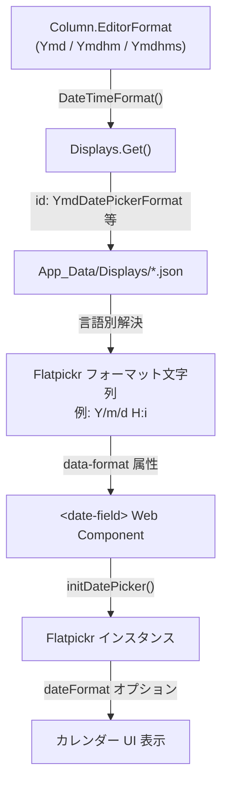
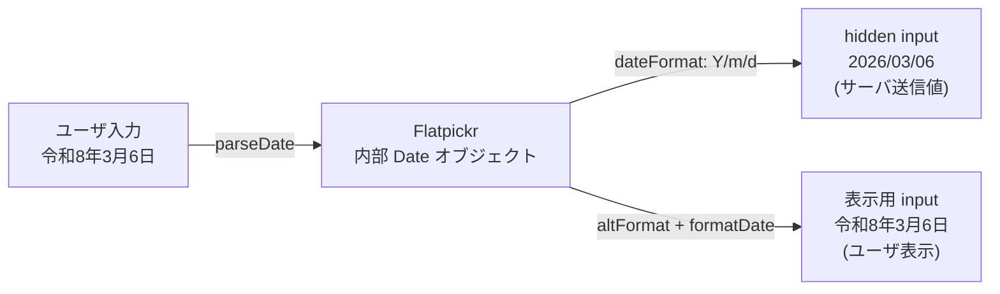
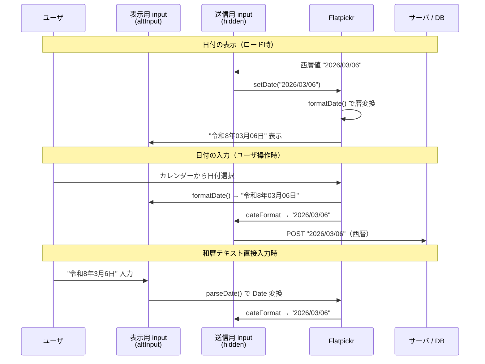

# Flatpickr 和暦・多暦カレンダー対応

Flatpickr の `formatDate`/`parseDate`/`altInput` オプションを活用し、和暦や他の暦法での日付入力・表示を実現する方法を調査する。DB 格納値は西暦のまま、UI のみ設定された暦で表示する設計を検討する。

<!-- START doctoc generated TOC please keep comment here to allow auto update -->
<!-- DON'T EDIT THIS SECTION, INSTEAD RE-RUN doctoc TO UPDATE -->

- [調査情報](#調査情報)
- [調査目的](#調査目的)
- [現行の日付入力アーキテクチャ](#現行の日付入力アーキテクチャ)
    - [date-field Web Component](#date-field-web-component)
    - [日付フォーマットの解決フロー](#日付フォーマットの解決フロー)
    - [現行の言語別フォーマット定義](#現行の言語別フォーマット定義)
- [Flatpickr のカスタム暦対応機能](#flatpickr-のカスタム暦対応機能)
    - [formatDate / parseDate オプション](#formatdate--parsedate-オプション)
    - [altInput / altFormat オプション](#altinput--altformat-オプション)
- [和暦変換の実装方式](#和暦変換の実装方式)
    - [方式 1: Intl.DateTimeFormat（推奨）](#方式-1-intldatetimeformat推奨)
    - [方式 2: 手動元号テーブル](#方式-2-手動元号テーブル)
    - [方式比較](#方式比較)
- [和暦以外の暦法対応](#和暦以外の暦法対応)
- [プリザンターへの実装方針](#プリザンターへの実装方針)
    - [実装アプローチ](#実装アプローチ)
    - [バックエンド側の変更](#バックエンド側の変更)
    - [処理フロー全体像](#処理フロー全体像)
- [一覧画面・グリッド表示の対応](#一覧画面グリッド表示の対応)
- [技術的な注意事項](#技術的な注意事項)
    - [parseDate の課題](#parsedate-の課題)
    - [altInput と Shadow DOM の整合性](#altinput-と-shadow-dom-の整合性)
    - [moment.js との整合](#momentjs-との整合)
- [結論](#結論)
- [関連ソースコード](#関連ソースコード)
- [関連リンク](#関連リンク)

<!-- END doctoc generated TOC please keep comment here to allow auto update -->

## 調査情報

| 調査日       | リポジトリ | ブランチ | タグ/バージョン    | コミット     | 備考     |
| ------------ | ---------- | -------- | ------------------ | ------------ | -------- |
| 2026年3月6日 | Pleasanter | main     | Pleasanter_1.5.1.0 | `34f162a439` | 初回調査 |

## 調査目的

プリザンターの日付入力は Flatpickr（v4.6.13）を使用しているが、現状は西暦形式（`Y/m/d` 等）のみ対応している。
日本の行政や金融業務では和暦（令和・平成等）での日付表示が求められる場合がある。
以下の観点から、Flatpickr で和暦および他の暦法を入力・表示する実現可能性と実装方針を調査する。

- Flatpickr の `formatDate`/`parseDate` によるカスタム暦表示の可能性
- `altInput` による「表示用フォーマット」と「送信用フォーマット」の分離
- `Intl.DateTimeFormat` を活用した暦変換の標準 API
- プリザンターの現行日付処理アーキテクチャとの整合性

---

## 現行の日付入力アーキテクチャ

### date-field Web Component

プリザンターの第 2 世代テーマでは、日付入力は `<date-field>` カスタム要素（Web Component）として実装されている。

**ファイル**: `Implem.PleasanterFrontend/wwwroot/src/scripts/modules/datefield.ts`

```typescript
class InputDate extends HTMLElement {
    private dataPicker?: Instance;
    private dateFormat: string = 'Y/m/d H:i';

    private initDatePicker() {
        const fpOptions: Options = {
            locale: Object.assign({}, flatpickr.l10ns.default, InputDate.language === 'ja' ? Japanese : {}, {
                firstDayOfWeek: 1,
            }),
            dateFormat: this.dateFormat,
            enableTime: this.inputElm.dataset.timepicker === '1',
            allowInput: !InputDate.isRwd ? true : false,
            disableMobile: true,
            // ...
        };
        this.dataPicker = flatpickr(this.inputElm, fpOptions);
    }
}
window.customElements.define('date-field', InputDate);
```

### 日付フォーマットの解決フロー



### 現行の言語別フォーマット定義

**ファイル**: `Implem.Pleasanter/App_Data/Displays/YmdDatePickerFormat.json`

| 言語             | Flatpickr フォーマット | .NET フォーマット | 表示例      |
| ---------------- | ---------------------- | ----------------- | ----------- |
| en（デフォルト） | `m/d/Y`                | `MM/dd/yyyy`      | 03/06/2026  |
| ja（日本語）     | `Y/m/d`                | `yyyy/MM/dd`      | 2026/03/06  |
| zh（中国語）     | `Y/m/d`                | `yyyy/MM/dd`      | 2026/03/06  |
| de（ドイツ語）   | `Y.m.d`                | `yyyy.MM.dd`      | 2026.03.06  |
| ko（韓国語）     | `Y.m.d.`               | `yyyy.MM.dd.`     | 2026.03.06. |
| es（スペイン語） | `Y/m/d`                | `yyyy/MM/dd`      | 2026/03/06  |
| vn（ベトナム語） | `Y/m/d`                | `yyyy/MM/dd`      | 2026/03/06  |

---

## Flatpickr のカスタム暦対応機能

### formatDate / parseDate オプション

Flatpickr は `formatDate` と `parseDate` のカスタム関数を Options として受け付ける。これにより、内部的には `Date` オブジェクト（西暦）を保持しつつ、表示のみ任意の暦法に変換できる。

```typescript
const fpOptions: Options = {
    dateFormat: 'Y/m/d',
    formatDate: (date: Date, format: string, locale: any): string => {
        // Date → 和暦文字列に変換して返す
        return toWareki(date);
    },
    parseDate: (dateStr: string, format: string): Date => {
        // 和暦文字列 → Date に変換して返す
        return fromWareki(dateStr);
    },
};
```

| オプション   | 型                                                       | 用途                                   |
| ------------ | -------------------------------------------------------- | -------------------------------------- |
| `formatDate` | `(date: Date, format: string, locale: Locale) => string` | Date を任意の文字列に変換（表示用）    |
| `parseDate`  | `(dateStr: string, format: string) => Date`              | 任意の文字列を Date に逆変換（入力用） |

### altInput / altFormat オプション

`altInput` を使うと、ユーザに見せる入力欄と、実際に form 送信される値を分離できる。

```typescript
const fpOptions: Options = {
    dateFormat: 'Y/m/d', // 送信される値（西暦）
    altInput: true, // 別の表示用入力欄を生成
    altFormat: 'F j, Y', // 表示用フォーマット
    formatDate: (date, format) => {
        if (format === 'F j, Y') {
            return toWareki(date); // 表示は和暦
        }
        return flatpickr.formatDate(date, format); // 送信は西暦
    },
};
```



---

## 和暦変換の実装方式

### 方式 1: Intl.DateTimeFormat（推奨）

JavaScript 標準の `Intl.DateTimeFormat` は `ja-JP-u-ca-japanese` ロケールで和暦に対応しており、ブラウザネイティブで元号変換が可能。

```typescript
function toWareki(date: Date): string {
    return new Intl.DateTimeFormat('ja-JP-u-ca-japanese', {
        era: 'long',
        year: 'numeric',
        month: '2-digit',
        day: '2-digit',
    }).format(date);
    // → "令和8年03月06日"
}
```

`formatToParts()` を使えば、各パーツを個別に取得してカスタムフォーマットも可能。

```typescript
function toWarekiCustom(date: Date): string {
    const parts = new Intl.DateTimeFormat('ja-JP-u-ca-japanese', {
        era: 'long',
        year: 'numeric',
        month: 'numeric',
        day: 'numeric',
    }).formatToParts(date);

    const era = parts.find((p) => p.type === 'era')?.value; // "令和"
    const year = parts.find((p) => p.type === 'year')?.value; // "8"
    const month = parts.find((p) => p.type === 'month')?.value; // "3"
    const day = parts.find((p) => p.type === 'day')?.value; // "6"
    return `${era}${year}年${month}月${day}日`;
    // → "令和8年3月6日"
}
```

| 項目         | 内容                                              |
| ------------ | ------------------------------------------------- |
| 対応ブラウザ | Chrome 24+, Firefox 29+, Safari 10+, Edge 12+     |
| 元号データ   | CLDR（Unicode Common Locale Data Repository）準拠 |
| 令和対応     | 2019年5月1日以降を自動判定                        |
| メンテナンス | ブラウザ更新で新元号に自動対応                    |
| 外部依存     | なし（ブラウザ標準 API）                          |

### 方式 2: 手動元号テーブル

元号の開始日を自前で定義して変換するアプローチ。

```typescript
const ERA_TABLE = [
    { name: '令和', start: new Date(2019, 4, 1) },
    { name: '平成', start: new Date(1989, 0, 8) },
    { name: '昭和', start: new Date(1926, 11, 25) },
    { name: '大正', start: new Date(1912, 6, 30) },
    { name: '明治', start: new Date(1868, 0, 25) },
];

function toWareki(date: Date): string {
    for (const era of ERA_TABLE) {
        if (date >= era.start) {
            const year = date.getFullYear() - era.start.getFullYear() + 1;
            return `${era.name}${year}年${date.getMonth() + 1}月${date.getDate()}日`;
        }
    }
    return `${date.getFullYear()}年${date.getMonth() + 1}月${date.getDate()}日`;
}
```

### 方式比較

| 項目           | 方式 1: Intl.DateTimeFormat | 方式 2: 手動元号テーブル          |
| -------------- | --------------------------- | --------------------------------- |
| 実装コスト     | 低                          | 中                                |
| 新元号対応     | ブラウザ更新で自動          | テーブルの手動追加が必要          |
| 精度           | CLDR 準拠（高精度）         | 実装依存                          |
| 外部依存       | なし                        | なし                              |
| カスタマイズ性 | formatToParts で柔軟        | 完全自由                          |
| テスト容易性   | ブラウザ環境依存            | ユニットテスト容易                |
| 推奨度         | 推奨                        | Intl 非対応環境のフォールバック用 |

---

## 和暦以外の暦法対応

`Intl.DateTimeFormat` は Unicode 拡張タグで複数の暦法をサポートしている。

| 暦法           | ロケールタグ例        | 表示例             |
| -------------- | --------------------- | ------------------ |
| 和暦（日本暦） | `ja-JP-u-ca-japanese` | 令和8年3月6日      |
| 仏暦           | `th-TH-u-ca-buddhist` | 2569年3月6日       |
| 中華民国暦     | `zh-TW-u-ca-roc`      | 民國115年3月6日    |
| ヒジュラ暦     | `ar-SA-u-ca-islamic`  | 6 Rabiʻ II 1447 AH |
| ペルシャ暦     | `fa-IR-u-ca-persian`  | 1404/12/15         |
| ヘブライ暦     | `he-IL-u-ca-hebrew`   | 6 Adar 5786        |
| インド国定暦   | `hi-IN-u-ca-indian`   | 15 Phalguna 1947   |

```typescript
function formatByCalendar(date: Date, calendarType: string, locale: string): string {
    return new Intl.DateTimeFormat(`${locale}-u-ca-${calendarType}`, {
        era: 'long',
        year: 'numeric',
        month: 'long',
        day: 'numeric',
    }).format(date);
}
```

---

## プリザンターへの実装方針

### 実装アプローチ

2 段階のアプローチで実装する。

#### アプローチ A: ExtendedScript による拡張（標準機能の範囲内）

プリザンターの ExtendedScript 機能を使い、既存の `<date-field>` の Flatpickr インスタンスを後から上書きする方法。プリザンター本体のコード変更は不要。

```javascript
// ExtendedScript で配置
document.addEventListener('DOMContentLoaded', () => {
    document.querySelectorAll('date-field').forEach((df) => {
        const input = df.querySelector('input');
        if (!input || !input._flatpickr) return;
        const fp = input._flatpickr;
        fp.set('formatDate', (date, format) => {
            if (format === fp.config.dateFormat) {
                return new Intl.DateTimeFormat('ja-JP-u-ca-japanese', {
                    era: 'long',
                    year: 'numeric',
                    month: '2-digit',
                    day: '2-digit',
                }).format(date);
            }
            return flatpickr.formatDate(date, format);
        });
    });
});
```

ただし、この方式には以下の制約がある。

| 制約                   | 説明                                                                                         |
| ---------------------- | -------------------------------------------------------------------------------------------- |
| Shadow DOM の壁        | `<date-field>` は Shadow DOM を使用しているため、外部からの直接的な DOM アクセスに制限がある |
| Flatpickr インスタンス | Shadow DOM 内部の `input._flatpickr` に外部からアクセスできない                              |
| 送信値への影響         | `formatDate` を上書きすると送信値にも和暦文字列が入る可能性がある                            |
| parseDate の同期       | 表示を和暦にした場合、入力の逆変換（parseDate）も必須                                        |

#### アプローチ B: date-field Web Component の拡張（本体改修）

`datefield.ts` に暦設定オプションを追加し、`altInput` 機能を組み込む方法。

**datefield.ts への変更案**:

```typescript
class InputDate extends HTMLElement {
    static calendarType: string; // 'gregorian' | 'japanese' | 'buddhist' | 'roc' 等

    connectedCallback() {
        // data-calendar 属性または全体設定から暦タイプを取得
        if (InputDate.calendarType === undefined) {
            InputDate.calendarType =
                (document.getElementById('CalendarType') as HTMLInputElement)?.value ?? 'gregorian';
        }
        // ...
    }

    private initDatePicker() {
        const fpOptions: Options = {
            dateFormat: this.dateFormat, // 送信用は西暦のまま
            ...(InputDate.calendarType !== 'gregorian'
                ? {
                      altInput: true,
                      altFormat: this.dateFormat, // 表示用（formatDate でオーバーライド）
                      formatDate: (date: Date, format: string): string => {
                          if (format === this.dateFormat && InputDate.calendarType !== 'gregorian') {
                              return this.formatByCalendar(date);
                          }
                          return flatpickr.formatDate(date, format);
                      },
                      parseDate: (str: string, format: string): Date => {
                          return this.parseByCalendar(str) ?? flatpickr.parseDate(str, format);
                      },
                  }
                : {}),
            // ... 既存オプション
        };
    }

    private formatByCalendar(date: Date): string {
        const locale = InputDate.language === 'ja' ? 'ja-JP' : InputDate.language;
        return new Intl.DateTimeFormat(`${locale}-u-ca-${InputDate.calendarType}`, {
            era: 'long',
            year: 'numeric',
            month: '2-digit',
            day: '2-digit',
        }).format(date);
    }

    private parseByCalendar(str: string): Date | null {
        // 和暦の場合: "令和8年03月06日" → Date
        const match = str.match(/(?:令和|平成|昭和|大正|明治)(\d+)年(\d+)月(\d+)日/);
        if (match) {
            // Intl.DateTimeFormat の逆変換は標準APIになく手動処理が必要
            const eraName = str.match(/令和|平成|昭和|大正|明治/)?.[0];
            const eraYear = Number(match[1]);
            const ERA_OFFSETS: Record<string, number> = {
                令和: 2018,
                平成: 1988,
                昭和: 1925,
                大正: 1911,
                明治: 1867,
            };
            const year = (ERA_OFFSETS[eraName ?? ''] ?? 0) + eraYear;
            return new Date(year, Number(match[2]) - 1, Number(match[3]));
        }
        return null;
    }
}
```

### バックエンド側の変更

`altInput` 方式で実装する場合、バックエンド（C#側）の変更は最小限で済む。

| 変更対象                 | 変更内容                                 | 影響度 |
| ------------------------ | ---------------------------------------- | ------ |
| `Column.cs`              | `CalendarType` プロパティの追加          | 小     |
| `HtmlControls.cs`        | `data-calendar` 属性の出力               | 小     |
| `SiteSettings.cs`        | `CalendarType` の永続化                  | 小     |
| `Parameters` / JSON 定義 | `CalendarType` の選択肢定義              | 小     |
| DB スキーマ              | 変更不要（格納値は西暦のまま）           | なし   |
| Displays/\*.json         | 変更不要（フォーマット解決は既存のまま） | なし   |

### 処理フロー全体像



---

## 一覧画面・グリッド表示の対応

日付ピッカー以外の表示箇所（一覧画面、API レスポンス等）でも和暦表示が必要な場合、以下の対応が別途必要になる。

| 表示箇所             | 現行処理                                 | 和暦対応方針                                        |
| -------------------- | ---------------------------------------- | --------------------------------------------------- |
| 編集画面入力欄       | Flatpickr `dateFormat`                   | `altInput` + `formatDate` で対応                    |
| 一覧画面（グリッド） | C# `Column.DisplayGrid()` → `GridFormat` | C# 側で `CultureInfo("ja-JP-u-ca-japanese")` が必要 |
| API レスポンス       | JSON 直列化                              | 西暦のまま（変更不要）                              |
| カレンダービュー     | FullCalendar                             | 別途対応が必要                                      |
| CSV エクスポート     | C# `ToExport()`                          | 出力フォーマット設定の追加                          |

一覧画面の C# 側対応は `JapaneseCalendar` クラスを使用する。

```csharp
using System.Globalization;

var culture = new CultureInfo("ja-JP");
culture.DateTimeFormat.Calendar = new JapaneseCalendar();
var formatted = date.ToString("ggyy年MM月dd日", culture);
// → "令和08年03月06日"
```

---

## 技術的な注意事項

### parseDate の課題

和暦テキストから `Date` への逆変換は標準 API（`Intl.DateTimeFormat`）では直接サポートされていない。`formatToParts` の逆操作に相当する `parseToParts` は存在しないため、正規表現による手動パースが必要になる。

| 入力パターン | 解析難易度 | 例                  |
| ------------ | ---------- | ------------------- |
| 完全形式     | 低         | 令和8年3月6日       |
| 省略形式     | 中         | R8.3.6              |
| 元年表記     | 中         | 令和元年5月1日      |
| 時刻付き     | 中         | 令和8年3月6日 14:30 |
| 元号またぎ   | 高         | 平成31年4月30日     |

### altInput と Shadow DOM の整合性

現行の `<date-field>` は Shadow DOM（`mode: 'open'`）を使用している。
`altInput: true` にすると Flatpickr が元の input の直後に新しい表示用 input を生成するが、
これが Shadow DOM 内の slot 配置と競合する可能性がある。

対策として、`altInput` を使わず `formatDate` のみで表示を切り替え、送信時に `dateFormat` 変換を行う方法も検討すべきである。

### moment.js との整合

現行の「現在日時」ボタン（`onCurrent`）は `moment().utcOffset().format()` で値を設定している。
和暦モードでは moment.js のフォーマットと Flatpickr の `formatDate` が異なる文字列を生成するため、
`onCurrent` メソッドも合わせて修正が必要。

---

## 結論

| 項目                   | 結論                                                                  |
| ---------------------- | --------------------------------------------------------------------- |
| Flatpickr での和暦対応 | `formatDate`/`parseDate` のカスタム関数で実現可能                     |
| 暦変換の推奨方式       | `Intl.DateTimeFormat('ja-JP-u-ca-japanese')` が最も信頼性が高い       |
| DB 格納値              | 西暦のまま変更不要（`dateFormat` が送信値を制御）                     |
| 多暦対応               | `Intl.DateTimeFormat` の Unicode 拡張で仏暦・中華民国暦等にも対応可能 |
| 実装の推奨手順         | アプローチ B（date-field 本体改修 + altInput 方式）を推奨             |
| バックエンド変更       | `CalendarType` 設定の追加のみ。DB スキーマ変更不要                    |
| 主な技術課題           | Shadow DOM と altInput の競合、parseDate の手動実装、moment.js 整合   |
| 一覧画面対応           | C# 側の `JapaneseCalendar` + `CultureInfo` で別途対応が必要           |

---

## 関連ソースコード

| ファイル                                                              | 内容                                       |
| --------------------------------------------------------------------- | ------------------------------------------ |
| `Implem.PleasanterFrontend/wwwroot/src/scripts/modules/datefield.ts`  | date-field Web Component（Flatpickr 統合） |
| `Implem.Pleasanter/Libraries/HtmlParts/HtmlControls.cs`（行 113-167） | date-field HTML 出力                       |
| `Implem.Pleasanter/Libraries/Settings/Column.cs`（行 1032-1039）      | DateTimeFormat() / DatePickerFormat 解決   |
| `Implem.Pleasanter/Libraries/Responses/Displays.cs`（行 12432-12512） | YmdDatePickerFormat 等のフォーマット取得   |
| `Implem.Pleasanter/App_Data/Displays/YmdDatePickerFormat.json`        | 言語別 Flatpickr フォーマット定義          |
| `Implem.Pleasanter/App_Data/Displays/YmdFormat.json`                  | 言語別 .NET フォーマット定義               |

## 関連リンク

- [Flatpickr 公式ドキュメント - Options](https://flatpickr.js.org/options/)
- [Flatpickr 公式ドキュメント - Formatting](https://flatpickr.js.org/formatting/)
- [MDN - Intl.DateTimeFormat](https://developer.mozilla.org/ja/docs/Web/JavaScript/Reference/Global_Objects/Intl/DateTimeFormat)
- [Unicode CLDR - Japanese Calendar](https://cldr.unicode.org/)
