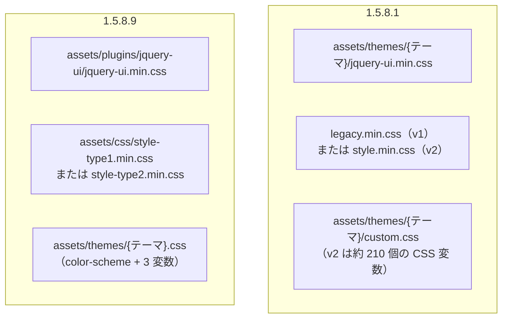
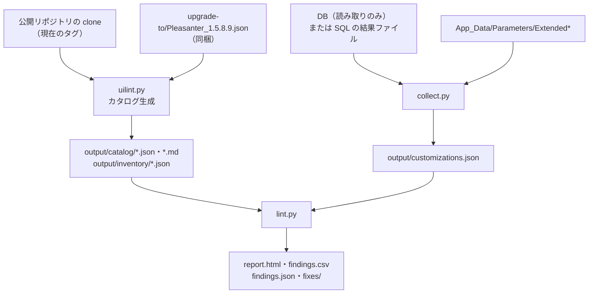

# テーマ改善（UI テーマ刷新）の変更点

2027 年 1 月に正式リリース予定の「テーマ改善」について、動作確認モジュール（1.5.8.9）と現行版（1.5.8.1）を比べ、設定・テーマ・CSS・DOM・`$p` API の何が変わるかをまとめる。

<!-- START doctoc generated TOC please keep comment here to allow auto update -->
<!-- DON'T EDIT THIS SECTION, INSTEAD RE-RUN doctoc TO UPDATE -->

- [調査情報](#調査情報)
- [調査目的](#調査目的)
- [配布物とスケジュール](#配布物とスケジュール)
- [UI タイプとテーマの分離](#ui-タイプとテーマの分離)
    - [現行（1.5.8.1）の仕組み](#現行1581の仕組み)
    - [動作確認モジュールの設定項目](#動作確認モジュールの設定項目)
    - [パラメータ（`User.json`）](#パラメータuserjson)
- [テーマ一覧](#テーマ一覧)
- [CSS ファイルの構成](#css-ファイルの構成)
- [CSS 変数の変化](#css-変数の変化)
- [DOM のクラス・ID と `$p` API](#dom-のクラスid-と-p-api)
    - [breaking](#breaking)
    - [risky（標準スタイルの定義だけが消える）](#risky標準スタイルの定義だけが消える)
    - [カタログの breaking を配布物と突き合わせた結果](#カタログの-breaking-を配布物と突き合わせた結果)
- [実画面での DOM の比較](#実画面での-dom-の比較)
    - [比較の方法](#比較の方法)
    - [変わったところ](#変わったところ)
    - [変わらなかったところ](#変わらなかったところ)
    - [UI タイプ 1 でも HTML は同じ](#ui-タイプ-1-でも-html-は同じ)
    - [カタログとの対応](#カタログとの対応)
- [PleasanterUiLint](#pleasanteruilint)
- [動作確認モジュールで確認するときの注意](#動作確認モジュールで確認するときの注意)
    - [同梱のテスト用拡張スクリプト](#同梱のテスト用拡張スクリプト)
    - [その他のパラメータの差分](#その他のパラメータの差分)
    - [確認環境の DB](#確認環境の-db)
- [結論](#結論)
- [関連ソースコード](#関連ソースコード)
- [関連リンク](#関連リンク)

<!-- END doctoc generated TOC please keep comment here to allow auto update -->

## 調査情報

| 調査日        | リポジトリ                          | ブランチ | タグ/バージョン    | コミット   | 備考                                                                                |
| ------------- | ----------------------------------- | -------- | ------------------ | ---------- | ----------------------------------------------------------------------------------- |
| 2026年10月2日 | Pleasanter                          | main     | Pleasanter_1.5.8.1 | `626a173e` | 比較元（現行版）                                                                    |
| 2026年10月2日 | Implem.Pleasanter.UiThemesPreflight | main     | 1.5.8.9            | -          | Releases の `Pleasanter_1.5.8.9.zip`・`PleasanterUiLint.zip`・`ParametersPatch.zip` |
| 2026年10月2日 | Pleasanter（Docker Hub）            | -        | 1.5.8.1            | -          | 実画面の DOM の比較に `implem/pleasanter:1.5.8.1` を使用                            |

動作確認モジュールはビルド済みの配布物だけでソースは公開されていない。
このドキュメントでは、配布物に含まれる JSON・CSS・JavaScript・README と、PleasanterUiLint の出力を根拠にしている。
DLL は逆コンパイルせず、文字列リテラルの検索だけに使った。

## 調査目的

- テーマ改善で、サイトのスタイル・スクリプト・HTML や拡張機能のどこが影響を受けるかを、正式リリース前に把握する
- PleasanterUiLint が検出する範囲と、検出しない範囲（CSS 変数など）を明らかにする
- 動作確認モジュールで確認するときの注意点を整理する

---

## 配布物とスケジュール

[Implem/Implem.Pleasanter.UiThemesPreflight](https://github.com/Implem/Implem.Pleasanter.UiThemesPreflight)
の Releases（タグ `1.5.8.9`、2026-09-30 公開）に 3 つのファイルがある。

| ファイル                 | 中身                                                                                                                  |
| ------------------------ | --------------------------------------------------------------------------------------------------------------------- |
| `Pleasanter_1.5.8.9.zip` | 動作確認モジュール本体（1.5.8.1 ベース、.NET 10）。`Implem.Pleasanter`・`Implem.CodeDefiner`・`Tools` と `README.pdf` |
| `PleasanterUiLint.zip`   | 事前確認ツール（Python 3.12 以上、標準ライブラリのみ）                                                                |
| `ParametersPatch.zip`    | パラメータのパッチ。1.4.1.0 以降の全バージョン分と、新しい `01.05.08.09/User.json`                                    |

| 時期             | 内容                                               |
| ---------------- | -------------------------------------------------- |
| 2026年9月末      | 動作確認モジュールの配布                           |
| 2026年10月〜12月 | 確認・修正の期間（ドラフトで準備）                 |
| 2026年12月中旬   | 軽微な不具合を正式版に反映してほしい場合の連絡期限 |
| 2027年1月        | 正式リリース（予定）                               |

動作確認モジュールは確認用の特別版で、致命的な不具合以外は修正しない。運用中の環境をこのモジュールに上げないこと（通常版へのアップデートの挙動は保証されない）が README に明記されている。

---

## UI タイプとテーマの分離

### 現行（1.5.8.1）の仕組み

1.5.8.1 では「UI の世代（レイアウト）」はテーマ名から決まる。
`Context.ThemeVersion()` / `ThemeVersionForCss()` が `cerulean`・`green-tea`・`mandarin`・`midnight` を 2.0、それ以外を 1.0 と判定し、
読み込む CSS（`legacy.min.css` か `style.min.css`）や HTML の出し分けに使う。

**ファイル**: `Implem.Pleasanter/Libraries/Requests/Context.cs`（行番号: 1529-1570）
<https://github.com/Implem/Implem.Pleasanter/blob/626a173ec82e32f7055f3e76970a145b79c2296f/Implem.Pleasanter/Libraries/Requests/Context.cs#L1529-L1570>

使うテーマは「ユーザー → テナント → `User.json` の `Theme` → `cerulean`」の順に、
選択肢（`Users_Theme.json` の `ChoicesText`）に含まれる最初の値に決まる（同ファイル L1529-L1542）。

### 動作確認モジュールの設定項目

ユーザーとテナントに次の列がある。
列そのもの（DB の列）は 1.5.8.0 で先に追加されていて
（[10d4730c](https://github.com/Implem/Implem.Pleasanter/commit/10d4730c5f9c4a6905211b05def11620af0ea729)）、
1.5.8.1 では画面に出ない。動作確認モジュールでは Definition_Column に `EditorColumn`・`ControlType`・`ChoicesText` が追加され、画面から編集できるようになる。

| 列                  | 表示名       | 型・長さ     | コントロール（1.5.8.9） | 選択肢              |
| ------------------- | ------------ | ------------ | ----------------------- | ------------------- |
| `UiType`            | UIタイプ     | nvarchar(32) | `ChoicesText`           | `[[UiType]]`        |
| `Theme`             | テーマ       | （既存）     | `ChoicesText`           | `[[Themes]]`        |
| `UiColorScheme`     | カラーモード | nvarchar(32) | `ChoicesText`           | `[[UiColorScheme]]` |
| `UiMainColor`       | メインカラー | nvarchar(7)  | `TextBoxColor`          | -                   |
| `UiSubColor`        | サブカラー   | nvarchar(7)  | `TextBoxColor`          | -                   |
| `UiBackgroundColor` | 背景色       | nvarchar(7)  | `TextBoxColor`          | -                   |

- `Theme` の選択肢は、1.5.8.1 の固定 29 個（`cerulean\ngreen-tea\n…\nvader`）から `[[Themes]]` に変わった
- 追加された表示名（`App_Data/Displays`）: `Appearance`（外観）、`FirstGeneration`（第一世代）、`SecondGeneration`（第二世代）、`Light`（ライト）、
  `Dark`（ダーク）、`Preset`（プリセット）、`HighContrast`（ハイコントラスト）、`SelectColor`（色を選択）
- README では、個人設定・テナント設定の「外観」から、テーマ（カスタム／プリセット 8 種／ハイコントラスト 3 種）、カラーモード（ライト／ダーク／自動＝端末の設定に追従）、カスタム色（メイン・サブ・背景）を選ぶと説明されている

### パラメータ（`User.json`）

`User.json` に既定値が追加される。`ParametersPatch.zip` の `01.05.08.09/User.json` も同じ内容。

```json
{
    "Theme": "cerulean",
    "UiType": 2,
    "UiColorScheme": "light",
    "UiMainColor": null,
    "UiSubColor": null,
    "UiBackgroundColor": null
}
```

既定の UI タイプは 2（第二世代）、カラーモードは `light`。

---

## テーマ一覧

テーマは `wwwroot/assets/themes/{名前}.css` の 1 ファイルになり、先頭のコメントにメタ情報（`@pleasanter-theme`、`order`・`group`・`name`・`name.ja`）を持つ。

```css
/*!
 * @pleasanter-theme
 * order: 10
 * group: preset
 * name: Cerulean
 * name.ja: セルリアン
 */
:root {
    color-scheme: light;

    --primaryColor: #106ebe;
    --secondaryColor: unset;
    --backgroundFixed: unset;
}
```

| ファイル       | group         | name.ja      | order | color-scheme | `--primaryColor`  | `--secondaryColor`  | `--backgroundFixed` |
| -------------- | ------------- | ------------ | ----: | ------------ | ----------------- | ------------------- | ------------------- |
| `cerulean`     | preset        | セルリアン   |    10 | light        | `#106ebe`         | unset               | unset               |
| `sunny`        | preset        | サニー       |    20 | light        | `#feca40`         | unset               | unset               |
| `green-tea`    | preset        | グリーンティ |    30 | light        | `#058266`         | `#00b35f`           | unset               |
| `mandarin`     | preset        | マンダリン   |    40 | light        | `#f9761f`         | `#999`              | `#f2f2f2`           |
| `sakura-an`    | preset        | さくら餡     |    50 | light        | `#da7272`         | `#c00`              | `#fffafa`           |
| `midnight`     | preset        | ミッドナイト |   110 | dark         | `#5d2d8c`         | unset               | unset               |
| `twilight`     | preset        | トワイライト |   120 | dark         | `#fb0`            | `#5f6edd`           | `#17152e`           |
| `eggplant`     | preset        | 茄子紺       |   130 | dark         | `#54d100`         | `#9200e0`           | `#240d30`           |
| `navy-white`   | high-contrast | 紺 / 白      |   900 | light        | （`--hcPrimary`） | （`--hcSecondary`） | `--secondaryColor`  |
| `yellow-black` | high-contrast | 黄 / 黒      |   950 | dark         | `yellow`          | `#121212`           | `--secondaryColor`  |
| `cyan-black`   | high-contrast | シアン / 黒  |   960 | dark         | （`--hcPrimary`） | （`--hcSecondary`） | `--secondaryColor`  |

- プリセットは `color-scheme` と 3 つの変数だけを定義する（約 240 バイト）。
  ハイコントラストは境界線（`--hcBorder`）、メッセージ色、日本語フォント（`BIZ UDPゴシック`・`UD デジタル 教科書体 NP-R`）などまで上書きする（4.5〜6 KB）
- 1.5.8.1 の 29 テーマのうち残るのは `cerulean`・`green-tea`・`mandarin`・`midnight`・`sunny`・`eggplant` の 6 つ（名前が同じだけで、
  `sunny`・`eggplant` は jQuery UI テーマから新方式に変わり、`eggplant` はダーク配色になった）。`sakura-an`・`twilight` とハイコントラスト 3 種が新規
- 無くなる 23 テーマ: `base`・`black-tie`・`blitzer`・`cupertino`・`dark-hive`・`dot-luv`・`excite-bike`・`flick`・`hot-sneaks`・`humanity`・`le-frog`・`mint-choc`・`overcast`・`pepper-grinder`・`redmond`・`smoothness`・`south-street`・`start`・`swanky-purse`・`trontastic`・`ui-darkness`・`ui-lightness`・`vader`
- 無くなるテーマを設定しているユーザー・テナントの扱いは、ソースが非公開のため確認できなかった（1.5.8.1 の仕組みでは選択肢にない値は次の候補へ落ちる）

---

## CSS ファイルの構成



| 項目           | 1.5.8.1                                                         | 1.5.8.9                                                               |
| -------------- | --------------------------------------------------------------- | --------------------------------------------------------------------- |
| 本体の CSS     | `legacy.min.css` / `style.min.css`（+ `-responsive`）           | `style-type1.min.css` / `style-type2.min.css`（+ `-responsive`）      |
| 切り替えの基準 | テーマ名から決まる `ThemeVersionForCss()`                       | UI タイプ（DLL 内の文字列は `assets/css/style-type`）                 |
| テーマの CSS   | `themes/{テーマ}/custom.css` + テーマごとの `jquery-ui.min.css` | `themes/{テーマ}.css` の 1 ファイル。jQuery UI の CSS は共通 1 つ     |
| 配色の作り方   | テーマごとに全変数を値で定義                                    | 3 色から `oklch(from …)` の相対色構文と `color-mix()` で派生          |
| ダークモード   | ダーク用のテーマを選ぶ                                          | `color-scheme` と `light-dark()`（`style-type2.min.css` に 172 箇所） |

1.5.8.1 の読み込みは [HtmlStyles.cs#L110-L155](https://github.com/Implem/Implem.Pleasanter/blob/626a173ec82e32f7055f3e76970a145b79c2296f/Implem.Pleasanter/Libraries/HtmlParts/HtmlStyles.cs#L110-L155)。

---

## CSS 変数の変化

1.5.8.1 の `cerulean/custom.css` が定義する CSS 変数 213 個と、1.5.8.9 の `style-type2.min.css`・全テーマ CSS で定義される変数 423 個を名前で比べた。

| 区分                   | 件数 |
| ---------------------- | ---: |
| 1.5.8.1 の変数         |  213 |
| 1.5.8.9 にも定義がある |  117 |
| 1.5.8.9 では定義が無い |   96 |

残るのは `--primaryColor`・`--primarySub01`〜`04`・`--page-bg`・`--breadcrumb-bg`・`--btn-*`（ボタン 4 種）・
`--grid-cell-bg`・`--guide-bg`・`--tooltip-*`・`--sd-*`（スマートデザイン）など。

定義が無くなる 96 個:

```text
--base-bg --base-bg-light --base-border --base-dark-layer --base-shadow --base-text
--commonColor01 〜 --commonColor07
--nonColor01 〜 --nonColor16
--control-bg --control-bg-focus --control-bg-read --control-border --control-border-focus
--control-error --control-text --control-text-read
--defaultIconUrl --editer-comment-bg --editor-bg
--fieldset-group-border --fieldset-group-header--text --fieldset-group-header-bg
--fieldset-group-header-border --fieldset-group-header-featured-bg
--fieldset-group-header-featured-border --fieldset-group-header-featured-text
--footer-command-bg
--grid-cell-border --grid-cell-heading --grid-cell-hover --grid-cell-vborder
--grid-comment-bg --grid-comment-border --grid-focus-inform-bg --grid-focus-inform-border
--guide-text
--hamburger-opener-icon --hamburger-outer-bg --hamburger-subnavi-bg
--hamburger-subnavi-hover --hamburger-trigger-icon
--invert-border --invert-text --link-text --password-tool-icon --primaryDark
--recommend-guide-link-text --scrollbar-thumb --scrollbar-thumb-hover --sd-base-bg
--sd-body-border --sd-unit-grid-shadow-color
--selectable-bg --selectable-border --selectable-btn-bg --selectable-btn-border
--site-panal-bg --start-guide-hover --success-color
--template-viewer-bg --template-viewer-detail --template-warning-bg --template-warning-text
--u-modal-bg --u-modal-body-bg --u-modal-close --u-modal-footer-bg --u-modal-scroll
--u-modal-scroll-hover --ui-multiselect-header-bg --ui-multiselect-header-border
--ui-tabs-bg --ui-tabs-btn --ui-tabs-btn-border --warning-color
```

- `var(--base-text)` のように参照していると、定義が無いので代替値（`var(--x, 代替)` の第 2 引数）か、プロパティの初期値になる。エラーにはならず、見た目だけが変わる
- **PleasanterUiLint は CSS 変数を調べない**（カタログの対象はクラス名・ID・標準スタイルのセレクタ・`$p` API の 4 種類）。カスタム CSS が上の変数を使っていても検出 0 件になる
- 名前だけの比較で、同じ名前の変数が同じ役割かどうかは確かめていない

---

## DOM のクラス・ID と `$p` API

PleasanterUiLint で `Pleasanter_1.5.8.1` → `Pleasanter_1.5.8.9` のカタログを作った結果（201 件）。

| カタログの判定 | 種別         | 件数 |
| -------------- | ------------ | ---: |
| breaking       | DOM クラス   |   42 |
| breaking       | DOM ID       |   12 |
| breaking       | `$p` API     |    2 |
| risky          | 標準スタイル |   17 |
| info           | 標準スタイル |  128 |

### breaking

DOM クラス（`→` は名前の近さから推定した改名候補）:

```text
account-name both button-edit-markdown calendar-container→fullcalendar-container
calendar-row→calendar-body cf control-basket control-text crosstab-row→crosstab-body
current-dept current-time current-user dashboard-custom-body→dashboard-part-body
dashboard-custom-html-body→dashboard-custom-html-container dashboard-part-nav→dashboard-part-body
date-field→c-date-field dept field-auto-thin fieldset-inner-bottom fixed h250
hamburger-closelabel hamburger-menuwrap-left input-field input-hidden is-right kamban
kamban-row→kamban-body kambanbody→kamban-body license-expired-alert→c-license-expired
lower-search-ui radio-option select-field separator show-password site-image-thumbnail
spinner-field ui-corner-bottom ui-icon-clock ui-icon-link ui-tabs-panel ui-widget-content
```

DOM ID:

```text
BottomMargin BulkUpdateColumnDetailMessage DashboardPartCalendarSitesMessage
DashboardPartIndexSitesMessage DashboardPartKambanSitesMessage DashboardPartTimeLineSitesMessage
DoNotHaveEnoughColumnsField ExportColumnsMessage LoginLogo SimpleModeToggleContainer
Tenants_BGServerScript_ScheduleInputPanel navtgl
```

`$p` API: `$p.generatePassword`・`$p.generatePasswordButton`。1.5.8.1 では `generatepassword.js` で `$p` に公開していた関数。
1.5.8.9 の JavaScript にもパスワード生成アイコン（`passwordGenerateicon`・`generate-password`）は残っているが、`$p` の関数としては無い。

### risky（標準スタイルの定義だけが消える）

```text
CalendarBody background-jobs control-attachments control-checkbox control-radio control-slider
datepicker display-control hamburger-switch-line is-featured main-form menu message-dialog
not-send show-file ui-widget-header viewer
```

info には `.w50`〜`.w600`・`.h100`〜`.h600`・`.m-l10`〜`.m-l50` などのユーティリティクラス、`.xdsoft_*`（jquery.datetimepicker）、
`.fc-*`（FullCalendar）、`.status-*`、`.theme-version-1_0` などの標準スタイルの消滅が並ぶ。

### カタログの breaking を配布物と突き合わせた結果

カタログの「新しい版のクラス一覧」は、ツールに同梱の `upgrade-to/Pleasanter_1.5.8.9.json`（名前だけ。`cssClasses` 309・`domIds` 3,444 など）から作られる。
breaking の名前を、1.5.8.9 の DLL の文字列リテラル・CSS・JavaScript で検索すると、次のものは残っていた。

| 名前                                                                                       | 見つかった場所       |
| ------------------------------------------------------------------------------------------ | -------------------- |
| `both`・`field-auto-thin`・`separator`・`calendar-container`・`ui-widget-content`          | DLL・CSS・JavaScript |
| `current-user`・`current-dept`・`current-time`・`date-field`                               | DLL・JavaScript      |
| `h250`・`show-password`・`ui-icon-clock`                                                   | DLL・CSS             |
| `dept`・`kamban`、`Dashboard*SitesMessage`・`ExportColumnsMessage`                         | DLL                  |
| `cf`                                                                                       | CSS・JavaScript      |
| `ui-corner-bottom`・`ui-tabs-panel`・`hamburger-closelabel`・`input-field`・`ui-icon-link` | CSS                  |
| `fixed`・`account-name`・`is-right`・`navtgl`                                              | JavaScript           |

文字列が残っていることは、その画面で同じ要素に付くことを意味しない（別の画面の出力、jQuery UI が実行時に付けるクラス、CSS 側の定義だけ、などがありうる）。
逆に、カタログの breaking は「消える候補」であり、全件が実際に消えるとは限らない。どちらも動作確認モジュールの画面で確かめる必要がある。

どこにも見つからなかった breaking（消えた可能性が高いもの）:

```text
クラス: button-edit-markdown calendar-row control-basket control-text crosstab-row
        dashboard-custom-body dashboard-custom-html-body dashboard-part-nav fieldset-inner-bottom
        hamburger-menuwrap-left input-hidden kamban-row kambanbody license-expired-alert
        lower-search-ui radio-option select-field site-image-thumbnail spinner-field
ID:     BottomMargin BulkUpdateColumnDetailMessage DoNotHaveEnoughColumnsField LoginLogo
        SimpleModeToggleContainer Tenants_BGServerScript_ScheduleInputPanel
$p API: generatePassword generatePasswordButton
```

---

## 実画面での DOM の比較

### 比較の方法

カタログは名前の有無しか見ないため、両方の版を実際に起動して、描画後の DOM を比べた。

| 版      | 起動方法                                                                                     |
| ------- | -------------------------------------------------------------------------------------------- |
| 1.5.8.1 | Docker Hub の `implem/pleasanter:1.5.8.1`（PostgreSQL 15）                                   |
| 1.5.8.9 | `Pleasanter_1.5.8.9.zip` を .NET 10 で起動（PostgreSQL 15、`test1.js`・`test2.js` は外した） |

- 両方に同じ設定の記録テーブルを API（`/api/items/0/createsite`）で作り、レコードを 3 件入れた
- 項目: 分類（ラジオボタン）・分類（読取専用）・日付・チェック・状況・添付ファイル
- ビュー: 一覧・カンバン・カレンダー（FullCalendar）・クロス集計
- 1.5.8.1 は既定テーマ `cerulean`（v2）、1.5.8.9 は既定（UI タイプ 2）と UI タイプ 1 の両方
- Playwright（Edge）でログインし、`document.querySelector` で対象の要素のタグ・クラス・ID を取り出した

### 変わったところ

| 場所                       | 1.5.8.1                                                                                                                                                                                                                                    | 1.5.8.9                                                                                                                                                                                                    |
| -------------------------- | ------------------------------------------------------------------------------------------------------------------------------------------------------------------------------------------------------------------------------------------ | ---------------------------------------------------------------------------------------------------------------------------------------------------------------------------------------------------------- |
| ラジオボタン               | `div.container-normal.container-radio > label.radio-option`                                                                                                                                                                                | `div.container-normal > div.c-radio-group > label.c-radio`                                                                                                                                                 |
| チェックボックス           | `label.check-option`                                                                                                                                                                                                                       | `label.c-checkbox`                                                                                                                                                                                         |
| 読取専用の項目             | `span.control-text`                                                                                                                                                                                                                        | `span.control-readonly`                                                                                                                                                                                    |
| 日付                       | `date-field.date-field`                                                                                                                                                                                                                    | `date-field.c-date-field`（要素名 `date-field` は同じ）                                                                                                                                                    |
| ドロップダウン             | `div.select-field > select`                                                                                                                                                                                                                | `div.c-select > select`                                                                                                                                                                                    |
| 添付ファイル               | `div.container-normal` 直下に `input.control-attachments`・`div.upload` など                                                                                                                                                               | `div.container-normal > div.c-attachments` の中に入る                                                                                                                                                      |
| カンバン                   | `div#KambanBody.kambanbody > grid-container#GridWrap > table.grid.fixed > tbody > tr.kamban-row > td.kamban-container`                                                                                                                     | `div#KambanBody.kamban-body > table.grid > tbody > tr > td.kamban-cell > div.kamban-items`                                                                                                                 |
| カンバンの見出し行         | `thead > tr.ui-widget-header.dashboard-kamban-header`                                                                                                                                                                                      | `thead > tr`（クラスなし）                                                                                                                                                                                 |
| クロス集計                 | `div#CrosstabBody > grid-container#GridWrap > table.grid.fixed > tbody > tr.crosstab-row`                                                                                                                                                  | `div#CrosstabBody.crosstab-body > table.grid > tbody > tr`。ドリルダウンのセルに `svg.svg-crosstab`                                                                                                        |
| カレンダー（FullCalendar） | `div#FullCalendar.calendar-container.fc`                                                                                                                                                                                                   | `div#Calendar.fullcalendar-container > div#FullCalendar.fullcalendar-body.fc`。期間の選択が `header.calendar-header` に入る                                                                                |
| ヘッダーのユーザー名       | `#AccountUserName > span.ui-icon.ui-icon-person + span.account-name`                                                                                                                                                                       | `#AccountUserName > span.c-icon > span.icon-symbol`（文字 `person`）`+ span.icon-label`                                                                                                                    |
| ヘッダーの検索欄           | `#SearchField > div.input-field`                                                                                                                                                                                                           | `#SearchField > div.c-text-field`                                                                                                                                                                          |
| ハンバーガーメニュー       | `label.hamburger-switch[for=hamburger]`、`div.hamburger-menubox > input#hamburger.input-hidden + div.hamburger-menuwrap.hamburger-menuwrap-left > section.accordion > nav#Navigations`、`div.hamburger-closelabel > label.hamburger-cover` | `label.hamburger-switch > input#hamburger`、`div.hamburger-menuwrap > nav#Navigations.hamburger-menubox > section.accordion > ul#NavigationMenu`、`#NavigationsUpperRight` もこの中、`div.hamburger-cover` |
| 一覧の集計                 | `div#ReduceAggregations.display-control` の後ろに `span.label`・`span.data`                                                                                                                                                                | `div#ReduceAggregations.view-display-control` + `div.view-tool-detail.aggregation-items > div.aggregation-unit > span.label`                                                                               |
| `body`                     | クラスなし                                                                                                                                                                                                                                 | `theme-version-2_0 ui-type-2`（UI タイプ 1 では `theme-version-1_0 ui-type-1`）                                                                                                                            |
| ログイン画面               | `fieldset#LoginFieldSet.fieldset.cf`、`div#BottomMargin`                                                                                                                                                                                   | `.cf` なし、`#BottomMargin` なし                                                                                                                                                                           |

### 変わらなかったところ

- 項目の ID（`#Results_ClassA`・`#Results_ClassAField` など）と、外側の `div.field-normal` / `field-wide`・`p.field-label`・
  `div.field-control`・`div.container-normal`
- 入力要素のクラス: `control-radio`・`control-checkbox`・`control-textbox`・`control-dropdown`・`control-attachments`・`radio-value`
- ラジオ・チェックの中身: `span.radio-icon` / `span.radio-text`・`span.check-icon` / `span.check-text`
- 読取専用の `data-value`・`data-readonly="1"`、日付の `data-format` などの属性
- カンバンの `#KambanBody`、クロス集計の `#CrosstabBody`、カレンダーの `#FullCalendar`（`.fc` も付く）

### UI タイプ 1 でも HTML は同じ

1.5.8.9 で `Users.UiType` を `1` にして同じ画面を取り出すと、`body` のクラス（`theme-version-1_0 ui-type-1`）以外は UI タイプ 2 と
同じ HTML だった。UI タイプ（第一世代）を選んでも、1.5.8.1 の HTML の構造には戻らない。違いは読み込む CSS（`style-type1`）だけ。

### カタログとの対応

- `radio-option`・`kambanbody`・`kamban-row`・`crosstab-row`・`control-text`・`select-field`・`input-field`・`account-name`・
  `hamburger-closelabel`・`hamburger-menuwrap-left`・`input-hidden`・`cf`・`fixed`・`#BottomMargin` は、実画面でも消えていた
- `date-field` は**クラス**としては消え、`c-date-field` に変わった。DLL に残る文字列は要素名（`<date-field>`）のもの
- `field-auto-thin` はカレンダーの `header.calendar-header` で出力されていた（カタログの breaking だが、少なくともこの画面では残る）
- `calendar-container` はレコードのカレンダー画面からは消え、`fullcalendar-container` になった（CSS には両方を並べた定義が残る）
- カタログに出ない変化もある: `grid-container#GridWrap` の有無（カンバン・クロス集計）、見出し行の `tr.ui-widget-header`（カタログでは
  risky）、`radio-option` の後継が `c-radio` であること（カタログの改名候補には出ない）

---

## PleasanterUiLint



- `check.py --repo <clone> --pleasanter <本体フォルダ>` で全部をまとめて実行する。
  現在のバージョンは `Implem.Pleasanter.dll`（無ければ `.csproj`）から検出し、`--version Pleasanter_1.5.3.0` のようにタグ名で上書きできる
- 収集対象: `Sites.SiteSettings` の Scripts / Styles / Htmls、`Tenants.TopScript` / `TopStyle`、`Extensions` テーブル、
  `App_Data/Parameters/Extended*`
- 接続先は `App_Data/Parameters/Service.json` の `Name` から決まる。`dbconfig.py <本体フォルダ>` で確認できる
- 1.4.18.1 以前からの比較では、標準スタイル（CSS）の変更は検出できない（クラス・ID・`$p` API は検出できる）
- Linter の判定: BREAKING（消えた名前を参照）、RISKY（標準スタイルの消滅、または `.a > .b`・`:nth-child` などの構造依存セレクタ）、
  UNKNOWN（`$('.' + name)` など組み立てたセレクタ）
- 検出できないもの: DOM の階層の変化、組み立てたセレクタ、見た目の崩れ。上の調査で分かったとおり CSS 変数も対象外

---

## 動作確認モジュールで確認するときの注意

### 同梱のテスト用拡張スクリプト

`Pleasanter_1.5.8.9.zip` の `App_Data/Parameters/ExtendedScripts/` に、`Sample.js.txt` のほか `test1.js`・`test2.js` が入っている。
どちらも拡張子が `.js` なので読み込まれる。

- `test1.js`・`test2.js` はコンソールにログを出す
- `test2.js` は `$p.events.on_crosstab_load` を上書きし、クロス集計を開くと「クロス集計を読み込みました。」のメッセージを出す

自分のカスタマイズの確認結果と混ざるので、確認の前に削除するか拡張子を変える。

`App_Data/Parameters/ExtendedColumns/` の `Issues.json`・`Results.json` は全項目 0 の定義で、影響はない。

### その他のパラメータの差分

- `Authentication.json` のパスキーの `Origins` の既定値が `https://localhost:44331` から `https://localhost` に変わっている。
  パスキーを確認するなら、確認環境の URL に合わせる

### 確認環境の DB

README の方法 A（サイトパッケージ）・B（バックアップの復元）・C（運用 DB に直接接続）のうち、C は運用 DB を参照する。

- `UiType` などの列は 1.5.8.0 で追加されたので、1.5.8.0 より前の DB には無い
- 新しい版の CodeDefiner を運用 DB に対して実行すると、運用 DB のスキーマが変わる。運用中の版が古い場合は方法 A・B を使う

---

## 結論

| 観点          | 変わること                                                                                                                                                                 | 影響を受けるもの                                                         |
| ------------- | -------------------------------------------------------------------------------------------------------------------------------------------------------------------------- | ------------------------------------------------------------------------ |
| 設定          | UI タイプ（第一世代／第二世代）とテーマ（配色）が別の設定に。カラーモードとカスタム 3 色が追加                                                                             | テーマ名で世代を判定していた前提                                         |
| テーマ        | 29 → 11（プリセット 8・ハイコントラスト 3）。23 テーマが無くなる                                                                                                           | 無くなるテーマを使っているユーザー・テナント                             |
| CSS ファイル  | `style-type1/2` と `themes/{テーマ}.css` に再編                                                                                                                            | `assets/themes/…/custom.css` などのパスへの依存                          |
| CSS 変数      | 213 個中 96 個の定義が無くなる。配色は 3 色から派生                                                                                                                        | `var(--base-text)` などを使うカスタム CSS（**UiLint では検出されない**） |
| DOM・`$p` API | カタログ上は breaking 56 件（クラス 42・ID 12・API 2）、risky 17 件                                                                                                        | クラス名・ID を参照するスタイル・スクリプト                              |
| 実画面の DOM  | 部品が `c-radio`・`c-checkbox`・`c-select`・`c-date-field` など `c-` のクラスに。カンバン・クロス集計は `GridWrap` が無くなり行のクラスも消える。UI タイプ 1 でも同じ HTML | 部品のクラス名や入れ子に依存するセレクタ。ID・入力要素のクラスは残る     |
| ツール        | PleasanterUiLint で候補を洗い出せるが、breaking には残っている名前も含まれ、CSS 変数・構造変化は対象外                                                                     | 検出 0 件でも画面での確認が必要                                          |
| 確認手順      | テスト用の `test1.js`・`test2.js` が同梱。方法 C は運用 DB のスキーマに注意                                                                                                | 確認環境の構築                                                           |

---

## 関連ソースコード

| ファイル                                                                                | 内容                                                |
| --------------------------------------------------------------------------------------- | --------------------------------------------------- |
| `Implem.Pleasanter/Libraries/Requests/Context.cs`（1.5.8.1）                            | `Theme()`・`ThemeVersion()`・`ThemeVersionForCss()` |
| `Implem.Pleasanter/Libraries/HtmlParts/HtmlStyles.cs`（1.5.8.1）                        | `LinkedStyles()` の CSS 読み込み                    |
| `App_Data/Definitions/Definition_Column/{Users,Tenants}_Ui*.json`                       | UI 設定の列定義                                     |
| `App_Data/Parameters/User.json`                                                         | 既定のテーマ・UI タイプ・カラーモード               |
| `Implem.PleasanterFrontend/wwwroot/src/scripts/generals/generatepassword.js`（1.5.8.1） | `$p.generatePassword*`                              |

## 関連リンク

- [Implem/Implem.Pleasanter.UiThemesPreflight](https://github.com/Implem/Implem.Pleasanter.UiThemesPreflight)
- [Releases（1.5.8.9）](https://github.com/Implem/Implem.Pleasanter.UiThemesPreflight/releases/tag/1.5.8.9)
- [不具合の報告（GitHub Issue）](https://github.com/Implem/Implem.Pleasanter.UiThemesPreflight/issues)
- [ドラフト機能（公式マニュアル）](https://pleasanter.org/ja/manual/managers-guide/manage-table/common/draft/)
- [アクセシビリティテーマ追加](008-アクセシビリティテーマ追加.md)
